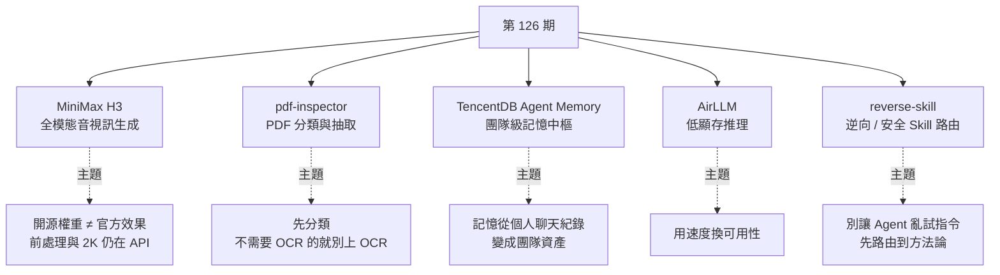
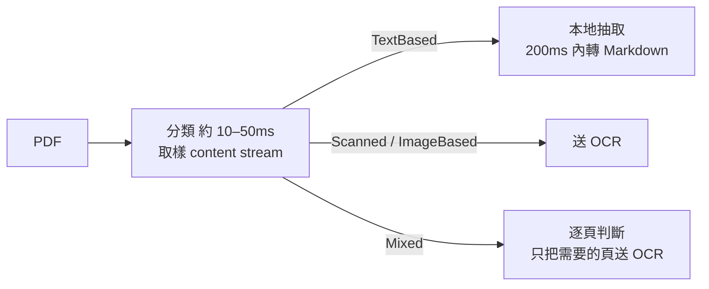
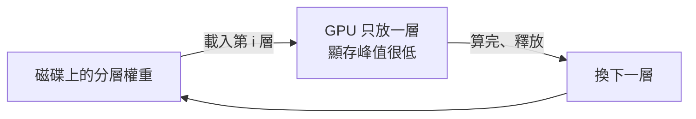

# 第 126 期:MiniMax H3 全模態影音模型、PDF 解析分流、團隊級 Agent 記憶、低顯存跑大模型與逆向工程 Skill

> GitHub 一週熱點第 126 期(影片發布於 2026/8/8)。本期主軸:MiniMax 開源的全模態音視訊生成模型 **MiniMax H3**(最高 15 秒、2K、原生立體聲)、Firecrawl 先判斷「這份 PDF 到底需不需要 OCR」再處理的 **pdf-inspector**、騰訊雲把聊天 / 經驗 / 文件 / 程式碼都變成團隊資產的 **TencentDB Agent Memory**、用「逐層載入」換取 4GB 顯卡也能跑 70B 模型的 **AirLLM**,以及把逆向與安全研究任務路由到正確方法論與工具鏈的 **reverse-skill**。

---

## 本期速覽



---

## 1. MiniMax H3 —— MiniMax 開源的全模態音視訊生成模型

- **連結:** GitHub <https://github.com/MiniMax-AI/MiniMax-H3> · Hugging Face <https://huggingface.co/MiniMaxAI/MiniMax-H3>
- **Repo 現況(2026/10 查核):** 約 9,700 stars;授權為 **MiniMax H3 Community License Agreement**(自訂社群授權,不是 MIT / Apache 這類 OSI 授權,商用前要讀條款)。

**它能做什麼:** 通用全模態生成系統,能統一理解由**文字、圖片、影片、聲音**組成的多模態上下文,輸出帶**原生立體聲**的影片,最長 15 秒、最高 2K。週報作者說它的整體評測在開源影片模型中是**絕對第一**,和幾個閉源模型差距也不大。

| 規格 | 內容 |
|---|---|
| 輸出長度 | 4–15 秒 |
| 解析度 | 短邊預設 768px;經 H3-Regenerate-2K 可到 2K |
| 影格 / 音訊 | 24 FPS;32 kHz 立體聲 |
| 對白語言 | 穩定支援中、英、日、韓、法、德等 11 種 |

**兩種輸入模式:**

| 變體 | 模式 | 輸入 |
|---|---|---|
| **H3-Base-FL2VA** | 首尾幀模式 | 0 張圖 = 文生影片;1 張 = 首幀或尾幀生影片;2 張 = 首尾幀生影片 |
| **H3-Base-Ref2VA** | 全參考模式 | 最多 9 張圖、3 段影片、3 段音訊,總檔案數最多 12 個 |

**系統不是單一模型,而是三段:**


> ⚠️ **開源的邊界(橘色是沒開源的部分):** 這次開源的主要是 H3-Base 的兩個 checkpoint(核心是 33B 參數的稠密單流 Transformer,文字編碼器沿用 Qwen3-VL-32B)。**H3-Context-IR 與 2K 重生成流程沒開源**,要用 MiniMax 官方 API。所以下載權重後**不可能完美複製海螺(Hailuo)的官方效果**——覺得效果有落差是正常的。

**貼心的小細節:** 開源時附了 9 個 skill,其中 `h3-prompt-writing` 是純 Markdown 的提示詞寫作 skill,任何能讀 `SKILL.md` 的 Agent 都能用,幫不熟影片生成的人寫出更好的提示詞:

```bash
npx skills add https://github.com/MiniMax-AI/MiniMax-H3 --skill h3-prompt-writing
```

**週報作者的比較與判斷:**

- **對比 Seedance 2.5:** 網路上大量比較。Seedance 單次支援 30 秒連續影片、原生 4K 同步音視訊、最多 50 個多模態參考;作者實際體感是**純看生成效果 Seedance 仍較好,商業場景追求效果就直接選 Seedance**。MiniMax 則希望透過開源彎道超車。
- **開源影片生態:** 老牌開源玩家是阿里的萬相(Wan)系列,但作者指出 2025 年之後阿里已不再更新開源的萬系列,最新版本轉向閉源。在這個時間點 MiniMax 推出開源 H3,**能再次刺激整個開源影片生態**。
- **本地部署門檻不低:** 作者估計至少需要 22GB 以上顯存,再往下量化對影片模型效果就不好;目前只支援 NVIDIA 顯卡、社群成熟度有待提升。一般使用者建議先用 Web 版或 API 體驗;要自己跑,ComfyUI 的門檻相對較低(官方也列了 SGLang、vLLM、diffusers 等推理框架)。

> 📌 **補正:** 影片說明欄把 H3 的連結標成「HuggingFace 链接」,但網址其實是 GitHub repo;Hugging Face 權重頁另列於上方。

---

## 2. pdf-inspector —— Firecrawl 開源的快速 PDF 分類與抽取工具

- **連結:** <https://github.com/firecrawl/pdf-inspector>
- **Repo 現況:** Rust,MIT 授權,約 1.95 萬 stars;提供 Rust crate、Python、Node.js、瀏覽器 WebAssembly 綁定與 CLI。

**它解決什麼:** 做過資料抓取、RAG 或報告解析的人都懂——**很多 PDF 本身就是文字版,根本不需要 OCR**;把所有檔案都丟給 OCR,只會更慢、更貴。Firecrawl 的說法是約 54% 的 PDF 不需要 OCR。pdf-inspector 做的第一件事就是**分類**,再決定怎麼處理:



- 分類結果:TextBased / Scanned / ImageBased / Mixed,附 0–1 的信心分數與逐頁 OCR 路由建議。
- 不只抽文字,還轉成乾淨的 **Markdown**:依字級比例判斷 H1–H4、清單、程式碼區塊(等寬字型偵測)、表格(繪圖矩形 + 文字對齊雙模式)、多欄版面閱讀順序。
- 會偵測壞掉的字型編碼並標記,讓呼叫端可以回退到 OCR。

```python
# pip install pdf-inspector
import pdf_inspector

result = pdf_inspector.process_pdf("document.pdf")
print(result.pdf_type)   # "text_based" / "scanned" / "image_based" / "mixed"
print(result.markdown)
```

```bash
cargo install pdf-inspector
pdf2md document.pdf --compact   # 收掉目錄點線等填充,省 token
```

**Repo 自己的基準(opendataloader-bench,200 份 PDF,不開 OCR):** 總分 0.875、表格 TEDS 0.814,200 份跑完 0.47 秒;同表的 pymupdf4llm 要 17 秒、markitdown 16 秒且表格分數低很多。

> 📌 **補正(版本演進):** 影片介紹時定位是「判斷要不要 OCR、文字版直接抽」;repo 後續已加入**選擇性 OCR**——Rust / CLI / Python / Node 可以只渲染需要 OCR 的頁面、在本地跑 PP-OCRv6 Small,並保留逐頁出處。預設建置仍是純抽取,不載入 OCR 執行環境。

> 💡 週報作者觀點:實用性非常高,很適合放進自己的資料處理流程。

---

## 3. TencentDB Agent Memory —— 騰訊雲開源的團隊級 Agent 記憶系統

- **連結:** <https://github.com/TencentCloud/TencentDB-Agent-Memory>
- **Repo 現況:** TypeScript,約 2.8 萬 stars;README 標示 MIT(LICENSE 檔為騰訊格式的授權聲明,GitHub API 顯示 NOASSERTION)。

**定位:** 比一般「長短期記憶插件」再往前一步,叫 **team-level memory hub(團隊級 Agent 記憶中樞)**——讓團隊經驗形成完整循環:**工作中產生資產 → 資產在團隊中流動 → 新成員(人或 Agent)第一天就能載入團隊的「存檔」**。

它不是單純把聊天紀錄丟進向量資料庫,而是做成分層結構,強調**四類可重用資產**:

| 資產 | 來源 | 用途 |
|---|---|---|
| **Chat Memory** | 對話 | 保留偏好、事實、決策;L0 對話 → L1 原子 → L2 情境 → L3 人設,逐層蒸餾 |
| **Skill** | 完成的複雜任務與工具呼叫 | 有版本、資源檔、觸發邊界、執行步驟與驗證規則,不只是 prompt 片段 |
| **LLM-Wiki** | 產品文件、設計規格、維運手冊 | 轉成有連結圖的結構化頁面(受 Karpathy 的 LLM 知識庫啟發) |
| **CodeGraph** | 程式碼 | 索引符號、檔案、呼叫關係與影響路徑,改程式前先做影響分析 |

**接法:** 一個 Proxy、協定不變、零程式碼整合——把 Agent 的 base URL 指到 Proxy 即可,不需要插件、hook 或 MCP。官方列出支援 DeepSeek Harness、Claude Code、Codex、CodeBuddy、WorkBuddy、Hermes、OpenClaw。權限上有 `private` / `team` / `restricted` 三級可見度。

```bash
git clone https://github.com/TencentCloud/TencentDB-Agent-Memory.git
cd TencentDB-Agent-Memory/deploy/global-images
cp .env.example .env   # 填記憶組與 proxy 組兩套 LLM 參數
./start-all.sh         # 啟動 memory-core + memory-hub + proxy,面板在 http://localhost:8125
```

Repo 公布的 PersonaMem 基準:啟用前 48%、啟用後 76%。影片也提到它強調**本地優先**,可用 SQLite 系的本地後端,不只是雲端服務。

> 💡 週報作者觀點:值得關注是因為 **Agent 的記憶正從「個人聊天紀錄」變成「團隊資產」**。以前講知識庫,多半是給人看的文件;現在的記憶系統要考慮的是**人和 Agent 都能用,而且團隊可用**。
>
> 延伸閱讀:Wiki 這一層的概念來源見本庫 [[llm-wiki-karpathy]];CodeGraph 路線的取捨可對照 [[codebase-memory-vs-codegraph-two-routes]]。

---

## 4. AirLLM —— 低顯存執行大模型的推理工具

- **連結:** <https://github.com/lyogavin/airllm>
- **Repo 現況:** Apache-2.0,約 3.55 萬 stars;2023 年就有的老專案,2026 年仍持續更新。

**最吸睛的一句:** **單張 4GB GPU 跑 70B 模型,不需要量化、蒸餾或剪枝。**

**但它不會變魔術**——不會讓你的 4GB 顯卡變成 H100。原理是**把模型逐層切開、按序載入**:每次只把一層權重搬進 GPU 算完再換下一層,把顯存峰值壓下來。代價是**速度與磁碟 I/O 排程成本**,換來的是能跑更大的模型——本質上是**用速度與效能換可用性**。



```python
# pip install airllm
from airllm import AutoModel

model = AutoModel.from_pretrained("Qwen/Qwen3-32B")   # 傳 Hugging Face repo id 即可
input_tokens = model.tokenizer(["What is the capital of United States?"],
                               return_tensors="pt", truncation=True, max_length=128)
out = model.generate(input_tokens["input_ids"].cuda(), max_new_tokens=20,
                     use_cache=True, return_dict_in_generate=True)
print(model.tokenizer.decode(out.sequences[0]))
```

**Repo 的近期更新(自述數字):** v3.0 支援 FP8,DeepSeek-V3(671B)約 12GB、Qwen3-235B 約 3GB;MoE 模型採「逐專家串流」,只載入 token 實際路由到的專家;2026/9 起還加入**訓練**支援(凍結權重逐層串流、adapter 留在 GPU)。

> 💡 週報作者觀點:對一般人的價值在於**降低實驗門檻**。你可能不需要部署高併發服務,只是想在本地驗證某個模型跑起來效果如何——**這時候很慢,但能跑就夠了。**

---

## 5. reverse-skill —— 面向逆向工程與安全研究的 Skill 路由包

- **連結:** <https://github.com/zhaoxuya520/reverse-skill>
- **Repo 現況:** MIT 授權(其中 `CTF-Sandbox-Orchestrator/` 子目錄為 GPLv3),約 4 萬 stars;主要腳本為 PowerShell,CI 跑 Windows + Ubuntu。

**它解決什麼:** 一組給 AI Coding Agent(Claude Code、Codex、Cursor、OpenCode 等)用的安全工作流。例如叫 AI 分析一個 APK,它可能花十幾分鐘跑一堆沒用的 Python 腳本,最後也沒明確結果。reverse-skill 的做法是**不讓 Agent 亂拆指令,而是把任務路由到對應的方法論與工具鏈**——告訴它該走哪條路、用什麼工具、照什麼順序。


**支援的情境(節錄):** APK / Android、iOS、二進位(IDA / radare2 / Binary Ninja)、.NET、前端 JS 加密參數、惡意程式 / YARA、滲透測試、韌體 / IoT、patch diff / N-day、pwn、CTF(42 個子 skill)。

它**本身不做工具**,而是幫你呼叫開源或商業工具(jadx、apktool、Frida、IDA、BurpSuite 等);核心三件事:**AI 自動路由、按需補齊工具鏈、自我進化的經驗庫**。

```bash
git clone https://github.com/zhaoxuya520/reverse-skill.git
# 依平台刷新工具索引,看本機偵測到哪些工具
powershell -File skills/scripts/refresh-tool-index.ps1   # Windows
bash skills/scripts/refresh-tool-index.sh                # Linux / macOS
```

> 📌 **補正:** 影片說 skill 目錄有「20 多條場景路線」;repo 目前標示為 **44 條路由規則、45 個核心 skill 模組、175 個回歸測試案例**(專案持續擴充中)。

> ⚠️ 週報作者與 README 都強調:適合 **CTF 學習與企業內部授權的安全分析 / 測試**,不要拿去做邊界不清楚的攻擊性嘗試。它的流程在動手前有一道 **scope 閘門**(確認授權與網路範圍,未就緒不對目標動作)。

---

## One more thing:兩份資料

| 資料 | 重點 |
|---|---|
| 普華永道(PwC)《全球人工智能效能研究》中國報告 | 談的不是「企業有沒有用 AI」,而是**到底有沒有收益**。研究全球 1,217 家企業,AI 收益**高度集中在前 20% 的 AI 領軍企業**,它們拿走了 **74% 的 AI 經濟收益** |
| 《Agentic Design Patterns》 | Google 資深工程主管 Antonio Gulli 公開發布的書,約 400 頁,把 Agent 系統拆成 **21 個模式**,每章都有模式說明、使用場景與程式碼範例 |

---

## 應用案例 / 怎麼用在自己的工作

1. **影片生成選型:先問「要效果還是要可控」。** 做商業廣告、追求成片品質 → 照作者建議直接用 Seedance 這類閉源服務。要做批次、可私有化、能 fine-tune 的流程(例如電商把商品圖批次轉成 8 秒展示短片)→ 才考慮 H3,而且要接受「沒有 Context-IR 與 2K 重生成,效果會打折」,前處理得照官方 Prompting Guidance 自己做,或至少先裝 `h3-prompt-writing` skill。
2. **RAG 入庫前先跑 pdf-inspector 分流:** 例如每月要入庫 5,000 份財報與合約 PDF,先用 `process_pdf` 分類,TextBased 直接轉 Markdown 入庫,只有 Scanned / Mixed 的頁面才送付費 OCR。若真如官方說的過半不需 OCR,OCR 帳單與處理時間都能砍掉一大截;`--compact` 還能減少目錄點線浪費的 token。
3. **團隊共用 Agent 記憶從「一句昂貴的話」開始:** README 的例子很典型——「別重構舊的 auth 模組,行動版還在用」。把這種踩過坑才知道的脈絡存成 team 可見的 Chat Memory,新進同事的 Claude Code 透過 Proxy 一接上就知道,不用再靠人口頭重複。敏感資訊記得設 `private` 或 `restricted`。
4. **用 AirLLM 做「這個模型值不值得部署」的冒煙測試:** 想知道某個 70B 模型對你的中文客服問答是否明顯比 8B 好?在 4–8GB 顯卡的筆電上用 AirLLM 逐題跑 20 個代表性問題、比較答案品質——慢沒關係,結論出來再決定要不要租 GPU 正式部署。不要拿它做線上服務。
5. **reverse-skill 適合拿來練 CTF 與做授權的 App 安全自查:** 例如公司自家 Android App 上架前,讓 Agent 透過 `apk-reverse` 路線用 jadx / apktool 檢查是否把 API key 寫死在程式碼裡;先跑 `refresh-tool-index` 確認本機工具齊全,並在 scope 檔寫清楚授權範圍。可對照本庫 [[cloudflare-security-audit-skill-pipeline]] 的安全稽核 skill 流水線設計。
6. **把 PwC 的「74% 收益集中在前 20%」當成自評問題:** 你的團隊用 AI 是停在「每人自己開聊天視窗」,還是已經把經驗沉澱成可共享的資產(本期的 TencentDB Agent Memory 正是這個方向)?領先者與其他人的差距,多半就在這一步。

---

## 來源

- 影片:「Github一周热点126期」MiniMax全模态视频模型、PDF解析、团队Agent记忆、低显存跑大模型、逆向工程Skill(2026-08-08,約 8.3 分鐘):<https://www.youtube.com/watch?v=yEQfbuFT3B0>
  - 該片無字幕,講解內容以 CPU 版 Whisper(faster-whisper)轉錄取得,非官方字幕,可能有少量聽寫誤差;專案清單取自影片說明欄。
- 本期專案:
  - MiniMax H3:<https://github.com/MiniMax-AI/MiniMax-H3>(權重:<https://huggingface.co/MiniMaxAI/MiniMax-H3>)
  - pdf-inspector:<https://github.com/firecrawl/pdf-inspector>
  - AirLLM:<https://github.com/lyogavin/airllm>
  - reverse-skill:<https://github.com/zhaoxuya520/reverse-skill>
  - TencentDB Agent Memory:<https://github.com/TencentCloud/TencentDB-Agent-Memory>
- 延伸(本庫):[Karpathy 的 LLM Wiki](../ai-agents/memory-retrieval/llm-wiki-karpathy.md) · [Codebase-Memory-MCP vs CodeGraph](../ai-agents/memory-retrieval/codebase-memory-vs-codegraph-two-routes.md) · [Cloudflare 安全稽核 Skill 流水線](../ai-agents/applications/cloudflare-security-audit-skill-pipeline.md)
