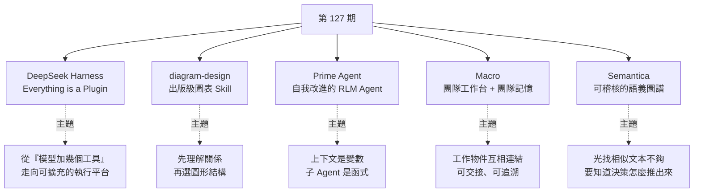
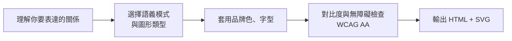
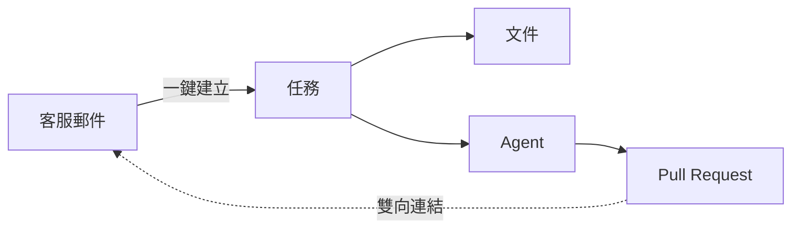

# 第 127 期:DeepSeek Harness、出版級圖表 Skill、自我進化的 RLM Agent、團隊工作台與可稽核語義圖譜

> GitHub 一週熱點第 127 期(影片發布於 2026/8/15)。本期主軸是**「Agent 從一個聊天框,長成一套可組合、可延續、可追溯的基礎設施」**:DeepSeek 開源、主打「一切皆插件」的 Agent 執行平台 **DeepSeek Harness**;讓 Claude Code / Codex 畫出出版級圖表的 Skill **diagram-design**;Prime Intellect 把上下文當變數、子 Agent 當函式呼叫的自我改進 Agent **Prime Agent**;把郵件、訊息、文件、任務、Agent、CRM 全塞進同一套系統並共享團隊記憶的 **Macro**;以及面向金融、醫療等高風險場景、可稽核的語義 / 上下文圖譜基礎設施 **Semantica**。

---

## 本期速覽



---

## 1. DeepSeek Harness —— DeepSeek 開源的 Agent Harness

- **連結:** <https://github.com/deepseek-ai/deepseek-harness>
- **Repo 現況(2026/10 查核):** TypeScript、MIT 授權,約 24.5 萬 stars;README 明示仍是 **developer preview,「會有破壞相容性的變更」**,執行前請先看 `SAFETY.md`。

**它是什麼:** 給 Agent 提供執行環境、工具呼叫與插件擴充能力的一套基礎設施(指令名 `dsh`)。最醒目的口號是 **「Everything is a Plugin」**——不把所有能力硬編碼在一個巨大的 Agent 裡,而是把模型、工具、介面、工作流都拆成插件,按需組合。底層用的是 **Cordis** 框架,其設計理念出自論文〈A Programming Paradigm for Spatiotemporal Composability〉,本身就強調可組合的系統設計。所以它**更像在搭一個 Agent 的執行平台,而不是做一個聊天視窗**。

**怎麼跑:**

```sh
# 方式一:有 Node.js 就能直接跑,預設在 http://127.0.0.1:3080 開 Web UI
npx @deepseek-ai/dsh web

# 方式二:從原始碼建置
git clone https://github.com/deepseek-ai/deepseek-harness.git
cd deepseek-harness
pnpm install && pnpm run build
pnpm dsh web
```

**週報作者的實測(配 DeepSeek V4 Flash,讓它分析自己的專案並產生介紹):**

| 觀察 | 說明 |
|---|---|
| **長** | 充分發揮 DeepSeek V4 對 Agent 長程任務的最佳化,能一路跑很久 |
| **快取命中率高** | 自家工具配自家模型,prompt cache 命中率「高得嚇人」,意味著**成本可以大幅降低** |
| **可觀測** | 作為 harness 框架,能看到完整的執行軌跡與過程細節 |

**社群生態已經長出來:** 有人做 TUI 插件把它從 Web 介面搬到終端機、有人加上 macOS 電腦操控能力,還有整活型的——把 DeepSeek 包成一個連廣告都做進去的復古網頁。可在自己的插件 repo 加上 `dsh-plugin` topic 方便被發現。

> 📌 **補正:** 影片錄製時約 8.8 萬 stars;本文查核時(2026/10)已約 24.5 萬。

> 💡 週報作者觀點:**最值得關注的不只是 DeepSeek 又開源了一個 Agent 專案,而是它把 Agent 從「一個模型 + 幾組工具」推向「可擴充的執行平台」,把整個 Agent 生態的想像空間拉高很多。** 目前更適合開發者拿來研究、搭建自己的 Agent 環境,還不適合直接當成穩定的生產級工具。
>
> 延伸閱讀:本庫 [[agent-runtime-deepseek-harness-cordis]] 有從原始碼與 Cordis 論文拆解它的插件樹與事件日誌。

---

## 2. diagram-design —— 給 AI Agent 用的出版級圖表設計 Skill

- **連結:** <https://github.com/cathrynlavery/diagram-design>
- **Repo 現況:** MIT 授權,約 4.6 萬 stars;官網 diagramdesign.dev。

**它解決什麼:** 很多人讓 AI 寫文件、寫方案、做架構說明,但配圖時往往是 **Mermaid 預設樣式的圓角方塊**,最後還得找設計師再修一輪。diagram-design 不是一般畫圖工具,而是**給 Claude Code、Codex 等編碼 Agent 使用的設計 Skill**,目標是直接產出出版級資訊圖。作者自己的說法是:「No shadows. No Mermaid slop.」

**產出物的特性:**

- 每種圖都有 **minimal light、minimal dark、full-editorial** 三種靜態變體。
- 輸出是**自包含的 HTML + SVG**:不需建置步驟、不依賴 JavaScript 或外部圖片,瀏覽器直接開。
- 設計原則:「最高品質的動作通常是刪除」——每個節點都要有存在的理由,**強調色只留給讀者第一眼該看的 1–2 個東西**,目標資訊密度 4/10。

**生成流程:**



**品牌化(onboarding):** 對 Agent 說「onboard diagram-design to https://你的網站」,它會抓首頁、萃取主色與字型堆疊,對映成 `paper / ink / muted / accent` 等語義 token,給你看 diff 後寫進 `references/style-guide.md`。之後每張圖都是你的品牌色。多客戶可存成具名 profile,在專案放 `.diagram-design` 標記切換。

**安裝(Claude Code):**

```text
/plugin marketplace add cathrynlavery/diagram-design
/plugin install diagram-design@diagram-design
```

其他 Agent Skills 相容的工具可用 `npx skills add cathrynlavery/diagram-design`。它也能把既有的 draw.io、Mermaid、Excalidraw 圖**重繪**成這套設計語言。

> 📌 **補正:** 影片說內建 27 種視覺類型、三種風格為「亮色、暗色、可編輯」;repo 現已擴充到 **42 種圖表類型**(新增 Sankey、魚骨圖、Wardley map、看板、使用者旅程、UML 類別圖、資料庫 schema 等),三種變體實為 minimal light / minimal dark / full-editorial。影片提到最新版加入的是**語義模式(semantic patterns)**與可選的無障礙動效——動效預設關閉,一般輸出仍是靜態、不含腳本。

> 💡 週報作者觀點:實用價值不錯,相比之前生成的架構圖,**資訊結構、視覺層次與品牌可移植性**都明顯更好。

---

## 3. Prime Agent —— Prime Intellect 開源的自我改進 RLM Agent

- **連結:** <https://github.com/PrimeIntellect-ai/prime-agent>
- **Repo 現況:** Rust,約 2.2 萬 stars;README 標示 MIT 授權(GitHub API 的授權欄位顯示 NOASSERTION,以 README 與 LICENSE 檔為準)。論文 arXiv 2608.23552〈Prime Agent: A Self-Improving RLM Harness〉。

**它和一般聊天式 Agent 的差別:** 傳統聊天式 Agent 像加強版對話框——給任務、讀上下文、呼叫工具、回傳結果。Prime Agent 則把 Agent **放進一個可持續運行的程式設計環境**,圍繞兩個核心抽象:

| 抽象 | 做法 |
|---|---|
| **RLM(Recursive Language Model,遞迴語言模型)** | 把上下文當成**變數**(prompt-as-a-variable),把遞迴子 Agent 等工具當成**函式呼叫**,全部在一個持久化的 Python REPL 裡進行 |
| **Continual Harness(持續性 harness)** | 把補充提示詞、記憶、skill 描述、可重用的子 Agent 規格存成**持久狀態**,Agent 可以基於證據做小幅、可審查的更新 |

**幾個具體機制:**

- **一切皆程式:** 持久化 Python REPL 是內建工具,檔案操作、shell 指令、子 Agent、上下文管理都透過程式碼完成——Agent 不必每輪都從聊天記錄裡重新回想「我是誰、做過什麼、下一步做什麼」。
- **內建子 Agent:** `rlm.spawn(...)` 產生真正的子 Agent 做平行或背景工作,結果以程式方式回傳。
- **`/refine` 自我改進:** 回顧當前軌跡,對補充狀態做有證據支撐的小更新;**永遠不改寫不可變的基礎系統提示詞**,且有快照可回滾。
- **長任務:** daemon 背景執行(斷線後可 `prime-agent attach` 接回)、`/goal` 持久目標、`/heartbeat` 與排程、`/autonomous` 在回合 / token / 時間預算內自主執行。

```bash
curl -fsSL https://app.primeintellect.ai/prime-agent/install.sh | sh
cd /path/to/project && prime-agent   # 首次執行 /login 選訂閱或 API key
```

> ⚠️ README 明講:它以你的使用者權限執行模型生成的 Python 與專案指令,worker / kernel 程序**不是安全沙箱**。請在可丟棄的 clone 或乾淨 worktree 裡用。

> 💡 週報作者觀點:這裡很多是常見的 looping 思路;現在 Agent 越做越多、不少其實沒什麼亮點,但這個專案**有些想法還是挺有意思的**。
>
> 延伸閱讀:本庫 [[prime-agent-rlm-continual-harness]] 整理了官方部落格對「用一個 IPython kernel 取代所有工具 schema」的完整論述。

---

## 4. Macro —— 開源團隊工作台與團隊級記憶

- **連結:** <https://github.com/macro-inc/macro>
- **Repo 現況:** Rust(前端 SolidJS),約 4,600 stars,**AGPL-3.0**;強調「完全開源,不是 open core」,可依 AGPLv3 自架。

**它想做什麼:** 把**郵件、訊息、文件、任務、Agent、通話、檔案、PR、CRM** 全部放進同一套系統,再加上一層**團隊級記憶**。團隊自述的動機:公司擴到 20 人左右時,每個團隊各用各的工具(Slack、Linear、Notion、HubSpot、Superhuman),整家公司靠 MCP 和 Zapier 黏在一起,「公司變得不可計算」。

**關鍵設計:** 每個模組底下共用同一個後端,物件間的引用以**雙向圖**儲存——



所以「為什麼要做這件事 → 任務 → Agent → PR」整條鏈都能在同一系統裡追溯。

**團隊記憶怎麼做:** 每天用 cron 把團隊對話、DM、收發的郵件、建立 / 完成的任務等**一次性綜合**,再與既有記憶合併成新記憶;記憶以**純 Markdown** 儲存、可匯出,也透過 MCP 開放給外部 Agent(Claude Code、Codex 等)。另外它的 MCP 介面號稱幾乎涵蓋 UI 能做的所有操作、且不設速率限制。

> 💡 週報作者觀點:方向聽起來很大,但抓住了真實痛點——**一個人負責的工作,交接與追溯都很難**。這類專案的難點**不在介面,而在資料模型與組織習慣**。最近幾期也介紹過類似專案,可以看出大家正積極解決「AI 融入企業」的真實痛點。

---

## 5. Semantica —— 面向可稽核 AI 系統的語義圖譜基礎設施

- **連結:** <https://github.com/semantica-agi/semantica>
- **Repo 現況:** Python,MIT 授權,約 1.4 萬 stars;自述為「Graph-Native Infrastructure for Context and Accountable AI Systems」。

**它解決什麼:** 過去一年大家都在講 RAG、向量資料庫、上下文;但在**金融、醫療**等關鍵場景,只靠「找幾段相似文本讓模型總結」不夠——還要知道**資訊之間是什麼關係、決策是怎麼推出來的**。Semantica 想把這些都放進圖裡:從企業資料抽取實體、關係、證據與約束,建成 **Context Graph / 知識圖譜**,在上面做圖分析、因果推理、決策追溯與治理。

| | 向量 DB + RAG | Semantica |
|---|---|---|
| 召回方式 | embedding 相似度 | 圖遍歷 + 語義搜尋 |
| 決策歷史 | 不保存 | 一等公民、可查詢 |
| 出處 | 無 | W3C PROV-O,連到來源 |
| 推理 | 無 | forward chaining、Rete、Datalog、SPARQL(確定性、可解釋) |
| 衝突偵測 | 靜默覆蓋 | 偵測、標記、解決 |

圖譜建構、推理、出處層都是**確定性的,不需要 LLM**;用到 LLM 時也是可選且不綁廠商。提供 CLI、REST API、MCP Server,並整合 Claude Code、Codex 等 Agent 開發環境。

```python
# pip install semantica
from semantica.context import ContextGraph

graph = ContextGraph(advanced_analytics=True)
decision_id = graph.record_decision(
    category="vendor_selection",
    scenario="Choose cloud provider for HIPAA workload",
    reasoning="AWS offers BAA, mature HIPAA tooling, and existing team expertise",
    outcome="selected_aws",
    confidence=0.93,
)
chain = graph.trace_decision_chain(decision_id)          # 完整因果鏈
similar = graph.find_similar_decisions("cloud vendor")   # 找先例
compliant = graph.check_decision_rules({"category": "vendor_selection"})  # 政策閘門
```

> ⚠️ README 特別說明:它提供的是**系統層級**的可解釋性(餵進去的上下文、產出的決策、套用的政策、執行軌跡),**不是**解釋 LLM 內部推理。

> 📌 **補正:** 影片說明欄的連結 `semantica-agi/semantica----` 是 404,正確 repo 為 `semantica-agi/semantica`。

> 💡 週報作者觀點:**不太適合小型個人專案**——建模成本與系統維護複雜度都很高,專案小的話沒有必要。
>
> 延伸閱讀:本庫 [[neuro-symbolic-ontology-guardrails-frank-coyle]] 講「用本體論給大模型套邏輯護欄」,正是 Semantica 用 OWL / SHACL 做的事的概念版。

---

## One more thing:兩份資料

| 資料 | 重點 |
|---|---|
| 脈脈《搶佔 AI 新生代:2026 名校生求職招聘動態》 | 2026 年 1–5 月新發校招 AI 職缺**年增 47.3%**;AI 職缺在全部校招職缺的滲透率從 **26.4% 升到 37.56%**;招聘看重的條件裡,**專案經驗、開源、GitHub、論文 / 競賽**已排在學校標籤之前 |
| 《2026 阿里雲 AI Agent 安全最佳實踐》 | 核心觀點:**Agent 安全不能指望模型輸出**,要把 Agent 當成真正能執行操作的主體來管理;Agent 越接近正式業務,越不能只靠最後加一道護欄補,而要在**工具設計、權限邊界、上下文來源、日誌稽核**一起做 |

---

## 應用案例 / 怎麼用在自己的工作

1. **用 DeepSeek Harness 做「模型 × harness」成本實驗:** 同一個任務(例如「讀這個 repo 產出架構介紹」)分別用 `dsh` 配 DeepSeek V4 Flash、與你平常用的 Agent 各跑一次,記錄總 token 與快取命中率。週報作者觀察到「自家工具配自家模型」快取命中率極高——若你的工作是大量重複讀同一 codebase 的長任務,這可能直接決定月帳單。
2. **把技術文件的 Mermaid 圖升級成可發表的版本:** 寫完設計文件後,對 Claude Code 說「把這份文件裡的 Mermaid 流程圖用 diagram-design 重繪成 architecture 類型」,先跑一次 onboarding 套公司官網的品牌色,產出的 HTML + SVG 可直接嵌進部落格或簡報。內部筆記仍可保留 Mermaid(可 diff、可版控),對外發表才用重繪版。
3. **Prime Agent 適合「跑一整晚」的研究型任務:** 例如批次跑一組模型評估:用 `/goal` 設定目標、`/autonomous` 設好 token 與時間預算、在乾淨 worktree 裡讓它背景跑,隔天 `prime-agent attach` 回來看結果,再用 `/refine` 把這次學到的操作經驗沉澱成補充提示詞。務必記得它不是沙箱。
4. **評估 Macro 時先畫「物件連結圖」:** 列出你團隊目前一張客服單從進來到修好會經過哪些工具(郵件 → Slack → Linear → GitHub),每一次換工具就是一次脈絡遺失。若斷點很多,Macro 這種雙向圖式的工作台才有價值;但它是 AGPL-3.0,自架改程式碼後若對外提供服務,要評估開源義務。
5. **高風險決策才上 Semantica:** 例如保險理賠或授信審核的 Agent,監管單位會問「為什麼拒絕這筆」。用 `record_decision` 記下每次決策的情境、理由、信心值,事後 `trace_decision_chain` 拿出因果鏈與 PROV-O 出處匯出——這是向量 RAG 給不了的。個人知識庫或小專案就別上,維護成本不划算。
6. **把阿里雲報告的四個面向當成 Agent 上線檢查表:** 工具設計(工具粒度是否過大)、權限邊界(最小權限)、上下文來源(外部輸入是否可能夾帶提示注入)、日誌稽核(每個動作可追溯)。對照本期的 Prime Agent「不是沙箱」警告與 Semantica 的決策溯源,正好是這張檢查表的兩端。

---

## 來源

- 影片:「Github一周热点127期」DeepSeek Agent Harness、AI画图Skill、自进化编程Agent、团队工作台和可审计语义图谱(2026-08-15,約 8.5 分鐘):<https://www.youtube.com/watch?v=TY4JQhwEm1s>
  - 該片無字幕,講解內容以 CPU 版 Whisper(faster-whisper)轉錄取得,非官方字幕,可能有少量聽寫誤差;專案清單取自影片說明欄。
- 本期專案:
  - DeepSeek Harness:<https://github.com/deepseek-ai/deepseek-harness>
  - diagram-design:<https://github.com/cathrynlavery/diagram-design>
  - Prime Agent:<https://github.com/PrimeIntellect-ai/prime-agent>
  - Macro:<https://github.com/macro-inc/macro>
  - Semantica:<https://github.com/semantica-agi/semantica>
- 延伸(本庫):[DeepSeek Harness 與 Cordis](../ai-agents/foundations/agent-runtime-deepseek-harness-cordis.md) · [Prime Agent:RLM 與 Continual Harness](../ai-agents/foundations/prime-agent-rlm-continual-harness.md) · [本體論邏輯護欄](../ai-agents/foundations/neuro-symbolic-ontology-guardrails-frank-coyle.md)
