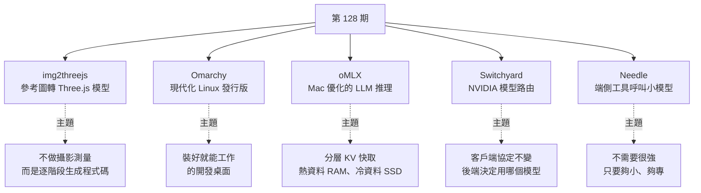
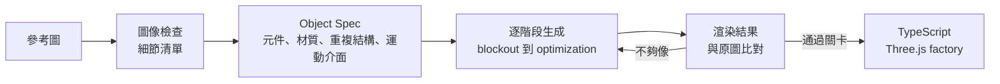
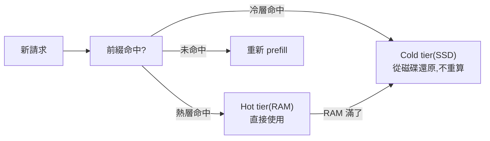
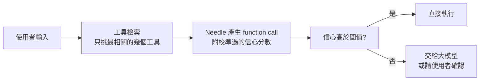

# 第 128 期:圖片生成 Three.js 3D 模型、Omarchy、Mac 本地推理 oMLX、NVIDIA Switchyard 模型路由與端側小模型 Needle

> GitHub 一週熱點第 128 期(2026/8/22 發布)。本期主軸:讓 coding agent 看圖「用程式碼雕出」3D 模型的 **img2threejs**、DHH 打造的現代化 Linux 發行版 **Omarchy**、專為 Apple Silicon 優化的本地推理伺服器 **oMLX**、NVIDIA 出手做的大模型路由函式庫 **Switchyard**,以及只有幾十 MB、專做工具呼叫的端側模型 **Needle**。最後分享安永中國經濟半年報與一份全球 AI 行業報告。

---

## 本期速覽



---

## 1. img2threejs —— 基於參考圖生成 Three.js 3D 模型

- **連結:** <https://github.com/img2threejs/img2threejs>
- **現況:** 約 17.7k stars、Apache-2.0、Python(工具腳本只用標準函式庫);版本 2.0.0。

**它不走傳統路線:** 不用攝影測量(photogrammetry)、也不做網格提取或下載現成素材,而是讓 agent 根據參考圖,**逐步生成可檢視、可修改、能在瀏覽器裡跑的 Three.js 程式碼**——整個模型就是 procedural 的程式碼,天然可以接動畫。

**流程:**



repo 列出的階段是 `blockout → structural → form → material → surface → lighting → interaction → optimization`,每一輪都拿渲染結果跟原圖比對,直到每個「辨識特徵」都過門檻。

**分工設計(省 token 的關鍵):** 機械性工作交給確定性的 Python 腳本——檢查 JSON spec、做圖片比對、記錄狀態(`forge/state.py` 可中斷後續跑)、品質把關;**模型只負責「看圖」與「判斷這一輪像不像」以及寫程式碼**。

**使用:** 它是給 Claude Code、Codex 這類 coding agent 用的 skill:

```bash
npx --yes img2threejs@latest install --dry-run   # 預覽會裝進哪些 agent host
npx --yes img2threejs@latest install             # 裝進所有偵測到的 host
npx --yes img2threejs@latest install --host claude
```

裝好後在 agent 裡用 `/img2threejs` 加一張圖片即可啟動。官方另有線上 Demo 圖庫,可以直接在瀏覽器旋轉模型、對照參考圖、閱讀生成的原始碼。進階玩法透過另一個 `img2` harness 安裝 domain plugin(例如角色、CS2 武器)。

> ⚠️ **限制:** 一張圖看不到物體背面,也不可能憑空還原隱藏結構,所以專案**明確允許輸出近似結果**;人物肖似度路線也會回報各區域的信心並在需要時要求更多視角。

> 💡 週報作者的觀點:對不太懂建模的人來說太酷了,在**產品展示、遊戲資產原型、網頁 3D 教學**都很有用。

---

## 2. Omarchy —— 現代化 Linux 發行版

- **連結:** <https://github.com/basecamp/omarchy>(📌 補正:repo 已轉移到 **<https://github.com/omacom/omarchy>**,舊網址自動轉址)
- **現況:** 約 44k stars、MIT、Shell;repo 自述「Beautiful, Modern & Opinionated Linux」。
- **作者:** Basecamp / 37signals 創辦人、Ruby on Rails 作者 DHH。

**定位:好看、現代、自用。** 它要解決開發者「每次裝機都要配一大堆環境」的痛點,目標是一台**裝好就能工作**的開發用 Linux 桌面。手冊列出的內建功能包括:

| 類別 | 內容 |
|---|---|
| 桌面 | 頂欄、統一快捷鍵、主題系統、統一剪貼簿與歷史 |
| 生產力 | 文字擷取與聽寫、截圖與錄影、提醒、通知 |
| 開發 | 終端機、Neovim、開發工具、Shell 工具、TUI / GUI 工具、AI 工具 |
| 系統 | Windows 虛擬機、系統快照、硬體認證、全碟加密 |

> 📌 **補正:** 影片拿它跟 Arch Linux 對比(「不像 Arch 追求極致精簡與效能」),但 Omarchy 本身**就是基於 Arch Linux**,搭配平鋪式視窗管理器 Hyprland 與 Quickshell。準確說法是:**它是在 Arch 之上,把精簡的底子預先配成一套完整、有主見(opinionated)的工作環境**。

**安裝方式與風險:**

- 用 **ISO** 安裝;可選**全碟安裝**(會清空所選磁碟)或**裝在未配置空間**、與 Windows 雙系統開機(需先關閉 BitLocker)。
- 必須在 BIOS 關閉 Secure Boot / TPM;因預設全碟加密,開機輸入密碼要用有線或 2.4GHz 鍵盤。
- 支援 Intel Mac,但 M 系列 Mac 目前不直接支援,且在 Mac 上只能當唯一系統。

> ⚠️ 週報作者的建議:**不建議直接在主力機上體驗**,最好先用虛擬機試。這種偏自用的發行版明顯受作者審美與工作流左右,不喜歡它的配置方式就會不太適應。
>
> 延伸:後續的 Omarchy 4 把多個 AI 編程 Agent 接進系統層,見 [[omarchy-4-agent-as-os-citizen]]。

---

## 3. oMLX —— 為 Mac 優化的 LLM 推理伺服器

- **連結:** <https://github.com/jundot/omlx>
- **現況:** 約 22.6k stars、Apache-2.0、Python 3.11–3.13;僅支援 Apple Silicon。
- **一句話:** 「LLM inference, optimized for your Mac」——**連續批次處理(continuous batching)+ 分層 KV 快取**,直接從 macOS 選單列管理。

**為什麼需要它:** 以前這類推理優化工具大多針對 NVIDIA 顯卡,Mac 使用者終於也有了。在 Mac 上跑本地模型,模型一多就會來回切換記憶體;同一個 agent 反覆送出帶相同前綴的請求,就會反覆重算。

**核心機制:分層 KV 快取**



熱資料放記憶體;熱層滿了,區塊以 safetensors 格式卸到 SSD;之後遇到相同前綴就從 SSD 還原而不是從頭算——**連伺服器重啟後都還在**。這對 Claude Code 這類長上下文、前綴高度重複的 coding agent 特別有感,能明顯縮短 prefill 時間。

**其他功能:**

| 功能 | 說明 |
|---|---|
| 多模型服務 | 文字 LLM、VLM、OCR 模型(DeepSeek-OCR、GLM-OCR 等)、embedding、reranker 同一個伺服器 |
| 模型管理 | 手動載入 / 自動卸載、每個模型可設閒置 **TTL**、常用模型可 **pin** 在記憶體 |
| API | OpenAI 相容 + **Anthropic Messages(`/v1/messages`)**,方便 Claude Code、Codex 等工具接入 |
| 管理介面 | `/admin` 網頁儀表板:監控、模型管理、聊天、benchmark、逐模型設定 |

**安裝與啟動:**

```bash
# 方式一:下載 .dmg 拖進 Applications
# 方式二:Homebrew
brew tap jundot/omlx https://github.com/jundot/omlx
brew install jundot/omlx/omlx
omlx start                          # 背景服務
omlx serve --model-dir ~/models     # 或前景執行
# 之後任何 OpenAI 相容客戶端連 http://localhost:8000/v1
```

> 💡 週報作者的觀點:如果你有一台**大記憶體的 Mac**,用它來提升本地模型效率非常值得。

---

## 4. Switchyard —— NVIDIA 的大模型路由工具

- **連結:** <https://github.com/NVIDIA-NeMo/Switchyard>
- **現況:** 約 3.3k stars、Apache-2.0、Rust;pre-1.0。

**背景:** 模型與供應商越來越多,「幫你統一調度、自動路由」的工具過去多半是個人或小公司在做,這次 NVIDIA 也出手了。

**它做什麼:** 一個 Rust 寫的函式庫,能在 **OpenAI Chat、OpenAI Responses、Anthropic Messages** 這些協定之間轉換——客戶端繼續用熟悉的介面,Switchyard 在後面決定交給哪個模型、哪家供應商,再把回應轉回來。它把「高效便宜的模型」和「能力較強的模型」組成池子,依任務在成功率、成本、延遲之間取捨。

**路由演算法(免訓練):**

| 選擇 | 怎麼決定 |
|---|---|
| **Auto** | 預設:Execution(Stage)路由、便宜模型優先、信心門檻 0.5,不額外呼叫分類器 |
| **Task** | 用一個 LLM 分類器判斷便宜模型能不能處理這個任務 |
| **Execution** | 依 agent 最近的工具活動與結果訊號,在執行過程中切換模型 |
| **Composite** | 兩者結合:執行訊號不確定時,由分類器決定預設層級 |

另有 Plan/Execute、**escalation(升級路由)**、advisor、sub-agent、random 等策略。它也會記錄請求、錯誤、延遲、token 開銷,方便比較不同模型的成本與效果;並能透過本地 proxy 直接啟動 Codex 等編程 agent,把本地代理與 agent 串起來。

**三種用法:**

1. **透過現有 gateway**:OpenRouter 上把 `model` 設為 `nvidia/switchyard`;或 LiteLLM、NeMo Relay 外掛。
2. **本地試用**:`cargo install --locked switchyard-server` 起一個 OpenAI / Anthropic 相容 proxy。
3. **嵌進自己的 harness**:Rust 函式庫 `switchyard-libsy`(也有 Python 範例)。

> 📌 **補正(成熟度):** repo 標示 `switchyard-server` 是 **Demo** 等級,「僅供展示、評估與單人個人使用,不適合生產」;`libsy` 為 Beta、其餘元件為 Alpha。repo 也提醒:**便宜的單次模型呼叫,不保證「成功完成整個任務」更便宜**,要拿完整 agent 對照單一模型 baseline 來評估。

> 💡 週報作者的觀點:這類工具大公司與個人做各有優勢,不好說誰會做得更好。

---

## 5. Needle —— 端側的超小型工具呼叫模型

- **連結:** <https://github.com/cactus-compute/needle>
- **現況:** 約 13.4k stars、Apache-2.0、Python;Cactus Compute 出品。
- **定位:** 給手機、穿戴裝置、機器人、智慧家庭、汽車、微控制器用的基礎模型,**犧牲通用聊天能力**,專攻**裝置上的工具呼叫、裝置控制、結構化資訊擷取**(也能輸出 embedding)。

> 📌 **補正(版本與規格):** 影片介紹的是「4500 萬參數、推理引擎 14MB、一次完整對話約需 28MB 記憶體」的版本;repo 現已更新到 **Needle 3**:整個模型是 **8–29 MB 的單一二進位檔**(2-bit 量化),121M 參數但大部分在 engram 記憶裡、實際運算量約等於 50M 模型,宣稱在行動裝置工具呼叫上贏過大 10 倍的模型。舊版可用 `generation=2` 繼續跑。

**使用方式:** 用 Python 描述幾個工具,模型讀使用者輸入、挑要呼叫的工具並填好參數,回傳 JSON:

```python
import needle   # pip install cactus-needle

@needle.tool
def get_weather(city: str):
    "Get the current weather for a city."
    return {"city": city, "temp_c": 27, "sky": "clear"}

agent = needle.Needle(tools=[get_weather])
print(agent.run("what's it like in Lagos right now?")["results"])
```

**兩個設計亮點:**



1. **信心分數**:每個回應都帶校準過的 confidence,可以設閾值——高於就執行,低於就轉交更大的模型或讓使用者確認;沒有工具適用時回空清單而不是瞎猜。輸出由從 schema 編譯的語法約束,保證可解析。
2. **工具檢索**:不會每輪都把完整工具目錄塞給模型,而是先檢索出最相關的幾個。

同一個引擎還能載入 16.9 MB 的語音轉文字模型 **Whistle**,做到「音訊進、工具呼叫出」。

> 💡 週報作者的觀點:很多邊緣裝置上其實不需要能力特別強的模型,而是**夠小、能把特定事情做好**的模型。

---

## One more thing:兩份資料

| 資料 | 重點 |
|---|---|
| 安永《中國經濟半年報:波動分化下蓄力前行》 | 從宏觀經濟、行業表現、區域分化等角度梳理當前中國經濟;上半年 GDP 達 69.57 兆人民幣、年增 4.7%,增量創五年同期新高 |
| 全球人工智慧行業報告 | 聚焦全球 AI 產業發展脈絡,可用來觀察模型、算力、應用與企業投資之間的變化 |

> 週報作者的總結:AI 專案越來越多,真正值得持續關注的是**哪些技術開始進入工作流、哪些能力能轉化成穩定的生產效率**。

---

## 應用案例 / 怎麼用在自己的工作

1. **電商或簡報需要 3D 展示但沒有建模師**:拿商品照給 img2threejs,先產出近似的 Three.js 模型放在產品頁做 360° 旋轉預覽;因為輸出是程式碼,可以再請 agent 加上開合、旋轉等互動。背面看不到的部分記得補拍第二張圖,或在 spec 裡手動描述。
2. **把「腳本做機械檢查、模型只做判斷」當成通用設計**:img2threejs 讓 Python 負責 JSON 驗證、比對與狀態紀錄,模型只看圖下判斷。寫自己的 agent 流程時(例如報表生成),同樣把格式檢查、數字核對交給確定性程式,模型只負責需要判斷力的部分,能大幅省 token。
3. **想換 Linux 開發機先開 VM 試 Omarchy**:在 VirtualBox / UTM 裡用 ISO 裝一台,實際用一週快捷鍵與平鋪視窗,確認習慣得了再考慮雙系統;千萬別在主力機選全碟安裝,會清空磁碟。
4. **用 oMLX 讓 Mac 本地模型撐得起 coding agent**:例如 64GB 以上的 Mac,把常用的 coding 模型 pin 在記憶體、較少用的 VLM 設 TTL 自動卸載,再把 Claude Code 指到 oMLX 的 Anthropic 相容端點;長專案重複前綴走 SSD 快取,第二次以後的 prefill 會快很多。
5. **導入 Switchyard 前先跑 baseline**:先用單一強模型跑一批真實任務記錄成功率與成本,再開 Auto 路由比對——repo 自己就提醒,便宜的單次呼叫不等於任務整體更便宜。思路與 [[model-routing-compute-allocation]] 一致:重點是算力分配,而不是挑一個最便宜的模型。
6. **智慧家庭 / App 的語音指令用 Needle 做第一層**:例如「把客廳燈關掉、冷氣調到 26 度」,由 Needle 在裝置上離線產生兩個 function call;信心低於 0.7 時才轉給雲端大模型或跳出確認。可靠的結構化輸出還需要校驗與重試,見 [[reliable-structured-json-output-tool-use]]。

---

## 來源

- GitHub 一週熱點第 128 期(YouTube):<https://www.youtube.com/watch?v=rLymrqM9vCI>
  - 該片無字幕,講解內容以 CPU 版 Whisper(faster-whisper)轉錄取得,非官方字幕,可能有少量聽寫誤差;專案清單取自影片說明欄。
- 本期專案:
  - [img2threejs](https://github.com/img2threejs/img2threejs)
  - [Omarchy](https://github.com/omacom/omarchy)(原連結 <https://github.com/basecamp/omarchy>)
  - [oMLX](https://github.com/jundot/omlx)
  - [Switchyard](https://github.com/NVIDIA-NeMo/Switchyard)
  - [Needle](https://github.com/cactus-compute/needle)
- 延伸(本庫):[Omarchy 4:Agent 成為作業系統一等公民](../ai-agents/applications/omarchy-4-agent-as-os-citizen.md) · [Model Routing 算力分配](../ai-productivity/model-routing-compute-allocation.md) · [可靠的結構化 JSON 輸出](../ai-agents/foundations/reliable-structured-json-output-tool-use.md)
