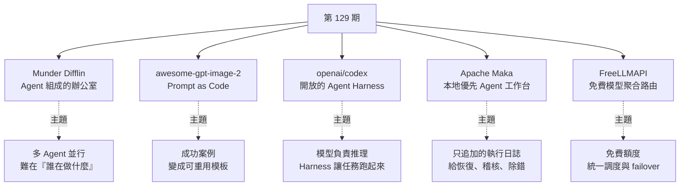
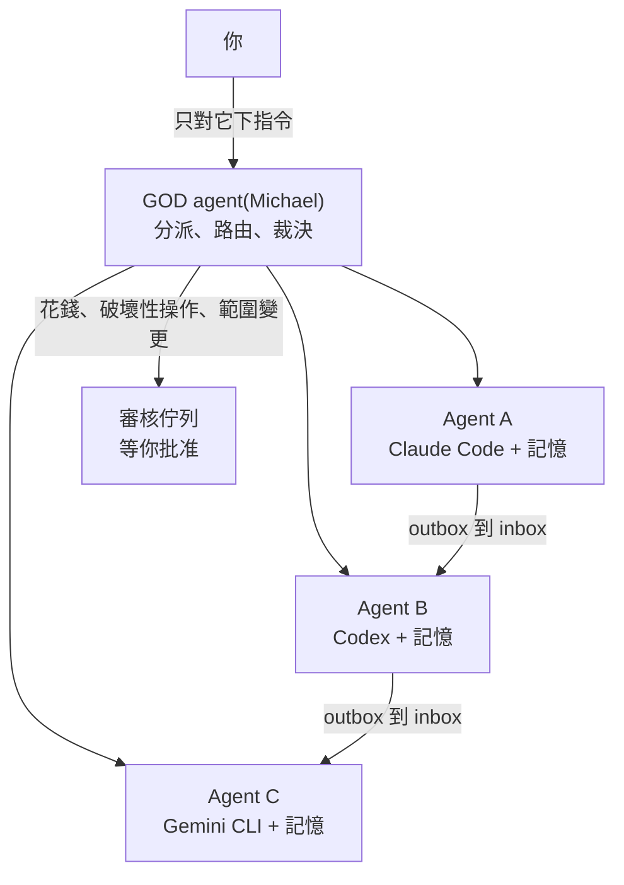
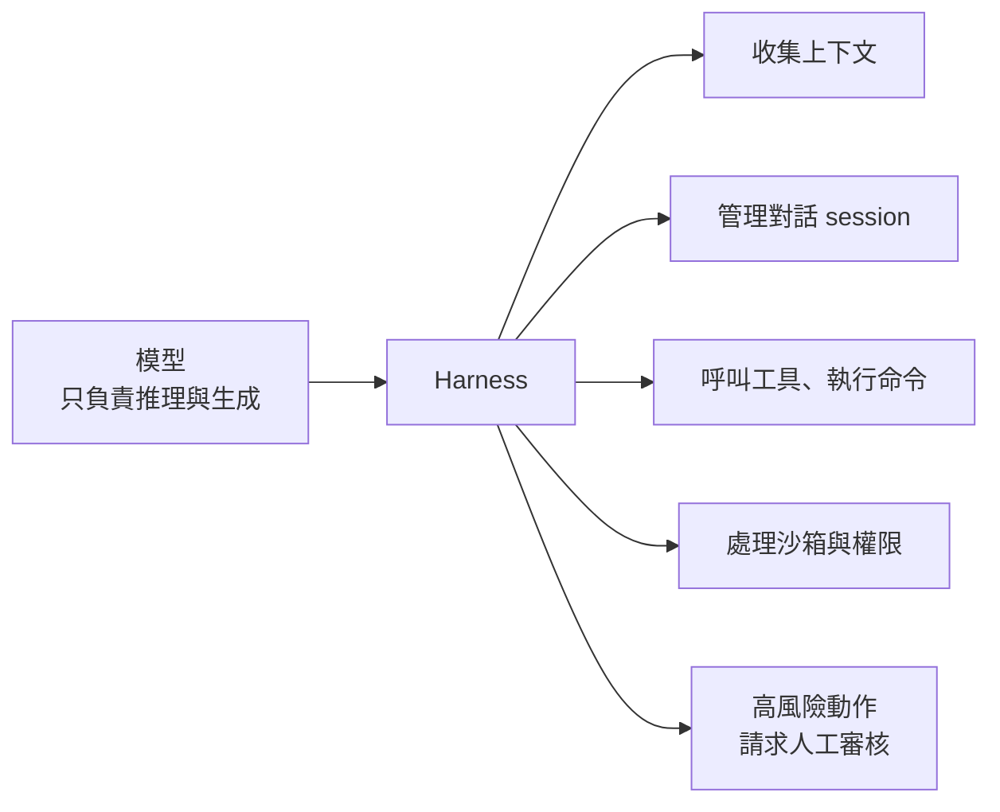
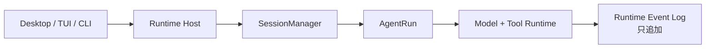

# 第 129 期:Agent 辦公室、GPT-Image-2 提示詞庫、Codex Harness、Apache Maka 與免費模型路由

> GitHub 一週熱點第 129 期(2026/8/29 發布)。本期主軸:把多個 coding agent 變成一間像素風「辦公室」來協作的 **Munder Difflin**、把 GPT-Image-2 案例拆成可重用模板與 Skill 的 **awesome-gpt-image-2**、因官方文章重新定位而再度爆紅的 **Codex Harness**、Apache 孵化中的本地優先 Agent 工作台 **Maka**,以及把 34 家免費模型額度聚合到單一入口的 **FreeLLMAPI**。最後分享人形機器人企業畫像與 Token 工廠兩份報告。

---

## 本期速覽



---

## 1. Munder Difflin —— 一間由 Agent 組成的辦公室

- **連結:** <https://github.com/chaitanyagiri/munder-difflin>(📌 補正:repo 已轉移到 **<https://github.com/HarnessMD/munder-difflin>**,舊網址會自動轉址)
- **現況:** 約 8.6k stars、MIT 授權、TypeScript;目前版本 0.5.3,標示為 pre-release。
- **名字由來:** 影集《辦公室》(The Office)裡的紙業公司 Dunder Mifflin 的諧音梗;負責調度的「你的分身」就叫 **Michael**(劇中的經理)。

**它解決什麼:** 作者同時開著好幾個 agent CLI,面對一排終端機視窗,覺得「沒有靈魂」也難以管理。於是把每個終端 agent 變成辦公室裡的一位「員工」:

| 元件 | 做法 |
|---|---|
| **每個終端就是一個 Agent** | `claude`、`codex`、Gemini CLI / Antigravity、`grok`、`kimi`、`qwen`、`opencode`、`crush`、`pi`、`copilot`、Cursor 等 CLI 都以真實行程跑在 `node-pty` 裡,用 xterm.js 原樣渲染;也支援自帶 key 與 Ollama / LM Studio / vLLM 本地模型 |
| **信箱(hive)** | 一個本地 git repo,裝的是純文字檔。Agent 只寫自己的 `outbox/`,由 harness 的 router 投遞到收件者的 `inbox/`;**Agent 從不碰 git**(單一 committer 設計,避免 `index.lock` 損毀) |
| **GOD agent(Michael)** | 你只跟它對話。它讀每個請求、自行處理例行事項;只有**花錢、破壞性操作、範圍變更**這類關鍵事項才丟進**審核佇列**等你批准 |
| **記憶** | Markdown 優先的記憶層 + 語意召回索引,讓 agent 跨 session 記得學過的東西 |
| **可視化** | Pixi.js 像素風辦公室:agent 化身成角色在工位間走動,互傳訊息時「信封」在桌間飛來飛去;可直接打字介入任一 session、瀏覽它的檔案與 git 歷史 |



**使用:** 到下載頁安裝對應作業系統的安裝包即可(macOS 版已簽章公證),不需要 Node 或自己 build;但機器上至少要有一個 agent CLI。專案內也附了 `HIVE.md`(多 agent 設計)、`SPEC.md`(終端 / 事件層)、`DESIGN.md`(視覺系統)等架構文件。

> 📌 **補正(商業模式):** 開源版免費,但 0.5.x 起另有付費 **Pro**(年費方案),例如會議轉錄「Stapler」、新版側欄等屬於 Pro 功能。評估時要分清楚哪些是開源核心、哪些是付費加值。

> 💡 週報作者的觀點:多個 agent 並行,**最難的不是啟動,而是知道誰在做什麼、有沒有任務卡住、成本怎麼控制**。這個專案的思路和作者自己前陣子的想法非常吻合,實作方式更好;再加上像素風的遊戲化呈現(作者從社群頭像推測開發者是任天堂老玩家),他打算好好研究。

---

## 2. awesome-gpt-image-2 —— GPT-Image-2 提示詞案例、模板與 Agent Skill

- **連結:** <https://github.com/freestylefly/awesome-gpt-image-2>
- **現況:** 約 34k stars、MIT 授權;530+ 個案例、20+ 套工業級模板,並新增 GPT Image 2.5 的同提示詞對比專區。

**核心概念:Prompt as Code。** 一般人用 AI 生圖,最大的問題往往不是不會寫提示詞,而是**每次都從零試**——今天做新衣圖、明天做海報,換個主題之前的經驗就很難複用。這個專案做了三件事:

1. **收集**:大量能生出好圖的 GPT-Image-2 提示詞案例(完整提示詞 + 生成紀錄)。
2. **拆解與重組**:把散文式提示詞壓成結構化協議——主體、光線、材質、版面、細節拆成可組合的「原子 schema」,方便批次生成與自動化流程。
3. **模板化**:按用途分成 UI 介面、圖表資訊圖、海報字體、產品電商、品牌 Logo、建築空間、攝影寫實、插畫、角色、分鏡敘事、古風歷史、文件排版等類別,讓你把一個成功案例改造成自己的模板。

**兩個交付形態:**

| 形態 | 內容 |
|---|---|
| **網站** | 可瀏覽圖庫、看大圖、一鍵複製完整提示詞、依風格或場景篩選 |
| **Agent Skill** | `agents/skills/gpt-image-2-style-library/`:根據任務挑選合適的風格模板、類別與場景標籤,再產生 GPT-Image-2 提示詞 |

> 💡 週報作者的觀點:現在大家多少都會玩 AI 生圖,這類專案的實用性非常高。

---

## 3. openai/codex —— OpenAI 的開放 Agent Harness

- **連結:** <https://github.com/openai/codex>
- **現況:** 約 128k stars、Apache-2.0、Rust;README 自我描述仍是「在終端機裡跑的輕量 coding agent」。

**為什麼最近又變熱門:** 主因是 OpenAI 官方發了一篇把 Codex **重新定位**的文章——Codex 不只是編程助手,而是一套**可以嵌入其他產品的開放 Agent 平台**。

**模型 vs Harness 的分工:**



官方給的數字:**同一個 GPT-5.6(Sol),靠 harness 的「保留推理」與「上下文壓縮」,在 ARC-AGI-3 上從 13.3% 拉到 38.3%,同時輸出 token 減為原來的六分之一。**(細節見 [[codex-as-a-platform-open-agent-harness]])

**與 DeepSeek Harness 的對比(週報作者認為後者是 Harness 熱的另一個推手):**

| | DeepSeek Harness | Codex |
|---|---|---|
| 主打 | **Everything is a plugin**:模型、工具、技能、儲存、循環任務甚至 UI 都能自由替換 | 強調 **Agent loop 與產品整合** |
| 適合 | 高自由度、模組化的 Agent 開發底座 | 保留你自己的工單系統、面板或客戶後台介面,只把 Codex 放在後面當執行層 |

(DeepSeek Harness 的插件樹與事件日誌設計,可參考 [[agent-runtime-deepseek-harness-cordis]]。)

> ⚠️ **週報作者點出的常見誤解:** 很多媒體說「Codex 最近開源了 Harness」,但其實 SDK 與獨立的 app-server **早就陸續進入 Codex 倉庫**(作者指 2025 年 9 月底起),OpenAI 這次只是**發文章重新定位**。給開源營運者的啟示:**熱度上升不一定要有新東西,重新講清楚定位也能帶來一波流量。**

---

## 4. Apache Maka —— Apache 孵化中的本地優先 AI Agent 工作台

- **連結:** <https://github.com/apache/maka>
- **現況:** 約 5.7k stars、Apache-2.0、TypeScript;Apache 孵化專案(Incubating),最新 Apache 正式釋出為 0.2.0。
- **定位:** 「一個會**完整記錄它做過的每件事**的高效能 agent 工作台」。

**最值得關注的不是聊天,而是記錄。** 模型訊息、工具呼叫、工具結果、權限決定、終止事件,全部寫成**只追加(append-only)的 RuntimeEvent 日誌**:

| 一般聊天介面 | Maka 的執行日誌 |
|---|---|
| 告訴你 agent 最後得到什麼結果 | 還留下它呼叫了什麼工具、工具回了什麼、哪一步拿到權限、任務怎麼結束 |
| 主要給人看 | **給恢復、稽核與除錯用** |
| 對話就是唯一副本 | UI、下一輪 prompt、當機恢復都只是日誌的「投影」;舊的工具輸出可以離開 prompt,但不會離開日誌 |

**架構主幹:**



其他重點:Session、設定、執行紀錄都留在本機;模型自帶(雲端 API、本地模型或相容 gateway);每次評測都**公開同模型、同官方驗證器下的逐題結果**(`docs/eval/`),主張「量測而非宣稱」。CLI 支援 `run --graph` 把任務拆成平行切片、在隔離的 git worktree 裡實作再整合。

> 📌 **補正(平台):** 影片說目前有 Mac 桌面版與 CLI;repo 現況是 **macOS 正式、Windows 與 Linux 為 preview**,另有 TUI。

> ⚠️ 倉庫自己也說明:**仍是非常早期的版本**,資料格式、CLI 指令與實驗性功能都可能變動。週報作者也提到 Apache 孵化的身分本身就很有話題性。

---

## 5. FreeLLMAPI —— 免費模型資源聚合路由

- **連結:** <https://github.com/tashfeenahmed/freellmapi>
- **現況:** 約 32k stars、MIT、TypeScript;repo 描述:**34 家免費 LLM 供應商、635 個免費模型端點、每月約 74 億 token**,全部收進一個 `/v1` 入口。

**要解決的痛點:** 很多平台都給免費額度,但每家的介面、模型名稱、限流規則、金鑰設定都不一樣。FreeLLMAPI 把它們聚合到**一個 OpenAI 相容端點**後面:

| 能力 | 說明 |
|---|---|
| **不只聊天** | 也接 embedding、圖片、音訊(還有影片生成)介面;另可把任意 OpenAI 相容端點(llama.cpp、LM Studio、vLLM、Ollama)加成自訂 provider |
| **智慧路由** | 依速度、能力、相容性與剩餘額度決定由哪家供應商回應;每個回應都帶 `X-Routed-Via` header 告訴你實際是誰服務的 |
| **自動 failover** | 某個模型被限流或出錯時,自動切到備援;同一個模型有多家免費額度時,統一成一個模型條目 |
| **額度追蹤** | 逐 key 記錄用量,讓你停在每家免費上限之內;金鑰加密儲存 |

**快速開始(Docker):**

```bash
curl -fsSL https://freellmapi.co/install.sh | bash
# 開 http://localhost:3001,在 Keys 頁填各家 key、調整 Fallback Chain,
# 再拿頁首的統一 API key 給你的 OpenAI SDK 用
```

Windows 有 `.exe` 桌面安裝檔,也有 Android(Termux)與手機 App。

> 📌 **補正(授權與限制):** repo 明寫「**僅供個人實驗與學習,不適合生產**」:免費層沒有前沿模型、延遲不穩、沒有 SLA,而且每天晚些時候頂級模型額度用完、整體「智商」會下降,UTC 午夜才重置;流量經過代理時,**仍受你與各上游供應商簽的條款約束**。另外,模型目錄透過簽章 feed 自動更新,免費版拿到的是月度快照,付費版($19/年)當天更新。

> 💡 週報作者的觀點:真正有用的不只是「免費」兩字,而是底層的調度邏輯。適合個人做實驗或跑本地 demo;要放進正式業務環境必須非常謹慎——「但羊毛還是不要錯過」。

---

## One more thing:兩份資料

| 資料 | 重點 |
|---|---|
| 《2026 人形機器人企業畫像研究報告》 | 選 40 家代表性企業,從人形機器人與具身智能、核心零部件,到工業協作、醫療康養、物流等 8 個賽道,梳理北京機器人企業的布局。週報作者本週也到現場看了第二屆人形機器人運動會,認為機器人發展快到很多表現超出預期 |
| 《2026 中國 Token 工廠發展白皮書》 | 把大模型推理與 Token 呼叫放到「生產能力」的角度觀察:需求增長、智算中心供給、GPU 利用率、雲廠商集中度、國產晶片,以及東西部算力布局 |

---

## 應用案例 / 怎麼用在自己的工作

1. **同時跑 3 個以上 agent 時,先解決「可見性」再追求「並行度」**:例如一個 agent 改前端、一個寫測試、一個整理文件。Munder Difflin 的做法值得照抄——每個 agent 一個 inbox/outbox,由單一協調者決定什麼要升級給人;即使不用它,也可以在自己的流程裡規定「花錢、刪檔、改範圍」三類動作一律進審核清單。
2. **把生圖經驗變成團隊資產**:電商團隊每週要出主圖、海報、社群圖,可以仿照 awesome-gpt-image-2 的「原子 schema」,把成功案例拆成「主體 / 光線 / 材質 / 版面 / 文字」五個欄位存成模板,新需求只換欄位值,而不是每次重寫整段提示詞。
3. **評估 agent 效果前先換 harness 再換模型**:Codex 的 13.3% → 38.3% 說明同一模型在不同 harness 下差距可以超過一倍。內部做 agent 選型時,先固定模型、比較「有無上下文壓縮 / 保留推理 / 審核點」的差異,再決定要不要升級更貴的模型。
4. **想把 agent 嵌進既有後台**:例如客服系統想讓 agent 自動處理工單,可以保留原本的工單介面,只把 Codex(SDK 或 app-server)放在後面當執行層;若需要高度自訂每個元件,再考慮插件化的 DeepSeek Harness。
5. **把 Maka 的「append-only 日誌」當成設計原則**:任何要上線的 agent,至少要能回答「它呼叫了什麼工具、拿到什麼結果、誰批准的、怎麼結束的」。即使自己寫 agent,也建議把每個事件寫成只追加的 JSONL,UI 與重放都從日誌投影出來,事後除錯與稽核會輕鬆很多。
6. **用 FreeLLMAPI 做「便宜的實驗場」,但劃清資料紅線**:個人做 RAG 原型或批次分類實驗時,可以先走免費額度省錢;但含客戶個資、公司原始碼的請求絕不走免費通道,上線前換回付費 API。這和 [[model-routing-compute-allocation]] 講的「先分配算力、再挑模型」同一個思路。

---

## 來源

- GitHub 一週熱點第 129 期(YouTube):<https://www.youtube.com/watch?v=KDz1RpudZ1o>
  - 該片無字幕,講解內容以 CPU 版 Whisper(faster-whisper)轉錄取得,非官方字幕,可能有少量聽寫誤差;專案清單取自影片說明欄。
- 本期專案:
  - [Munder Difflin](https://github.com/HarnessMD/munder-difflin)(原連結 <https://github.com/chaitanyagiri/munder-difflin>)
  - [awesome-gpt-image-2](https://github.com/freestylefly/awesome-gpt-image-2)
  - [openai/codex](https://github.com/openai/codex)
  - [Apache Maka](https://github.com/apache/maka)
  - [FreeLLMAPI](https://github.com/tashfeenahmed/freellmapi)
- 延伸(本庫):[Codex 平台化與 13.3% → 38.3%](../ai-agents/applications/codex-as-a-platform-open-agent-harness.md) · [DeepSeek Harness 與 Cordis](../ai-agents/foundations/agent-runtime-deepseek-harness-cordis.md) · [Model Routing 算力分配](../ai-productivity/model-routing-compute-allocation.md)
