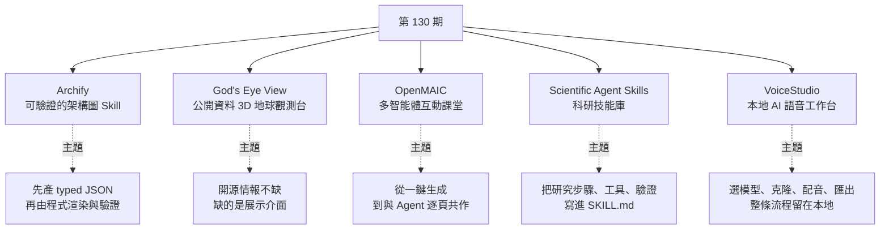
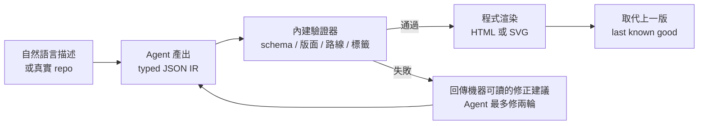

# 第 130 期:可驗證的架構圖 Skill、即時 3D 地球觀測台、多智能體 AI 課堂、科研 Agent 技能庫與本地語音工作台

> GitHub 一週熱點第 130 期(影片發布於 2026/9/18)。本期主軸:讓 Agent 先產出**有型別約束的 JSON 中間表示、再由程式穩定渲染並驗證**的架構圖 Skill **Archify**、把飛機 / 船舶 / 衛星 / 地震 / 公開攝影機等開源情報放上同一顆 3D 地球的 **God's Eye View**、清華 MAIC 團隊把一份資料變成「有老師、有同學、有白板」互動課堂的 **OpenMAIC**、把通用 Agent 變成 AI 科學家的 **Scientific Agent Skills**,以及完全本地的 ElevenLabs 替代品 **VoiceStudio**。

---

## 本期速覽



| 專案 | 類型 | 語言 / 授權 | Stars(2026/10/9) |
|---|---|---|---|
| [Archify](https://github.com/tt-a1i/archify) | Agent Skill | JavaScript / MIT | 約 8 萬 |
| [God's Eye View](https://github.com/bilawalsidhu/gods-eye-view) | 瀏覽器 3D 應用 | JavaScript / MIT | 約 4.9 萬 |
| [OpenMAIC](https://github.com/THU-MAIC/OpenMAIC) | 多智能體教學平台 | TypeScript / MIT | 約 4 萬 |
| [Scientific Agent Skills](https://github.com/K-Dense-AI/scientific-agent-skills) | Agent Skills 技能庫 | Python / MIT | 約 4.8 萬 |
| [VoiceStudio](https://github.com/debpalash/VoiceStudio) | 本地語音桌面應用 | Python / AGPL-3.0 | 約 5.5 萬 |

---

## 1. Archify —— 生成「可信」架構圖的 Skill

- **連結:** <https://github.com/tt-a1i/archify>
- **一句話:** 讓 Agent 把一段描述、一份計畫或一個程式碼倉庫,變成**可互動、可驗證、可維護**的 HTML 圖表。

**它解決什麼:** 以前讓 AI 畫架構圖,不是叫它輸出 Mermaid,就是直接生一張圖片——前者常語法錯、版面亂,後者改一個框就得整張重畫。Archify 的思路更嚴謹:



**架構重點:**

- **Typed JSON IR**:每種渲染模式都有 schema 與可重現的原始檔;Agent 只負責寫結構化資料,畫圖交給程式。
- **原子化驗證**:schema、版面、HTML/SVG、路線與標籤避讓檢查**全部通過**,才會取代上一個可用版本;失敗時 `validate --json` 回傳穩定的規則代碼、出錯對象與「只限支援的修正手段」,而不是一坨 Node stack trace。
- **五種圖型**:Architecture(元件與邊界)、Workflow(CI/CD、審批、工具呼叫)、Sequence(API 呼叫、快取回退、時序)、Data Flow(資料流轉、PII 邊界)、Lifecycle(狀態、重試、終止)。
- **Architecture Delta**:比對兩版架構(Before / Delta / After),標出新增、刪除、修改的關係,適合設計審查與 PR review:`node archify/bin/archify.mjs compare architecture base.json head.json architecture-delta.html --json`。
- **輸出**:單一自包含 HTML、圖片 / 影片,或 1200×630 的路徑分享卡(Route / Reach Share Card)。

**安裝與使用:**

```bash
npx skills add tt-a1i/archify -g
```

然後對 Agent 說:「Use Archify to diagram a web request: Browser calls the API, the API checks Redis, and a cache miss queries PostgreSQL and fills the cache.」接著可以追加「加上認證」「標亮 cache miss 路徑」「換淺色主題」。也可以讓它讀真實 repo,產出**以原始碼為依據**的執行期架構圖。支援 Claude Code、Codex、Cursor、OpenCode;另有 DeepSeek Harness 的社群整合(`dsh plugin --profile web add @tt-a1i/archify-dsh@1.0.0`),**但非官方產品**。

> 📌 補正:截至 2026/10 倉庫已到 v3.0.1,定位從「架構圖」擴大到「把任何想理解、規劃或分享的東西變成互動視覺」(旅遊行程、學習地圖也行);核心的 JSON IR + 驗證流程不變。

> 💡 週報作者觀點:這個專案**讓 AI 的架構圖更可控、可維護**,整體思路很不錯。

---

## 2. God's Eye View —— 基於公開資料的 3D 地球觀測台

- **連結:** <https://github.com/bilawalsidhu/gods-eye-view>
- **一句話:** 「瀏覽器裡的間諜衛星模擬器——只不過資料是真的。」在擬真 3D 地球上即時顯示**飛機、船舶、衛星、地震、交通、火災與公開攝影機**。

**它解決什麼:** 網路上的開源情報(OSINT)其實很多——航班應答機、船舶 AIS、衛星軌道根數、地震儀、公開攝影機——但都是**零散的表格與網頁**,真正的瓶頸在**展示介面**。God's Eye View 把這些分散資料放到一顆可以縮放、旋轉、追蹤的地球上。

**能做什麼:**

- **點選追蹤**:點一架飛機,鏡頭鎖定跟著移動並畫出尾跡;還有「座艙視角」,以及 250 公里內所有目標的清單。
- **換皮濾鏡**:CRT、夜視(NVG)、紅外熱像(FLIR)、黑白等 GLSL 感測器風格。
- **公開攝影機投影到 3D 城市**,而不只是嵌一個影片框;追蹤到的火災或船隻可一鍵切到最近的即時攝影機。
- **語音控制**:即時 AI Agent 有 30 個工具,可說「帶我去 LAX 並選取最近的空中飛機」、在地圖上語音畫標註、詢問衛星何時過頂。
- 天氣圖層(GFS / ECMWF 風場、雷達、颱風路徑)、可分享的鏡頭 / 圖層 URL、場景導演模式錄製運鏡。

**安裝(需 Node.js 24.x 或 26.x):**

```bash
git clone https://github.com/bilawalsidhu/gods-eye-view.git
cd gods-eye-view
npm ci
npm run doctor
npm run dev        # 開啟 http://localhost:4173
```

或用 Pinokio 一鍵安裝。**一開始不需要任何 API key**;只有語音控制與 AI HUD 摘要需要 OpenAI key(key 只在伺服器端,瀏覽器拿到的是短效 session token),擬真 3D 圖磚則可加 Cesium ion token 或 Google Maps key。

> 📌 補正:影片口述安裝為「npm install 後 npm run dev」,README 實際為 `npm ci` → `npm run doctor` → `npm run dev`。另外 README 坦承:**交通是沿真實道路模擬的、攝影機姿態與火箭軌跡是粗估**,並非全部都是即時精確資料。授權為 MIT(GitHub API 顯示 NOASSERTION,以 README 為準),但內附與即時資料集各有自己的條款。

> 💡 週報作者觀點:視覺效果非常好;關聯的「上帝視角」系列影片在 YouTube 已超過 500 萬播放。但**公開資料有延遲,覆蓋範圍與準確性也有限**。

---

## 3. OpenMAIC —— 清華 MAIC 團隊的多智能體互動課堂

- **連結:** <https://github.com/THU-MAIC/OpenMAIC>
- **一句話:** Open Multi-Agent Interactive Classroom——輸入一個主題或上傳一份資料,生成一整套**含講義、互動問答、測驗、白板、模擬實驗**的 AI 課堂。

**它解決什麼:** 一般 AI 生成課程只會吐出一份 PPT。OpenMAIC 的課堂裡**不只有 AI 老師,還有 AI 同學與其他角色**即時跟你討論;支援投影片、測驗、互動式 HTML 模擬與專題式學習(PBL),Agent 會在白板上畫圖、寫公式並出聲講解——**更像一堂可參與的課,而不是一份 PPT**。可匯出可編輯的 `.pptx` 或互動 `.html`。

**v1.0(2026/8/27)的關鍵升級——Agent Workbench / Pro Mode:**

| 以前 | v1.0 之後 |
|---|---|
| 一鍵輸入、一鍵生成 | 先與 Agent 對話**規劃課程**,再**逐頁生成**,可改、可重做 |
| 生成過程不可中斷 | **持久 session**:worker 重啟後可續跑,執行中可追加指令 |
| 黑箱編輯 | Agent 透過明確、經驗證的工具操作(規劃多堂課程、原子化修補單一場景、匯入保留版面的 `.pptx`、生成旁白與媒體) |

內建 24 個教學 skill(課綱規劃、深度研究、講授 / 工作坊 / 職訓等教學風格、投影片工藝、PPTX 匯入與風格複用)。

**安裝:**

```bash
git clone https://github.com/THU-MAIC/OpenMAIC.git
cd OpenMAIC
pnpm install
cp .env.example .env.local            # 至少填一個模型供應商的 key
cp openmaic.example.yml openmaic.yml  # 指定各「slot」用哪個模型
```

`openmaic.yml` 用 providers + slots 設定,例如預設聊天模型走 OpenAI、課程大綱走 Claude、影片功能關閉。支援 OpenAI、Anthropic、Gemini、DeepSeek、Qwen、Kimi、MiniMax、GLM、Ollama 等。也可用線上 demo(open.maic.chat),或透過 OpenMAIC Skill 接到 Codex、OpenClaw 等 Agent,從飛書 / Slack / Telegram 直接生成課堂。

> 📌 補正:影片聽起來像「ProM Workbench」,實為 **Agent Workbench(Pro Mode)**。需求方面,目前 README 要求 Node.js ≥ 22.19、pnpm ≥ 10,**另外需要 PostgreSQL 16**(課程存在伺服器端,本地可用 `pnpm db:up` 以 Docker 起一個)。倉庫在 v1.0 之後又快速推進到 v1.1.x(含多項 SSRF / RCE 安全修補)與 v1.2.0-rc(server-first 架構),自架者務必跟上安全版本。

> 💡 週報作者觀點:1.0 版本的提升不小,更貼近真實使用需求,所以又來了一波熱度。

---

## 4. Scientific Agent Skills —— 面向科學研究的 Agent 技能庫

- **連結:** <https://github.com/K-Dense-AI/scientific-agent-skills>
- **一句話:** 「Turn any AI agent into an AI Scientist.」K-Dense 出品,前身為 Claude Scientific Skills,改名後遵循開放的 Agent Skills 標準,相容 Claude Code、Codex、Cursor、Google Antigravity 等。

**規模:** 目前 **177 個經驗證的 skills**、**100+ 個科學與金融資料庫**,覆蓋生物資訊、化學資訊與藥物發現、蛋白質體學、臨床研究、醫學影像、神經科學、材料、物理天文、地理遙測、實驗室自動化、科學寫作等。

**比提示詞合集強在哪:** 一個 skill 不只是告訴模型「你是科研人員」,而是**把具體研究步驟、工具呼叫、資料來源、輸出格式與驗證要求寫進 `SKILL.md`**,再配上腳本。例如:

| 類別 | 範例 |
|---|---|
| 資料庫查詢 | Database Lookup 收錄 80 個資料源(PubChem、ChEMBL、UniProt、ClinicalTrials.gov、FRED、USPTO…),含端點選擇、分頁與來源追溯 |
| Python 套件工作流 | RDKit、Scanpy、scikit-learn、BioPython、Qiskit、OpenMM / MDAnalysis 等 70+ 個,版本感知 |
| 科研整合 | Benchling、DNAnexus、Protocols.io、Opentrons 等 9 個平台 |
| 分析與寫作 | 文獻回顧、可追溯證據的科學寫作、假說生成、經費申請、實驗設計 |

帶有 `scripts/` 的 skill 在 `tests/<skill-name>/` 下有對應測試。

**安裝:**

```bash
npx skills add K-Dense-AI/scientific-agent-skills
```

> ⚠️ README 的安全聲明:**Skills 可以執行程式碼並影響 Agent 行為,安裝前請審閱內容。** 團隊雖對每個 skill 跑 LLM 安全掃描,但仍要自行把關。

> 📌 補正:影片說「165 個 skills」,截至 2026/10 為 **177 個**(v2.72.0 起不再內附從 anthropics/skills 引入的 docx / pdf / pptx / xlsx 四個文件 skill,需要的話要另裝)。

> 💡 週報作者觀點:模型在真實科研任務中**可能非常自信地給出錯誤結論**,所以這套東西適合**學習研究思路、謹慎使用**。

---

## 5. VoiceStudio —— 完全本地的 AI 語音工作台

- **連結:** <https://github.com/debpalash/VoiceStudio>
- **一句話:** 開源、完全本地的 **ElevenLabs 替代品**——聲音克隆、聲音設計、影片配音、聽寫、轉錄、有聲書製作,目錄涵蓋 646 種語言。

**它解決什麼:** 用線上語音服務要上傳音訊、買訂閱,還受呼叫次數與網路限制。VoiceStudio 把**選模型 → 克隆聲音 → 轉錄 / 配音 → 匯出**整條流程都放在本地。

**引擎(以官方 feature catalog 為準):**

| 類別 | 範例 |
|---|---|
| 語音生成(TTS) | 預設 VoiceStudio(基於 k2-fsa/OmniVoice)、CosyVoice 3、IndexTTS 2.5、VoxCPM2、GPT-SoVITS、MOSS-TTS、KittenTTS、sherpa-onnx 等 |
| 轉錄(ASR) | 預設 WhisperX、Faster-Whisper、MLX Whisper、Parakeet TDT、Moonshine、FunASR、sherpa-onnx(即時聽寫)等 |
| 其他 | 人聲分離、說話者分段、批次佇列、AI 浮水印、本地 API 與 MCP Server(讓 Agent 呼叫) |

**平台與硬體:** macOS、Windows、Linux 與 Docker;NVIDIA 走 CUDA、Apple Silicon 走 Metal(MPS)、無獨顯可純 CPU(較慢,約需 5 GB 磁碟裝 CPU 版 PyTorch);Intel Mac 只能跑 UI、接遠端後端。

**安裝:**

```bash
curl -fsSL https://voicestudio.sh/install | sh      # macOS / Linux
irm https://voicestudio.sh/install | iex            # Windows PowerShell
```

或從 Releases 下載 `.dmg` / `.exe` / `.AppImage` / `.deb`;Agent 可用 `npx skills add debpalash/VoiceStudio`。

> 📌 補正:影片說「16 個 TTS 引擎、11 個 ASR 引擎」,目前官方 catalog 列出 **17 個語音生成、10 個轉錄**選項——數量隨版本變動。授權為 **AGPL-3.0**,各模型另有自己的授權,商用前要逐一確認;README 也要求**只在取得同意的情況下克隆他人聲音**。說明欄連結 `debpalash/VoiceStudio---` 多了連字號(404),正確為 <https://github.com/debpalash/VoiceStudio>。

> 💡 週報作者觀點:VoiceStudio 的價值**不在完全取代商業語音服務**,而在把整條流程放到本地;影片創作者與開發者都值得試試。

---

## One more thing:兩份資料

| 資料 | 重點 |
|---|---|
| 《50+ 人形機器人場景應用落地圖譜》 | 上週機器人運動會後很多人說「沒用」,週報作者認為那是沒透過現象看本質。報告整理 **50 多個應用案例、12 個以上場景、100 多家整合商**,涵蓋工業製造、物流倉儲與商業服務 |
| 《2026 中國企業 AI 轉型洞察報告》 | 基於企業管理者調研與專家訪談,關注的不是模型排行,而是**企業當前要解決的 AI 問題、轉型核心痛點,以及培訓與能力建設** |

---

## 應用案例 / 怎麼用在自己的工作

1. **用 Archify 做「會跟著程式碼更新」的架構文件**:例如團隊 wiki 上的系統架構圖總是過期。把 Archify 的 JSON IR 與程式碼一起放進 repo(如 `docs/arch/system.architecture.json`),每次重大 PR 請 Agent 依 diff 更新 JSON,再用 `compare architecture base.json head.json` 產出 Architecture Delta 貼進 PR 描述,審查者一眼看到新增了哪條依賴。因為有驗證關卡,壞掉的版本不會覆蓋上一個可用版本。寫自訂 skill 的原則可參考本庫 [[building-claude-skills]]。
2. **God's Eye View 當作 OSINT 教學與簡報素材**:做航運 / 航空相關研究或新聞報導時,可用它追一艘貨輪的航線、切到最近的公開攝影機,再用場景導演錄一段運鏡當簡報開場。但要記得 README 自己說的限制——交通是模擬的、攝影機位置是粗估,**不能拿來當決策依據**。
3. **OpenMAIC 把內部教材變成互動課**:例如新人訓練有一份 40 頁的內部系統手冊,上傳後用 Pro Mode 先請 Agent 規劃「三堂課 + 每堂一個小測驗」,逐頁檢查、修改後再生成;測驗題可以直接用來確認新人是否讀懂。自架時把 `openmaic.yml` 的模型 slot 鎖定(`lock`、`allowUserKeys: false`),避免同事各自接自己的 key 導致資料外流。
4. **Scientific Agent Skills 只裝需要的、先讀再用**:做單細胞 RNA-seq 分析的研究生,不必一次裝 177 個 skill,挑 Scanpy、Database Lookup、文獻回顧幾個即可;安裝前讀過每個 `SKILL.md` 與腳本(它們會執行程式碼),分析結果一律回頭對照原始資料與文獻——Agent 的「自信」不等於正確。
5. **VoiceStudio 做影片多語配音**:YouTuber 想把中文影片配成英文,可先用 WhisperX 轉錄、翻譯稿件,再以自己的聲音樣本(自己的聲音,取得同意)做克隆並用影片配音工作區對時間軸;若只需要穩定朗讀、不需克隆,本庫 [[edge-tts-microsoft-edge-tts]] 的免費線上方案更輕量,VoxCPM 的細節則可參考 [[voxcpm-report]]。

---

## 來源

- 影片:「Github一周热点130期」生成可信的架构图、实时地球观测、多智能体课堂、科研Agent skill和本地语音工作台 —— <https://www.youtube.com/watch?v=uBuBebzHd-U>
  - 該片無字幕,講解內容以 CPU 版 Whisper(faster-whisper)轉錄取得,非官方字幕,可能有少量聽寫誤差;專案清單取自影片說明欄。
- 本期專案:
  - [tt-a1i/archify](https://github.com/tt-a1i/archify)
  - [bilawalsidhu/gods-eye-view](https://github.com/bilawalsidhu/gods-eye-view)
  - [THU-MAIC/OpenMAIC](https://github.com/THU-MAIC/OpenMAIC)
  - [K-Dense-AI/scientific-agent-skills](https://github.com/K-Dense-AI/scientific-agent-skills)
  - [debpalash/VoiceStudio](https://github.com/debpalash/VoiceStudio)
- 延伸(本庫):[打造 Claude Skills](../ai-agents/applications/building-claude-skills.md) · [edge-tts](../applied-ai/speech-synthesis/edge-tts-microsoft-edge-tts.md) · [VoxCPM](../applied-ai/speech-synthesis/voxcpm-report.md)
