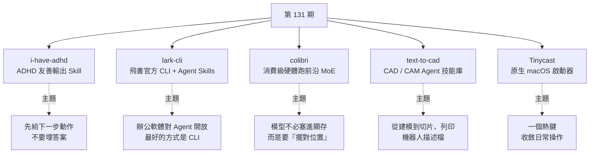
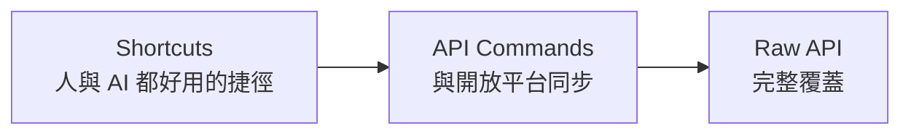
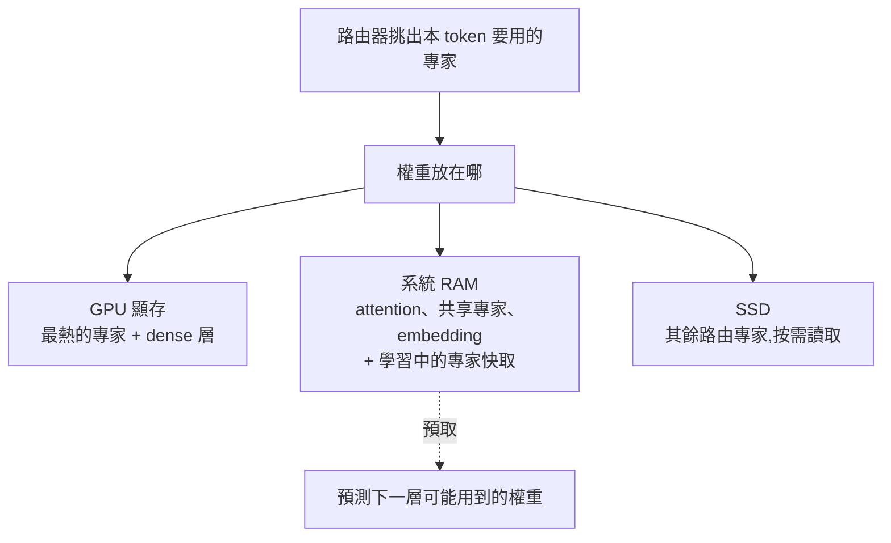

# 第 131 期:讓 Agent 少說廢話的 Skill、飛書官方 CLI、消費級硬體跑兆級 MoE、CAD Agent 技能庫與原生 macOS 啟動器

> GitHub 一週熱點第 131 期(影片發布於 2026/9/19)。本期主軸:**讓編程 Agent「先講動作、少講客套」**的輸出規範 Skill **i-have-adhd**、飛書把 Agent 當一等公民開放能力的官方命令列 **lark-cli**、把顯存 / 記憶體 / SSD 當分層儲存、在家用電腦上跑數百 B 到兆級 MoE 模型的推論引擎 **colibri**、從自然語言一路做到製造與機器人描述檔的 **text-to-cad** 技能庫,以及原生 SwiftUI 寫成、還能跑 Raycast 擴充的 macOS 啟動器 **Tinycast**。

---

## 本期速覽



| 專案 | 類型 | 語言 / 授權 | Stars(2026/10/9) |
|---|---|---|---|
| [i-have-adhd](https://github.com/ayghri/i-have-adhd) | Agent Skill / Plugin | Python / MIT | 約 5.6 萬 |
| [lark-cli](https://github.com/larksuite/cli) | 官方 CLI + Skills | Go / MIT | 約 1.8 萬 |
| [colibri](https://github.com/JustVugg/colibri) | 本地推論引擎 | C / Apache-2.0 | 約 4.1 萬 |
| [text-to-cad](https://github.com/earthtojake/text-to-cad) | Agent Skill / Plugin | Python / MIT | 約 1.8 萬 |
| [Tinycast](https://github.com/abue-ammar/tinycast) | macOS 應用 | Swift / AGPL-3.0 | 約 8.2 千 |

---

## 1. i-have-adhd —— 讓 AI 編程助手不要把答案埋起來

- **連結:** <https://github.com/ayghri/i-have-adhd>
- **一句話:** 一個給編程 Agent 用的 Skill(也包成 Claude Code / Codex 等的 plugin),口號是「**ADHD 友善輸出,不需要 ADHD 診斷也能用**」。

**它解決什麼:** ADHD(注意力不足過動症)的人很難長時間維持專注。如果 AI 一開口就是「好問題!讓我用最簡單、最直接、最不繞彎的方式來回答你……」,**正文還沒出現,注意力就已經沒了**。專案把這個觀察推廣成一般原則:**讓編程 Agent 少說廢話、先給可執行的內容**。

**10 條規則(完整內容在 `skills/i-have-adhd/SKILL.md`):**

| # | 規則 | 意思 |
|---|---|---|
| 1 | Lead with the next action | 第一句就是下一步要做的事 |
| 2 | Number multi-step tasks | 多步驟一律編號 |
| 3 | End with one concrete next step | 結尾只給一個具體的下一步 |
| 4 | Suppress tangents | 壓掉離題內容 |
| 5 | Restate state every turn | 每輪重述目前狀態 |
| 6 | Specific time estimates | 時間估計要具體(幾分鐘,而不是「一下子」) |
| 7 | Make wins visible | 讓進度與成果看得見 |
| 8 | Matter-of-fact errors | 錯誤就事論事地講 |
| 9 | Cap lists to 5 items | 清單最多 5 項 |
| 10 | No preamble. No recap. No closers. | 不要開場白、不要總結重述、不要「希望對你有幫助!」 |

**前後對比(README 範例,改寫為中文):**

- **之前:** 「好問題!讓我想一想。你的驗證流程有幾個環節:middleware、token 驗證、cookie 處理……也許你也該看看整體依賴版本。希望對你有幫助!」
- **之後:** 「修改 `src/auth.ts:42` 的 token 驗證。1. 打開 `src/auth.ts` 2. 把第 42–58 行的 `verifyToken` 換成下面這段 3. 執行 `npm test -- auth.spec.ts`。下一步:若測試失敗,貼上第一行錯誤。」

**安裝:** 直接把「Install the i-have-adhd skill/plugin from https://github.com/ayghri/i-have-adhd, refer to the repo's AGENTS.md for instructions.」貼給你的 Agent,讓它照倉庫說明自行安裝;或依 `INSTALL.md` 走各平台的 plugin 安裝。想客製就 fork 後改 `SKILL.md`,再用 `claude plugin marketplace add <你的帳號>/i-have-adhd` 換成自己的版本。規則設計參考了《The Adult ADHD Tool Kit》,但**調整的是 LLM 怎麼回答,而不是替人定義注意力或工作方式**。

> 💡 週報作者觀點:**短回答不一定總是好的**——複雜問題、高風險操作、需要解釋依賴關係的任務,還是要保留必要背景。適合「希望 Agent 快速給出動作清單」的人,**並不適合所有場景**。

---

## 2. lark-cli —— 飛書官方 CLI 與 Agent Skills

- **連結:** <https://github.com/larksuite/cli>
- **一句話:** 由 larksuite 團隊維護的飛書 / Lark 官方命令列工具,**「為人類與 AI Agent 而建」**。

**背景:** 週報作者本週參加了飛書的「未來無限大會」。飛書把自己定位成**以 Agent 為一等公民設計的辦公平台**——希望 Agent 像人一樣自由協作、自如使用飛書各類產品,而 lark-cli 就是**從終端機與 Agent 呼叫飛書能力的路徑**。作者認為辦公軟體相容 Agent 已是大勢所趨,**而最好的開放方式就是 CLI**;在國內產品中,飛書對各家 Agent 的接入最快、相容最好。作者本人寫的影片文案,也是用 Codex 透過飛書 CLI 同步的。

**覆蓋範圍:** 18 個業務領域、200+ 條精選命令、26 個 Agent Skills——日曆(查日程、找會議室、查忙閒)、訊息(收發、搜尋群訊息)、雲文件(讀寫)、多維表格 Base(表 / 欄位 / 記錄 / 儀表板 / 工作流)、試算表、簡報、任務、Wiki、郵件、會議與逐字稿、審批、OKR 等。影片提到:自 2026 年 3 月上線以來,**透過 CLI 向 Agent 開放的功能點從 247 個增加到 767 個**。

**架構重點——三層命令系統:**



依需求選擇粒度:日常用捷徑、需要精確控制時下探到 API 命令,最後還有原始 API 兜底。其他設計:每條命令都用真實 Agent 測過(參數精簡、聰明預設值、結構化輸出,拉高 Agent 呼叫成功率);輸入注入防護、終端輸出淨化、憑證存在作業系統原生 keychain。

**快速上手:**

```bash
npx @larksuite/cli@latest install     # 安裝 CLI
lark-cli config init                  # 一次性設定應用憑證(互動式引導)
lark-cli auth login --recommend       # 登入,自動勾選常用權限範圍
```

企業 IT / ISV 若要把它嵌進自家 Agent 平台(集中憑證、統一稽核、限縮命令面),官方建議透過 `extension/` 套件包一層自己的 `main`,不必改 CLI 原始碼。

> 📌 補正:README 開頭寫「26 個 AI Agent Skills」,但同一份 README 的特色段落寫「24 個結構化 Skills」,GitHub 倉庫簡介則寫「20+」——數量隨版本變動,以實際 `skills/` 目錄為準。

> 💡 週報作者觀點:**如果你在用飛書,這個專案絕對是必備的**;飛書這波升級也有很多值得期待的點。

---

## 3. colibri —— 在消費級與異構硬體上跑前沿 MoE 模型

- **連結:** <https://github.com/JustVugg/colibri>
- **一句話:** 「Tiny engine, immense model.」純 C 寫成、零依賴的推論引擎,**把 MoE 模型的專家權重從磁碟串流讀取**,讓你在現有電腦上跑數百 B 甚至兆級參數的開源模型。

**它解決什麼:** 本地跑大模型最直接的瓶頸是參數太大——新一代開源模型動輒幾百 B,顯卡顯存根本放不下。colibri 的思路是:**MoE 模型「在磁碟上很大、每個 token 卻很小」**。以 GLM-5.2 為例,總參數 744B、每個 token 只用約 40B,而 token 之間真正會換掉的只有約 11 GB 的路由專家。所以模型**不必塞進快速記憶體,只需要被「擺對位置」**。

**架構重點——分層儲存:**



- dense 部分(attention、共享專家、embedding)常駐 RAM;路由專家留在磁碟,由一個**會學習你常用哪些專家的快取**調度;有 GPU 時放最熱的專家與 dense 層。
- **權重擺在哪只影響速度,不改變結果**:預設策略不會偷偷降精度或改路由語意。
- 後端:CPU 為主,可搭配 CUDA、Vulkan、Metal(macOS 統一記憶體 GPU);每個模型家族一個 C 檔。
- 介面:`coli chat`(終端聊天)、`coli serve`(提供 OpenAI 相容 `/v1` 與 Anthropic 相容端點)、`coli web`(網頁儀表板,可看到每個專家「發亮」的即時畫面),另有 `coli mcp` 讓 Agent 幫你偵測硬體、推薦模型、安裝與啟停。
- 目前支援 13 個引擎,包括 GLM-5.2/5.3、Kimi K3、DeepSeek V4 Flash、MiMo-V2.6、Qwen3.6 / Qwen3.8 等。

**一步安裝:** Windows 下載 ZIP 後雙擊 `START-HERE.bat`;Linux / macOS `git clone` 後執行 `./start-here.sh`。它會檢查 RAM / 磁碟 / CPU / GPU、推薦一個放得下的模型、建置或下載引擎、可續傳地下載模型,最後打開儀表板。最低需求 **8 GB RAM、最小模型 22 GB 磁碟空間**,顯卡可有可無。

> 💡 週報作者觀點:「**模型是 MoE,跑它的環境也是 MoE**」,有點套娃。但**期望要放低**:速度明顯受儲存、記憶體與算力影響,冷啟動時 token 速度很低。README 的實測數字可佐證——GLM-5.2 在 25 GB 筆電冷啟動只有 0.05–0.1 tok/s,128 GB 的 Ryzen AI Max+ 395 約 1.83 tok/s,6 張 RTX 5090 約 9 tok/s;較小的 Qwen3.6-35B-A3B 在 CPU 上約 6 tok/s、用 CUDA 可到 30 tok/s。

---

## 4. text-to-cad —— 給 Agent 的 CAD 超能力

- **連結:** <https://github.com/earthtojake/text-to-cad>
- **一句話:** 「Give your agent CAD superpowers.」名字看起來是「文字生成 CAD」,實際範圍更完整:一組圍繞 **CAD / CAM** 的 Agent Skills,讓 Agent 從建模一路處理到**可製造性檢查、工程圖、切片列印與機器人描述檔**。

**技能清單(節選):**

| Skill | 做什麼 |
|---|---|
| CAD | 依自然語言或圖片建立 / 編輯模型,主輸出 STEP,可匯出 STL、3MF、GLB |
| step.parts | 搜尋現成 STEP 零件(螺絲、軸承、馬達、連接器) |
| Engineering Drawing | 由零件產生含尺寸、隱藏線、孔標註、標題欄的 PDF 工程圖 |
| DXF | 產生 2D DXF(輪廓、樣板、墊片、切割排版) |
| URDF / SRDF / SDF | 機器人結構檔、MoveIt 規劃群組、模擬器模型與世界 |
| DfAM Check / DFM | 3D 列印可列印性(壁厚、懸垂、支撐)、鈑金 / CNC / 射出成形可製造性審查 |
| G-code / Bambu Labs | 用 OrcaSlicer 切片成 G-code、送到 Bambu Lab 印表機 |
| SendCutSend | 上傳到 SendCutSend 加工服務前檢查 DXF / STEP |

**架構重點:** CAD 核心是 OpenCascade 的 Python 綁定(OCP)搭配 build123d,包成 PyPI 套件 `cadgen`,透過 `uv` 執行;plugin 版另帶一個本地 MCP 伺服器(`cadgen mcp`)與 CAD Viewer,能在對話中直接顯示可旋轉的模型卡片。支援 Claude Code、Codex、Cursor、Gemini、Grok 等。

**安裝:**

```bash
# Claude Code(plugin 版,含 skills 與 CAD 伺服器)
claude plugin marketplace add earthtojake/text-to-cad#latest
claude plugin install text-to-cad@earthtojake

# 不支援 plugin 的 Agent:只裝 skills
npx skills add earthtojake/text-to-cad#latest
```

> 📌 補正:影片口述的安裝指令聽起來像「npx skill -i」,依 README 實際為 `npx skills add earthtojake/text-to-cad#latest`(或走各平台 plugin)。另外 README 註明**預設會送出使用統計與當機報告**(不含檔案、路徑、prompt),可用 `uvx cadgen telemetry off` 關閉。

> 💡 週報作者觀點:每個 skill 有各自的依賴與要求,實際使用前**要依你的 CAD 軟體、切片器、印表機環境逐項設定**。

---

## 5. Tinycast —— 輕量的原生 macOS 啟動器

- **連結:** <https://github.com/abue-ammar/tinycast>
- **一句話:** 一個熱鍵叫出搜尋框,**記憶體佔用低於 100 MB** 的原生 macOS 啟動器;用 SwiftUI + AppKit 寫成,**零第三方依賴、不是 Electron、沒有遙測**。

**功能(比單純啟動 App 多很多):**

- 應用啟動與切換、每個 App 可綁專屬熱鍵(按一下聚焦 / 隱藏)
- **剪貼簿歷史**(文字與圖片,可搜尋、貼回原 App)
- 計算機:數學、單位、即時匯率與加密貨幣換算
- **Snippets**:帶動態占位符的 Markdown 範本,支援關鍵字展開
- Quicklinks、Apple 捷徑(Shortcuts)搜尋與執行、自訂 shell 命令
- 34 種 Rectangle 風格的視窗管理動作、系統操作(鎖定、睡眠、清空垃圾桶等)
- 日曆與會議一鍵加入、浮動 Markdown 筆記、Emoji 選擇器
- **AI 對話與 Quick Actions**(改文法、翻譯、摘要選取文字)——**預設全部關閉**,需自行設定 key 或帳號
- **能原生跑既有的 Raycast 擴充**(以 SwiftUI 渲染),也能從 Raycast 匯入設定

**安裝(Homebrew):**

```bash
brew trust --tap abue-ammar/tinycast
brew tap abue-ammar/tinycast
brew install --cask tinycast            # Apple silicon、macOS 26+
brew install --cask tinycast-universal  # Intel、macOS 26
```

⚠️ **系統需求是 macOS 26 以上**,舊系統裝不了。

> 📌 補正:影片說明欄的連結寫成 `abue-ammar/tinycast----`(多了連字號,開啟會 404),正確倉庫為 <https://github.com/abue-ammar/tinycast>。授權為 **AGPL-3.0**(GitHub API 顯示 NOASSERTION,以 README 與 LICENSE 為準)。

> 💡 週報作者觀點:這類工具**不是每個人都喜歡,見仁見智**,喜歡的話可以試試。

---

## One more thing:兩份資料

| 資料 | 重點 |
|---|---|
| 《2026 中國 AI 廠商 Token 收入排行榜》 | 平常看榜單多在比模型能力,這份換個角度:**中國主要 AI 廠商靠 token 賺了多少錢**。字節斷層領先、阿里仍是第二;週報作者意外的是 MiniMax 只排第 6。報告也討論了**為什麼呼叫量與收入會出現分化**。作者也提醒數據未必完全準確 |
| 《2025–2026 餐飲必倒率白皮書》 | AI 雖然火,但很多人創業第一個想到的仍是餐飲(作者頻道叫「IT 咖啡館」,也想開一家真的咖啡店)。這份看**哪些餐飲品類更容易倒閉**;但它是品類整體情況,落到具體品牌與城市結果可能不同 |

---

## 應用案例 / 怎麼用在自己的工作

1. **把 i-have-adhd 當成「輸出規格」範本,而不是全盤照收**:例如你在 Claude Code 做日常除錯,常被「讓我先解釋一下背景……」拖慢,可以只挑規則 1、2、3、10 寫進自己的 `CLAUDE.md` 或自訂 skill;但對「資料庫 migration」「刪除生產資源」這類高風險任務,另加一條「高風險操作必須先說明影響範圍」,避免簡潔過頭把關鍵警告也省掉。寫法可參考本庫 [[building-claude-skills]]。
2. **用 lark-cli 讓 Agent 接手飛書上的重複工作**:例如每週五要把 Jira 匯出的週報整理進飛書多維表格、再在群組裡發摘要——裝好 lark-cli 與它的 skills 後,直接請 Codex / Claude Code「讀取 `weekly.csv`,用 lark-cli 更新 Base 的『週進度』表,並把三點摘要發到產品群」。先在測試群與測試表跑一次,確認權限範圍(`auth login --recommend` 給的 scope)沒有超出需要。
3. **用 colibri 評估「不買新顯卡能不能本地跑大模型」**:假設你有一台 64 GB RAM、無獨顯的工作站,想在內網離線處理敏感文件。先跑 `./start-here.sh --list` 看每個模型對這台機器是否放得下、為什麼不行;用 `coli serve` 開出 OpenAI 相容端點,把既有工具的 base URL 指過去做小樣本測試。若實測只有個位數 tok/s,就把它定位在「批次、非即時」任務(例如夜間摘要),而不是即時對話。MoE 為何能這樣拆,可對照本庫 [[moe-mixture-of-experts-from-ffn]]。
4. **text-to-cad 適合「從需求到可列印檔」的小型硬體原型**:例如要做一個固定樹莓派與風扇的外殼——請 Agent 用 CAD skill 依文字描述生成 STEP,再用 step.parts 找 M3 螺絲與風扇模型、用 DfAM Check 檢查壁厚與懸垂、最後 G-code skill 用你自己的 OrcaSlicer 印表機預設切片。每一步都產出檔案,可在 CAD Viewer 人工確認再往下走;公司環境記得先關閉 telemetry。
5. **Tinycast 適合想離開 Raycast 但不想丟掉擴充的人**:如果你在意記憶體與隱私(Tinycast 無遙測、AI 預設關閉),可以先用它的匯入功能把 Raycast 設定搬過來,保留常用擴充;把常用的 shell 腳本(例如「切到專案目錄並開 VS Code」)設成 custom command 綁全域熱鍵。前提是系統已升級到 macOS 26。

---

## 來源

- 影片:「Github一周热点131期」Agent 少说废话、飞书CLI、本地跑超大模型、CAD技能库和Mac效率启动器 —— <https://www.youtube.com/watch?v=OzFszgfi5eI>
  - 該片無字幕,講解內容以 CPU 版 Whisper(faster-whisper)轉錄取得,非官方字幕,可能有少量聽寫誤差;專案清單取自影片說明欄。
- 本期專案:
  - [ayghri/i-have-adhd](https://github.com/ayghri/i-have-adhd)
  - [larksuite/cli](https://github.com/larksuite/cli)
  - [JustVugg/colibri](https://github.com/JustVugg/colibri)
  - [earthtojake/text-to-cad](https://github.com/earthtojake/text-to-cad)
  - [abue-ammar/tinycast](https://github.com/abue-ammar/tinycast)
- 延伸(本庫):[打造 Claude Skills](../ai-agents/applications/building-claude-skills.md) · [從 FFN 理解 MoE 混合專家](../llm-internals/architecture/moe-mixture-of-experts-from-ffn.md)
