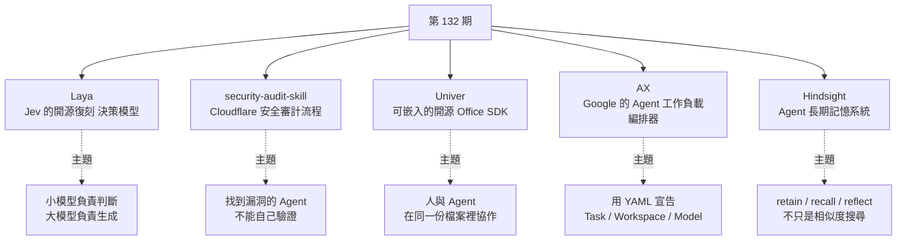
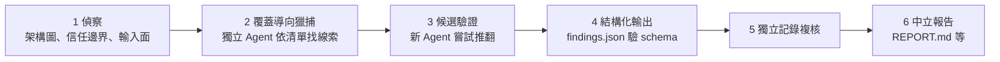

# 第 132 期:Jev 開源復刻 Laya、Cloudflare 安全審計 Skill、Univer Office SDK、Google 的 Agent 編排器 AX 與長期記憶 Hindsight

> GitHub 一週熱點第 132 期(2026/09/26 發布)。本期主軸是**「Agent 基礎設施的分工細化」**:只做結構化判斷、不生成文字的 System 1 決策模型 **Laya**(最近爆紅的 Jev 的開源復刻);把安全審計變成多階段流程的 **Cloudflare security-audit skill**;可嵌入產品、也能給 Agent 無介面操作的 **Univer Office SDK**;Google 想做「Agent 時代的 K8s」的編排器 **AX**;以及把事實、經歷、觀察分層存放的長期記憶系統 **Hindsight**。

---

## 本期速覽



---

## 1. Laya —— 面向結構化決策的開源模型(Jev 的開源復刻)

- **連結:** <https://github.com/NandhaKishorM/laya>
- **Repo 現況(2026-10 查核):** ⭐ 約 31.7k、Apache-2.0、Python;2026-09-18 建立,爆發速度極快。
- **README 定位:** 多語言、**非自迴歸(non-autoregressive)的 System 1 決策引擎**——對任意文字做型別化判斷,**一次前向傳播**完成。

**先搞懂 Jev 是什麼:** 9 月中 TypeSafe 發布 **Jev**,取了個很有野心的名字「System 1 Model」。傳統大模型能寫文章、生成程式碼;Jev 則**專門回答三種問題:選哪個(choice)、打幾分(score)、能否成立(yes/no)**。它快的原因是放棄自由生成文字,**直接回傳結構化判斷**,省掉逐 token 生成的開銷——宣傳速度是大模型的 20 倍、成本只有 1%。

> ⚠️ 週報作者的冷靜提醒:「20 倍速度」是在特定條件下;「零幻覺」也有前提——選項只有 ABC 時它**不會憑空輸出 D**,但正確答案是 A 時**它照樣可能選 B**。也就是**格式保證正確,答案不一定正確**。適合承擔**高頻的小判斷**;複雜規劃與內容生成仍要配其他模型。

**Laya 怎麼做:** 沿用 choice / score / yes-no 這套回答形式,**自己訓練決策模型與推理程式碼**(不是發布 Jev 原本的權重),用針對 proper scoring rule 的強化學習(RLCD)訓練。三個 checkpoint 加一個 `Router` 依請求自動挑選:

| Checkpoint | 編碼器 | 參數 | 上下文 | 用途 |
|---|---|---|---|---|
| `laya` | ModernBERT-large | 421M | 512 | 英文 |
| `laya-multilingual` | mmBERT-base | 322M | 1024(可到 8,192) | 100+ 語言,快 2 倍 |
| `laya-typed-decisions` | ModernBERT-large | 421M | 1024 | 針對型別化決策資料微調 |

```python
from laya import Router
router = Router()  # 首次使用時下載 checkpoint
state = "Hi, we were billed twice for March. Please refund the duplicate today or we will cancel our plan."
questions = {
    "department": {"type": "choice", "instructions": "Which department should handle this?",
                   "criteria": {"billing": "invoices, payments, refunds",
                                "technical": "bugs, outages, system errors",
                                "other": "everything else"}},
    "urgency": {"type": "score", "instructions": "How urgent is this?",
                "criteria": ["not urgent", "soon", "blocking"]},
    "churn_risk": {"type": "noul", "instructions": "Does the user threaten to cancel or leave?"},
}
result = router.predict(state, questions)   # → department=billing,churn_risk 回傳「是」的機率
```

安裝 `pip install laya`(Python 3.10+);另有 CLI(`laya "My payment failed twice" --preset triage`)、與 Jev 相容線路協定的 HTTP 服務 `laya-serve`、MCP / LangChain / CrewAI 等擴充套件。

**和 Jev 的對照(README 數據):**

| | Jev 1.13.0 | Laya(routed) |
|---|---|---|
| typed-decisions 準確率 | 0.727 | **0.766** |
| Banking77(大於 20 個選項) | **0.870** | 0.425 |
| 單題 p50 延遲 | 236–276 ms | **32.8 ms**(T4) |
| 權重 | 閉源 API | Apache 2.0 |

> 📌 **補正 / 補充:** 作者自己也註明 **Jev 的數字來自第三方公開結果,雙方沒有在同一基準上測**;而且 Laya 在**選項很多(大於 20 個)**的任務明顯輸給 Jev(選項共用固定 token 預算)。影片只說「某些任務比 Jev 快」,實際上準確率是互有勝負。

> 💡 週報作者觀點:Laya 的價值在**可下載、可微調、可部署**——你可以親手驗證「**小模型負責判斷、大模型負責生成**」這套模式。至於是否能取代 Jev 並不重要,Jev 本身也只是代表一個方向。本庫 [[system-one-models-jev-calibrated-decisions]] 有 Jev 與 System One 模型的完整整理。

---

## 2. security-audit-skill —— Cloudflare 的程式碼安全審計 Skill

- **連結:** <https://github.com/cloudflare/security-audit-skill>
- **Repo 現況:** ⭐ 約 26.5k、MIT、JavaScript(驗證器);README 說明它是 Cloudflare **漏洞發現 harness 的起點**,後來長成全公司級的多階段系統,這個 skill 則是「單一 repo 版」。

**它解決什麼:** 直接叫編程 Agent「檢查這個專案有沒有漏洞」,它很容易**過度發散**,給你一份看起來很嚇人、但細節多半是猜測的報告。這個 skill 給審計加上一套**六階段流程**:



- 結果分三類:**`confirmed`(已確認)/ `needs_validation`(待驗證)/ `rejected`(已排除)**,寫成機器可讀紀錄。
- **對抗式驗證:檢查發現的 Agent,永遠不是找到它的那個 Agent。**
- 多次執行可累加:README 實測**單次執行大約只找到多次執行總和的一半**。

**安裝與使用:**

```bash
npx skills add https://github.com/cloudflare/security-audit-skill --skill security-audit
# 然後在目標 repo 對 Agent 說:security audit this codebase
```

> ⚠️ 週報作者點出的麻煩處:**完整流程很耗時、耗算力**;需要支援工具呼叫與**平行子 Agent** 的編程助手;若要真的執行目標程式碼,還需要**作業系統層級的沙箱**(斷網、資源限制、只能寫指定目錄)——README 寫明沒有這些控制時,線索只會停在 `needs_validation`,不會去執行目標程式。比較適合**從單一程式碼庫開始實踐**。

> 本庫已有逐檔讀完原始碼的深入拆解:[[cloudflare-security-audit-skill-pipeline]]。

---

## 3. Univer —— 可擴展的開源 Office SDK

- **連結:** <https://github.com/dream-num/univer>
- **Repo 現況:** ⭐ 約 22.5k、Apache-2.0、TypeScript;2022 年就建立,目前 README 標語已改為 **"The Office Harness for AI Agents"**。

**它解決什麼:** 你在做 SaaS、內部工具或 AI 應用,想在自己的頁面裡放**表格 / 文件編輯**。自己從頭做會撞上公式引擎、渲染、外掛、權限等一堆難題;Univer 提供**可嵌入的 Office SDK**,涵蓋試算表、文件、簡報(以及 Bases、白板、PDF)。

**架構重點:**

- **同構(isomorphic):** 瀏覽器裡可編輯,**Node.js 裡也能跑無介面處理邏輯**——很適合給 Agent 在伺服器端讀寫工作簿。
- **Canvas 渲染引擎 + 獨立公式引擎**,大型工作簿也能保持流暢。
- **一切皆外掛:** 可組合、替換、延遲載入。
- **兩種上手方式:** 想快就用 **Preset 模式**(精選外掛組合);要精細控制再用 **Plugin 模式**逐個組合套件。
- **Facade API:** 統一操作 workbook、range、公式、文件的高階 API。
- **給 Agent 的工作流:** 結構化 API 編輯、截圖與版面診斷驗證輸出、在隔離草稿(worktree)裡改、人再審核合併。官方也做了接 OpenClaw、WorkBuddy、DeepSeek Harness 的整合範例。

> ⚠️ **開源與 Pro 的邊界要主動核對(週報作者提醒,README 也列得很清楚):** 基礎套件是 Apache-2.0,但 **協作編輯、匯入 / 匯出、列印、圖表、樞紐分析、伺服器端協作服務**等都屬於另外授權的 **Univer Pro**。開源 SDK 和完整的企業級協作平台之間仍有差距。

---

## 4. AX —— Google 開源的 Agent 工作負載編排器

- **連結:** <https://github.com/google/ax>
- **Repo 現況:** ⭐ 約 13.3k、Apache-2.0、**Go**;README 標示仍在**大量開發中、正式版前可能有重大破壞性變更**。
- **README 描述:** *Google's open agentic orchestration runtime*——高吞吐、宣告式,目標是在一個叢集裡跑**數十億個**自主 Agent 工作負載。

**為什麼需要它:** 週報作者看到 "orchestration" 就想到 K8s——當年它是 Docker 的編排工具,後來成為容器編排標準。現在的 Agent 有各種長程任務(拉程式碼、裝工具、除錯),**當你有成百上千個這類任務時,確實需要合理的編排**。README 的說法是:Agent 是一種新工作負載,**既不是無狀態微服務、也不是跑完就結束的批次作業**——它會累積狀態、需要嚴格隔離、會呼叫模型與工具,還可能在迴圈裡燒錢。

**思路與 K8s 很像——用 YAML 宣告:**

| 資源 | 作用 |
|---|---|
| **`Task`** | 最小的隔離執行單位:容器映像、指令、CPU / 記憶體限制、掛哪些 Workspace |
| **`Workspace`** | 預先備好 Git 倉庫、MCP Server、Skill 套件;可附一句 `goal` 讓 Agent 首次開機時自己裝好工具鏈 |
| **`Model`** | 平台使用哪個 LLM provider、模型與參數,憑證來自 Kubernetes secret |

```bash
ax apply -f task.yaml        # 套用 Task + Workspace + Model
ax watch task test           # 即時看狀態變化
ax ssh test -- ls -al /workspace   # 鑽進沙箱看 Agent 在做什麼
ax suspend task test         # checkpoint 並暫停,之後 ax resume 接續
```

CLI 刻意做成 `kubectl` 的形狀(`apply / get / describe / watch / delete`),並跟著你的 `kubectx` 切換叢集。

> 📌 **補正:** 影片說 YAML 宣告的是 Task、Workspace、**Gateway**、Model 四種;目前 README 與 `docs/concepts.md` 列出的核心資源只有 **Task、Workspace、Model 三種**,未見獨立的 Gateway 資源(對外連線控制屬於網路 / 沙箱層的設定)。

> 💡 週報作者觀點:**起步相當重**——需要一個已安裝 **Agent Substrate** 的 Kubernetes 叢集、Go、`ko` 與容器 registry,明顯是從企業場景出發。這套「K8s 式」思路在 Agent 時代能不能**再一次一統天下**,值得觀察。

---

## 5. Hindsight —— AI Agent 的長期記憶系統

- **連結:** <https://github.com/vectorize-io/hindsight>
- **Repo 現況:** ⭐ 約 47.2k、MIT、Python;附論文(arXiv 2512.12818),宣稱在 LongMemEval 達到 SOTA,並有第三方(Virginia Tech、華盛頓郵報)重現結果。

**它解決什麼:** 很多 Agent 號稱有記憶,其實只是**把以前的對話存起來,下次做相似度搜尋**。Hindsight 想多走一步——讓 Agent **會學習,而不只是記得**。

**記憶分層(存放在 Memory Bank 裡):**

| 類型 | 例子 |
|---|---|
| 世界事實(World facts) | 「爐子會燙」 |
| 經歷(Experiences) | 「我碰了爐子,真的很痛」 |
| 觀察(Observations) | 從多條記憶彙整出、有證據支撐的信念 |
| 心智模型(Mental models) | 由觀察與事實綜合出的、對世界的理解 |

**三個關鍵操作:**

- **`retain`(存入):** 用 LLM 抽出關鍵事實、時間、實體與關係,正規化後建索引。
- **`recall`(找回):** **四路平行檢索**——語意向量、BM25 關鍵字、實體 / 時間 / 因果圖、時間範圍過濾——再用 RRF 融合與 cross-encoder 重排序。
- **`reflect`(反思):** 對多條記憶做更深的整合與推理,回答需要「想」而不只是「查」的問題。

```python
from hindsight_client import Hindsight
client = Hindsight(base_url="http://localhost:8888")
client.retain(bank_id="my-bank", content="Alice got promoted to senior engineer", timestamp="2025-06-15T10:00:00Z")
client.recall(bank_id="my-bank", query="What happened in June?")   # 時間型查詢
client.reflect(bank_id="my-bank", query="What should I know about Alice?")
```

**部署:** Docker 一行自建(API 8888、UI 9999)、外接 PostgreSQL 的 docker compose、`pip install hindsight-api`、Helm,或用託管版 Hindsight Cloud;支援 25+ LLM provider(含 Ollama 等本地模型)。

> 📌 **補正:** 逐字稿中第一個操作被聽寫成 "Return",repo 實際的 API 名稱是 **`retain`**。

> 💡 週報作者觀點:以客服 Agent 為例——記住使用者上個月遇到的故障,也能看到後來有沒有解決,下次回答就**不必只靠最近一輪對話去猜背景**。但對這類長期記憶專案,他的評價是:**目前都是思路很好、落地很難**。本庫 [[agent-memory-survey-forms-functions-dynamics]] 與 [[mem0-memory-architecture-teardown]] 可對照閱讀。

---

## One more thing:兩份資料

| 資料 | 重點 |
|---|---|
| 《OpenAI 人工智慧發展戰略研究報告》(224 頁) | 依產業格局、公司戰略、業務佈局等 6 個部分梳理 OpenAI 2026 年的佈局。作者的整體感覺:**OpenAI 今年開局有些迷失,後來逐漸找回狀態** |
| 《FDE 行業研究報告:AI 落地時代的前線部署工程師》 | FDE 即 **Forward Deployed Engineer**,近幾年的新詞。作者很有感:以前創業時沒有這個詞,他們管自己叫「**一條龍**」——**業務也懂、程式也懂、合約也簽,一個人到客戶現場,客戶缺什麼就做什麼** |

---

## 應用案例 / 怎麼用在自己的工作

1. **用 Laya 把 Agent 的「小判斷」下沉**:客服工單進來,先用 Laya 一次前向傳播回答「哪個部門 / 多緊急 / 會不會流失」(約 33ms、本地免費),只有被判為 `technical` 且 `blocking` 的單才丟給大模型寫回覆草稿。**每天上萬張工單時,這能省下大部分大模型呼叫**。但上線前要用自己的 200–500 筆歷史工單驗準確率;選項超過 20 個的分類(例如細分到 77 種意圖)先別用它。
2. **季度安全體檢用 Cloudflare skill 跑兩次**:對公司的 API 服務 repo 執行 `security audit this codebase`,**至少跑兩輪**(README 顯示單次只抓到約一半),只把 `confirmed` 送進修補排程,`needs_validation` 交給人去補那個「未解決的事實」。沒有隔離沙箱的筆電環境,就接受它不執行目標程式碼的限制。
3. **在內部系統嵌一個「能被 Agent 改的試算表」**:例如業務報價單——前端用 Univer Preset 模式嵌入表格,後端在 Node.js 用無介面模式讓 Agent 依客戶需求填價、跑公式、截圖驗證,業務再人工審核。**動手前先列出需求清單,逐項對照 Pro 功能表**(匯出 xlsx、協作、圖表都在 Pro)。
4. **評估 AX 前先問「我有沒有 K8s 團隊」**:若你每天要跑上百個「clone repo → 裝依賴 → 修 bug」的 Agent 任務,AX 的 `Workspace` 預熱與 `suspend / resume` 很有價值;但它要求 Agent Substrate + K8s,且仍是 alpha。**小團隊先用 git worktree + 本機沙箱就夠了**,把 AX 當成「Agent 工作負載該長什麼樣」的設計參考。
5. **為長期記憶設計「事實 vs 觀察」分層**:即使不用 Hindsight,也可以借它的分類——例如個人助理把「使用者住台北」記為事實、「使用者週一早上通常很忙」記為觀察(要有多次證據才成立),**觀察要能被新證據推翻**。這比把所有對話丟進向量庫更不容易累積錯誤記憶。
6. **組合起來看本期**:Laya(判斷)+ Hindsight(記憶)+ AX(執行環境)+ security-audit(流程化驗證)剛好對應 Agent 系統的四個層次——**下次設計 Agent 架構時,逐層問「這一層是否該交給專用元件,而不是全塞給一個大模型」**。

---

## 來源

- 影片:「Github 一周热点 132 期」Jev 到底是不是神器?Agent 安全審計、Office SDK、agent 的 k8s 和長期記憶(2026-09-26,約 7.7 分鐘):<https://www.youtube.com/watch?v=q7HMQLM93qY>
  - 該片無字幕,講解內容以 CPU 版 Whisper(faster-whisper)轉錄取得,非官方字幕,可能有少量聽寫誤差;專案清單取自影片說明欄。
- 本期專案:
  - Laya:<https://github.com/NandhaKishorM/laya>
  - security-audit-skill:<https://github.com/cloudflare/security-audit-skill>
  - Univer:<https://github.com/dream-num/univer>
  - AX:<https://github.com/google/ax>
  - Hindsight:<https://github.com/vectorize-io/hindsight>
- 延伸(本庫):[不會打字的模型:Jev、System One](../llm-internals/architecture/system-one-models-jev-calibrated-decisions.md) · [Cloudflare security-audit skill 拆解](../ai-agents/applications/cloudflare-security-audit-skill-pipeline.md) · [Agent 記憶綜述](../ai-agents/memory-retrieval/agent-memory-survey-forms-functions-dynamics.md) · [Mem0 記憶架構拆解](../ai-agents/memory-retrieval/mem0-memory-architecture-teardown.md)
