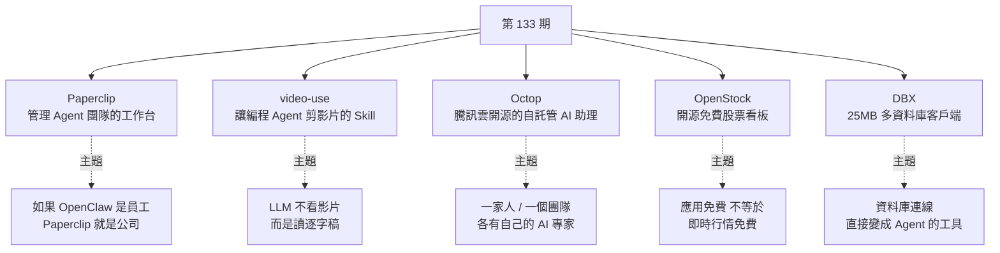

# 第 133 期:給 Agent 開家公司(Paperclip)、讓 Agent 剪影片(video-use)、騰訊開源 Octop、免費股票看板與 25MB 資料庫客戶端

> GitHub 一週熱點第 133 期(2026/10/05 發布,十一長假期間)。本期主軸是**「把 Agent 放進真實工作流程」**:用組織架構、預算與審核來管理一群 Agent 的 **Paperclip**;讓 Claude Code / Codex 「讀」影片再剪片的 **video-use**;騰訊雲開源、對標自家 WorkBuddy 的多使用者 AI 助理 **Octop**;以及兩個實用工具——開源免費的股票看板 **OpenStock**,和 25MB 就能連 100+ 種資料庫、還自帶 MCP Server 的 **DBX**。

---

## 本期速覽



---

## 1. Paperclip —— 管理 AI Agent 團隊的開源工作台

- **連結:** <https://github.com/paperclipai/paperclip>
- **Repo 現況(2026-10 查核):** ⭐ 約 98.8k、MIT 授權、TypeScript;Node.js 伺服器 + React UI,持續活躍更新。
- **一句話定位(README 原文):** *"If OpenClaw is an employee, Paperclip is the company."* —— 如果 OpenClaw 是一個員工,Paperclip 就是一家公司。

**它解決什麼:** 當你同時開了好幾個 Codex、Claude Code 或其他 Agent,**誰負責哪個任務、花了多少錢、做完誰來驗收**,很快就亂成一團。README 直接點名的場景:「你開了 20 個 Claude Code 分頁,記不得哪個在做什麼,一重開機全部消失。」

Paperclip 把這些放進一個**看起來像任務管理器**的介面,底下其實是組織圖、預算、治理與 Agent 協調:

| 步驟 | 範例 |
|---|---|
| 01 設定目標 | 「把 AI 筆記 App 做到月營收 100 萬美元」 |
| 02 招募團隊 | CEO、CTO、工程師、設計、行銷——任何 bot、任何 provider |
| 03 核准並執行 | 審策略、設預算、按下開始,從儀表板監控 |

**比單純「排程」多出來的東西:**

- **崗位與權限:** Agent 有職稱、匯報線、權限與預算;人和 Agent 可以混在同一張組織圖裡。
- **心跳(Heartbeat)喚醒:** Agent 在收到指派、追問或排程時醒來繼續工作——「能收心跳的就能被僱用」。支援 OpenClaw、Claude Code、Codex、Cursor、Gemini CLI、OpenCode、Kimi Code 等。
- **任務原子化領取:** 單一負責人 + 執行鎖,避免兩個 Agent 搶同一張單。
- **成本控管:** 公司 / Agent / 專案三層預算,到門檻**告警或自動暫停**——專治「失控迴圈燒掉幾百美元 token」。
- **審核關卡:** 任務可設 review / approval 階段,設定變更有版本、可回滾。
- **任務串(Task Threads):** 每個任務都附帶討論、檔案、執行紀錄,重開機也不會遺失。

**怎麼開始:**

```bash
# 需 Node.js 24.11 以上
npx paperclipai@latest onboard --yes

# 想先試玩一個已初始化好 CEO Agent 的隔離實例
ANTHROPIC_API_KEY=... npx paperclipai test-drive
```

服務與管理介面會在本機啟動;真正連到外部 Agent 時,各自的執行環境與憑證仍需另外設定。

> 📌 **補正:** 影片說「需要最新的 Node.js」,README 明確寫的是 **Node.js 24.11 或更新版本**。

> 💡 週報作者觀點:做這類 Agent 管理工具的人不少,**最大的壓力來自 OpenAI 這類第一方模型公司**——它們隨時可能推出類似功能吃掉這塊市場。另外,**如果你只用一個 Agent,其實沒有太大必要用它**。

---

## 2. video-use —— 讓編程 Agent 剪影片的開源 Skill

- **連結:** <https://github.com/browser-use/video-use>
- **Repo 現況:** ⭐ 約 28.4k、MIT 授權、Python;出自 **browser-use** 團隊。

**用法:** 把原始素材丟進一個資料夾,在該資料夾啟動 Claude Code / Codex 這類終端機 Agent,告訴它你要剪成什麼樣的片子。它會**盤點素材 → 提出剪輯方案 → 等你確認 → 才輸出** `edit/final.mp4`。

**它怎麼「看懂」素材?——其實它不看,而是「讀」:**


- **第一層:音訊逐字稿(永遠載入)。** 每個素材呼叫一次 ElevenLabs Scribe,拿到**逐字時間戳、說話人分離與音訊事件**(笑聲、掌聲、嘆氣)。
- **第二層:視覺合成圖(按需)。** `timeline_view` 產生某段時間的**膠卷縮圖 + 波形 + 字詞標籤** PNG,只在決策點(曖昧停頓、重拍比較、剪點檢查)才調用。
- README 的算帳:天真做法是 30,000 幀 × 1,500 token = **4,500 萬 token 的雜訊**;video-use 只要 **12KB 文字 + 幾張 PNG**。跟 browser-use 給 LLM 結構化 DOM 而不是截圖,是同一個思路。

**其他功能:** 自動調色、每個剪點加 30ms 音訊淡入淡出避免爆音、燒錄字幕、用 HyperFrames / Remotion / Manim 平行生成動畫疊層、把專案記憶存在 `project.md` 讓下週接著剪。官方說口播、vlog、旅行、教學、訪談都能剪。

**安裝需求:** Python 環境(`uv sync`)、**ffmpeg(必要)**、ElevenLabs API Key;可把 repo 軟連結到 `~/.claude/skills/video-use`,或直接把 README 的 setup prompt 貼給 Agent 讓它自己裝。

> 💡 週報作者觀點:現在的 AI 剪輯大多是這個路子,值得學這套思路。**拿它做第一版粗剪很有價值**——刪停頓、上字幕都很省時——但**成片最好還是自己從頭過一遍**。最近的新模型做動畫都很驚艷,可以結合這個流程做出更好的影片。

---

## 3. Octop —— 騰訊雲開源的自託管 AI 助理(開源版 WorkBuddy)

- **連結:** <https://github.com/TencentCloud/Octop>
- **Repo 現況:** ⭐ 約 8k、MIT 授權、Python 3.12+(FastAPI)+ React 前端;2026-07 建立。
- **定位(README):** 開源、自託管、**多使用者、多 Agent** 的 AI 助理,面向**家庭與小團隊**。

**能做什麼:** 裝在自己的電腦或伺服器上,**給家人或團隊成員分別開帳號**,每人都有自己的一組「AI 專家」。

| 能力 | 說明 |
|---|---|
| 專家庫 / 專家市場 | 依場景切換專家;可把調好的專家、技能與子 Agent 池共享給同部署的其他人 |
| 多入口 | Web 儀表板、CLI、飛書、釘釘、QQ、微信、企業微信、Telegram、Discord,以及 HTTP/SSE/WebSocket |
| 自動化 | 用自然語言設定 cron,每天定時推送或執行 |
| 瀏覽器 / 終端機 / 遠端桌面 | 無頭 Chromium 自動化、瀏覽器內 AI 終端機、從儀表板操作主機桌面 |
| ACP 雙向 | 對內讓 Zed 等 IDE 使用你的 Octop Agent;對外把編碼任務委派給 OpenCode / CodeBuddy / Claude Code / Codex |
| 安全 | JWT 多使用者隔離、工具呼叫審批、shell 指令護欄、PII 遮罩 |
| 16 種 MBTI 人格範本 | 讓每個 Agent 有不同個性 |

**架構重點:** 整個系統是**單一行程**——Web、IM、cron 全部走同一個 in-process `HarnessProcessor`,不需外部訊息佇列;所有狀態存在 `~/.octop/`(預設 SQLite WAL,可選 PostgreSQL),重啟後從資料庫重建。底層拆成 Octop Harness(Agent 執行期)、Gateway(IM 橋接)、Memory(階層式記憶)、Browser(CDP 自動化)四個子專案。

**安裝:** 一鍵安裝腳本(macOS/Linux 用 `curl ... | bash`、Windows 用 PowerShell `irm ... | iex`,安裝器會用 uv 自動準備 Python 3.12),也可手動逐步安裝初始化或用 Docker。

> 💡 週報作者觀點:功能本身**不算有太大亮點**,看點在它**對標的是騰訊自家的 WorkBuddy**,整體用起來也確實很像,可能是內部技術的下放。作者也提到近期新聞:騰訊整合自家產品,**另一款 AI 助理產品停止更新、併入 WorkBuddy**——作者對兩條產品線長期並存一直不太理解。

---

## 4. OpenStock —— 開源免費的股票看板

- **連結:** <https://github.com/Open-Dev-Society/OpenStock>
- **Repo 現況:** ⭐ 約 19.9k、**AGPL-3.0**、TypeScript。

**它解決什麼:** 把個股資訊、自選清單、公司資料、K 線、市場熱力圖與新聞放進同一個介面,**不用在好幾個網站之間來回搜尋**。

**技術棧(主流全端組合,也很適合當學習範本):**

| 層 | 技術 |
|---|---|
| 前端 | Next.js 15(App Router)+ React 19、shadcn/ui、Tailwind CSS v4 |
| 認證 | Better Auth(email/密碼)+ MongoDB adapter |
| 資料 | MongoDB + Mongoose;**Finnhub API**(代號、公司檔案、新聞) |
| 圖表 | **TradingView 嵌入式 widget**(K 線、技術面、熱力圖) |
| 自動化 | Inngest(事件、cron、用 Gemini 生成個人化歡迎信)、Nodemailer |

**本地執行:** Node.js 20+,準備 **MongoDB 連線字串與 Finnhub API Key**(免費層可用),`pnpm install && pnpm dev`;也提供 Docker Compose。

> ⚠️ **週報作者特別強調:要分清「應用免費」與「即時行情免費」。** 專案本身開源免費,但資料來自第三方,**有沒有延遲、涵蓋哪些市場(例如有沒有 A 股),取決於資料供應商以及你買了什麼授權方案**。README 自己也寫明:Finnhub 免費層「即時」可能需付費;**非美股在免費層延遲 15 分鐘以上**;TradingView 免費層對新興市場有限制;它不是券商,也不構成投資建議。

> 📌 **補正:** 影片未提授權。OpenStock 採 **AGPL-3.0**——若你修改後**以網路服務形式部署**,也必須以相同授權公開原始碼,商用前要留意。

---

## 5. DBX —— 支援 100+ 種資料庫的 25MB 輕量客戶端

- **連結:** <https://github.com/t8y2/dbx>
- **Repo 現況:** ⭐ 約 25.2k、Apache-2.0、**Rust**;2026-04 建立。

**它解決什麼:** 開發時常同時碰 PostgreSQL、MySQL、SQLite、Redis、MongoDB……DBX 把這些連線放進同一個介面,而且**單一約 25MB 的安裝檔,不需 Java JRE、不需 Python venv、也不內嵌 Chromium**(README 直接拿 DBeaver 要 Java、TablePlus 是 Freemium 來比)。

**重點功能:**

- **100+ 資料庫:** 從 MySQL / PostgreSQL / ClickHouse / DuckDB 到向量庫(Qdrant、Milvus、Weaviate)與國產庫(達夢、人大金倉、openGauss、OceanBase 等);另有 Kafka、RabbitMQ、MQTT、Nacos、etcd 等中介軟體主控台。
- **多種形態:** macOS / Windows / Linux 桌面版,外加 Web、Docker 自架與 CLI。
- **日常操作:** 寫 SQL(CodeMirror 6、自動補全)、看表結構、ER 圖、schema diff、執行計畫、改資料、匯入匯出、跨庫遷移;可直接匯入 DBeaver / Navicat 的連線設定。
- **AI SQL 助手:** 選一張表、用自然語言描述需求就生成 SQL;支援 Claude、OpenAI、Ollama 本地模型,**執行前有內建安全檢查**。
- **MCP Server:** 讓 Claude Code、Cursor 等編程 Agent 透過你在 DBX 裡已設好的連線查資料庫,並可在設定中切換 **唯讀 / 讀寫 / 完全存取** 三種權限。

```json
{
  "mcpServers": {
    "dbx": { "command": "npx", "args": ["-y", "@dbx-app/mcp-server"] }
  }
}
```

> 📌 **補充:** MCP Server 是**獨立發佈**的(`@dbx-app/mcp-server`,同樣是 Rust 二進位),安裝桌面版並不會自動裝上;另有 `@dbx-app/cli` 給腳本與 Codex 工作流使用。

> 💡 週報作者觀點:25MB 的安裝包,對想找**輕量替代品**的開發者有一定吸引力。

---

## One more thing:兩份資料

| 資料 | 重點 |
|---|---|
| 《中國智能穿戴市場洞察報告》 | 這兩年隨技術進步,智能穿戴裝置已從電子玩具演變成**大眾的健康管家、效率工具與數位夥伴**;作者認為最具代表性的是**智慧手錶與智慧眼鏡** |
| 《WorkBuddy 企業崗位應用全景白皮書》 | 分析各種企業崗位場景下怎麼用 Agent。作者的建議:**可以完全忽略 WorkBuddy 這個品牌**,因為各家 Agent 在這些場景裡的用法都一樣 |

> 作者的小觀察:最近各大廠都很愛「寫書」——他陸續收到豆包、千問辦公的紙本書,現在 WorkBuddy 也出了。

---

## 應用案例 / 怎麼用在自己的工作

1. **同時跑 3 個以上 Agent 時才上 Paperclip**:例如一人公司同時讓 Claude Code 寫後端、Codex 寫前端、另一個 Agent 每天產出社群貼文。這時把三者掛進 Paperclip,**每個 Agent 設月預算上限 + 完成需人工 approve**,就能避免「半夜迴圈燒光額度」與「沒人驗收就上線」。只用一個 Agent 的話,維持現狀即可。本庫 [[zero-person-ai-company]] 有一份 Hermes Agent + Paperclip 的實作步驟可直接照做。
2. **用 video-use 做口播影片的粗剪**:錄了 40 分鐘的教學素材(含多次重講),丟進資料夾讓 Agent 先砍掉「嗯、呃」與重拍段,出一版 8 分鐘粗剪;你再從頭過一遍調節奏。**最值得抄的是「先讀逐字稿、必要時才看畫面」的設計**——同樣的思路也能用在會議錄影整理、課程切片。
3. **家庭 / 小團隊共用一台 AI 助理主機**:把 Octop 裝在家裡的 NAS 或一台小伺服器,給家人各開帳號;爸媽用微信問健康資訊、自己用飛書讓專家每週五自動寫週報,**資料全留在 `~/.octop/`**。要注意它開了遠端桌面與 shell 能力,務必開啟工具審批、別直接暴露到公網。
4. **OpenStock 當全端學習範本 + 個人看板**:想學 Next.js 15 + Better Auth + MongoDB 的完整專案結構,clone 下來跑一遍最快。若要當真用的看板:**美股可用免費 Finnhub 起步;台股、A 股等非美市場先確認資料延遲與涵蓋範圍**,別把延遲 15 分鐘的報價拿去當沖。搭配本庫 [[using-ai-for-stock-analysis]] 的分析流程,可把看板當成資料入口。
5. **讓 Agent 安全地查資料庫**:用 DBX 的 MCP Server 把開發用資料庫接給 Claude Code,**權限先設「唯讀」+ 連線白名單只放 dev / staging**,讓 Agent 自己查表結構、寫 SQL 找 bug;production 庫一律不加入白名單。這是「最小權限」在資料層的具體做法。
6. **把 video-use 和 DBX 的共同點記下來**:兩者都是把一個 Agent 不擅長「直接看」的東西(影片幀、資料庫)**轉成結構化文字介面**再交給 LLM——設計自己的 Agent 工具時,先問「能不能給它一份 12KB 的摘要,而不是 4,500 萬 token 的原始資料」。

---

## 來源

- 影片:「Github 一周热点 133 期」給 Agent 開家公司、讓 Agent 剪視頻、開源 workbuddy、資料庫連接器,還有免費的股票看板(2026-10-05,約 7.5 分鐘):<https://www.youtube.com/watch?v=gv9IGo9qqZM>
  - 該片無字幕,講解內容以 CPU 版 Whisper(faster-whisper)轉錄取得,非官方字幕,可能有少量聽寫誤差;專案清單取自影片說明欄。
- 本期專案:
  - Paperclip:<https://github.com/paperclipai/paperclip>
  - video-use:<https://github.com/browser-use/video-use>
  - Octop:<https://github.com/TencentCloud/Octop>
  - OpenStock:<https://github.com/Open-Dev-Society/OpenStock>
  - DBX:<https://github.com/t8y2/dbx>
- 延伸(本庫):[打造「0 人 AI 公司」:Hermes Agent + Paperclip](../ai-agents/applications/zero-person-ai-company.md) · [第 111 期(提及 Paperclip 類專案)](./issue-111.md) · [用 AI 做股票分析](../../investing/ai-assisted/using-ai-for-stock-analysis.md)
