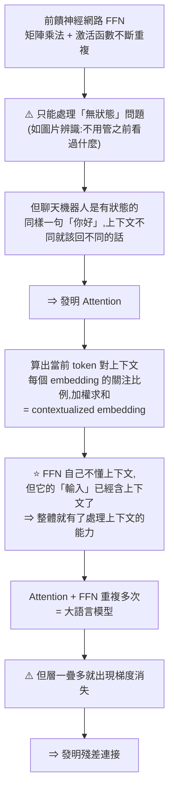
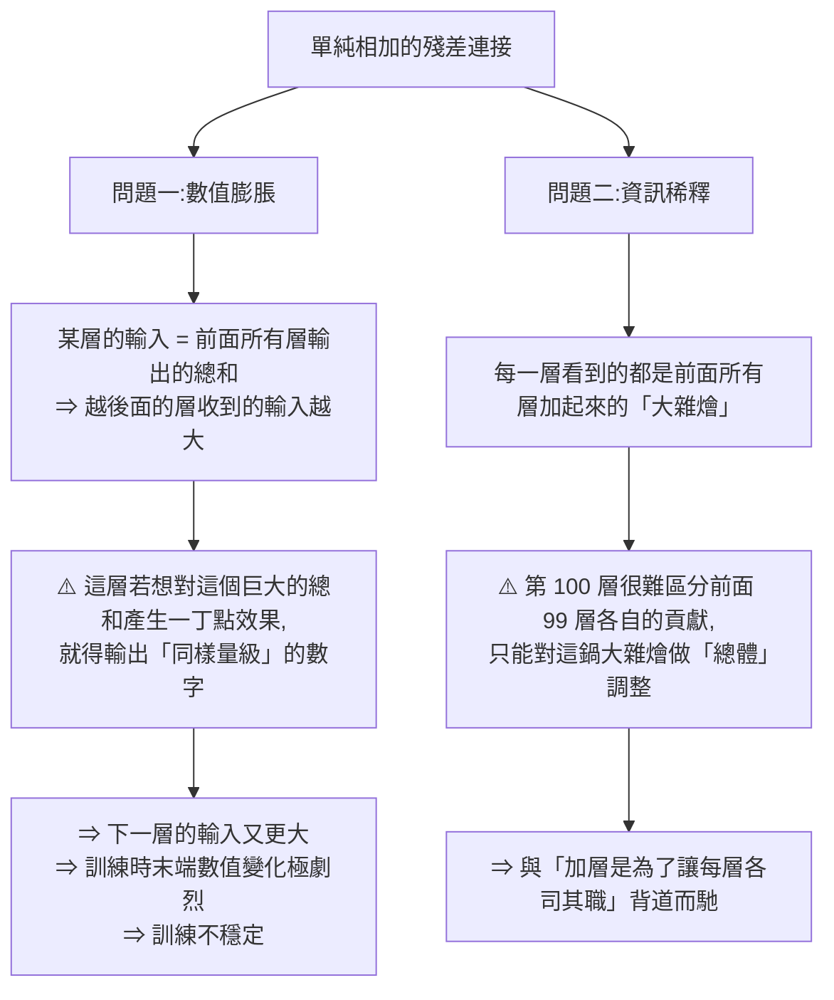
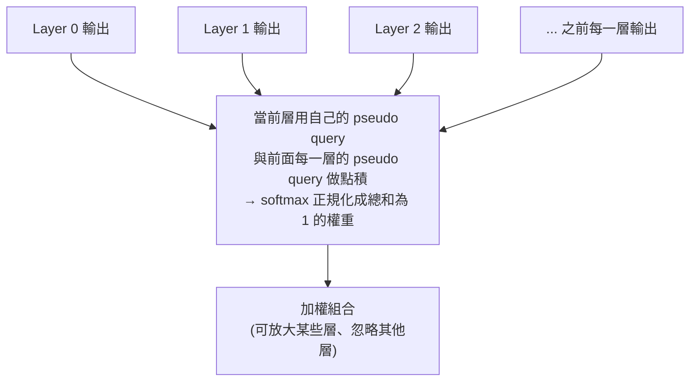
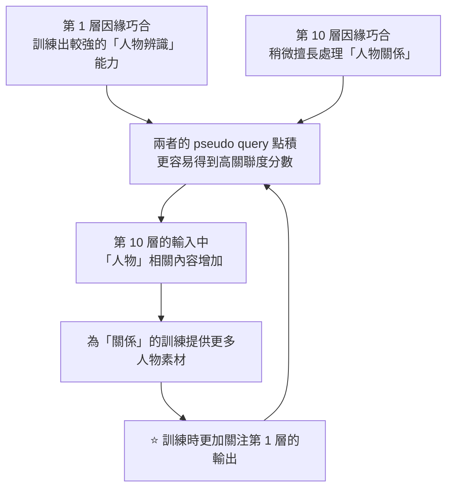
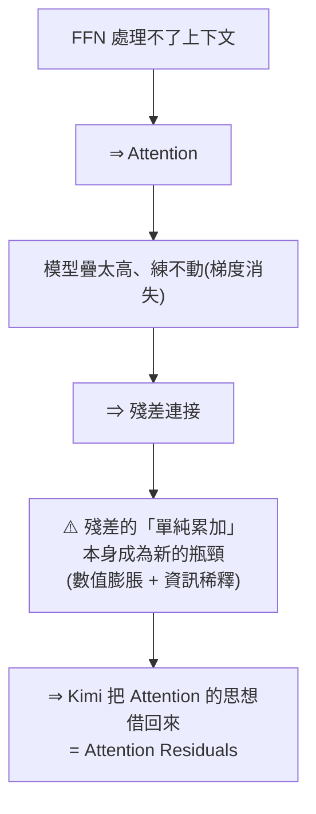

# Attention Residuals:把注意力「轉 90 度」用在網路深度上

**主題分類:** AI / LLM 架構
**研究對象:** Kimi(Moonshot AI)論文〈Attention Residuals(注意力殘差)〉
**來源:** 兩支影片交叉整理(見文末「來源」)——
- **bycloud**〈An Insanely Elegant LLM Architecture Breakthrough Just Dropped〉(2026-05-18,約 14 分;依完整逐字稿整理)
- ⭐ **程序员老王**〈注意力残差是什么?[白话读论文]〉(2026-04-02,約 11.6 分;**該片無字幕,逐字稿以 CPU faster-whisper 轉錄、非官方字幕**)

**整理日期:** 2026-05-25(初版)/ 2026-08-22(**併入老王版的白話推導、兩個問題的拆解與成本分析**)

> ⭐ **前傳:[[pre-norm-vs-post-norm-transformer]]** —— 本文第 3 節的問題,要先懂「為什麼大家從 post-norm 換到 pre-norm」才好理解。
> 相關筆記:[[kv-cache]]、[[llm-explained-3blue1brown]]、[[microgpt-karpathy]]、[[token-vs-embedding-llm-and-rag]]

---

## 1. 摘要

2026 年前三個月就出現了近期最重要的 LLM 架構突破之一。Kimi(Moonshot AI)提出 **Attention Residuals(注意力殘差)**,並已在自家模型上 **大規模驗證**(連馬斯克都轉發)。核心想法極為乾淨直覺:既然「注意力」解決了 RNN 在 **序列維度** 上把資訊壓成單一狀態的問題,那為什麼不把同樣的招式用在 **網路深度(層與層之間)**?作者形容這像是 **把注意力旋轉 90 度**。(影片補充花絮:關鍵作者之一是一位 16 歲高中生。)

⭐ **一句話**:**參考 attention 的思想,來解決 residual 的問題** —— 論文標題的兩個字剛好就是這個意思。

---

## 2. ⭐ 從第一原理推起:為什麼會需要殘差

老王版最有價值的是**把整條演化鏈從頭推一遍**,而不是直接跳到論文。



### 梯度消失的白話版

訓練時參數是**從輸出端往輸入端一層一層調**的,而**每經過一層,調整幅度就變小一些**。

⚠️ **好巧不巧,離輸入越近的層,往往也是越重要的。** 於是形成兩難:

```
層數太少 ⇒ 模型不能理解複雜的邏輯
層數太多 ⇒ 重要的前幾層根本調不動
```

### 殘差連接怎麼解決

改造模組之間的連接方式,拉出一條**從輸入直通輸出的通道**:

⭐ **關鍵的觀念轉換**:attention 與 FFN 這些模組的角色,從「**把輸入完全轉化成另一種形式**」變成「**往這條通道裡加入一些資訊**」。

```
最終輸出 = 輸入 + 第1個attention的輸出 + 第1個FFN的輸出 + 第2個attention的輸出 + …
```

**因為每一層的輸出都對結果有「直接」貢獻,訓練時就必定有一部分梯度能直接傳到每一層 ⇒ 梯度消失解決了。**

> ⭐ **這個架構就是現代 LLM 的基本範式** —— 早期 GPT 完全是這個結構,後來的模型都是在它上面衍生(DeepSeek 把 FFN 換成 MoE、Qwen 把 attention 改成 GQA 等等)。
>
> ⚠️ **但這條「連續相加」的殘差連接,一直都沒怎麼動過** —— 老王的解讀很到位:**大概是因為它太簡單了,畢竟只是一個加法,看起來沒什麼優化空間,時間一長人們也就習慣了。**

---

## 3. ⭐⭐ Kimi 找到的兩個問題(不是一個)

這是本次合併最重要的補強 —— 殘差的毛病其實是**兩個獨立的問題**,而不是籠統的一個「稀釋」:



### 問題一:數值膨脹(magnitude inflation)

⭐ **這是一個負回饋迴圈**:後面的層為了「被聽見」,必須產生**越來越大的輸出量**來蓋過累積訊號 → 表示越長越大,卻不一定更精準 → 下一層又要更大。

### 問題二:資訊稀釋(information dilution / Pre-norm Dilution)

我們增加層數,是希望**每層都對資料做有針對性的加工** —— 比如最初幾層劃分人物、後面識別關係、再後面理解故事。

> ⭐ 老王的補充很誠實:**「雖然我們沒辦法真的精確控制每一層的用途,但我們至少希望每一層的功能是有所側重的,而不是處理一片混沌。」**

> **類比:** 每堂課後把所有筆記丟給 AI 摘要,下一堂再拿「摘要+新筆記」再摘要……到學期末,你只剩一份「摘要的摘要」,早期細節全沒了。

⭐⭐ **兩個問題的共同根源**:**「單純相加」這個操作太原始了 —— 它對每一層輸出的內容都沒有側重。**

> 這正是 RNN 當年在序列維度上垮掉的原因(把所有先前資訊壓進單一狀態),而注意力機制在序列上避開了它——**深度維度卻一直沒這麼做。**

---

## 4. 解法:對深度做注意力

**既然注意力可以用來找「字與字」之間的關聯,那能不能用相同的方法找「層與層」的關聯?**



### ⭐ 機制細節

1. **拿掉那條「把前面全部相加」的直通路徑。**
2. ⭐ **給每一層配一個「偽查詢向量(pseudo query)」** —— **這個向量是模型參數的一部分,訓練時會被一同調整。**
3. 當前層用自己的 pseudo query,**與前面每一層的 pseudo query 做一次點積** → 得到一個數字,代表**對該層輸出的關注程度**。
4. 經過 **softmax** 把關注度轉成百分比。
5. 按百分比乘上每一層的輸出,再相加 —— 這才是當前層的輸入。
6. **第一層前面沒有別的層,所以它的輸入就是原始輸入本身。**

> ⭐ **適用範圍**:雖然叫 attention residuals,但它**對 FFN、MoE 等任何層都適用**,不限於 attention 層。

### ⭐⭐ 為什麼這樣就同時治好兩個問題

| 問題 | 為什麼被解決 |
|---|---|
| **① 數值膨脹** | ⭐ **softmax 保證權重總和必定是 100%** ⇒ 加權求和的結果**永遠在同一個數量級**,不會越疊越大 |
| **② 資訊稀釋** | ⭐ 相加時乘上了關聯度百分比 ⇒ 一個層的輸入**對先前的輸出是「有所側重」的**,更容易訓練出各層的專業分工 |

### ⭐ 專業化的正向回饋(老王版獨有的解釋)

這段把「為什麼分工會自己長出來」講得很清楚:



⭐ **這是一個自我強化的迴圈** —— 不需要人工指定哪一層做什麼,**分工會在訓練中自己浮現並被放大。**

> 等於把「固定的加法捷徑(殘差)」升級成 **可訓練、隨輸入動態調整的深度路由**:把深度從「盲目累加」變成「**選擇性檢索**」。

---

## 5. ⚠️ 代價與妥協:Block Attention Residuals

### 真正的瓶頸不只是算力

純做法有 **二次方擴張** 問題:128 層就要保留 128 個向量並在每層做注意力,最後一層約需 8,000 次注意力運算。

⭐ **但老王點出更關鍵的一點**:除了計算開銷大,**還必須「保存並讀取」前面每一層的輸出**。

> ⚠️ **這對顯存大小與讀取頻寬都是非常大的挑戰。**

⭐ **這才是分塊的真正理由** —— 不是算不動,是**存不下、讀不夠快**。這跟 [[kv-cache]] 面臨的瓶頸本質相同:**現代 LLM 的限制常常在記憶體頻寬,不在浮點算力。**

### Block Attention Residuals(分塊版)

- 把層分成 **區塊**(例如每塊約 10–12 層)。
- ⭐ **區塊內部:仍用普通的殘差連接**(便宜)。
- ⭐ **區塊與區塊之間:才用注意力殘差**(精準)。
- 區塊結尾把輸出合併成 **單一摘要表示**;跨區塊只注意各區塊的摘要(例如 8 個),而非每一層。
- 把記憶體與計算從「隨總層數擴張」降到「隨區塊數擴張」。

> ⭐ 老王的總結很傳神:**「局部大雜燴、全局精細提取」** —— 在精準度和開銷之間找平衡點。

---

## 6. 實測成果

- 驗證損失 vs 計算量:**full 與 block 兩版都壓在 baseline 曲線之下**(同樣計算量、更低損失);且 **block 幾乎與 full 重疊**,代價極小。
- Block 版可在 **少用約 1.25 倍計算量** 的情況下追平 baseline——等於 **訓練打 25% 折扣**,卻只多約 **4% 訓練負擔**。
- 向量量級(magnitude):block 版維持穩定,baseline 則指數成長(Figure 5),**證實緩解了「靠放大輸出搶話語權」的負回饋** —— 也就是第 3 節的問題①。
- **48B 參數、1.4 兆 token** 的模型上,**每一項下游任務都進步**;**多步推理(GPQA Diamond、數學)漲幅最大**——因為後面的層能選擇性回取早期表示。

---

## 7. 為什麼有效(三個理由)

1. **資訊保存:** 早期層仍可被個別存取,有用訊號不必在反覆混合中掙扎求生。
2. **修正量級問題:** 各層改用「相關性」競爭,而非靠「輸出量級」競爭。
3. **提升深度表達力:** 從固定線性累加,變成隨輸入動態組合所有層,更靈活。

---

## 8. 與 MHC 的關係

| | MHC | Attention Residuals |
|---|---|---|
| 作用位置 | **層內**(多條平行串流互相混合,等於把網路「加寬」) | **跨層**(沿深度連接,各層回看並選取先前層) |
| 方向 | 擴大表示,減少資訊流失 | 讓資訊事後更容易被回取 |

兩者 **正交**,理論上可組合(每層多串流 + 跨層注意),但實務上多半 **報酬遞減**,還會犧牲注意力殘差的簡潔與效率優勢、實作變噩夢。作者框架傾向:**Attention Residuals 是更乾淨、更優雅的解。**

---

## 9. 工程落地

- 直接插進 Kimi 最新的 **Kimi Linear** 架構(其餘不動),在訓練、scaling law、下游基準上 **一致受益**。
- 論文約 **2/3 篇幅在談效率**:除 block 設計外,還有 **兩階段計算策略、跨 pipeline 階段的快取**。
- 最終 **訓練負擔僅幾個百分點、推理延遲增加 < 2%**,幾乎可忽略。

> 啟示:如今前沿實驗室不只要想出漂亮架構,還得 **在大規模上實作並證明可行**。

---

## 10. 應用案例:它對誰有用、怎麼用

- **訓練前沿大模型的團隊(最直接):** 想在 **固定算力預算** 下榨出更低 loss——block 版可少用約 1.25× 計算追平 baseline、只多約 4% 訓練負擔。等於「同樣的 GPU 時數,訓出更強的模型」。Kimi 已把它插進 **Kimi Linear** 架構驗證。
- **需要強多步推理的應用:** 因為漲幅最大的是 GPQA Diamond、數學等任務(後層能選擇性回取早期表示),做 **數學/程式/長鏈推理** 產品的人最該關注。
- **架構研究者:** 與 MHC 正交,可當作「深度方向」的獨立改進維度來組合實驗(但注意報酬可能遞減、且犧牲簡潔)。
- ⭐ **要評估「值不值得上」的人:先算記憶體,不是先算 FLOPs** —— 因為真正的瓶頸是「保存並讀取每一層輸出」對顯存與頻寬的壓力。如果你的瓶頸本來就在頻寬,分塊的塊大小就是最該調的旋鈕。
- **一般 LLM 使用者/應用開發者:** 短期不需要動手——這是 **預訓練階段** 的架構改動,你會在「下一代基礎模型更便宜、推理更強」中間接受益。

---

## 11. ⭐ 放在演化鏈裡看

老王版的收尾把整篇的意義講清楚了 —— **這條鏈是「每個解法都製造出下一個問題」**:



> ⭐ 影片的結語值得記:**一切震撼人心的技術突破,本質上都是前人智慧的延伸 —— 拓展前人的思想來解決現在的問題,人們喜歡叫它創新,但這其實是傳承。**

**再把 [[pre-norm-vs-post-norm-transformer]] 接進來,鏈條更完整:**
post-norm 梯度不穩 → **pre-norm 解決** → 但殘差變成單純累加、訊號被稀釋 → **Attention Residuals 解決**。

> 與本 repo 關聯:這是 [[kv-cache]] 之外另一條「讓 LLM 更有效率」的路線,差別在 **kv-cache 是推論期省成本,attention residuals 是訓練期/架構層提升品質與效率** —— 但兩者卡的是**同一道牆:記憶體頻寬**。

---

## 來源

- [YouTube:An Insanely Elegant LLM Architecture Breakthrough Just Dropped(bycloud)](https://youtu.be/iw1VF8HOCrk)(2026-05-18,約 14 分鐘)
- [YouTube:注意力残差是什么? [白话读论文](程序员老王)](https://www.youtube.com/watch?v=pGYrWsNQ8A0)(2026-04-02,約 11.6 分鐘)——⚠️ **該片無字幕,逐字稿以 CPU 版 faster-whisper 轉錄取得、非官方字幕**,可能有少量聽寫誤差(專有名詞如 pseudo query、embedding、梯度等在轉錄中多有同音錯字,已依上下文還原)
- 本倉庫相關筆記:[[pre-norm-vs-post-norm-transformer]]、[[kv-cache]]、[[llm-explained-3blue1brown]]、[[microgpt-karpathy]]、[[token-vs-embedding-llm-and-rag]]
