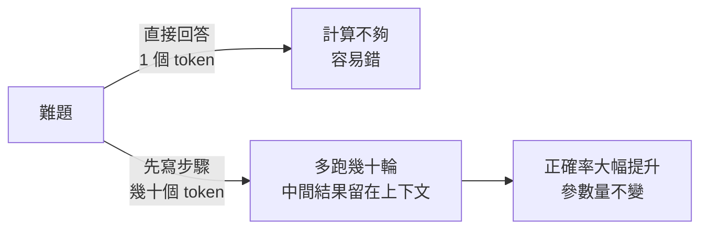
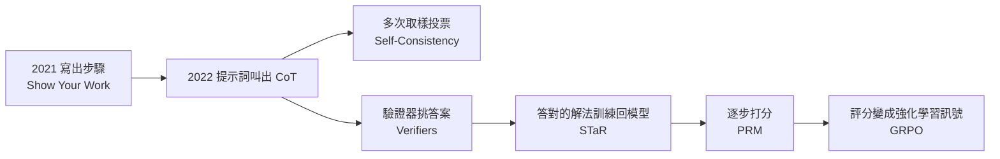

# AI 思維鏈:它為什麼有用、怎麼一路演進,以及「它是幻象嗎?」

**主題分類:** 科技 / LLM 內部機制 — 推理(reasoning)與思維鏈(Chain-of-Thought)
**來源影片(程序员老王,皆無字幕,逐字稿以 CPU faster-whisper 轉錄、非官方字幕):**
- 〈AI思维链有什么用?〉(2026-09-17,約 14.2 分)——§1–§4
- 〈AI思维链是幻象吗?[白话读论文]〉(2025-10-02,約 9.9 分)——§5
**一手素材核實:** 文末列出的 8 篇論文
**整理日期:** 2026-10-02

---

## TL;DR

1. ⭐⭐⭐ **思維鏈為什麼有用:** Transformer **每生成一個 token 的計算量是固定的**——不會因為題目難就多走幾層。但**生成多少 token 可以自己決定** ⇒ 把解題步驟寫出來,等於**用更多 token 換更多計算**,而且中間結果留在上下文裡可以直接用。**不增加參數,就能提升推理能力**;代價是輸出更長、更貴。
2. ⭐⭐ **一條演進線:**
   寫出步驟(Show Your Work 2021)→ 提示詞就能叫出來(大模型)→ **多次取樣投票**(Self-Consistency)→ **驗證器挑答案**(Verifiers 2021)→ **把答對的解法訓練回模型**(STaR)→ **逐步驗證**(PRM,Let's Verify Step by Step)→ **把評分變成強化學習訊號**(DeepSeekMath 的 GRPO)。
3. ⚠️ **反覆出現的一顆雷:** 早期方法**只看最終答案對不對,不看推理過程**——「錯著錯著就對了」的解法也會被當成好樣本;PRM 才開始逐步打分。
4. ⭐⭐ **「它是幻象嗎?」(Zhao 等,2025):** 從零訓練小模型做受控實驗,發現思維鏈在**任務、長度、格式**任何一個超出訓練分布時都很脆弱——**更像高度依賴訓練資料的模式匹配,而不是抽象推理**。
5. ⭐ **結論不是貶低 AI:** 保持健康的懷疑、主動測試邊界、**自己才是真正的思考者**。

---

## 1. ⭐⭐⭐ 為什麼「多寫幾步」就會變聰明

| 人腦 | Transformer |
|---|---|
| 1+1 脫口而出;偏微分方程要想半天、寫滿草稿紙 | **不管問 1+1 還是偏微分方程,每個 token 的計算量都一樣** |
| 會依難度調整思考長度 | 結構事先固定,**每個 token 都走固定層數** |

- 想讓模型解更難的題,傳統做法是**加大參數**——更多資料、更多 GPU、更多電,**都是錢**。
- ⭐ 關鍵觀察:**每個 token 的計算量固定,但 token 數量由模型決定**。直接輸出答案「2」只有一個 token,網路只跑一次;先寫出解題過程,就是**幾十次運算的機會**。
- ⭐ 而且寫出的中間結果**留在上下文裡**,後面可以直接引用,降低最後輸出正確答案的難度。

---

## 2. 早期:把步驟寫出來

| 工作 | 內容(✅ 核實) |
|---|---|
| **Show Your Work(Nye 等,Google,2021)** | 用程式生成**附解題步驟**的題目(例如模擬人從低位到高位做加法),步驟與答案用 **scratchpad** 標記分隔,再微調不同大小的模型 |
| 結果 | 只有在**模型極小、且測試數值範圍與訓練相同**時,沒有步驟的版本略好;**其餘情況有步驟的版本強得多**——模型太小時,完整步驟反而是負擔 |
| **大模型時代** | 參數夠多時**連微調都不用**:在提示詞裡給範例(few-shot CoT),甚至只加一句「**請一步一步思考**」(zero-shot CoT)就能叫出推理過程 |

> 一種直觀理解:大模型在預訓練時**已經看過大量含推理過程的文字**,提示詞只是把能力調動出來。

---

## 3. ⭐⭐ 中期:正確率還差一口氣,怎麼補?

| 方法 | 做法 | ⚠️ 代價 / 侷限 |
|---|---|---|
| **Self-Consistency(Wang 等,Google)** | 同一題**問很多次**,取**出現最多次**的答案——正確答案通常只有一個,錯誤答案千奇百怪 | 計算量成倍增加;老王:「說實話這論文挺水的,但效果確實不錯」 |
| **Training Verifiers(Cobbe 等,OpenAI,2021)** | 讓模型回答大量已知答案的題目,依**最終答案**標記對錯,訓練一個**驗證器(verifier)**打分;實際使用時一題答 100 次,**取驗證器分數最高的** | ⚠️ **只看最終答案,不管推理過程**——「記住這顆雷」;主模型本身沒有進步 |
| **STaR(Zelikman 等,Stanford + Google,2022)** | 讓模型為已知答案的題目生成步驟,**挑出答對的拿來微調自己**;⭐ 答錯的題**把正確答案給它、讓它反推解題過程**(rationalization),也拿去訓練——否則答不出的題永遠進不了訓練集 | ⚠️ **同一顆雷**:只要最後答案對,就假設推理也對 |

> 這個假設「沒有聽起來那麼糟」——token 生成有前後邏輯,答案對的推理**大機率**也對。但世界上確實有「**錯著錯著就對了**」的情況(負負得正),所以還是得解決。

---

## 4. ⭐⭐ 近期:逐步驗證,再變成訓練訊號

| 方法 | 做法 | 重點 |
|---|---|---|
| **Let's Verify Step by Step(Lightman 等,OpenAI,2023)** | 訓練**過程獎勵模型(PRM)**:讀題目與推理過程,**判斷每一步正確的機率**;生成多份解法,選 PRM 分數最高的 | ✅ 為此人工標了 **約 80 萬個步驟標籤**(PRM800K,針對約 7.5 萬份解法)——**非常昂貴**;⚠️ PRM 主要用來**挑答案**,主模型本身沒長進 |
| **DeepSeekMath(2024)— GRPO** | ⭐ 把評分**當成強化學習的訊號**:同一題生成**多條推理**,算出**組內平均分**;**高於平均的獎勵、低於平均的懲罰** | 主模型**越來越傾向生成高分路線**;**不需要另外訓練一個價值網路**(相較 PPO 更省) |

**SFT vs 強化學習(老王的比喻):**
- **監督式微調(SFT)**:先準備好正確的推理過程,讓模型**照著模仿**。
- **強化學習**:像走迷宮——模型**自己走出多條路線**,依品質打分,**目標是拿更高分**。

📌 **本文補充:** DeepSeekMath 論文同時試了**結果監督**與**過程監督**兩種 GRPO;後來的 **DeepSeek-R1** 則主要改用**規則式獎勵**(答案是否正確、格式是否正確),而非 PRM——因為大規模訓練時神經網路獎勵模型容易被「鑽漏洞」(reward hacking)。

> ⭐ 老王:「**計算不夠就寫出步驟;容易出錯就逐步驗證;再把成功的解法變成新的能力。**前人的突破,後人的起點。」

📎 強化學習帶來的增益集中在哪裡,見本庫 [[rl-gains-concentrate-single-middle-layer]]。

---

## 5. ⚠️⚠️ 思維鏈是幻象嗎?(Zhao 等,2025)

### 5.1 一個讓人不安的例子

研究者問模型「**1776 年是平年還是閏年?**」模型的思考:「1776 能被 4 整除,又不是世紀年,**所以是平年**。」——**推理規則用對了,結論卻是反的**(這樣的年份其實是閏年)。

### 5.2 論文主張

✅〈**Is Chain-of-Thought Reasoning of LLMs a Mirage? A Data Distribution Lens**〉(Zhao 等,Arizona State University,arXiv 2508.01191,2025-08):
> 思維鏈的效果取決於**訓練與測試資料分布是否一致**;它反映的是「**從分布內資料學到的結構化歸納偏誤**」。「**一旦超出訓練分布,思維鏈推理就是一個脆弱的幻象。**」

**直白版:** 模型不是在真正思考,而是**在記憶中找到大量「看起來像思考」的片段,用機率上最合理的方式接起來**。以 1776 為例:訓練語料裡「平閏年判斷規則」後面緊跟的例子多半是平年,模型就跟著輸出了——**它內部可能根本沒拿 1776 去算**。

### 5.3 ⭐⭐ 實驗:DataAlchemy

從零訓練一個只會兩種操作的語言模型,**所有訓練資料都由研究者生成**,因此能精確控制「見過 / 沒見過」:

| 操作 | 例子 |
|---|---|
| **字母加密(ROT13)** | 每個字母往後移 13 位:ABCD → NOPQ |
| **循環位移** | 最後一個字母移到最前面:ABCD → DABC |

模型要輸出思維鏈,例如「ABCD 加密得 NOPQ;NOPQ 位移得 QNOP;所以答案 QNOP」。

| 泛化維度 | 實驗 | 結果 |
|---|---|---|
| ⭐ **任務** | 只用加密訓練到 100% 正確,再丟循環位移的題 | ⚠️ 模型**固執地套用加密規則**,既推不出新規則、也不會說「不知道」;只要補**不到 0.02%** 的位移資料微調,馬上學會 |
| | 訓練永遠「先加密再位移」,測試「先位移再加密」 | ⚠️ **推理過程與題目無關,答案卻是對的**——推理與答案脫鉤 |
| **長度** | 只用兩步題訓練,測一步與三步 | ⚠️ 一步題會**硬編出第二步**;三步題做兩步就停——**像在填固定長度的模板** |
| **格式** | 訓練時固定「Problem: …」格式,測試換成「Question: …」或改括號 | ⚠️ **效能顯著下降**——真正的邏輯應該與表面符號無關 |
| 規模 | 不同大小模型、調整參數重做 | 問題依然存在 ⇒「**問題不在模型不夠大,而在學習方式**」 |

> 📌 **本文提醒:** 這是**從零訓練的小型受控實驗**;結論能否完整外推到前沿大模型,論文以不同規模做了檢驗,但仍是**以小見大**的推論。它和「思維鏈有用」並不矛盾——**在訓練分布內,思維鏈確實有效;超出分布,就要小心**。

### 5.4 作者建議怎麼用 AI

1. **保持健康的懷疑**:AI 很擅長用不容置疑的語氣包裝錯誤結論。
2. **主動測試邊界**:設計一些超出常規的問題。
3. ⭐ **我們才是真正的思考者**,AI 是輔助,不是替代。

> 老王:「我們太想看到會思考的機器,以至於**不自覺把流暢的表達等同於深刻的思考**。也許通往 AI 的路上,重要的不是讓 AI 像人一樣思考,而是**人類學會善用一個和我們思維方式完全不同的『異類』**。」

📎 相關:本庫 [[llmentalist-effect-cold-reading-and-verifiers]](為什麼流暢的回答讓人以為它懂)。

---

## 6. 應用案例

### 案例一:什麼時候該開「思考模式」

| 任務 | 建議 | 理由 |
|---|---|---|
| 多步數學、程式除錯、邏輯推演 | ✅ 開 | 多寫步驟 = 多計算 |
| 翻譯、改寫、簡單問答 | 不必 | 白花 token 與時間 |
| 需要高可靠度的單一答案 | 多次取樣 + 投票,或請模型自我驗證 | Self-Consistency 的思路 |

### 案例二:不要被「看起來很合理的推理」說服

- 檢查**推理與結論是否一致**(1776 那種「規則對、結論錯」)。
- 換個**格式或說法**重問同一題(例:把「Problem」換成「題目」),答案若變了,代表它在匹配模式。
- 讓它處理**長度不同**的同類題,看推理步數是否跟著題目變。

### 案例三:設計自己的評測時避開那顆「雷」

只比對最終答案的評測,會把「錯著錯著就對了」算成功——**關鍵流程要逐步檢查**(像 PRM 一樣):每一步的中間結果是否正確、是否有引用依據。

---

## 來源

- YouTube:[AI思维链有什么用?](https://www.youtube.com/watch?v=-IpmrE558Fs)(程序员老王,2026-09-17)、[AI思维链是幻象吗?[白话读论文]](https://www.youtube.com/watch?v=ZLDfTwHm56A)(程序员老王,2025-10-02)——**兩片皆無字幕,逐字稿以 CPU faster-whisper 轉錄、非官方字幕**
- [Show Your Work: Scratchpads for Intermediate Computation with Language Models](https://arxiv.org/abs/2112.00114)(Nye et al.,2021)
- [Chain-of-Thought Prompting Elicits Reasoning in Large Language Models](https://arxiv.org/abs/2201.11903)(Wei et al.,2022)
- [Large Language Models are Zero-Shot Reasoners](https://arxiv.org/abs/2205.11916)(Kojima et al.,2022)
- [Self-Consistency Improves Chain of Thought Reasoning in Language Models](https://arxiv.org/abs/2203.11171)(Wang et al.,2022)
- [Training Verifiers to Solve Math Word Problems](https://arxiv.org/abs/2110.14168)(Cobbe et al.,2021)
- [STaR: Bootstrapping Reasoning With Reasoning](https://arxiv.org/abs/2203.14465)(Zelikman et al.,2022)
- [Let's Verify Step by Step](https://arxiv.org/abs/2305.20050)(Lightman et al.,2023)
- [DeepSeekMath: Pushing the Limits of Mathematical Reasoning in Open Language Models](https://arxiv.org/abs/2402.03300)(Shao et al.,2024)
- [Is Chain-of-Thought Reasoning of LLMs a Mirage? A Data Distribution Lens](https://arxiv.org/abs/2508.01191)(Zhao et al.,2025)

**Whisper 專有名詞還原對照:** 思续铲/思绝铅/斯维莲 → 思維鏈;Scratch → scratchpad;Training Worry Fires / Warrior Fire / Varifier → Training Verifiers / verifier;Self-Tought Resonance / START → STaR;Deepseak / DeepSeakMess → DeepSeek / DeepSeekMath;GPRO → GRPO;Jimmy Knight → Gemini;亚利桑那大学 → Arizona State University。
