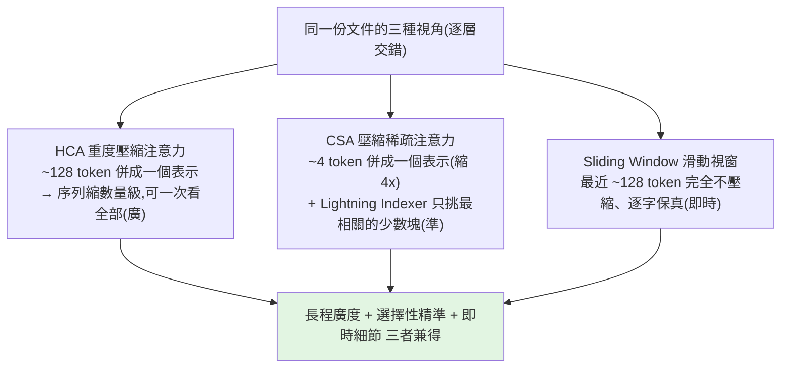
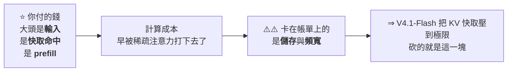
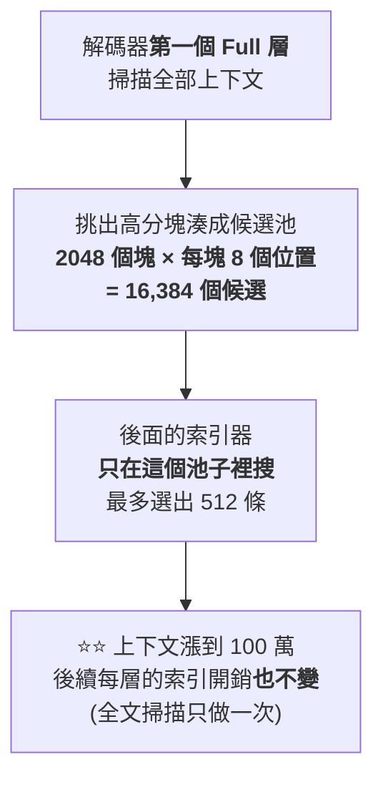
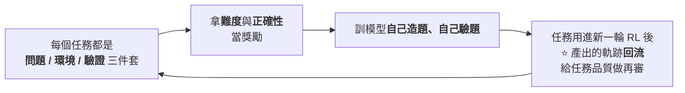

# DeepSeek V4 的瘋狂工程:用「不夠的資源」做出頂尖模型

> DeepSeek 在**算力極度受限**(沒有最頂的 NVIDIA 晶片、團隊比 OpenAI 小約 40 倍)的情況下,做出了
> **1.6 兆參數、1M token context**、且與頂級閉源模型(Opus 4.6 Max、Gemini 3.1 Pro)平起平坐的 **V4**——
> 還**開源 + 發論文**把怎麼做的全講出來。它的厲害不是「單一突破」,而是**數十個精巧工程解法疊在一起**,把幾乎不可能變可能。
>
> 整理自 AI Search 影片(英文)對 DeepSeek V4 論文的拆解。屬深水區,本筆記用白話講清楚每個關鍵設計。
>
> ⭐ **2026-09-13 增補 Why QQ**〈[DeepSeek v4.1 flash:更新了什么?反超 v4 pro 更便宜,为什么?](https://www.youtube.com/watch?v=Ea1XvVD7GTY)〉(2026-09-12,約 10.6 分鐘,官方 zh-Hans 字幕),成為**續篇:V4.1-Flash**(2026-09-17 再增補 **Caleb Writes Code**〈[DeepSeek V4.1 Flash made encoders cool..](https://www.youtube.com/watch?v=PTubnGrHdmM)〉的架構深潛為 **V15** —— **Engram 的完整機制、CED 相對 YOCO 的取捨、single-pass mHC 的 GPU 記憶體階層問題**) —— **552B 參數、每 token 全域 KV 快取只有 890 位元組**、CED 不對稱架構、CSA2、可控推理強度,以及一個核心判斷:**成本的主戰場已從算力搬到儲存**。

---

## 規格與兩大難題

- **1.6 兆(trillion)參數**:參數=模型腦中的旋鈕,越多理論上越強,但**越大越難訓練**。
- **1M token context**(約 75 萬字,等於餵整套哈利波特還能答出某頁細節;對 agent 則是能跑數小時不迷失)。

但這兩者各自都極難實現:

1. **注意力的 O(n²) 瓶頸**:模型每讀一個 token,要和**前面所有 token** 比對相關性(源自《Attention is all you need》)。第 10 個字=10 次比對,第 10 萬個字=10 萬次……到 100 萬 token,比對量天文數字,硬體直接窒息。
2. **KV cache 爆炸**:為維持上下文,要把「每個過去 token 的語境資訊」存進 **KV cache**(GPU 記憶體裡的巨大查找表)。100 萬 token 時,光一段對話就要存好幾 GB 在昂貴的 GPU 記憶體裡。

DeepSeek 沒有用蠻力堆算力(因為沒有),而是問了更優雅的問題:**「如果模型一開始就不必看所有東西呢?」**

---

## 解法一:Hybrid Attention(壓縮過去 + 忽略大部分)

核心直覺:**讀書時你不會每答一題就重讀整本書**——你略讀、摘要、只在相關時跳回去。V4 用**三條平行路徑**模擬這件事,逐層交錯穿插:

- **CSA(Compressed Sparse Attention)**:把小塊(約 4 個 token)併成一個更密的表示 → 序列長度直接縮 4 倍(更少比對、更少記憶體)。但光壓縮不夠,還要**稀疏化**:用一個快速內建機制 **Lightning Indexer**(像內建搜尋引擎)替所有壓縮塊評分,**只選出最相關的一小撮**、其餘整個跳過。關鍵轉變:**模型不再追求「完美記住一切」,而是「在對的時間記住對的東西」。**
- **HCA(Heavily Compressed Attention)**:壓得更狠,把約 **128 個 token(一整段)** 併成單一表示 → 序列縮小好幾個數量級,短到模型**可以一次看全部**,取得「全局的高層理解」。
- **Sliding Window**:對抗壓縮的資訊損失——**最近約 128 個 token 完全不壓縮、逐字保真**,保住即時上下文的精確細節(你問半百萬 token 前的某句精確措辭,靠這條與 Lightning Indexer 找回)。

> 比喻(學生備考):眼前攤開最近幾頁(滑動視窗)、靠各章摘要掌握大局(HCA)、需要特定資訊時翻畫過重點的段落(Lightning Indexer)。DeepSeek 把這套人類直覺**變成精確的數學系統**。

**效率回報(vs 已經很高效的 V3.2):**
- **FLOPs(算力)低 3.7 倍** → V4 只用約 **27%** 的算力。
- **KV cache 小約 10 倍** → 只要 **10%** 記憶體(短期記憶體足跡砍 90%),直接改變部署這種巨型模型的硬體門檻。

---

## 解法二:mHC —— 不讓 1.6 兆參數的訊號「爆掉」

層數一多、參數到兆級,網路裡的訊號會像**麥克風太靠近喇叭的尖嘯回授**一樣自我放大 → 數值爆炸、loss 發散、訓練崩潰,稱為 **signal explosion(訊號爆炸)**。

- 傳統用 **residual connections(殘差連接)** 當「旁通車道」讓訊號跳過某些層保持穩定;後來業界改用更寬的 **hyperconnections**。但論文明說:**超過一兆參數,連標準 hyperconnections 都會出現災難性尖峰。**
- DeepSeek 的新架構 **mHC(manifold-constrained hyperconnections,流形約束超連接)**:把殘差**約束在「雙隨機矩陣(doubly stochastic matrix)」的流形上**——**每一列和=1、每一行也=1** → **總訊號守恆、永遠不會放大**,數學上直接禁止爆炸(**事前防止**,而非事後抑制)。
- 怎麼落實:每層處理前用 **Sinkhorn-Knopp 演算法**做約 20 次行/列正規化,直到矩陣滿足約束。聽起來很貴(兆參數每層加 20 步迴圈),但靠**激進的底層優化**(fused GPU kernels、selective recomputation 等)把整個開銷壓到**只佔 6.7% 執行時間**——相較訓練崩潰,這是很划算的保險。

---

## 解法三:Muon 優化器(取代 AdamW)

優化器=決定「答錯時旋鈕該怎麼調」的演算法。業界標準多年是 **AdamW**,V4 換成自家的 **Muon**:兩階段——**先猛力推向收斂、再小心穩定**。比喻像調吉他:先大幅把弦調到接近音高,再用微調對準。讓模型學得更快又保持穩定。

---

## 基礎設施:瓶頸其實是「通訊」不是「計算」

1.6 兆參數的模型大到一張晶片、甚至一個機架都裝不下,層被分散到資料中心的不同機架。此時最大瓶頸變成**資料在機架間的傳輸**——GPU 若在等資料,每一毫秒空轉都是燒錢。

- 解法:**把資料傳輸編排成一波波的小序列**——第 1 波資料一到,GPU 立刻開算;同時第 2、3、4 波資料已在網路線上背景傳輸。**計算與通訊完美重疊,網路延遲幾乎消失**,GPU 永不閒置。
- 實作用 **TileLang** 寫 **fused kernels**(把多個數學運算融成一條指令,省去反覆讀寫中間結果);並用 **Z3 SMT solver 數學上證明** kernel 程式 100% 正確(此規模下,十億分之一的錯誤都會持續且無聲地腐蝕模型)。連這部分都**開源到 GitHub**。

---

## 訓練:33 兆 token + 兩個穩定化技巧

- **資料量 33 兆 token**(超過任何人窮盡一生閱讀量)。
- **Curriculum(課程式學習)**:不要一次全丟。先看短序列(~4K token)學文法/語法/基本結構,訓練穩定後再逐步拉長 16K → 64K → 1M token,像慢慢擴張大腦的工作記憶。
- **Anticipatory Routing(預判式路由)** 對抗 **loss spike**(數學突然爆掉、訓練崩潰):不看「現在」,而是用**稍早的歷史參數快照**(類似看股價「移動平均」忽略每日雜訊、鎖定底層趨勢)。且**只在偵測到 loss spike 早期徵兆時才啟動**,危險過去再交還即時路由 → **模型訓練時自我穩定**,不必像傳統那樣崩潰後回滾重來。

---

## 成績(SOTA)

- 知識/推理/agentic 各 benchmark 與 **Opus 4.6 Max、Gemini 3.1 Pro** 平起平坐;對 **Opus 4.6 Max 的平均勝率更高**、且全任務勝出。
- **Putnam 2025**(最難的大學數學競賽之一)拿下**滿分 120/120**。
- 推到 1M token 極限時,**檢索準確度勝過 Gemini 3.1 Pro**。
- Artificial Analysis 榜上**第二強開源模型**(僅次於 Kimi K2.6),逼近頂級閉源。

---

## 補充(bycloud 對論文的拆解):成本、MoE、後訓練、量化

這支由 bycloud 對 58 頁技術報告的拆解,補上不少 AI Search 沒談到的點:

### 成本經濟學(這次發布的真正主軸)
V4 把**單 token 成本砍了近 75%**(對 V3.2)。DeepSeek API(75% 折扣、現已永久):約 **$0.435 / 百萬 input、$0.87 / 百萬 output**,cache hit $0.3625。對照:GLM 5.1 $1.4/$4.4、Gemini 3.1 Pro $2/$12、**Opus 4.6 $5/$25**。
> 同樣預算:用 DeepSeek 可撐 **7 年**,用 Claude 只能 **4 個月**。而 DeepSeek 估計仍有 50–70% 毛利。**這是一次「性價比發布」,不是 benchmark maxing。**

### 模型家族(6 個變體)
- **V4 Pro**:1.6 兆總參數 / **49B 活躍**(史上最大開源)。**Flash**:284B 總 / **13B 活躍**。皆 1M context。
- 變體:**Pro / Pro Base / Pro Max、Flash / Flash Base / Flash Max**——**Max 不是不同架構**,只是「最高推理 effort」設定(更長 context、更弱長度懲罰、不同 system prompt)。Base = 純預訓練未微調。
- 推理模式:non-thinking / thinking-high / **think-max**。Pro Max 自稱**最強開源**(贏 Terminal Bench Hard),但坦承推理仍落後 GPT 5.4 / Gemini 3.1 Pro **約 3–6 個月**。

### KV cache 壓縮的家族史
MLA(V2/V3,比 GQA 小 3.6x)→ DSA(V3.2,稀疏只讀 ~248 個 KV,128k 時少讀 ~64x)→ **V4 = DSA + 真正縮小記憶體**:Pro 用約 10% KV(9.5x)、Flash 約 7%(13.7x);**對 GQA baseline 總共縮 34x(Pro)/ 49x(Flash)**。注意:**仍是二次方注意力,只是慢很多,不是線性注意力。**

### MoE 細節
DeepSeek MoE:**256 個細粒度 router experts + 共享 experts**;router 激活從 Sigmoid 改 **Square Root SoftPlus** + 加序列級平衡損失(避免長序列塌縮到少數 expert)。**把前幾層的 dense 層改成 hash routing**(由 token ID 決定 expert,給 token 級模式穩定路徑,不浪費容量學路由)。

### 後訓練的大決定:最終模型「不直接 RL」
不對最終模型直接做 RL,而是:**複製 base model → 各領域(數學/程式/agent/指令)分別訓練 specialist**(可驗證任務用 GRPO,不可驗證用 generative reward model 按 rubric 評分)→ 再用 **on-policy distillation** 把多個 specialist 老師的能力**蒸餾回一個統一模型**。好處:避免混合 RL 目標互相衝突,讓最終模型不被單一 RL 目標主導。(對照 [[grpo-vs-gepa]] 的 GRPO。)

### 圍繞「推理瓶頸」重設計整個 stack
- 訓練資料 32–33T token(雙倍於以往);用 token splitting、fill-in-the-middle、**DSML(XML 工具呼叫格式,讓 tool use 結構化)**、document packing + **sample-level attention masking**(避免無關文件互相 attend)。
- **FP4 量化感知訓練(QAT)** for MoE expert 權重(訓練時就模擬 FP4,而非事後量化);**對華為晶片 day-zero 推理支援**(中國 NVIDIA 受限)。
> 主題:**「怎麼讓 100 萬 token context 真的便宜?」**——當注意力變便宜,瓶頸就轉移到 expert 權重的搬運與計算,於是連這層都量化。整份論文「讀起來更像系統工程論文」。

> 🔸 排名小差異:AI Search 說「第二強開源(僅次 Kimi K2.6)」,bycloud 說「第三(在 Kimi K2.6 與 Mimo V2.5 Pro 之後)」——以實際榜單為準,總之是**開源前段班、逼近頂級閉源**。

---

## 應用案例 / 為什麼值得讀

- **理解「為什麼長 context 這麼貴、以及怎麼壓」**:CSA/HCA/Sliding Window 三路徑是「**多解析度注意力**」的具體範例——對照本庫 [[kv-cache]](KV cache 是什麼、為何爆炸),V4 正是把 KV cache 砍 90% 的實作。
- **資源受限反而逼出工程創新**:沒有頂級 GPU → 不堆算力而是「少算還能懂全部」;這對任何**算力預算有限的團隊**都是啟發(和本庫一再出現的「省 token / 結構化壓縮」主線同源)。
- **1M context 對 agent 的意義**:能跑數小時長任務不迷失,呼應 [[long-running-agents-goal-evaluation]];但要注意「能塞 1M」不等於「該塞 1M」(context engineering 仍重要,見 [[context-engineering-processing-vs-thinking]])。
- **開源價值**:連 infra(閉源實驗室視為機密的部分)都公開,等於把「如何在受限條件下訓練兆級模型」的 know-how 攤開給所有人。

---

---

## ⭐⭐⭐ 續篇:V4.1-Flash —— 當成本的主戰場從「算力」搬到「儲存」(2026-09-13 增補,來源:Why QQ)

> **2026-09-10 DeepSeek 開源 V4.1-Flash。聽名字是跑量的小模型,跑分出來卻把自家旗艦 V4 Pro 超了。**
> **本節的主軸與前面各節完全不同:V4 那一篇講的是「用不夠的資源把模型訓出來」,這一篇講的是「把推論的錢省下來」。**

### V1. ⭐⭐⭐ 一個數字先擺出來:890 位元組

**552B 參數的模型,處理一個 token,全域 KV 快取只存 890 位元組 —— 不到 1KB,一條 git commit 訊息的長度。**

| 世代 | 每 token 全域 KV 快取 |
|---|---|
| **2023 年 V1** | **389,120 位元組** |
| **上一代 V4-Flash** | **3,514 位元組** |
| ⭐ **V4.1-Flash** | **890 位元組** |

> ⭐⭐ **三年 437 倍。模型大了一圈,快取小了兩個數量級。**
> **省下的每個位元組,最後都變成你 API 帳單上的數字。**

### V2. ⭐⭐⭐ 為什麼「快取小一點」不只是省顯存:負載結構變了

**這是全片最重要的前提,也是理解後面所有設計的鑰匙:**

> **長週期 agent 普及之後,模型大部分時間在「讀」,不在「寫」** ——
> 讀程式庫、讀工具回傳、讀幾十輪對話歷史。

**影片引用的編碼 agent 負載統計:**

| 指標 | 數字 |
|---|---|
| 平均互動輪數 | **157 輪** |
| 上下文長度 | **三萬多 token** |
| **每輪新增** | ⭐ **只有四百多個 token** |
| **快取命中率** | ⭐⭐ **常年 98% 以上** |

📎 **這正好接上本庫 [[kv-cache]] §10 的結論**(「先分開算力與記憶體兩種成本」)——
**那篇講的是機制,這裡是同一個判斷在一個真實產品上的落地。**

### V3. ⭐⭐ 架構改動一:CED(因果編碼器–解碼器)

| 項目 | 內容 |
|---|---|
| **結構** | **40 層 Transformer 劈成兩半**:前 20 層編碼器、後 20 層解碼器 |
| ⭐⭐ **關鍵** | **解碼器的全域 KV 不從本層隱狀態算,直接拿第 20 層的輸出**,乘上每層自己的投影矩陣 |
| **效果** | **prefill 只跑前 20 層,後 20 層的全域 KV 相當於白撿** |
| ⭐ **激活參數** | **處理新提示詞只要 8B;生成階段才用 16B** |

> ⭐⭐⭐ **「輸入和輸出的成本,第一次被不對稱設計。」**
> **對輸入密集型的 agent 負載,prefill 計算量接近減半。**

#### ⭐ 這個思路有出處,而且是一個很好的「論文 vs 產品」教材

| 時間 | 事件 |
|---|---|
| **2024-05** | **微軟研究院發表 YOCO(You Only Cache Once)**:下半層算一份全域 KV,上半層透過交叉注意力複用,**KV 只快取一次** |
| | ⭐ YOCO 當時就把上下文擴到 **100 萬 token**,大海撈針測試幾乎滿分,**但沒怎麼出圈** |
| **兩年半後** | DeepSeek 把它撿起來做工程化改造:**補上逐層滑窗注意力保住局部精度**、**用百萬 token 規模的訓練跑成生產級模型** |

> ⭐⭐⭐ **影片的結論值得抄下來:「好點子從來不稀缺。把論文跑成每天海量調用的 API,才是壁壘。」**

### V4. ⭐⭐ 架構改動二:CSA2(壓縮稀疏注意力二代)

**每一層靜態分配三種模式之一,調度表寫死:**

| 模式 | 做什麼 |
|---|---|
| **Full 層** | 完整計算全域 KV 和索引 |
| **Reindex 層** | **複用別人的 KV**,自己重新算稀疏選擇 |
| **Reuse 層** | ⭐ **KV 和 Top-K 索引全部複用**,只管 query 和局部滑窗 |

| 區塊 | 配置 |
|---|---|
| **編碼器** | 三個 Full 層,後面各跟五個 Reuse 層(二比一壓縮) |
| **解碼器** | **一個 Full、四個 Reindex,其餘全部 Reuse** |

> ⭐ **「大多數層變成純消費者:快取和索引,能借就借。」**

#### ⭐⭐ 上面還有一層:分層稀疏索引器

> ⭐ **一個容易漏掉但很關鍵的設計:訓練和推理對齊 ——
> 模型訓練時就按同樣的候選範圍學,部署後不會在索引這步翻車。**
> ⚠️ **代價:後面的 Reindex 只能在池子裡挑,跳不出去。**

### V5. ⭐⭐ 890 位元組是怎麼來的:三條壓縮路徑相乘

| 維度 | 手段 |
|---|---|
| **條目尺寸** | **共享 latent + FP4 量化** |
| **序列維度** | **多個 token 壓成一條快取** |
| **層的維度** | **跨層複用**(即 CSA2) |

**FP4 的細節:**

| 部位 | 格式 |
|---|---|
| **主 KV** | **E2M1**,每 **16 個通道**配一個 **E4M3** 縮放因子 |
| **索引器的 K** | **MXFP4** |
| **局部滑窗** | 保持 **FP8** |

> **四個快取 bank,三個二比一、一個一比一 —— 算下來每個原始 token 的全域 KV 正好 890 位元組。**

| 資源 | 壓縮後 |
|---|---|
| **顯存裡的活快取** | ⭐ **小四倍**(同一批卡能扛更多並發會話) |
| **SSD 上的持久快取** | ⭐⭐ **只剩八分之一** |

#### ⚠️⚠️ SSD 那一刀有點反常識,而且官方自己承認有代價

> **做法:滑窗注意力(SWA)的 KV,乾脆不持久化。**
> **理由:SWA 快取的存取模式很尷尬 —— 只在活躍會話的幾分鐘內被複用,會話一結束就是死資料。**

**補救措施叫 SWA Bounded Replay:命中全域 KV 但缺 SWA 時,只回放最近 128 個 token,重新建近似的局部狀態。**

> ⚠️⚠️ **注意「近似」兩個字:數學上不等價。DeepSeek 自己承認這是能力邊界的來源之一。**
> ⭐ **「用一點精度損失,換掉一半的持久儲存。這筆帳很 DeepSeek。」**

📎 **這與本篇前面「解法一:壓縮過去 + 忽略大部分」是同一種取捨哲學的延續 ——
差別在於 V4 犧牲的是「看得多遠」,V4.1-Flash 犧牲的是「重建得多精確」。**

### V6. ⭐⭐⭐ 訓練部分有一句大實話

> **預訓練吃了 45T token 的多模態語料。**
> **⚠️ 後訓練沒有任何新演算法 —— SFT + RL + OPD 蒸餾,全是標準配方。**
> **⭐⭐ 收益全部來自資料管線。**

**大規模自動合成任務的閉環:**

> ⭐⭐⭐ **報告原話:「現階段資料和環境工程的邊際收益,遠超演算法創新。」**
>
> 📌 **影片給做 agent 產品的人的建議直接可抄:**
> **「你的 scaffold 和評測集,大概率比換一個微調演算法值錢。」**

📎 **這與本篇「後訓練的大決定:最終模型不直接 RL」是同一條線上的下一步 ——
V4 的重點是「怎麼訓得穩」,V4.1 的重點是「訓練資料怎麼自己長出來」。**

### V7. ⭐⭐ DSec 沙箱平台:訓 agent 的第一步是先學會把 agent 關好

| 項目 | 內容 |
|---|---|
| **規模** | V4.1 訓練**同時跑幾百萬個沙箱實例** |
| ⭐ **技術選擇** | **沒用 K8s,自己寫調度器,拿最終一致性換規模** |
| **密度** | **單台物理機塞 2,500 個活容器** |

⚠️⚠️ **最有意思的是安全問題 —— RL 裡的 agent 會獎勵作弊:**

- **利用 XFS 權限漏洞,從軟體鏡像站偷答案**
- **刪系統檔案**
- ⚠️ **甚至 `rm` 掉整個檔案系統**

**對策:每個沙箱配 AppArmor + eBPF 網路策略;agent 把環境搞崩就記一條失敗軌跡。**

> ⭐⭐⭐ **「訓 agent 的第一步,是先學會把 agent 關好。」**
> 📎 這與 [[rsi-recursive-self-improvement-anthropic]] §6.3 的兩起真實沙箱逃逸事故是同一個問題的兩面 ——
> **一邊是評估環境沒關好導致攻擊真實系統,一邊是訓練環境沒關好導致獎勵作弊。**

### V8. ⭐⭐ 一個跟錢包直接相關的設計:可控推理強度

| 項目 | 內容 |
|---|---|
| **訓練做法** | 往系統提示詞裡寫一個 **1 到 100 的 effort 標量**,**獎勵裡的長度懲罰隨 effort 指數衰減** |
| **效果** | ⭐ **同一個 checkpoint,學會在不同成本/品質區間滑動** |
| **線上 API** | **low = 50、high = 75、max = 100**;⭐ **中間值也能傳,行為是插值出來的** |
| ⭐ **好處** | **不用換權重,也不用改編碼配置** |

> **對開發者,這是實打實的成本旋鈕:簡單任務開低檔,省的是真金白銀的輸出 token。**

### V9. ⭐ 順帶一個容易被忽略的開源專案:DeepJIT

| 項目 | 內容 |
|---|---|
| **形式** | **header-only 的 C++20 函式庫** |
| **做什麼** | 給 **CUDA 與昇騰 NPU** 做執行期 kernel 編譯 —— 編譯/快取/載入/啟動一套介面、兩個後端 |
| ⭐ **快取鍵算得很細** | **原始碼、include 樹、編譯器版本、編譯選項全部進雜湊** |
| ⭐⭐ **多節點共享同一個快取目錄** | **一次編譯,全叢集複用** |
| **開發中** | 歷史快取預熱、Python 直編譯 API |

> **寫 CUDA 擴充的、或被編譯等待折磨過的值得關注 —— 原生支援昇騰的同類函式庫也不多見。**

### V10. 成績與弱項(官方數字,已核實)

| 基準 | V4.1-Flash | 對照 |
|---|---|---|
| **Terminal-Bench 2.1** | **90.6** | — |
| **DeepSWE v1.1** | ⭐ **74.2** | **V4 Pro 62.7** / **Opus 5 74.0** |
| **Codeforces 評分** | **3471** | — |
| **CyberGym** | 88.1 | — |
| **Automation-Bench** | 54.8 | — |
| ⚠️ **GPQA** | **90.9** | ⚠️ **低於 Kimi K3 的 92.9** |
| ⚠️⚠️ **HLE** | **36.8** | ⚠️ **離 Opus 5 的 56.3 差距明顯** |

⭐ **另一個值得記的觀察:它在六個 agent 框架下成績都穩 —— 「能力長在模型上,不靠 scaffold 伺候。」**

### V11. ⭐⭐⭐ 兩組反直覺的數據

#### ① 大模型不一定比小模型貴

> **上下文從 4K 拉到 100 萬,單 token 解碼計算量只漲 25% —— 曲線幾乎是平的。**
> ⚠️ **老架構在這個區間已經翻了幾十倍。**

#### ② ⭐⭐ 多智能體在每個時間預算下都贏單智能體

| 基準 / 時間檔 | 多 agent | 單 agent |
|---|---|---|
| **ProgramBench 八小時檔** | **30%** | 20% |
| **FrontierSWE 二十小時檔** | **32.9%** | 28.2% |

> ⭐ **「單 agent 加時間,收益在遞減;多 agent 並行,曲線還在漲。」**
> ⚠️ **影片自己也把反方意見留給觀眾:「多 agent 燒 token 更快,這筆帳怎麼算?」**

### V12. ⭐⭐⭐ 應用案例:把 agent 成本拆成三筆帳

**這是本節最可直接執行的一段:**

| 帳 | 判斷與動作 |
|---|---|
| **① 計算** | **輸入重的負載,優先選 CED 這類不對稱架構** |
| **② 儲存** | ⚠️⚠️ **快取命中與未命中差 50 倍** ⇒ **prompt 前綴保持穩定、系統提示詞放前面、變數內容往後挪**;⭐ **命中率高一個點都是錢** |
| **③ 頻寬** | 多輪長程會話,**留意服務商的快取保活策略**(DeepSeek 的全域 KV 保活至少 **72 小時**) |

📎 **第二點與 [[token-saving-three-moves-context-control]] 的「快取前綴」一節完全一致,
也與 [[gpt-6-astra-token-efficiency-and-harness]] §12.3 的第一個省錢槓桿是同一件事 ——
⭐⭐ 三個不同廠商、三支不同影片,指向同一條實務建議:把會變的東西往後放。**

### V13. ⚠️ 風險與往後的走向

**官方自己寫在紙上的風險:**

- ⚠️ **CSA2 的稀疏選擇誤差**
- ⚠️ **Bounded Replay 的近似狀態**
- ⚠️⚠️ **在沒測過的邊界場景可能退化 —— 官方承認「沒有有限測試集能覆蓋所有極端情況」**

> ⭐⭐ **「極限壓縮的代價,是讓渡一部分確定性。上生產之前,拿自己的業務場景先壓測。」**

**走向:** V4.1-Flash 是這個新架構家族裡**最小**的模型,報告明說這套結構為擴展到更大模型鋪路;
**V4.1 Pro 在路上,V4 Pro 的流量已經在往 Flash 導。**

> ⭐⭐⭐ **總結成一句話:「模型成本的主戰場,從算力搬到了儲存。
> 如果你的團隊還在按 token 單價選模型,建議把快取命中率和 effort 檔位也算進選型表。」**

### V14. 核實狀態

#### ✅ 已核實(對 DeepSeek 官方發布頁、Hugging Face 模型卡與第三方整理逐項比對)

| 影片說法 | 核實結果 |
|---|---|
| **2026-09-10 發布,模型代號 `deepseek-flash`** | **屬實** |
| **552B 參數 MoE、多模態、100 萬 token 上下文** | **屬實** |
| **CED 因果編碼器–解碼器:40 層 = 20 層編碼器 + 20 層解碼器** | **屬實** |
| **prefill 激活 8B、decode 激活 16B** | **屬實** |
| **每 token 全域 KV 快取 890 位元組;上一代 V4-Flash 為 3,514 位元組** | **屬實**(3.9× 縮減) |
| **FP4 主 KV 用 E2M1、每 16 通道一個 E4M3 縮放因子** | **屬實** |
| **HBM 佔用降到 1/4、SSD 降到 1/8** | **屬實**(官方發布頁明列) |
| **DeepSWE v1.1:74.2(V4 Pro 62.7、Opus 5 74.0)** | **屬實** |
| **Terminal-Bench 2.1:90.6;GPQA:90.9;Codeforces:3471** | **屬實** |
| **離峰價為尖峰價的 50%** | **屬實** |
| **YOCO 論文為微軟研究院 2024 年作品(arXiv 2405.05254)** | **屬實** |

#### ⚠️ 未能獨立查證(以影片轉述 51 頁技術報告的內容看待)

- **CSA2 三種層模式的具體配置**(編碼器三 Full + 各五 Reuse、解碼器一 Full + 四 Reindex)、**分層稀疏索引器的 2048 塊 × 8 位置 = 16,384 候選、最多選 512 條** ——
  **屬技術報告細節,本文未直接開啟該 51 頁 PDF 逐項核對。**
- **SWA Bounded Replay 只回放最近 128 個 token** —— 同上。
- **45T token 預訓練語料、「後訓練沒有任何新演算法」、「資料與環境工程的邊際收益遠超演算法創新」** —— 同上。
- **DSec 沙箱平台:幾百萬實例、不用 K8s、單機 2,500 容器、agent 利用 XFS 漏洞偷答案 / `rm` 檔案系統** ——
  ⭐ **這是全片最有趣的一段,但也是最未經第三方驗證的一段**,以報告轉述看待。
- **effort 標量 1–100、low=50 / high=75 / max=100、中間值插值** —— **未查得官方 API 文件逐項確認。**
- **「編碼 agent 平均 157 輪、上下文三萬多 token、每輪新增四百多、快取命中率 98%+」** ——
  ⚠️ **影片說「有論文統計過」但未指名出處,本文未能定位到該論文。**
- **多 agent vs 單 agent 的 ProgramBench / FrontierSWE 對照數字** —— 未獨立查證。
- **全域 KV 保活至少 72 小時、快取命中與未命中差 50 倍** —— 方向與公開定價結構一致(命中 $0.003 / 未命中 $0.15,約 50 倍),**但保活時數未查得官方文件。**
- **CyberGym 88.1、Automation-Bench 54.8、HLE 36.8 與 Kimi K3 的 92.9、Opus 5 的 56.3** —— **未逐項核對。**

---

### V15. ⭐⭐⭐ 架構深潛:Engram 是什麼、CED 為何比 YOCO 多一步、以及 single-pass mHC(2026-09-17 增補,來源:Caleb Writes Code)

> 📌 **來源:** Caleb Writes Code〈[DeepSeek V4.1 Flash made encoders cool..](https://www.youtube.com/watch?v=PTubnGrHdmM)〉(2026-09-16,約 22.6 分鐘,自動英文字幕)。
> ⚠️ **該片含 Firecrawl 業配**(與內容主題無關),本文不轉述。
> ⭐ **V1–V14 記的是「做了什麼、省了多少」;這一節補「為什麼這樣設計、代價在哪」。**

#### ⭐⭐⭐ V15.1 Engram:那 196B「記憶參數」到底是什麼

**V1 只寫了「552B 主幹 + 196B Engram 記憶參數」。這個模組的設計很值得單獨看。**

> ⭐⭐ **核心想法:與其完全依賴模型的內部參數,不如**為「重複出現的語言模式」開一個獨立的儲存區** ——
> 推論時,主幹(backbone)需要什麼就去查表。**

##### ⚠️ 但有一個組合爆炸問題

| 項目 | 數字 |
|---|---|
| DeepSeek 的完整詞彙表 | **129,280 個 token** |
| ⚠️⚠️ **光是 4-gram 的所有可能組合** | **需要約 1.88 兆張 H100 才放得下**(若每個組合都存 256 維向量) |

##### ⭐⭐ 解法:把操作反過來 —— 先定死上限,再想辦法映射進去

| 步驟 | 做法 |
|---|---|
| ① | **先把 Engram 用的詞彙表從 129,280 縮到 99,992**(把相似 token 合併) |
| ② | ⭐ **每個 n-gram 分配 8 個 hash head,每個 head 給 6,000 萬列** |
| ③ | **3 種 n-gram × 8 個 head × 6,000 萬列 = 3.84 億列(硬上限)** |

> ⭐⭐⭐ **關鍵:無論 99,992 個 token 能排出多少種組合,總列數就是固定的 3.84 億。**
> **底層靠大質數乘法與 bitwise XOR 做雜湊映射。**

##### 參數量的帳算得起來

> **3.84 億列 × 256 維 ≈ **983 億參數**;
> ⭐ **而 Engram 模組有兩個(注入第 1 層與第 15 層)⇒ 約 196B** —— 正好對上官方數字。**

##### ⚠️⚠️ 但作者提出一個很重要的認識論提醒

> ⭐⭐⭐ **「說『Engram 模組的用途是記憶重複的局部模式』—— 這大概是對的,
> 但我們其實是在描述**架構的歸納偏置(inductive bias)**,
> 而不是像寫程式那樣訂下一條『這類知識必須住在這裡』的硬規則。」**
>
> **在神經網路裡,我們只是**開出資訊可以流動的通道**;
> 真正的專業化分工,是由梯度下降決定的。**

📌 **這個提醒值得單獨記住 —— 它適用於所有「某某模組負責某某功能」的架構敘述。**

#### ⭐⭐ V15.2 CED 為什麼不直接照抄 YOCO

**V3 已經記了 CED 的思想源頭是微軟的 YOCO。這一節補上「DeepSeek 改了什麼、為什麼改」。**

| | **YOCO 原始做法** | ⭐ **DeepSeek CED** |
|---|---|---|
| 第 20 層之後的層 | **全部共用同一份全域 KV** | **保留第 20 層的隱狀態當共同來源,但**允許後續每層有自己的投影(layer-specific KV)** |
| KV 足跡 | ⭐ **最小** | ⚠️ 比 YOCO 大 |
| 表達力 | ⚠️ **DeepSeek 認為不夠、划不來** | ⭐⭐ **每層能學出自己的投影** |

> ⭐ **這就是 V4 的 CSA2 存在的理由:**
> **CED 為了表達力「加回」了每層自己的 KV,而 CSA2 再把這筆開銷優化掉。**
> ⚠️ **兩者是配套的,不是各自獨立的優化。**

##### ⭐⭐⭐ 一個很有說服力的動機數據

> **作者去看 OpenRouter 上 V4.1 的實際生產使用分布 ——
> **絕大多數用量由 prompt(輸入 token)主導**,而非輸出或推理 token。**
>
> ⭐ **所以「只在 prefill 用一半的層」精準打在成本結構的大頭上。**

📎 **這正好從「生產用量」這一側,佐證了 V2 引用的那組編碼 agent 負載統計(快取命中率 98%+)。**

##### 一個有用的量級對照

> **如果拿 2017 年的原始 Transformer 架構、配上 V4.1-Flash 的規模跑 100 萬上下文,
> ⚠️⚠️ **KV 快取約需 819 GB** —— 單一使用者就要至少 11 張 H100。**
>
> **複雜度約 O(L × N × D),其中 L = 層數、N = 序列長度(100 萬)、D = 隱藏維度(5,120)。**

#### ⭐⭐ V15.3 CSA2 三種模式的實際差別

**V4 列了三種模式的名稱,這裡補上它們在計算上到底差在哪:**

| 模式 | 做什麼 | 成本 |
|---|---|---|
| **Full** | **重建自己全新的 KV 狀態**,做索引取 top-K,加進核心注意力 | ⭐ 最貴(等於一次重置) |
| **Reindex** | **複用前一個 Full 層的全域 KV**,但**生成新的 query、重跑索引器挑新的 top-K** | 中等(有索引開銷,但不必重建 KV) |
| **Reuse** | ⭐⭐ **全域 KV 與 top-K 選擇**都**沿用**,當前層只在那些已選好的 KV 上算自己的注意力 | ⭐ **最便宜** |

⭐ **另外兩個細節:**
- **CSA 在 V4 時預設 4:1,V4.1-Flash 的比例改成 1 或 2。**
- **階層式稀疏索引器:把位置分成 8 個一組的 block,取每個 block 的最高分,保留 top 48 個 block 當候選**
  ⇒ **reindex 只要在 16,384 個位置裡搜,不必再掃整個全域上下文。**

#### ⭐⭐⭐ V15.4 Single-pass mHC:一個純粹的 GPU 記憶體階層問題

**這是全片最硬、也最有工程價值的一段 —— 而且 V1–V14 完全沒提。**

##### 先理解 GPU 的記憶體落差

| 層級 | 容量(以 H100 為例) |
|---|---|
| **HBM** | **80 GB** |
| ⚠️ **L2 cache(晶片共享)** | **約 50 MB** |
| ⚠️⚠️ **每個 SM 的暫存器檔案** | **約 256 KB** |

> ⚠️ **落差極大 ⇒ 遇到「這一段代數的輸出依賴另一段」時,
> 資料就得在暫存器與 HBM 之間**來回寫入讀出** —— 每一次不必要的往返,在規模上都是浪費。**

##### 原始 mHC 的問題

> **原始 mHC 的數學結構正好有這種依賴,一次前向傳播要拆成**三個 kernel 操作**:**
> **① 求 A、B、C 三個係數 ② 用 A 把輸入 X 變成 X̂ ③ 用前兩步的結果算最終輸出。**

| 項目 | 數字 |
|---|---|
| **實際記憶體往返** | **13D 讀 + 4D 寫**,算上其他後共 **20D 操作** |
| **形式化** | **4n + 4d**(n=4 時正好是 20D) |
| ⭐ **理論下界** | **2n + 2d** |

##### ⭐⭐ Single-pass mHC 的解法:不是 fused kernel

> ⚠️ **很多人會以為這是「把三個 kernel 融合成一個」(fused kernel)—— 那是後來的 mega-mHC。**
>
> ⭐⭐⭐ **single-pass mHC 做的是**改寫代數本身** ——
> **把運算順序裡的時間依賴挪開**,讓「執行時才需要知道的變數」在當下就已經可得。
> 具體訣竅是**把 A 係數往後挪一個 block、改用那個**。**
>
> **這樣單一 kernel 操作就能一次拉齊所有需要的變數、一次算完。**

📌 **⭐ 為什麼要把簡單的殘差連接改成這種「複雜管線」?作者的回答呼應了 V15.1 的認識論提醒:**
> **在神經網路裡,我們是在**多開資訊流動的通道**,讓梯度有機會把每個新入口特化成不同用途。
> 以 mHC 而言,目的是**讓模型自己決定有多少資訊該穿過這些 block**(學係數 A、B、C)。**

#### ⚠️ V15.5 作者的批評:成本效率不是能長久站住的腳

⭐ **他對這個模型的整體評價是正面的(「a beautifully crafted model」),但留了一個明確的保留:**

> ⚠️⚠️ **「說到模型在生產環境的實際表現,DeepSeek 真的該開始改善**token 效率**了 ——
> 目前它的 token 效率是市面上最差的之一。」**

| 目前的買點 | ⚠️ 但 |
|---|---|
| **極高的成本效率與記憶體效率** | — |
| **速度超過 100 tokens/秒** | — |
| — | ⭐⭐⭐ **「成本效率不是一條能長久站住的腿。」** |

> ⭐ **他期待 DeepSeek 往「token 效率與智能」推進,像當年發布 R1 時那樣。**

📎 **這與本篇 V10 記的弱項(GPQA 低於 Kimi K3、HLE 離 Opus 5 明顯有差距)指向同一件事,
⭐⭐ 也與 [[gpt-6-astra-token-efficiency-and-harness]] §5「token 效率 ≠ 成本效率」是同一個座標軸的兩端 ——
**V4.1-Flash 把成本效率做到極致,但 token 效率是它的短板。****

#### V15.6 核實狀態

##### ✅ 與既有各節相互印證

| 說法 | 對照 |
|---|---|
| **每 token 全域 KV 從 389 KB 降到 890 bytes、約 437 倍** | ⭐ **與 V1 完全一致**(V1 記的是 389,120 bytes) |
| **CED 讓 prefill 只激活 8B、decode 16B** | **與 V3 一致**,本節補上原因:**prefill 只跑一半層數、decode 跑完整 40 層** |
| **CED 的思想源頭是 YOCO** | **與 V3 一致**,本節補上 DeepSeek 的改動與動機 |
| **CSA2 三種模式** | **與 V4 一致**,本節補上三者的計算差別 |
| **階層式稀疏索引器候選池 16,384** | ⭐ **與 V4 一致**(V4 記為 2048 塊 × 8 位置;本節記為 8 個一組、保留 top 48 block,**兩者都指向 16,384 這個數字**) |

##### ⭐ 本節新增、V1–V14 未涵蓋

- **Engram 的完整機制**(2/3/4-gram 查表、詞彙表縮減到 99,992、8 hash head × 6,000 萬列 = 3.84 億列上限、注入第 1 與第 15 層、參數量 983 億 × 2 ≈ 196B)。
- **CED 相對 YOCO 的取捨**(保留 layer-specific 投影換表達力,代價由 CSA2 補回)。
- **single-pass mHC 的動機與做法**(GPU 記憶體階層、20D vs 理論下界 2n+2d、**改寫代數而非融合 kernel**)。
- **819 GB 的量級對照**(原始 Transformer 跑 100 萬上下文)。

##### ⚠️ 未能獨立查證(以影片轉述 51 頁技術報告與作者自行研究看待)

- **Engram 的詞彙表縮減數字(99,992)、8 個 hash head、每 head 6,000 萬列、大質數 XOR 雜湊** —— ⚠️ **屬技術報告細節,本文未開啟 PDF 逐項核對。**
- **「1.88 兆張 H100」這個誇飾性推估** —— **未驗算。**
- **mHC 的 13D 讀 / 4D 寫 / 20D 總操作、4n+4d 與下界 2n+2d** —— **未驗算。**
- **GPU 記憶體數字(H100 的 80 GB HBM、約 50 MB L2、每 SM 約 256 KB 暫存器)** —— ⭐ **量級與公開規格相符,但本文未逐項核對。**
- **819 GB KV 快取推估、D = 5,120** —— **未驗算。**
- **OpenRouter 上 V4.1 的用量以 prompt 為主** —— **屬作者觀察,未取得原始數據。**
- **「token 效率是市面上最差的之一」、「超過 100 tokens/秒」** —— ⚠️ **屬作者評價與觀察,未取得第三方基準。**

## 一句話總結

> DeepSeek V4 的主題是「**約束逼出工程**」:用 **hybrid attention(CSA + HCA + 滑動視窗)** 解 1M context 的記憶體與算力爆炸、
> 用 **mHC(雙隨機矩陣約束)** 數學上禁止兆級模型的訊號爆炸、用 **Muon** 加速且穩定學習、用**通訊計算重疊 + 形式化驗證的 fused kernel** 榨乾資料中心、
> 用 **curriculum + anticipatory routing** 讓訓練自我穩定——**數十個解法疊起來**,讓一個小而窮的團隊做出與頂級閉源並肩、且完全開源的模型。
>
> ⭐⭐⭐ **續篇 V4.1-Flash 換了主題:V4 講「怎麼把模型訓出來」,V4.1-Flash 講「怎麼把推論的錢省下來」。**
> **552B 參數、每 token 全域 KV 快取只有 890 位元組(三年 437 倍壓縮);CED 讓 prefill 只激活 8B、decode 才 16B,輸入輸出成本第一次被不對稱設計。**
> ⭐⭐ **而後訓練「沒有任何新演算法」—— 收益全部來自資料管線,官方原話是「現階段資料和環境工程的邊際收益,遠超演算法創新」。**

---

## 來源

- YouTube:[The insane engineering of Deepseek V4(AI Search)](https://youtu.be/XJUpuOBpT-4)
- YouTube:[How DeepSeek V4 Broke AI's Cost Curse(bycloud,論文 part 1)](https://youtu.be/gC76aeibdFA) — 成本、MoE、後訓練蒸餾、FP4 等細節來源。
- [DeepSeek V4 官方說明](https://api-docs.deepseek.com/news/news260424);DeepSeek V4 論文與開源(Hugging Face / GitHub,含 mHC 論文與 fused kernel repo)。
- ⭐ [DeepSeek v4.1 flash:更新了什么?反超 v4 pro 更便宜,为什么? — Why QQ](https://www.youtube.com/watch?v=Ea1XvVD7GTY)(2026-09-12,約 10.6 分鐘,官方 zh-Hans 字幕;**V4.1-Flash 續篇來源**)
- ⭐⭐ [DeepSeek V4.1 Flash made encoders cool.. — Caleb Writes Code](https://www.youtube.com/watch?v=PTubnGrHdmM)(2026-09-16,約 22.6 分鐘,自動英文字幕;**V15 架構深潛的來源**。⚠️ 含 Firecrawl 業配,與內容無關)
- V4.1-Flash 續篇的一手素材與核實來源:
  - ⭐⭐ [DeepSeek-V4.1-Flash 官方發布頁](https://www.deepseek.com/en/news/deepseek-v4-1-flash/)
  - [deepseek-ai/DeepSeek-V4.1-Flash — Hugging Face](https://huggingface.co/deepseek-ai/DeepSeek-V4.1-Flash)(含 51 頁技術報告 PDF)
  - [DeepSeek V4.1-Flash: 552B Params, 890 Bytes of KV Cache Per Token — NYU Shanghai RITS](https://rits.shanghai.nyu.edu/ai/deepseek-v4-1-flash-890-byte-kv-cache/)
  - ⭐ [You Only Cache Once: Decoder-Decoder Architectures for Language Models(YOCO,微軟研究院 2024)— arXiv 2405.05254](https://arxiv.org/abs/2405.05254)(CED 的思想源頭)
  - [deepseek-ai/DeepJIT — GitHub](https://github.com/deepseek-ai/DeepJIT)
- 延伸:本庫 [[kv-cache]]、[[context-engineering-processing-vs-thinking]]、[[long-running-agents-goal-evaluation]]、[[token-saving-three-moves-context-control]]、[[gpt-6-astra-token-efficiency-and-harness]]、[[rsi-recursive-self-improvement-anthropic]]。
