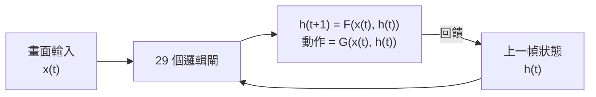
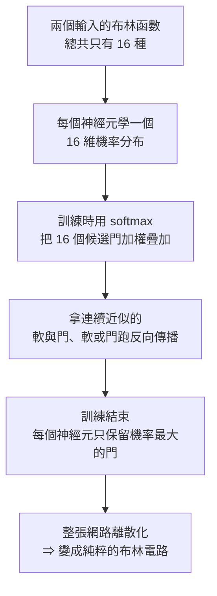

# 29 個邏輯閘玩通馬里奧:沒有浮點數、沒有矩陣乘法的「AI」是什麼

> 整理自 YouTube 頻道 **Why QQ**〈[没浮点数的AI 29个开关 怎么做到 玩转马里奥？](https://www.youtube.com/watch?v=479-FVtko2c)〉(2026-09-11,約 10.1 分鐘,官方 zh-Hans 字幕)。
> ⭐ **關鍵論文與專案已逐項核實**,狀態列於文末。

---

## 一句話總結

> **一個日本開發者用 29 個邏輯閘(與/或/異或這種數位電路課教的東西)讓馬里奧在 1-1 關自己跑起來;
> 32 個門直接通關。沒有浮點數、沒有矩陣乘法、沒有注意力機制,參數量是零。**
>
> ⭐⭐⭐ **這不是小語言模型(SLM),跟 Transformer 八竿子打不著 —— 它的正確名字是「邏輯閘神經網路」,
> 血緣上是強化學習策略網路與數位電路課有限狀態機的親戚。物種認錯了,後面所有的驚嘆都會變形。**

---

## 一、⭐ 先看畫面:29 個門到底在做什麼

| 元件 | 內容 |
|---|---|
| **輸入** | 遊戲畫面被壓縮成 **416 個 0/1**(26 行 × 16 格) |
| **輸出** | **7 個動作**(不動/右/右+跳/右+加速跑及其組合) |
| **中間** | **全部 29 個邏輯閘** |
| **訓練狀態列** | 模式 DLGN、第 57 代、適應度 2445.2 |

> ⭐⭐ **關鍵細節:如果只做前饋(看到 A 就執行 B),它連「我剛才跳起來了」都記不住。**
> **機關在反饋連接:門的輸出繞回來,成為下一幀的輸入。**

> **有了這條迴路,它就能表達「我在空中、繼續保持向右」——這已經是一個狀態機。
> 29 個門疊加循環狀態,能表達的行為序列是指數級放大的。**

---

## 二、⭐⭐ 學術祖先:2014 年一群意識科學家的「窮腦子」實驗

📌 **這是全片最讓人意外的一段考古 ——** 影片挖到一篇 2014 年發表於 **PLOS Computational Biology** 的論文,
作者裡有 **Christof Koch 與 Giulio Tononi**(意識科學領域的兩位重量級學者)。

| 項目 | 內容 |
|---|---|
| **實驗對象** | 一種叫 **Animat** 的人工生命 |
| **任務** | 類似俄羅斯方塊:天上掉方塊,有的要接、有的要躲,還得記住方塊之前的運動 |
| **腦子大小** | **只有 8 個二值節點**(2 個感測器、4 個隱藏節點、2 個運動輸出),比 29 個門還窮 |
| **驅動方式** | 每個節點只有 0/1,由確定的邏輯函數驅動(論文稱 **Hidden Markov Gate**) |
| ⭐ **訓練方式** | **沒有 `loss.backward`、沒有 Adam、沒有任何梯度** —— 是**進化演算法**:生成 100 個隨機小腦子丟進遊戲跑、分高的留下繁殖、基因變異/刪除/複製,再跑,**論文裡跑了 6 萬代** |

> ⭐⭐⭐ **細想這個畫面:沒有任何人告訴它「方塊要接住」,6 萬代自然選擇之後,
> 電路裡自己長出了追蹤方塊的行為 —— 論文後續測量顯示這些網路進化出了明確的「因果整合結構」。**

---

## 三、⭐⭐⭐ 2022 年的轉折:讓邏輯閘可以求導(DDLGN)

進化演算法能玩,但**太慢、不好擴展**。2022 年 NeurIPS,**Felix Petersen 團隊的 DDLGN** 給出第二條路:

> ⭐⭐ **同一個網路,訓練時活在浮點世界,部署時活在 0/1 世界。**

**速度數據:離散化後的網路,單核 CPU 每秒處理超過 100 萬張 MNIST 圖片,準確率 97.5% 以上。**

---

## 四、⭐ 這個日本團隊的來頭:國家級人才項目

推文裡提到的「未踏 IT」,是 **日本 IPA(情報處理推進機構)** 主辦的國家級人才項目,
專門資助年輕工程師做高風險課題。

| 項目 | 內容 |
|---|---|
| **公示時間** | 2026-06-29 |
| **項目名稱** | 面向下一代 AI 開發的邏輯閘型機器學習庫 |
| **團隊** | 3 人,分別來自 ZEN 大學、久留米工業高專、九州大學 |
| **負責人** | 千葉工業大學 **岡瑞起教授** |
| **資助金額** | **302.4 萬日圓** |
| ⭐ **主線目標** | **玩馬里奥只是順手做的用例** —— 真正要做的是一套**從模型訓練一路打通到 FPGA 硬體描述文件生成**的邏輯閘機器學習庫 |

⭐ **發帖者還提到他們押的路線不只一條**:除了 DDLGN,還有日本另一個 LUT 網路開源專案 **BinaryBrain**,
以及他們自研、**號稱完全不用微分**的訓練演算法 **AP 法**。

> ⚠️ **但影片很誠實地標出一個限制**:這條馬里奥推文**沒有披露這 29 個門具體用哪種方法訓練** ——
> 可視化介面寫 DLGN,訓練進度又寫「第 57 代」(進化演算法的用語),**兩種痕跡都在,細節公開之前不做過度歸因。**

---

## 五、⭐⭐⭐ 全片最有工程價值的一句:複雜度預算

> **「一個任務真正需要的決策複雜度,可能遠低於你的直覺。」**

**馬里奥 1-1 前半段寫成狀態機大概是:**

**四五個狀態,每個狀態幾條轉移規則,收斂之後確實用不上幾百萬參數。**

📊 **一個對照很有說服力**:當年 DeepMind 用 DQN 打 Atari,網路幾十萬參數起步已經覺得很小;
**現在直接砍到 29 個門。**

> ⚠️⚠️ **影片拋出一個容易挨罵但值得認真想的觀點:**
> **「我們今天丟給大模型的很多任務,真實決策複雜度可能也就幾十個門的水平。」**

---

## 六、⚠️⚠️ 一個關鍵的、影片沒能回答的問題

> **推文沒有交代:那 416 個輸入位,到底從哪來的?**

| 情境 A | 情境 B |
|---|---|
| **從 256×240 的原始像素直接二值化** | **先有一道預處理,把馬里奥座標、敵人距離、是否落地這些資訊提取出來,再編成 01 串** |
| ⭐⭐ **29 個門從像素直接學會玩遊戲,含金量非常高** | ⚠️ **複雜度的大頭其實在前面那段特徵工程裡,29 個門只是決策頭的複雜度** |

> ⚠️⚠️ **兩種情形震撼程度差一個數量級,目前公開的資訊還不夠下結論** ——
> **這是影片給出的最誠實的一個「保留判斷」,值得學。**

---

## 七、⚠️ 但也別急著神化:三座還沒翻過去的山

評論區的反駁被作者原樣呈現,沒有一面倒:

| 反駁 | 論點 |
|---|---|
| **表達能力 ≠ 學習能力** | 布林函數表達能力完備(任意真值表都能拼出來),**但能不能從少量數據學出來、學出來能不能泛化,是另一回事** |
| ⚠️⚠️ **缺少歸納偏置** | **輸入差一個位元,輸出可能整個翻轉** —— 這種系統天生缺少「相似輸入給相似輸出」的歸納偏置 |
| **二值化摧毀連續相關性** | 本來連續相關的資訊,二值化之後被拍扁到互不相干的維度上,**網路得從零把相關性學回來** |

> **作者自己也承認:朴素的布林電路容易學成死記硬背。泛化、連續高維輸入、語言建模 —— 這幾座山,布林網路都還沒翻過去。**

---

## 應用案例

### 案例 1|⭐⭐⭐ 接到任務先問「複雜度預算」,而不是先問「上什麼模型」

> **工單分類、告警規則、遊戲行為樹 —— 很多隨手就丟給大模型的活,認真看可能就是個幾十條規則的狀態機。**

**具體做法**:接到一個「看起來需要 AI」的任務時,先寫出它的**決策樹或狀態機草圖**。
如果狀態數與轉移規則都在個位數到幾十,**先評估規則引擎/小型分類器,而不是預設丟給 LLM。**

### 案例 2|判斷一則技術新聞前,先確認「物種」

> **「物種搞錯了,你就會拿錯尺子去量它,後面所有的驚嘆都會變形。」**

📌 **可複用的檢查清單**:看到一個新 AI 系統,先問三件事 ——
①**它靠什麼訓練**(梯度下降?進化演算法?)②**它的參數活在哪個世界**(浮點?離散?)
③**它跟你熟悉的架構是同宗還是撞名**(這次是「邏輯閘網路撞名 SLM」的典型案例)。

### 案例 3|工程紅利:訓完就是一張電路圖

> **邏輯閘網路訓完就是一張電路圖,可以直接生成 HDL 燒進 FPGA —— 一層網路一個時鐘週期算完,推理全變成位元運算,浮點單元根本不用出場。**

📎 這對**邊緣裝置 / 嵌入式場景**是直接可用的方向 ——
影片提到 **Petersen 團隊 2024 年把 DDLGN 卷積化拿了 NeurIPS Oral、循環版本 RDDLGN 在部分任務追平甚至超過普通 RNN**,
以及 **Google 2025-03 發布的可微分邏輯元胞自動機**,都是同一條線在往前推進的證據。

---

## 重點回顧(TL;DR)

1. **29 個邏輯閘讓馬里奥自己跑完 1-1,32 個門通關** —— 沒有浮點數、矩陣乘法、注意力機制,參數量為零。
2. ⭐⭐⭐ **這不是 SLM,是「邏輯閘神經網路」** —— 血緣上是強化學習策略網路與有限狀態機的親戚,跟 Transformer 無關。
3. **反饋連接是關鍵**:門的輸出繞回下一幀成為輸入,讓 29 個門能表達指數級的行為序列(狀態機)。
4. ⭐⭐ **學術祖先在 2014 年**:Koch 與 Tononi 團隊用 8 個二值節點、進化演算法(6 萬代)讓「Animat」學會接方塊。
5. ⭐⭐⭐ **2022 年 DDLGN 讓邏輯閘可求導**:訓練時是浮點的機率分布(softmax 加權 16 種布林函數),訓練完離散化成純布林電路,單核 CPU 每秒跑贏百萬張 MNIST、準確率 97.5%+。
6. **日本「未踏 IT」國家級人才項目資助,主線是打通 Python 訓練到 FPGA 硬體的邏輯閘機器學習庫,馬里奥只是順手的用例。**
7. ⭐⭐⭐ **最有工程價值的一句**:「一個任務真正需要的決策複雜度,可能遠低於你的直覺」——先做複雜度預算,再選要不要上大模型。
8. ⚠️⚠️ **最大的未解問題**:那 416 個輸入位是從原始像素直接學出來的,還是先做過特徵工程?兩者含金量差一個數量級,目前無法判斷。
9. ⚠️ **三座沒翻過的山**:表達能力完備 ≠ 可學習;缺少「輸入相似則輸出相似」的歸納偏置;二值化摧毀了連續相關性。

---

## 核實狀態

### ✅ 已核實

| 影片說法 | 核實結果 |
|---|---|
| **2014 年 PLOS Computational Biology 論文,Koch 與 Tononi 為作者之一,研究 Animat 用進化演算法學會玩類俄羅斯方塊遊戲** | **屬實**:論文題為《Evolution of Integrated Causal Structures in Animats Exposed to Environments of Increasing Complexity》(Albantakis, Hintze, Koch, Adami, Tononi;DOI: 10.1371/journal.pcbi.1003966,2014-12-18) |
| **2022 年 NeurIPS,Felix Petersen 團隊 DDLGN,離散化後單核 CPU 每秒處理超過 100 萬張 MNIST 圖片** | **屬實**,官方論文與專案頁確認「beyond a million images of MNIST per second on a single CPU core」 |
| **Petersen 團隊 2024 年把 DDLGN 卷積化並發表** | **屬實**(Convolutional Differentiable Logic Gate Networks,NeurIPS 2024) |

### ⚠️ 未能獨立查證(以影片轉述看待)

- **馬里奥 29/32 個邏輯閘通關的推文本身、發帖人身分「做國產 LLM 的人」** —— 屬社群發帖,**本文未能在公開資料中定位到原帖以外的第三方報導佐證**。
- **日本「未踏 IT」2026-06-29 公示的具體項目名稱、團隊成員、負責人岡瑞起教授、資助金額 302.4 萬日圓** —— **屬影片轉述 IPA 官網公示內容,本文未能直接存取該官網頁面核對。**
- **DDLGN 準確率「97.5% 以上」的精確數值** —— 方向與論文一致,**具體百分比未在公開檢索中逐字核對。**
- **BinaryBrain、AP 法的技術細節與效能宣稱**(「完全不使用微分,計算量比 DFA 和 DLGN 小得多」) —— **屬作者自述,未查得第三方驗證。**
- **Google 2025-03 發布可微分邏輯元胞自動機、循環版 RDDLGN 追平或超過普通 RNN** —— 方向合理(邏輯閘網路是活躍研究方向),**具體發布日期與效能對比未逐項核對。**
- **那 416 個輸入位究竟來自原始像素還是特徵工程** —— **影片自己也明確標示「資訊不足,不下結論」,本文原樣保留此不確定性。**

---

## 來源

- [没浮点数的AI 29个开关 怎么做到 玩转马里奥？ — Why QQ](https://www.youtube.com/watch?v=479-FVtko2c)(2026-09-11,約 10.1 分鐘,官方 zh-Hans 字幕)
- 核實用一手資料:
  - [Evolution of Integrated Causal Structures in Animats Exposed to Environments of Increasing Complexity — PLOS Computational Biology](https://journals.plos.org/ploscompbiol/article?id=10.1371%2Fjournal.pcbi.1003966)
  - [Deep Differentiable Logic Gate Networks — Felix Petersen et al., NeurIPS 2022](https://arxiv.org/pdf/2210.08277)
  - [Convolutional Differentiable Logic Gate Networks — NeurIPS 2024](https://proceedings.neurips.cc/paper_files/paper/2024/file/db988b089d8d97d0f159c15ed0be6a71-Paper-Conference.pdf)
  - [GitHub - Felix-Petersen/difflogic](https://github.com/Felix-Petersen/difflogic)
- 延伸:本庫 [[rl-gains-concentrate-single-middle-layer]]、[[deepseek-v4-engineering]](同屬 llm-internals/architecture 中類,可對照「參數規模 vs 決策複雜度」的不同取徑)。
