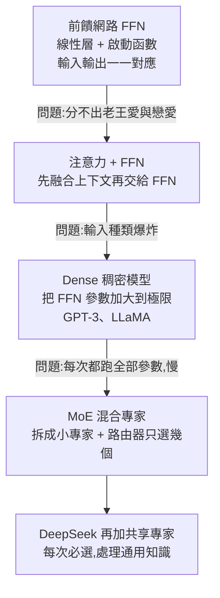
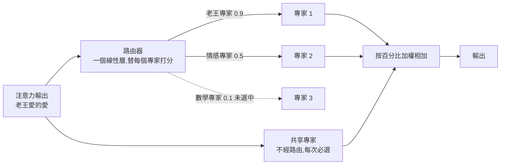

# MoE 為什麼這麼快:從前饋網路、注意力、Dense 到混合專家(程序员老王)

**主題分類:** 科技 / LLM 內部原理 — 架構
**來源:** YouTube〈MoE为什么这么快 —— 从小学数学到MoE 大模型进化史〉(程序员老王,2026-02-19,約 13 分;無字幕,逐字稿以 CPU faster-whisper 轉錄、非官方字幕),DeepSeek 數字已對照論文
**整理日期:** 2026-10-02

> ⚠️ 作者在說明欄推廣其付費「知識星球」。影片裡「老王專家」「數學專家」「情感專家」只是比喻——作者強調:**每個專家對什麼敏感是訓練時自己形成的,人類目前看不懂**。

---

## TL;DR

1. ⭐ **FFN(前饋神經網路)** = 線性層 + 啟動函數疊起來,理論上能擬合幾乎任何函數;但它**逐位置獨立處理**:看到「愛」就輸出「吃」,分不出「老王愛」和「戀愛」。
2. ⭐ **注意力**先把上下文融進每個 token(「愛」變成「沾滿老王顏色的愛」),再交給 FFN——FFN 不用懂上下文,輸入本身就帶著上下文。
3. ⭐⭐ 代價:FFN 要分辨的輸入種類呈爆炸成長 ⇒ **「大力出奇蹟」把線性層參數加大** ⇒ **Dense(稠密)模型**(GPT-3、LLaMA)。但不管問「老王愛吃什麼」還是「1+1」,**每次都要跑過整個巨大網路**——慢、沒效率。
4. ⭐⭐⭐ **MoE(Mixture of Experts)**:把大 FFN **拆成很多小專家**,前面放一個**路由器(router,也只是一個線性層)**打分,**只選分數最高的幾個專家**計算、按百分比加權相加。DeepSeek-V3:**256 個路由專家選 8 個 + 1 個必選的共享專家**。
5. ⭐⭐ **空間換時間**:✅ DeepSeekMoE 145B(總參數 144.6B、每次啟用 **22.2B**)效果約等於 DeepSeek 67B Dense(67.4B 全啟用)——**用約 2 倍參數,換約 3 倍速度**。

---

## 1. 進化史一張圖



---

## 2. 從 FFN 說起

- **線性層**:輸入 m 個數、輸出 n 個數,每個輸出 = 輸入各乘係數再加常數;係數與常數就是**模型參數**。只能表示直線。
- 多個線性層中間夾**非線性啟動函數**(ReLU、Sigmoid)⇒ 夠大夠深就能表示幾乎所有函數圖形 ⇒ **FFN**。適合圖片辨識這種**不需要上下文**的任務(實作見 [[pytorch-from-zero-transformer-series]])。

**拿 FFN 做文字接龍會怎樣?** 輸入「老、王、愛」,它預測每個 token 的下一個:老→王、王→愛、愛→**吃**;「吃」就是第一個輸出字,再把「老王愛吃」放回去得到「瓜」。
問題:**FFN 的對應關係是固定的**——輸入「愛」就一定輸出「吃」,哪怕使用者寫的是「戀愛」。因為它逐位置獨立處理,看不到「愛」前面是什麼。

---

## 3. 注意力解決上下文,但把壓力丟回 FFN

- **注意力的作用 = 總結上下文**(細節見 [[multi-head-attention-explained]]):「老王愛」經注意力後,三個位置分別變成「老」「老王」「老王愛」的總結;「愛」不再是純潔無瑕的愛,而是**沾滿老王顏色的愛**。
- FFN 接到的輸入本身就含上下文 ⇒ 看到「老王愛」的愛輸出「吃」,看到「戀愛」的愛輸出別的。
- 但 FFN 的任務從「為『愛』找輸出」變成「為老王的愛、戀愛的愛……**每一種**愛找輸出」——**任務範圍幾何級數成長**。

### Dense:大力出奇蹟

啟動函數沒有可訓練參數 ⇒ 從線性層下手:一萬個參數不夠就一百萬、一千萬。**GPT-3、LLaMA 早期就是這麼做的,效果還真不錯** ⇒ **Dense(稠密)模型**:一個網路通曉萬物,所有規則與人情世故都藏在龐大的參數裡。

**問題:** 推論時不論問什麼都跑過**同一個超大網路**;訓練時不論教材是數學還是老王的愛好,也調整**整個網路**——速度慢、效率低。「當一個東西只能靠堆規模提升,留給它的好日子就不多了。」

---

## 4. MoE:拆碎、路由、加權

### 4.1 三個零件

| 零件 | 說明 |
|---|---|
| **專家(Expert)** | 把大 FFN 拆成很多小 FFN;不要求每個都什麼都懂,只要處理特定問題(DeepSeek-V3 拆成 **256 個**) |
| **路由器(Router)** | **就是一個普通線性層**,輸入經注意力總結後的 token,為每個專家打分(老王專家 0.9、數學專家 0.1、情感專家 0.5……) |
| **混合(Mixture)** | 選分數最高的 **k 個**(k 人為規定,DeepSeek-V3 選 **8 個**),分數用固定公式轉成百分比(加總 100%),各專家輸出 × 百分比再相加 |



> 🔎 公式補充(影片略過):DeepSeek-V3 對路由專家用 sigmoid 算親和分數,選 top-k 後在被選中的專家間正規化成權重;其他模型(如 Mixtral)常用 softmax。細節各家不同。

### 4.2 共享專家(DeepSeek 的發明)

不經過路由、**每次必定參與計算**,負責通用知識——避免每個路由專家都得重複學一遍共同的東西。

### 4.3 Dense vs MoE:空間換時間

| | Dense | MoE |
|---|---|---|
| 每次計算的參數 | **全部** | 只有被選中的專家 |
| 同總參數下的速度 | 慢 | **快** |
| 同總參數下的效果 | 通常較好 | 通常較差(沒被選中的專家知識這次用不上),但差距不大——捨棄的多半是無關參數 |

✅ **DeepSeekMoE 論文的對照**:
| 模型 | 總參數 | 每次啟用 | Pile 等測試表現 |
|---|---|---|---|
| DeepSeek 67B(Dense) | 67.4B | 67.4B | 基準 |
| DeepSeekMoE 145B | 144.6B | **22.2B** | 相當 |

⇒ MoE 用**約 2 倍空間**(參數/記憶體)換**約 3 倍速度**(67.4 / 22.2 ≈ 3)——經典的**空間換時間**。(📌 影片一處口誤說 Dense 是 67.7B,應為 67.4B。)

- ✅ MoE 的源頭:Google 2017 年〈Outrageously Large Neural Networks: The Sparsely-Gated Mixture-of-Experts Layer〉(Shazeer et al.)——老王吐槽「又是 Google,發明了一大半 AI 技術,卻從不知道怎麼好好利用」。
- 這也回答開場的問題:DeepSeek 為什麼快、為什麼 token 便宜——**每個 token 只動用一小部分參數**。

> 老王:「世界上也許沒有全知全能的超人,我們每個人都是有局限的小專家。但正因為承認局限,把專業的事交給專業的人,才匯聚出偉大的文明。」

---

## 5. 應用案例

### 案例一:看懂 MoE 模型的規格

DeepSeek-V3 標示「**671B 總參數、37B 啟用**」:
- **記憶體**要裝得下 671B(所有專家都得載入)⇒ 部署門檻看總參數;
- **每個 token 的計算量**只看 37B ⇒ 速度、單價接近一個 37B 的 Dense 模型。

所以本機跑 MoE 的瓶頸通常是**記憶體容量**,而不是算力(延伸:[[local-ai-every-hardware-size]]、[[nvidia-moat-memory-bandwidth-cuda-software]])。

### 案例二:30 行 PyTorch 寫一個 top-k MoE 層

```python
import torch
from torch import nn

class MoE(nn.Module):
    def __init__(self, d=64, n_experts=8, k=2, hidden=128):
        super().__init__()
        self.k = k
        self.router = nn.Linear(d, n_experts)          # 路由器只是一個線性層
        self.experts = nn.ModuleList(
            nn.Sequential(nn.Linear(d, hidden), nn.ReLU(), nn.Linear(hidden, d))
            for _ in range(n_experts))
        self.shared = nn.Sequential(nn.Linear(d, hidden), nn.ReLU(), nn.Linear(hidden, d))

    def forward(self, x):                              # x: (tokens, d)
        scores = self.router(x)                        # 每個專家的分數
        top_val, top_idx = scores.topk(self.k, dim=-1) # 選 k 個
        weights = top_val.softmax(dim=-1)              # 轉成百分比
        out = self.shared(x)                           # 共享專家必選
        for slot in range(self.k):
            for e in top_idx[:, slot].unique():
                rows = top_idx[:, slot] == e           # 選中專家 e 的 token
                out[rows] += weights[rows, slot, None] * self.experts[e](x[rows])
        return out

y = MoE()(torch.randn(10, 64))
print(y.shape)  # torch.Size([10, 64])
```

8 個專家只算 2 個 + 1 個共享:專家部分的計算量約是同總參數 Dense 的 1/4。(實務上還需要**負載平衡**,避免路由器老是選同幾個專家。)

### 案例三:選模型時的取捨

| 你的限制 | 傾向 |
|---|---|
| GPU 記憶體小、要求單卡跑 | 小的 Dense 模型 |
| 記憶體夠(或用 API),在意速度與每 token 成本 | MoE |
| 要微調、資料少 | Dense 較單純;MoE 微調要顧及路由穩定 |

---

## 來源

- [YouTube:MoE为什么这么快 —— 从小学数学到MoE 大模型进化史(程序员老王,2026-02-19)](https://www.youtube.com/watch?v=nySTPhneEjw)(無字幕,逐字稿以 CPU faster-whisper 轉錄、非官方字幕)
- 論文:[Outrageously Large Neural Networks: The Sparsely-Gated Mixture-of-Experts Layer](https://arxiv.org/abs/1701.06538)(Shazeer et al.,2017)
- 論文:[DeepSeekMoE: Towards Ultimate Expert Specialization in Mixture-of-Experts Language Models](https://arxiv.org/abs/2401.06066)(2024)
- 論文:[DeepSeek-V3 Technical Report](https://arxiv.org/abs/2412.19437)(2024)

📎 相關筆記:[[multi-head-attention-explained]]、[[pytorch-from-zero-transformer-series]]、[[deepseek-v4-engineering]]、[[local-ai-every-hardware-size]]

**Whisper 專有名詞還原對照:** 潜亏/潜溃/钱亏神经网络 → 前饋神經網路;Railu → ReLU;激火层 → 激活層(啟動函數);inbadding → embedding;腾审/贪慎/Tensen → Attention;Dance/愁密/绸密 → Dense/稠密;Lama → LLaMA;Mister of experts → Mixture of Experts;Esbert → Expert;Rotter → Router;Deepseqv3 → DeepSeek-V3;Mixter → Mixture。
