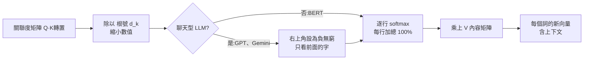

# 多頭注意力(Multi-Head Attention)用人話講:「語法表、需求表、內容表」就是 K、Q、V(程序员老王)

**主題分類:** 科技 / LLM 內部原理 — 架構
**來源:** YouTube〈多头注意力 MultiHeadAttention 是什么?〉(程序员老王,2026-02-05,約 15 分;無字幕,逐字稿以 CPU faster-whisper 轉錄、非官方字幕)
**整理日期:** 2026-10-02

> ⚠️ 作者在說明欄推廣其付費「知識星球」。影片中「危險、柯南、名詞、形容詞」這些標籤**只是比喻**——作者反覆強調:真實模型的維度是訓練自動產生的,我們並不知道每個數字代表什麼。

---

## TL;DR

1. ⭐ 開場句「我用**毒毒**毒蛇,會不會被毒毒死」:同一個「毒」字可以是名詞、動詞、形容詞,人類卻毫不費力看懂——因為**讀每個字時注意力的焦點不同**。
2. ⭐ **Embedding(嵌入)** = 把一個字「貼滿標籤並打分」:毒 = 危險 100、柯南 50、中文 100、動詞 70、名詞 90、形容詞 80……
3. ⭐⭐⭐ **一個注意力頭的三張表**:
   - **K(Key)= 語法表**:「我是什麼樣的詞」(線性層從 embedding 抽出)
   - **Q(Query)= 需求表**:「我想跟什麼樣的詞在一起」(另一個線性層)
   - **V(Value)= 內容表**:把 embedding **降維**、只留和這個視角有關的內容
   - **關聯度 = softmax(Q·Kᵀ / √d_k)**,再乘 V ⇒ 每個詞變成「融合了上下文」的新向量。
4. ⭐⭐ **多頭** = 同時開好幾個視角(語法頭、柯南頭、情感頭……)各算一遍,**按詞首尾相連**;整個區塊再疊幾十層。
5. ⭐ **BERT 直接用整張關聯度矩陣**;**GPT 類聊天模型多一步 Mask**:右上角設成負無窮,softmax 後變 0%,確保每個字只看前面。

---

## 1. Embedding:一個字其實是一串「標籤分數」

人看到「毒」時不只看到字本身,還會自動調用知識:危險的、柯南裡常出現、無色無味、中文、可當動詞/名詞/形容詞,甚至小學老師罰寫十遍的記憶。**腦中處理的不是那個字,而是一組概念。**

LLM 也照這個思路:字進模型的第一步是**概念分解並打分**——**Embedding**。

| 字 | 危險 | 柯南 | 中文 | 動詞 | 名詞 | 形容詞 |
|---|---|---|---|---|---|---|
| 毒 | 100 | 50 | 100 | 70 | 90 | 80 |
| 蛇 | 90 | 10 | 100 | 0 | …… | …… |

- ✅ 真實維度:GPT-2 最大版(XL)**1600**、DeepSeek-V3 **7168**,商業模型推測上萬。(📌 影片說「最古早的 GPT-2 也有 1600」,其實 GPT-2 最小版是 768,1600 是 XL 版。)
- Embedding 細節見 [[token-vs-embedding-llm-and-rag]]。

**為什麼不直接拿 embedding 算關聯?**
1. **太長**:一個字幾千個數,整本書兩兩比對算力爆炸。
2. **太雜**:語法、語言、柯南劇情全混在一起;想分析語法卻混著柯南資訊,會很亂 ⇒ 希望**分門別類**:一個頭專管語法、另一個頭專追柯南——這就是**多頭注意力**的動機。

---

## 2. 一個注意力頭怎麼算(以「語法頭」為例)

### 2.1 K:語法表——「我是什麼樣的詞」

把整個 embedding 放進一個**線性層**(見 [[pytorch-from-zero-transformer-series]] §2),可以理解成「把和語法有關的標籤抽出來」。⚠️ 實際訓練後它抽的是語法、柯南、還是揉成誰也看不懂的新概念,**我們不知道**——只知道線性層做得到、而且訓練後效果好。「訓練 AI 確實像煉丹。」

### 2.2 Q:需求表——「我想跟什麼樣的詞在一起」

這次打分的不是「我是什麼」,而是**對其他詞的需求程度**:
- 「蛇」是名詞,常和**形容詞**一起出現 ⇒ 形容詞需求分很高;
- 偶爾接動詞 ⇒ 動詞分低一些;
- 不太和另一個名詞連用 ⇒ 名詞分更低,**甚至可以是負數**(很不想跟它在一起)。

產生方式一樣:原始 embedding 經**另一個**線性變換。

### 2.3 Q·K:誰和誰是天生一對

- 「蛇—毒」關聯度 = 蛇的**需求向量** · 毒的**語法向量**(對應位置相乘再相加;影片示範算出 9550)。
- 為什麼有效:蛇說「我喜歡形容詞」(需求表的形容詞分高),毒說「巧了,我就是形容詞」(語法表的形容詞分高)——**兩個高分相乘,直接拉高整個內積**。
- 所有字兩兩算一遍 = **Q 矩陣乘 K 矩陣的轉置**,得到關聯度矩陣。

### 2.4 Mask 與 softmax



| 步驟 | 為什麼 |
|---|---|
| **Mask**(GPT 類) | 訓練時一字一字來;讀到第一個「毒」時,模型只知道前面的「我、用」,後半句還沒出現 ⇒ 把未來位置設成負無窮,softmax 後變 **0%** |
| **softmax**(逐行) | 原始分數本身沒有意義 ⇒ 轉成百分比,每行加總 100%(數學見 [[pytorch-from-zero-transformer-series]] §3.3) |
| **除以 √d_k** | 進一步縮小分數;影片例子有 3 個標籤 ⇒ 除以 √3。實際數值多是 −1 到 1 之間的小數,不會像示範那樣幾千分 |

- **BERT** 直接用整張(不遮罩的)關聯度矩陣,許多 RAG 用的 embedding 模型、分詞/分類器都是這種模式;**GPT、Gemini 等聊天模型**才加 Mask。

### 2.5 V:內容表,與「克蘇魯之蛇」

假設 softmax 後「蛇」那一行是:自己 15%、三個「毒」各 25%、「用」0%、「我」10%。
⇒ 按這個配方把**各字的內容向量**加權混合 ⇒ 一個 10% 我 + 75% 毒 + 15% 蛇的新向量。我們叫不出它的名字——「大概率有毒、有點像蛇、隱約帶點我的意志、和『用』沒什麼關係」——作者稱之為**不可名狀的「克蘇魯之蛇」**,但它理論上包含了「蛇」本身**以及它在上下文中的所有關係**。

為什麼不直接混原始 embedding?幾千維太大 ⇒ 先用**第三個線性層降維**,只留和語法有關的部分(「危險」「中文」這類和語法無關的標籤丟掉)——這就是 **V(Value)內容矩陣**。

---

## 3. 多頭與疊層

- **多頭**:上面整套流程**平行跑 N 次**,每個頭關注點不同 ⇒ 得到語法版、柯南版、情感版……的「我用毒毒毒蛇」;最後**按詞首尾相連**(concat)。
- **疊層**:輸出又當下一個 Multi-Head Attention 的輸入,**重複幾十次**——「最終居然就在這一片混沌之中演化出了智慧。」

### 對照標準公式

**Attention(Q, K, V) = softmax(Q·Kᵀ / √d_k) · V**

| 影片名稱 | 論文名稱 | 意義 |
|---|---|---|
| 語法表 | **K(Key)** | 每個詞「是什麼」 |
| 需求表 | **Q(Query)** | 每個詞「想找什麼」 |
| 內容表 | **V(Value)** | 每個詞「被選中時提供什麼」 |
| 關聯度矩陣 | softmax(QKᵀ/√d_k) | 誰該注意誰、注意多少 |

> 老王:「我們親手寫下了每一行公式,卻讀不懂它在想什麼……讓人類著迷的從來不是『我終於搞懂了』,而是『原來我還有這麼多不懂的東西值得去探索』。」

---

## 4. 應用案例

### 案例一:20 行 NumPy 親手算一個注意力頭

```python
import numpy as np

rng = np.random.default_rng(0)
tokens = ["我", "用", "毒", "毒", "毒", "蛇"]
d_model, d_k = 8, 3                       # embedding 8 維,頭的維度 3
X = rng.normal(size=(len(tokens), d_model))   # 假裝這是 embedding

W_q, W_k, W_v = (rng.normal(size=(d_model, d_k)) for _ in range(3))
Q, K, V = X @ W_q, X @ W_k, X @ W_v       # 需求表、語法表、內容表

scores = Q @ K.T / np.sqrt(d_k)           # 關聯度
mask = np.triu(np.ones_like(scores), k=1).astype(bool)
scores[mask] = -np.inf                    # GPT 式遮罩:不看未來

weights = np.exp(scores - scores.max(axis=1, keepdims=True))
weights /= weights.sum(axis=1, keepdims=True)  # 逐行 softmax
out = weights @ V                         # 每個詞的新向量

print(np.round(weights[-1], 2))           # 「蛇」分給前面各字的注意力,加總 = 1
```

把 `mask` 那兩行刪掉就是 BERT 式(雙向)注意力;複製三份不同的 `W_q/W_k/W_v` 再 `np.concatenate` 就是三頭注意力。

### 案例二:用注意力解釋長上下文成本

關聯度矩陣是「詞數 × 詞數」:1,000 個 token ⇒ 100 萬格;100,000 個 token ⇒ 100 億格。這就是長上下文昂貴、需要 KV cache、FlashAttention 等優化的根本原因——也是把資料**整理成精簡文件再丟給 AI**(見 [[vibe-coding-stack-model-agent-workflow]] 的「每步開新對話」)划算的原因。

### 案例三:讀模型規格表

看到某模型「hidden size 4096、32 heads」⇒ 每個頭 d_k = 4096 / 32 = 128;softmax 前除以 √128 ≈ 11.3。ViT 的 196 個圖塊也是用同一套注意力互相參考(見 [[vit-vision-transformer-how-llm-sees-images]])。

---

## 來源

- [YouTube:多头注意力 MultiHeadAttention 是什么?(程序员老王,2026-02-05)](https://www.youtube.com/watch?v=whe268MthvE)(無字幕,逐字稿以 CPU faster-whisper 轉錄、非官方字幕)
- 論文:[Attention Is All You Need](https://arxiv.org/abs/1706.03762)(Vaswani et al.,2017)
- 規格:[GPT-2 XL 設定(Hugging Face)](https://huggingface.co/openai-community/gpt2-xl/blob/main/config.json)、[DeepSeek-V3 技術報告](https://arxiv.org/abs/2412.19437)

📎 相關筆記:[[pytorch-from-zero-transformer-series]]、[[vit-vision-transformer-how-llm-sees-images]]、[[token-vs-embedding-llm-and-rag]]、[[llm-explained-3blue1brown]]

**Whisper 專有名詞還原對照:** Invading/Inbinding/隐摆定 → Embedding;Multi-Hat Attention → Multi-Head Attention;现象层/先性层 → 線性層;语发/余法/愚乏 → 語法;需球/则偶标准 → 需求/擇偶標準;相量惩罚 → 向量乘法(內積);Rug → RAG;富无穷/副无穷 → 負無窮;更号DK → √d_k;Ki/Cori → Key/Query;Tension → Attention;乘意N → ×N;dpsc → DeepSeek。
