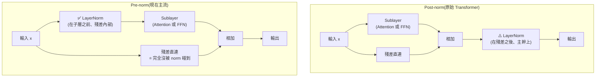
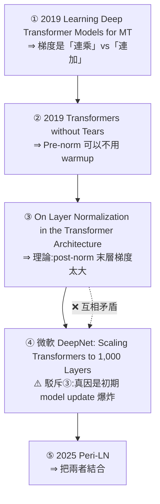
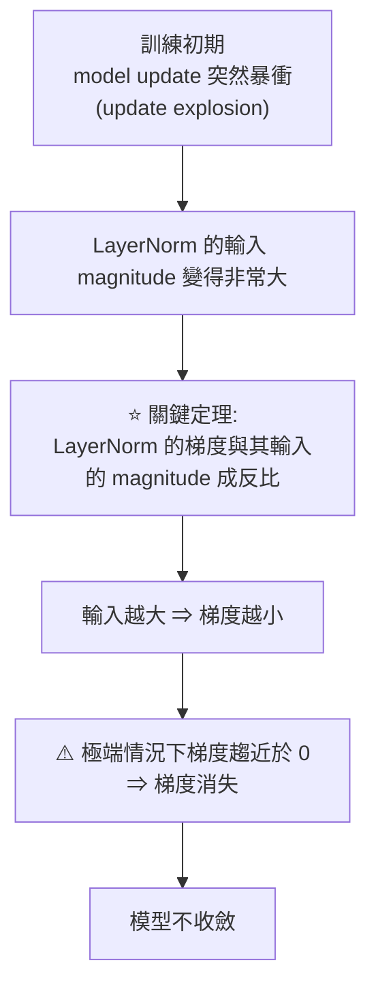
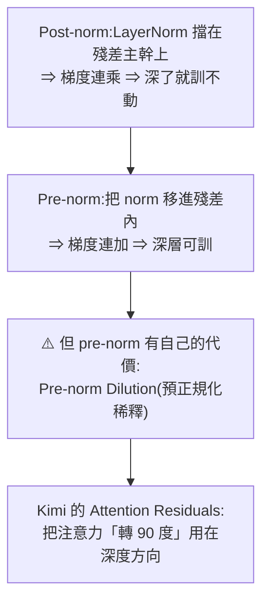

# Pre-norm vs Post-norm:為什麼現在的大模型全都把 LayerNorm 搬到前面

> 整理自 YouTube 頻道 **EZ.Encoder Academy**〈[大模型面試] 什麼是 pre-norm, post-norm?為什麼現在大模型都用 pre-norm 架構?〉(2025-08-19,約 21 分鐘,官方 zh-Hant 字幕)。
> 這是一支**從源頭擼論文**的影片,串起 **2019 → 2025 的五篇論文**,而且其中**兩篇對同一個現象給出互相駁斥的解釋**。
> 依 CLAUDE.md 慣例,另補上**三處影片未提但重要的後續發展**。

> 相關筆記:[[attention-residuals]](⭐ 這篇講的「Pre-norm Dilution」正是本文的下一章)、[[llm-explained-3blue1brown]]、[[microgpt-karpathy]]、[[token-vs-embedding-llm-and-rag]]、[[deepseek-v4-engineering]]

---

## 一句話總結

**原始 Transformer 把 LayerNorm 放在子層「之後」且在殘差主幹上(post-norm),網路一深就訓不動;把它搬到子層「之前」且塞進殘差連接裡面(pre-norm),梯度就穩了。** 而**為什麼**會這樣,學界前後給了兩套互相打架的解釋 —— ⭐ **影片作者明確站隊微軟那一版。**

---

## 一、定義:差別只在 LayerNorm 放哪裡



⭐ **關鍵不只是「前」跟「後」,更是「在不在殘差連接裡面」:**

| | LayerNorm 的位置 | 殘差主幹 |
|---|---|---|
| **Post-norm** | 子層**之後**,**在殘差相加之後** | ⚠️ **被 LayerNorm 擋住了** |
| **Pre-norm** | 子層**之前**,**在殘差連接內部** | ✅ **乾淨無阻,梯度可以直通** |

> 這裡的 **Sublayer 可以是 Attention 也可以是 FFN** —— 兩處都各有一個 norm,規則相同。

---

## 二、五篇論文的推進史



### ① 連乘 vs 連加(2019)

推導兩種架構的梯度更新式,結論極簡潔:

| | 梯度更新的形式 | 後果 |
|---|---|---|
| **Post-norm** | ⚠️ **連乘(∏)** | 一堆小數連乘 ⇒ **梯度消失** |
| **Pre-norm** | ✅ **連加(∑)** | 相加不會有這個問題 |

**實驗結果直接了當:同樣的深層 Transformer,post-norm 版本訓練「直接失敗」,pre-norm 版本仍然訓得出來。**

> ⭐ **這個「連乘 vs 連加」是整個主題最好記的一句話** —— 也正是 ResNet 當年用殘差解決梯度消失的同一個道理,只是這裡的問題出在「LayerNorm 擋在殘差主幹上,把連加變回了連乘」。

### ② Pre-norm 不需要 warmup(2019,Transformers without Tears)

> 影片對這個標題的猜測很有意思:那個 Tears 大概是指**訓練 Transformer 過程中流下的痛苦眼淚**。

**實驗數據:**

| 架構 | warmup 4,000 步 | 8,000 步 | 16,000 步 |
|---|---|---|---|
| **Post-norm** | ⚠️ **失敗** | ⚠️ **失敗** | 才有可能收斂 |
| **Pre-norm** | ✅ **極簡單的 warmup 就收斂,而且結果比 post-norm 好** | | |

**深度實驗(不做 warmup)**:post-norm 到 **5–6 層就訓練失敗**;pre-norm 5–6 層仍可收斂。

⭐ **實務意義**:不用 warmup ⇒ **少一個超參要調,而且訓練更快**。

### ③ 理論解釋一:末層梯度太大(On Layer Normalization in the Transformer Architecture)

前兩篇只給了現象,這篇給理論。核心結論是**末層梯度的上界**:

| 架構 | 末層梯度的 upper bound |
|---|---|
| **Post-norm** | ⚠️ **與層數 L 無關** —— 網路再深,末層梯度都一樣大 |
| **Pre-norm** | ✅ **與 L 成反比** —— 網路越深,末層梯度越小 |

**實驗佐證**:不同大小的 Transformer,post-norm 末層梯度**恆定在 1.6 左右**;pre-norm 則隨深度增加而越來越小。

**推論**:post-norm 末層梯度大 ⇒ 配大 learning rate 就炸 ⇒ **所以需要 warmup 來避免**。

### ④ ⚠️⚠️ 微軟 DeepNet 反駁:真兇是「初期 model update 爆炸」

**這是全片最精彩的一段 —— 微軟這篇直接打臉上一篇的解釋。**

**反駁的證據**:比較兩個 post-norm 模型 ——

| 模型 | 收斂嗎 | 末層 gradient norm |
|---|---|---|
| post-norm + 好的初始化 | ✅ 收斂 | ⭐ **比較大**(而且持續增長) |
| post-norm 無初始化 | ❌ 不收斂 | ⭐ **反而比較小**(增長緩慢) |

⭐⭐ **這個觀察跟論文③完全相反**:如果「末層梯度太大」是不收斂的原因,那**不收斂的那個模型梯度應該更大才對,結果它更小。**

**微軟給的替代解釋(因果鏈):**



**佐證圖表**:看**累積(accumulated)model update** ——
- ⚠️ 不收斂的 post-norm(無 warmup):**一開始 update 極大,之後直接走平** —— 而因為是累積值,**走平就代表 update 已經是 0,也就是後期出現了梯度消失**
- ✅ 有 warmup、或 warmup + 好初始化的模型:後期仍持續有 update,**沒有梯度消失問題**

**還有一張圖直接測 LayerNorm 的輸入大小**:不收斂那個模型,FFN 層與 attention 層送進 LayerNorm 的輸入**從一開始就很大而且越來越大**;有 warmup / 好初始化的則維持恆定。

> ⭐ **影片作者明確站隊**:
> **「我個人是更加傾向於這篇 paper 的解釋,我認為這篇 paper 的理論還有它的結果都是自洽的。」**

⭐⭐ **注意這裡的因果方向被完全翻轉了**:
```
論文③:post-norm 訓不動 ← 末層梯度「太大」(爆炸)
論文④:post-norm 訓不動 ← 梯度「太小」(消失),而消失的起因是初期 update 太大
```
**同一個現象,一個歸因於梯度爆炸、一個歸因於梯度消失。** 而 warmup 之所以兩邊都能解釋得通,是因為它同時壓住了「大 learning rate」和「初期大 update」—— **這正是為什麼光看「warmup 有效」無法分辨誰對。**

### ⑤ Peri-LN(2025):把兩者結合

以殘差區塊上的三個候選位置來說:

| 位置 | 放 LayerNorm 的效果 |
|---|---|
| **A**(子層之前,殘差內) | = **Pre-norm** |
| **B**(子層輸出之後,**仍在殘差內**) | ⭐ Peri-LN 新增的那一個 |
| **C**(殘差相加之後,主幹上) | = **Post-norm** |

**Peri-LN = A + B(不放 C)。**

**動機說得很清楚:**

| 做法 | 問題 |
|---|---|
| **Post-norm(放 C)** | ⚠️ 放在資訊的**主要通路**上,對整個輸出做 normalize ⇒ **梯度消失** |
| **Pre-norm(只放 A)** | 沒擋主幹、梯度能從旁支回傳 ✅ **但只 normalize 了輸入,attention/MLP 的「輸出」沒被 normalize ⇒ 輸出可能出現很大的 variance** |
| ⭐ **Peri-LN(A + B)** | **進出都歸一化,同時不碰殘差連接、讓梯度自由流動** |

---

## 三、現在的主流用什麼

| 模型 | 用法 |
|---|---|
| **DeepSeek V3** | attention 前一個 **RMSNorm**、FFN 前一個 RMSNorm ⇒ **pre-norm** |
| **Qwen3** | 技術報告明載 **pre-normalization** |
| **Llama 3** | **pre-norm** |

> ⭐ **影片給的理由很實際**:**現在的模型越訓越大,post-norm 的訓練穩定性根本撐不到那個規模。** 原始 Transformer 的 post-norm 已經很少人用了。

---

## 四、⭐ 三處影片未提但重要的補充

### 補充一:⚠️ DeepNet 的重點其實是「救活 post-norm」,不是「宣判 post-norm 死刑」

影片只用了 DeepNet 的**診斷**部分(初期 update 爆炸 → 梯度消失),**沒提它的解法**。

**DeepNet 真正的貢獻是 DeepNorm** —— 一個修過的 **post-norm 變體**:

```
DeepNorm:LayerNorm(x · α + f(x))
         ↑ 把殘差那一支「放大 α 倍」,再搭配把子層初始化「縮小」
```

⭐⭐ **而 DeepNet 用它把 Transformer 訓到了 1,000 層** —— 論文標題就是這個。它主張自己**同時拿到 post-norm 的效果與 pre-norm 的訓練穩定性**。

> **所以正確的結論不是「post-norm 不行」,而是「post-norm 的原始形式沒有處理好殘差與初始化的尺度」。** 只是業界為了省事,大多直接選了開箱即穩的 pre-norm。

### 補充二:⭐ Peri-LN 的想法**早就上線了** —— Gemma 2 就是這樣做的

影片把 Peri-LN 當成「最新的研究方向」。但**同樣的結構已經在生產模型裡跑了**:

**Gemma 2 對每個子層同時做「輸入端 norm」與「輸出端 norm」** —— 也就是俗稱的 **sandwich norm**,結構上正是 Peri-LN 的 A + B。

⭐ **這代表這個方向不只是紙上研究,而是已經被驗證可用於大規模訓練的做法。**

### 補充三:⭐ 現代模型還多加了一層 norm:QK-Norm

影片討論的都是「子層外面」的 norm。**但近年為了訓練穩定,很多模型在 attention「裡面」也加了 norm** —— 對 **query 和 key 各做一次歸一化(QK-Norm)** 之後再算內積。

**動機**:attention logits(Q·K)在大規模訓練時容易數值爆炸,導致 softmax 飽和、訓練崩掉。**QK-Norm 直接把這個爆炸源掐掉。**

> ⭐ **把三者放在一起看,「normalization 該放哪」的答案已經從一個位置變成一組位置:**
> **子層前(pre-norm)+ 子層後但在殘差內(Peri-LN / sandwich)+ attention 內部(QK-Norm)。**

---

## 五、⭐ 與本倉庫 [[attention-residuals]] 的接續

**這篇是那篇的前傳。** 把兩篇接起來,故事線是完整的:



⭐ **關鍵在於這是一條「解法製造新問題」的鏈**:
- **Post-norm 的問題**是梯度不穩 ⇒ **pre-norm 解決了**
- **但 pre-norm 讓殘差流變成單純的累加**,層數一多,早期層的訊號會被後面不斷加進來的東西**稀釋** ⇒ 這就是 [[attention-residuals]] 講的 **Pre-norm Dilution**
- **Kimi 的解法**:讓後面的層能「有選擇地」回取早期表示,而不是被動接受一個被稀釋的總和

> **看完這篇再回去看 [[attention-residuals]],那篇的「它要解決的問題」那一節會突然變得很好懂。**

---

## 應用案例

### 案例 1|⭐⭐ 面試時怎麼答才不像背的

影片自己給了最好的用法建議 —— **不要死記硬背,要講得出來龍去脈**:

```
❌ 背答案:「pre-norm 就是 norm 放前面,比較穩定。」
   —— 面試官換個問法就答不出來

✅ 講脈絡:
   ① 定義差在哪(而且要點出「在不在殘差內」,不只是前後)
   ② 為什麼要改:post-norm 梯度是連乘、pre-norm 是連加
   ③ 帶來什麼好處:不用 warmup、能訓深
   ④ ⭐ 學界對「為什麼」其實有兩套解釋,而且互相駁斥
   ⑤ 現在的新方向:Peri-LN / sandwich norm
```

⭐ **第 ④ 點是加分最多的**:能講出「論文③說是末層梯度爆炸,微軟 DeepNet 用實驗反駁、主張是初期 update 爆炸導致梯度消失」,**代表你真的讀過而不是看過摘要。**

### 案例 2|⚠️ 訓練不收斂時的排查順序

從這條論文線可以整理出一套實用的排查法:

```
① 你的 norm 是 pre 還是 post?
   —— post 且沒特別處理 ⇒ 先換 pre-norm,多數問題直接消失

② 用了 pre-norm 還是不收斂?
   —— 檢查 warmup 與初始化(即使 pre-norm 對這兩者比較不敏感)

③ ⭐ 觀察「訓練初期的 model update 幅度」
   —— 這是 DeepNet 給的最實用診斷訊號
   —— 初期暴衝然後走平 = 梯度已經消失了,再訓下去也是白訓

④ attention logits 有沒有爆?
   —— 有 ⇒ 加 QK-Norm
```

⭐ **第 ③ 點特別值得抄**:多數人只盯 loss 曲線,**但「累積 model update 走平」比 loss 更早、更明確地告訴你梯度死了。**

### 案例 3|讀論文時對「互相駁斥」的兩篇怎麼判斷

這支影片示範了一個很好的判準。面對論文③與④的衝突,影片作者選④的理由是「**理論還有結果都是自洽的**」。可以拆成:

| 判準 | 說明 |
|---|---|
| **能不能解釋反例** | ⭐ ④ 直接拿出「不收斂的模型梯度反而更小」這個 ③ 解釋不了的觀察 |
| **理論與實驗是否對得上** | ④ 的定理(LN 梯度 ∝ 1/輸入 magnitude)有對應的實測圖 |
| **是否只解釋了「相關」而非「因果」** | ⚠️ ③ 的問題在於「warmup 有效」同時支持兩種解釋,**無法區辨** |

⭐ **可推廣的教訓:當兩個理論都能解釋同一個現象時,去找「只有其中一個能解釋」的那個觀察。** 這就是 ④ 做的事。

### 案例 4|自己看一個模型用了什麼 norm

實務上不用讀論文,直接看模型定義就好:

```python
# HuggingFace 上絕大多數模型都能這樣看
from transformers import AutoConfig, AutoModelForCausalLM
m = AutoModelForCausalLM.from_pretrained(name)
print(m)           # 印出模組樹,看 norm 出現在 attention/mlp 的前面還是後面
```

⭐ **判讀重點**:
- 看到 `input_layernorm` → `self_attn` → `post_attention_layernorm` → `mlp` 這種命名,**那是 pre-norm**(名字裡的 "post_attention" 指的是「attention 之後、MLP 之前」,**不是 post-norm**)
- ⚠️ **這個命名極容易誤導** —— Llama 系列就是這樣命名的,很多人看到 `post_attention_layernorm` 就以為是 post-norm 架構,其實不是

---

## 重點回顧(TL;DR)

1. **差別只在 LayerNorm 放哪裡**:post-norm 放在子層**之後、殘差相加之後(主幹上)**;pre-norm 放在子層**之前、殘差連接內部**。
2. ⭐ **關鍵不只是「前後」,是「在不在殘差裡」** —— pre-norm 讓**殘差主幹完全乾淨,梯度可以直通**。
3. **論文①(2019)**:推導梯度更新式 —— **post-norm 是「連乘」、pre-norm 是「連加」**。一堆小數連乘 ⇒ 梯度消失。實驗:深層 post-norm **訓練直接失敗**,pre-norm 訓得出來。
4. **論文②(Transformers without Tears)**:⭐ **pre-norm 可以不用 warmup**。post-norm 在 4,000 / 8,000 步 warmup 下**直接失敗**,要到 16,000 步才可能收斂;深度上 post-norm **5–6 層就訓不動**,pre-norm 仍收斂。
5. **論文③**:理論解釋 —— post-norm 末層梯度上界**與層數 L 無關**(實測恆在 1.6 左右),pre-norm 的上界**與 L 成反比**。⇒ 主張 post-norm 訓不動是因為**末層梯度太大**。
6. ⚠️⚠️ **論文④(微軟 DeepNet)直接反駁論文③**:實測發現**不收斂的 post-norm 模型,末層梯度反而「更小」** —— 這是 ③ 解釋不了的。
7. ⭐⭐ **DeepNet 的替代因果鏈**:訓練初期 **model update 爆炸** → **LayerNorm 的輸入 magnitude 變超大** → 而 **LN 的梯度與輸入 magnitude 成反比** → 梯度趨近 0 → **梯度消失**。
8. ⭐ **診斷訊號**:看**累積 model update** —— 不收斂的模型「初期暴衝然後走平」,而走平就代表 **update 已經是 0,梯度死了**。
9. **影片作者明確站隊 ④**:「理論還有結果都是自洽的。」
10. ⭐ **注意因果方向被完全翻轉**:③ 說梯度**太大**(爆炸),④ 說梯度**太小**(消失)。warmup 兩邊都解釋得通,**所以光看「warmup 有效」無法分辨誰對**。
11. **論文⑤ Peri-LN(2025)**:在**子層前(A)與子層輸出後但仍在殘差內(B)**各放一個 norm,**不放主幹上的 C**。動機是 **pre-norm 只 normalize 了輸入,沒 normalize attention/MLP 的輸出 ⇒ 輸出 variance 可能很大**。
12. **現在主流全是 pre-norm**:DeepSeek V3(attention 前 + FFN 前各一個 RMSNorm)、Qwen3、Llama 3。理由很實際 —— **模型越訓越大,post-norm 的穩定性撐不到那個規模。**
13. ⭐ **補充一:DeepNet 的重點其實是「救活 post-norm」** —— 它提出的 **DeepNorm(把殘差那支放大 α 倍 + 縮小子層初始化)把 Transformer 訓到了 1,000 層**。**所以不是 post-norm 不行,是它的原始形式沒處理好尺度。**
14. ⭐ **補充二:Peri-LN 的想法早就上線了** —— **Gemma 2 對每個子層同時做輸入端與輸出端 norm(sandwich norm)**,結構上就是 Peri-LN。
15. ⭐ **補充三:現代模型還在 attention「裡面」加 norm** —— **QK-Norm** 對 query/key 各做歸一化再算內積,防止 attention logits 爆炸導致 softmax 飽和。
16. ⭐ **「norm 放哪」的答案已從一個位置變成一組**:子層前 + 子層後(殘差內)+ attention 內部。
17. ⭐⭐ **這篇是 [[attention-residuals]] 的前傳**:post-norm 梯度不穩 → pre-norm 解決 → **但 pre-norm 讓殘差變成單純累加,早期層訊號被稀釋(Pre-norm Dilution)** → Kimi 的 Attention Residuals 讓後層能「有選擇地」回取早期表示。**一條「解法製造新問題」的鏈。**
18. ⚠️ **實務陷阱:Llama 系列的 `post_attention_layernorm` 不是 post-norm** —— 那個名字指「attention 之後、MLP 之前」,整體架構仍是 pre-norm。看到這個命名不要誤判。

---

## 來源

- [[大模型面試] 什麼是 pre-norm, post-norm?為什麼現在大模型都用 pre-norm 架構? — EZ.Encoder Academy](https://www.youtube.com/watch?v=R549oFP9uN8)(2025-08-19,約 21 分鐘,官方 zh-Hant 字幕)
- 影片中精讀的五篇論文:
  1. Learning Deep Transformer Models for Machine Translation
  2. Transformers without Tears: Improving the Normalization of Self-Attention
  3. On Layer Normalization in the Transformer Architecture
  4. **DeepNet: Scaling Transformers to 1,000 Layers**(微軟)
  5. Peri-LN: Revisiting Normalization Layer in the Transformer Architecture
- 本倉庫相關筆記:[[attention-residuals]]、[[llm-explained-3blue1brown]]、[[microgpt-karpathy]]、[[token-vs-embedding-llm-and-rag]]、[[deepseek-v4-engineering]]

> ⚠️ 第四節的三處補充(DeepNorm 的解法、Gemma 2 的 sandwich norm、QK-Norm)為整理者依既有公開資料所加,非影片內容;細節請以各自的原始論文與技術報告為準。
