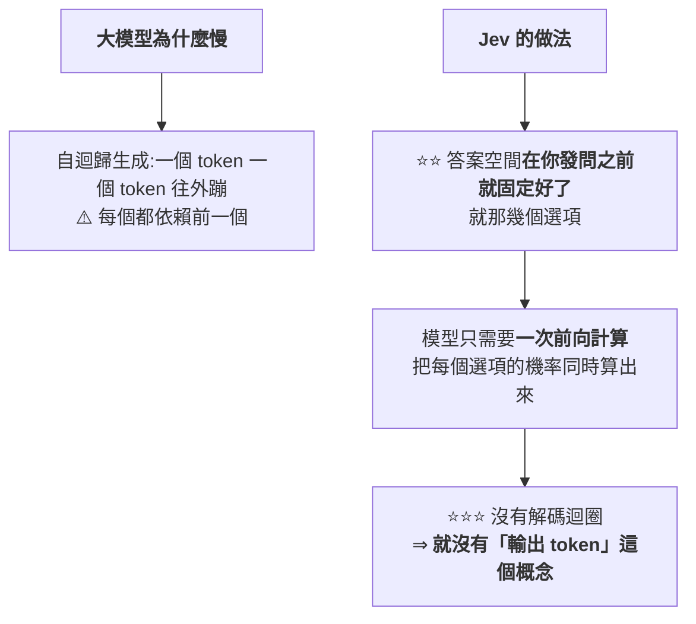

# 不會打字的模型:Jev、System One,與「返回枚舉值的調用可以下沉」

> 整理自 YouTube 頻道 **Why QQ**〈[不会打字的AI,有啥用?程序员给了1777赞 ChatGPT作者的新作](https://www.youtube.com/watch?v=pEMIF2Cu1mA)〉(2026-09-17,約 9.7 分鐘,官方 zh-Hans 字幕)。
> ⭐⭐ **本文已直接讀取 [TypeSafe AI 官方部落格原文](https://typesafe.ai/blog/introducing-system-one-models-and-jev) 核實**,
> 並補上影片未提、**但官方自己承認的兩個限制**(見 §8)。
> ⚠️ **這是一個剛發布的商業產品,所有效能數字目前都只有官方口徑,尚無第三方獨立評測。**

---

## 一句話總結

> **ChatGPT 共同發明人之一消失兩年後,拿出的新模型一個字都不會寫 ——
> 你丟一段程式狀態給它,它回你一串機率。**
>
> ⭐⭐⭐ **判斷它跟你有沒有關係只要一句話:
> **你的模型調用如果返回的是一個枚舉欄位,它就是候選;返回自由文本,就別想了。****

---

## 一、⭐⭐ 出發點:聊天很強,和軟體能直接用之間隔著一條溝

**作者 Diogo Almeida 在 OpenAI 參與過 RLHF 研究(那套方法後來成了 ChatGPT 的地基),
也是 2022 年 InstructGPT 論文的作者之一。**

> ⭐ **他這幾年一直在問同一個問題:「模型聊天早就超過人類了,說好的自動化在哪?」**

### 那條溝長什麼樣(每個寫過 LLM 整合的人都遇過)


---

## 二、⭐⭐⭐ System One:名字借自《思考,快與慢》

| | **System 2(目前主流)** | ⭐ **System One(Jev 的方向)** |
|---|---|---|
| 對應 | 慢慢推理的那部分 | **人腦裡不費力的直覺判斷**(看到一封信立刻知道是不是垃圾郵件) |
| 現況 | **推理模型都在模仿它,思維鏈越拉越長** | ⭐⭐ **Jev 走了反方向** |

### 它只回答三種問題

| 類型 | 內容 |
|---|---|
| **Choice** | 從你給的選項裡挑一個(**上限 255 個**) |
| **Score** | 按你定義的刻度打分(例:流失風險 0 到 1) |
| **Bool** | 一個是非判斷,**返回「是」的機率** |

> ⭐ **三種問題可以打包進一次請求,對著同一份狀態並行算完 —— 加問題幾乎不增加耗時。**

---

## 三、⭐⭐⭐ 速度的來源:把自迴歸整條砍掉



> ⭐ **所以定價看起來很反常** —— 輸入 **$0.042 / 百萬 token**、**輸出免費**。
> **官方的說法是「便宜到不值得計量(too cheap to meter)」。**

📌 **官方對照:現有 LLM 的輸入約 $0.20 到 $10 / 百萬 token,而輸出通常比輸入再貴約 5 倍。**

> ⭐⭐ **一句話總結這個取捨:「放棄生成字串這個看似巨大的犧牲,
> 換來的是速度和成本上**兩個數量級**的空間。」**

---

## 四、⭐⭐ RLCD:優化目標是「機率要誠實」

| 方法 | 優化什麼 |
|---|---|
| **RLHF**(聊天模型) | **人類偏好** —— 說人話就是「答案要讓人覺得舒服」 |
| **RLVR**(推理模型) | **可驗證的對錯**(例:測試案例過不過) |
| ⭐⭐⭐ **RLCD**(Jev 自研) | **Reinforcement Learning for Calibrated Decisions** —— **機率要誠實** |

> **模型說 70% 把握,那在這類判斷上就應該**真的對七成**。這個性質叫**校準(calibration)**。**

### ⭐⭐⭐ 為什麼校準對自動化比「聰明」更關鍵

> ⚠️ **「一個 95% 正確率、但永遠不說自己什麼時候會錯的模型,
> 你沒法把它放進無人值守的流水線。」**
>
> ⭐⭐⭐ **「知道自己什麼時候可能不知道,比單純的聰明更值錢。」**

📎 **這與本庫 [[agent-paid-api-cost-guardrails-mcp]] 的「護欄要放在 Agent 改不動的那一層」是互補的:
⭐ 那篇講「用外部系統擋住它」,這裡講「讓它自己報告可信度」—— 兩者都是為了讓無人值守成為可能。**

---

## 五、⚠️⚠️ 「零幻覺」是一個需要看清楚的說法

**官方圖表上,各家模型結構化輸出的錯誤率從 0.58% 排到 45.5%,Jev 那根柱子是 0%。**

> ⭐⭐⭐ **但關鍵在這裡:這個 0% **不是測出來的,是數學上保證的**。**
> **答案空間事先枚舉好 ⇒ 模型在物理上不可能輸出選項以外的東西。**

| 它保證的 | ⚠️ 它不保證的 |
|---|---|
| ⭐ **格式永遠合法**(不會出現型別錯誤) | ⚠️⚠️ **判斷永遠正確** |

> ⭐ **影片給的比喻很準:「一個分類器可以很自信地選錯答案,Jev 也一樣。」**
>
> ⭐⭐ **而且值得肯定的是:TypeSafe 的 CEO 在 Hacker News 評論區**親口承認模型完全可能自信地犯錯**。**

📌 **本文核實官方原文的用詞:確實寫的是「never makes type errors」與「can't hallucinate」,
但幻覺指標的註記也明說了這**不是實證數據,而是透過 schema 匹配在數學上不可能**。⭐ 官方措辭是誠實的。**

---

## 六、⚠️⚠️ 評測方法的三個問題(影片講得很好)

**TypeSafe 沒有跑任何公開榜單,而是自造了一套「工作流評測」:**

| 做法 | 內容 |
|---|---|
| **① 把四個真實業務決策流程寫成程式碼** | 例:安全告警的分診、定級、遏制、處置 |
| ⚠️⚠️ **② 參考答案** | **拿 GPT-6 Astra 與 Fable 5.1 這兩個最貴模型的「平均預測」當標準答案** |
| **③ 比較** | 看每個模型跟參考答案差多少 |

### ⚠️ 三個問題

| # | 問題 |
|---|---|
| **1** | ⭐⭐⭐ **參考答案本身就偏向 OpenAI 與 Anthropic 的判斷** —— **「跟參考答案一致,不等於跟事實一致」** |
| **2** | ⚠️ **工作流是自己團隊設計的**(⭐ 本文核實:官方原文自承這些工作流「由我們模型能力團隊的成員製作」,並承認可能引入偏誤) |
| **3** | ⚠️ HN 上有人說得更直白:**「要是公開榜單成績好,你猜他們發不發?」** |

### ⚠️ 速度對比也被質疑是「蘋果比橘子」

> **質疑派的核心論點:Jev 的 70 毫秒,對的是「大模型生成完整結構化答案的全過程」。
> ⚠️ **如果只讓大模型吐一個短答案,差距會小很多。****

📌 **官方數字為:端到端 **70ms–500ms** vs 前沿模型 **3 到 329 秒**;首頁掛著 **193.6× 快、444.6× 便宜**。
⭐ **本文核實:官方自己在部落格裡註明「這些是真實世界增益的較高端」** —— 措辭同樣誠實。**

---

## 七、⭐ 兩個發布演示:都要泼一盆冷水

| 演示 | ⚠️ 該注意的 |
|---|---|
| **Jev 即時打 Doom**(每秒查詢 10 次,一小時成本約 7 美元) | ⚠️⚠️ **模型拿到的不是螢幕像素,是結構化的文字狀態** —— 敵人位置、距離、角度都提前寫好餵給它,**相當於開了全圖透視**。⭐ **它證明的是低延遲決策能力,不證明通用遊戲智能** |
| **維基百科賽車**(從一個詞條只點連結跳到目標詞條) | ⭐ Jev 用的步數更少;😅 **第二局與第三局的起點碰巧都是「橡皮鴨」詞條,作者自己都是被同事提醒才發現** |

---

## 八、⭐⭐ 社群怎麼看(HN 1,777 讚 / 400+ 評論)

| 陣營 | 論點 |
|---|---|
| ⚠️ **質疑:蘋果比橘子** | 見 §6 |
| ⚠️⚠️ **質疑:名詞造得太快** | **「RLCD 和並行採樣都是為發布會造的詞 —— 沒有論文、沒有消融實驗,在有人能複現之前都只是行銷語言。」** 架構只能靠猜(有人猜是砍了生成頭的編碼器加分類頭),**官方回應是先捂著** |
| ⭐ **支持:今天就能用** | 做批量分類、做代理管線的人都說能用;**有人估計能替換管線裡四到七成的模型調用** |
| 😄 **歡樂的** | 不少人盯著創辦人名字看半天,**以為 Diogo Almeida 是拿 Dario Amodei 編的段子** |

---

## 九、⭐⭐⭐ 有人已經自己動手了:jevlike

**GitHub 上的開源專案,作者明說**這不是 Jev 的複刻,只是輸入輸出形狀相同的起步模型**。**

**做法很直覺:**


| 場景 | 結果 |
|---|---|
| **合成資料** | 準確率可到 **98%** |
| **真實的維基百科點擊資料**(凍結一個 Qwen2.5-0.5B 當編碼器) | **26%**,而**亂序對照組只有 8%** |
| ⭐ **八個選項的場景** | **比一個小解碼器寫 400 個 token 快一百倍** |

> ⭐⭐ **影片給了一個很實際的提醒:「你用 `llama.cpp` 加約束採樣,今天就能在本地跑同樣的決策模式。
> **TypeSafe 真正賣的是「校準訓練」這層功夫。**」**

---

## 十、⭐⭐⭐ 正確的理解方式:不是取代,是分工

> ⚠️ **「很多人腦子裡還在比 Jev 和 Claude 誰強 —— 這個對比本身就站不住。」**

**Jev 的限制很明確:不會寫程式、不會聊天、上下文 32K、不支援圖片、目前只有邀請制 API。**


### ⭐ 適合的場景很具體

| 場景 |
|---|
| **海量工單分類與路由** |
| ⭐⭐ **給另一個模型的輸出做二次校驗與護欄** |
| **語音助手這種延遲敏感的即時判斷** |
| **對大資料集做打分式的 map-reduce** |

> ⭐⭐⭐ **判斷標準一句話:**
> **「你的模型調用如果返回的是一個**枚舉欄位**,它就是候選;返回的是**自由文本**,就別想了。」**

---

## 十一、⭐⭐ 名字的野心:傑文斯悖論

> **Jev 致敬十九世紀經濟學家 **Jevons**:當年蒸汽機效率提升,**煤的總消耗量不降反升** ——
> 因為便宜的能源讓以前不划算的用途全都成立了。**

⭐ **TypeSafe 的賭注:智能會走同一條曲線 ——
**決策成本每降一個數量級,就會冒出一批以前根本不值得自動化的場景。****

**影片舉的兩個已發生的先例很好:**

| 先例 | 結果 |
|---|---|
| **簡訊便宜了** | **雙因素認證就普及了** |
| **向量 embedding 便宜了** | **語義搜尋從論文變成標配** |

> ⭐⭐⭐ **「便宜到一定程度,本身就是一種新能力。」**

📎 ⚠️ **但要對照本庫 [[jalapeno-inference-benchmark-boundaries]] 記的另一面:
**能效變高不等於機房省電(傑文斯效應)** —— 同一個效應,對使用者是機會,對總體資源消耗是隱憂。**

---

## 應用案例:三個動作

### 案例 1|⭐⭐⭐ 盤一遍你系統裡的模型調用

> **凡是返回值是**枚舉、布林或分數**的,單獨列出來 —— 這些就是可以下沉到決策模型的部分。**

⭐ **可操作的做法:直接 grep 你的程式碼,找出所有「拿到 LLM 回應後做字串比對或 JSON 解析取單一欄位」的地方。**

```bash
# 粗略找出「解析 LLM 回應取單一欄位」的呼叫點
grep -rn "json.loads\|JSON.parse" --include=*.py --include=*.ts . | grep -i "response\|completion\|message"
```

📌 **如果那個欄位的取值只有固定幾種 ⇒ 它就是 §10 說的候選。**

### 案例 2|⭐⭐ 別照單全收官方評測,拿自己的資料測校準

> **模型說 80% 把握的時候,**在你的分布上是不是真的對八成**?**

⭐ **最小可行做法(不需要任何框架):**

| 步驟 | 做法 |
|---|---|
| **①** | 收集 N 筆「模型給了機率 + 你知道正確答案」的紀錄 |
| **②** | 按機率分桶(0–10%、10–20%…) |
| ⭐ **③** | **每桶算「實際正確率」,跟「桶的中心機率」比** |
| **④** | 畫出來就是**校準曲線**;⚠️ **完美校準是一條 45 度線** |

> ⭐⭐ **這件事跟用不用 Jev 無關 —— 你現在用的任何模型都該這樣測一次。**

### 案例 3|⭐ 不必排隊等 API,先用本地小模型驗證想法

> **用 `llama.cpp` 加約束解碼,或參考 jevlike 那種幾十行就能起步的架構,
> 足夠驗證「這個判斷下沉之後,準確率掉多少、省多少錢」。**

📎 **這與本庫 [[multi-agent-data-consistency-reliability]] 的「強型別約束」是同一件事的兩種實作:
⭐ 那篇靠 Pydantic 在輸出端約束,這裡是在**模型架構層**就把答案空間鎖死。**

---

## 重點回顧(TL;DR)

1. **ChatGPT 共同發明人之一(RLHF 與 InstructGPT 作者)沉寂兩年後推出 Jev,2026-09-15 發布。**
2. ⭐⭐ **它只回答三種問題**:Choice(≤255 選項)、Score(自訂刻度)、Bool(返回「是」的機率);可打包進一次請求並行算完。
3. ⭐⭐⭐ **速度來源是把自迴歸整條砍掉** —— 答案空間事先固定 ⇒ 一次前向算完所有選項機率 ⇒ **沒有解碼迴圈,就沒有「輸出 token」這個概念**。
4. **定價:輸入 $0.042/MTok、輸出免費**(官方語:「便宜到不值得計量」)。
5. ⭐⭐⭐ **RLCD 優化的是「機率要誠實」(校準)** —— **「知道自己什麼時候可能不知道,比單純的聰明更值錢。」**
6. ⚠️⚠️ **「零幻覺」不是測出來的,是數學上保證的** —— 它保證**格式永遠合法**,**不保證判斷永遠正確**;⭐ CEO 自己也在 HN 承認模型可能自信地犯錯。
7. ⚠️⚠️ **評測方法有明顯問題**:沒跑公開榜單、**用 GPT-6 Astra 與 Fable 5.1 的平均預測當標準答案**(跟參考答案一致 ≠ 跟事實一致)、工作流由自家團隊設計。⭐ **但官方自己都寫明了這兩點。**
8. ⚠️ **Doom 演示要打折**:模型拿到的是結構化文字狀態不是像素,**等於開了全圖透視**;它證明低延遲決策,不證明通用遊戲智能。
9. ⚠️ **HN 的核心質疑**:速度是「蘋果比橘子」;RLCD 沒有論文、沒有消融實驗,**在有人複現前都只是行銷語言**。
10. ⭐⭐ **開源起步專案 jevlike**:選項編碼成查詢向量 → 注意力 → 點積 → softmax,一次前向;⭐ **八選項場景比小解碼器寫 400 token 快一百倍**。
11. ⭐⭐⭐ **正確理解是分工**:大模型在互動裡設計決策邏輯 → 固化成程式碼與 schema → 決策模型在生產內迴圈高頻執行。
12. ⭐⭐⭐ **一句判準:返回枚舉欄位的調用是候選,返回自由文本的別想。**
13. ⭐ **名字致敬傑文斯悖論**:決策成本每降一個數量級,就會冒出一批以前不值得自動化的場景(簡訊便宜 ⇒ 2FA 普及;embedding 便宜 ⇒ 語義搜尋成標配)。

---

## 核實狀態

### ✅ 已核實(直接讀取 TypeSafe AI 官方部落格)

| 影片說法 | 核實結果 |
|---|---|
| **輸入 $0.042 / 百萬 token、輸出免費** | ⭐ **屬實**,官方原文為 `$0.042 / MTok ($42 per billion tokens)` 與 `FREE (too cheap to meter)` |
| **端到端 70ms–500ms vs 前沿模型 3 到 329 秒** | **屬實** |
| **首頁的 193.6× 快、444.6× 便宜** | **屬實**;⭐⭐ **而且官方自己註明「這些是真實世界增益的較高端」** |
| **RLCD = Reinforcement Learning for Calibrated Decisions,優化「機率誠實」** | **屬實**,官方原文為 "epistemically honest probabilities on System One tasks" |
| ⭐⭐ **零幻覺是「數學上不可能」而非實測** | **屬實** —— 官方在幻覺指標的註記明說 **not empirical**,是透過 schema 匹配保證 |
| ⚠️⚠️ **參考答案是 GPT-6 Astra 與 Fable 5.1 的平均** | **屬實** |
| ⚠️ **工作流由自家團隊設計** | ⭐ **屬實,而且官方主動承認可能引入偏誤** —— 原文說這些工作流「由我們模型能力團隊的成員製作」 |
| **目前非公開可用** | **屬實**,官方為 **early access + waitlist** |

### ⭐ 本文補充(官方自承、影片未提的兩點)

1. ⭐⭐ **官方自己標註速度倍數「屬於真實世界增益的較高端」** —— 這比影片轉述的「官方口徑」更精確地說明了官方並未隱瞞。
2. ⭐ **官方自己承認工作流評測有偏誤風險** —— 影片把這點當成質疑提出,但官方其實主動寫在部落格裡。

> 📌 **這兩點讓「行銷話術」這個指控要打一些折扣:**
> ⚠️ **問題確實存在(自造評測、自選參考答案),但官方的揭露是誠實的。**

### ⚠️ 未能獨立查證

- ⚠️ **三種問題類型與 255 選項上限、32K 上下文** —— **官方部落格未以此形式列出**(本文查得的是「classify, route, score, extract, or branch」這種能力描述);⭐ **推測影片是取自技術文件,但本文未取得該文件核對。**
- **各家結構化輸出錯誤率 0.58%–45.5% 的對照圖** —— **未逐項核對。**
- **HN 1,777 讚 / 400+ 評論、CEO 在評論區的承認** —— **未回溯原帖。**
- **The Register 的錄屏數據(Jev 0.114 秒 vs GPT-5.6 Terra 8.566 秒)** —— **未取得原報導。**
- **jevlike 的 98% / 26% / 8% 與「快一百倍」** —— ⚠️ **未實際執行該專案驗證;且作者自承這不是 Jev 的複刻。**
- **Doom 演示每秒 10 次查詢、一小時約 7 美元** —— **未核算。**
- **「有人估計能替換管線裡四到七成的模型調用」** —— **屬社群估計,無依據。**

> ⚠️⚠️ **這是一個發布三天的商業產品,所有效能宣稱目前都只有官方口徑,
> **沒有任何第三方獨立評測,也沒有論文或消融實驗**。
> ⭐ 本文整理其設計思路與社群質疑,不對其效能宣稱背書。**

---

## 來源

- [不会打字的AI,有啥用?程序员给了1777赞 ChatGPT作者的新作 — Why QQ](https://www.youtube.com/watch?v=pEMIF2Cu1mA)(2026-09-17,約 9.7 分鐘,官方 zh-Hans 字幕)
- ⭐⭐ **一手素材**:[Introducing System One models and Jev — TypeSafe AI 官方部落格](https://typesafe.ai/blog/introducing-system-one-models-and-jev)(**定價、延遲、RLCD、零幻覺框架、評測方法皆已對此頁核實**)
- [vinnylarouge/jevlike — GitHub](https://github.com/vinnylarouge/jevlike)(開源起步專案,**作者明說非 Jev 複刻**)
- 延伸:本庫 [[multi-agent-data-consistency-reliability]](強型別約束與結構化輸出)、[[agent-paid-api-cost-guardrails-mcp]](讓無人值守成為可能的另一半:外部護欄)、[[jalapeno-inference-benchmark-boundaries]](⚠️ 傑文斯效應的另一面)、[[token-vs-embedding-llm-and-rag]]、[[kv-cache]]、[[gpt-6-astra-token-efficiency-and-harness]]。
