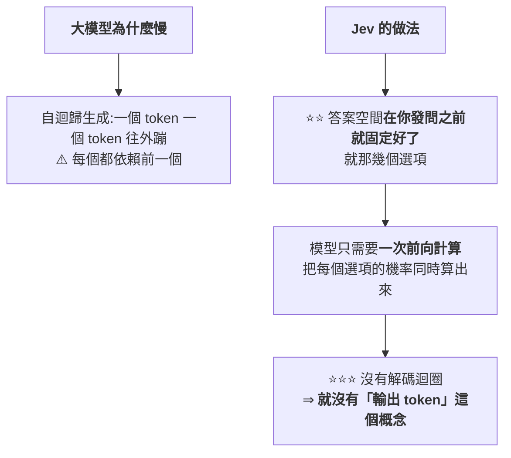
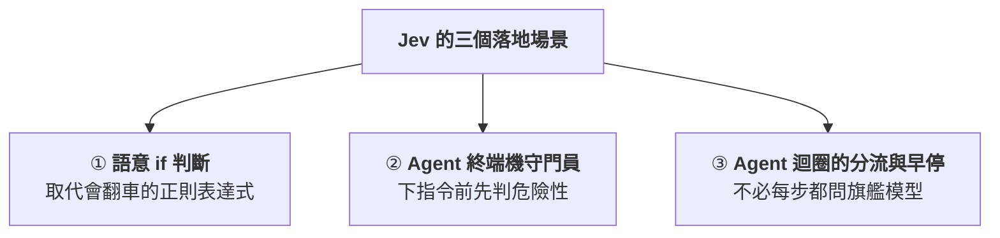
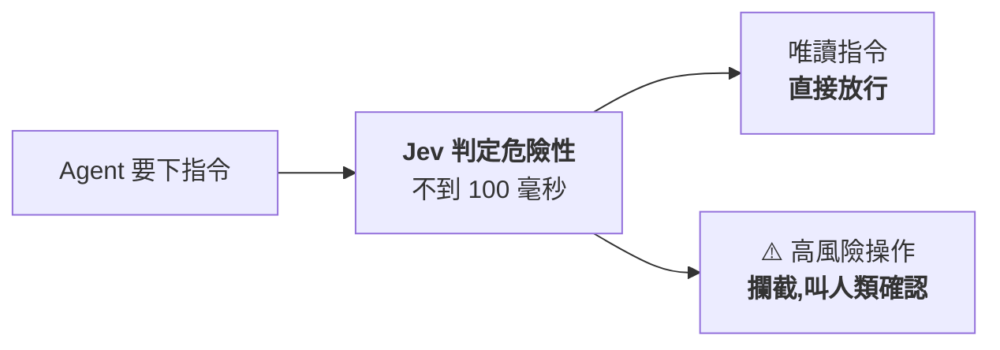
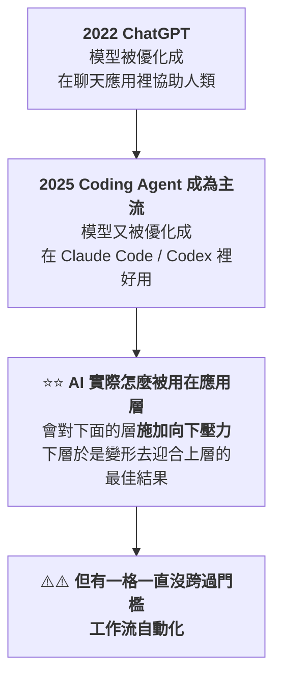
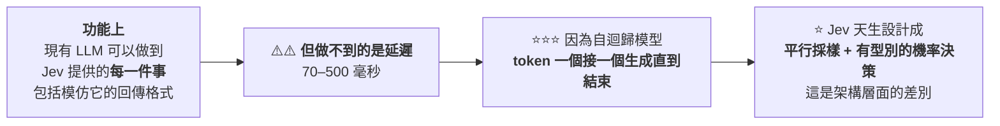
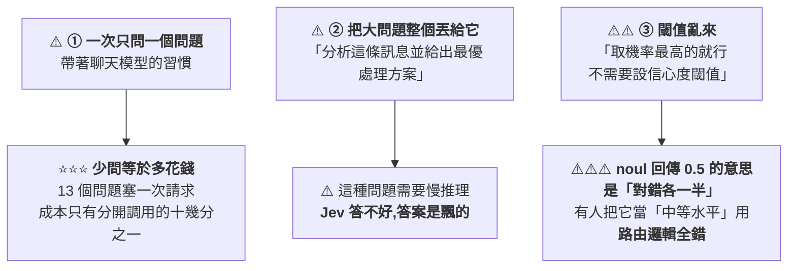
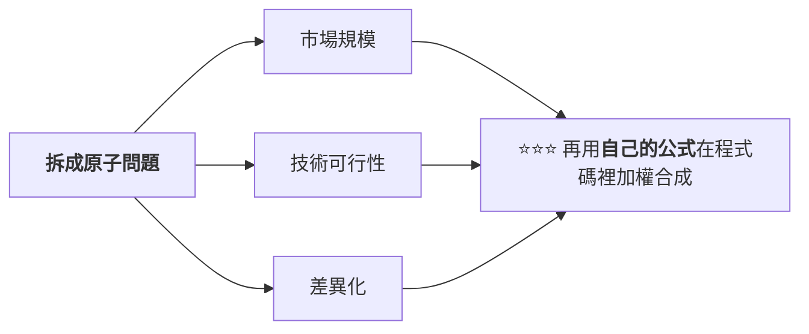

# 不會打字的模型:Jev、System One,與「返回枚舉值的調用可以下沉」

> 整理自 YouTube 頻道 **Why QQ**〈[不会打字的AI,有啥用?程序员给了1777赞 ChatGPT作者的新作](https://www.youtube.com/watch?v=pEMIF2Cu1mA)〉(2026-09-17,約 9.7 分鐘,官方 zh-Hans 字幕)。
> ⭐⭐ **本文已直接讀取 [TypeSafe AI 官方部落格原文](https://typesafe.ai/blog/introducing-system-one-models-and-jev) 核實**,
> 並補上影片未提、**但官方自己承認的兩個限制**(見 §8)。
> ⚠️ **這是一個剛發布的商業產品,所有效能數字目前都只有官方口徑,尚無第三方獨立評測。**
>
> ⭐⭐ **2026-09-19 增補 人蔘 Try Catch**〈[Agent 帳單爆炸?把「做決定」交給 Jev,快 200 倍、便宜 400 倍](https://www.youtube.com/watch?v=j7nu_6cprMI)〉(2026-09-19,約 4.8 分鐘,官方繁中字幕),成為 **§十二:落地視角** —— 三個已在用的場景(語意 `if`、**Agent 終端機守門員**、迴圈早停)、公司背景與取得管道,⚠️⚠️ **並補正該片把「校準」講成單次調用保證的一處過度解讀**(見 §12.5)。
>
> ⭐⭐ **2026-09-20 再增補 Caleb Writes Code**〈[Jev explained in 7min..](https://www.youtube.com/watch?v=vj7hysh0mOI)〉(2026-09-19,約 7.2 分鐘,自動英文字幕),成為 **§十三:為什麼「自動化」一直是被忽略的那一格** —— 應用層對下層的向下壓力、正統路線的「分裂」、Pareto 前緣上它其實站在 Flash/nano 那一檔,以及**有人已用雙向 BERT 做出類似的 4.21 億參數開源模型**。⚠️ **該片中段含 JetBrains Juni CLI 業配。**
>
> ⭐⭐⭐ **2026-09-21 再增補 Why QQ**〈[怎么用好Jev? 决策模型实操指南](https://www.youtube.com/watch?v=Y31OgSV-S8k)〉(2026-09-20,約 10.7 分鐘,官方 zh-Hans 字幕),成為 **§十四:實操指南** —— 三種用砸的姿勢、官方三條心法、社群六個專案,以及取得管道與速率限制。⚠️⚠️ **本節並更正本文 §12.7 自己寫錯的一處**:第三種型態的名稱**確實是 `noul` 不是 `bool`**(見 §14.1)。⚠️ 該片作者在片中介紹了自己的專案 BLUFF。

---

## 一句話總結

> **ChatGPT 共同發明人之一消失兩年後,拿出的新模型一個字都不會寫 ——
> 你丟一段程式狀態給它,它回你一串機率。**
>
> ⭐⭐⭐ **判斷它跟你有沒有關係只要一句話:
> **你的模型調用如果返回的是一個枚舉欄位,它就是候選;返回自由文本,就別想了。****

---

## 一、⭐⭐ 出發點:聊天很強,和軟體能直接用之間隔著一條溝

**作者 Diogo Almeida 在 OpenAI 參與過 RLHF 研究(那套方法後來成了 ChatGPT 的地基),
也是 2022 年 InstructGPT 論文的作者之一。**

> ⭐ **他這幾年一直在問同一個問題:「模型聊天早就超過人類了,說好的自動化在哪?」**

### 那條溝長什麼樣(每個寫過 LLM 整合的人都遇過)


---

## 二、⭐⭐⭐ System One:名字借自《思考,快與慢》

| | **System 2(目前主流)** | ⭐ **System One(Jev 的方向)** |
|---|---|---|
| 對應 | 慢慢推理的那部分 | **人腦裡不費力的直覺判斷**(看到一封信立刻知道是不是垃圾郵件) |
| 現況 | **推理模型都在模仿它,思維鏈越拉越長** | ⭐⭐ **Jev 走了反方向** |

### 它只回答三種問題

| 類型 | 內容 |
|---|---|
| **Choice** | 從你給的選項裡挑一個(**上限 255 個**) |
| **Score** | 按你定義的刻度打分(例:流失風險 0 到 1) |
| ⭐ **Noul** | 一個是非判斷,**返回「是」的機率**(⚠️ **型態名稱確實是 `noul`,不是 `bool`** —— 已對官方 API 文件核實) |

> ⭐ **三種問題可以打包進一次請求,對著同一份狀態並行算完 —— 加問題幾乎不增加耗時。**

---

## 三、⭐⭐⭐ 速度的來源:把自迴歸整條砍掉



> ⭐ **所以定價看起來很反常** —— 輸入 **$0.042 / 百萬 token**、**輸出免費**。
> **官方的說法是「便宜到不值得計量(too cheap to meter)」。**

📌 **官方對照:現有 LLM 的輸入約 $0.20 到 $10 / 百萬 token,而輸出通常比輸入再貴約 5 倍。**

> ⭐⭐ **一句話總結這個取捨:「放棄生成字串這個看似巨大的犧牲,
> 換來的是速度和成本上**兩個數量級**的空間。」**

---

## 四、⭐⭐ RLCD:優化目標是「機率要誠實」

| 方法 | 優化什麼 |
|---|---|
| **RLHF**(聊天模型) | **人類偏好** —— 說人話就是「答案要讓人覺得舒服」 |
| **RLVR**(推理模型) | **可驗證的對錯**(例:測試案例過不過) |
| ⭐⭐⭐ **RLCD**(Jev 自研) | **Reinforcement Learning for Calibrated Decisions** —— **機率要誠實** |

> **模型說 70% 把握,那在這類判斷上就應該**真的對七成**。這個性質叫**校準(calibration)**。**

### ⭐⭐⭐ 為什麼校準對自動化比「聰明」更關鍵

> ⚠️ **「一個 95% 正確率、但永遠不說自己什麼時候會錯的模型,
> 你沒法把它放進無人值守的流水線。」**
>
> ⭐⭐⭐ **「知道自己什麼時候可能不知道,比單純的聰明更值錢。」**

📎 **這與本庫 [[agent-paid-api-cost-guardrails-mcp]] 的「護欄要放在 Agent 改不動的那一層」是互補的:
⭐ 那篇講「用外部系統擋住它」,這裡講「讓它自己報告可信度」—— 兩者都是為了讓無人值守成為可能。**

---

## 五、⚠️⚠️ 「零幻覺」是一個需要看清楚的說法

**官方圖表上,各家模型結構化輸出的錯誤率從 0.58% 排到 45.5%,Jev 那根柱子是 0%。**

> ⭐⭐⭐ **但關鍵在這裡:這個 0% **不是測出來的,是數學上保證的**。**
> **答案空間事先枚舉好 ⇒ 模型在物理上不可能輸出選項以外的東西。**

| 它保證的 | ⚠️ 它不保證的 |
|---|---|
| ⭐ **格式永遠合法**(不會出現型別錯誤) | ⚠️⚠️ **判斷永遠正確** |

> ⭐ **影片給的比喻很準:「一個分類器可以很自信地選錯答案,Jev 也一樣。」**
>
> ⭐⭐ **而且值得肯定的是:TypeSafe 的 CEO 在 Hacker News 評論區**親口承認模型完全可能自信地犯錯**。**

📌 **本文核實官方原文的用詞:確實寫的是「never makes type errors」與「can't hallucinate」,
但幻覺指標的註記也明說了這**不是實證數據,而是透過 schema 匹配在數學上不可能**。⭐ 官方措辭是誠實的。**

---

## 六、⚠️⚠️ 評測方法的三個問題(影片講得很好)

**TypeSafe 沒有跑任何公開榜單,而是自造了一套「工作流評測」:**

| 做法 | 內容 |
|---|---|
| **① 把四個真實業務決策流程寫成程式碼** | 例:安全告警的分診、定級、遏制、處置 |
| ⚠️⚠️ **② 參考答案** | **拿 GPT-6 Astra 與 Fable 5.1 這兩個最貴模型的「平均預測」當標準答案** |
| **③ 比較** | 看每個模型跟參考答案差多少 |

### ⚠️ 三個問題

| # | 問題 |
|---|---|
| **1** | ⭐⭐⭐ **參考答案本身就偏向 OpenAI 與 Anthropic 的判斷** —— **「跟參考答案一致,不等於跟事實一致」** |
| **2** | ⚠️ **工作流是自己團隊設計的**(⭐ 本文核實:官方原文自承這些工作流「由我們模型能力團隊的成員製作」,並承認可能引入偏誤) |
| **3** | ⚠️ HN 上有人說得更直白:**「要是公開榜單成績好,你猜他們發不發?」** |

### ⚠️ 速度對比也被質疑是「蘋果比橘子」

> **質疑派的核心論點:Jev 的 70 毫秒,對的是「大模型生成完整結構化答案的全過程」。
> ⚠️ **如果只讓大模型吐一個短答案,差距會小很多。****

📌 **官方數字為:端到端 **70ms–500ms** vs 前沿模型 **3 到 329 秒**;首頁掛著 **193.6× 快、444.6× 便宜**。
⭐ **本文核實:官方自己在部落格裡註明「這些是真實世界增益的較高端」** —— 措辭同樣誠實。**

---

## 七、⭐ 兩個發布演示:都要泼一盆冷水

| 演示 | ⚠️ 該注意的 |
|---|---|
| **Jev 即時打 Doom**(每秒查詢 10 次,一小時成本約 7 美元) | ⚠️⚠️ **模型拿到的不是螢幕像素,是結構化的文字狀態** —— 敵人位置、距離、角度都提前寫好餵給它,**相當於開了全圖透視**。⭐ **它證明的是低延遲決策能力,不證明通用遊戲智能** |
| **維基百科賽車**(從一個詞條只點連結跳到目標詞條) | ⭐ Jev 用的步數更少;😅 **第二局與第三局的起點碰巧都是「橡皮鴨」詞條,作者自己都是被同事提醒才發現** |

---

## 八、⭐⭐ 社群怎麼看(HN 1,777 讚 / 400+ 評論)

| 陣營 | 論點 |
|---|---|
| ⚠️ **質疑:蘋果比橘子** | 見 §6 |
| ⚠️⚠️ **質疑:名詞造得太快** | **「RLCD 和並行採樣都是為發布會造的詞 —— 沒有論文、沒有消融實驗,在有人能複現之前都只是行銷語言。」** 架構只能靠猜(有人猜是砍了生成頭的編碼器加分類頭),**官方回應是先捂著** |
| ⭐ **支持:今天就能用** | 做批量分類、做代理管線的人都說能用;**有人估計能替換管線裡四到七成的模型調用** |
| 😄 **歡樂的** | 不少人盯著創辦人名字看半天,**以為 Diogo Almeida 是拿 Dario Amodei 編的段子** |

---

## 九、⭐⭐⭐ 有人已經自己動手了:jevlike

**GitHub 上的開源專案,作者明說**這不是 Jev 的複刻,只是輸入輸出形狀相同的起步模型**。**

**做法很直覺:**


| 場景 | 結果 |
|---|---|
| **合成資料** | 準確率可到 **98%** |
| **真實的維基百科點擊資料**(凍結一個 Qwen2.5-0.5B 當編碼器) | **26%**,而**亂序對照組只有 8%** |
| ⭐ **八個選項的場景** | **比一個小解碼器寫 400 個 token 快一百倍** |

> ⭐⭐ **影片給了一個很實際的提醒:「你用 `llama.cpp` 加約束採樣,今天就能在本地跑同樣的決策模式。
> **TypeSafe 真正賣的是「校準訓練」這層功夫。**」**

---

## 十、⭐⭐⭐ 正確的理解方式:不是取代,是分工

> ⚠️ **「很多人腦子裡還在比 Jev 和 Claude 誰強 —— 這個對比本身就站不住。」**

**Jev 的限制很明確:不會寫程式、不會聊天、上下文 32K、不支援圖片、目前只有邀請制 API。**


### ⭐ 適合的場景很具體

| 場景 |
|---|
| **海量工單分類與路由** |
| ⭐⭐ **給另一個模型的輸出做二次校驗與護欄** |
| **語音助手這種延遲敏感的即時判斷** |
| **對大資料集做打分式的 map-reduce** |

> ⭐⭐⭐ **判斷標準一句話:**
> **「你的模型調用如果返回的是一個**枚舉欄位**,它就是候選;返回的是**自由文本**,就別想了。」**

---

## 十一、⭐⭐ 名字的野心:傑文斯悖論

> **Jev 致敬十九世紀經濟學家 **Jevons**:當年蒸汽機效率提升,**煤的總消耗量不降反升** ——
> 因為便宜的能源讓以前不划算的用途全都成立了。**

⭐ **TypeSafe 的賭注:智能會走同一條曲線 ——
**決策成本每降一個數量級,就會冒出一批以前根本不值得自動化的場景。****

**影片舉的兩個已發生的先例很好:**

| 先例 | 結果 |
|---|---|
| **簡訊便宜了** | **雙因素認證就普及了** |
| **向量 embedding 便宜了** | **語義搜尋從論文變成標配** |

> ⭐⭐⭐ **「便宜到一定程度,本身就是一種新能力。」**

📎 ⚠️ **但要對照本庫 [[jalapeno-inference-benchmark-boundaries]] 記的另一面:
**能效變高不等於機房省電(傑文斯效應)** —— 同一個效應,對使用者是機會,對總體資源消耗是隱憂。**

---

## 十二、⭐⭐⭐ 兩天後的落地視角:社群到底拿它做什麼(2026-09-19 增補,來源:人蔘 Try Catch)

> **§一到 §十一 講的是「它是什麼、該不該信」。這一節換成另一個問題:**已經有人拿它做什麼了**。**
>
> ⭐⭐ **本節順手把公司背景與取得管道查清楚了**(見 §12.4),
> ⚠️⚠️ **並補正影片對「校準」的一處過度解讀**(見 §12.5)。

---

### 12.1 ⭐⭐ 問題的重新描述:貴的不是「想」,是「每一步都重新想」

> ⚠️ **「現在大家用 Agent 最崩潰的,就是動不動就把推理強度拉滿、在那邊想半天 ——
> **每動一步都要卡個兩三秒,時間全花在等它做決定,而且帳單還貴得要命。**」**
>
> ⭐⭐⭐ **「其實很多時候,它只是在**十字路口做個小決定**而已。」**

📌 **⭐ 這個說法跟 §10 的判準是同一件事的兩種講法:
**§10 從「返回值型別」切入,§12 從「這一步值不值得動用旗艦模型」切入。****

---

### 12.2 ⭐⭐⭐ 三個已經在用的場景



#### 場景 ①|⭐⭐ 語意 `if`

| 舊做法 | ⚠️ 問題 |
|---|---|
| **寫正則表達式分流客訴** | ⚠️ **隨時會翻車** |
| **呼叫大模型** | ⚠️ **要等兩秒** |

> ⭐ **新做法:把狀態丟進去,**八十毫秒內吐出強型別數值** ——
> **「退費機率 > 85%、緊急程度 ≥ 4 級,直接觸發警報分派」**,程式碼特別乾淨。**

#### 場景 ②|⭐⭐⭐ Agent 終端機守門員(本節最有價值的一個)

> ⚠️ **「把終端機交給 AI,最怕它腦抽執行破壞性指令把專案炸了。
> **全部手動確認很煩,全自動又太危險。**」**



📎 ⭐⭐⭐ **這與本庫 [[agent-paid-api-cost-guardrails-mcp]] 的「硬上限要放在 Agent 改不動的那一層」完全吻合 ——
差別只在**那篇的閘門是規則,這裡的閘門是一個 80 毫秒的決策模型**,能處理規則寫不出來的語意判斷。**

#### 場景 ③|⭐⭐ Agent 迴圈的早停

> ⚠️⚠️ **「最浪費錢的往往不是寫 code,而是**每跑一步都要問大模型「我該停了嗎」**。
> 把十萬 token 的上下文丟給旗艦模型問要不要重試,又貴又卡。」**
>
> ⭐⭐⭐ **「換成 Jev 做狀態機跳轉,幾毫秒就能確認是不是搞定了 ——
> **昂貴的大腦只在真正需要產出時才開工。**」**

---

### 12.3 ⭐⭐⭐ 一個很好的架構原則

> ⭐⭐⭐ **「不是每一步都需要最強模型重新思考。」**

| 層 | 負責 |
|---|---|
| ⭐ **確定性規則** | **能擋的,連一毛錢都別花** |
| **決策層(Jev 這類)** | **需要語意理解與路由的** |
| **旗艦模型** | **真正燒腦寫 code 的難題** |
| ⭐⭐ **人工** | **拿不準的退回** |

> ⭐⭐ **影片點出一個很好的類比:「**Codex 的 auto-approve**,不就是寫程式的 Agent 想改檔、
> 旁邊另一道機制在判斷要不要批准嗎?」**
>
> ⭐ **也就是說:**「做事」與「判斷」分開,在架構上本來就是標準的職責分離** ——
> 概念不新,新的是**落地代價**(見 §12.4)。**

📎 **這條線索與本庫 [[multi-agent-data-consistency-reliability]]、[[harness-loop-graph-troubleshooting-map]] 是同一個主題:
⭐ **把控制流從模型手裡拿回到程式碼裡。****

---

### 12.4 ⭐⭐ 公司背景與取得管道(本節新查證)

| 項目 | ⭐ **已核實** |
|---|---|
| **出場** | **2026-09-15 結束隱身模式** |
| **融資** | ⭐ **4,000 萬美元種子輪,由 DCVC 領投** |
| **創辦人** | **Diogo Almeida(前 OpenAI,參與 RLHF / ChatGPT / GPT-4)、Erik Gafni、Sasha Sheng** |
| **官方管道** | **typesafe.ai 排隊等候名單(early access)** |
| ⭐ **Vercel AI Gateway** | **已上架,費率同為 $0.042 / 百萬輸入 token,計費方式與其他 Gateway 模型相同** |
| ⚠️ **OpenRouter** | ⚠️ **影片說「已原生上架」,本文未能查證,列為未核實** |

> ⭐ **影片提到「控制台有 Playground,可免寫程式直接貼 JSON 測試」、「排隊通常一到兩天通過」 ——
> ⚠️ **兩者皆未核實,且等待時間本來就會隨時間變動。****

### ⭐⭐ 既然概念不新,為什麼能拿到 4,000 萬美元?

> ⭐⭐⭐ **影片的回答很準:「重點不是名詞,而是**落地代價**。」**
>
> ⚠️ **「拿頂級大模型當審核,又慢又貴,**而且信心度根本沒校準**。」**

---

### 12.5 ⚠️⚠️⚠️ 補正:「說九成把握,出錯率就真的只有一成」——這句話要小心

**影片說:「RLCD 訓練出來的統計校準,**它說九成把握,出錯率就真的只有一成**。」**

> ⚠️⚠️⚠️ **這是把**群體統計性質**講成了**單次調用的保證**。**

| ✅ 校準真正的意思 | ⚠️ 不是這個意思 |
|---|---|
| ⭐ **在「模型宣稱 90% 把握」的**那一大批**調用裡,大約九成是對的** | ⚠️ **你手上這一次 90% 的調用,有 90% 的機率是對的且可以直接信** |

**⭐ 三個必須一起記住的限制:**

| # | 限制 |
|---|---|
| **①** | ⭐ **校準是**分布層級**的性質,要有足夠樣本才觀察得到** |
| **②** | ⚠️⚠️ **校準在**你的資料分布上**未必成立** —— 官方是在自家任務上訓練與評估的(見 §六) |
| **③** | ⚠️⚠️⚠️ **§五已經講過:schema 只保證**格式合法**,不保證**判斷正確**** |

> 📌 **⭐ 本節查到的第三方報導把這點講得很直白:
> **「schema 能保證 Jev 回傳允許的形狀之一;它無法保證選出的答案是對的。」****
>
> ⭐⭐⭐ **所以 §應用案例 2「拿自己的資料測校準」那一步不是可選的,是必要的。**

---

### 12.6 ⚠️ 補正:「快兩百倍、便宜四百倍」是**官方自己說屬於高端**的數字

**影片的標題與結語都用了「快 200 倍、便宜 400 倍」。**

> ⭐ **這對應官方首頁的 **193.6× / 444.6×**,§六已經記過 ——
> ⚠️⚠️ **官方自己在部落格註明這些「屬於真實世界增益的較高端」。****

**⭐ 本節新查到的第三方報導又補了兩條,與本文 §六的判斷一致:**

| 質疑 |
|---|
| ⚠️ **「這些是公司自己產生的結果,不是獨立量測。」** |
| ⚠️⚠️ **「這個基準並沒有拿 Jev 跟**客觀答案**比,它量的是每個模型與**兩個大型外部模型回傳機率的平均值**的差距。」** |
| ⚠️ **「速度與成本結果未經獨立驗證,且會隨工作負載與網路位置變動。」** |

> ⭐⭐ **值得肯定的是:TypeSafe 對這些限制的揭露一直是誠實的(§六已記)。
> ⚠️ **但轉述者往往只留下倍數,把限制省掉了** —— 這一節記下來就是為了這件事。**

---

### 12.7 ⭐ 一點小勘誤

⚠️⚠️ **本文自行更正(2026-09-21)**:本節原先寫「該片把第三種型態念成 Noul,正確應是 Bool」——
**這個更正本身是錯的**。⭐ **已對官方 API 文件核實,該型態的名稱就是 `noul`**,
請求體裡寫的是 `"type": "noul"`(另兩個是 `"choice"` 與 `"score"`)。
⭐ **原影片沒有講錯,本文已更正 §二的表格。**

---

## 十三、⭐⭐ 第三個視角:為什麼「自動化」一直是被忽略的那一格(2026-09-20 增補,來源:Caleb Writes Code)

> **§一到 §十一是「它是什麼」、§十二是「拿它做什麼」。
> ⭐⭐⭐ 這一節補上第三個問題:**為什麼是現在、為什麼是這個形狀**。**
>
> ⚠️⚠️ **立場揭露:該片中段有一段 JetBrains Juni CLI 的業配**
> (含「連結在說明欄」的導購與限時折扣),**與 Jev 無關,本文不轉述其宣稱。**

---

### 13.1 ⭐⭐⭐ 一個很好的框架:應用層會對下面的層施加向下壓力



> ⚠️ **「即使是 Astra 和 Fable 這種高度聰明的模型,
> 在這一格也**無法在不付出巨大成本的情況下跨過門檻**。」**

### ⭐⭐⭐ TypeSafe 的主張:門檻難跨不是因為模型不夠聰明,是因為**優化目標不同**

> ⭐⭐ **他們的說法是「正統路線上的一次**分裂(schism)**」:**
> **為**人類偏好**優化、再為**可驗證獎勵**優化,
> ⚠️ **這兩件事在「決策必須在不確定下快速做出」時,並不會延續過來。****

> ⭐⭐⭐ **「把一個為人類互動與 agentic 使用優化的模型,硬塞進自動化,
> **從根本上就是錯誤的做法。**」**

📌 **⭐ 這與 §四 RLCD 的設計動機接得上:
**RLHF 優化「讓人舒服」、RLVR 優化「答案對不對」、RLCD 優化「機率要誠實」** ——
⭐ 三個目標,三種模型形狀。**

---

### 13.2 ⭐⭐ 一個很誠實的觀察:社群在秀的是「速度」,不是「理解深度」

> **「社群上展示的 Jev 專案,大多其實是在秀**執行速度**,而不是理解的深度。
> 郵件排序、改進 RAG、玩遊戲、模型路由 —— **這些現有 LLM 全都做得到**。」**



> ⭐⭐⭐ **所以作者的結論很精準:
> **「重點不是 Jev 功能上做得到什麼,而是我們把模型優化成什麼樣子,
> 好讓自動化、遊戲、大量排序這類任務**在實務上變得可行**。」****

📌 **⚠️ 順帶一提:本片給的倍數是 **40 到 200 倍快** ——
⭐ **比官方首頁的 193.6× 保守得多,也比 §十二那支影片的「快 200 倍」講得完整**(給了下界)。
⭐ **要引用的話,「40–200 倍、視工作負載而定」比單一數字誠實。**

---

### 13.3 ⭐⭐⭐ 一個很好的比喻:我們回到了邏輯閘與暫存器

> **「Jev 基本上**強迫你離開原始文字輸入**,把它放進結構化格式;
> 它也回傳結構化格式,但帶著一個**機率分布**。」**
>
> ⚠️ **「『好,那我拿這個要幹嘛?』 —— 這就是很多習慣用傳統 LLM 互動的人卡住的地方。
> **我們跟 Jev 的交戰規則完全不同了。**」**

> ⭐⭐⭐ **「感覺幾乎像是我們回到了**邏輯閘與暫存器**,
> 現在必須在上面蓋很多層抽象,才能組出更複雜的應用。」**

📎 **⭐ 本庫 [[differentiable-logic-gate-networks-mario-29-gates]] 講的是**真的**邏輯閘網路;
這裡是個比喻,但兩者指向同一件事:**先問這個任務需要多少決策位元,再決定要不要上大模型**。**

---

### 13.4 ⭐⭐ Pareto 前緣上它到底站在哪

> ⭐⭐ **「Jev 競爭的位置更接近 **Flash / nano 級**的模型 ——
> 像 GPT-5.6 Luna、DeepSeek V4 Flash、Sonnet 5 —— **但只在工作流特定的任務上**。」**

| ⭐ 這句話的兩個重點 |
|---|
| ⭐ **它的對手不是旗艦模型**,是便宜快速那一檔 |
| ⚠️⚠️ **而且只在「工作流特定任務」這個範圍內** —— **超出這個範圍不成立** |

> ⭐ **作者期待的是「Pareto 前緣上**這一格的覆蓋變多**」:
> 除了協助人類解決複雜創意任務的模型、以及處理日常雜事的 daily driver,
> **現在這一格也會出現一批模型,讓真正的自動化變得可能。**」**

---

### 13.5 ⭐⭐⭐ 最有價值的一段:有人已經用 BERT 做了類似的東西

> ⚠️ **「TypeSafe 並沒有真正揭露 RLCD 方法實際怎麼運作 ——
> **但這個想法過去已經有很多類似的版本。**」**
>
> ⭐⭐⭐ **「事實上,Reddit 上已經有人用**雙向 BERT**做出一個非常相似的模型。
> 這個 **4.21 億參數**的開源模型,**可以輕鬆在消費級硬體上跑**。」**

📎 ⭐ **這與 §九的 `jevlike` 是同一類證據的第二例:
**「答案空間事先固定 → 一次前向算完機率」這個模式,不需要 TypeSafe 才做得出來。****

> ⭐⭐⭐ **作者的總結本文很認同:**
> **「我處理這整則 Jev 新聞的方式,更多是關於**我們的使用場景在橫向生長**,
> 而不是關於 Jev 本身的新穎性。
> 因為**這種窄而專用的模型,在生成式 AI 完全接管公共敘事之前,我們早就有了。**」**

📌 **⚠️ 本文未能核實那個 BERT 模型的具體出處與 4.21 億參數規模**(僅為影片轉述的 Reddit 專案)。
⭐ **但「用雙向編碼器 + 分類頭做結構化決策」在技術上完全合理,與 §九 `jevlike` 的作法同屬一類。**

---

### 13.6 ⭐⭐ 一句話帶走

> ⭐⭐⭐ **「當我們撞上由**架構**與**訓練目標**造成的限制時,
> 我們就可以開始建造**為正確的限制條件而優化**的模型。」**
>
> ⭐⭐ **「這對生態系是**淨正面**的 —— 現在可以欣賞一個更寬的模型地景,
> **而不必用一個通用基礎模型去硬幹所有任務。**」**

📎 **這與本庫 [[jalapeno-inference-benchmark-boundaries]] 的「跑分邊界」、
[[gpt-6-astra-token-efficiency-and-harness]] 的「比的往往不是模型,是外殼」是同一條線:
⭐ **別用一個座標去衡量所有模型。****

---

## 十四、⭐⭐⭐ 實操指南:三種用砸的姿勢、三條心法,與社群已經跑起來的六個專案(2026-09-21 增補,來源:Why QQ)

> **§一到 §十三是「它是什麼、為什麼、拿它做什麼」。
> ⭐⭐⭐ 這一節是**怎麼把它用對** —— 而且作者把官方文件與社群專案都翻過一遍,
> 結論是:**「踩坑的人比看文件的人多。」****
>
> ⚠️ **立場揭露:作者在片中介紹了自己的專案 BLUFF(第六個),並預告後續會做專門一期。**
>
> ⭐⭐ **本節已對官方 API 文件與 GitHub API 核實**,⚠️ **並補正一處本文自己先前寫錯的型態名稱**(見 §14.1)。

---

### 14.1 ⚠️⚠️ 先更正本文自己的一個錯誤:那個型態就叫 `noul`

**本文 §12.7 原先寫「影片把第三種型態念成 Noul,正確應是 Bool」。**

> ⚠️⚠️⚠️ **那個更正是錯的。⭐ 官方 API 請求體裡寫的就是 `"type": "noul"`。**

```json
{
  "model": "jev-latest",
  "state": "Help! My payouts have been failing for 3 days.",
  "questions": {
    "is_urgent":   { "type": "noul",   "instructions": "Does this message convey urgency?",
                     "criteria": { "true": "Explicitly time-sensitive", "false": "No urgency expressed" } },
    "department":  { "type": "choice", "instructions": "Which team should handle this?",
                     "criteria": { "billing": "…", "technical": "…", "sales": "…" } },
    "frustration": { "type": "score",  "instructions": "How frustrated is the customer?",
                     "criteria": ["Calm", "Frustrated", "Very angry"] }
  }
}
```

> ⭐ **三個型態的欄位值都是小寫:`choice` / `score` / `noul`。§二的表格已同步更正。**

---

### 14.2 ⭐⭐⭐ 三種最典型的「用砸」姿勢



> ⭐⭐ **「這三種踩法文件裡都寫了,只是沒人看。」**

---

### 14.3 ⭐⭐ 先想清楚:你的 Agent 真正花時間的地方在哪

| 這些判斷的共同點 |
|---|
| **該點哪個按鈕?** |
| **要不要重試?** |
| **這段上下文還值不值得留?** |
| **工單該轉給哪個組?** |
| **使用者是不是發火了?** |

> ⭐⭐⭐ **「**頻率高、範圍明確、答案空間封閉**。」**
>
> ⚠️⚠️ **「可我們現在的做法,是讓一個幾千億參數的生成模型一個 token 一個 token 把答案寫出來,
> 你再寫正則、寫 try-catch 把答案摳出來 —— **用大砲打蚊子,打完還要收拾彈殼**。」**

---

### 14.4 ⭐⭐⭐ 官方三條心法

#### 心法一|**一個問題只問一件事**

> ⭐⭐⭐ **判準很好記:「每個問題都應該是一個**高手幾秒內能拍板**的判斷。」**

| ✅ 好問題 | ⚠️ 爛問題 |
|---|---|
| **「這條訊息著急嗎?」** | **「分析這條訊息並給出最優處理方案」** |

**⭐⭐ 官方文件的例子很有啟發:評估創業專案時,**別問「專案好不好」** ——**



> ⭐⭐⭐ **這一步的真正價值:「優先順序變了,你改的是**程式碼裡的權重**,
> 改完立刻能跑 —— **不用重寫 prompt,也不用祈禱模型理解你的意圖**。」**

📎 **這正是本文 §十「把控制流從模型手裡拿回程式碼裡」的具體操作方式。**

#### 心法二|⭐⭐⭐ **問題要往多了問(投機扇出 / speculative fan-out)**

> ⭐ **「一次請求裡,把**可能用得上的問題全塞進去** ——
> 哪怕有些答案只在特定分支才有用,**代碼來決定用哪個,沒用的直接忽略**。」**

**⭐ 敢這麼幹是因為便宜。官方 cookbook 實測:**

| 做法 | 結果 |
|---|---|
| **13 個問題合併成一次請求** | ⭐⭐ **成本只有分 13 次調用的十幾分之一、速度快 10 倍** |
| ⭐⭐⭐ **答案** | **完全一樣,沒有偏差** —— **因為每個問題是獨立評估的** |

> ⚠️⚠️ **「很多人帶著聊天模型的習慣一次只問一個。**在 Jev 這裡,少問才是浪費。**」**

#### 心法三|⭐⭐⭐ **答案告訴你「是什麼」,信心度告訴你「要不要執行」**

| 信心度 | 動作 |
|---|---|
| ⭐ **高** | **自動執行** |
| **中** | **讓使用者確認,或收集更多資訊** |
| ⚠️ **低** | **別動,轉人工** |

> ⭐⭐⭐ **關鍵:**閾值要跟操作風險掛鉤**,不是一個全域常數。**

**⭐ 官方文件的例子很到位:**

| 操作 | 閾值 |
|---|---|
| **查餘額(讀操作)** | **過 0.5 就執行** |
| ⚠️ **審批轉帳** | **0.9 以上才放行;中間區間必須人確認** |

> ⭐⭐⭐ **「**風險偏好寫死在程式碼裡,系統才敢上線。**
> 信心度低還硬執行,線上事故就是這麼來的。」**

📎 **這與本庫 [[agent-paid-api-cost-guardrails-mcp]] 的「護欄要放在 Agent 改不動的那一層」完全同構。**

---

### 14.5 ⭐⭐ 官方維護的 Agent Skill

| 項目 | ⭐ **本文實查(2026-09-21)** |
|---|---|
| **倉庫** | `typesafe-ai/skills` |
| **star** | **1,131**(⚠️ 影片說「六百多」,**兩天內翻了近一倍**) |
| **授權** | **MIT** |
| **描述** | **"Agent skills for building with TypeSafe's System One API"** |

**安裝:Claude Code 用 `marketplace add` + `plugin install`;其他 Agent 用 `npx skills add`。**

> ⭐⭐⭐ **官方原則裡最值錢的一條:**
> **「Agent 寫問題的水平一般 —— **問題與閾值要集中放在一個檔案裡**,方便你審查和手動改。」**
>
> ⚠️ **還有個坑:**Skill 版本舊了,Agent 會瞎編請求欄位**,記得更新。**

---

### 14.6 ⭐⭐⭐ 社群已經跑起來的六個專案(⭐ star 數為本文實查)

| # | 專案 | ⭐ **star** | 做什麼 |
|---|---|---|---|
| **①** | ⭐⭐ **`browser-use/jev-ultrafast`** | **11,859**(⚠️ 影片說「八千多」) | **把網頁 DOM 結構化後交給 Jev,一次請求同時判斷**操作類型**與**目標元素**;只有要填字時才調用生成模型** |
| **②** | ⭐⭐⭐ **`tamaratran/fast-jev-compaction`** | **5,172**(⚠️ 影片說「四千多」) | **處理編碼 Agent 的上下文膨脹** |
| **③** | **Foreman** | — | **Codex 寫程式碼,Jev 在旁邊當監工**:判斷活幹沒幹完、測試夠不夠、有沒有跑偏 |
| **④** | **`TheoLeeCJ/SemIf`**(原名 OpenJev) | **2,444** | **用開放模型在一張 3090 上實現類似的語意判斷介面**;⭐ **作者聲明與 TypeSafe 無關** |
| **⑤** | **`TianyuCodings/NanoJev`** | **1,404** | **基於 Qwen3 0.6B 加決策頭,一次前向輸出完整機率分布**;⭐ **訓練程式碼與資料集全公開** |
| **⑥** | ⚠️ **BLUFF(影片作者自己的專案)** | — | **撲克 roguelike,AI 對手用 Jev 即時分析你的行為並給出畫像** |

#### ⭐⭐⭐ ① jev-ultrafast 的公開演示數字

| 指標 | 結果 |
|---|---|
| **Google Flights 蘇黎世→倫敦** | **7.1 秒跑完** |
| ⭐⭐ **瀏覽器協議調用** | **從 1,092 次降到 101 次** |

> ⭐⭐ **值得肯定:**專案方自己就聲明「單任務單配置,代表不了普遍可靠性」**。**
>
> ⭐⭐⭐ **但它展示的分工是真的:**Jev 負責選、語言模型負責寫、程式碼負責執行。****

#### ⭐⭐⭐ ② fast-jev-compaction 解決的問題特別具體

| | 做法 | ⚠️ 問題 |
|---|---|---|
| **傳統壓縮** | **讓語言模型把舊對話重新總結一遍** | ⚠️⚠️ **摘要一旦漏掉檔案路徑或報錯訊息,後面的 Agent 就沿著錯的上下文接著幹** |
| ⭐⭐⭐ **這個專案** | **把完整對話交給 Jev,**逐項判斷每個舊工具調用還要不要留**;文字原樣保留,工具記錄按機率保留/截斷/刪除** | ⭐ **壓縮變成一組並行判斷,不再有摘要生成** |

> ⭐⭐ **它直接給了 Claude Code 外掛與 npm 套件。**

📎 **這與本庫 [[claude-md-cut-82-percent-and-maintain-it]] 的上下文預算思路、
[[kv-cache]] 的「上下文是消耗品」是同一條線上的不同解法。**

#### ⭐ ③ Foreman 問了一個很漂亮的問題

> ⭐⭐⭐ **「**幹活的模型,該不該自己判斷活幹完了?**」**

---

### 14.7 ⚠️ 該潑的冷水

> ⚠️⚠️ **「很多人第一反應是拿 Jev 替代大模型做分類、省錢 —— **這個理解偏了**。」**
>
> ⭐⭐⭐ **更好的比喻:「這類模型像一個**有語意理解能力的 `if`**。
> **語言模型負責生成、決策模型負責判斷、普通程式碼握著權限、閾值和最終動作** —— 三者各幹各的。」**

**⚠️ 它的限制(官方與影片都講了):**

| 限制 |
|---|
| ⚠️ **只接受文本輸入** —— **圖片、音訊、影片都不支援** |
| ⚠️⚠️ **英文是主訓練語言** —— **中文能處理,但官方明說精度不一樣,非英文場景要自己測** |
| ⚠️⚠️⚠️ **校準是統計意義上的,單次判斷照樣可能錯**(⭐ 與本文 §12.5 的補正一致) |

---

### 14.8 ⭐⭐⭐ 一個可以直接拿去用的判斷框架

> ⭐ **三個條件**同時滿足**才值得上 Jev:**

| # | 條件 |
|---|---|
| **①** | ⭐ **判斷高頻發生**(一天成百上千次)—— **省下的延遲與成本才看得見** |
| **②** | **答案空間封閉** —— **選項可枚舉、或是非、或等級分明** |
| ⭐⭐ **③** | **你需要機率做路由**(例如低信心度轉人工) |

**⭐ 官方用例地圖基本都是這個形狀:agent 護欄、語意程式碼檢查、模型路由、RAG 重排序。**

> ⭐⭐⭐ **「反過來,需要長推理、需要生成內容的活,老老實實回到生成模型。
> **工具沒有錯配,只有人用錯地方。**」**

---

### 14.9 ⭐⭐ 取得管道與規格(本文已核實,⚠️ 並更正 §12.4 的一處未核實項)

| 項目 | ⭐ **官方數值(已核實)** |
|---|---|
| **端點** | **`POST https://api.typesafe.ai/v1/systemone`** |
| **官方控制台** | **`console.typesafe.ai`**(註冊拿 API key,網頁有 Playground) |
| **價格** | **輸入 $0.042 / 百萬 token,輸出免費** |
| ⭐ **速率限制** | **每秒 25 萬 token、每分鐘 1,200 次請求** |
| ⭐⭐ **單次請求上限** | **32k token**(⚠️ **影片沒提,本文補上**) |
| ⚠️ | **以上皆註明「early access 期間可能調整」** |

### ⭐⭐ 更正:OpenRouter 確實已經上架

**本文 §12.4 原先把「OpenRouter 已上架」列為未核實。**

> ⭐ **本節可以更正:除官方渠道外,**OpenRouter、Vercel、Cloudflare、Netlify** 四個平台都可取得;
> **影片說 OpenRouter 最簡單,「有人充了 10 塊美金就跑起來了」。****

⭐ **想本地研究不必排隊:看 §14.6 的 SemIf(3090 可跑)與 NanoJev(Qwen3 0.6B,訓練碼與資料全開)。**

---

### 14.10 ⭐⭐⭐ 一句話帶走

> ⭐⭐⭐ **「Jev 把 AI 判斷變成了**有型別的函式調用** ——
> **機率是它的返回值,程式碼是你的編譯器。**」**

**⭐ 而作者對「決策模型會不會成為 Agent 標準組件」的判斷很克制,本文認同:**

> **「取決於兩件事:**更多獨立評測**,以及**真實任務裡的錯誤成本**。
> 但至少現在,社群已經把這個方向從概念寫成了能跑的程式碼。」**

---

## 應用案例:三個動作

### 案例 1|⭐⭐⭐ 盤一遍你系統裡的模型調用

> **凡是返回值是**枚舉、布林或分數**的,單獨列出來 —— 這些就是可以下沉到決策模型的部分。**

⭐ **可操作的做法:直接 grep 你的程式碼,找出所有「拿到 LLM 回應後做字串比對或 JSON 解析取單一欄位」的地方。**

```bash
# 粗略找出「解析 LLM 回應取單一欄位」的呼叫點
grep -rn "json.loads\|JSON.parse" --include=*.py --include=*.ts . | grep -i "response\|completion\|message"
```

📌 **如果那個欄位的取值只有固定幾種 ⇒ 它就是 §10 說的候選。**

### 案例 2|⭐⭐ 別照單全收官方評測,拿自己的資料測校準

> **模型說 80% 把握的時候,**在你的分布上是不是真的對八成**?**

⭐ **最小可行做法(不需要任何框架):**

| 步驟 | 做法 |
|---|---|
| **①** | 收集 N 筆「模型給了機率 + 你知道正確答案」的紀錄 |
| **②** | 按機率分桶(0–10%、10–20%…) |
| ⭐ **③** | **每桶算「實際正確率」,跟「桶的中心機率」比** |
| **④** | 畫出來就是**校準曲線**;⚠️ **完美校準是一條 45 度線** |

> ⭐⭐ **這件事跟用不用 Jev 無關 —— 你現在用的任何模型都該這樣測一次。**

### 案例 3|⭐ 不必排隊等 API,先用本地小模型驗證想法

> **用 `llama.cpp` 加約束解碼,或參考 jevlike 那種幾十行就能起步的架構,
> 足夠驗證「這個判斷下沉之後,準確率掉多少、省多少錢」。**

📎 **這與本庫 [[multi-agent-data-consistency-reliability]] 的「強型別約束」是同一件事的兩種實作:
⭐ 那篇靠 Pydantic 在輸出端約束,這裡是在**模型架構層**就把答案空間鎖死。**

---

## 重點回顧(TL;DR)

1. **ChatGPT 共同發明人之一(RLHF 與 InstructGPT 作者)沉寂兩年後推出 Jev,2026-09-15 發布。**
2. ⭐⭐ **它只回答三種問題**:`choice`(≤255 選項)、`score`(自訂刻度)、⭐ **`noul`**(返回「是」的機率,**名稱確實是 noul 不是 bool**);可打包進一次請求並行算完。
3. ⭐⭐⭐ **速度來源是把自迴歸整條砍掉** —— 答案空間事先固定 ⇒ 一次前向算完所有選項機率 ⇒ **沒有解碼迴圈,就沒有「輸出 token」這個概念**。
4. **定價:輸入 $0.042/MTok、輸出免費**(官方語:「便宜到不值得計量」)。
5. ⭐⭐⭐ **RLCD 優化的是「機率要誠實」(校準)** —— **「知道自己什麼時候可能不知道,比單純的聰明更值錢。」**
6. ⚠️⚠️ **「零幻覺」不是測出來的,是數學上保證的** —— 它保證**格式永遠合法**,**不保證判斷永遠正確**;⭐ CEO 自己也在 HN 承認模型可能自信地犯錯。
7. ⚠️⚠️ **評測方法有明顯問題**:沒跑公開榜單、**用 GPT-6 Astra 與 Fable 5.1 的平均預測當標準答案**(跟參考答案一致 ≠ 跟事實一致)、工作流由自家團隊設計。⭐ **但官方自己都寫明了這兩點。**
8. ⚠️ **Doom 演示要打折**:模型拿到的是結構化文字狀態不是像素,**等於開了全圖透視**;它證明低延遲決策,不證明通用遊戲智能。
9. ⚠️ **HN 的核心質疑**:速度是「蘋果比橘子」;RLCD 沒有論文、沒有消融實驗,**在有人複現前都只是行銷語言**。
10. ⭐⭐ **開源起步專案 jevlike**:選項編碼成查詢向量 → 注意力 → 點積 → softmax,一次前向;⭐ **八選項場景比小解碼器寫 400 token 快一百倍**。
11. ⭐⭐⭐ **正確理解是分工**:大模型在互動裡設計決策邏輯 → 固化成程式碼與 schema → 決策模型在生產內迴圈高頻執行。
12. ⭐⭐⭐ **一句判準:返回枚舉欄位的調用是候選,返回自由文本的別想。**
13. ⭐ **名字致敬傑文斯悖論**:決策成本每降一個數量級,就會冒出一批以前不值得自動化的場景(簡訊便宜 ⇒ 2FA 普及;embedding 便宜 ⇒ 語義搜尋成標配)。

---

## 核實狀態

### ✅ 已核實(直接讀取 TypeSafe AI 官方部落格)

| 影片說法 | 核實結果 |
|---|---|
| **輸入 $0.042 / 百萬 token、輸出免費** | ⭐ **屬實**,官方原文為 `$0.042 / MTok ($42 per billion tokens)` 與 `FREE (too cheap to meter)` |
| **端到端 70ms–500ms vs 前沿模型 3 到 329 秒** | **屬實** |
| **首頁的 193.6× 快、444.6× 便宜** | **屬實**;⭐⭐ **而且官方自己註明「這些是真實世界增益的較高端」** |
| **RLCD = Reinforcement Learning for Calibrated Decisions,優化「機率誠實」** | **屬實**,官方原文為 "epistemically honest probabilities on System One tasks" |
| ⭐⭐ **零幻覺是「數學上不可能」而非實測** | **屬實** —— 官方在幻覺指標的註記明說 **not empirical**,是透過 schema 匹配保證 |
| ⚠️⚠️ **參考答案是 GPT-6 Astra 與 Fable 5.1 的平均** | **屬實** |
| ⚠️ **工作流由自家團隊設計** | ⭐ **屬實,而且官方主動承認可能引入偏誤** —— 原文說這些工作流「由我們模型能力團隊的成員製作」 |
| **目前非公開可用** | **屬實**,官方為 **early access + waitlist** |

### ⭐ 本文補充(官方自承、影片未提的兩點)

1. ⭐⭐ **官方自己標註速度倍數「屬於真實世界增益的較高端」** —— 這比影片轉述的「官方口徑」更精確地說明了官方並未隱瞞。
2. ⭐ **官方自己承認工作流評測有偏誤風險** —— 影片把這點當成質疑提出,但官方其實主動寫在部落格裡。

> 📌 **這兩點讓「行銷話術」這個指控要打一些折扣:**
> ⚠️ **問題確實存在(自造評測、自選參考答案),但官方的揭露是誠實的。**

### ⭐ §十二新增的已核實項

| 項目 | 結果 |
|---|---|
| **2026-09-15 結束隱身、4,000 萬美元種子輪、DCVC 領投** | ⭐ **屬實** |
| **創辦人 Diogo Almeida、Erik Gafni、Sasha Sheng** | **屬實** |
| ⭐ **Vercel AI Gateway 已上架,費率同為 $0.042 / 百萬輸入 token** | **屬實** |
| **官方管道仍為 early-access 等候名單** | **屬實** |

### ⚠️ 未能獨立查證

- ⚠️ **三種問題類型與 255 選項上限、32K 上下文** —— **官方部落格未以此形式列出**(本文查得的是「classify, route, score, extract, or branch」這種能力描述);⭐ **推測影片是取自技術文件,但本文未取得該文件核對。**
- **各家結構化輸出錯誤率 0.58%–45.5% 的對照圖** —— **未逐項核對。**
- **HN 1,777 讚 / 400+ 評論、CEO 在評論區的承認** —— **未回溯原帖。**
- **The Register 的錄屏數據(Jev 0.114 秒 vs GPT-5.6 Terra 8.566 秒)** —— **未取得原報導。**
- **jevlike 的 98% / 26% / 8% 與「快一百倍」** —— ⚠️ **未實際執行該專案驗證;且作者自承這不是 Jev 的複刻。**
- **Doom 演示每秒 10 次查詢、一小時約 7 美元** —— **未核算。**
- **「有人估計能替換管線裡四到七成的模型調用」** —— **屬社群估計,無依據。**
- ⭐ **§十二的「OpenRouter 已上架」已於 §14.9 更正為屬實** —— 官方渠道外另有 OpenRouter、Vercel、Cloudflare、Netlify 四個平台。
- ⚠️ **§十二:「排隊通常一到兩天通過」、控制台 Playground 可貼 JSON 測試** —— **未核實,且等待時間本就會變動。**
- ⚠️ **§十二三個場景的延遲數字(80 毫秒、不到 100 毫秒、幾毫秒)** —— **屬影片轉述的社群用法,未實測。**
- ⚠️ **§十三:Reddit 上用雙向 BERT 做的 4.21 億參數開源模型** —— **未取得該專案連結,未核實。**
- ⚠️ **§十三:Pareto 前緣對照(GPT-5.6 Luna / DeepSeek V4 Flash / Sonnet 5)** —— **屬作者判斷,無公開跑分依據。**
- ⭐ **§十三給的倍數是「40 到 200 倍快」**,比官方首頁的 193.6× 保守且給了下界;⚠️ **同樣未經獨立驗證。**

> ⚠️⚠️ **這是一個發布三天的商業產品,所有效能宣稱目前都只有官方口徑,
> **沒有任何第三方獨立評測,也沒有論文或消融實驗**。
> ⭐ 本文整理其設計思路與社群質疑,不對其效能宣稱背書。**

---

- ⭐⭐ [Agent 帳單爆炸?把「做決定」交給 Jev,快 200 倍、便宜 400 倍 — 人蔘 Try Catch](https://www.youtube.com/watch?v=j7nu_6cprMI)(2026-09-19,約 4.8 分鐘,官方繁中字幕;**§十二來源**)
- §十二的核實來源:
  - ⭐ [TypeSafe AI Emerges From Stealth With $40M in Funding — SiliconANGLE](https://siliconangle.com/2026/09/16/typesafe-ai-exits-stealth-with-40m-to-build-ai-for-use-by-software/)(**4,000 萬美元種子輪、DCVC 領投、三位創辦人已核實**)
  - ⭐⭐ [TypeSafe AI Raises $40 Million for Jev, but Its 445× Cost Claim Is Still Self-Tested — ts2.tech](https://ts2.tech/en/typesafe-ai-raises-40-million-for-jev-but-its-445x-cost-claim-is-still-self-tested/)(**§12.6 三條質疑與「schema 保證形狀、不保證答案對」的依據**)

## 來源

- ⭐⭐⭐ [怎么用好Jev? 决策模型实操指南 — Why QQ](https://www.youtube.com/watch?v=Y31OgSV-S8k)(2026-09-20,約 10.7 分鐘,官方 zh-Hans 字幕;**§十四來源**。⚠️ 作者在片中介紹了自己的專案 BLUFF)
- §十四的核實來源:
  - ⭐⭐⭐ [Jev API 文件與請求範例](https://jevapi.org/)(**已核實:端點 `POST https://api.typesafe.ai/v1/systemone`、三個型態欄位值為 `choice` / `score` / `noul`、速率限制 25 萬 token/秒與 1,200 次/分、單次請求上限 32k token**)
  - [typesafe-ai/skills — GitHub](https://github.com/typesafe-ai/skills)(MIT;本文查詢時 1,131 star)
  - [browser-use/jev-ultrafast — GitHub](https://github.com/browser-use/jev-ultrafast)(11,859 star)
  - [tamaratran/fast-jev-compaction — GitHub](https://github.com/tamaratran/fast-jev-compaction)(5,172 star)
  - [TheoLeeCJ/SemIf — GitHub](https://github.com/TheoLeeCJ/SemIf)(2,444 star,⭐ 作者聲明與 TypeSafe 無關)
  - [TianyuCodings/NanoJev — GitHub](https://github.com/TianyuCodings/NanoJev)(1,404 star)


- ⭐⭐ [Jev explained in 7min.. — Caleb Writes Code](https://www.youtube.com/watch?v=vj7hysh0mOI)(2026-09-19,約 7.2 分鐘,自動英文字幕;**§十三來源**。⚠️ **中段含 JetBrains Juni CLI 業配,本文不轉述其宣稱**)


- [不会打字的AI,有啥用?程序员给了1777赞 ChatGPT作者的新作 — Why QQ](https://www.youtube.com/watch?v=pEMIF2Cu1mA)(2026-09-17,約 9.7 分鐘,官方 zh-Hans 字幕)
- ⭐⭐ **一手素材**:[Introducing System One models and Jev — TypeSafe AI 官方部落格](https://typesafe.ai/blog/introducing-system-one-models-and-jev)(**定價、延遲、RLCD、零幻覺框架、評測方法皆已對此頁核實**)
- [vinnylarouge/jevlike — GitHub](https://github.com/vinnylarouge/jevlike)(開源起步專案,**作者明說非 Jev 複刻**)
- 延伸:本庫 [[multi-agent-data-consistency-reliability]](強型別約束與結構化輸出)、[[agent-paid-api-cost-guardrails-mcp]](讓無人值守成為可能的另一半:外部護欄)、[[jalapeno-inference-benchmark-boundaries]](⚠️ 傑文斯效應的另一面)、[[token-vs-embedding-llm-and-rag]]、[[kv-cache]]、[[gpt-6-astra-token-efficiency-and-harness]]。
