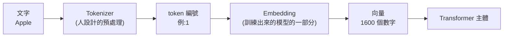
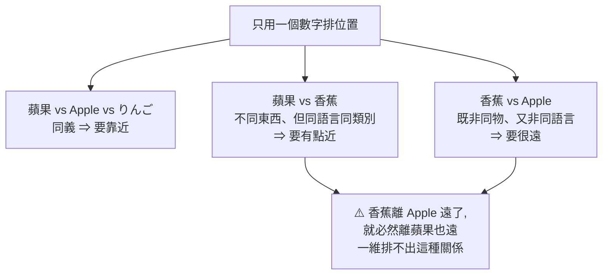
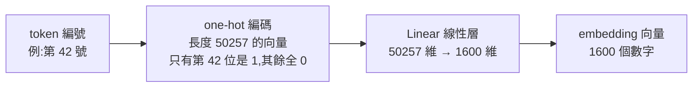
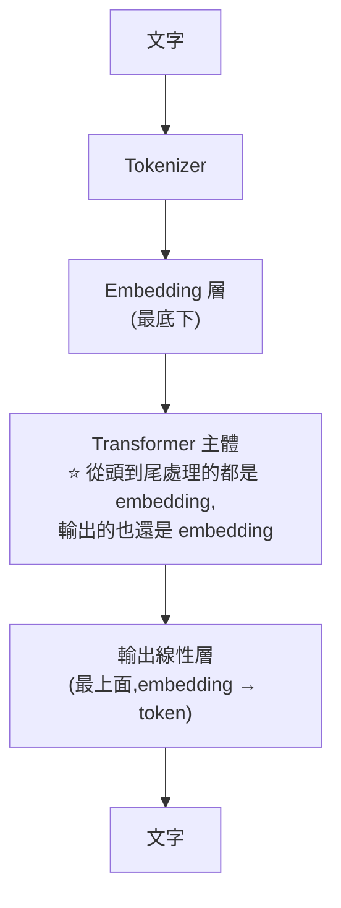
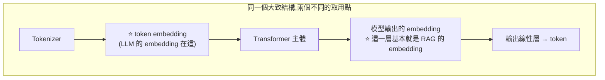
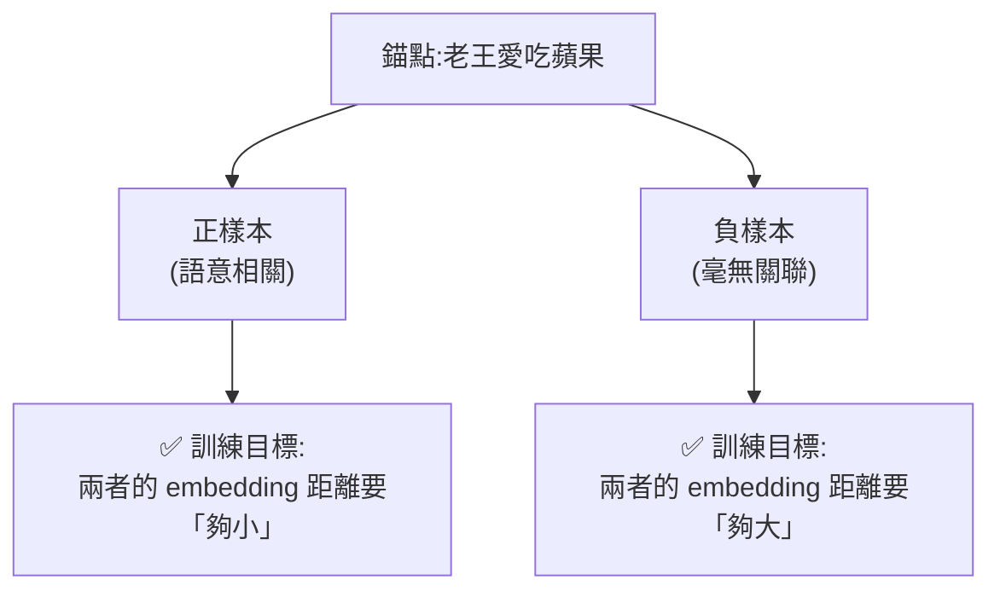

# Token 與 Embedding 的分工:為什麼 LLM 的 embedding 和 RAG 的 embedding 不是同一回事

> 整理自 YouTube 頻道 **程序员老王**〈15分钟弄懂Token和Embedding 详解LLM与RAG数据处理〉(2026-01-08,約 15 分鐘,官方 zh 字幕)。
> 依 CLAUDE.md 慣例,**另用本機 `tiktoken` 實測驗證影片提到的每一個數字與例子**,文中標出**一處影片講得太保守的地方**與**三處值得補充的現況**。

> 相關筆記:[[llm-explained-3blue1brown]]、[[microgpt-karpathy]]、[[attention-residuals]]、[[kv-cache]]、[[grep-vs-vector-agentic-search]]、[[is-graphrag-needed-rag-variants-comparison]]、[[mem0-memory-architecture-teardown]]

---

## 一句話總結

**Tokenizer 把文字換成編號、Embedding 把編號攤成向量 —— 前者是人寫的預處理,後者是訓練出來的模型的一部分。** 而 RAG 的 embedding 雖然架構跟 LLM 的 embedding 差不多,**卻是完全不同的東西:它取的是模型「輸出端」的向量,而且要用對比學習單獨訓練。**

---

## 一、Token:為什麼不直接處理文字



**理由只有一個:效率。** 電腦裡 `Apple` 是 `A`、`P`、`P`、`L`、`E` 五個離散字元。要模型先從五個字母認出「蘋果」這個概念再往下處理,不是不行,**但在算力有限的前提下太浪費**。所以給模型配一本字典,用數字代表詞。

**Token 與單詞不是一對一**:`oldest` 可以拆成「old」+「est(最高級)」。⭐ **好處是模型能理解沒見過的詞** —— `goodest` 這個字不存在,但拆成 `good` + `est` 模型就懂了。

| 名詞 | 意思 |
|---|---|
| **vocab size(詞表大小)** | 一個 tokenizer 認得的 token 總數 |
| **BPE** | tiktoken(OpenAI)用的演算法 |
| **WordPiece** | Google 用的演算法 |

> ⭐ **一個容易忽略的重點**:**轉 token 屬於資料預處理,本身不是大模型的一部分。訓練模型的時候 tokenizer 是固定不變的。** 這跟下一節的 embedding 形成明確對比。

---

## 二、⭐⭐ 實測驗證:影片的數字全對,但「中文效率差」講保守了

用本機 `tiktoken` 實跑,對照影片的每一個宣稱:

### 詞表大小 ✅ 完全正確

| 編碼 | 對應模型 | 實測 `n_vocab` | 影片說法 |
|---|---|---|---|
| `gpt2` | GPT-2 | **50,257** | 「只认识 50257 个 token」✅ **一字不差** |
| `cl100k_base` | GPT-3.5 / GPT-4 | 100,277 | (未提) |
| `o200k_base` | GPT-4o | **200,019** | 「增大到了 20 万」✅ **正確** |

### 拆詞例子 ✅ 完全正確

| 輸入 | GPT-2 實際拆法 |
|---|---|
| `oldest` | `['old', 'est']` ✅ **與影片舉例一模一樣** |
| `goodest` | `['good', 'est']` ✅ **與影片舉例一模一樣** |
| `Apple` | `['Apple']`(1 個 token)✅ |

### ⭐ 但中文這段,影片講得太保守了

影片說 GPT-2 詞表太小,所以「**多数中文都是一个字对应一个 token**,甚至有些不常见的字要好几个 token」。

**實測結果比這更慘:**

| 輸入 | GPT-2 | GPT-4o(o200k) | 效率差 |
|---|---|---|---|
| `苹果` | **6 tokens** | **1 token** | **6×** |
| `香蕉` | **6 tokens** | **1 token** | **6×** |
| `老王爱吃苹果` | **14 tokens** | **5 tokens** | **2.8×** |
| `锕`(生僻字) | 3 tokens | 2 tokens | — |

⭐⭐ **關鍵補正:在 GPT-2 下,「苹果」不是 2 個 token,是 6 個 —— 連最常見的中文字都是一個字吃掉 3 個 token。**

**原因是 GPT-2 的 BPE 是 byte-level 的**:一個中文字在 UTF-8 裡佔 **3 個 byte**,而詞表裡沒有這個字的合併規則時,**三個 byte 就各自成為一個 token**。所以:

```
「多数中文一个字对应一个 token」  ← 影片的說法,偏樂觀
「常见中文一个字就要 3 个 token」  ← 實測,而且是常態不是例外
```

⭐ **反過來看 GPT-4o 就很驚人**:`苹果`、`香蕉` 各自**整個詞只佔 1 個 token** —— 不只是「一字一 token」,而是**詞表真的收進了中文詞彙**。影片說「基本囊括了所有的中文单词」,實測支持這個說法。

> ⚠️ **這件事有直接的金錢意義**:API 按 token 計價,同一段中文在舊模型上可能是新模型的 **2.8 倍成本**。挑模型時「中文 token 效率」是一個容易被忽略但很實在的成本項。
> 這也連到 [[token-saving-three-moves-context-control]] 的主題:**省 token 除了砍 context,選對 tokenizer 也是一層。**

---

## 三、Embedding:為什麼一個數字不夠用

### 出發點:模型是連續函數

大模型可以近似看成一個**超級複雜的連續函數**,token 是輸入、回覆是輸出。**連續性天然決定了:輸入的數值靠得近,輸出通常也會靠得近。**

於是有個誘人的想法:**「老王愛吃蘋果」「老王愛吃 Apple」「老王愛吃りんご」意思相同,如果讓「蘋果 / Apple / りんご」對應的數字彼此靠近,模型天生就會輸出相似的東西 —— 訓練時能省不少算力。**

### ⭐ 但一個維度表達不了「既近又遠」



**解法:既然一個數不夠,就多用幾個。**

把 token 再轉換成一個**多維向量**,每個數字代表某種特徵。用影片的簡化示意(語言 / 形狀 / 顏色 / 類別):

| 詞 | 語言 | 形狀 | 顏色 | 類別 | 向量 |
|---|---|---|---|---|---|
| 蘋果 | 中文 | 圓 | 紅 | 水果 | `1 1 1 1` |
| りんご | 日文(近中文) | 圓 | 紅 | 水果 | `2 1 1 1` |
| Apple | 英文 | 圓 | 紅 | 水果 | `3 1 1 1` |
| 香蕉 | 中文 | 長 | 黃 | 水果 | `1 2 2 1` |

⇒ **「既近又遠」的關係就表達得出來了。這個把 token 轉成一串數字的過程就是 embedding。**

### 實際的維度數

| 模型 | embedding 維度 |
|---|---|
| GPT-2 XL | **1,600** |
| DeepSeek-R1 | **7,168** |
| Gemini 3 / GPT-5 | 未公布架構,推測**已上萬** |

> **維度越高,代表模型看世界的角度越細膩** —— 1,600 維就是從 1,600 個不同面向去描述一個詞。這個數字通常叫 **`d_model`** 或 **`n_embed`**。

### ⭐⭐ Tokenizer 與 Embedding 的本質差別

| | Tokenizer | Embedding |
|---|---|---|
| **怎麼來的** | **人設計的** —— 寫程式統計詞頻,麻煩點手工設計也行 | ⭐ **訓練出來的** |
| **是不是模型的一部分** | ❌ **不是**,是預處理,訓練時固定不動 | ✅ **是**,就是 Transformer 架構圖最底下那一塊 |
| **人看不看得懂** | 看得懂(就是編號) | ⚠️ **看不懂** |

⭐ **「看不懂」這點影片講得很誠實,值得完整記下**:

> embedding 向量有幾千幾萬個維度,還要為每個 token 合理分配這些維度的數字 —— **這顯然不是手工能完成的任務**。
> 既然是訓練出來的,**每個數字代表什麼意義就不是人工設計的了**。人類目前**無法解釋每個數字的含義**,甚至 **「是一個數字代表一個特徵,還是多個數字組合起來代表一個特徵」,人類也還沒弄清楚**。
> **我們唯一知道的就是:這麼做效果還不錯。**

> 📎 **這正是 [[j-space-global-workspace-claude]] 那類可解釋性研究要處理的問題。** 影片這段話可以當成整個 interpretability 領域的問題陳述。

---

## 四、Embedding 怎麼實作:one-hot × 線性層

假設 vocab size = 50,257、embedding 維度 = 1,600:



⭐ **重點:embedding 的實作就是「一個最最普通的線性層」,沒有任何特殊之處。**

> ⚠️ **工程實作上不會真的這樣算** —— 會用**查表(lookup)或稀疏矩陣**來做。但影片說得對:**那些屬於最佳化的範疇,本質上的數學原理是一樣的。**
>
> (道理很直觀:one-hot 向量乘上矩陣,等價於「把矩陣的第 42 列取出來」。既然結果一樣,何必真的做那一次 50257 維的乘法。)

### 出口端:再一個線性層轉回 token

embedding 之後,原本一個數字的 token 變成 1,600 個數字 —— **模型好理解了,人類卻讀不懂了**。所以大多數模型**最後會再加一個線性層**,相當於 embedding 的逆操作,把輸出的 embedding 轉回 token。



> ⭐ **補充一個影片沒提的實作細節:weight tying(權重綁定)。**
> GPT-2 這類模型的**輸出線性層與 embedding 矩陣是共享同一份權重的**(直接把 embedding 矩陣轉置來用),不是另外訓練一個獨立的矩陣。
> **這讓「逆操作」這個說法在實作上更名副其實**,同時省下一大塊參數 —— 以 50,257 × 1,600 來算,那是約 **8,000 萬個參數**,不共享的話要存兩份。

---

## 五、⭐⭐⭐ 全片最有價值的一段:RAG 的 embedding 不是 LLM 的 embedding

這是影片自己設想觀眾會「掀桌子」的地方,也是最值得記住的區分。

**觀眾的質疑**:RAG 裡的 embedding 明明是**把一整段話轉成一個向量**,不是一個 token 一個 token 轉的。

**答案:兩者確實不一樣,但有關係。**

| | **LLM 的 token embedding** | **RAG 的 embedding** |
|---|---|---|
| **作用** | 把**一個 token** 內涵的特徵**打散**成向量 | 把**一整段話**壓成一個**概括大意**的向量 |
| **在架構的哪個位置** | ⭐ **最底下**(入口) | ⭐ **最上面**(出口)—— 就是**還沒經過最後那個線性層轉回 token 的模型輸出** |
| **怎麼得到** | 訓練 LLM 時順帶就有了 | ⚠️ **必須單獨訓練** |
| **注意力遮罩** | 有 causal mask(只能看左邊) | ⭐ 一般**不做 mask** ⇒ encoder-only 架構 / BERT 那一路 |
| **後處理** | 接輸出線性層 | 一般還會做 **pooling(池化)** 之類的處理 |



⚠️ **影片特別澄清、也最容易被誤會的一句**:
> **並不是訓練一次模型就能同時得到 token embedding 和 RAG embedding。** token embedding 是訓練 LLM 的一部分;**想得到 RAG embedding 要單獨訓練** —— 只是兩者的模型結構大致相同。

### ⭐⭐ 真正的分水嶺是訓練方式

| | LLM | RAG embedding |
|---|---|---|
| **目標** | 文字接龍:預測下一個 token | **概括整段文字的含義** |
| **訓練素材** | 接龍語料<br/>(輸入「老王」→ 輸出「愛」;輸入「老王愛」→ 輸出「吃」…) | ⭐ **成對的文本片段** |
| **訓練方式** | next-token prediction | ⭐ **contrastive learning(對比學習)** |

**對比學習的做法**:



> ⭐ **影片收尾的類比很漂亮,也是整支片的論點**:
> **明明是同一種架構,換一套訓練方式,就得到完全不一樣的功能。**

---

## 六、⭐ 三處值得補充的現況(影片未提 / 已隨時間變化)

### 補充一:⚠️「RAG embedding = encoder-only / BERT」這句已經過時了

影片說 RAG embedding 一般不做 mask、屬於 encoder-only 架構(BERT 那一路)。**這在 2018–2022 是準確的描述,但現在不是主流了。**

**近年 MTEB 榜上領先的 embedding 模型,很多是拿 decoder-only 的 LLM 改造來的**(例如 E5-Mistral、gte-Qwen、NV-Embed 這一類),做法是把 causal mask 拿掉改成雙向,或乾脆保留 causal 而改用 **last-token pooling**。

⭐ **為什麼會這樣轉向?** 因為 embedding 模型的品質高度依賴**語意理解能力**,而那份能力在大規模預訓練的 decoder LLM 身上已經現成了 —— 從 BERT 規模重練不如直接借用。

> ⚠️ **但影片的核心論點反而因此更成立**:既然頂尖 embedding 模型直接拿 LLM 當底座,那「**同一種架構、換訓練方式就得到不同功能**」就不只是類比,而是字面上的實況。

### 補充二:⚠️ 影片的「正樣本」例子偏鬆,照做會訓練出錯的東西

影片用「老王愛吃蘋果」配「小王愛吃香蕉」當**正樣本**,理由是「都是描述某人愛吃什麼」。

⚠️ **這是教學簡化,實務上不能這樣配。** 這兩句的**人不同、食物也不同** —— 唯一相同的是**句型**。照這個標準訓練,模型會學成**句型相似度**而不是**語意相似度**,而檢索要的是後者。

**實務上的正樣本通常是:**

| 正樣本類型 | 例子 |
|---|---|
| **query–document 配對** | 「老王喜歡什麼水果?」↔「老王愛吃蘋果」 |
| **改寫 / 同義句** | 「老王愛吃蘋果」↔「蘋果是老王的最愛」 |
| **標題–內文** | 文章標題 ↔ 該段落 |

⭐ **判斷標準是:「如果使用者搜 A,B 該不該被撈出來?」** ——「小王愛吃香蕉」在這個標準下顯然**不該**。

### 補充三:⭐ 對比學習真正的效率關鍵是 in-batch negatives

影片只講了「一個正樣本、一個負樣本」。**實務上最關鍵的技巧是 in-batch negatives**:

```
一個 batch 有 N 個 (錨點, 正樣本) 配對
⇒ 對每個錨點,把「batch 裡其他 N-1 個正樣本」全部當成它的負樣本
⇒ 一次前向就得到 N×(N-1) 個負樣本對,幾乎不用額外成本
```

⭐ **這也解釋了一個實務現象:訓練 embedding 模型時 batch size 特別大(常見到幾千)** —— 因為 **batch 越大,負樣本越多、對比訊號越強**。這跟訓練 LLM 時大 batch 主要是為了梯度穩定,動機完全不同。

---

## 應用案例

### 案例 1|⭐ 用 tokenizer 效率反推 API 成本

實測顯示同一句中文在 GPT-2 與 GPT-4o 的 tokenizer 下差 **2.8 倍**。實際可以這樣做:

```python
import tiktoken
enc = tiktoken.get_encoding('o200k_base')   # GPT-4o
print(len(enc.encode(你的_prompt)))          # 送出前先算成本
```

⭐ **用途不只是估價**:
- **比較模型時多算一項** —— 兩個模型單價相同,但中文 token 效率差 2 倍,實際成本就差 2 倍
- **估 context window 的真實容量** —— 「128K context」對中文與對英文能裝的內容量完全不同
- ⚠️ **不同模型家族的 tokenizer 不通用** —— 用 tiktoken 算出來的數字不能直接套到 Claude 或 Gemini 上

### 案例 2|⭐⭐ 為什麼「向量檢索撈不到明明有關的東西」

有了「RAG embedding = 把一整段話壓成一個概括向量」這個認知,幾個常見的檢索失敗就有解釋了:

| 症狀 | 原因 | 對策 |
|---|---|---|
| 一段話裡有多個主題,結果哪個都搜不準 | ⚠️ **整段被壓成「一個」概括向量,多主題會互相稀釋** | 切更小的 chunk,一個 chunk 一個主題 |
| 精確的 ID、錯誤碼、函式名搜不到 | ⚠️ **embedding 抓的是「大意」,不是字面** | ⭐ **配關鍵字檢索(BM25)** |
| 換個問法就搜不到 | 訓練時的正樣本沒涵蓋這種問法 | 加**查詢改寫** |

⭐ **這正是 [[mem0-memory-architecture-teardown]] 為什麼要做「語意 + BM25 + 實體」三路混合排序,以及 [[grep-vs-vector-agentic-search]] 為什麼主張精確字串搜尋在 agent 場景常常贏過向量檢索。**

### 案例 3|自己判斷一個 embedding 模型適不適合你的資料

因為 embedding 的能力**完全來自訓練時看過的正負樣本**,選型時該問的是:

```
① 它的訓練語料涵蓋我的領域嗎?
   (通用模型對醫療/法律/程式碼的專有名詞可能分不清)
② 它的正樣本是怎麼配的?
   —— query-document 配對訓練的,才適合「問題 → 找文件」
   —— 句子相似度訓練的,適合「找相似句」,不見得適合檢索
③ 維度多少、pooling 怎麼做?
   —— 維度越高越細膩,但索引成本與記憶體也線性上升
```

⚠️ **不要只看 MTEB 排行榜的總分** —— 榜上有分領域的子項,**挑跟你的資料最像的那一欄**比看總分有用得多。

### 案例 4|把「同架構、不同訓練 = 不同功能」當成選型直覺

影片最後那個論點可以推廣成一個很省事的判斷法:

| 你要的功能 | 該找什麼訓練方式的模型 |
|---|---|
| 生成、接龍、對話 | next-token prediction(一般 LLM) |
| **檢索、找相似** | **contrastive learning(embedding 模型)** |
| **排序、判斷「這篇跟這個 query 有多相關」** | ⭐ **cross-encoder / reranker** —— 把 query 與文件**一起**餵進去,不是各自算向量 |

⭐ **第三列是很多人漏掉的一層**:reranker 因為讓 query 與文件互相看得到,精度明顯高於雙塔式的 embedding 檢索,**但沒辦法預先建索引**(每個 query 都要重算)。所以標準做法是 **embedding 粗篩幾十筆 → reranker 精排前幾筆**。

> 這跟 [[mem0-memory-architecture-teardown]] 的「先撈 `max(top_k×4, 60)` 候選再重排序」是同一個思路的兩種實作。

---

## 重點回顧(TL;DR)

1. **Tokenizer 把文字轉成編號,理由只有一個:效率。** 讓模型從 `A,P,P,L,E` 五個字母認出「蘋果」再往下處理,在算力有限下太浪費。
2. **Token 與單詞不是一對一**:`oldest` → `old` + `est`。⭐ **好處是能理解沒見過的詞** —— `goodest` 不存在,但拆成 `good`+`est` 就懂了。✅ **實測驗證兩個例子的拆法與影片完全一致。**
3. ⭐ **轉 token 是預處理,不是模型的一部分;訓練時 tokenizer 固定不動。**
4. ✅ **詞表大小實測全對**:GPT-2 = **50,257**、GPT-4o(o200k)= **200,019**。
5. ⭐⭐ **但「中文一字一 token」這句影片講保守了**:實測 GPT-2 下「苹果」是 **6 個 token**(每個中文字 3 個),因為 BPE 是 **byte-level**、一個中文字佔 3 個 UTF-8 byte。**常見字就要 3 個 token,不是例外是常態。**
6. ⭐ **GPT-4o 則收進了中文「詞」**:`苹果`、`香蕉` 各只佔 **1 個 token**。「老王爱吃苹果」GPT-2 要 **14 個**、GPT-4o 只要 **5 個** —— **成本差 2.8 倍**。
7. **一個維度表達不了「既近又遠」**:香蕉離 Apple 遠了,就必然離蘋果也遠。⇒ **改用多維向量,每個維度代表某種特徵。這就是 embedding。**
8. **實際維度**:GPT-2 XL = **1,600**、DeepSeek-R1 = **7,168**,頂尖模型推測已上萬。這個數字叫 **`d_model` / `n_embed`**,**維度越高看世界越細膩**。
9. ⭐⭐ **Tokenizer vs Embedding 的本質差別:前者是人設計的、不屬於模型;後者是訓練出來的、就是模型的一部分。**
10. ⚠️ **Embedding 的每個數字代表什麼,人類還無法解釋** —— 甚至「一個數字一個特徵、還是多個數字組合成一個特徵」都還不清楚。**「我們唯一知道的就是這麼做效果還不錯。」**
11. **實作:one-hot 編碼 + 一個最普通的線性層**(50257 維 → 1600 維)。⚠️ 工程上會用查表或稀疏矩陣最佳化,**但數學原理相同**。
12. **出口端再一個線性層把 embedding 轉回 token。** ⭐ **補充:GPT-2 這類模型其實是 weight tying —— 輸出層直接共享 embedding 矩陣的轉置**,省下約 8,000 萬參數。
13. ⭐⭐⭐ **RAG 的 embedding ≠ LLM 的 embedding**:LLM 的在**最底下(入口)**、把一個 token 的特徵**打散**;RAG 的在**最上面(出口)**、把一整段話壓成**概括大意**的向量 —— 基本就是「**還沒經過最後線性層的模型輸出**」。
14. ⚠️ **但訓練一次模型不會同時得到兩者** —— **RAG embedding 必須單獨訓練**,只是結構大致相同(不做 mask ⇒ encoder-only;最後多做 pooling)。
15. ⭐⭐ **真正的分水嶺是訓練方式**:LLM 用**文字接龍**;RAG embedding 用**對比學習** —— 正樣本要讓 embedding 距離**夠小**,負樣本要**夠大**。**同一種架構,換一套訓練方式,就得到完全不一樣的功能。**
16. ⚠️ **補充一:「RAG embedding = BERT / encoder-only」已過時** —— 近年 MTEB 領先的模型多是**拿 decoder-only LLM 改造**(去 causal mask 或改 last-token pooling)。**這反而讓影片的核心論點從類比變成字面事實。**
17. ⚠️ **補充二:影片的正樣本例子偏鬆**(「老王愛吃蘋果」配「小王愛吃香蕉」只有句型相同)。**照做會訓練出句型相似度而非語意相似度。** 實務正樣本是 **query–document 配對、改寫句、標題–內文**。
18. ⭐ **補充三:對比學習真正的效率關鍵是 in-batch negatives** —— 一個 batch 的其他樣本互當負樣本,**N 個配對一次就生出 N×(N-1) 個負樣本對**。這就是**為什麼訓練 embedding 模型的 batch size 常常大到幾千**。

---

## 來源

- [15分钟弄懂Token和Embedding 详解LLM与RAG数据处理 — 程序员老王](https://www.youtube.com/watch?v=BQveePDWavA)(2026-01-08,約 15 分鐘,官方 zh 字幕)
- **本機實測**:`tiktoken`(`gpt2` / `cl100k_base` / `o200k_base` 三個編碼的 `n_vocab` 與實際拆詞結果),用於驗證影片提到的詞表大小、`oldest`/`goodest` 拆法,以及中文的 token 消耗
- 本倉庫相關筆記:[[llm-explained-3blue1brown]]、[[microgpt-karpathy]]、[[attention-residuals]]、[[kv-cache]]、[[j-space-global-workspace-claude]]、[[grep-vs-vector-agentic-search]]、[[is-graphrag-needed-rag-variants-comparison]]、[[mem0-memory-architecture-teardown]]、[[token-saving-three-moves-context-control]]

> ⚠️ 詞表大小與模型維度以整理時的公開資訊與實測為準,模型改版後可能變動。
