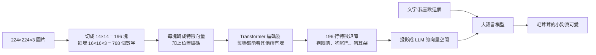

# 大模型怎麼「看懂」圖片:ViT(Vision Transformer)切塊、編碼器與多模態接法(程序员老王)

**主題分類:** 科技 / LLM 內部原理 — 架構(多模態)
**來源:** YouTube〈大模型如何看懂图片 ViT Vision Transformer〉(程序员老王,2026-05-28,約 11 分;無字幕,逐字稿以 CPU faster-whisper 轉錄、非官方字幕)
**整理日期:** 2026-10-02

> ⚠️ 作者在說明欄推廣其付費「知識星球」。本文另補上原論文的正式設定(patch embedding、位置編碼、projector),並更正影片一處像素數口誤。

---

## TL;DR

1. ⭐ 模型只會處理數字。文字先轉成 **token**;圖片若把每個像素直接餵進去,有兩個問題:**數字太多**,而且**單一像素沒有語意**(三個 0 可能是狗鼻子,也可能是黑背景)。
2. ⭐⭐ 觀察:**小圖很好認**(MNIST 28×28、CIFAR 32×32,基本模型就能 90% 以上)⇒ 那就**把大圖切成小塊**:224×224 切成 **16×16 的圖塊,共 196 塊**,每塊攤平是 16×16×3 = **768 個數字**。
3. ⭐⭐ 每塊轉成「特徵」後排成 196 行的矩陣,交給 **Transformer**——注意力讓每塊能參考其他塊:「圓的、亮的、有個黑點」+ 旁邊有黃毛和大耳朵 ⇒ **狗的眼睛**。
4. ⭐⭐ 用**編碼器**而非解碼器:解碼器只能看前面(為了文字接龍),**編碼器前後都能看**,適合「總結」——眼睛那塊要參考整張圖才知道是狗眼。
5. ⭐ 多模態大模型實際看到的是:「我喜歡這個」+ **狗眼睛、狗尾巴、狗鼻子……的特徵**,所以能回「毛茸茸的真可愛」。語音、影片也是同一套「切小塊、慢慢累積」的模式。

---

## 1. 為什麼不能直接餵像素

| 問題 | 說明 |
|---|---|
| **數字太多** | 「我喜歡這個」可能只有 3 個 token;一張 224×224 的低解析度圖就有 **50,176 個像素**,彩色再乘 3 ⇒ **150,528 個數字**。訓練與推論都極耗資源 |
| **像素沒有語意** | token「小狗」= 100,這個數字本身就代表一個概念;但像素值 (0,0,0) 只是黑點,**圖片的意義藏在大量像素的組合關係裡** |

> 📌 影片口述「將近 6 萬個像素、18 萬個數字」,實際 224×224 = 50,176 像素,×3 = 150,528;量級結論不變。

---

## 2. 切塊:把大問題變成很多小問題

- ✅ **MNIST**:28×28 手寫數字,最基本的前饋網路就能 90% 以上(本系列的 PyTorch 實作見 [[pytorch-from-zero-transformer-series]])。
- ✅ **CIFAR-10**:32×32 彩色物體圖,比 MNIST 難,但專業工程師也能輕鬆做到 90% 以上。
- ⇒ 識別難度主要來自**圖片大小**。「你圖片不是大嗎?我給你切碎了,不就小了?」



> 🔎 **原論文的正式做法**(Dosovitskiy et al.,2020〈An Image is Worth 16x16 Words〉):每塊 768 個數字先經一層**線性投影(patch embedding)**變成向量,**加上位置編碼**(否則模型不知道哪塊在哪),分類任務另加一個 `[CLS]` token。影片說「每塊放進模型跑一次」是簡化說法;單看一塊時模型只能看出「圓的、透亮、中間有黑點」這類**局部特徵**(影片也強調這些只是比喻,實際是一串數字)。

---

## 3. 為什麼用 Transformer

- **普通前饋網路**:看到眼睛那塊,能認出「圓、亮、有個點」,但**認不出是狗的眼睛**——「圓的、亮的、有個點的東西多了去了」。
- **Transformer 的注意力**:運算時不只看當前資料,還看**當前資料與其他資料的關係** ⇒ 附近有黃毛、大耳朵 ⇒ 大概率是狗眼睛;其他塊也各自變成狗尾巴、狗耳朵。
- 輸入 196 行(每行一塊的像素)⇒ 輸出仍是 196 行,但每行的特徵是**綜合整張圖**得到的,更精確。
- 注意力的詳細原理見 [[multi-head-attention-explained]]。

---

## 4. 為什麼用編碼器而不是解碼器

| | 解碼器(GPT 類 LLM) | 編碼器(ViT、BERT) |
|---|---|---|
| 關聯方向 | 每個 token **只能看前面**(因果遮罩) | **前後都能看** |
| 原因 | LLM 一字一字接龍,生成「我」的時候後面的字還不存在;訓練時也照這個方式限制 | 不需要生成,而是要**總結** |
| 適合 | 文字生成 | 理解整體:眼睛那塊要參考前後所有圖塊,才得出「狗眼睛」 |

⇒ **先把圖片切塊、再用 Transformer 編碼器辨識每塊內容 = Vision Transformer(ViT)**,是 AI 模型中最常見的圖片辨識技術。

---

## 5. 回到起點:「我喜歡這個 + 小狗圖片」

1. 圖片切成圖塊 → Transformer 編碼器 → 每塊的特徵總結。
2. 特徵總結和「我喜歡這個」**一起進入大語言模型**。
3. 多模態 LLM 看到的其實是「我喜歡這個 + 狗眼睛、狗尾巴、狗鼻子」⇒ 回答「毛茸茸的真可愛」。

> 🔎 補充(影片未細講):實務上多數開源多模態模型(如 LLaVA)會在 ViT 與 LLM 之間加一個**投影層(projector,通常是小型 MLP)**,把圖像特徵對齊到 LLM 的 embedding 空間;視覺編碼器常用 **CLIP** 以「圖文對比學習」預訓練的 ViT,所以它的特徵本來就和文字語意對齊。

> 老王:「圖片、語音、影片,背後都是切成小塊、一點點累積的模式。說不定我們自己也一樣:害怕的事、無從下手的事,或許只是因為它還連成一整塊而已。**合抱之木,生於毫末;九層之台,起於累土;千里之行,始於足下。**」

---

## 6. 應用案例

### 案例一:估算一張圖吃掉多少 token

224×224 的圖、16×16 切塊 ⇒ 196 個圖塊 token。解析度拉到 448×448 ⇒ (448/16)² = **784 個**——**解析度加倍、token 變 4 倍**。這就是為什麼多模態 API 依圖片尺寸計費,也是為什麼很多模型會先把大圖縮小或切成幾張固定大小的子圖。上傳文件截圖給 AI 前,**裁掉無關區域**比壓縮畫質更省 token、效果更好。

### 案例二:為什麼模型有時看不清小字

16×16 的一塊裡如果塞了好幾個小字,模型在「切塊」那一步就只拿到一團模糊的局部特徵。實務上:截圖時放大到字體佔滿圖塊(或只截關鍵段落),辨識率會明顯提升。

### 案例三:用 Hugging Face 跑一個 ViT 分類

```python
from transformers import pipeline

clf = pipeline("image-classification", model="google/vit-base-patch16-224")
print(clf("dog.jpg")[:3])   # 例:[{'label': 'golden retriever', 'score': 0.9...}, ...]
```

模型名稱裡的 `patch16-224` 正是本文的設定:224×224 輸入、16×16 切塊。ViT-Base 的隱藏維度剛好也是 768。

---

## 來源

- [YouTube:大模型如何看懂图片 ViT Vision Transformer(程序员老王,2026-05-28)](https://www.youtube.com/watch?v=6LLVoqhNfHc)(無字幕,逐字稿以 CPU faster-whisper 轉錄、非官方字幕)
- 論文:[An Image is Worth 16x16 Words: Transformers for Image Recognition at Scale](https://arxiv.org/abs/2010.11929)(Dosovitskiy et al.,2020)
- 論文:[Learning Transferable Visual Models From Natural Language Supervision(CLIP)](https://arxiv.org/abs/2103.00020)、[Visual Instruction Tuning(LLaVA)](https://arxiv.org/abs/2304.08485)
- 模型:[google/vit-base-patch16-224(Hugging Face)](https://huggingface.co/google/vit-base-patch16-224)

📎 相關筆記:[[pytorch-from-zero-transformer-series]]、[[multi-head-attention-explained]]、[[stable-diffusion-how-it-draws]](同作者:AI 怎麼「畫」圖)、[[llm-explained-3blue1brown]]

**Whisper 專有名詞還原對照:** 多模太大模形 → 多模態大模型;词源 → 詞元(token);潜亏/潜溃神经网络 → 前饋神經網路;Cypher 数据集 → CIFAR;编马器/编码期 → 編碼器;结码器/解研器 → 解碼器;VIT → ViT;荷包之木生于豪末、取于雷土 → 合抱之木生於毫末、起於累土。
