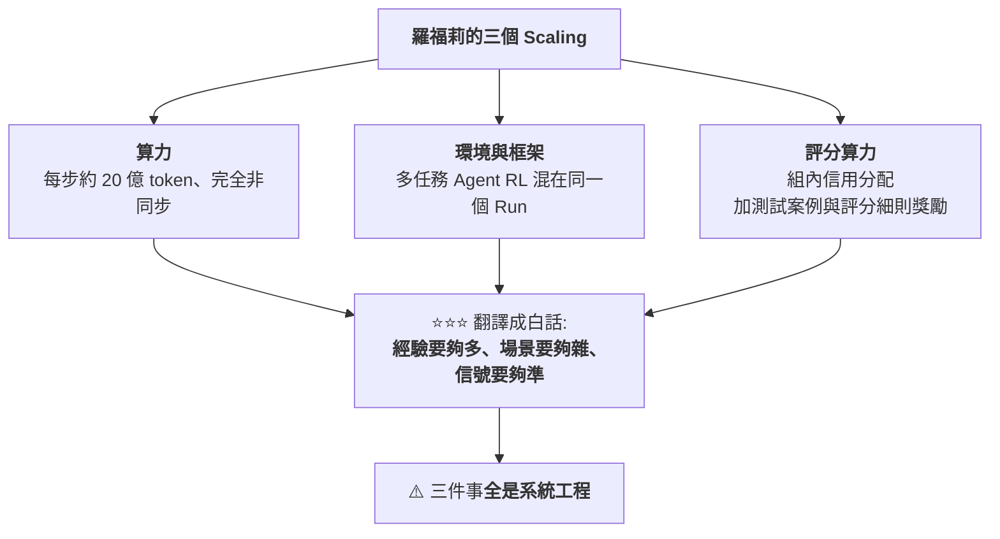
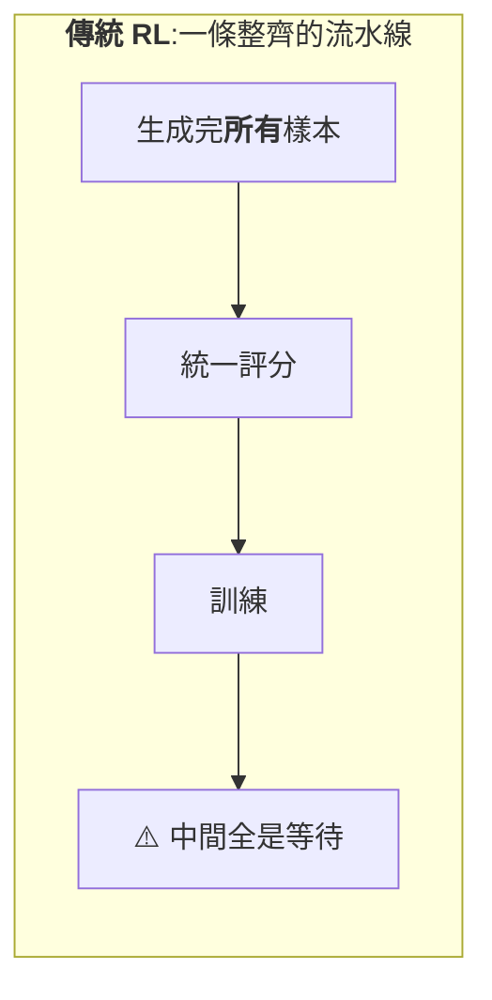
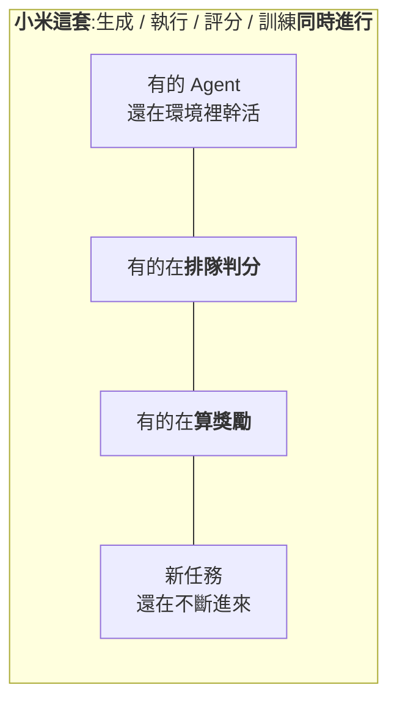
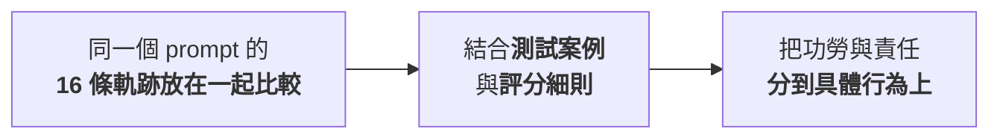

# 把訓練過程開源:小米 MiMo-V2.6 的 RL 即時儀表盤,與「RL 的主要矛盾已從演算法轉到工程」

> 整理自 YouTube 頻道 **Why QQ**〈[小米直播训练每小时烧 21 万钱花哪了?](https://www.youtube.com/watch?v=yOExQX0j19g)〉(2026-09-18,約 9.4 分鐘,官方 zh-Hans 字幕)。
>
> ⭐⭐ **本文已比對第三方報導核實**,並補上**影片沒講、但會改變結論的三件事**(見 §九):
> **① Pro 的 65.97 分其實低於所有主要對手;② 儀表盤上有一欄是「hidden」,而且正好是蒸餾相關;③ 這是 1T 級別的模型。**
>
> ⚠️ **儀表盤是即時 WebSocket 頁面,本文無法直接抓取數值** —— 文中所有儀表盤數字都是**影片錄製當下的快照**,現在去看必然不同。

---

## 一句話總結

> **開放權重見過、開放資料見過,**開放訓練過程這是頭一回**。**
>
> ⭐⭐⭐ **而它真正展示的不是「小米很有錢」,是:
> **到了萬級沙箱、億級 token 的規模,RL 的主要矛盾已經從演算法轉移到工程。****

---

## 一、⭐ 發生了什麼

| 時間 | 事件 |
|---|---|
| **2026-09-16 / 17** | **小米 MiMo 團隊負責人羅福莉發推**:「半年沉默,只研究一個問題 —— **強化學習到底能擴展到多遠**」,並貼出 `mimo.xiaomi.com/rl` |
| **兩天內** | 該推文被看了 **270 萬次** |

**點進去的人發現:小米把 **MiMo-V2.6 的強化學習訓練過程做成了一張即時儀表盤** ——
花了多少錢、跑到第幾步、獎勵曲線漲沒漲、哪台機器顯存炸了,**全部公開**。**

📌 **羅福莉:前 DeepSeek V2 核心成員,2025-11 加入小米接手 MiMo 團隊;到崗 36 天把 MiMo 從 V2 迭代到 V2.5,
2026-04 開源 V2.5 之後安靜了近半年。**

---

## 二、⭐⭐ 三個 Scaling 方向



---

## 三、💰 錢:影片錄製當下的快照

| 項目 | 數字 |
|---|---|
| **兩條線合計已花** | **187 萬美元**(Pro 128 萬、Flash 59 萬,⚠️ **數字還在跳**) |
| **開訓 36 小時** | **燒掉 108 萬美元** |
| **平均每小時** | **約 3 萬美元**(折合人民幣約 21 萬) |
| ⭐ **看一分鐘** | **約 400 元人民幣就沒了** |
| **每天** | **約 74 萬美元** |
| **兩條線各再跑 100 步** | **還要再砸 680 萬美元** |

**換算單價:**

| 線 | 每百萬 token 訓練成本 |
|---|---|
| **Pro** | **約 36 美元** |
| **Flash** | **約 8 美元** |

> ⭐ **換成推理價格還能再便宜 30 到 50 倍。**
>
> ⚠️⚠️ **記住:這只是**一次 RL 後訓練**的開銷,預訓練另算。**

📌 **⭐ 第三方核實(Forkast 2026-09-17):Pro「每天 43.2 萬美元,合每秒 5 美元」;
其他報導給的是 Pro 每天 49.3 萬、Flash 每天 24.7 萬(合計約 74 萬/天,**與影片的「每天約 74 萬美元」吻合**)。
⚠️ 數值隨時間變動,彼此有出入很正常 —— 重點是**量級一致**。**

---

## 四、⭐⭐ 錢花到哪去了(一):算力

| 項目 | 數字 |
|---|---|
| **每個訓練步處理** | ⭐ **約 20 億 token**(**已獲第三方核實**) |
| **配置** | ⭐ **1,568 個 prompt × 每個 16 條 rollout**(**已獲第三方核實**) |
| **一輪** | **2.5 萬條軌跡** |

### ⭐⭐⭐ 為什麼單步能吃掉 20 億 token

> ⚠️ **Agent 任務的 rollout **遠不止一問一答** —— 模型要在環境裡連續跑幾十輪:
> **思考 → 調工具 → 看報錯 → 再改程式碼**。**

| 儀表盤欄位 | 數值 |
|---|---|
| **平均互動輪數** | **51 到 60 輪** |
| ⭐ **平均上下文長度** | **9 萬到 13 萬 token** |

---

## 五、⭐⭐⭐ 錢花到哪去了(二):完全非同步





**⭐ 儀表盤的耗時拆分很直觀:**

| Pro 一步 | 時間 |
|---|---|
| **總計** | **2 小時 13 分** |
| **生成** | **1 小時 06 分** |
| **訓練** | **1 小時 03 分** |

> ⭐⭐⭐ **兩段時間幾乎對半開,**誰都不等誰**。
> **省下來的空轉時間,就是實打實的錢。****

---

## 六、⭐⭐⭐ `dynsam`:一個很反直覺的指標

> **同一道題模型做 16 次 ——
> **16 次全對,或 16 次全錯,這道題對訓練都沒有價值**。**

| 情況 | 為什麼沒價值 |
|---|---|
| **全對** | **太簡單** |
| **全錯** | **太難** |
| ⭐ **共同點** | **兩種情況都算不出有效的梯度信號** |

**儀表盤當下的數值:**

| 指標 | 值 |
|---|---|
| **全錯率** | **12.9%** |
| **全對率** | **26.3%** |

**動態採樣器的工作:把這批題扔掉,換新題進來,直到湊滿 **1,568 道有區分度的題** —— 這一步訓練才開始。**

> ⭐ **你在 feed 流裡看到的 `accepted 2096/1568`,就是這個湊數過程。
> **多採的五百多道,全是被丟棄的沉沒成本。****

---

## 七、⭐⭐ 錢花到哪去了(三):環境與評分

### 7.1 環境:六萬多個沙箱同時在線

| 線 | `env/active`(活躍環境數) |
|---|---|
| **Pro** | **2.2 萬** |
| **Flash** | **3.8 萬** |

**批次構成(任務類型混著來,**在同一個 Run 裡訓練**):**

| 類型 | 占比 |
|---|---|
| **程式碼** | **67.7%** |
| **視覺** | **17.2%** |
| **通用任務** | **12.1%** |
| **聊天** | **3%** |

> ⭐⭐⭐ **結論:瓶頸不在堆卡,在於**把環境、工具鏈、評分系統一起放大**。**

### 7.2 ⭐⭐ 評分:一條軌跡跑了四五十步,到終點卻失敗了,問題出在哪一步?

> **是第 12 步改錯了檔案,還是第 30 步誤讀了報錯?
> ⚠️ **只看最終結果,模型永遠不知道。****

**小米的方案叫 **Agentic In-group Credit Assignment(組內信用分配)**:**



> ⚠️ **具體演算法尚未公開**,但方向很清楚:**給「打分」這件事本身,也堆上算力。**

---

## 八、⭐⭐ 儀表盤上值得看的 18 個指標,與那個最魔幻的公告欄

### 8.1 挑幾個對工程師有用的

| 指標 | 看什麼 |
|---|---|
| `critic/rewards/mean` | **平均獎勵** |
| `pg_loss` | **策略梯度損失** —— ⭐ **與獎勵曲線配合看,就知道更新有沒有起效** |
| `entropy_loss` | **探索程度** —— ⚠️ **太低說明模型不敢試新路子了** |
| `grad_norm` | **訓練穩定性** —— ⚠️ **突然飆升往往預示要崩** |
| ⭐ `train_infer_diff` 下的 KL | **訓練引擎與推理引擎的輸出分布差** —— ⚠️⚠️ **差太大說明兩邊數值沒對齊,算出來的梯度是歪的** |
| ⭐ `partial/avg_staleness` | **超長軌跡會被切片跨步訓練,這個數記錄樣本落後了幾步**(系統用**截斷重要性採樣**校正) |

### 8.2 ⭐⭐⭐ 公告欄:別家的內部事故報告,小米直接貼出來

| 事件 |
|---|
| **一個節點顯存出問題 → 重啟** |
| **訓練叢集與評分服務之間網路斷了 → 重啟** |
| ⚠️ **Flash 線有一種基礎設施錯誤三小時沒被偵測到 → 從第 15 步重跑** |
| ⭐ **在 Pro 線的 rollout 日誌裡發現網路安全資料集出現壞模式 → 直接把該資料集下架** |

**⭐ 還有一行註釋,只有真跑過大訓練的人才寫得出來:**

> **「重啟後的第一個訓練步,批次構成反映的是**消費前的樣本池**,看資料的時候別誤讀。」**

---

## 九、⚠️⚠️ 三件影片沒講、但會改變結論的事(本文補正)

### 9.1 ⚠️⚠️⚠️ **65.97 分不是「成績還在漲」那麼樂觀 —— 它低於所有主要對手**

**影片說:「V2.6 的程式碼成績還在漲,DeepSWE 基準上 Pro 已到 **65.97**、Flash **63.86**,目前訓練還在中段。」**

**⭐ 第三方報導(Forkast)給了影片沒給的兩個座標:**

| 模型 | DeepSWE v1.1 |
|---|---|
| **GPT-6 Astra** | **74%** |
| **Claude Fable 5** | **70%** |
| **Kimi K3** | **69%** |
| **Grok 4.6** | **67%** |
| ⚠️ **MiMo-V2.6-Pro** | **65.97%** |

> ⚠️⚠️ **也就是說:Pro 目前**低於上述每一個對手**。**
> ⭐ **但同一份報導也給了另一個座標:這是**從 MiMo-V2.5 的 19% 跳上來的,47 個百分點的漲幅**。**
>
> ⭐⭐⭐ **兩個座標要一起看才公道** ——
> **「還在中段、曲線還在往上」是真的;「已經追上前沿」則還沒發生。**

### 9.2 ⚠️⚠️ **儀表盤上有一欄是 `hidden`,而且正好是蒸餾相關**

**影片說:「還有人猜,小米公開過程,**順手也堵住了蒸餾質疑的嘴**。」**

> ⚠️⚠️⚠️ **但第三方報導指出,儀表盤上 **`Claude Distill Requests: hidden`** ——
> **這一欄是隱藏的。****
>
> ⭐⭐⭐ **這正好落在質疑者最在意的那一點上。**
> **「開放訓練過程」是真的,但它**沒有**回答蒸餾質疑 —— 恰恰相反,它把這個欄位藏起來了。**

📌 **本文不對「有沒有蒸餾」做任何判斷 —— 這是雙方各執一詞、且無公開證據的爭議。
⭐ 要記住的只有一件事:**別把「透明」當成「已自證清白」**。**

### 9.3 ⭐ **這是 1T 級別的模型**

**影片全程沒提參數規模。第三方報導的標題直接寫「**1T-Class**」。**

> ⭐ **加上這個座標,§三的成本數字才讀得懂**:每小時 3 萬美元不是「小米很浮誇」,而是 **1T 級模型跑萬級沙箱 agent RL 的合理量級**。

---

## 十、⭐⭐ 社群怎麼看

| 陣營 | 論點 |
|---|---|
| ⭐ **讚賞** | **HN 該帖拿了 535 個讚**;高讚評論說**「這是極度保密行業裡罕見的透明」** |
| **分析** | **OpenAI 與 Anthropic 不敢跟** —— **訓練時長、token 量、步速全公開,競爭對手就能反推出模型規模與算力家底** |
| ⚠️ **尖銳提問** | **「邊訓練邊跑基準測試,算不算變相過擬合?」** 底下的回答是:**只要基準不進訓練資料、只做停止標準,污染有限** ——⚠️ **但「全行業都在這麼幹」不是一個好理由** |
| ⚠️ **懷疑** | ⭐ **第三方報導也記到社群對「儀表盤真實性」的懷疑,以及模型可能仍依賴外部專有模型蒸餾** |

> **頁面底部有一行小字:**`Open is what we value`。**
> ⚠️ **參照 §9.2:這句口號的說服力要打一點折扣。**

---

## 十一、⭐⭐⭐ 一個主流認知的偏差

> **過去一年,談 RL 的人都在談演算法 —— GRPO、PPO、各種變體。**
>
> ⭐⭐⭐ **但這張儀表盤展示的是另一件事:
> **到了萬級沙箱、億級 token 的規模,RL 的主要矛盾已經從演算法轉移到工程。****

| 環節 | 本質 |
|---|---|
| **環境調度** | **分散式系統問題** |
| **動態採樣** | **分散式系統問題** |
| **故障恢復** | **分散式系統問題** |
| **評分吞吐** | **分散式系統問題** |

**⭐ Reddit 上的討論印證了這個判斷(⚠️ 屬社群轉述,本文未核實原始出處):**

> **有人引用 DeepMind 研究員的觀察:**單次訓練運行的 GPU 規模超過四千卡,效率就開始打折** ——
> **瓶頸不在晶片,在系統。**
> **非同步流水線、部分軌跡切片,都是衝著這個瓶頸去的。**

📎 **這與本庫 [[deepseek-v4-engineering]] 是同一條主線的兩個切面:
⭐ 那篇是**預訓練**階段「用不夠的資源做出頂尖模型」,這篇是**RL 後訓練**階段的同一個命題。**

---

## 應用案例:如果你在開發 Agent,這套思路可以直接借用

### 案例 1|⭐⭐⭐ 給任務設計**可驗證**的獎勵,測試案例優先

> **小米的批次構成裡程式碼占 67.7%,不是因為程式碼最重要,
> 是因為 ⭐ **程式碼的反饋可執行、以秒計**。**

**可操作的做法:**

| 步驟 | 做法 |
|---|---|
| **①** | **把你的 agent 任務拆成「生成」與「驗證」兩半** |
| ⭐ **②** | **凡是驗證能寫成一支會回傳 exit code 的腳本的,優先做** |
| ⚠️ **③** | **驗證只能靠人看的部分,先別急著上 RL** —— 你會付出評分算力卻拿不到可靠信號 |

📎 **這與本庫 [[rsi-recursive-self-improvement-anthropic]] §9 的結論完全一致:
⭐⭐⭐ **反饋便宜、可驗證的領域先點火。****

### 案例 2|⭐⭐⭐ 同一任務多跑幾次,用**組內對比**提取信號

> ⚠️ **別只看單次成敗。**

```python
# 最小可行版本:同一 prompt 跑 N 次,用組內差異決定這題值不值得留
def is_informative(results, n=16):
    """判斷一道題對訓練是否有信號。

    Args:
        results: 長度為 n 的布林串列,每個元素代表該次 rollout 是否通過驗證。
        n: 每題的 rollout 次數,預設 16(對齊小米的配置)。

    Returns:
        bool: 全對或全錯都回傳 False(算不出有效梯度),其餘 True。
    """
    passed = sum(results)
    return 0 < passed < n
```

> ⭐ **小米的實測比例可以當你的基準線:全錯 12.9%、全對 26.3% ——
> **也就是約四成的題會被丟掉**。如果你的比例遠高於此,代表題庫難度分布有問題。**

### 案例 3|⭐⭐⭐ 讓 Agent 一直做「跳一跳夠得著」的題

| 情況 | 處理 |
|---|---|
| **太簡單** | ⚠️ **帶不來成長,丟掉** |
| **太難** | ⚠️ **帶不來成長,丟掉** |
| ⭐ **有區分度** | **留下** |

> ⭐⭐ **這個原則不需要你有一萬個沙箱才能用** ——
> **哪怕你只是在調一組 prompt,「同一題跑 16 次看結果散不散」都是幾分鐘就能做的診斷。**

### 案例 4|⭐ 監控指標直接照抄

> **`entropy_loss`(探索夠不夠)、`grad_norm`(穩不穩)、`train_infer_diff` 的 KL(兩邊數值對不對齊) ——
> ⭐ **這三個是自建 RL 流水線時最容易漏掉、但最早報警的。****

---

## 重點回顧(TL;DR)

1. **小米把 MiMo-V2.6 的 RL 後訓練過程做成即時儀表盤全公開** —— 開放權重、開放資料見過,**開放訓練過程是頭一回**。
2. **負責人羅福莉(前 DeepSeek V2 核心成員)半年只研究一個問題:RL 能擴展到多遠。** 三個 Scaling 方向:**算力、環境與框架、評分算力**。
3. 💰 **影片錄製當下:兩線合計 187 萬美元,每小時約 3 萬美元(人民幣約 21 萬),每天約 74 萬美元** —— ⭐ 第三方報導的每日總額與此吻合。⚠️ **這只是一次 RL 後訓練,預訓練另算。**
4. ⭐ **每步約 20 億 token = 1,568 prompt × 16 rollout**(**已獲第三方核實**);**平均互動 51–60 輪、上下文 9–13 萬 token**。
5. ⭐⭐⭐ **完全非同步**:生成 1 小時 06 分、訓練 1 小時 03 分,幾乎對半開,**誰都不等誰** —— 省下的空轉時間就是錢。
6. ⭐⭐⭐ **`dynsam` 動態採樣**:16 次全對或全錯的題**對訓練沒價值**(算不出梯度),丟掉換新題直到湊滿 1,568 道有區分度的;全錯 12.9%、全對 26.3%。
7. **六萬多個沙箱同時在線**(Pro 2.2 萬 / Flash 3.8 萬);批次構成程式碼 67.7%、視覺 17.2%、通用 12.1%、聊天 3%,**混在同一個 Run 裡訓練**。
8. ⭐⭐ **組內信用分配**:同一 prompt 的 16 條軌跡一起比,把功勞責任分到具體行為 —— ⚠️ 演算法尚未公開。
9. ⭐ **公告欄把別家的內部事故報告直接貼出來**:顯存爆、網路斷、基礎設施錯誤三小時沒被偵測到、發現壞資料集直接下架。
10. ⚠️⚠️⚠️ **本文補正一:65.97 分低於 GPT-6 Astra(74)、Claude Fable 5(70)、Kimi K3(69)、Grok 4.6(67)** —— ⭐ 但它是從 V2.5 的 19% 跳上來的,**47 個百分點**。兩個座標要一起看。
11. ⚠️⚠️⚠️ **本文補正二:儀表盤上 `Claude Distill Requests` 這一欄是 `hidden`** —— **「開放訓練過程」並沒有回答蒸餾質疑**。別把透明當成自證清白。
12. ⭐ **本文補正三:這是 1T 級別的模型**(影片全程沒提),加上這個座標成本數字才讀得懂。
13. ⭐⭐⭐ **最重要的一句:到了萬級沙箱、億級 token 的規模,RL 的主要矛盾已經從演算法轉移到工程** —— 環境調度、動態採樣、故障恢復、評分吞吐,**每一環都是分散式系統問題**。

---

## 核實狀態

### ✅ 已核實(第三方報導)

| 項目 | 結果 |
|---|---|
| **每步約 20 億 token、1,568 prompt × 16 rollout** | ⭐ **屬實** |
| **每日成本量級約 74 萬美元** | ⭐ **屬實**(Pro 約 43.2–49.3 萬 + Flash 約 24.7 萬;⚠️ 數值隨時間變動) |
| **DeepSWE Pro 65.97** | ⭐ **屬實** |
| **儀表盤確實直接顯示 trainer 日誌**(獎勵曲線、rollout 數、步耗時、運行成本) | **屬實** |
| **羅福莉在 2026-09-16/17 宣布結束沉默期** | **屬實** |

### ⭐ 本文補充(影片未提)

1. ⚠️⚠️ **65.97 低於 GPT-6 Astra / Claude Fable 5 / Kimi K3 / Grok 4.6 全部四家**,但較 V2.5 的 19% 躍升 47 個百分點。
2. ⚠️⚠️ **儀表盤上 `Claude Distill Requests: hidden`**,社群對儀表盤真實性與蒸餾亦有懷疑。
3. ⭐ **1T 級別模型。**

### ⚠️ 未能核實

- ⚠️⚠️ **儀表盤本身的即時數值本文無法直接抓取** —— 該頁為 WebSocket 即時頁面,HTTP 抓取只會拿到 `reconnecting…` 的外殼。**文中所有儀表盤數字皆為影片錄製當下的快照,且必然已經變動。**
- **成本細項**(Pro 128 萬 / Flash 59 萬、36 小時 108 萬、再跑 100 步 680 萬)、**每百萬 token 36 / 8 美元**、**推理再便宜 30–50 倍** —— 未逐項核算。
- **累積 token(Pro 349 億 / Flash 619 億)** —— ⚠️ 與第三方同期報導的 32.5 億 / 49.4 億**量級不同**,推測為單位或時點差異,**本文不採信任一方**。
- **活躍環境 2.2 萬 / 3.8 萬、批次構成百分比、動態採樣 12.9% / 26.3%、步耗時拆分、18 個指標名稱、公告欄事件** —— **僅見於影片轉述,未獨立核實。**
- **HN 535 讚與各則評論、Reddit 轉述的 DeepMind 研究員「四千卡效率打折」觀察** —— **未回溯原帖;且社群評論屬個人意見,無樣本代表性。**
- **羅福莉的個人經歷(DeepSeek V2 核心成員、36 天迭代)** —— **未獨立查證。**
- **「未來幾週逐步開源細節」** —— **屬承諾,尚未發生。**

---

## 來源

- [小米直播训练每小时烧 21 万钱花哪了? — Why QQ](https://www.youtube.com/watch?v=yOExQX0j19g)(2026-09-18,約 9.4 分鐘,官方 zh-Hans 字幕)
- ⭐⭐ **一手頁面**:[mimo-v2.6 RL 即時儀表盤 — 小米官方](https://mimo.xiaomi.com/rl/)(⚠️ **WebSocket 即時頁面,HTTP 抓取只會得到 `reconnecting…` 外殼**)
- ⭐⭐ **核實來源**:[Xiaomi MiMo-V2.6 Breaks Cover: A 1T-Class Chinese Lab Trains in Public — Forkast](https://forkast.news/xiaomi-mimo-v2-6-breaks-cover-a-1t-class-chinese-lab-trains-in-public/)(2026-09-17;**§9.1 / §9.2 / §9.3 三處補正的依據**)
- [Xiaomi livestreams MiMo-V2.6 reinforcement-learning runs — TechNode](https://technode.com/2026/09/18/xiaomi-livestreams-mimo-v2-6-reinforcement-learning-runs/)(2026-09-18)
- [Xiaomi Mimo 2.6 live post-training dashboard — Hacker News](https://news.ycombinator.com/item?id=49732270)(⚠️ **社群討論,屬個人意見,無樣本代表性**)
- 延伸:本庫 [[deepseek-v4-engineering]](預訓練階段的同一命題)、[[rsi-recursive-self-improvement-anthropic]](§9:反饋便宜、可驗證的領域先點火)、[[jalapeno-inference-benchmark-boundaries]]、[[gpt-6-astra-token-efficiency-and-harness]]、[[kv-cache]]。
