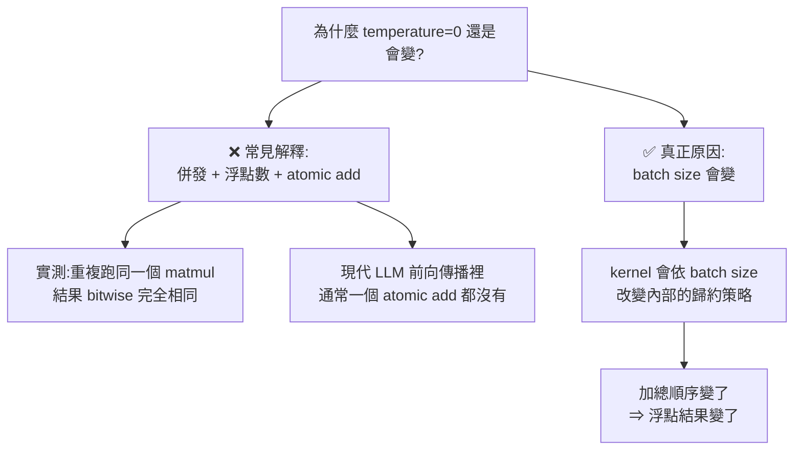
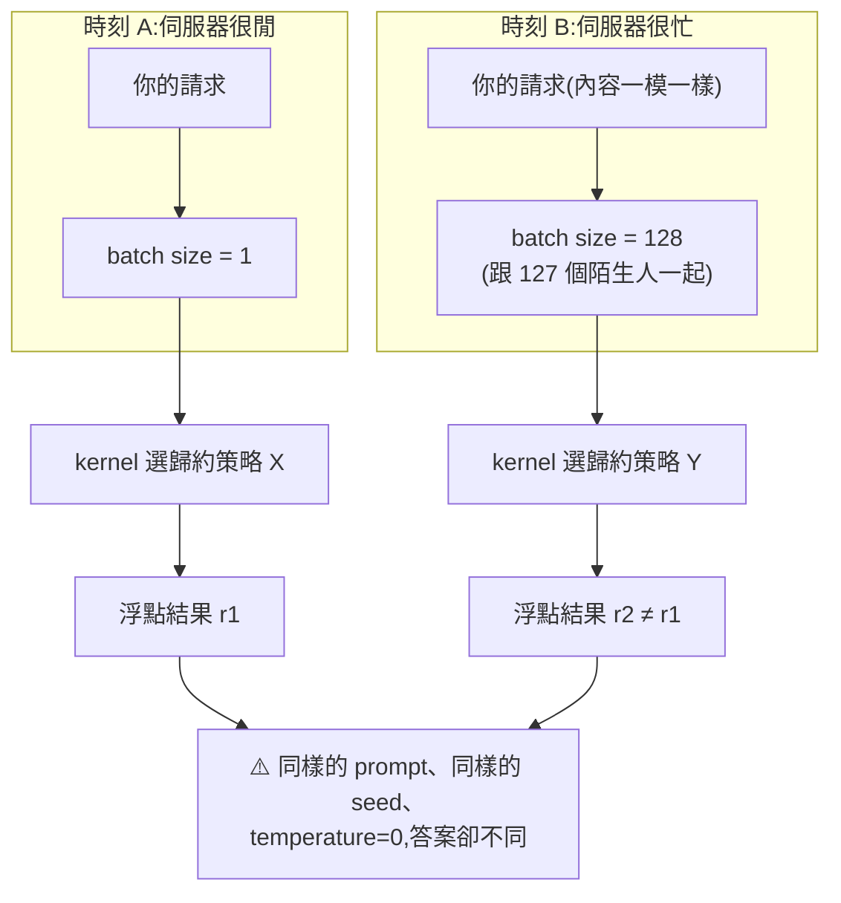
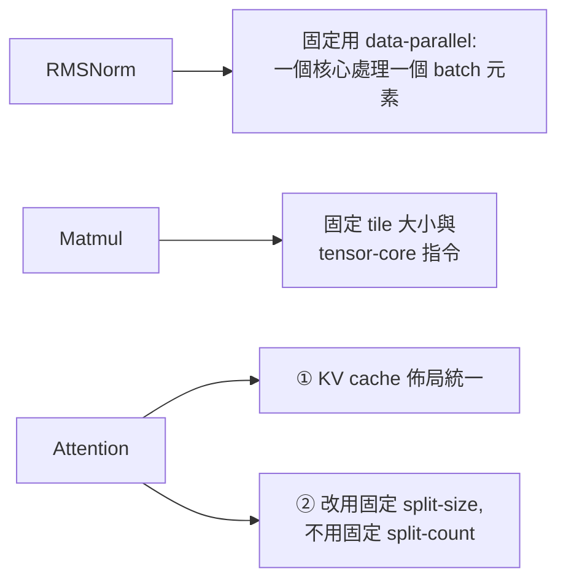
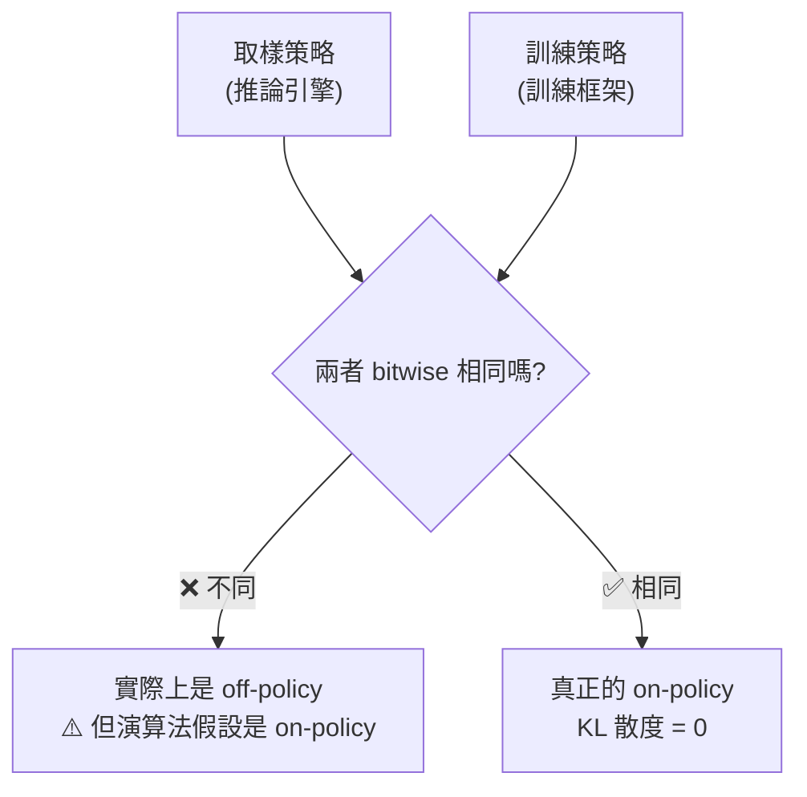

# 為什麼 temperature=0 還是每次答案不一樣:兇手是 batch size,不是浮點數

> 整理自 **Thinking Machines Lab** 部落格〈Defeating Nondeterminism in LLM Inference〉(作者 Horace He 等)。
> 配套開源實作:[`thinking-machines-lab/batch_invariant_ops`](https://github.com/thinking-machines-lab/batch_invariant_ops)(**1,064 stars,MIT**)。

> 相關筆記:[[kv-cache]]、[[attention-residuals]]、[[token-vs-embedding-llm-and-rag]]、[[microgpt-karpathy]]

---

## 一句話總結

**你設 `temperature=0` 卻拿到不同答案,不是因為「GPU 併發 + 浮點數不可重現」—— 而是因為你的請求被跟「別人的請求」湊成一個 batch,而 batch 一大一小,kernel 內部的加總順序就變了。**

⭐ **最反直覺的一點:每個 kernel 單獨看都是「同輸入同輸出」的確定性函數。不確定性來自「你的輸入不只是你的輸入」。**

---

## 一、先把最常見的錯誤解釋槍斃掉

幾乎每個人第一次問「為什麼 LLM 不可重現」時,得到的答案都是這個版本:

> 「GPU 平行計算 + 浮點數加法不符合結合律 + 原子加法(atomic add)的競態條件 ⇒ 每次加總順序不同 ⇒ 結果不同。」

**這個解釋只對了一半,而錯的那一半正是關鍵。**

| 說法 | 對不對 |
|---|---|
| 浮點數加法不符合結合律,`(a+b)+c ≠ a+(b+c)` | ✅ **對** |
| 加總順序不同會導致數值不同 | ✅ **對** |
| **LLM 的前向傳播裡到處都是 atomic add 造成競態** | ❌ **錯 —— 通常「一個都沒有」** |
| **併發本身導致不可重現** | ❌ **錯** |

⭐ **文章給的實證很乾脆:重複跑同一個矩陣乘法,結果每次都完全一樣(bitwise 相同)。** 同樣的操作、同樣的資料,即便是併發執行,**結果就是一致的**。



> ⭐ **這裡有個很重要的措辭區分:**
> - **run-to-run deterministic(逐次執行確定性)**:同樣的輸入跑兩次,結果一樣 —— **kernel 是有這個性質的**
> - **從使用者角度看的確定性**:❌ **沒有** —— 因為「輸入」悄悄地變了

---

## 二、⭐⭐ 真兇:你的結果取決於「別人的流量」

伺服器負載是隨機的。你送出請求時,系統會把當下同時到達的請求**湊成一個 batch** 一起算 —— 而 batch 裡有幾個人,**不由你決定**。



⭐⭐ **這就是整篇文章的核心洞見**:數學上,batch 裡每個元素的運算**應該是彼此獨立**的 —— 第 5 筆的結果不該受「同 batch 有幾筆」影響。**但實作不是這樣。** kernel 為了效能,會依 batch 大小切換內部策略(要不要 split reduction、tile 怎麼切),而**策略一換,加總順序就換,浮點結果就換。**

**這個性質的名字就叫 batch invariance(批次不變性)—— 而目前絕大多數 kernel 都不具備它。**

---

## 三、要改哪三個 kernel

要讓整條推論路徑 batch-invariant,得逐一處理三種 kernel。**代價都是「放棄一部分針對特定 batch size 的最佳化」。**



### ① RMSNorm

**要做的**:一律用 **data-parallel 策略**(一個核心負責一個 batch 元素),不要在 batch 變小時切換到 split-reduction。

⚠️ **代價**:batch 非常小的時候會有效能損失(因為核心閒置)。**這是刻意接受的取捨。**

### ② 矩陣乘法(Matmul)

**要做的**:**固定 tile 大小與 tensor-core 指令**,不隨 batch size 改變。

⚠️ **代價:比高度最佳化的函式庫慢約 20%。**

> 這是三者中最痛的一項 —— matmul 函式庫(cuBLAS 等)的效能很大一部分正是來自「依形狀動態挑最佳 kernel」,而那正是不變性的敵人。

### ③ Attention(⭐ 最麻煩,有兩個獨立問題)

| 問題 | 要做的 |
|---|---|
| **KV cache 佈局** | ⭐ **不管在 prefill 還是 decode 階段,佈局都要一致** |
| **長序列的切分** | ⭐ **改用固定 split-size,而不是固定 split-count** |

**第二點是關鍵,也最容易搞錯。** 兩種切法的差別:

```
固定 split-count(常見做法):把序列切成「固定 N 份」
  ⇒ 序列長度變了,每份的大小就變了
  ⇒ 加總順序跟著變 ❌

固定 split-size(不變性做法):每份「固定 K 個 token」
  ⇒ 序列多長都不影響每份的內容與加總順序
  ⇒ 不管 token 怎麼分塊,歸約順序都一樣 ✅
```

⭐ **這一點也解釋了為什麼「prefill 一次算完」和「decode 一個一個吐」會給出不同數值** —— 同一段 context,分塊方式不同,加總順序就不同。**與 [[kv-cache]] 的機制直接相關。**

---

## 四、⭐⭐ 實驗結果:80 種答案 vs 1 種

### 不確定性有多嚴重

在 **temperature = 0** 下對同一個 prompt 取樣 **1,000 次**:

| 指標 | 修正前 | 修正後 |
|---|---|---|
| **不同的完成結果數** | ⚠️ **80 種** | ⭐ **1 種** |
| **最常見那種出現幾次** | **僅 78 次**(1,000 次中) | **1,000 次** |
| **開始分歧的位置** | **全部在第 103 個 token** | — |

⭐⭐ **「1,000 次取樣、temperature=0,卻得到 80 種不同答案,而且最熱門的那種只佔 78 次」** —— 這個數字比多數人以為的嚴重得多。多數人的印象是「偶爾會不一樣」,實際上是**幾乎沒有一個答案佔優勢**。

⭐ **另一個細節很有意思:全部 1,000 次都在「第 103 個 token」才開始分歧。** 前 102 個 token 完全一致 —— 說明誤差是**慢慢累積**到某一刻才翻轉了 argmax 的結果,不是一開始就亂。

### 效能代價

| 版本 | 1,000 條序列耗時 | 相對減速 |
|---|---|---|
| 原本的 vLLM | **26 秒** | 1.0× |
| 未最佳化的確定性版本 | **55 秒** | **2.1×** |
| **加上最佳化的 attention kernel** | **42 秒** | ⭐ **1.6×** |

> ⭐ **1.6× 是個關鍵數字**:確定性不是免費的,但也沒有貴到不能用。**對需要可重現性的場景(除錯、稽核、on-policy RL)完全值得。**

---

## 五、⭐⭐⭐ 最有價值的應用:讓 on-policy RL 真的 on-policy

這是全文最有力的一段,也是「確定性」從「除錯方便」升級成「演算法正確性」的地方。

**問題**:做 RL 時,你用**推論引擎**取樣、用**訓練框架**算梯度。兩者的數值實作不同 ⇒ **取樣的策略和訓練的策略其實不是同一個策略** ⇒ **你以為在做 on-policy,實際上是 off-policy。**



**三種做法的實測結果:**

| 做法 | 結果 |
|---|---|
| **什麼都不做** | ⚠️⚠️ **訓練過程中獎勵崩潰(reward collapsed)** |
| **加 importance weighting 修正** | KL 散度維持在 **約 0.001**,但**偶爾出現尖峰** |
| ⭐ **改用確定性推論** | **KL 散度精確等於 0** —— 取樣與訓練策略 **bitwise 完全相同** |

⭐⭐ **這是整篇文章最強的論證**:
- 「什麼都不做」會**直接把訓練跑爛**,不是精度小問題
- 「importance weighting」是**打補丁** —— 平均看起來還好(0.001),但**那些尖峰正是不穩定的來源**
- 「確定性推論」是**從根源消除問題** —— 不是把散度壓小,是讓它**等於零**

> 📎 **這條線索連到 [[sdar-agentic-rl]] 那類 RL 訓練的討論:很多「RL 訓練不穩」的疑難雜症,根因可能不在演算法或超參數,而在推論與訓練的數值不一致。**

---

## 應用案例

### 案例 1|⭐ 重新理解「為什麼 API 給不出可重現的結果」

有了這個框架,幾件事就說得通了:

| 現象 | 解釋 |
|---|---|
| 設了 `temperature=0` 和 `seed` 還是會變 | ⭐ **seed 只固定取樣的隨機性,固定不了「你被跟誰湊一批」** |
| **離峰時段比尖峰時段「感覺穩定」** | batch size 波動較小 |
| 本機小模型跑起來反而穩 | 通常 batch size 固定為 1 |
| 廠商說「我們保證 run-to-run deterministic」 | ⚠️ **那句話成立,但跟你要的不是同一件事** |

⭐ **最後一列特別值得記**:廠商說的確定性是「kernel 層級、同輸入同輸出」,你要的是「**同 prompt 同輸出**」。**在共享批次的服務裡,這兩者不等價。**

### 案例 2|⚠️ 評測(eval)結果的可信度

如果一個 prompt 在 temperature=0 下能產生 80 種答案,那麼:

```
❌ 危險做法:跑一次 eval,拿分數當定論
   —— 你量到的可能有一大部分是批次噪音,不是模型能力

✅ 較穩做法:
   ① 同一組 eval 至少跑 3 次,看分數的變異範圍
   ② 比較兩個模型/兩個 prompt 時,確認差距 > 該變異範圍
   ③ 需要精確歸因時(A/B 只差一行 prompt),用確定性推論
```

⭐ **推論**:那些「改了一句 prompt,分數提升 0.5%」的結論,**如果沒報告重複執行的變異數,基本上不能採信。**

### 案例 3|除錯時把不確定性當成變因先排除

追一個「偶爾會壞」的 agent bug 時,排查順序應該是:

```
① 這個 bug 重現得出來嗎?
   —— 重現不了 → 先確認是不是推論不確定性造成的
② 換成 batch size = 1 的本機推論,還會壞嗎?
   —— 不會壞 → 高度懷疑是批次相關的數值漂移
   —— 還是會壞 → 是真的邏輯 bug,繼續往下追
```

⚠️ **不要跳過第 ②步就開始改 prompt** —— 在一個本身就會給 80 種答案的系統上做 A/B,你會把噪音當成訊號,追著幽靈改半天。

### 案例 4|什麼時候該付那 1.6× 的代價

| 場景 | 值不值得 |
|---|---|
| ⭐ **on-policy RL 訓練** | ✅ **非付不可** —— 不付的代價是獎勵崩潰 |
| **回歸測試 / CI** | ✅ 值得 —— 測試要能重現才有意義 |
| **稽核、法遵、醫療等需要可追溯的場景** | ✅ 值得 —— 「同樣輸入為何給出不同結論」是要能回答的 |
| **精確歸因的 A/B 實驗** | ✅ 值得 |
| **一般聊天 / 內容生成** | ❌ 不值得 —— 使用者不在乎 bitwise 一致,1.6× 的延遲反而有感 |

⭐ **關鍵判準:你需要的是「答案好」還是「答案一樣」?** 兩者是不同的目標,而**只有後者需要付這個錢**。

### 案例 5|這個概念可以推廣到任何共享批次的系統

「batch invariance」本質上是一個更通用的原則:

> **一筆請求的處理結果,不應該取決於它跟哪些其他請求被湊在一起。**

這在很多地方都成立:

- **批次資料處理**:一筆記錄的結果不該因為「這批有多少筆」而變
- **快取分群**:命中與否不該取決於同批次的其他 key
- ⚠️ **而違反這個原則的系統有個共同症狀:在測試環境(低負載)好好的,一上線(高負載)就出怪事** —— 因為批次大小的分布完全不同

---

## 重點回顧(TL;DR)

1. **兇手是「batch size 會變」,不是併發或浮點數。** 伺服器負載隨機 ⇒ 你的請求被跟不同數量的陌生請求湊成一批 ⇒ kernel 內部歸約策略改變 ⇒ 浮點結果改變。
2. ❌ **常見的「併發 + atomic add 競態」解釋是錯的**:現代 LLM 前向傳播裡**通常一個 atomic add 都沒有**;而且實測**重複跑同一個 matmul 結果 bitwise 完全相同**。
3. ⭐ **關鍵措辭區分**:kernel 是 **run-to-run deterministic**(同輸入同輸出)✅,但**從使用者角度看不是確定性的** ❌ —— 因為「輸入」悄悄地包含了別人的請求。
4. **Batch invariance(批次不變性)**:不論 batch 多大,單一元素的數值結果都相同。**數學上本該如此(batch 維度是獨立的),但實作為了效能違反了它。**
5. **要改三個 kernel**:①**RMSNorm** —— 固定用 data-parallel,不在小 batch 時切換策略;②**Matmul** —— 固定 tile 大小與 tensor-core 指令;③**Attention** —— 最麻煩,有兩個獨立問題。
6. ⭐ **Attention 的兩個問題**:(a) **KV cache 佈局要在 prefill 與 decode 之間保持一致**;(b) ⭐ **改用固定 split-size 而非固定 split-count** —— 後者會讓「序列長度一變,每份大小就變,加總順序就變」。
7. ⭐⭐ **不確定性有多嚴重:temperature=0、取樣 1,000 次 → 80 種不同答案,最常見的那種只出現 78 次。** 比多數人以為的嚴重得多。
8. ⭐ **全部 1,000 次都在「第 103 個 token」才開始分歧** —— 誤差是慢慢累積到某刻才翻轉 argmax,不是一開始就亂。
9. **修正後:1,000 次全部完全相同。**
10. **效能代價**:原版 vLLM 26 秒 → 未最佳化確定性版 55 秒(**2.1×**)→ 最佳化 attention kernel 後 **42 秒(1.6×)**。Matmul 那一項單獨看約慢 **20%**。
11. ⭐⭐⭐ **最有價值的應用是 on-policy RL**:取樣用推論引擎、訓練用訓練框架,**兩者數值不同 ⇒ 你以為的 on-policy 其實是 off-policy。**
12. **三種做法的實測**:什麼都不做 ⇒ ⚠️ **獎勵崩潰**;加 importance weighting ⇒ KL 約 **0.001 但偶有尖峰**;⭐ **確定性推論 ⇒ KL 精確等於 0,取樣與訓練策略 bitwise 相同。**
13. ⭐ **這讓「確定性」從「除錯方便」升級為「演算法正確性」** —— importance weighting 是打補丁把散度壓小,確定性推論是從根源讓它等於零。
14. ⚠️ **對 eval 的啟示**:一個 prompt 能產生 80 種答案 ⇒ **沒報告重複執行變異數的「提升 0.5%」結論基本上不能採信。**
15. **判斷該不該付 1.6× 的問題很簡單:你要的是「答案好」還是「答案一樣」?** 只有後者需要付這個錢 —— RL 訓練、回歸測試、稽核、精確 A/B 要付;一般聊天不用。
16. **配套實作已開源**:[`thinking-machines-lab/batch_invariant_ops`](https://github.com/thinking-machines-lab/batch_invariant_ops),**1,064 stars,MIT 授權**。

---

## 來源

- [Defeating Nondeterminism in LLM Inference — Thinking Machines Lab](https://thinkingmachines.ai/blog/defeating-nondeterminism-in-llm-inference/)(作者 Horace He 等)
- [thinking-machines-lab/batch_invariant_ops](https://github.com/thinking-machines-lab/batch_invariant_ops) —— 配套開源實作,1,064 stars,MIT 授權(星數與授權為整理時透過 GitHub API 查得)
- 本倉庫相關筆記:[[kv-cache]]、[[attention-residuals]]、[[token-vs-embedding-llm-and-rag]]、[[microgpt-karpathy]]、[[sdar-agentic-rl]]

> ⚠️ 效能數字取決於硬體、模型與推論引擎版本,文中引用的是原文的實測環境;實際落地前應在自己的環境重測。
