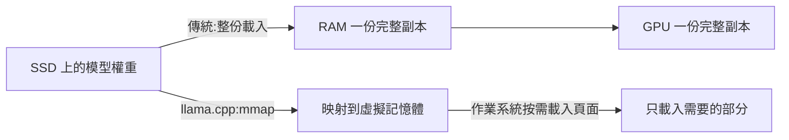
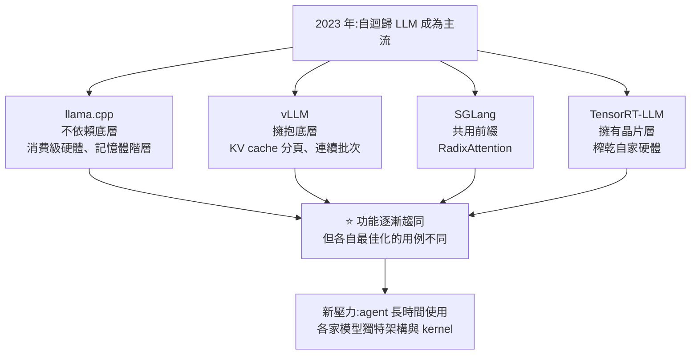

# 推論引擎為什麼有這麼多?llama.cpp、vLLM、SGLang、TensorRT-LLM 各自在解哪個問題

**主題分類:** 科技 / LLM 內部機制 — 推論(inference)
**來源:** YouTube〈Inference Engines explained in 10min..〉(Caleb Writes Code,2026-09-30,約 10.3 分;**依英文原音自動字幕整理**)
**一手素材核實:** [vLLM 論文(Kwon et al., SOSP 2023, arXiv 2309.06180)](https://arxiv.org/abs/2309.06180)、[SGLang 論文(Zheng et al., arXiv 2312.07104)](https://arxiv.org/abs/2312.07104)
**整理日期:** 2026-10-01

> ⚠️ **立場揭露:** 片中 04:12–05:05 為 **Zapier 業配**(說明欄標 `#ad #ZapierPartner`,含追蹤連結),示範用 Zapier CLI 搭配 Claude Code 做新聞掃描器;本文略過該段。
> 📎 本庫相關:[[kv-cache]](KV cache 是本文的主角之一)、[[jalapeno-inference-benchmark-boundaries]](推論跑分怎麼讀)、[[defeating-nondeterminism-batch-invariance]](批次與確定性)

---

## TL;DR

1. ⭐ **2023 年是分水嶺:** ChatGPT 推出、Meta 的 LLaMA 權重外流,**需求從「各式各樣的模型架構」轉向「自迴歸 LLM」**——推論引擎要處理的變成注意力、批次、KV cache 管理與量化。
2. ⭐⭐ **四個引擎、四個問題:**
   - **llama.cpp**:不假設模型塞得進 GPU,**善用整個記憶體階層**(GPU → CPU/RAM → SSD),在消費級硬體上跑。
   - **vLLM**:擁抱底層硬體,**管好 KV cache**(PagedAttention + 連續批次),追求多用戶吞吐量。
   - **SGLang**:**共用前綴的 KV cache**(RadixAttention),避免重複計算。
   - **TensorRT-LLM**:NVIDIA 用自家晶片與軟體堆疊**榨乾自家硬體**。
3. ⭐⭐ **它們後來功能趨同**——今天看會覺得「功能都差不多,為什麼有這麼多」;要回到**各自最初在解哪個問題**才看得懂。
4. ⭐ **新壓力:** agent 帶來**更長時間的使用**,加上 DeepSeek、Kimi、MiniMax 等各有獨特架構與 kernel 最佳化,推論引擎的瓶頸還在移動。

---

## 1. 為什麼 PyTorch 不夠

| 時期 | 推論引擎要支援的東西 |
|---|---|
| **2023 年以前** | 模型架構多元:2D 卷積、池化、反卷積、INT8 校準量化…… |
| ⭐ **2023 年以後** | **自迴歸 LLM**:注意力、**批次**、**KV cache 管理**、量化 |

- PyTorch 是通用框架,也能做推論,但**不是為自迴歸 LLM 推論最佳化的**。
- 縮放定律之後,**模型越來越大**,通用框架的推論越來越吃力。

---

## 2. llama.cpp:不假設模型塞得進 GPU

| 重點 | 說明 |
|---|---|
| **出發點** | 2023 年最早的草根行動之一:**專門處理推論**、降低 Transformer(如 LLaMA)的記憶體占用 |
| **依賴最少** | 不依賴 PyTorch;早期成果讓 **LLaMA 7B 能在手機上跑** |
| **量化** | GPTQ、AWQ 等量化方法也能在 PyTorch 裡用,但 llama.cpp 還**把推論部分從 PyTorch 剝離出來專門最佳化**,並為自己設計量化格式 |
| ⭐ **記憶體階層** | 不假設模型塞得進 GPU,**混用 GPU、CPU、RAM、SSD** |
| ⭐ **memory mapping(mmap)** | 發布後幾天就加入:**把模型映射到虛擬記憶體,讓作業系統按需把需要的頁面載入實體記憶體**,不必在 RAM 裡再放一份完整副本 |



> ⭐ 這就是今天很多人仍選 llama.cpp 的原因:**你的硬體不夠一張大 GPU 也能跑。**

---

## 3. vLLM:管好 KV cache

> llama.cpp 試圖**不依賴底層**;vLLM 則**擁抱底層**,把吞吐量榨到最大。

| 重點 | 說明 |
|---|---|
| **時間** | llama.cpp 發布約 **3 個月後**,隨論文一起推出 |
| **瞄準的部位** | llama.cpp 主要量化**權重矩陣**;vLLM 瞄準**上下文視窗**,也就是 **KV cache 在硬體上的管理** |
| **問題** | KV cache 可能跟模型權重**一樣大**;多用戶、各自輸出長度不同時,它會不規則地成長 |
| ✅ **既有系統的浪費** | 論文指出,當時的系統因**碎片化與過度預留**浪費了 **60%–80%** 的 KV cache 記憶體 |
| ⭐ **PagedAttention** | 借用**作業系統虛擬記憶體分頁**的概念,把 KV cache 存成**固定大小的小區塊**,不必排成連續空間 ⇒ 浪費降到 **4% 以下**(論文) |
| ⭐ **連續批次** | continuous / in-flight batching:**一個請求做完,馬上接下一批新請求**,不必等整批結束 |

> 📌 本文補充:兩個引擎**都從作業系統借了「虛擬記憶體」的點子**——llama.cpp 用在**權重**(mmap),vLLM 用在 **KV cache**(分頁)。

---

## 4. SGLang:共用前綴,不重算

| 重點 | 說明 |
|---|---|
| **觀察** | 用戶夠多時,**很多 prompt 有相同前綴**(例如都以「You are a helpful assistant」開頭,後面才接各自的內容) |
| ⭐ **RadixAttention** | 把常用前綴整理成**基數樹(radix tree)**:常用的前綴保留、不常用的葉節點逐漸淘汰 ⇒ **共用前綴的 KV cache 直接重用,不必每次重算** |
| ✅ **效果** | 論文回報吞吐量**最多提升 6.4 倍**——⚠️ Caleb 也強調「**這非常取決於工作負載**」(前綴重複多的 RAG、多輪對話、agent 才吃得到) |

> 📎 這跟 API 層的**提示快取**(prompt caching)是同一個概念在不同層次的實作——本庫 [[claude-sonnet-5-5-release-effort-migration]] 提到的「快取讀取只要輸入價十分之一」,背後就是這類機制。
> 📌 本文補充:vLLM 後來也加入**自動前綴快取**(Automatic Prefix Caching),這正是 §6「功能趨同」的例子。

---

## 5. TensorRT-LLM:NVIDIA 擁有整個堆疊

| 時間 | 產品 |
|---|---|
| 2017 | TensorRT |
| 數年後 | FasterTransformer |
| 2023 | **TensorRT-LLM** |

- NVIDIA **擁有基礎設施與晶片層**;別的引擎針對自己認為重要的用例最佳化,NVIDIA 則**利用下層堆疊的優勢,在自家技術上把效能推到最高**。
- 早期成果在效能與**總持有成本(TCO)**上表現強勁,讓 NVIDIA 不只是硬體供應商,也成為**推論軟體堆疊**的供應商。

---

## 6. ⭐⭐ 總結:它們後來長得越來越像



> ⭐⭐ Caleb:「**沒有脈絡地看今天的推論引擎會很困惑,因為它們提供的功能已經很像了**——但它們確實是為不同用例最佳化的。」
> 「**要理解 AI 產業,得知道瓶頸在哪裡、它們在架構上怎麼被最佳化。**」

---

## 7. 應用案例

### 案例一:我該用哪個推論引擎?

| 你的情況 | 先考慮 | 理由 |
|---|---|---|
| 筆電或單張消費級 GPU 跑開源模型、模型比 VRAM 大 | **llama.cpp**(或基於它的 Ollama、LM Studio) | 記憶體階層 + mmap + 量化格式 |
| 自架 API 服務**很多並發用戶** | **vLLM** | PagedAttention + 連續批次,吞吐量高 |
| **agent、RAG、多輪對話**,大量共用系統提示 | **SGLang**(或開啟前綴快取的 vLLM) | 前綴重用省下重算 |
| 已有 NVIDIA 資料中心 GPU、要極致延遲與 TCO | **TensorRT-LLM** | 深度綁定 NVIDIA 硬體 |

⚠️ 以上是**起點**,不是定論——各引擎功能已趨同,**用自己的工作負載實測**(見 [[jalapeno-inference-benchmark-boundaries]] 關於跑分的提醒)。

### 案例二:讓前綴快取真的命中

不管用 SGLang、vLLM 的前綴快取,還是雲端 API 的提示快取,都要**把固定內容放在最前面、變動內容放在最後面**:
```text
[系統提示(固定)] → [工具定義(固定)] → [程式庫說明(很少變)] → [對話歷史] → [本輪問題(每次不同)]
```
❌ 如果把「今天日期」或「使用者名稱」放在系統提示開頭,**每次前綴都不同,快取永遠不會命中**。

### 案例三:估算 KV cache 會不會吃爆記憶體

KV cache 大小約 ≈ `2(K 與 V)× 層數 × KV 頭數 × 每頭維度 × 序列長度 × 每個數值的位元組數 × 並發數`。
例:一個 32 層、8 個 KV 頭、每頭 128 維、FP16(2 bytes)的模型,**單一 32K token 的對話**:
`2 × 32 × 8 × 128 × 32,768 × 2 ≈ 4.3 GB`——**10 個用戶同時開長對話就是 43 GB**,這就是 vLLM 要解的問題。(詳細推導見 [[kv-cache]])

---

## 來源

- YouTube:[Inference Engines explained in 10min..](https://www.youtube.com/watch?v=_xM8scs4_x4)(Caleb Writes Code,2026-09-30;英文自動字幕;含 Zapier 業配)
- 論文:[Efficient Memory Management for Large Language Model Serving with PagedAttention(vLLM, SOSP 2023)](https://arxiv.org/abs/2309.06180)
- 論文:[SGLang: Efficient Execution of Structured Language Model Programs](https://arxiv.org/abs/2312.07104)
- 專案:[llama.cpp](https://github.com/ggml-org/llama.cpp)、[vLLM](https://github.com/vllm-project/vllm)、[SGLang](https://github.com/sgl-project/sglang)、[TensorRT-LLM](https://github.com/NVIDIA/TensorRT-LLM)
- 比較文章:[Spheron — vLLM vs SGLang 2026](https://www.spheron.network/blog/vllm-vs-sglang-2026/)
