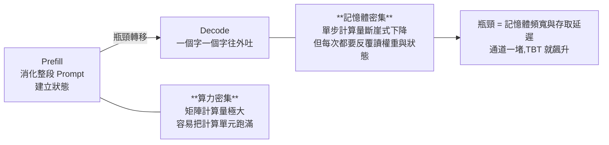

# Jalapeño 首批跑分:推理晶片的評判標準換了,以及怎麼讀廠商自己給的數字

**主題分類:** LLM 內部機制 / 推論 —— 推理晶片評測與跑分方法論
**來源影片:** YouTube〈OpenAI Jalapeño 首測拆解:AI 推理晶片的勝負,開始寫在每瓦 Token〉(Why QQ / 為什麼叫 QQ,2026-08-29,約 9.7 分鐘,**官方 zh-Hans 字幕**)
**整理日期:** 2026-09-01

> 這篇的價值有兩層:**一層是 Jalapeño 這顆晶片做了什麼**,另一層——也是更耐用的一層——
> 是**怎麼讀一份由廠商提供數據、第三方到場核驗的跑分**。後者的方法論適用於所有 AI 硬體發布。

> 📎 相關筆記:[[nvda-fy27q2-guidance-and-circular-financing]](投資視角下的同一顆晶片)、
> [[kv-cache]](本文 §4 的機制基礎)、[[defeating-nondeterminism-batch-invariance]]

---

## 0. 一句話總結

> **評判推理晶片的座標系,已經從「乘加運算頻率(TFLOPS)」換成
> 「既定功耗與延遲下的 Token 交付率」。**

對線上服務來說這套座標明顯更務實 —— 使用者感受到的從來不是 TFLOPS,
而是**首字出得快不快(TTFT)、生成卡不卡(TBT)**。

---

## 1. 這顆晶片是誰做的

| 角色 | 分工 |
|---|---|
| **OpenAI** | 架構設計 |
| **Broadcom** | 矽片實現與網路連接 |
| **Celestica** | 板卡與系統整合 |

> ⭐ 這個組合本身說明了一件事:**懂線上真實負載的模型廠**——知道哪個算子跑得慢、
> Agent 會怎麼吃上下文——**把需求提給晶片廠**,而不是反過來。

**開發週期:** OpenAI 說從初始設計到 tape-out 只用 **9 個月**;SemiAnalysis 算上團隊組建約 **16 個月**。
⚠️ 影片提醒得很好:**「最快 ASIC 週期」是 OpenAI 自己的說法,聽聽就好,不是行業審計標準。**

---

## 2. ⭐⭐ 先對齊口徑:三個容易被跳過的前提

這是全片最該內化的一段。看任何每瓦吞吐圖表之前,先確認這三件事:

### ① 700W 是額定,550W 才是實測

封裝額定功耗 **700W**,但官方強調實測持續功耗**沒超過 550W**。

⚠️ **而圖表裡的 `mixed TPS/kW` 是按 700W 歸一化計算的。**
也就是說,分母用的是額定值、分子跑的是 550W 的狀態 —— 兩者不是同一個工況。

### ② 「mixed」是輸入與輸出混算

`mixed TPS/kW` 把**輸入與輸出的 Token 處理量混在一起**。

> 它能反映系統在固定功耗下的**整體工作量**,
> **但不能直接等價於「使用者能多快看到輸出」。**
> 要看純輸出速度,得去查 InferenceX 單獨拆分的輸出吞吐指標。

### ③ 這個數字不含機架的其他部分

不包含整個機架的 **CPU、網路或散熱**,更不是資料中心的最終 **PUE**。
⚠️ **把 1.9 倍直接換算成「機房省電比例」是跨界。**

---

## 3. 三組跑分的實際數字

用 SemiAnalysis 的 **InferenceX** 框架,測試場景被嚴格限制在
**8K 輸入 / 1K 輸出、單 Token 預測(STP)、未開推測解碼、未測多輪長上下文的 AgentX 任務**。

| 對照模型 | 對手 | 每瓦吞吐 | 端到端延遲 |
|---|---|---|---|
| GPT-OSS 120B | GB200 | 85,448 vs 44,960 ≈ **1.9×** | 1.80s → **1.03s**(−43%) |
| DeepSeek R1 670B(MXFP4) | GB300 | 19,641 vs 11,781 ≈ **1.7×** | 5.99s → **1.65s**(−72.5%) |
| Kimi K2.5 1T | GB300 | 18,195 vs 11,862 ≈ **1.5×** | 5.31s → **1.56s**(−70.6%) |

第一組另有一個值得注意的指標:**最低 TBT 由 1.87ms 降到 0.69ms** ——
TBT 越低,輸出的連貫性越好。

> ⚠️ 影片對每一組都補了同一句話:**結論要停在測試邊界內。**
> 「在 8K/1K 這種特定條件下吞吐更高、等待更短」≠「所有線上業務都能無腦獲得 40% 體驗提升」。

⭐ 另外對第二、三組,OpenAI 把功勞歸於**軟硬體協同**,
但**公開數據並沒有拆解出排隊、記憶體存取或通訊各貢獻了多少** ——
結果就是結果,**工程上的因果比例還得打個問號**。

---

## 4. 設計思路:把推理拆成兩半就懂了

> 影片的比喻很到位:**前半段是集中備料,後半段變成每拧一個螺絲都得回遠處的倉庫取件。**

⚠️ **用訓練大模型的思路看,很容易只盯著 Prefill 這半程** —— 但線上請求隨後就會進入 Decode,
瓶頸馬上轉移。OpenAI 自己也強調 **Decode 極度受限於記憶體頻寬,一點微小延遲都會累積成災**。

### 破局點:KV Cache 留在本地

生成下一個 Token 時模型要查之前的「記憶」(Key/Value),**上下文越長這坨記憶越大**;
若在多張卡之間來回搬,頻寬全用來運資料,計算單元只能乾等(本倉庫 [[kv-cache]] 有機制專篇)。

**Jalapeño 的核心解法:把 KV Cache 等狀態強行留在本地,並把網路直接揉進晶片架構,
盡量讓請求留在一個互連域裡跑完。**

> ⚠️ 但影片也留了但書:**這是理想狀態;尾部延遲(P95、P99)到底穩不穩,還得看生產環境的實測。**

⭐ 一句給做基礎設施的人的總結:
**「計算單元閒著,多半是在等資料。現在的瓶頸往往不是算力不夠,而是快取與資料調度還沒落位。」**

---

## 5. ⭐⭐⭐ 這份跑分的可信度到哪裡

這是整支影片最有價值的一段,也是最該套用到其他廠商發布上的框架:

| 面向 | 實際狀況 |
|---|---|
| 第三方參與程度 | SemiAnalysis **確實進實驗室、與工程師現場一起跑** |
| 數據來源 | ⚠️ **數據仍由 OpenAI 提供** |
| 完整性 | ⚠️ **沒跑完整套件**,也**沒提供公開原始日誌** |
| 定性 | **「第三方現場核驗過的廠商成績」——目前不具備外部獨立復現的條件** |

> ⭐ 這個定性寫得非常精準,值得直接借用:
> **第三方到場 ≠ 第三方獨立測試 ≠ 可獨立復現。** 三者的可信度差很多,發布稿通常不會替你區分。

**另一個關鍵邊界:公開附錄只比了 GB200 與 GB300,並沒有帶上 2026 年秋季量產的 Vera Rubin。**
所以這組數據只代表當前切面。

---

## 6. 放進產業脈絡

**大廠都在把推理提煉出來做定制:**

| 廠商 | 路線特徵 |
|---|---|
| Google | TPU 8i,狂堆片上 SRAM |
| Microsoft | Maia 200,主打超大記憶體與乙太網互連 |
| AWS | Trainium3,卷整機互連吞吐 |

⚠️ **這幾家的測試環境完全不同,不能直接拉通排座次。**
但趨勢統一:**快取、頻寬、互連與 Serving 軟體,已經是當下推理系統的絕對核心。**

**NVIDIA 的基本盤依然穩固** —— GB200 NVL72 那個 130TB/s 通訊頻寬的液冷機架,系統工程壁壘極高。
Jalapeño 初期的主陣地會是 OpenAI 自家機房,用真實負載磨合。

### OpenAI 為什麼要自己下場造晶片

**要的是全棧控制權。** 既做模型、又寫 Serving,現在手伸到底層的記憶體與網路:
線上發現某類 Kernel 跑得慢,下一代硬體直接改;發現 Agent 任務吃等待,調度策略馬上跟進。

> ⭐⭐ **它的終極指標不再是 FLOPS,而是「每 1 美元的有用智能」** ——
> 少重試幾次、同等電力多跑幾個並發,**這才是產品側真正感知得到的帳單。**

---

## 7. 兩個容易誤讀的地方

### ① 10 GW 合作 ≠ 第一代就鋪開 10 GW

OpenAI 與 Broadcom 的「10 吉瓦加速器合作計劃」是**規劃到 2029 年底的長期目標**,
不代表 Jalapeño 第一代就已經鋪開這個產能。

> 考驗的是整條供應鏈的時間表:**晶片流片、先進封裝、液冷、機架、供電,甚至拿地建機房,缺一不可。**
> **算力戰爭早就過了「發個 PPT、造顆晶片」的階段 —— 設備能按時塞進機房並點亮,才是有效產能。**

### ② ⭐ 能效變高不等於機房省電:傑文斯效應

> **推理成本越低、速度越快,大家就越敢濫用** —— 長尾的 Agent 任務與多輪對話全冒出來,
> **總電力需求反而可能暴漲。**

**看能耗要把「單位功耗」與「暴增的總需求」放在同一個盤子裡算。**

### 附帶:AI 輔助造晶片的宣稱也有邊界

OpenAI 稱在**某些特定算子實現**上,AI 寫的程式碼比人類專家快 **1.5–1.8 倍**。
⚠️ 但這**僅限局部環節** —— 晶片驗證依然是苦力活(跑模擬、做綜合、查時序),
AI 生成一堆候選之後仍要過極嚴格的回歸測試。**閉環能不能真正縮短,還需要更多工程數據檢驗。**

---

## 8. 與官方及外電的核實

已比對 OpenAI 官方發布頁與多家外電報導。

### ✅ 影片數字與敘述準確

| 影片說法 | 核實結果 |
|---|---|
| 額定 700W、實測持續 ≤550W | **屬實**(OpenAI 官方頁與 DCD、Tom's Hardware 均載明 700W TDP) |
| 與 Broadcom 共同開發、用 SemiAnalysis InferenceX 套件 | **屬實**;InferenceX 為 SemiAnalysis 的公開 agentic 推理基準 |
| 每瓦吞吐 1.5–1.9× | **屬實** —— 官方口徑即為相對 GB200/GB300 的 **1.5–1.9×** |
| 三個對照模型 | **屬實**:GPT-OSS 120B、DeepSeek R1 670B、Kimi K2.5 1T |
| 只比 GB200/GB300、未含 Vera Rubin | **與報導一致** |
| OpenAI × Broadcom 10 GW 規劃到 2029 年底 | **屬實** —— 2025-10-13 宣布,機架自 2026 下半年起部署、**2029 年底完成** |

### ⭐ 影片未提、但值得補上的三點

1. **端到端延遲的官方區間是 1.7–3.6×**(相對 GB200/GB300),
   ⭐ 而**在高互動性負載上優勢擴大到 2.1–4.1×**。影片只給了三組個別數字,沒帶出這個區間。
2. **對手的功耗級距**:比較對象是額定 **1,200W 與 1,400W** 的加速器。
   ⚠️ 這讓「每瓦」比較的前提更清楚 —— **是 700W 級對上 1,200/1,400W 級**,不是同級對打。
3. **部署時程**:官方規劃是**2026 年底前在 OpenAI 自家基礎設施小規模部署,2027 年放量**。
   這替影片「初期主陣地是自家機房」的判斷補上了具體時間點。

⚠️ 三組跑分的**個別絕對數值**(85,448 / 44,960 等)為影片轉述,本文未逐一比對原始附錄。

---

## 9. 應用案例:讀任何 AI 硬體發布的四個提問

這套框架比 Jalapeño 本身更耐用。看到「我們比對手快 N 倍」時,依序問:

1. **分母是什麼?** 額定功耗還是實測功耗?歸一化用的是哪一個?
   (本例:圖表按 700W 歸一化,實測只跑到 550W。)
2. **指標混了什麼?** `mixed` 這類複合指標把輸入輸出混算,**不等於使用者體感速度**。
3. **測試邊界在哪?** 輸入/輸出長度、有沒有開推測解碼、有沒有測長上下文與多輪。
   (本例:8K/1K、STP、未測 AgentX。)
4. **第三方到什麼程度?** 到場核驗 / 獨立測試 / 可公開復現 —— **這三者可信度差很多。**

補一題給看能耗的人:**單位效率提升,不必然帶來總量下降**(傑文斯效應)。

---

## 來源

- [OpenAI Jalapeño 首測拆解:AI 推理晶片的勝負,開始寫在每瓦 Token — Why QQ](https://www.youtube.com/watch?v=j2I2TIvhs0c)(2026-08-29,約 9.7 分鐘,官方 zh-Hans 字幕)
- 核實用官方與外電:
  - [Jalapeño's first results show industry-leading speed and efficiency in AI inference — OpenAI](https://openai.com/index/jalapeno-first-results/)
  - [InferenceX by SemiAnalysis — Open-Source Agentic Inference Benchmark](https://inferencex.semianalysis.com/)
  - [OpenAI's 700W Jalapeño ASIC outpaces 1,400W Nvidia flagship GPU — Tom's Hardware](https://www.tomshardware.com/tech-industry/semiconductors/openai-says-its-jalapeno-chip-beats-nvidias-gb300-in-first-published-benchmarks)
  - [OpenAI details Jalapeño AI chip, with 700W TDP — DataCenterDynamics](https://www.datacenterdynamics.com/en/news/openai-details-jalape%C3%B1o-ai-chip-with-700w-tdp/)
  - [OpenAI's Jalapeño chip is built for fast inference at scale — TechCrunch](https://techcrunch.com/2026/08/25/openais-jalapeno-chip-is-built-for-fast-inference-at-scale-benchmarks-show/)
  - [OpenAI and Broadcom announce strategic collaboration to deploy 10 gigawatts of OpenAI-designed AI accelerators — OpenAI](https://openai.com/index/openai-and-broadcom-announce-strategic-collaboration/)

> ⚠️ 本文為對一支公開影片的整理與查證。§8 已標示核實狀態;
> 三組跑分的個別絕對數值未逐一比對原始附錄。Jalapeño 相關資訊變動快速,以官方發布為準。
