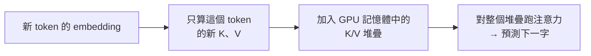
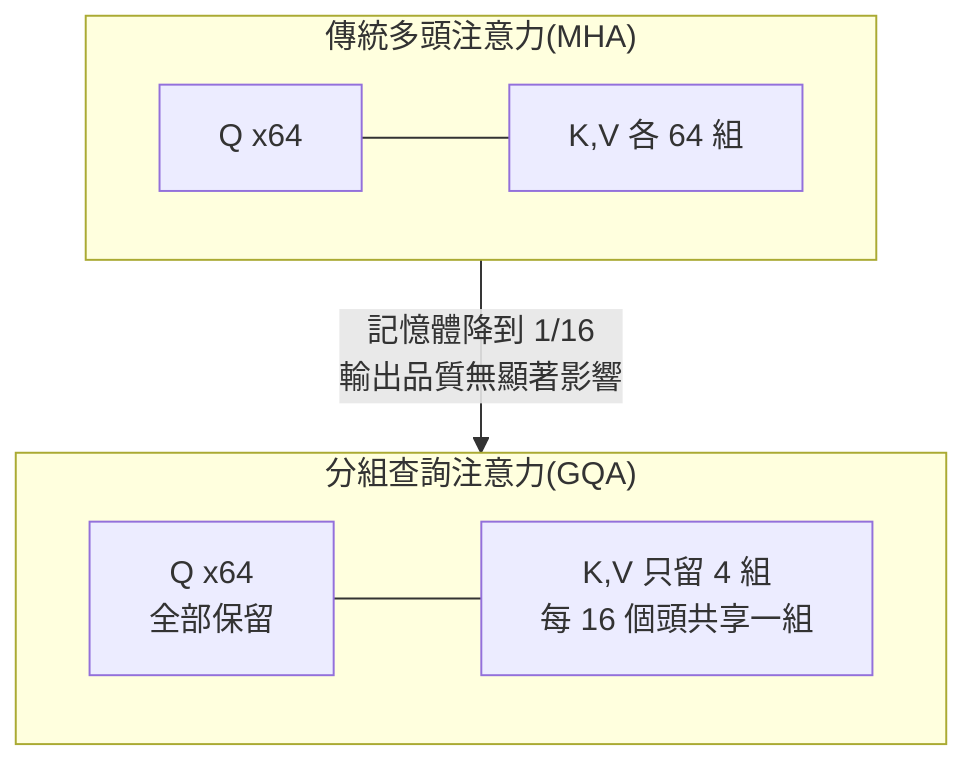
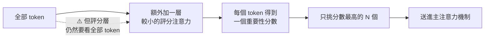
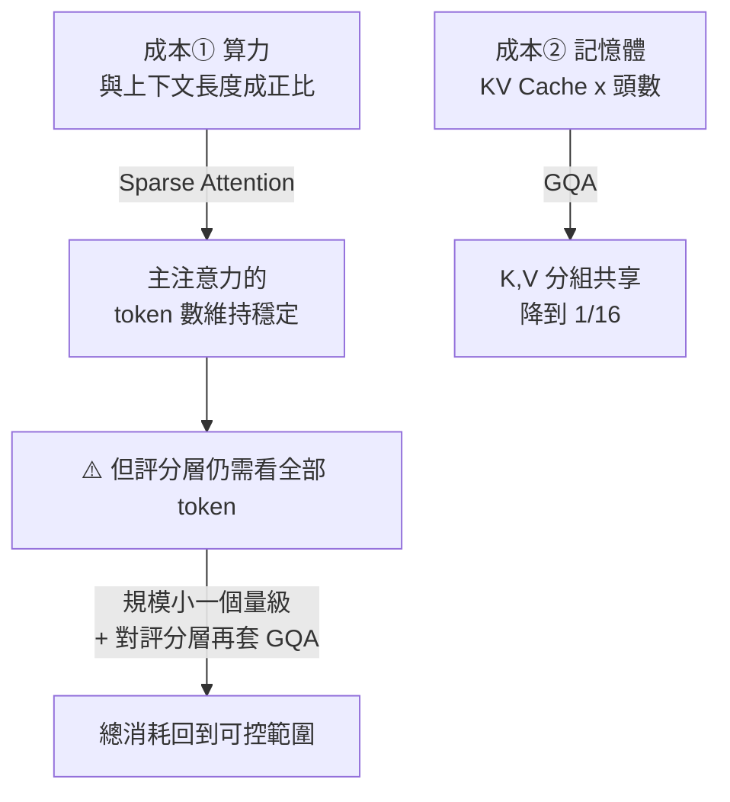

# KV Cache:每個 LLM 背後那個看不見的把戲

**主題分類:** AI / LLM 架構與推論
**來源:** YouTube 影片〈KV Cache: The Invisible Trick Behind Every LLM〉(Adam Rosler,2026-05-03,約 6.5 分;本筆記依完整逐字稿整理)
**整理日期:** 2026-05-25

---

## 1. 開場謎題

同一個 prompt、同一個模型:**第一次呼叫花 $1,第二次只花 5 美分(便宜 20 倍)**。原因是現代 AI 推論最重要的把戲之一,而它的底層概念 **比 Transformer 還老**。

---

## 2. 背景:訓練平行、推論卻是循序的

- 2017 年前,語言模型 **一個字一個字** 處理句子,訓練很慢。
- 〈Attention is all you need〉(2017)讓 **每個字能平行地看所有其他字**,訓練大幅加速。
- **但代價:推論(生成回應時)仍是循序的**——每個新字都依賴前面的字。所以推論時 Transformer 失去了它被設計出來的平行性。

---

## 3. 三個必備詞彙

1. **Token:** 文字的片段(有時整個字、有時碎片)。送 prompt 時模型先切成 tokens。
2. **Embedding:** 每個 token 轉成約 **4,000 個數字**。這些數字來自模型檔裡的一張大表(每個詞一列),值是 **預訓練** 學來的。所以對模型而言,「cat」不是文字,是 4,000 個數字。
3. **點積(dot product):** 把 embedding 想成 4,000 維空間裡的箭頭;兩箭頭點積得一個數——**對齊→大正值、垂直→0、相反→負值**。預訓練會把相關概念推到相似方向(cat≈kitten,cat≠yacht),於是「兩字多相關」就化簡成「箭頭多對齊」。(向量相似度搜尋引擎從 1970 年代就在用。)

---

## 4. 注意力機制:Key 與 Value

每個 token 從自己的 embedding 算出兩個向量,因為它扮演兩種角色:

- **Key:** 「如果你看我,我宣傳什麼」。
- **Value:** 「如果你選我,我實際貢獻什麼」。

兩者各由一個 **預訓練學到的矩陣** 乘上 embedding 得到(注意力有兩個矩陣,一個產 K、一個產 V)。拆成兩角色,讓模型能「宣傳的」與「貢獻的」不同。

**預測下一個字:** 拿新的 **query** 去和先前每個 key 做點積 → 得分數 → 用分數加權對應的 values → 加總,這個總和就是預測下一字的輸入。

> 例「the cat sat」:cat·the=0.2、cat·cat=0.8、cat·sat=0.7。

---

## 5. 隱藏成本與浪費

- 4,000 維 embedding × (4,000×4,000) 矩陣 = **1,600 萬次乘法**;模型有 **40 層**疊起來,每層各做注意力 → 光算 keys 就 **每 token 6 億次乘法**,values 同樣多 → **設定一個 token 的注意力約 20 億次運算**。
- **天真做法:** 每生成一個新 token,就把 **整段前文的 K、V 全部重算**——同樣的輸入過同樣的矩陣產同樣的輸出。到第 1,000 個 token,「the」的 key 已被重算約 1,000 次 → **數千億次相同的乘法**。

---

## 6. 解法:Memoization → KV Cache

- 這種浪費在 **1968 年** 就被注意到,Donald Michie 稱解法為 **memoization**:存下答案,別算第二次。
- 套到注意力上就是 **KV Cache**:把先前 tokens 的 K、V **存在 GPU 記憶體** 的堆疊裡。每生成一個 token 就把它的 K、V 加進堆疊;下一個 token **只算新的那一對**,再對整個堆疊跑注意力。
- **為何快取 K、V 而不是 embedding?** embedding 很便宜,貴的是把 embedding 變成 K、V 的矩陣乘法——**快取昂貴的中間產物,而非輸入**。沒有這招,生成成本大約要 **多 1,000 倍**。

---

## 7. 新瓶頸:記憶體牆(Memory Wall)

- 快取住在 GPU 記憶體,**每生成一個 token 就多一筆**。70B 模型約 **0.5 MB/token**;生成 10 萬 tokens → 背著 **50 GB** 快取;且 **每個並行使用者各有一份**。
- 1995 年 Wulf & McKee 提的 **memory wall**:**算力一直翻倍,記憶體頻寬卻沒有**。
- **結論金句:** 你的推論供應商賣的不是算力,是 **GPU 記憶體頻寬**。

---

## 8. Prompt Caching 與「順序」的省錢心法

- **Anthropic 2024 年** 讓快取能 **跨 API 呼叫重用**,稱為 **prompt caching**:送出與近期請求 **相同的前綴**,供應商就把你的 KV cache 留在 GPU 記憶體,只對它跑注意力——**免矩陣乘法、免設定成本**。第一次呼叫付錢建快取,第二次只是「租用」→ 這就是 5 美分 vs $1 的由來。
- **實務鐵則:順序很重要。**
  - 把 **穩定的東西放最前(底部)**:system prompt、工具定義、檢索到的文件。
  - 把 **使用者真正的問題放最後**。
  - 原因:**後面位置的 K/V 依賴模型對前面每個位置、每一層的處理**;只要改動前綴的任何東西,從那點往上的所有快取都 **失效**。
  - 把使用者問題放最前 → 每次請求都炸掉快取;放最後(tail-load)→ 快取免費重用。**相同 tokens、不同順序,agent 迴圈推論可便宜 10 倍。**
- **長上下文為何慢?** 不是模型「想得更用力」,而是 **快取更大**。

> 與本 repo 關聯:這解釋了 [[claude-md-12-rules]] 為何強調 token 預算、[[markdown-agent-memory]] 的「漸進式上下文披露」與 [[12-factor-agents]] 的「掌握上下文窗口」——穩定前綴 + 尾載查詢能大幅省下推論成本。

---

## 9. 應用案例:設計一個會省錢的客服機器人

**情境:** 做一個吃「公司 FAQ + 工具說明 + 使用者問題」的客服 agent,每天上萬次呼叫。

- **照「順序」排 prompt:** 把 **不變的部分放最前**——system prompt、工具定義、整份 FAQ 文件;**使用者的問題放最後**。
- **開 prompt caching:** 因為前綴(system+FAQ)每次都一樣,供應商把這段的 KV cache 留在 GPU 記憶體,**第二次起免重算**,只對「新問題」那幾十個 token 跑注意力 → 每次呼叫便宜一個量級(對應第 8 節的 5 美分 vs $1)。
- **反例(常見錯誤):** 把使用者問題或時間戳放在 **最前面** → 每次前綴都變 → **整段 cache 失效**、每次都全額重算,帳單暴增。
- **長對話/agent 迴圈:** 每多一輪 cache 變大(第 7 節),所以要主動 **修剪過時訊息**(對應 [[markdown-agent-memory]] 的「縮減」與 [[12-factor-agents]] F3「掌握上下文窗口」),避免 context 越拖越慢越貴。

> 一句話落地:**穩定前綴 + 尾載查詢 + 修剪歷史** = 同樣的模型、同樣的答案,推論成本可差 10 倍。

---

## 10. ⭐⭐⭐ 撞上記憶體牆之後:1M 上下文是怎麼做出來的(2026-09-06 增補,來源:程序員老王)

§7 停在「記憶體牆」這個壞消息。這一節補上**後續的兩級解法** ——
**GQA 砍記憶體、Sparse Attention 砍算力** —— 以及為什麼「一百萬上下文」在 2026 年變成旗艦機的門檻。

> 起點很直白:**GPT-3 時代上下文只有約 2,000;現在一個模型沒有一百萬,不敢自稱旗艦。**
> 但這不是免費的 —— **DeepSeek 的 DSA、MiniMax 的 MSA、Kimi 的架構,全都是專門為此設計的。**

### 10.1 先把兩個成本分開:算力 vs 記憶體

⚠️ 這兩件事常被混為一談,但它們的解法完全不同。

| 成本 | 從哪來 | 增長方式 |
|---|---|---|
| **① 算力** | 生成**每一個** token,都要拿最後那個 token 的 Q 去和**前面所有** K 算相關性 | ⚠️ **與輸入總長度成正比** —— 上下文 1 要 1 單位,**上下文 100 萬就要 100 萬單位** |
| **② 記憶體** | KV Cache 本身,而且**每一層、每一個注意力頭都有一份** | ⚠️ 上下文越長,要快取的 K/V 越多 |

⭐ 而 §6 的 KV Cache **只解掉了①的一部分**(不用重算舊 token 的 K/V),
**代價是直接把②變成新的瓶頸** —— 這正是 §7 記憶體牆的由來。

### 10.2 ⭐ 一個 §6 沒講清楚的細節:為什麼只快取 K 和 V,不快取 Q?

> **因為 Q 只在「生成下一個 token」時被用一次,用完就可以丟。**
>
> 以「我是老王」為例:「老王」的 Q 值只用來算出下一個字,之後永遠不會再被用到 ——
> **快取它沒有意義。**
>
> 而 K 和 V 不同:**每生成一個新 token,都要重新拿它們來比對一次。**

### 10.3 ⚠️ 多頭注意力把記憶體問題乘上幾十倍

單一注意力層只代表 token 之間的**一種**關係。但關係顯然不只一種 ——
「老王」和「我」之間可以是**指稱關係**,也可以是**主詞與受詞**的關係。

所以需要多條通路,這就是**多頭注意力**。

> ⚠️ **如今大多數大型模型有數十個注意力頭,通常 32、64 甚至更多。**
> 不做最佳化的話,**VRAM 用量與算力需求會直接翻上十倍量級** ——
> **這就是長上下文模型通常非常昂貴的原因。**

### 10.4 ⭐⭐ 第一級解法:GQA —— 砍記憶體

**觀察:** 從整體看所有注意力頭,會發現 **Q、K、V 的重要程度並不相同**。

⭐ 影片給的直覺解釋很好用:

| | 它描述什麼 | 穩不穩定 |
|---|---|---|
| **K 和 V** | **token 本身的內在屬性** ——「老王」是名詞、是受詞、是指稱對象 | ⭐ **本質上是穩定的** |
| **Q** | **這一次我們用什麼視角看這個詞** —— 是要看指稱關係,還是語法結構 | ⚠️ 每個頭、每個情境都不同 |

**所以最關鍵的參數是 Q**:即使 K 和 V 變化很小或保持不變,只要 Q 不同,
**仍然可以做到不同的頭關注不同面向。**

**具體算法:** 64 個頭原本要存 64 組 K 和 V;**分成 4 組、每組 16 個頭共享一組 KV**
⇒ **記憶體用量降到十六分之一**。

> ⚠️⚠️ **但要記住 GQA 的邊界:記憶體降了,算力一點都沒少。**
> 模型仍然要算每個頭的 Q,並用 KV 算出每個 Q 的最終結果。
> **GQA 解的是 §10.1 的成本②,成本①原封不動。**

### 10.5 ⭐⭐⭐ 第二級解法:Sparse Attention —— 砍算力

**觀察來自一個很具體的實驗:** 把 GPT-2 處理「我是老王」時**第一層的 softmax 結果**攤開來看 ——

> **絕大多數結果都非常非常接近 0%。**

⭐ 而注意力的最後一步是**加權求和**,所以:

> **把 V 乘上一個接近 0% 的數字再加進去,對最終結果的影響非常非常小。**
> **但 AI 仍然得逐一把它們算出來 —— 這是對算力的巨大浪費。**

**於是問題變成:能不能在注意力啟動之前,就把那些幾乎沒有貢獻的 token 過濾掉?**

⭐ 例:如果這群頭關注的是「人際關係」,那麼「我」「老王」得分會很高,
而「你好嗎」與問號的得分就相對低 —— **可以直接踢出去。**

### 10.6 DSA 與 MSA 的差別:逐 token vs 逐區塊

| | **DSA**(DeepSeek Sparse Attention) | **MSA**(MiniMax Sparse Attention) |
|---|---|---|
| **選什麼** | **個別 token** | ⭐ **先切成區塊再選區塊** |
| **區塊大小** | — | **128 個 token** |
| **區塊怎麼給分** | — | ⭐ **取該區塊內的最高分當作整塊的分數**(max-pool) |
| **選多少** | Top-K,**K = 2048 個位置** | ⭐ **每個 GQA 組各留 top-16 個區塊**,合計**固定 2,048 token 的預算** |

📌 **核實補充(影片未提,但很值得知道的三點):**

1. ⭐ **MSA 會強制納入「查詢所在的那個本地區塊」** —— 不論它分數高低。
   這是很合理的工程保險:**離你最近的上下文不該因為評分失準而被丟掉。**
2. ⭐⭐ **MSA 的評分分支不是憑空猜的,它被訓練過:**
   用 **KL 對齊損失**,讓索引分支的區塊分數分布,去對齊主分支**實際的注意力分布** ——
   **也就是說,選擇器學的是「精確注意力原本會想要哪些區塊」。**
3. **MSA 的結構:** 索引分支與主分支**共用同一套 GQA 骨幹**;
   索引分支為**每個 GQA 組加一個 index-query head**,再配**一個共享的 index-key head**。

> ⭐ 兩者的共同骨架是一樣的:**輕量索引器打分 → top-k 選擇 → 只對選中的部分算注意力。**
> 差別只在**顆粒度**(token vs 區塊)與**是否按 GQA 組分別選**。

📎 DeepSeek 這條線的演進(MLA → DSA → V4 的記憶體實縮)見 [[deepseek-v4-engineering]]。

### 10.7 ⚠️⚠️ 但問題並沒有消失,只是搬家了

這是影片最誠實的一段,也是最容易被跳過的:

> **主注意力的算力被控制住了,但問題轉移到了評分注意力身上 ——
> 它難道不需要接收所有 token 才能打分嗎?**
>
> **完全正確,情況確實如此。**

那為什麼還可行?

| 為什麼可控 | 說明 |
|---|---|
| **① 功能簡單得多** | 評分層**不生成後續 token**,只對現有 token 打分 |
| **② 規模小一個量級** | ⭐ **通常是主注意力的十分之一或更少** |
| **③ 可以再套一次 GQA** | 每個主注意力層都有自己的評分層 ⇒ **把這些評分層分組合併,再省一次記憶體** |

> ⭐⭐ **所以「1M 上下文」不是某一個聰明的招式,是三層疊起來的結果:**
> **KV Cache(§6)省重算 → GQA 砍記憶體 → Sparse Attention 砍算力 → 再對評分層套 GQA。**
>
> ⚠️ 而且**仍然沒有解決根本問題** —— 只是把每一層的常數壓下來。
> **相關技術遠未到極限,架構還在持續被最佳化。**

### 10.8 應用案例:這一節怎麼改變你的實務判斷

#### ① 「長上下文變便宜了」要分開看是哪一種便宜

| 廠商說的 | 實際降的是 |
|---|---|
| 「支援 1M 上下文」 | ⚠️ **只說明它跑得動,沒說它便宜** |
| 「KV cache 記憶體減少」 | **GQA 這一路** —— 影響的是你能開多少並行、多長的對話 |
| 「長上下文推論加速」 | **Sparse Attention 這一路** —— 影響的是每個 token 的延遲與單價 |

📎 §8 的 **prompt caching** 又是另一條路(跨呼叫重用),三者互不取代。

#### ② ⭐ 為什麼「塞滿 1M 上下文」仍然不是好主意

即使有 Sparse Attention,**評分層還是得看過你塞進去的每一個 token**(§10.7)。
所以:

> **你塞進去的無關內容,不會因為「反正它會被過濾掉」而免費。**
> 它至少要付一次評分的成本,而且**還在跟真正相關的內容搶那 2,048 個名額。**

⭐ 這給了 §9「修剪過時訊息」一個更硬的理由:
**不是為了省 context window 的位置,是因為雜訊會稀釋 top-k 的選擇品質。**

#### ③ 讀架構公告時該問的三個問題

1. **它砍的是記憶體還是算力?**(GQA 系 vs Sparse 系)
2. **稀疏的顆粒度是 token 還是區塊?** 區塊大 ⇒ 更省、但可能連帶拖進不相關的鄰居。
3. **選擇器是怎麼訓練的?** ⭐ MSA 用 KL 對齊主分支的真實注意力分布 ——
   **一個沒被訓練過的選擇器,就只是另一種猜。**

---

## 來源

- [YouTube:KV Cache — The Invisible Trick Behind Every LLM(Adam Rosler)](https://youtu.be/tGp6Ns9GtSU)(§1–§9)
- ⭐ [1M上下文的秘密 Sparse Attention, GQA, KV Cache — 程序員老王](https://www.youtube.com/watch?v=eorQWlYarJY)(2026-09-03,約 11.3 分鐘,**自動字幕**;§10 來源)
- §10 的核實來源:
  - [MiniMax Sparse Attention — arXiv 2606.13392](https://arxiv.org/abs/2606.13392)(MSA:128-token 區塊、每 GQA 組 top-16、固定 2,048 token 預算、強制納入本地區塊、KL 對齊損失)
  - [DeepSeek-V3.2 技術報告 — arXiv 2512.02556](https://arxiv.org/pdf/2512.02556)(DSA 與 Lightning Indexer)
  - [DeepSeek Sparse Attention — Sebastian Raschka](https://sebastianraschka.com/llm-architecture-gallery/deepseek-sparse-attention/)
  - 本倉庫相關筆記:[[deepseek-v4-engineering]]、[[attention-residuals]]、[[cs336-training-cost-napkin-math]](§6.2 也談 GQA)

> ⚠️ **§10 那支影片無官方字幕,逐字稿取自自動字幕**(轉錄中的「MX」為 **MiniMax**、「代幣」為 **token**、「水頭」為**注意力頭**)。
> §10.6 的精確規格(區塊大小、top-16、2,048 預算、KL 對齊損失、強制納入本地區塊)**為查證所得,影片未提**;
> 影片提到的「評分層約為主注意力的十分之一或更少」**未獨立核實**,以影片轉述看待。
