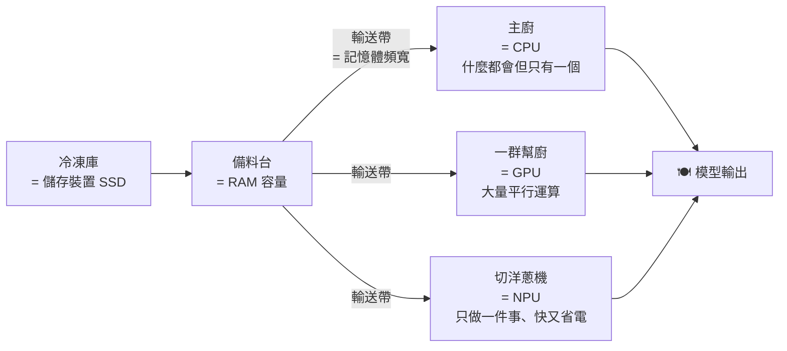

# 每一種尺寸的硬體能跑什麼本地 AI:從 32 KB 的 Arduino 到 8 張 H100

**主題分類:** 科技 / LLM 內部機制 — 推論與本地部署
**來源:** YouTube〈Every Size Local AI In 24 Minutes〉(Tina Huang,2026-09-28,約 24.4 分;**依英文原音自動字幕整理**)
**整理日期:** 2026-10-02

> ⚠️ **立場揭露:** 約 12:00–13:20 為 **Crusoe Intelligence Foundry 業配**(無伺服器推論與微調平台,附註冊送 5 美元連結);說明欄另有作者的付費訓練營、多個**聯盟連結**(作者自己註明部分為 affiliate)。本文略過業配段。
> ⚠️ 片中各裝置「能跑哪些模型」的總結投影片沒有出現在字幕裡;本文只整理口述內容,**模型清單以作者示範為準,未逐一實測**。

---

## TL;DR

1. ⭐ **按記憶體分成五級:** 晶片(MCU)→ 迷你電腦(樹莓派、手機)→ 個人電腦(筆電)→ 家用伺服器(Mac Studio、AMD 128 GB 機)→ 獨立 GPU(RTX 4090、8×H100)。
2. ⭐⭐⭐ **最重要的一課:容量(RAM 多大)≠ 速度。** 樹莓派 5 和 iPhone 16 都是 8 GB,表現卻天差地別——差在**頻寬**(記憶體到運算單元的輸送帶有多寬)和**有沒有能用的 GPU / NPU**。
3. ⭐⭐ **廚房比喻:** 儲存 = 冷凍庫、RAM = 備料台、記憶體匯流排 = 輸送帶、CPU = 主廚、GPU = 一群幫廚、NPU = 只會切洋蔥的專用機器。**多數 LLM 卡在輸送帶**;**圖片、影片、音樂生成卡在幫廚人數**(算力)。
4. ⭐⭐ **粗估公式:** 可用 RAM ≈ 標示 RAM × 0.75;**能跑的參數量(B)≈ 可用 RAM(GB)÷ 0.6**。例:32 GB → 24 GB 可用 → 約 40B。(📌 這相當於假設 **約 4-bit 量化**)
5. ⭐ **取捨:** AMD 128 GB 機**容量大、頻寬小**(大模型跑得進但慢);RTX 4090 **頻寬大、容量小**(只有 24 GB,快但塞不進大模型);**8×H100 兩者都有**,但要租、很貴。

---

## 1. 五個等級總覽

| 等級 | 示範裝置 | 記憶體 | 能做什麼(作者示範) | 卡在哪 |
|---|---|---|---|---|
| **晶片(MCU)** | Arduino Uno R4 | **32 KB** | ❌ 什麼模型都塞不進;但有 Wi-Fi,**可以呼叫其他裝置上的模型** | 容量 |
| | ESP32-S3 | 8 MB | ✅ **TinyStories**(260K、數 MB 級)——只會接龍寫故事,不能對話 | 容量 |
| **迷你電腦** | 樹莓派 5 | 8 GB | ✅ 語音助理(Whisper → Qwen3 1.7B → Piper 語音合成)、Moondream 看圖說話;❌ 圖片生成**慢到不可用** | 頻寬、沒有可用於 AI 的 GPU |
| | iPhone 16 | 8 GB | ✅ 小型視覺語言模型(Google AI Edge Gallery)、SD 1.5 生圖(Draw Things)、Whisper Large、**YOLO 物件偵測**(Ultralytics) | iOS 限制單一 app 可用記憶體 |
| **個人電腦** | MacBook Pro 32 GB | 32 GB | ✅ **幾乎所有類別**:LLM、程式模型、視覺、生圖、影片、語音、音樂;例:Qwen3 14B–32B、Qwen3 Coder 30B + OpenCode、Flux Dev | 大模型與影片速度 |
| **家用伺服器** | Mac Studio | 64 GB | ✅ 27–32B 級 LLM、大型程式/生圖/音樂模型;中階影片生成(Wan 2.2)**很慢** | 頻寬 |
| | AMD Ryzen AI「Halo」機 | 128 GB(約 96 GB 可用) | ✅ **70B 級**(Llama 3.3 70B)、**GPT-OSS 120B**;⭐ **同時載入多個模型** | ⚠️ **頻寬小**,生成類很慢 |
| **獨立 GPU** | RTX 4090(租用) | 24 GB VRAM | ✅ 圖片、影片生成**非常快** | ⚠️ **容量小** |
| | 8×H100(租用) | 640 GB | ✅ 700B+ 級 LLM、480B+ 程式模型、分鐘級影片生成 | 💸 錢 |

> ⭐ 作者強調**偵測模型(YOLO 這類)很少被討論但非常實用**——臉部辨識、自駕車的物件辨識都靠它。

---

## 2. ⭐⭐⭐ 硬體一課:廚房比喻



| 你遇到的狀況 | 瓶頸 | 比喻 |
|---|---|---|
| **LLM 回答很慢** | ⭐ **記憶體頻寬**——每產生一個 token 都要把權重從記憶體搬給運算單元 | **輸送帶太窄** |
| **生圖、影片、音樂很慢或跑不動** | **算力**(GPU) | **幫廚不夠** |
| **模型根本載不進去** | **容量** | **備料台太小** |

**用這個比喻解釋樹莓派 vs iPhone(都是 8 GB):**
- 樹莓派:輸送帶**窄**,而且只有主廚一個人做事 ⇒ LLM 慢、**不能實際生圖**。
- iPhone:有 CPU、GPU、NPU,輸送帶較寬 ⇒ 快,還能生圖。

📌 **本文補充:** 樹莓派 5 其實有 GPU(VideoCore VII),但主要用於顯示與影像處理,**一般 AI 框架無法拿它加速**,所以作者說「沒有 GPU」在 AI 情境下大致成立。作者也承認這個比喻**簡化了**,沒談 VRAM、統一記憶體等概念。

### 為什麼加一張獨立 GPU 這麼有用

> 「一張 GPU 不只是幫廚——它是**一整組**:幫廚**加上自己的私人備料台(VRAM)和一條很寬的專屬輸送帶**。」

- 筆電、Mac、迷你主機**無法加裝 GPU**;遊戲桌機可以。
- RTX 4090:**頻寬大但只有 24 GB** ⇒ 生成類飛快,大語言模型塞不進。
- AMD 128 GB 機正好相反:**容量大、頻寬小**。
- 8×H100:**容量與頻寬兼得**——「這是租的,每分鐘都在燒錢。」

📎 本庫 [[rtx-spark-gb10-soc]] 談 NVIDIA 統一記憶體小主機,正是想同時解決容量與頻寬的產品;推論引擎怎麼在有限記憶體上跑模型,見 [[inference-engines-llamacpp-vllm-sglang-tensorrt]]。

---

## 3. ⭐⭐ 粗估公式:我的電腦能跑多大的模型?

```text
可用 RAM(GB)= 標示 RAM × 0.75        ← 約 25% 被系統與其他程式占用
可跑參數量(B)≈ 可用 RAM ÷ 0.6
```

| 標示 RAM | 可用 | 約可跑 |
|---|---|---|
| 8 GB | 6 GB | ~10B |
| 16 GB | 12 GB | ~20B |
| 32 GB | 24 GB | **~40B**(作者的 MacBook Pro) |
| 64 GB | 48 GB | ~80B(片中小測驗:Mac Studio) |
| 128 GB(AMD 機,作者說約 96 GB 可用) | 96 GB | ~160B |

📌 **本文補充:這個公式的隱含假設**
- 「每 10 億參數約 0.6 GB」≈ **4-bit 量化**(每個參數 0.5 位元組)**加上一點額外開銷**。
- 用 **8-bit** 量化要大約翻倍、**FP16** 約四倍。
- 還沒算 **KV cache**:長對話、長上下文會額外吃記憶體(見 [[kv-cache]])。
- ⇒ 當成「**能不能塞進去**」的第一步篩選,實際還要看量化格式與上下文長度。

> 作者也說:「當然,你也可以直接問你最喜歡的 AI 聊天機器人:這台機器能跑什麼模型?」

---

## 4. 有趣的組合玩法

| 玩法 | 做法 |
|---|---|
| **Arduino 也能用 AI** | 自己跑不了模型,但透過 Wi-Fi **呼叫 Mac Studio 上的 Qwen 模型**,在小螢幕顯示鼓勵訊息 |
| **樹莓派語音助理** | **語音轉文字(Whisper)→ 小型 LLM → 文字轉語音(Piper)**三個模型串起來;再接 webcam + Moondream 看圖說話 |
| **家用伺服器當全家的 AI 主機** | 永遠開著(筆電闔上就停),其他裝置都連過來用 |
| **大記憶體機同時跑多個模型** | 程式 agent、LLM、生圖同時載入,不必來回切換 |

---

## 5. 應用案例

### 案例一:我手上有一台 16 GB 筆電,能做什麼?

1. 用公式:16 × 0.75 = 12 GB → 約 **20B** 參數(4-bit 量化)。
2. 實務建議:先試 **7B–14B** 的 4-bit 模型(留空間給上下文與其他程式)。
3. 想生圖:選小型模型(如 SD 1.5 等級);要快就別期待影片生成。

### 案例二:要買一台本地 AI 機器,先問自己主要做什麼

| 主要用途 | 優先看 | 例子 |
|---|---|---|
| **跑大語言模型(70B 以上)** | **容量**(統一記憶體越大越好) | 大記憶體 Mac、AMD 128 GB 機 |
| **生圖、影片、音樂** | **算力 + 頻寬**(獨立 GPU) | 遊戲桌機 + RTX 顯卡 |
| **全天候家用 agent** | 低功耗、永遠開機 | Mac mini / Mac Studio 級 |
| **偶爾跑超大模型或實驗** | **租用**,不要買 | 雲端 GPU 按小時計費 |

### 案例三:低成本做一個離線語音助理

樹莓派 5 + USB 麥克風 + 喇叭:
`Whisper(小型)→ Qwen3 1.7B 這類小模型 → Piper TTS`
⚠️ 預期回應會有明顯延遲;要更快就把 LLM 放到家裡另一台有 GPU 或大頻寬的機器上,樹莓派只負責收音與播放。

---

## 來源

- YouTube:[Every Size Local AI In 24 Minutes](https://www.youtube.com/watch?v=rPGJhrunbxo)(Tina Huang,2026-09-28;英文自動字幕;含 Crusoe 業配與聯盟連結)
- 片中工具與模型:[TinyStories(論文)](https://arxiv.org/abs/2305.07759)、[Whisper](https://github.com/openai/whisper)、[Piper TTS](https://github.com/rhasspy/piper)、[Moondream](https://github.com/vikhyat/moondream)、[Google AI Edge Gallery](https://github.com/google-ai-edge/gallery)、[Draw Things](https://drawthings.ai/)、[Ultralytics YOLO](https://docs.ultralytics.com/)、[OpenCode](https://github.com/sst/opencode)

📎 相關筆記:[[inference-engines-llamacpp-vllm-sglang-tensorrt]]、[[kv-cache]]、[[rtx-spark-gb10-soc]]
