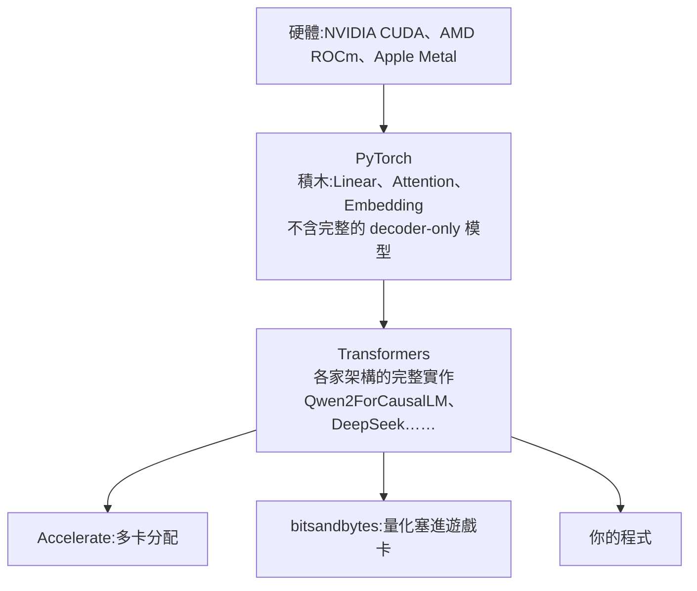
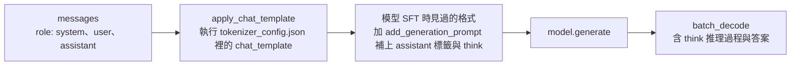

# 用 Hugging Face Transformers 在本機跑 DeepSeek-R1 蒸餾模型:載入、tokenizer、padding、chat template 一次講清(程序员老王)

**主題分類:** 科技 / LLM 內部原理 — 推論(本機部署實作)
**來源:** YouTube〈本地部署大模型!用Transformers库跑通DeepSeek-R1〉(程序员老王,2026-03-05,約 15 分;無字幕,逐字稿以 CPU faster-whisper 轉錄、非官方字幕)
**整理日期:** 2026-10-02

> ⚠️ 作者在說明欄推廣其付費「知識星球」(完整程式碼放在那裡)。下方程式碼是依影片講解、用 Transformers 公開 API 重寫的版本。

---

## TL;DR

1. ⭐ **Hugging Face ≈ 模型界的 GitHub**;本次用 **DeepSeek-R1-Distill-Qwen-1.5B**(15 億參數、`model.safetensors` 約 3.5GB),手機記憶體都跑得動——沒實用價值,但很適合練手。✅ 完整 DeepSeek-R1 約 **6,850 億**參數,壓到 int4 也要約 6 張 H100。
2. ⭐⭐ **PyTorch vs Transformers**:PyTorch 提供積木(Linear、Attention……)與硬體加速(CUDA、ROCm、Metal),但**沒有完整的 decoder-only 模型**——因為每家都在改(DeepSeek 把 FFN 換成 MoE、Qwen 把多頭注意力換成 GQA)。**Transformers 是 PyTorch 的高層封裝**,替你實作好各家架構。
3. ⭐ 載入:`AutoModelForCausalLM.from_pretrained()` 讀 `config.json` 的 `architectures`(這裡是 `Qwen2ForCausalLM`),回傳的就是一個 PyTorch `nn.Module`;再 `.to("cuda")` 或 `.to("mps")` 搬到顯存。
4. ⭐⭐ **批次推論的三個坑**:要 `padding=True`(矩陣運算要求等長)、**`padding_side="left"`**(模型從最後一個 token 往後接龍,填充放右邊會打斷)、傳 **`attention_mask`** 告訴模型哪些是填充。
5. ⭐⭐⭐ **直接丟問題 ⇒ 胡說八道**;要用 **`apply_chat_template`** 把 `[{"role": "user", "content": ...}]` 轉成模型 SFT 時見過的格式,並加 **`add_generation_prompt=True`**(補上 assistant 標籤和 `<think>`)。

---

## 1. 開源生態與模型檔案

- 在模型頁的 **Files** 分頁可看到所有檔案:手動逐一下載到同一資料夾即可;`model.safetensors` 存的就是參數。
- 也可以在 `from_pretrained()` 直接填模型名稱,讓 Transformers 自動下載到快取:macOS/Linux 為 `~/.cache/huggingface/hub`,Windows 為 `C:\Users\<使用者>\.cache\huggingface\hub`(可用環境變數 `HF_HOME` 改位置)。作者較少用這招:位置不好控制、也較吃網路品質。

| 檔案 | 用途 |
|---|---|
| `config.json` | 架構設定;`architectures` 欄位 = Transformers 裡實作這個模型的類別名稱 |
| `model.safetensors` | 參數 |
| `tokenizer.json` | 分詞器設定:文字↔token 對照、使用的演算法 |
| `tokenizer_config.json` | 含 **`chat_template`**(一小段 Jinja 腳本) |

---

## 2. 為什麼用 Transformers 而不是直接 PyTorch



- 自己用 PyTorch 拼一個 DeepSeek,得讀論文、逐模組照抄——太麻煩;Transformers 把這個坑填了。
- 載入後的物件**就是 PyTorch `nn.Module`**,想當普通 PyTorch 模型用也完全可以(延伸:[[pytorch-from-zero-transformer-series]])。
- **`CausalLM` 的 Causal(因果)**:訓練時一個 token 一個 token 來,只能看過去、不能看未來 = 文字接龍;相對的是 **BERT** 這類整段一起訓練、可以「偷看」後文的模型(見 [[multi-head-attention-explained]] 的 Mask)。
- 作者吐槽:Transformers 的**型別標註很糟**,各 `CausalLM` 沒有統一基底類別或介面,要讓 mypy 滿意得到處寫 `cast`——「AI 模型程式碼通常簡單,何苦為難自己。」

---

## 3. Tokenizer 細節

- `AutoTokenizer.from_pretrained()` 自動建立正確的分詞器;作者看到的實例是通用的 **`TokenizersBackend`**,不是 Qwen2 專用類別——因為分詞演算法只有 **BPE、WordPiece、Unigram** 三種常見的,差異小,新版 Transformers 用一個支援全部演算法的後端統一處理。

| 參數 | 為什麼 |
|---|---|
| `padding=True` | 一次推論多句話時,矩陣運算要求每句等長 ⇒ 短句補齊。這個模型填的是 **151643**(解碼後是句子結束標記) |
| `padding_side="left"` | 模型從**最後一個 token**往後接;希望它順著「Tell me your name.」的句號、「1+1=」的等號往下寫,填充放右邊會擋在中間 |
| `attention_mask` | 0 = 填充、1 = 真正文字;推論時告訴模型忽略填充 |
| `return_tensors="pt"` | 預設回傳 Python list,但模型要 PyTorch Tensor |
| `.to(model.device)` | token 也要搬到和模型**同一個裝置**,否則推論報錯 |

---

## 4. 推論:為什麼第一次胡說八道

- `model.generate(input_ids, attention_mask=..., max_new_tokens=32)`:一直接龍到結束標記或達上限;**不指定時預設只有 20 個 token**,作者建議實務設到 128 以上(推理模型要更多)。
- 第一次直接丟「1+1=」⇒ **基本是胡說八道**。原因:模型經過預訓練(文字接龍)後,又用一問一答的格式做過 **SFT**(見 [[lora-fine-tuning-explained]] §1);直接丟問題不是它在微調中見過的格式。
- 該丟的是類似「`<|User|>1+1=<|Assistant|><think>`」的格式——但**各家格式不統一**(有的寫 assistant、有的寫 AI、有的有思考標籤)⇒ Transformers 抽象出 `messages` 格式 + 模型自帶的 `chat_template` 來轉換。



結果:問名字,它答自己是 **DeepSeek-R1**;「1+1 等於幾」也答對了,回覆裡含 `<think>` 推理過程。

📌 作者踩到的設計問題:`apply_chat_template` **不接受 `padding_side` 參數**,得先把 `tokenizer.padding_side = "left"` 設成物件屬性。

---

## 5. 應用案例

### 案例一:完整可跑腳本(批次問兩題)

```python
import torch
from transformers import AutoModelForCausalLM, AutoTokenizer

name = "deepseek-ai/DeepSeek-R1-Distill-Qwen-1.5B"   # 或本機資料夾路徑
device = "cuda" if torch.cuda.is_available() else ("mps" if torch.backends.mps.is_available() else "cpu")

model = AutoModelForCausalLM.from_pretrained(name, torch_dtype="auto").to(device)
tok = AutoTokenizer.from_pretrained(name)
tok.padding_side = "left"          # apply_chat_template 不吃這個參數,只能設屬性

chats = [
    [{"role": "user", "content": "Tell me your name."}],
    [{"role": "user", "content": "1+1=?"}],
]
inputs = tok.apply_chat_template(
    chats,
    add_generation_prompt=True,    # 補上 assistant 標籤與 <think>
    padding=True,
    return_tensors="pt",
    return_dict=True,              # 同時拿到 input_ids 與 attention_mask
).to(device)

out = model.generate(**inputs, max_new_tokens=512)
new_tokens = out[:, inputs["input_ids"].shape[1]:]   # 只解碼新生成的部分
for text in tok.batch_decode(new_tokens, skip_special_tokens=True):
    print(text, "\n---")
```

### 案例二:判斷要用 Transformers 還是推論引擎

| 需求 | 選擇 |
|---|---|
| 學原理、改模型、做實驗、接 LoRA 微調 | **Transformers**(模型就是 `nn.Module`,什麼都能改) |
| 本機日常聊天、低顯存 | llama.cpp / Ollama(量化 GGUF) |
| 多人服務、高吞吐 | vLLM / SGLang |

比較見 [[inference-engines-llamacpp-vllm-sglang-tensorrt]];硬體分級見 [[local-ai-every-hardware-size]]。

### 案例三:回覆亂碼或答非所問時的檢查順序

1. 有沒有用 `apply_chat_template` + `add_generation_prompt=True`?
2. 批次推論時 `padding_side` 是不是 `left`、有沒有傳 `attention_mask`?
3. `max_new_tokens` 是否太小(推理模型的 `<think>` 很長,20 個 token 一定被截斷)?
4. 模型與 token 是否在同一個 `device`?

---

## 來源

- [YouTube:本地部署大模型!用Transformers库跑通DeepSeek-R1(程序员老王,2026-03-05)](https://www.youtube.com/watch?v=aHAmg_1q41M)(無字幕,逐字稿以 CPU faster-whisper 轉錄、非官方字幕)
- 模型:[deepseek-ai/DeepSeek-R1-Distill-Qwen-1.5B](https://huggingface.co/deepseek-ai/DeepSeek-R1-Distill-Qwen-1.5B)、[deepseek-ai/DeepSeek-R1](https://huggingface.co/deepseek-ai/DeepSeek-R1)
- 文件:[Transformers — Chat templates](https://huggingface.co/docs/transformers/main/en/chat_templating)、[Generation](https://huggingface.co/docs/transformers/main/en/main_classes/text_generation)

📎 相關筆記:[[pytorch-from-zero-transformer-series]]、[[lora-fine-tuning-explained]]、[[moe-mixture-of-experts-from-ffn]]、[[inference-engines-llamacpp-vllm-sglang-tensorrt]]

**Whisper 專有名詞還原對照:** 抛弃 → 跑起;Huggingface/haggingface → Hugging Face;千吻/千吾/千万 → Qwen;徵流/争流 → 蒸餾;model.satensors → model.safetensors;Kuda → CUDA;ROC-M → ROCm;潜规神经网络 → 前饋神經網路;分组查询注意力 → GQA;BitSandBytes → bitsandbytes;千文二foldcastleLM → Qwen2ForCausalLM;FromPretrain → from_pretrained;英国/Causels → Causal(因果);Bird → BERT;Mapy → mypy;NPS → mps;兔函数 → `.to()`;WorldPeace → WordPiece;Tokeniser.json → tokenizer.json;pidingside → padding_side;肉曲 → role;syncing → thinking。
