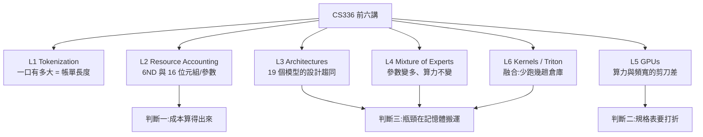
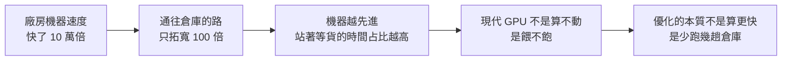
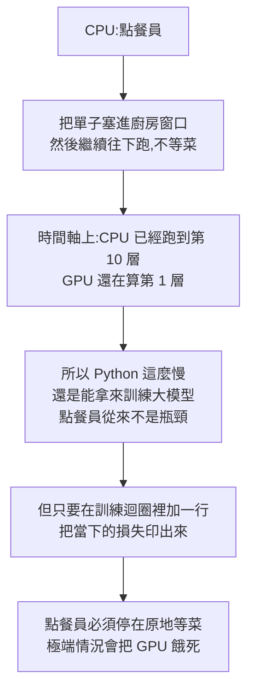

# 一張餐巾紙算完 LLM 訓練成本:Stanford CS336 前六講的三個判斷

**主題分類:** AI / LLM 架構與訓練 — 訓練成本、資源會計與系統瓶頸
**來源影片:** YouTube〈從零開始訓練一個大型語言模型 ｜ Stanford 公開課 ｜上集〉(Jim AI Notebook,2026-08-25,約 32.5 分鐘)
**原始課程:** Stanford **CS336: Language Modeling from Scratch**(Spring 2025,講者 Percy Liang、Tatsunori「Tatsu」Hashimoto),本集涵蓋 **Lecture 1–6**
**整理日期:** 2026-08-29

> ⚠️ 本影片無字幕,逐字稿以 CPU 版 faster-whisper 轉錄取得,**非官方字幕**,可能有少量聽寫誤差(專有名詞對照表見文末「來源」)。文中凡屬課堂投影片數字者,已盡量比對官方一手資料,**不一致處已在「§8 與一手資料的核實與補正」標出**。

---

## 0. 這篇在講什麼

CS336 是一門**不准呼叫任何現成模型服務**的課:從「把文字變成數字」那一行開始,一路自己寫到模型跑得夠快。整門課約 20 講,本集講前六講,而前六講其實只講一件事:**成本**。

影片最後留下三個「帶得走的判斷」,也是本筆記的骨架:

1. **成本是可以自己算的** —— 只要知道模型多大、餵多少資料,一條 `6ND` 就能估出要燒多少運算、跑多少天。
2. **規格表上的數字都要打折** —— 峰值不是你拿得到的,要看 MFU(實測利用率)。
3. **瓶頸幾乎從來不在算力,而在「搬資料」** —— 這句話會把 KV cache、MoE、GPU、Kernel 四講全部串起來。



---

## 1. 為什麼還要「自己蓋一次」:會漏的抽象

Percy Liang 開這門課的理由是一種危機感。他回顧了一條清楚的退化線:

- **八年前**:做研究的人幾乎都自己實作、自己訓練模型。
- **六年前**:至少還會把別人訓好的模型下載下來,用自己的資料再調一次。
- **現在**:很多人跟模型的關係只剩下一件事——寫提示詞。

他的判斷是:**「語言模型這層抽象是會漏的(leaky abstraction)。」**

> 開車不需要懂引擎,因為引擎那層抽象包得很好。但語言模型這層包不住——模型突然變笨、成本突然翻倍、換一種語言就退化,這些問題全部會**從底層漏上來**;而你站在最上面那一層,只會覺得莫名其妙。

課程的立場不是「你一定要自己訓模型」,而是「**你至少要知道下面那層長什麼樣子,不然你連問題出在哪裡都說不出來**」。Percy 講得更白:字串丟進去、字串跑出來,這件事本身不叫理解。

### 順帶修正一個流行說法

這幾年常聽到「規模才是一切,演算法不重要」。Percy 說這是**誤讀**,正確版本是:

> **「能夠規模化的演算法才是關鍵。」**
> 模型最終強度 ≈ **效率 × 投入資源**

這個乘法有個很現實的性質:**規模越大,效率就越值錢**。你在自己的筆電上浪費一半算力沒人在意;你在一億美元的訓練上浪費一半,那是五千萬美元。

佐證是 OpenAI 2020 年的〈AI and Efficiency〉:2012→2019 年間,把影像模型訓練到**同樣準確率**所需的算力少了 **44 倍**——同一個目標,光靠演算法進步,成本就掉到 1/44。

---

## 2. Lecture 1:Tokenization —— 「一口有多大」直接決定帳單

模型看不懂文字,只吃數字。任何一句話進模型前,都要先切成小塊再換成編號,這叫 **tokenization**,切出來的每一小塊叫一個 **token**。

**為什麼這是成本問題?** 因為模型的運算量與餵進去的 token 數成正比。同一篇文章切成 10,000 個 token 就付 10,000 個的錢,切成 5,000 個帳單直接砍半。這也是所有模型服務**按 token 計價**的原因。

衡量指標叫**壓縮率**(平均一個 token 代表幾個位元組)。GPT-2 系列的切法大約是 **1.6 bytes/token**。以下三條走不通的路,全部敗在這個數值上:

| 做法 | 詞彙表大小 | 致命問題 |
|---|---|---|
| **一個字元 = 一個 token** | 十幾萬項(要涵蓋全世界文字,光地球表情符號的 Unicode 編號就是 127757) | 絕大多數項目一輩子出現不了幾次,**預算全花在冷門字上** |
| **一個位元組 = 一個 token** | 固定 256 項,全世界文字都表示得出來 | 壓縮率掉到 1:1,**句子長好幾倍**;而注意力成本與長度是**平方關係**,長度變三倍成本就變九倍 |
| **按空白切單字** | 隨語料膨脹 | 一定會遇到沒看過的字(新產品名、拼錯、網路新詞),只能標成未知詞,**讀到那裡等於瞎了** |

### 解法來自 1994 年的資料壓縮

**BPE(Byte Pair Encoding)**,Philip Gage 1994 年發表的壓縮法,規則簡單到有點好笑:

```
1. 把整份文字攤成一長串位元組
2. 統計「哪兩個相鄰的東西最常連在一起」
3. 假設是 T+H,就發明一個新編號,把全文所有 TH 一次換掉,序列短一截
4. 重複 2–3,想要多大的詞彙表就跑幾次
```

它漂亮在**是自己長出來的**:常出現的片段被合併成一個 token,罕見片段留著慢慢拼,所以**模型永遠不會遇到不認識的字**。這個 1994 年為了省硬碟空間發明的東西,先被拿去做機器翻譯的切詞,再被 GPT 系列帶進語言模型時代,成為今天幾乎所有模型的標準做法——**三十年後改成幫全世界省顯示卡的錢**。

---

## 3. Lecture 2:餐巾紙上的兩本帳

### 3.1 單位:FLOP,以及那個「2」

課程用的單位是 **FLOP(浮點運算次數)**。為什麼可以用這麼粗的單位?因為深度學習裡幾乎所有計算都被**矩陣乘法**佔滿了。

矩陣乘法的運算次數簡單到出乎意料:

```
FLOPs = 2 × (三個維度相乘)
```

那個 **2** 是因為表格裡每一個答案都是「先乘一次、再加一次」= 兩次運算。

至於正規化、激活函數、注意力機制的其他部分——**它們的運算量加起來連零頭都算不上**(§5 會給出精確數字,那個數字是整支影片的轉折點)。

### 3.2 第一本帳:時間 —— `6ND`

訓練分兩個方向:

- **前向**:讀進文字、猜下一個字 → 每個參數對每個 token 做 **2 次**運算
- **反向**:比對猜錯多少、回頭調旋鈕 → **4 次**,因為要同時算兩種修正量(給參數本身的、以及要往前傳給上一層的)

2 + 4 = **6**,於是:

```
總訓練 FLOPs = 6 × N × D      (N = 參數量,D = token 數)
```

**實際演練:70B 模型、15T tokens、1024 張 H100,要跑多久?**

```
分子 = 6 × 70e9 × 15e12                       = 6.3e24 FLOPs
分母 = 1024 × (H100 稠密 BF16 ≈ 989e12) × 50% MFU
     = 5.06e17 FLOP/s
時間 = 6.3e24 / 5.06e17 ≈ 1.245e7 秒 ≈ 144 天
```

> **⭐ 這裡有個陷阱:不能拿規格表上的數字直接除。** 沒有人榨得出 100%,課程假設**榨出一半**;而且分子用的是**稠密 BF16(約 989 TFLOPS)**,不是規格表最大的那個 1,979(詳見 §4 與 §8)。

**144 天,將近五個月,而且是一千張卡不眠不休。** 你什麼程式都沒寫、什麼機器都沒租,就已經知道:這不是週末做得完的實驗,是要排進行事曆、要簽合約、要有人盯著五個月的工程。

### 3.3 第二本帳:空間 —— 每個參數 16 個位元組

**題目:8 張 H100(每張 80GB),最大能塞多大的模型?**

直覺算法是 `8 × 80 = 640GB`,每參數 4 bytes,推得 1,600 億參數。**這個算法錯得很離譜**,因為訓練時一個參數不是只佔一份:

| 用途 | 佔用 |
|---|---|
| 參數本身 | 4 bytes |
| 梯度(修正量) | 4 bytes |
| 優化器狀態(Adam 的兩筆滑動平均) | 8 bytes |
| **合計** | **約 16 bytes / 參數** |

```
640GB / 16 bytes ≈ 400 億參數
```

**從 1,600 億掉到 400 億**,而且這還沒算中間結果(activation)的暫存空間。這就是為什麼「顯示卡記憶體看起來夠,一開始訓練就爆掉」——**推理時一個參數只要一份,訓練時要四份**。

### 3.4 精度:FP16 與 BF16 的關鍵差異

既然每一份都要錢,能不能讓每一份便宜一點?這就是**精度**。傳統用 32 bit 很安全但佔空間,後來大家砍半用 16 bit,而 16 bit 有兩種切法:

| 格式 | 設計取捨 | 後果 |
|---|---|---|
| **FP16** | 較多位元給小數,**精細但範圍窄** | 訓練時修正量本來就很小,**小到一定程度直接變成 0**,那一層等於停止學習 |
| **BF16**(Google 2018) | 範圍**完全等同 FP32**,犧牲小數精細度 | 事實證明深度學習**不在乎精細,只在乎範圍不要爆掉** |

所以今天的訓練幾乎都是**混合精度**:參數與優化器狀態留在高精度,中間計算全部降下來。

---

## 4. 規格表上那顆星星,與 MFU

NVIDIA H100 規格表寫著 **每秒 1,979 兆次運算(BF16 Tensor Core)**。Percy 說他第一次看的時候,完全沒注意到那個數字旁邊有一顆**小星星**。

星星的意思是:**這個數字要在「稀疏(sparsity)」條件下才成立**——硬體規定你的矩陣裡**每四個數字必須有兩個是 0**,才跑得到那個速度。拿一張正常的稠密矩陣去跑,**實際速度大概只有一半**。

課堂上 Tatsu 直接補了一句:

> **「沒有人在用稀疏。那是行銷部門在用的。」**

**這顆星星的代價非常具體:照規格表估,你會少估一倍的時間。**

### MFU:唯一跟品牌無關的指標

```
MFU(Model FLOPs Utilization) = 你實際榨出來的運算量 / 規格表標稱值
```

課程給的及格線是 **超過 50%**;如果只有 5%,等於你租了一整台機器只用到二十分之一。

比喻:原廠說一公升跑 20 公里,那是在測試場、沒開冷氣、沒塞車跑出來的;你自己開只有 12 公里,**那個 12 才是你真正的成本**。

**課堂實測還出現一個反直覺現象:** 換成較低精度後,程式明明快了好幾倍,**MFU 反而變低**——原因出在分母,那個標稱值本來就被吹得太高。所以結論只有一句:

> **永遠實測你自己的程式,不要假設你會拿到某個效能。**

---

## 5. Lecture 3:19 個模型的設計趨同,以及整支影片的轉折點

你不可能為了選一個設計就去訓練 20 個大模型來比。Tatsu 的辦法是做一張**普查表**:把 2017 年最初的 Transformer 到 2025 年最新模型(**光過去一年就有 19 個新模型釋出**)每個公開過架構細節的都列成一列,每個設計選擇列成一欄,然後看**哪幾欄隨時間收斂了**。

> 他說這一講的主題跟整門課剛好相反:整門課是「動手做才學得會」,這一講是「**向別人的經驗學習**」——這幾年全世界燒掉的算力,已經幫我們做完了一次巨大的天擇實驗。

### 活下來的配方

| 設計選擇 | 收斂後的答案 | 為什麼 |
|---|---|---|
| **正規化的位置** | **Pre-Norm**(移到旁支,主幹保持暢通) | 主幹叫**殘差流**,像一條高速公路;修正訊號要從最上面傳回最底下,**你如果每隔一段設一個收費站,訊號就到不了** |
| **正規化的形式** | **RMSNorm**(省掉減平均,只留除法) | 實驗顯示:每秒能多跑幾步,**而且最終損失還更低一點點**——一次免費的雙贏 |
| **偏置項(bias)** | **拿掉** | 效果沒變差,東西還變少 |
| **激活函數** | **SwiGLU**(多一道閘門,讓模型自己決定哪些訊號放行) | 提出它的論文在結論裡誠實寫著:**我們對它為什麼有效不提供任何解釋,只能歸因於「神聖的恩典(divine benevolence)」**——這句是論文原文 |
| **位置編碼** | **RoPE**(旋轉式位置編碼) | 過去一年 19 個模型**這一欄全部是 RoPE,沒有例外** |

**RoPE 為什麼優雅:** 它不是給每個位置貼號碼牌,而是**把每個詞的向量當成一支箭頭,位置越後面就轉越多角度**。同樣兩個詞,排在第 1、2 位與排在第 3、4 位,兩支箭頭轉的角度都變了,**但它們之間的夾角完全沒變**——而模型真正在看的剛好就是夾角。所以模型**只感覺得到兩個字距離多遠,感覺不到它們在整句話的哪個位置**,因而比較有機會處理比訓練時更長的句子,而且**幾乎不用付出代價**(不需要多學任何參數,只是把本來就有的向量轉一個角度)。

### 表格裡那些「不一樣的格子」

- **孤零零的例外:** 現代模型裡只剩 **OPT-350M** 還在用舊的 Post-Norm(收費站)做法。Tatsu 猜大概是當年那個尺寸訓練時出了問題,就這樣放著不管了。
- **敢玩的下場:** 每層裡負責思考的區塊會先把資料放大再縮回來,**全世界共識是放大 4 倍**(用閘門的版本會再縮一點)。而 **Google 的 T5 放大了 64 倍**。Tatsu 的原話是「Google 的人真的很敢」。最精彩的是後續:**T5 的續作沒有繼續往那個方向走,反而改回主流比例,而且模型還更好。**

> 所以這張普查表有兩層意思:第一層是共識長什麼樣,第二層是**真的有人去試過那些不共識的地方,然後幫大家證明了那條路不用再走一次**。

### 過去一年真正的新東西:穩定性技巧

Tatsu 說,過去一年真正的新東西其實是**穩定性**。最怕的畫面是:損失曲線看起來還算平順,但你把每一步的修正量畫出來,**整條線全是尖刺(spike)**——某一步修正突然大到失控,模型可能下一秒就整個壞掉,而你已經燒掉兩個月的機器時間。他給那張圖的評語是:**「這是一張看了會怕的圖。」**

有意思的是,**闖禍的地方只有兩個,而且都跟同一種運算有關:softmax**(把一排分數變成機率)。它的脾氣是:**只要輸入的數字太大,就會把差距放大到極端**。所以現在的解法都是幫這些數字設天花板——有的在損失裡加懲罰項,有的在算注意力之前先正規化一次。

> Tatsu 的玩笑:「我們本來把正規化加在區塊前面,後來變成前後都加,現在連注意力裡面都塞了一份。就穩定性來說,**它有效得令人震驚**。」

### ⭐ 轉折點:99.8% 的運算量對上 25% 的時間

到這裡有件事說不通:**RMSNorm 也好、拿掉 bias 也好,這些省下來的運算量少到根本看不見,為什麼把它們拿掉速度會這麼有感?**

答案來自〈Data Movement Is All You Need〉(Ivanov et al., 2021)對 BERT encoder 訓練的拆解:

| 運算類別 | 佔 FLOP | 佔執行時間 |
|---|---:|---:|
| 張量收縮(矩陣乘法) | **99.80%** | **61.0%** |
| 統計正規化(LayerNorm 等) | **0.17%** | **25.5%** |
| 逐元素運算(activation 等) | 0.03% | 13.5% |

**一件事只做了千分之二的功,卻花掉四分之一的時間。**

那些時間花到哪去了?**不是花在「算」,是花在「搬」。** 資料要從遠處的記憶體搬到計算單元旁邊,算完再搬回去。正規化要算的東西很少,可是它**每一次都得把整批資料完整搬過來一趟**。

> 比喻:搬家真正吃掉一整天的,不是把東西放進箱子,是**抬著箱子上上下下走的那幾十趟**。

**結論一句話:重點不只是運算量,還有記憶體搬運。** 這句話會把後面所有內容串起來。

---

## 6. 這個視角的三次應用

### 6.1 KV Cache:你每天都在付的搬運費

模型生成文字是一次吐一個字,再把剛吐的字接回去吐下一個。問題是**每吐一顆新字都要回頭看前面所有的字**——每次都重算一遍,等於每一步都把整篇文章重讀一次,越到後面越慢。

解法是把前面算過的東西存起來,這份筆記就叫 **KV Cache**(本倉庫另有專篇 [[kv-cache]])。它把重複計算幾乎全部省掉,**但把成本換到了另一個地方**:

- 這本筆記本會隨對話變長而**越變越厚**
- **每吐一個字,模型都得把整本筆記從記憶體裡完整讀過一次**

**這正好就是那個錯位:計算很少,搬運很多。**

### 6.2 GQA:筆記本的厚度是設計出來的

注意力機制不是只有一雙眼睛,它有很多個 head,各自在看不同關係(文法、代名詞指涉、段落主題)。原本每個 head 各記一本筆記;後來的做法是——**讓好幾個 head 共用同一本**,這就是 **GQA(分組共用查詢的注意力)**;更極端的版本是所有 head 共用一本(MQA)。

> **這一招省的完全不是運算量(運算量幾乎一樣),省的是每一步要搬多少東西。**

**這解釋了一個常見現象:** 同樣參數量的模型,有的支援很長的上下文而且很便宜,有的一長就變慢變貴。**差別常常不在它多聰明,而在它旁邊那本筆記本被設計成什麼樣子。**

### 6.3 GPU:十萬倍對一百倍的剪刀差

Tatsu 這一講的目標是「讓 GPU 跟 CUDA 不再那麼像魔法」,而他放的那張圖,影片作者認為是**整門課最重要的一張圖**:過去十幾年兩條線的成長——

| 項目 | 成長幅度 |
|---|---|
| **算力**(每秒運算次數) | 約 **10 萬倍** |
| **記憶體頻寬**(資料搬到計算單元的速度) | 約 **100 倍** |



**GPU 記憶體是分層的:**

| 位置 | 取一次資料要等 |
|---|---|
| 晶片內、離計算單元最近的一層 | 約 **20** 個時脈週期 |
| 晶片外的大倉庫(顯示卡記憶體) | 約 **200–300** 個週期 |

**差了 10 倍以上。** 於是最好懂的一招出現了:**融合(fusion)**。

```
天真做法:倉庫 → 工廠(方塊變三角)→ 倉庫 → 工廠(三角變圓)→ 倉庫 → 工廠(圓變長方)→ 倉庫
融合做法:倉庫 → 工廠(方塊變三角、變圓、變長方,一次做完)→ 倉庫

運算量完全一樣,時間卻差很多——省下來的全是路上的來回。
```

課程後面所有技巧(**降精度、融合、重新計算、對齊讀取、分塊**)講的都是同一件事:**少搬幾次。**

---

## 7. Lecture 6:波次量化,與那個「配置錯誤的三個小時」

### 7.1 為什麼矩陣大一點點,時間就變兩倍

Tatsu 開場丟了一張詭異的圖當懸念:橫軸是矩陣邊長,縱軸是實際速度。照理說應該是平滑的線,**可是那張圖像波浪一樣上上下下**——某些尺寸特別快,某些掉下去。

解答:GPU 裡有固定數量的運算單元(SM),處理大矩陣的方式是**切成一塊一塊發下去**。以課堂用的那張卡(108 個 SM)為例:

```
邊長 1792  → 剛好切成 98 塊 → 108 個單元「一輪」就吃完
邊長再大一點點 → 切成 120 塊
   第一輪:108 塊
   第二輪:剩下 12 塊,108 個單元裡只有 12 個在工作,其他 96 個空轉
   結果:矩陣只大了一點點,時間直接變兩倍
```

這個現象有名字,叫 **wave quantization(波次量化)**。它**不是程式的錯誤**,是把工作切成整數塊之後**必然會出現的邊界**。

### 7.2 Karpathy 那個著名的例子

Andrej Karpathy 在訓練 nanoGPT 時發過一則貼文,說整個專案裡**最戲劇性的一次優化**,不是改模型、不是換演算法,而是把**詞彙表大小從 50,257 改成 50,304**——只是往上湊到最接近的 **64 的倍數**,速度就快了約 **25%**。

> 他讓模型多背了幾十個永遠不會用到的空位,結果模型反而變快了。

Tatsu 給的實務建議只有一句:**尺寸盡量挑 2 的次方,或者它的倍數,千萬不要挑質數。**

> 這大概是這門課最實用的知識點:**幾乎不需要理解任何數學,卻可能直接幫你省下四分之一的訓練費用。**

### 7.3 手寫 kernel 的對決:8.1ms 對 1.1ms

Tatsu 挑了模型裡很常用的小函式 **GELU** 做對決:

| 寫法 | 耗時 |
|---|---|
| 最自然的寫法(用現成運算一步一步做:乘一下、加一下、再轉換一次) | **8.1 ms** |
| 融合成一個 kernel,一次做完 | **1.1 ms** |
| 手寫底層 kernel、以及讓編譯器自動生成 | 都落在中間,**而編譯器自動生成的那版比手寫的還快一點點** |

**請注意:這兩種寫法做的計算完全一樣,一次都沒有少。** 差的全部是來回搬運。

也因為編譯器自動生成的版本很有競爭力,Tatsu 給學生的忠告是:**不要回家就把整個模型都改寫成底層 kernel,現代編譯器已經很厲害了。**

### 7.4 CPU 是點餐員,不是瓶頸

你的電腦裡有兩台機器在跑,而它們**不是輪流工作的**:



Tatsu 說他看過很多學生自以為找到了瓶頸,埋頭優化了三個小時,結果那根本不是瓶頸。他的原話是:

> **「我相信那三個小時很好玩,但那是配置錯誤的時間(misallocated time)。」**

規則只有一條:**先量測,再動手。**

---

## 8. 與一手資料的核實與補正

本倉庫的慣例是把影片裡可查證的規格、數字、機制拿去比對官方來源。核實結果如下:

### ✅ 影片正確、且值得標記的部分

| 影片說法 | 一手資料核實 |
|---|---|
| CS336 前六講的主題順序 | **完全一致**:L1 Overview / Tokenization、L2 PyTorch / Resource Accounting、L3 Architectures / Hyperparameters、L4 Mixture of Experts、L5 GPUs、L6 Kernels / Triton(Stanford CS336 Spring 2025 官方課表) |
| H100 的 1,979 TFLOPS 是「含稀疏」的行銷數字 | **屬實。** NVIDIA 官方 H100 產品頁的 BFLOAT16 Tensor Core 為 **1,979 TFLOPS**,規格表註明帶星號者**包含 sparsity**;稠密實際約為其一半(約 989)。同頁其他 SXM 規格:FP8 3,958 TFLOPS、80GB、3.35TB/s、NVLink 900GB/s、TDP 700W |
| 144 天的算式 | **算得出來。** 6 × 70e9 × 15e12 = 6.3e24 FLOPs;1024 × 989e12 × 50% = 5.06e17 FLOP/s;相除約 1.245e7 秒,即 **144 天**。⭐ 注意分母用的是**稠密 989**——如果誤用規格表的 1,979,會得到 72 天,**剛好少估一倍**,正是影片說的那個陷阱 |
| 「正規化佔不到 0.2% 運算,卻吃掉約四分之一時間」 | **精確。**〈Data Movement Is All You Need〉:統計正規化 **0.17% FLOP、25.5% runtime** |
| Karpathy 50257 改成 50304,快約 25% | **屬實。** 原貼文說這是 nanoGPT 至今最戲劇性的優化(約 25% 加速),理由是「走上不同的 kernel path、occupancy 高很多」 |
| SwiGLU 論文的「divine benevolence」 | **是論文原文**(Shazeer 2020,〈GLU Variants Improve Transformer〉結論段) |
| DeepSeek 三代的總參數與激活參數 | **與公開規格一致**:DeepSeekMoE 約 16B 總 / 2.8B 激活、V2 236B / 21B、V3 671B / 37B(影片講的「161 億」是 Whisper 誤聽,應為約 **160 億**) |
| OPT-350M 是仍用 Post-Norm 的孤例 | **與公開資料一致**(同系列其他尺寸皆為 Pre-Norm) |
| T5 把 FFN 放大 64 倍 | **與公開規格一致**(T5-11B:d_model 1024、d_ff 65536,正好 64 倍);其續作 T5 v1.1 改回 gated 激活與較小比例 |
| OpenAI 的「44 倍」 | 與 OpenAI 2020 年〈AI and Efficiency〉結論一致(2012–2019,達到相同影像分類準確率所需算力降至 1/44) |

### ⚠️ 需要補正的部分

1. **「顯示卡裡面有 108 個運算單元」——那是 A100,不是 H100。**
   影片前半一路以 **H100** 為例,講到波次量化時卻用 **108 個 SM**;而 **108 是 A100 的 SM 數**。H100 的實際 SM 數是 **SXM5 132 個、PCIe 114 個**(完整晶片 144,良率不足者降規銷售)。
   這不是影片講錯課程內容——CS336 該段實驗確實跑在 A100 上——但**對只看影片的人容易誤植到 H100**。實務上這點很重要:**做 tiling、湊尺寸時,你要湊的是「你手上那張卡」的 SM 數**,拿 108 去湊 H100 會湊錯。

2. **「矩陣乘法佔 99.8% 運算量」是對的,但「時間」那半段值得補完。**
   影片把重點放在正規化的 0.2% 對 25%,容易讓人以為「其餘 75% 都是矩陣乘法」。精確的拆解是:矩陣乘法 **61.0%** 時間、正規化 **25.5%**、逐元素運算 **13.5%**——也就是說 **memory-bound 的操作合計吃掉約 39% 的時間**,比單看正規化更嚴重。

3. **GPT-4 的「1.8 兆參數、一億美元」是傳聞,不是官方數字。**
   這點影片自己講得很清楚(而且說明課堂上也是用「傳聞」帶過),此處再強調一次:**這兩個數字不能當事實引用**,它們在本篇的角色只是「示範餐巾紙算法的輸入」。

4. **「10 萬倍對 100 倍」是課堂投影片的量級示意。**
   不同資料來源對「起算年份」與「拿哪張卡比」的選擇,會讓倍數差很多。**該記住的是那個「剪刀差」的存在與方向,而不是這兩個具體數字。**

---

## 9. 應用案例:三個判斷怎麼用在日常

### 案例 A|看到新模型發布,30 秒估出它的量級

某實驗室發布一個宣稱「用 2,048 張 H100 訓練了三週」的 200B 模型,但沒說資料量。你可以反推:

```
可用運算 = 2048 × 989e12 × 50% MFU × (21 天 × 86400 秒) ≈ 1.84e24 FLOPs
D = 總 FLOPs / (6N) = 1.84e24 / (6 × 200e9) ≈ 1.5e12 tokens,約 1.5T tokens
```

得到「約 1.5T tokens」這個量級後,你立刻有了判斷:**這是一個相對「訓練不足」的 200B 模型**(對比同期主流 70B 模型餵 15T)。你不需要任何內部消息,就能分辨「參數量大」和「訓練得好」是兩回事。

### 案例 B|決定要不要在自己的 8 卡機上做全參數微調

老闆說「我們有一台 8×H100,把那個 70B 模型全參數微調一下」。你用第二本帳:

```
70B × 16 bytes = 1,120 GB   >   8 × 80 = 640 GB
```

**光是參數加梯度加優化器狀態就塞不下,還沒算 activation。** 你不用等它 OOM 三次才發現,可以直接在會議上把選項攤開:

- 換 **LoRA / QLoRA**(只訓練少量參數,優化器狀態跟著縮)
- 用 **ZeRO / FSDP** 把優化器狀態切到多卡
- 或者接受「這台機器只適合推理與輕量微調」

### 案例 C|為什麼你的推理服務一長上下文就變慢變貴

你的 RAG 服務把上下文從 4K 拉到 32K,結果延遲不是線性成長,而是**明顯惡化**。用 §6.1 的視角:成本不只在「多算」,更在**每生成一個 token 都要把整本 KV Cache 完整讀過一次**——上下文變 8 倍,那本筆記本就厚 8 倍,**每一步的搬運量就是 8 倍**。

所以正確的優化方向是:

1. 選 **GQA / MQA** 設計的模型(同樣參數量,KV Cache 可能小數倍到十倍)
2. 導入 **prompt caching**(把重複前綴的 KV 存起來,別每次重算重搬)
3. 檢查是不是把「用不到的文件」也塞進上下文——**你付的是搬運費,不是聰明費**

### 案例 D|一行 log 讓 GPU 餓死

你在訓練迴圈裡加了 `print(loss.item())` 想看進度,結果整體速度掉了三成。原因就是 §7.4:`.item()` 需要 GPU 把數字算完交回來,**點餐員必須停在原地等菜**。

修法:改成每 N 步才印一次,或先把 loss 累積在 GPU 上、隔一段時間才一次同步。**這類問題的通則是「先量測再動手」——不然你優化的很可能是那三個「很好玩但配置錯誤」的小時。**

---

## 10. 一句話總結

> **你以為大家在比誰的算力多,實際上大家在比的是誰少搬幾次資料。**

這門課給你的不是一堆名詞,是**一把可以自己量的尺**:模型多大、資料多少、卡有幾張——帳你自己就算得出來。而且這三個判斷**不需要你會寫程式也用得上**:你只要在聽到任何一個模型宣稱時,習慣性地多問一句——

**「這個數字是在什麼條件下亮出來的?」**

---

## 延伸閱讀(本倉庫相關筆記)

- [[kv-cache]] —— KV Cache 的機制專篇
- [[pre-norm-vs-post-norm-transformer]] —— §5 提到的正規化位置之爭,含 DeepNet 對主流解釋的反駁
- [[attention-residuals]] —— 殘差流「高速公路」與數值膨脹、資訊稀釋
- [[deepseek-v4-engineering]] —— DeepSeek MoE 路線的後續工程
- [[microgpt-karpathy]] —— Karpathy 的最小實作,可與 §7.2 的 50304 故事對照

---

## 來源

- YouTube 影片:[從零開始訓練一個大型語言模型 ｜ Stanford 公開課 ｜上集](https://www.youtube.com/watch?v=XDy8topNXcc)(Jim AI Notebook,2026-08-25,約 32.5 分鐘)
- 原始課程官網:[Stanford CS336: Language Modeling from Scratch (Spring 2025)](https://stanford-cs336.github.io/spring2025/)
- 課程講座(影片自陳的取材來源):
  - [Lecture 1: Overview, tokenization](https://www.youtube.com/watch?v=SQ3fZ1sAqXI)
  - [Lecture 2: PyTorch, resource accounting](https://www.youtube.com/watch?v=msHyYioAyNE)
  - [Lecture 3: Architectures, hyperparameters](https://www.youtube.com/watch?v=ptFiH_bHnJw)
  - [Lecture 4: Mixture of experts](https://www.youtube.com/watch?v=LPv1KfUXLCo)
  - [Lecture 5: GPUs](https://www.youtube.com/watch?v=6OBtO9niT00)
  - [Lecture 6: Kernels, Triton](https://www.youtube.com/watch?v=E8Mju53VB00)
- 核實用的一手 / 權威資料:
  - [NVIDIA H100 Tensor Core GPU 產品規格](https://www.nvidia.com/en-us/data-center/h100/)(1,979 TFLOPS 的星號代表含 sparsity)
  - [Data Movement Is All You Need: A Case Study on Optimizing Transformers (arXiv:2007.00072)](https://arxiv.org/abs/2007.00072)(99.80% / 0.17% / 0.03% FLOP 對應 61.0% / 25.5% / 13.5% runtime)
  - [Andrej Karpathy 談 nanoGPT 由 50257 改為 50304 的約 25% 加速](https://x.com/karpathy/status/1621578354024677377)
  - [nanoGPT `model.py`(vocab_size 預設 50304)](https://github.com/karpathy/nanoGPT/blob/master/model.py)
  - [GLU Variants Improve Transformer (arXiv:2002.05202)](https://arxiv.org/abs/2002.05202)(SwiGLU 與「divine benevolence」原文)
  - [OpenAI, AI and Efficiency (2020)](https://openai.com/index/ai-and-efficiency/)(2012–2019 演算法效率 44 倍)

### 逐字稿取得方式與專有名詞還原對照

**該片無官方字幕也無自動字幕,逐字稿以 CPU 版 faster-whisper(small、int8、`vad_filter=True`)轉錄取得,非官方字幕**,人名與數字容易出錯。以下為本篇已還原的對照(左為 Whisper 輸出,右為正確寫法):

| Whisper 輸出 | 正確 |
|---|---|
| CX336 | **CS336** |
| Percy 亮 | **Percy Liang** |
| 他處 / 它除 / Tacchu / Taxu / Tattu | **Tatsu(Tatsunori Hashimoto)** |
| 伏典運算次數 / FOP | **浮點運算次數 / FLOP** |
| 味源組 | **位元組(byte)** |
| 西蘇 / 西蘆 / 吸輸 | **稀疏(sparsity)** |
| BF46 | **BF16** |
| IMSNORM / RMSNome | **RMSNorm** |
| SYGL | **SwiGLU** |
| ROPE | **RoPE** |
| 卡佩蒂 | **Karpathy** |
| CUCA | **CUDA** |
| GEU | **GELU** |
| 波赤亮化 | **波次量化(wave quantization)** |
| 堅持 / 堅次 | **尖刺(spike)** |
| 正覓劃 / 正視劃 / 正規劃 | **正規化** |
| 未不保 | **餵不飽** |
| 相承旋牛 / 懸牛 | **參數(旋鈕)** |
| 1.8 兆參數、一億美元 | 皆為**傳聞值**,非官方數字 |

> ⚠️ 文中數字凡標示「課堂投影片」「影片轉述」者,已在 §8 說明核實狀態;未經一手來源核實者不應直接引用。
