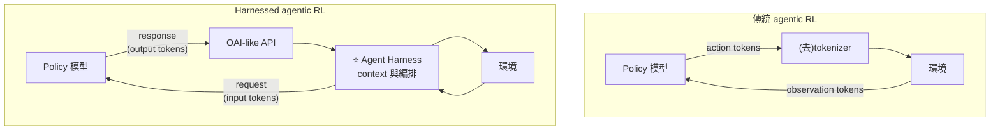

# Harnessed Agentic RL:當 harness 而不是訓練器擁有互動迴圈,RL 會壞在哪四個地方

> 整理自論文 **Agent Lightning v1.0: Towards Harnessed Agentic RL**(arXiv:2608.17528v1,2026-08-18)。
> 作者:Zhiyuan He、Siwei Zhang、Zhiwen Zhou 等(**Microsoft、復旦大學、浙江大學、愛丁堡大學**)。
> 開源:`github.com/microsoft/agent-lightning`。
> 依 CLAUDE.md 慣例,**以本機 PyMuPDF 抽取 PDF 全文閱讀**。

> 相關筆記:[[sdar-agentic-rl]]、[[defeating-nondeterminism-batch-invariance]](⭐ **同一個「訓練與取樣不一致」問題的另一面**)、[[agentic-harness-engineering-observability-evolution]]、[[hermes-main-agent-orchestration]]、[[pi-minimal-agent-harness-teardown]]

---

## 一句話總結

**現代 agent 不是獨立的 LLM,它們跑在 harness 裡。** 這篇提出 **harnessed agentic RL** —— **用「部署時實際使用的那個 harness」來做 RL 訓練**,好讓訓練與實際使用之間的落差變小。

⭐⭐ **但它同時指出:這件事跟傳統 agentic RL 有根本差異,而差異帶來的四個實作問題,現有框架大多沒講清楚 —— 沒處理好會導致訓練無效或不穩定。**

---

## 一、背景:為什麼要用「部署時的 harness」訓練

**早期 RL 框架(verl、AReaL、slime)通常要求使用者把 agent loop 直接實作在訓練框架裡面。** ⚠️ 而既有的 agent harness 實作複雜、各自有依賴,**很難直接塞進 RL 框架**。

**原版 Agent Lightning 提出「解耦架構」** —— 透過一個 **LLM endpoint proxy** 把任意 agent 接到 RL 訓練上,**幾乎不需要改動 agent**。

⭐ **這個 proxy-based 做法後來被廣泛跟進**:**verl Uni-Agent、AReaL 2.0、slime v0.3.0、Polar**。

### ⭐ 「Harnessed Agentic RL」的定義

> **透過「部署時所用的同一個 agent harness」進行的 RL 訓練。**
> **由 harness(而非訓練器)擁有 context 建構、工具執行、以及 agent–環境的互動迴圈;訓練系統則跨越一個服務邊界,觀察並最佳化由此產生的模型呼叫。**

⭐⭐ **好處講得很精確:**
> **這個形式保留了 harness 在部署時的 context 政策、工具協定與執行語意 —— 而不需要把它的 agent loop 在 RL 框架裡重寫一遍。**

**論文點名的 harness**:coding 類的 **mini-SWE-agent、OpenHands、OpenCode、Claude Code、Codex**;通用類的 **OpenClaw、Hermes**。

---

## 二、⭐⭐ 根本差異:policy 看到的東西變了

**兩者都能用 POMDP 建模,但潛在狀態與呈現給 policy 的觀察不同。**



| 面向 | 傳統 agentic RL | ⭐ Harnessed agentic RL |
|---|---|---|
| **潛在狀態** | 主要是**環境狀態** | ⭐ **harness 狀態 + 環境狀態** |
| **誰擁有互動迴圈** | **訓練引擎** | ⭐⭐ **harness** |
| **模型看到什麼** | **一條連續延伸的 token 歷史**<br/>`pₜ = (pₜ₋₁, aₜ₋₁, oₜ)` | ⭐ **每次呼叫「各自建構」的 prompt** |
| **一次 rollout 長什麼樣** | 自然形成**一條線性 token 軌跡** | ⭐⭐ **在模型邊界上暴露成一串「請求–回應」對**<br/>`(p₁,a₁), (p₂,a₂), …` |
| **agent 形態** | 單一 ReAct agent | **多 agent、子 agent、handoff** |

⚠️⚠️ **關鍵後果:中間那些 harness 與環境的狀態轉移,對訓練系統來說是「潛在的(latent)」—— 它看不到。**

> ⭐ **這正是整篇論文所有麻煩的來源:訓練引擎只看得到一串請求–回應對,而「怎麼把這些呼叫建模並組裝成訓練樣本」是個開放問題。**

---

## 三、⭐⭐ 四個挑戰(論文自稱是首次系統性闡述)

### ❶ 重新分詞(retokenization)與樣本合併

**問題的根源很基本:agent harness 通常用「文字訊息」跟模型 API 溝通,而 RL 訓練跑在「token」上。**

**多數框架的合併規則**:當 `pᵢ₊₁` 在 **token 層級**完整包含 `(pᵢ, aᵢ)` 作為前綴時,就把這兩次呼叫合併。

⚠️⚠️ **但問題在於:**
> **經過重新分詞之後,即使文字完全沒變,`pᵢ₊₁` 裡 `aᵢ` 的 token ID 也可能跟「模型當初實際取樣出來的」不同。**
> **這破壞了 token 層級的連續性,使兩次呼叫無法被安全地合併。**

⭐ **這一條很陰險,因為它「看起來沒問題」** —— 文字一模一樣,肉眼看不出差異,但底層 token 已經不同了。

### ❷ 優勢函數計算(advantage calculation)

| | |
|---|---|
| **傳統** | 每次 rollout 是一個馬可夫過程,**對應到唯一一個訓練樣本** |
| ⚠️ **Harnessed** | **一次 rollout 可能產生「動態數量」的訓練樣本** |

**動態的來源有兩類:**
1. 上述的重新分詞問題
2. ⭐ **harness 自己的操作 —— 生成子 agent、以及壓縮 context**

⇒ **這些動態樣本挑戰了「獎勵與優勢該怎麼分配到訓練樣本上」。**

### ❸ 損失正規化(loss normalization)

因為一次 rollout 可能對應多個樣本,**每個訓練 batch 裡的樣本數是動態的**。

⚠️⚠️ **論文點出一個具體的錯誤做法:**
> **有些現有框架仍然在「樣本層級」做損失正規化 —— 這會讓「產生較多樣本的 rollout」獲得更大的最佳化權重,可能使訓練不穩定。**

⭐ **這個偏誤方向值得記**:一個因為「觸發了較多子 agent 或較多次 context 壓縮」而產生更多樣本的 rollout,**並不代表它更值得學** —— 但樣本層級的正規化會讓它的權重變大。

### ❹ 動態樣本數下的訓練後端排程

⚠️ **時序上的矛盾:**

```
一批 rollout 會產生多少樣本
⇒ 只有在「harness 執行完 + 樣本建構完」之後才知道
   而訓練 GPU 的數量與並行設定「是固定的」
⇒ 後端必須把這個「量會變」的樣本集切成訓練步與 mini-batch,
   同時還要在固定的 GPU worker 之間平衡負載
```

---

## 四、Agent Lightning v1.0

| 項目 | 內容 |
|---|---|
| **定位** | 原版 Agent Lightning 的**完整重構** |
| ⭐ **設計原則** | **簡單至上** —— 全部實作**約 3,500 行程式碼** |
| **支援** | **任意 agent harness** |
| **用途** | 除了拿來訓練,也作為**研究上述四個挑戰的實用測試平台**(其訓練管線內嵌了作者對每個挑戰的設計選擇) |

**架構元件**(依論文的框架圖):API Gateway、**LLM API Proxy**、Rollout API、Customized Trainer、Monitoring、Sample Adapter、**Rollout Controller**、Local Reconciler、**K8S Reconciler**、Inference Engine、Training Engine、Model。

---

## 五、⭐⭐ 實驗結果:coding agent 那一項最有意義

**驗證於三類 agent:通用指令遵循、搜尋、coding。**

### ⚠️ 為什麼 coding agent 特別值得做

> **現有 agent 框架對 coding agent 的支援有限** —— **缺資料、缺完整訓練腳本**,而且**依賴大規模運算資源**。
> 論文推測原因是:**資料清理的複雜度、環境架設的困難度、以及所需的可觀運算資源**。

**論文補上的東西:**
- 基於開源的 **SWE-smith** 資料集與 **Qwen3.5-9B**
- ⭐ **完整的資料清理管線**
- ⭐ **可重現的訓練腳本**

### ⭐⭐ 結果

| 項目 | 數值 |
|---|---|
| **訓練樣本數** | ⭐ **僅 6K** |
| **運算資源** | ⭐ **modest(適中)** |
| **模型** | Qwen3.5-9B |
| **基準** | SWE-bench Verified |
| ⭐⭐ **成績** | **41.8% → 56.4%** |
| **絕對提升** | ⭐ **+14.6 個百分點** |

> ⭐ **「只用 6K 樣本與適中算力」是這組數字最值得注意的地方** —— 它把 coding agent 的 RL 訓練從「只有大廠玩得起」拉到了可重現的範圍。

---

## 應用案例

### 案例 1|⭐⭐ 這篇跟「推論不確定性」那篇是同一個問題的兩面

⭐ **把 [[defeating-nondeterminism-batch-invariance]] 跟這篇並排看,會看到一個很完整的圖像:**

| | 那篇(Thinking Machines) | 這篇(Agent Lightning) |
|---|---|---|
| **問題** | 取樣用推論引擎、訓練用訓練框架 ⇒ **數值不同 ⇒ 以為是 on-policy 其實是 off-policy** | harness 用文字溝通、訓練用 token ⇒ **重新分詞後 token ID 不同 ⇒ 樣本無法安全合併** |
| **層級** | **浮點數值層** | **分詞層** |
| **共同結構** | ⭐⭐ **「訓練時看到的東西」與「實際跑的時候發生的東西」對不起來** | 同左 |

⭐⭐ **推論:agentic RL 的正確性,取決於一整條「從浮點數到 token 到 harness 行為」的一致性鏈,而每一層都可能悄悄斷掉 —— 而且都是「安靜地錯」,不會拋例外。**

### 案例 2|⚠️ 檢查你的 RL 訓練有沒有踩到樣本權重偏誤

第三個挑戰(損失正規化)可以直接變成一個檢查:

```
① 你的一次 rollout 會不會產生「不只一個」訓練樣本?
   —— 有用子 agent?有做 context 壓縮?⇒ 會

② 如果會,你的損失是在「樣本層級」還是「rollout 層級」正規化?
   —— ⚠️ 樣本層級 ⇒ 觸發較多子 agent 的 rollout 權重被放大
   —— 而「觸發較多子 agent」不等於「更值得學」
```

⭐ **這個偏誤的方向很值得警覺**:它會系統性地偏好「行為比較複雜」的 rollout,而不是「結果比較好」的 rollout。

### 案例 3|⭐ 「用部署時的 harness 訓練」這個原則可以推廣

論文的核心主張其實不限於 RL:

```
⚠️ 反模式:訓練/評估時用一套簡化的環境,
          上線時用另一套真實的 harness
   ⇒ 訓練與使用之間有落差,而落差的大小你不知道

✅ 本文主張:讓訓練直接跑在「部署時那個 harness」上
   ⇒ 保留部署時的 context 政策、工具協定、執行語意
```

📎 **這跟 [[agentic-harness-engineering-observability-evolution]] 是互補的兩半**:
- **AHE**:模型固定,**演化 harness**
- **本篇**:harness 固定(就用部署那個),**訓練模型**

⭐ **兩者合起來才是完整的:模型與 harness 是一對,而不是各自獨立最佳化的兩個東西。** 這也呼應 AHE 指出的「**最優 harness 是模型專屬的**」。

### 案例 4|⚠️ 評估一個 agentic RL 框架時該問的四個問題

論文說「現有框架大多把這些留白」,所以這四題可以直接拿去問任何框架:

| # | 問題 |
|---|---|
| 1 | **重新分詞後,你怎麼判斷兩次呼叫能不能安全合併?** |
| 2 | 一次 rollout 產生多個樣本時,**獎勵與優勢怎麼分配?** |
| 3 | ⭐ **損失在哪個層級正規化?**(樣本 vs rollout) |
| 4 | 樣本數只有執行完才知道,**後端怎麼切 mini-batch 並平衡固定的 GPU?** |

⚠️ **論文明說:這些若沒處理好,會導致「訓練無效或不穩定」** —— 而不是只是效率差一點。

---

## 重點回顧(TL;DR)

1. **現代 agent 不是獨立的 LLM** —— 它們跑在管理工具、執行環境、context 與控制流的 **harness** 裡,而 harness 決定了 agent 怎麼觀察環境、怎麼跨長時程行動、怎麼從失敗復原。
2. ⚠️ **早期 RL 框架(verl、AReaL、slime)要求把 agent loop 實作在訓練框架裡** —— 而既有 harness 實作複雜、各有依賴,**很難直接整合**。
3. **原版 Agent Lightning 的解法:解耦架構 + LLM endpoint proxy**,幾乎不用改 agent。⭐ **後續 verl Uni-Agent、AReaL 2.0、slime v0.3.0、Polar 都跟進了這個 proxy 路線。**
4. ⭐⭐ **「Harnessed agentic RL」的定義:用「部署時所用的同一個 harness」做 RL 訓練。由 harness 而非訓練器擁有 context 建構、工具執行與互動迴圈;訓練系統跨服務邊界觀察並最佳化模型呼叫。**
5. ⭐ **好處:保留 harness 部署時的 context 政策、工具協定與執行語意,不必在 RL 框架裡重寫 agent loop** ⇒ 縮小訓練與實際使用的落差。
6. ⭐⭐ **根本差異**:傳統 RL 的潛在狀態是**環境**、模型看到**一條連續 token 歷史**、rollout 是**一條線性軌跡**;harnessed RL 的潛在狀態是 **harness + 環境**、模型只看到**每次呼叫各自建構的 prompt**、rollout 暴露成**一串請求–回應對**。⚠️ **中間的 harness 與環境狀態轉移對訓練系統是潛在的、看不到的。**
7. ⚠️⚠️ **挑戰❶ 重新分詞與樣本合併**:harness 用**文字**溝通、訓練跑在 **token** 上。多數框架在 `pᵢ₊₁` 於 token 層級完整含有 `(pᵢ, aᵢ)` 前綴時合併兩次呼叫 —— **但重新分詞後,即使文字沒變,`aᵢ` 的 token ID 也可能跟原本取樣出來的不同,破壞 token 連續性。**
8. ⚠️ **挑戰❷ 優勢計算**:傳統是「一次 rollout = 一個樣本」;harnessed 下**一次 rollout 可能產生動態數量的樣本** —— 來自重新分詞,**也來自 harness 自己的操作(生子 agent、壓縮 context)**。
9. ⚠️⚠️ **挑戰❸ 損失正規化**:樣本數動態 ⇒ **有些框架仍在「樣本層級」正規化,使「產生較多樣本的 rollout」獲得更大最佳化權重,可能導致訓練不穩定。** ⭐ 而「觸發較多子 agent」不等於「更值得學」。
10. ⚠️ **挑戰❹ 後端排程**:樣本數**只有在 harness 執行完、樣本建構完之後才知道**,而 GPU 數量與並行設定是固定的 ⇒ 後端要把變動的樣本集切成訓練步與 mini-batch 並平衡負載。
11. ⭐ **論文說現有框架「大多把這些留白」,而沒處理好會導致「訓練無效或不穩定」** —— 它自稱是首次系統性闡述這四點。
12. **Agent Lightning v1.0**:原版的完整重構,⭐ **簡單至上、約 3,500 行程式碼**,支援任意 harness,同時作為研究這四個挑戰的**測試平台**。
13. ⚠️ **coding agent 的 RL 特別缺支援**:缺資料、缺完整訓練腳本、依賴大規模算力(因為資料清理複雜、環境架設困難)。⭐ 論文補上**完整資料清理管線 + 可重現訓練腳本**,基於開源的 **SWE-smith** 與 **Qwen3.5-9B**。
14. ⭐⭐ **結果:只用 6K 訓練樣本與適中算力,把 Qwen3.5-9B 在 SWE-bench Verified 上從 41.8% 拉到 56.4%(+14.6pp)。**
15. ⭐⭐ **與 [[defeating-nondeterminism-batch-invariance]] 對照**:那篇是**浮點數值層**的訓練/取樣不一致,這篇是**分詞層**的。**共同結構都是「訓練時看到的」與「實際跑的」對不起來,而且都是安靜地錯。**

---

## 來源

- [Agent Lightning v1.0: Towards Harnessed Agentic RL](https://arxiv.org/abs/2608.17528)(arXiv:2608.17528v1,2026-08-18)—— Microsoft、復旦大學、浙江大學、愛丁堡大學
- 開源:[`microsoft/agent-lightning`](https://github.com/microsoft/agent-lightning)
- 論文提及的相關框架:**verl / verl Uni-Agent、AReaL / AReaL 2.0、slime v0.3.0、Polar**;harness 則點名 **mini-SWE-agent、OpenHands、OpenCode、Claude Code、Codex、OpenClaw、Hermes**
- 使用的資料與基準:**SWE-smith**(訓練資料)、**SWE-bench Verified**(評估)、**Qwen3.5-9B**(模型)
- 本倉庫相關筆記:[[sdar-agentic-rl]]、[[defeating-nondeterminism-batch-invariance]]、[[agentic-harness-engineering-observability-evolution]]、[[hermes-main-agent-orchestration]]、[[pi-minimal-agent-harness-teardown]]

> ⚠️ 本文為論文內容之整理;所有數字均出自論文自報的實驗,**未經獨立複現**。論文為 preprint(v1)。
