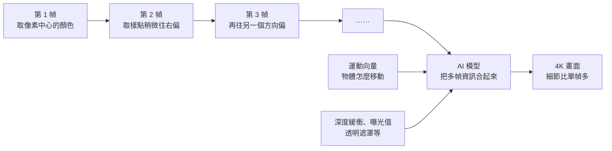

# DLSS 與 FSR 到底做了什麼:從「猜細節」到「用時間換細節」的遊戲畫面 AI 放大

**主題分類:** 科技 / 機器學習 — 影像超解析度、即時繪圖
**來源:** YouTube〈DLSS FSR 到底做了什么〉(程序员老王,2026-08-06,約 14.5 分;**該片無字幕,逐字稿以 CPU faster-whisper 轉錄、非官方字幕**)
**整理日期:** 2026-10-02

> ⚠️ 作者片尾推廣自己的「知識星球」付費社群;本文只整理公開內容。版本時間線已對照 NVIDIA、AMD 公開發布資訊核實(見 §6)。

---

## TL;DR

1. ⭐ **問題:** 4K 畫面的像素是 1080p 的 **4 倍**,每個像素的顏色都要 CUDA core 算出來 ⇒ 計算量約 4 倍,幀數掉下來。
2. ⭐⭐ **DLSS 的想法:** 先**算一張低解析度的畫面**,再用 AI 模型**放大成 4K 並補細節**;模型跑在 RTX 20 系列新增的 **Tensor Core**(專做矩陣運算)上,**幾乎不搶 CUDA core**。
3. ⚠️ **DLSS 1.0 翻車:** 本質是「**從低畫質猜高畫質**」——原本不存在的細節靠猜補不齊,畫面糊;還要**每款遊戲單獨訓練**。
4. ⭐⭐⭐ **DLSS 2.0 的關鍵:亞像素抖動(subpixel jitter)+ 運動向量(motion vector)**——每一幀的取樣點在像素內**稍微偏移**,連續多幀合起來就有更多資訊;再告訴模型物體怎麼移動,避免拖影。**一個模型通吃所有遊戲**。
5. ⭐ **AMD 的路線:** FSR 長期**不用 AI、靠手寫演算法**,所以 PS5、Xbox、手遊都能用;直到 **FSR 4(2025)才改用 AI 模型**,代價是綁定自家 RDNA 4 顯卡。
6. ⭐ **一句話:** 「**螢幕上看到最清晰的那一幀,從來沒有被真正渲染出來過**——它是幾十張模糊畫面疊出來的。」

---

## 1. 為什麼需要「放大」

| 解析度 | 像素數 | 相對 1080p |
|---|---|---|
| 1080p | 1920 × 1080 ≈ 207 萬 | 1× |
| 4K | 3840 × 2160 ≈ 829 萬 | **4×** |

- 每個像素的顏色都由 **CUDA core**(做基本浮點運算)一個一個算出來 ⇒ 像素多 4 倍,一幀計算量約多 4 倍。
- **DLSS 的思路:** 4K 來不及渲染,就**渲染 1440p 甚至 1080p**,再交給 AI **放大到 4K 並補細節**,不像一般拉伸那麼糊。

> 📌 老王指出命名不太精確:**Super Sampling(超取樣)**一般指「先算高清再縮小,用來抗鋸齒」;DLSS 做的是**從低清生成高清**,正確的說法應該是 **Upscaling**——「更適合的名字其實是 Deep Learning Upscaling」。

---

## 2. DLSS 1.0:靠猜,翻車了

| 項目 | 內容 |
|---|---|
| **硬體背景** | 2018 年 8 月 RTX 20 系列發表,主打光線追蹤的 **RT Core**,同時「悄悄」加入了源自科學計算卡(如 Tesla V100)的 **Tensor Core**——今天 H100、B200 那條產品線的前身 |
| **首批遊戲** | 約半年後(2019 年 2 月)《戰地風雲 5》透過更新首批用上 |
| **模型** | **卷積神經網路(CNN)**,最經典的影像處理架構 |
| **訓練** | 成對的圖:**低解析度當輸入,高解析度當目標**;輸出與真實高清圖比較,反覆調整參數——這就是 DLSS 裡的 **DL(Deep Learning)** |

**⚠️ 兩個問題:**
1. **每款遊戲都得單獨訓練**:用 Minecraft 練的模型放到《太空戰士》,「三次元的王者怕不是要變成方塊人」;同一款遊戲還得涵蓋陰天、雨天、雪地、城市、森林……工作量巨大。
2. ⭐ **畫面糊**:「DLSS 的本質就是**猜**——**很多細節在原始畫面中本來就不存在,光靠猜不可能補齊。**」

**AMD FSR 1(2021):** 原理同樣是「從低畫質猜高畫質」,效果同樣堪憂;差別在 AMD **走開源、不依賴 AI**,靠大量**手寫規則**——因為不是所有顯卡都有矩陣運算單元。

---

## 3. ⭐⭐⭐ DLSS 2.0:用「時間」換細節

### 3.1 問題出在哪:資訊不足

渲染一幀分兩階段:
| 階段 | 內容 | 與解析度的關係 |
|---|---|---|
| **① 擺放物體** | 計算各物體頂點在 3D 空間的座標 | 純數學,**與解析度無關** |
| **② 投影上色** | 把 3D 物體投影到網格(例如 1920×1080),**只計算每個格子「中心點」的顏色**,用它填滿整個格子 | 解析度越高格子越多 |

⚠️ **資訊就是在第②步丟掉的**:每個像素只取了中心點的顏色,周圍的細節都捨棄了。單張圖無法避免。

### 3.2 解法:亞像素抖動(Subpixel Jitter)

- 但遊戲**不是一張圖,而是連續的畫面**:第一幀取中心點,下一幀**稍微偏一點**取旁邊的顏色,再下一幀換個方向……**取樣點在一個像素範圍內隨時間「抖動」**。
- ⭐ 單張畫面細節沒變多,但**連續多幀合起來就有了**;而且解析度沒變,**渲染成本幾乎不變**。

### 3.3 解決拖影:運動向量(Motion Vector)

- ⚠️ 抖動只對**靜止物體**有效;物體一移動,「同一位置」取到的已不是同一部分 ⇒ 預測時產生**拖影(ghosting)**。
- 解法:告訴模型**物體在幀與幀之間怎麼移動**。例:物體這一幀在 (100, 100),上一幀在 (90, 100),差值就是**運動向量**。
- ⭐ 運動向量在第①步擺放物體時**很容易算出來**,幾乎沒有額外開銷。
- 同類的便宜資訊還有**深度緩衝(Z-buffer,誰在前誰在後)**、**曝光值**;另有少量需要額外計算的,如 **reactive mask、透明遮罩**——加起來仍**遠少於直接渲染高解析度畫面**。

> ⭐ 老王:「**到了這裡,DLSS 才有了真正的價值。**」而且改良後**一個模型就能搞定所有遊戲**,不必每款單獨訓練。

---

## 4. 之後的發展

| 年份 | NVIDIA | AMD |
|---|---|---|
| 2022 | **DLSS 3**:新增**幀生成**(另一個故事) | **FSR 2**:也改用多幀累積的亞像素抖動 + 運動向量,但**仍是手寫演算法,不依賴模型、不挑硬體** |
| 2023 | | **FSR 3**:跟上幀生成,**依然不靠 AI**——「AMD 程式設計師的水準是真的高,頭也是真的鐵」 |
| 2025 | **DLSS 4**:模型從 CNN 換成 **Vision Transformer**,用**自注意力**評估每個像素的相對關係,畫質再提升 | **FSR 4**:**終於改用 AI 模型**;代價是**綁定自家 RDNA 4 顯卡** |

> 「自此,遊戲畫面終於來到了大 AI 時代。」

📎 Vision Transformer 原理見本庫 [[vit-vision-transformer-how-llm-sees-images]](程序员老王系列)。

---

## 5. 結語

> 「DLSS 和 FSR 神奇嗎?確實很神奇。**我們在螢幕上看到的最清晰的那一幀,居然從來沒有被真正渲染出來過**——它是由幾十張模糊的畫面一點一點疊出來的。」
> 「過去所有都是不完美的,而當所有的不完美疊在一起,就成了此刻最清晰的現在。」

---

## 6. 核實

| 說法 | 結果 |
|---|---|
| RTX 20 系列 2018 年 8 月發表,首度在遊戲卡加入 Tensor Core | ✅ 與公開資訊一致 |
| 《戰地風雲 5》2019 年 2 月起支援 DLSS | ✅ |
| DLSS 1.0 需每款遊戲訓練、畫質評價不佳 | ✅ |
| FSR 1(2021)為非 AI 空間放大 | ✅ |
| DLSS 2.0(2020)改用時間累積與運動向量、通用模型 | ✅ |
| FSR 2(2022)時間放大、仍非 AI;FSR 3(2023)幀生成 | ✅ |
| DLSS 4(2025)Transformer 模型 | ✅ |
| FSR 4(2025)改用 ML、僅支援 RDNA 4 | ✅ |

---

## 7. 應用案例

### 案例一:遊戲設定怎麼選

| 你的情況 | 建議 |
|---|---|
| 顯卡跑不動目標解析度 | 開 DLSS / FSR 的**品質(Quality)**模式,幀數提升、畫質損失最小 |
| 快速移動的競技遊戲出現**拖影** | 換成較高的內部解析度模式,或關閉幀生成(幀生成會增加輸入延遲) |
| 非 NVIDIA 顯卡、主機、掌機 | FSR(早期版本不挑硬體) |

### 案例二:把「時間累積」思路用在別處

- **監視器影像增強、手機夜景模式**:同樣是**多張連拍對齊後合成**,用時間換細節。
- **核心條件**:要能**對齊**(知道每一幀之間的位移,也就是運動向量);對不齊就會鬼影。

### 案例三:理解「AI 補細節」的極限

- 單張低解析度圖 → AI 放大:**細節是「猜」的**,適合觀賞,**不適合作為證據**(例如放大監視器畫面的車牌、人臉)。
- 多幀資訊 → AI 合成:細節有實際取樣依據,可信度較高,但仍可能在快速移動處出錯。

---

## 來源

- YouTube:[DLSS FSR 到底做了什么](https://www.youtube.com/watch?v=TtZ0WM-91GM)(程序员老王,2026-08-06)——**該片無字幕,逐字稿以 CPU faster-whisper 轉錄、非官方字幕**
- NVIDIA:[DLSS 技術總覽](https://www.nvidia.com/en-us/geforce/technologies/dlss/)
- AMD:[FidelityFX Super Resolution](https://www.amd.com/en/products/graphics/technologies/fidelityfx/super-resolution.html)、[GPUOpen — FSR](https://gpuopen.com/fidelityfx-superresolution/)

**Whisper 專有名詞還原對照:** 张亮核性 → Tensor Core(張量核心);光纤追踪 → 光線追蹤;DLSs / DLS S → DLSS;FS2.2.零 / FS2 3.0 → FSR 2.0 / FSR 3.0;亚象素抖动 → 亞像素抖動(subpixel jitter);真生长 / 真生厂 → 幀生成;V-SEN Transformer → Vision Transformer;卷机神经网络 → 卷積神經網路。
