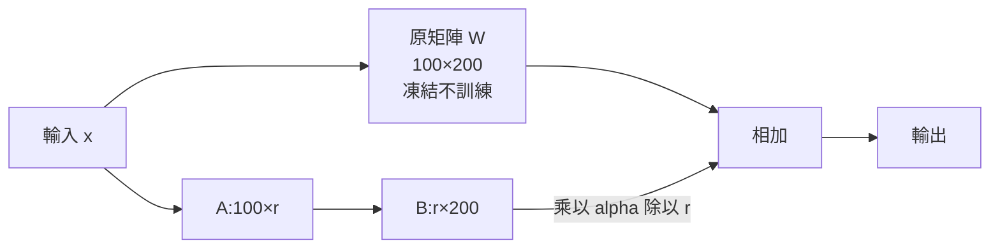

# LoRA 是什麼:微調為什麼吃顯存,以及「兩個小矩陣」怎麼把 26GB 壓到 8GB(程序员老王)

**主題分類:** 科技 / 機器學習 — 模型微調
**來源:** YouTube〈什么是LoRA 大模型微调是怎么回事〉(程序员老王,2026-03-19,約 13 分;無字幕,逐字稿以 CPU faster-whisper 轉錄、非官方字幕)
**整理日期:** 2026-10-02

> ⚠️ 作者在說明欄推廣其付費「知識星球」。顯存帳單是影片的**粗估**(整理者已驗算),實際會因框架、序列長度、batch 而不同。

---

## TL;DR

1. ⭐ **能調的只有參數矩陣**(例如注意力的 Q/K/V projection);輸入、中間結果是外部給的或算出來的。訓練 = 比較輸出與期望、不斷調參數。
2. ⭐ **預訓練 vs 微調**:原理完全一樣,差在資料。預訓練教「一切知識」——✅ Qwen3 用約 **36 兆 token**(約 70–140TB),**99% 以上的訓練資源花在這裡**;**SFT(監督微調)**只教「怎麼對話」,資料量約預訓練的幾萬分之一。
3. ⭐⭐ 但**微調的顯存和預訓練一樣多**:1.5B 參數的模型,全量微調粗估要 **26GB**——光 AdamW 的 FP32 狀態就 18GB,消費級顯卡裝不下。
4. ⭐⭐⭐ **LoRA(Microsoft,2021)**:原矩陣**凍結不動**,旁邊加兩個小矩陣 **A(d×r)、B(r×k)**,訓練只調它們,推論時把 A·B 加回原矩陣。100×200 的矩陣、r=8 ⇒ 只調 2,400 個數(**12%**);整體顯存約降到 **8GB**。
5. ⭐ **為什麼有效**:微調本來只需要改變「不到 1%」的東西,只是這些變化散布在整個模型、人工挑不出來——LoRA 讓訓練自己把它們濃縮進低秩矩陣。「**不是 LoRA 神奇,而是要做的事本來就只要 1% 的變化。**」

---

## 1. 預訓練、SFT、微調

| 階段 | 資料 | 目的 | 算力 |
|---|---|---|---|
| **預訓練** | 一般文字,包羅萬象;商用模型原始資料 PB 級,清洗後仍有幾十上百 TB | 教會模型「什麼是高考、哈利波特、一鍵三連」 | **99% 以上** |
| **SFT(監督微調)** | 對話格式:「使用者:你好 / 模型:你也好」 | 讓模型知道使用者的話是問題、回覆該是答案(否則你說「你好」,它會接「是一種很常見的問候語」) | 不到 1% |
| **領域微調** | 特定類型文本(例:文言文、客服紀錄) | 讓回覆集中到特定風格或領域 | 很少 |

✅ Qwen3 官方:預訓練約 **36 兆(36T)token**;每 token 約 2–4 bytes ⇒ 約 70–140TB。

> 影片開場:作者微調了一個說文言文的模型,問它「如何微調模型」,它答「明其意、擇其法、利其器」之類的文言句(依聽寫推測)。

---

## 2. 顯存帳單:為什麼全量微調貴

以 DeepSeek 蒸餾出的 **1.5B 參數**小模型(約 3.56GB)為例,FP16:

| 項目 | 推論 | 全量微調 | LoRA(r=8,粗估) |
|---|---|---|---|
| 模型參數(FP16) | 3GB | 3GB | 3GB + LoRA 參數 |
| KV cache + 中間激活值 | ~2GB | ~2GB | ~2.6GB |
| 梯度(每個可訓練參數一份) | — | 3GB | 只有可訓練部分 |
| AdamW 狀態(FP32:主權重副本 + 一階動量 + 二階動量) | — | 6 + 6 + 6 = 18GB | 只有可訓練部分 |
| **合計** | **~5GB** | **~26GB** | **~8GB**(約原本 30%) |

- 梯度與優化器狀態**和「被調整的參數數量」成正比** ⇒ 21GB × 12% ≈ 2.5GB;前向多了 12% 參數約 +0.6GB ⇒ 5.6GB;合計約 8GB。
- 作者對比:「英偉達 5090D 顯存 24GB、要價兩萬人民幣以上」——全量微調連 1.5B 玩具模型都裝不下。(📌 RTX 5090D 有 32GB 與 24GB(5090D v2)兩版;結論不變。)
- 為什麼不省 KV cache/激活值?理論上可以重算(gradient checkpointing),但會慢 2–3 成,而且只佔 2GB,不划算。

---

## 3. LoRA 怎麼做

### 3.1 為什麼不直接挑一部分參數來訓

矩陣裡哪些數字重要,由訓練資料和模型當下狀態共同決定——**我們控制不了,也不知道該挑哪些**。

### 3.2 兩個小矩陣



- 100×200 的原矩陣有 2 萬個參數;LoRA 建立 **100×r** 與 **r×200** 兩個矩陣,相乘得到一樣大的 100×200,**加到原矩陣上**當新參數。
- r=8 ⇒ 100×8 + 8×200 = **2,400 個**,約原本的 **12%**。
- **訓練**:原矩陣不動,只訓練兩個小矩陣;**推論**:用相加後的結果(可以事先合併,零額外延遲)。
- 論文數據:**r 設成 1 或 2 這種極端值,效果依然不差**。

### 3.3 名字拆解

| 字 | 意思 |
|---|---|
| **Lo**w | r 值很小(很 low) |
| **R**ank | r 就是矩陣的秩 |
| **A**daptation | 把小矩陣乘積加到原矩陣上「適配」 |

⇒ **用秩很小的矩陣去適配一個大矩陣。**

**工程細節:** 乘積加回前還會乘上 **α / r**;α 人為設定(作者說常見初始值為 2r)。目的是**換 r 時更新量級保持穩定**,不必重調學習率。另外(影片未提):論文把 **B 初始化為 0**,所以訓練開始時 A·B = 0,模型行為與原模型完全相同。

> 🔎 **比例補充:** 影片的 12% 來自 100×200 的玩具矩陣。真實模型矩陣大得多:4096×4096、r=8 ⇒ 8×(4096+4096) = 65,536,只佔原矩陣 16,777,216 的 **0.39%**;再加上通常只對部分層(如注意力的 Q/V)加 LoRA,可訓練參數常不到全模型的 1%。所以真實的顯存節省往往比影片的 30% 更多。

---

## 4. 為什麼只調一點點就夠

- 無法嚴謹證明(大模型仍不可解釋),但可以側面理解:預訓練要從零學會一切;微調只是改說話方式或補某個領域。
- 微調的資料與算力都不到預訓練的 1% ⇒ **需要改變的「量」本身就很小**,只是散布在整個模型裡、人工挑不出來;LoRA 讓訓練**自己把重要的變化壓縮進低秩矩陣**。

> 老王:「我們以為改變命運需要一場聲勢浩大的顛覆,但也許只是每天一個小習慣、一次輕微的認知改變——哪怕只是 1% 的變化,只要選對了參數,在時間的正向傳播下,足以重塑未來的軌跡。希望你我都能找到自己的 LoRA 矩陣。」

---

## 5. 應用案例

### 案例一:用 Hugging Face PEFT 微調一個 1.5B 模型(單張遊戲卡)

```python
from transformers import AutoModelForCausalLM, AutoTokenizer
from peft import LoraConfig, get_peft_model

name = "deepseek-ai/DeepSeek-R1-Distill-Qwen-1.5B"
model = AutoModelForCausalLM.from_pretrained(name, torch_dtype="auto", device_map="cuda")
tok = AutoTokenizer.from_pretrained(name)

cfg = LoraConfig(
    r=8, lora_alpha=16,                    # alpha = 2r,影片提到的常見設定
    target_modules=["q_proj", "v_proj"],   # 只在注意力的 Q、V 加 LoRA
    lora_dropout=0.05, task_type="CAUSAL_LM",
)
model = get_peft_model(model, cfg)
model.print_trainable_parameters()         # 可訓練參數通常遠低於 1%
# 接著照一般 Trainer / 自寫訓練迴圈訓練(見 pytorch-from-zero-transformer-series §5)
model.save_pretrained("lora-wenyan")       # 只存 LoRA 權重,檔案只有幾 MB
```

情境:想讓客服模型改用公司固定語氣,準備 2,000 筆「問題 → 標準回覆」對話,用 LoRA 在 RTX 4070(12GB)上就能練;不同客戶各存一份幾 MB 的 LoRA,共用同一個底模型。

### 案例二:用顯存公式先估再買卡

全量微調粗估 ≈ 參數量 × (2 FP16 權重 + 2 梯度 + 12 AdamW FP32) = **約 16 bytes/參數** + 激活值。
- 7B 模型 ⇒ 7 × 16 = 112GB(要多卡)
- 7B + LoRA ⇒ 權重 14GB + 少量可訓練參數狀態 + 激活值 ⇒ 約 16–20GB(單張 24GB 卡可行)
- 再加 4-bit 量化底模(QLoRA)⇒ 權重降到約 4GB,12GB 卡也能練。

### 案例三:什麼時候「不該」用微調

要模型記住**會變動的事實**(價目表、最新政策)⇒ 用 RAG,不要微調;要改的是**風格、格式、固定流程**(文言文、JSON 輸出、客服口吻)⇒ LoRA 很適合。

---

## 來源

- [YouTube:什么是LoRA 大模型微调是怎么回事(程序员老王,2026-03-19)](https://www.youtube.com/watch?v=hZ6fSjPGQWM)(無字幕,逐字稿以 CPU faster-whisper 轉錄、非官方字幕)
- 論文:[LoRA: Low-Rank Adaptation of Large Language Models](https://arxiv.org/abs/2106.09685)(Hu et al.,Microsoft,2021)
- 論文:[QLoRA: Efficient Finetuning of Quantized LLMs](https://arxiv.org/abs/2305.14314)(Dettmers et al.,2023)
- [Qwen3 Technical Report](https://arxiv.org/abs/2505.09388)(預訓練約 36T token)
- 工具:[Hugging Face PEFT](https://github.com/huggingface/peft)

📎 相關筆記:[[pytorch-from-zero-transformer-series]]、[[multi-head-attention-explained]]、[[llm-abliteration-refusal-direction]](另一種不重訓、直接改權重的方法)

**Whisper 專有名詞還原對照:** 吞噬/吞吞模块 → Attention 模組;Cure projection → Q projection;DeepSeq/DeepSync → DeepSeek;预讯链 → 預訓練;监督为条/监独微谣 → 監督微調;DAR → 但二者;阿普主 → UP 主;千问三 → Qwen3;36万1个Token → 36 兆個 token;T度/体度 → 梯度;ADAM W 优发器 → AdamW 優化器;LowRank/Laura/Loro/LOWRA → LoRA;Adaption → Adaptation;KVcash → KV cache。
