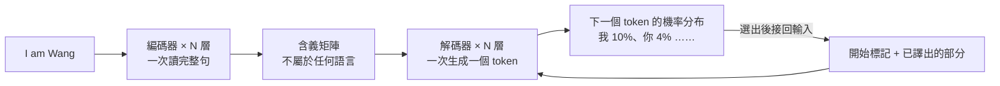

# 從零看懂神經網路與 Transformer:程序员老王「Transformer 結構拆解」系列五講

**主題分類:** 科技 / 機器學習 — 入門原理與 PyTorch 實作
**來源影片(程序员老王,皆無字幕,逐字稿以 CPU faster-whisper 轉錄、非官方字幕):**
| 講 | 影片 | 日期 | 本文章節 |
|---|---|---|---|
| ① | 〈Transformer如何成为AI模型的地基〉 | 2025-10-30 | §1 |
| ② | 〈从Linear到FeedForward AI模型的数学本质【Transformer结构拆解】〉 | 2025-11-13 | §2 |
| ③ | 〈从零搭建神经网络,识别手写数字【PyTorch】【Transformer结构拆解】〉 | 2025-11-27 | §3 |
| ④ | 〈大模型的训练原理 梯度下降:从一条直线讲起〉 | 2025-12-11 | §4 |
| ⑤ | 〈30行代码训练模型 手写数字识别【PyTorch实战】〉 | 2025-12-25 | §5 |
**整理日期:** 2026-10-02

> ⚠️ 作者在每集推廣自己的「知識星球」付費社群(完整程式碼與訓練好的參數檔放在那裡)。**本文的程式碼是依影片講解內容、用 PyTorch 標準 API 重新寫出的最小可跑版本**,不是作者的原始碼。

---

## TL;DR

1. ⭐ **Transformer 全景:** 編碼器(Encoder)把原文壓成「含義矩陣」,解碼器(Decoder)一個 token 一個 token 生成譯文;**GPT 只留解碼器**(decoder-only),**BERT 只留編碼器**(encoder-only)。
2. ⭐⭐ **兩個最基本的方塊:** **Linear(線性變換,y = Σaᵢxᵢ + b)** 與 **Feed Forward(線性層 + 啟動函數 + 線性層……)**——光這兩個就能做數字辨識。
3. ⭐⭐ **為什麼要啟動函數:** 線性變換疊再多次**還是直線**;要在中間「混入一些彎」——最常見的是 **ReLU(負數歸零)**,看似丟掉一半資訊,實際效果卻和 Sigmoid、tanh 差不多,而且算得快、緩解梯度消失。
4. ⭐⭐⭐ **訓練 = 梯度下降:** 隨機給參數 → 算損失 → **求損失對每個參數的斜率(梯度)** → 往損失變小的方向走一小步(學習率)→ 重複。一次用一批資料(batch)平均,才會收斂。
5. ⭐ **PyTorch 實作:** `Dataset` + `DataLoader` 餵資料、`nn.Module` 定義模型、`CrossEntropyLoss`(**內含 softmax**)、`loss.backward()` 自動算梯度、`optimizer.step()` 更新參數。
6. ⭐ **一個思維轉變:** 「**應該關注模型的目的是什麼,而不是參數是什麼**」——參數是試出來的,我們只決定放什麼結構。

---

## 1. 第一講:Transformer 如何成為 AI 模型的地基

### 1.1 時間線

| 年份 | 事件 |
|---|---|
| 2017 | Google〈**Attention Is All You Need**〉提出 Transformer |
| 2018 | Google 的 **BERT** 刷新幾乎所有排行榜 |
| 2019 | OpenAI **GPT-2** 讓「大語言模型」進入大眾視野 |
| 之後 | GPT、Gemini、Claude、DeepSeek……**幾乎全是 Transformer 的變種** |

### 1.2 原始用途:翻譯



- 每一層都是**相同結構、不同參數**的運算(例如第一層是 2x+3、第二層是 7x+1……)。**這些 a、b 就是模型參數**;訓練就是自動調整它們。傳說 GPT-4 有 1.8 兆個這樣的數字(未經官方證實)。
- 解碼器**每生成一個 token 就完整跑一遍**,而編碼器整句只跑一次 ⇒ 這就是**為什麼 API 的輸出比輸入貴得多**。
- **溫度(temperature)**:給機率不高的 token 一些機會;溫度 0 就只選最高的。**top-k**:只從前 k 個最可能的 token 裡選。
- ✅ GPT-2 認識 **50,257** 個 token,所以每一步輸出 50,257 個機率,加起來 100%。

### 1.3 GPT 與 BERT:各取一半

| | 結構 | 訓練方式 | 擅長 |
|---|---|---|---|
| **GPT 系列** | **只留解碼器**(decoder-only) | **自監督**:任何現成文字都能用——輸入「我」要它輸出「是」,輸入「我是」要它輸出「老」…… | 文字接龍、生成 |
| **BERT** | **只留編碼器**(encoder-only) | 挖掉中間一個字要它補(「我 _ 老王」→「是」) | 理解文意、抽取資訊(例如抽出人名) |
| 原始翻譯模型 | 編碼器 + 解碼器 | **監督學習**:需要成對的原文與譯文 | 翻譯 |

> 老王:「人生的上半場像一個巨大的編碼器,拚命學習、經歷、閱讀,把世界壓縮成獨一無二的含義矩陣;下半場更願意輸出——表達、創作、傳承。」

---

## 2. 第二講:從 Linear 到 Feed Forward

### 2.1 線性變換:最基本的運算

所有 AI 模型都是對數字的運算;最基本的運算只有**加法與乘法**。
**y = a₁x₁ + a₂x₂ + … + aₙxₙ + b** —— 這就是 **Linear** 方塊。

**「吃貨模型」例子:**
| 輸入 | 參數(權重 weight) |
|---|---|
| 喝水 1 杯 | a₁ = 每杯熱量 |
| 吃包子 2 個 | a₂ = 每個熱量 |
| 搬磚 3 小時 | a₃ = 每小時熱量(負數) |
| 吃蓋飯 4 碗 | a₄ = 每碗熱量 |
| (什麼都不做) | **b = 偏置 bias**(基礎代謝,負數) |

- 再加一組參數(每件事的耗時),就同時算出**熱量與時間** ⇒ 把 **4 維向量映射成 2 維向量**。
- ✅ GPT-2 XL 最後的 Linear 層:輸入 **1600 維**的內部表示,輸出 **50,257 維**(每個 token 的匹配程度)。

> ⭐⭐ **思維轉變:** 吃貨模型的參數是**手寫**的,我們知道每個數字的意思;**AI 的參數是訓練出來的**,我們不知道每個數字的意義,只知道整組效果好。⇒「**應該關注模型的目的,而不是參數是什麼。**」我覺得食物與熱量有線性關係,就放一個 Linear;行不行,訓練完再看。

### 2.2 為什麼需要啟動函數

- 真實世界不是直線(吃超過 10 碗消化不了,再多就進醫院)。
- 直接寫成複雜的非線性公式?**理論上可以,工程上不行**:難以訓練,也沒有擴展性——「也許能搭出吃貨模型,但永遠搭不出 GPT」。
- 疊很多層線性變換?**y = a₂(a₁x + b₁) + b₂ = (a₁a₂)x + (a₂b₁ + b₂),還是直線**——「直的就是直的,再多次也不會變彎」。
- ⭐ 解法:在線性層之間**混入非線性**——**啟動函數(activation function)**。

| 啟動函數 | 特性 |
|---|---|
| **Sigmoid、tanh** | 平滑、非線性;早期最常見。⚠️ 輸入很大時輸出幾乎不變 ⇒ **梯度消失**,難訓練 |
| ⭐ **ReLU** | **負數一律回傳 0,正數原樣回傳**。看似丟掉一半資訊,實際效果與 Sigmoid/tanh 差不多,而且**計算極簡、正區間沒有梯度消失** ⇒ 成為主流 |
| **GELU** | ReLU 的改良版,保留計算簡單的優勢,又不完全捨棄負數區間的變化 |

⚠️ **容易混淆:** 線性層**有參數**(要從資料學資訊);**啟動函數沒有任何參數**(只負責讓模型能表示非線性)。

### 2.3 Feed Forward = 前饋神經網路 = MLP

**線性層 → 啟動函數 → 線性層 → 啟動函數 → … → 線性層收尾**——這就是**前饋神經網路(FNN)/ 多層感知機(MLP)**,也就是 Transformer 裡那個 **Feed Forward** 方塊。

✅ 老王的實驗:1 → 128 → 256 → 1,中間用 ReLU,**共 33,537 個參數**(128+128、128×256+256、256+1),用 2,000 個隨機資料點訓練後,**幾乎分毫不差地擬合出「吃貨函數」的三段曲線**——「但我們依然不知道它為何能如此相似。**AI 不是世界,而是近似世界。**」

---

## 3. 第三講:用 PyTorch 搭一個數字辨識網路

### 3.1 張量(Tensor)基本功

| 概念 | 說明 |
|---|---|
| `nn.Linear(3, 5)` | 3 維輸入 → 5 維輸出;參數 `weight`(5×3)與 `bias`(5) |
| `state_dict()` | 查看參數;**剛建立時全是隨機值** |
| ⚠️ **向量維度 ≠ 張量維度** | 「5 維向量」= 裡面有 5 個數;「2 維張量」= 要 2 個索引才能取到一個數。老王因此改用「**形狀**」描述:weight 是 5×3、bias 是 5 |
| **批次輸入** | 只要**最後一個維度**對得上(3),前面可以任意疊:2×3 → 2×5、2×2×3 → 2×2×5 |
| **batch size** | 訓練時把 N 筆資料打包成 N×… 一起算,較快,也較容易找到資料間的規律 |

### 3.2 MNIST 資料集

- ✅ 由 **Yann LeCun**(深度學習三巨頭之一)在 1990 年代整理;**6 萬張訓練、1 萬張測試**,每張 **28×28** 灰階圖,寫著一個數字——「AI 界的 Hello World」。
- 每個像素是 **0(黑)到 255(白)**的 8 位元整數。
- **前處理:**
  - 用 `view(-1, 784)` 把 28×28 **攤平成 784**(`-1` 讓 PyTorch 自動推算;一次只能寫一個 -1)。
  - **轉小數並除以 255**,落在 0–1:數字太大會讓訓練難以收斂、甚至溢位;低精度(FP8、FP4)硬體處理大數誤差也大。

### 3.3 模型、logits 與 softmax

- **模型:** 784 → 256 → 128 → 10,中間 ReLU。
- 輸出的 10 個數是對 0–9 的**匹配分數,叫 logits**;本身沒有意義。
- ⭐ **softmax** 把 logits 變成機率:先取 **eˣ**(永遠為正、單調遞增,不改變大小排序),再除以總和。
- ⚠️ `softmax(dim=…)` 要沿正確的維度算:輸入 3×784 → 輸出 3×10 時要用 **`dim=1`**(每一列各自算),寫成 0 就會沿欄位算,錯。
- ⭐ softmax 的真正意義:**給輸出賦予「機率」的含義**,訓練時才能定義「正確答案」——寫著 6 的圖,理想輸出是「6 的機率 1、其他 0」。

---

## 4. 第四講:梯度下降——從一條直線講起

### 4.1 設定

- 最簡模型 **y = wx + b**;1000 筆資料散落在 **y = 1.5x + 2.5** 附近(上帝視角,我們其實不知道)。
- 隨機初始化 **w = 0.5、b = 1**;取一筆資料 **x = 2、y = 5.6**。

### 4.2 損失函數

- 直接用 |y_out − y_train|?在 0 有**折點**,不好求導 ⇒ 改用**平方誤差 (y_out − y_train)²**。

### 4.3 ⭐⭐⭐ 一步一步算(✅ 數字已驗算)

| 步驟 | 對 w | 對 b |
|---|---|---|
| 把其他已知數代入 | Loss = (2w + 1 − 5.6)² = **(2w − 4.6)²** | Loss = (0.5×2 + b − 5.6)² = **(b − 4.6)²** |
| 求導(連鎖律) | dLoss/dw = **8w − 18.4** | dLoss/db = **2b − 9.2** |
| 代入目前值 | w = 0.5 → 梯度 **−14.4** | b = 1 → 梯度 **−7.2** |
| 更新(學習率 0.01) | w = 0.5 − 0.01 × (−14.4) = **0.644** | b = 1 − 0.01 × (−7.2) = **1.072** |

> 📌 影片口述對 b 的導數為「2b − 9.6」,依算式應為 **2b − 9.2**;但影片算出的梯度 −7.2 與更新後 1.072 都是正確的。
> ⚠️ 計算 b 的梯度時用的仍是**更新前**的 w = 0.5——w 與 b 是**同時**更新的。

**梯度告訴我們兩件事:**
1. **正負號**:負的 ⇒ 增加 w 會讓損失變小。
2. **大小**:越接近最低點,梯度越接近 0。

**學習率(learning rate)**:太大會跳過最低點,太小要走很多步。它是**超參數(hyperparameter)**——人手設定;w、b 則是**模型參數**——從資料學來。

### 4.4 為什麼要一批一批訓練

- 資料只是**在直線附近**;快練好時來一筆離群點,又會把結果拉走 ⇒ **無法收敛**。
- ⭐ 一次取 100 筆,算 100 個損失再**平均**——**MSE(均方誤差)**;單點可能偏,平均起來會收斂到真實規律。
- 為什麼不先把 100 個點平均成一點?**直線模型可以,但模型一旦非線性,輸入的平均 ≠ 輸出的平均**;MSE 對任何模型都成立。
- ✅ 結果:batch size 100、學習率 0.01、訓練 1000 次 ⇒ **y = 1.4994x + 2.4845**,與 1.5x + 2.5 相差無幾。

**兩個新手坑:**
1. 求梯度用的是**損失函數**,不是模型函數本身。
2. 未知數是**正在調整的參數(w 或 b)**,**不是**訓練資料 x、y——訓練資料全是已知數。

> 老王:「世界上沒有人有上帝視角。我們能做的,就是找出當下的梯度——那個看起來比現在更好一點點的方向,然後邁出哪怕只有 0.01 的一小步。**只要方向是對的,都必將收斂於那個美好的未來。**」

---

## 5. 第五講:30 行程式碼訓練數字辨識模型

### 5.1 工程上的資料管線

| 元件 | 作用 |
|---|---|
| **Dataset** | 檔案與記憶體之間的中間層——資料可能是 TB 級,**不能一次全載入**;像陣列一樣存取,它自己決定載入哪些檔案。MNIST 本身就是一個 Dataset |
| **transform** | 每取一筆資料時呼叫的前處理;`ToTensor()` **同時完成轉張量與除以 255**,再攤平即可 |
| **DataLoader** | 指定 `batch_size`、`shuffle=True` 隨機取樣;可直接放進 `for` 迴圈,每次給出(圖片批次, 標籤批次) |

### 5.2 交叉熵損失(Cross Entropy Loss)

- 先 softmax 成機率,**只看正確標籤的機率 p**,損失 = **−ln p**。
- p 越接近 1,損失越接近 0、而且變化越慢(接近正解時步伐要小);p 越接近 0,損失越大、變化越快(離正解遠時步伐要大)。
- softmax 有很多 eˣ,而 ln(eˣ) = x,方便實作最佳化。
- ⚠️⚠️ **新手大坑:`CrossEntropyLoss` 內部已經包含 softmax ⇒ 模型輸出層不要再加 softmax,直接輸出 logits。**

### 5.3 最小可跑程式碼

```python
import torch
from torch import nn
from torch.utils.data import DataLoader
from torchvision import datasets, transforms

# 1. 資料:ToTensor 會轉成 0~1 的張量,再攤平成 784
tf = transforms.Compose([transforms.ToTensor(), transforms.Lambda(lambda x: x.view(-1))])
train_set = datasets.MNIST(root="data", train=True, download=True, transform=tf)
test_set = datasets.MNIST(root="data", train=False, download=True, transform=tf)
loader = DataLoader(train_set, batch_size=50, shuffle=True)

# 2. 模型:784 → 256 → 128 → 10,輸出 logits(不要加 softmax)
class MnistModel(nn.Module):
    def __init__(self):
        super().__init__()
        self.net = nn.Sequential(
            nn.Linear(784, 256), nn.ReLU(),
            nn.Linear(256, 128), nn.ReLU(),
            nn.Linear(128, 10),
        )

    def forward(self, x):
        return self.net(x)

model = MnistModel()
loss_fn = nn.CrossEntropyLoss()                       # 內含 softmax
optimizer = torch.optim.Adam(model.parameters(), lr=0.01)

# 3. 訓練:5 個 epoch
for epoch in range(5):
    for images, labels in loader:
        logits = model(images)
        loss = loss_fn(logits, labels)
        optimizer.zero_grad()                         # 清掉上一輪的梯度
        loss.backward()                               # 自動算梯度
        optimizer.step()                              # 依梯度更新參數
    print(f"epoch {epoch} loss {loss.item():.4f}")

# 4. 用「測試集」評估(影片留給觀眾的作業)
with torch.no_grad():
    correct = sum((model(x.unsqueeze(0)).argmax(1).item() == y) for x, y in test_set)
print("test accuracy:", correct / len(test_set))

torch.save(model.state_dict(), "mnist.pt")            # 之後用 load_state_dict 載入
```

**影片強調的細節:**
| 細節 | 說明 |
|---|---|
| `zero_grad()` | 每輪先清空上一輪的梯度 |
| 手動更新時用 `torch.no_grad()` | 更新參數本身**不是模型的一部分**,要排除在梯度計算之外 |
| 有些參數梯度可能是空的 | 例如刻意凍結的參數(**LoRA** 訓練就會鎖住一部分)——手動更新前要先判斷 |
| **epoch** | 整份訓練資料重複幾輪,也是超參數 |
| ⚠️ 用測試集驗證 | 影片示範時直接拿訓練集測;實務上要用**測試集**,避免**過擬合**(上面程式碼已補上) |
| **Optimizer** | 固定學習率效果有限;**Adam** 這類優化器會依梯度動態調整,`optimizer.step()` 取代手動更新,是標準做法 |

📎 延伸:LoRA 怎麼「鎖住一部分參數」,見 [[lora-fine-tuning-explained]];梯度與記憶體頻寬的關係,見 [[nvidia-moat-memory-bandwidth-cuda-software]]。

---

## 6. 應用案例

### 案例一:把「吃貨模型」換成你的問題

任何「多個數字 → 一個或多個數字」的預測問題,都能用同一套骨架起步:
| 問題 | 輸入 | 輸出 |
|---|---|---|
| 房價估計 | 坪數、屋齡、樓層、離捷運距離 | 價格 |
| 用電預測 | 溫度、星期幾、時段 | 用電量 |
| 客戶流失 | 使用天數、最近登入間隔、客服次數 | 流失機率(分類 ⇒ 用 CrossEntropyLoss) |
步驟:**標準化輸入(像除以 255 那樣)→ MLP → 選對損失函數(回歸用 MSE、分類用交叉熵)→ Adam → 用測試集驗證**。

### 案例二:除錯清單(新手最常踩的坑)

| 症狀 | 可能原因 |
|---|---|
| 損失不下降、變 NaN | 輸入沒標準化;學習率太大 |
| 準確率異常低 | 輸出層多加了 softmax(和 CrossEntropyLoss 重複) |
| 機率加總不是 1 | `softmax` 的 `dim` 寫錯 |
| 梯度越疊越大 | 忘了 `zero_grad()` |
| 訓練集 99%、測試集很差 | 過擬合;用測試集驗證、加資料或正則化 |

### 案例三:用「API 輸出比輸入貴」理解成本

解碼器每輸出一個 token 都要完整跑一遍模型,輸入卻能一次處理 ⇒ 設計 AI 應用時,**能讓模型少寫(例如只回傳選項代碼而非長段說明)**,就能顯著省錢。

---

## 來源

- YouTube(程序员老王,皆無字幕,逐字稿以 CPU faster-whisper 轉錄、非官方字幕):
  - [Transformer如何成为AI模型的地基](https://www.youtube.com/watch?v=mpGiFuRYrDk)(2025-10-30)
  - [从Linear到FeedForward AI模型的数学本质【Transformer结构拆解】](https://www.youtube.com/watch?v=PoQLjK2hlZk)(2025-11-13)
  - [从零搭建神经网络,识别手写数字【PyTorch】【Transformer结构拆解】](https://www.youtube.com/watch?v=OCcHTUiNnGI)(2025-11-27)
  - [大模型的训练原理 梯度下降:从一条直线讲起](https://www.youtube.com/watch?v=FOHyospzUd4)(2025-12-11)
  - [30行代码训练模型 手写数字识别【PyTorch实战】](https://www.youtube.com/watch?v=qL6ca-mIeMI)(2025-12-25)
- 論文:[Attention Is All You Need](https://arxiv.org/abs/1706.03762)(Vaswani et al.,2017)、[BERT](https://arxiv.org/abs/1810.04805)(Devlin et al.,2018)
- 官方文件:[PyTorch nn.Linear](https://pytorch.org/docs/stable/generated/torch.nn.Linear.html)、[CrossEntropyLoss](https://pytorch.org/docs/stable/generated/torch.nn.CrossEntropyLoss.html)、[torchvision MNIST](https://pytorch.org/vision/stable/generated/torchvision.datasets.MNIST.html)
- 資料集:[MNIST(Yann LeCun)](http://yann.lecun.com/exdb/mnist/)

📎 相關筆記:[[llm-explained-3blue1brown]](另一個視角的 Transformer 入門)、[[token-vs-embedding-llm-and-rag]]、[[multi-head-attention-explained]](同系列:多頭注意力)

**Whisper 專有名詞還原對照:** Incoder/编马器 → Encoder(編碼器);结码器/结砂器 → Decoder(解碼器);Railu/Rylo → ReLU;Galux → GELU;潜魁神经网络 → 前饋神經網路;Minist/Minister → MNIST;杨丽坤 → Yann LeCun;Wate → weight;Petroch/Pytors/派托车 → PyTorch;DataSite/data sight → Dataset;Tross Entropy / Crossentrophy → CrossEntropy;Full On P → −ln p;T度 → 梯度;Idom → Adam;Apple(超參數) → epoch;Laura → LoRA。
