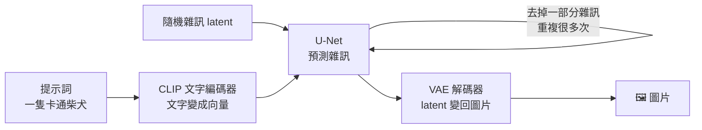
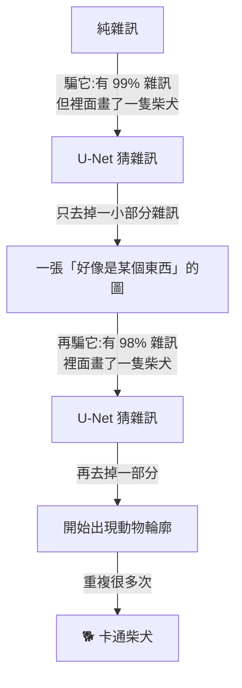

# Stable Diffusion 是如何畫畫的:U-Net、CLIP、VAE 三個零件與「一路對 AI 說謊」

**主題分類:** 科技 / 機器學習 — 影像生成模型原理
**來源:** YouTube〈Stable Diffusion是如何画画的〉(程序员老王,2026-09-24,約 16 分;**該片無字幕,逐字稿以 CPU faster-whisper 轉錄、非官方字幕**)
**一手素材核實:** Rombach et al.〈[High-Resolution Image Synthesis with Latent Diffusion Models](https://arxiv.org/abs/2112.10752)〉(CVPR 2022)、Ho et al.〈[DDPM](https://arxiv.org/abs/2006.11239)〉(2020)、Radford et al.〈[CLIP](https://arxiv.org/abs/2103.00020)〉(2021)、Ho & Salimans〈[Classifier-Free Diffusion Guidance](https://arxiv.org/abs/2207.12598)〉(2022)
**整理日期:** 2026-10-02

> ⚠️ 作者在片尾推廣自己的「知識星球」付費社群(程式碼與 ComfyUI 流程檔放在那裡);本文只整理公開講述的原理。
> ⏳ **版本時效:** 影片講的是經典的 Stable Diffusion(1.x / 2.x / SDXL 一系)架構;較新的模型(如 SD3、Flux)改用 Transformer 取代 U-Net、並採用不同的訓練目標與文字編碼器,但「在潛空間裡逐步去噪」的核心思路相同。

---

## TL;DR

1. ⭐ **一個標準 SD 模型 = 三個零件:** **U-Net**(畫畫:預測雜訊)、**CLIP**(把文字翻成畫畫能懂的向量)、**VAE**(把圖片壓縮成小很多的「潛空間」表示)。
2. ⭐⭐ **U-Net 怎麼練:** 拿一張圖,按隨機比例混入高斯雜訊,給模型「加雜訊的圖 + 雜訊比例 + 文字描述」,**要它猜出加進去的雜訊**。猜得出雜訊,就能算回原圖——**而它全程沒看過原圖**。
3. ⭐⭐⭐ **怎麼畫:** 給它一張**純雜訊**,騙它「這裡面其實畫了一隻卡通柴犬」;它努力找出一點輪廓,我們只去掉一部分雜訊,再騙它一次……「**謊言說一千次就是真理**」——經典 DDPM 剛好要迭代 1000 次。
4. ⭐ **CLIP 的作用:** 「一隻卡通柴犬」和「二次元小黃狗」一個字都不一樣,經過 CLIP 後向量卻很接近 ⇒ U-Net 只要理解**概念**,不必應付千變萬化的文字。
5. ⭐ **VAE 的作用:** 1024×1024×3 的圖壓成 128×128×4 的 latent,**資料量約 1/12**;U-Net 全程只在 latent 上工作,最後才解碼回圖片。
6. ⭐⭐ **負向提示詞:** 直接寫「一隻不戴墨鏡的狗」常常反而畫出戴墨鏡的狗——因為 CLIP 的訓練資料**幾乎都是肯定句**。解法是正向寫「狗」、負向寫「戴墨鏡的狗」,再用公式把「負的墨鏡」加上去。

---

## 1. 三個零件

| 零件 | 做什麼 | 一句話 |
|---|---|---|
| **U-Net** | 給它帶雜訊的 latent、雜訊比例、文字向量,**輸出它認為的雜訊** | 畫畫的手 |
| **CLIP(文字那一半)** | 把文字轉成 text embedding | 翻譯官 |
| **VAE** | 圖片 ↔ latent 的壓縮與解壓 | 壓縮器 |

> 老王:「理解一個模型最簡單的方法,就是**看它的訓練過程**。」

---

## 2. ⭐⭐ U-Net:訓練時猜雜訊,生成時被騙

### 2.1 訓練

| 步驟 | 內容 |
|---|---|
| ① | 拿一張圖與它的文字描述 |
| ② | 隨機產生一份**高斯雜訊**,再隨機抽一個**雜訊等級**(例如 10%) |
| ③ | 按這個等級把原圖與雜訊混在一起(⚠️ 「10%」不是每個像素改 10%,而是混入的雜訊占 10%,有明確的數學定義) |
| ④ | 給 U-Net:**帶雜訊的圖 + 雜訊等級 + 文字描述**;要它輸出**那份雜訊** |
| ⑤ | 看大量帶雜訊的圖,讓它輸出的雜訊越來越接近真實雜訊 |

> ⭐ 關鍵:「**帶雜訊的圖、模型猜出的雜訊、雜訊含量**——有這三個就能用數學把原圖算回來。而這個過程中,**模型從沒看過原圖**。」

### 2.2 生成:一路對它說謊

- 第一次就想一口氣算回原圖**幾乎一定失敗**:輸入根本是純雜訊,模型頂多找到模糊輪廓。
- 所以每次**只去掉一點雜訊**,再把結果送回去、再騙一次。
- ✅ 經典 **DDPM** 生成一張圖要迭代 **1000 步**(老王:「不知道是不是受了『謊言說一千次就是真理』的啟發」);實務上的採樣器可以用幾十步完成。

---

## 3. ⭐ CLIP:讓 U-Net 只學「概念」

**問題:** 「一隻卡通柴犬」「動畫柴犬」「二次元小黃狗」描述的是同一張圖,但**從資料角度一個字都不一樣**。直接用文字訓練 U-Net,它得**一邊學畫畫、一邊從頭學語言**。

**CLIP 怎麼練(✅ 原始 CLIP 用了約 4 億組圖文對):**
| 樣本 | 做法 |
|---|---|
| **正樣本**(柴犬圖 + 「一隻柴犬」) | 調整圖片模型與文字模型,讓兩者輸出向量的**餘弦相似度盡量高** |
| **負樣本**(汽車圖 + 「一隻柴犬」) | 讓兩者的向量**盡量遠** |

- 老王的實驗:文字「Shiba Inu」與柴犬圖相似度 **0.244**,與汽車圖只有 **0.078**。
- ⭐ SD 用的是 CLIP 的一個「**好用的副作用**」:**只看文字那一半**,描述同一內容的句子輸出會很接近 ⇒ U-Net 收到的「提示詞」其實是**一個無法用語言描述、但蘊含「卡通柴犬」概念的向量**。
- 圖片那一半在 SD 裡用不上就丟掉了;但在別處可以拿來做圖片分類(例如內容審核系統)。

📎 embedding 的概念見本庫 [[token-vs-embedding-llm-and-rag]]。

---

## 4. ⭐ VAE:在潛空間裡畫畫

| 項目 | 數字(✅ 核實) |
|---|---|
| 1024×1024 彩色圖 | 1024 × 1024 × 3 ≈ **314 萬個數字**(約 3 MB) |
| 經 VAE 編碼後的 latent | **128 × 128 × 4**(長寬各縮 8 倍、4 個通道) |
| latent 用 FP32 存 | 約 **256 KB**,約原資料的 **1/12** |

- 訓練很簡單:**先壓縮再解壓,讓輸出盡量接近原圖**,同時訓練編碼器與解碼器。
- ⚠️ 這是**有損**的:老王示範同一張圖反覆壓縮解壓 20 次,畫面逐漸劣化。
- ⭐⭐ **latent 不是「縮小的圖片」,而是模型對圖片的「理解」**:
  - 實驗:**先旋轉 latent 再解碼** → 畫面嚴重劣化;**先旋轉圖片再壓縮解碼** → 效果好得多。
  - 原因:像素旋轉時,橫線自然變成豎線;但旋轉 latent 只改變「橫線」出現的位置,**它的描述依然是一條橫線**。
- ⇒ U-Net 從頭到尾**只處理 latent**,最後才用 VAE 解碼器變回人看得懂的圖——**效率大幅提升**。這就是論文標題「**Latent** Diffusion」的由來。

---

## 5. ⭐⭐ 負向提示詞:為什麼「不戴墨鏡」反而畫出墨鏡

- **原因在 CLIP 的訓練資料**:圖文對的描述幾乎都是**肯定句**(「這是一隻狗」),很少有人替狗的照片配上「這不是一隻貓」。⇒ CLIP 天生只認得肯定句,「不戴墨鏡」裡的「墨鏡」反而被強化。
- **解法:兩套提示詞**
  - 正向:「狗」
  - 負向:「**戴墨鏡的狗**」(⚠️ 注意不是「墨鏡」,而是「戴墨鏡的狗」)
- U-Net 分別為兩套提示詞各預測一份雜訊,再組合:

  **最終雜訊 = 雜訊(戴墨鏡的狗)+ w ×〔雜訊(狗)− 雜訊(戴墨鏡的狗)〕**

  直覺:括號裡「狗 − 戴墨鏡的狗」= **負的墨鏡**;乘上使用者可調的係數 w,再加回去 ⇒ **不戴墨鏡的狗**。
- ✅ 這是 **classifier-free guidance** 的寫法;原論文用「無條件」預測當基準,負向提示詞就是把那個基準換成你不要的內容。w 就是介面上常見的 **CFG scale**。

---

## 6. 結語

> 「最開始那裡只有一片雜訊。第一步看不見柴犬,第二步也看不見;再往後輪廓出現、顏色出現、眼睛出現——突然我們指著它說:看,那裡有一隻狗。**可它究竟是從哪一步開始,不再只是一片雜訊的呢?**」
> 「天下萬物生於有,有生於無。有和無之間,也許從來就沒有一條線。」

---

## 7. 應用案例

### 案例一:寫出更有效的提示詞

| 想要 | ❌ 常見寫法 | ✅ 改寫 |
|---|---|---|
| 沒有文字的海報背景 | 「海報背景,不要文字」 | 正向:「海報背景,乾淨」;負向:「文字、字母、浮水印」 |
| 沒戴眼鏡的人像 | 「一個沒戴眼鏡的人」 | 正向:「人像」;負向:「戴眼鏡的人」 |
| 白天的街景 | 「街景,不是晚上」 | 正向:「白天的街景,陽光」;負向:「夜晚、霓虹燈」 |

### 案例二:調 CFG scale 與步數

- **CFG scale(w)太低**:圖跟提示詞不太相關;**太高**:顏色過飽和、畫面僵硬。常見從 5–8 開始試。
- **步數**:不必 1000 步;現代採樣器 20–30 步通常就夠,步數再多報酬遞減。

### 案例三:理解 latent 的特性,避開後製陷阱

想把生成的圖旋轉、鏡像:**在像素空間做**(先解碼成圖片再轉),不要直接動 latent——否則會像老王的實驗一樣嚴重劣化。

---

## 來源

- YouTube:[Stable Diffusion是如何画画的](https://www.youtube.com/watch?v=Ysn-gNHi5o8)(程序员老王,2026-09-24)——**該片無字幕,逐字稿以 CPU faster-whisper 轉錄、非官方字幕**
- 論文:[High-Resolution Image Synthesis with Latent Diffusion Models](https://arxiv.org/abs/2112.10752)(Rombach et al.,CVPR 2022)
- 論文:[Denoising Diffusion Probabilistic Models](https://arxiv.org/abs/2006.11239)(Ho et al.,2020)
- 論文:[Learning Transferable Visual Models From Natural Language Supervision(CLIP)](https://arxiv.org/abs/2103.00020)(Radford et al.,2021)
- 論文:[Classifier-Free Diffusion Guidance](https://arxiv.org/abs/2207.12598)(Ho & Salimans,2022)

**Whisper 專有名詞還原對照:** Unite/Unit → U-Net;Clip → CLIP;Coffee UI → ComfyUI;造点/造生/噪生 → 雜訊;圆图 → 原圖;taxi embedding → text embedding;Latant/Laton/前空间 → latent / 潛空間;余协/鱼咸/驴咸相似度 → 餘弦相似度;互相/负像提示辞 → 負向提示詞。
