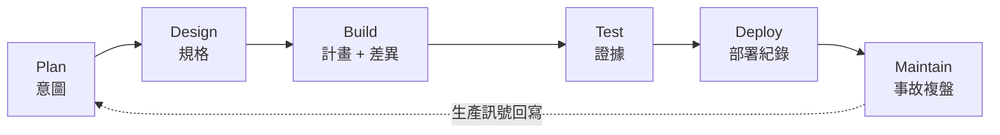
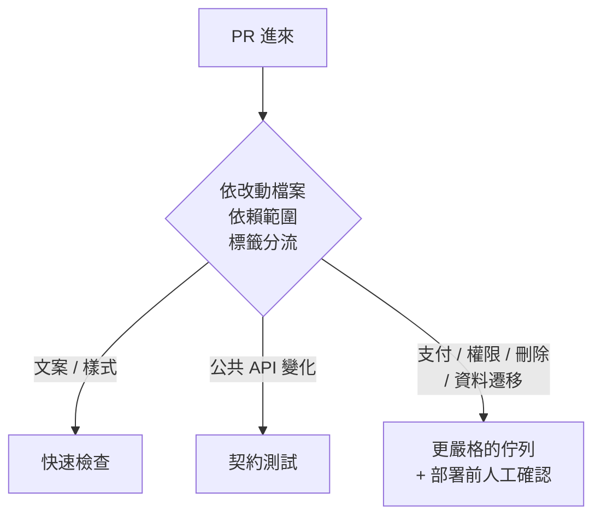

# AI 原生 SDLC 怎麼落地:程式碼變快之後,真正塞住的是驗證與評審

**主題分類:** 軟體工程 —— AI 原生交付流程與治理
**來源影片:** YouTube〈AI 原生 SDLC 怎么落地:代码变快以后,工程师该重做哪条流程〉(Why QQ / 為什麼叫 QQ,2026-08-30,約 14.7 分鐘,**官方 zh-Hans 字幕**)
**一手素材:** Anthropic 的 AI-Native SDLC Playbook(2026-08-21)與其安全實踐、Amplitude / Stripe / Spotify 的公開自述、GitLab 的效率單位

**整理日期:** 2026-09-06

> 📎 相關筆記:[[claude-code-team-how-they-work]](Anthropic 團隊自己怎麼跑這條流程)、
> [[dhh-16-threads-bottleneck-migration]](**同一個瓶頸遷移現象,個人視角版**)、
> [[agent-project-resume-enterprise-grade]]、[[enterprise-ai-adoption-race]]

---

## 0. 一句話總結

> **程式碼變便宜之後,交付不會跟著等比例變快 —— 因為 CI、測試環境、人類評審與發布視窗的容量是固定的。**
>
> ⭐⭐⭐ **生成端一旦跑得比驗證端快,待審 PR、待跑測試、待確認的風險就開始排隊。**

影片開場的畫面很具體:

> Agent 在夜裡接了任務,讀完倉庫、改完介面、補上頁面,**連續提交十幾個 PR**。
> 第二天早上程式碼躺在待審列表裡,**但沒有人急著合併** ——
> 產品要確認有沒有偏離需求、測試要判斷關鍵路徑有沒有漏、
> 安全要看權限與資料邊界、值班工程師還得知道出問題怎麼回退。

> ⭐ **「程式碼出現只是一次生成;真正的交付,從有人準備點下合併按鈕時才開始變得複雜。」**

---

## 1. 什麼是 AI 原生 SDLC(以及它跟「用 AI 補全」差在哪)

**Anthropic 把這條鏈路概括成六個階段:**



📌 **核實補充(影片未強調):官方的說法是每個階段結束時都提交一份「受版本控制的工件」,
供下一階段讀取 —— 而 `intent.md` → 規格 → 計畫 → diff → 事故紀錄這一串工件,本身就是稽核軌跡。**

### ⭐⭐ 與「把 AI 當更聰明的補全工具」的差別,落在責任交接上

| | AI 助手 | AI 原生流程成員 |
|---|---|---|
| **產出** | **建議** | **明確的工件** |
| **誰把它帶進流程** | 工程師自己 | Agent 對明確的輸入產出明確的輸出 |
| **可觀察性** | ⚠️ 幾乎沒有 | ⭐ 你可以查:**用了哪些上下文、改了哪些檔案、跑了哪些測試、在哪一步失敗** |

> ⭐ **「任務變得可觀察,團隊才有條件逐步把更多執行工作交出去。」**

### 那幾份很樸素的工件

| 檔案 | 內容 |
|---|---|
| `intent.md` | 這次要解決的**使用者問題與邊界** |
| `spec.md` | **輸入、輸出、約束、驗收條件** |
| `plan.md` | 準備修改的模組與執行順序 |
| (後續) | 測試結果、部署紀錄、事故複盤 —— **成為下一次任務的上下文** |

⭐ **這些檔案不需要長。** 一個退款入口的意圖,可以只寫清:
**角色權限、金額上限、稽核要求、冪等語意、回滾方式。**

> **「文件在這裡記錄決策,不重複程式碼。它讓人和 Agent 站在同一份事實之上工作。」**

---

## 2. ⭐⭐⭐ 用「被接受的變更」當單位,不要用 PR 數

GitLab 提出的衡量單位:**accepted change** ——
指改動經過**環境準備 → 自動檢查 → 人工複核 → 上線觀察 → 責任確認**之後,才算被團隊接受。

> ⭐ **「使用者不為 PR 數量付費,業務也不為程式碼行數付費。」**

因此 AI 原生 SDLC 的**總成本**包括:

```text
需求澄清 · 生成 · 環境 · 驗證 · 評審 · 修復 · 治理 · 維護
```

> ⚠️ **程式碼生成只是其中一項,而且正在變得更便宜。**
> **團隊若只盯生成速度,很容易忽略後面那些耗時更久、出問題代價更高的環節。**

### ⚠️⚠️ 速度會同時放大好需求和壞需求

> 原先一個含糊的需求要幾天才會造成返工,**現在它可能在半天內變成一批看似完整的改動。**
> **生成能力越強,錯誤積累得越快。**

---

## 3. 三個公司的公開數字(以及它們各自暴露了什麼)

### Amplitude —— 產能上來了,壓力就頂到前面

| 指標 | 變化 |
|---|---|
| PR 數量 | **提高到 3 倍** |
| PR 週期 | **5.2 小時 → 44 分鐘** |
| 前端 CI | **約 30 分鐘 → 3–4 分鐘** |
| 月度 Bug 報告 | **715 → 319** |

> ⭐ **它示範的是「整條管線一起擴容」** —— 候選改動增加,驗證與評審馬上會頂在前面:
> **CI 沒提速,模型就會等;預覽環境沒準備好,產品與設計無法及早確認行為;
> 所有改動都進同一條審批佇列,低風險任務也會拖慢高風險任務。**
>
> **AI 給了團隊更大的進水量,流程得有足夠大的出水口。**

### Stripe(Minions)—— 高吞吐 Agent 背後是高吞吐的基礎設施

| 項目 | 內容 |
|---|---|
| 產出 | **每週產生並合併超過 1,000 個完全由 Agent 撰寫的 PR**(⭐ 核實到的更精確數字是**逾 1,300 個/週**) |
| 前提 | **仍由人類評審** |
| 環境 | **隔離且預熱**的開發環境 |
| 執行 | **確定性**執行 Git、Lint 與測試 |
| 測試 | 能從**三百多萬項測試**中**選擇與改動相關的檢查** |

| 這個設計解什麼 | 對應手段 |
|---|---|
| 任務互相污染 | **隔離環境** |
| 啟動等待 | **預熱** |
| 沒有驗證素材 | **大規模測試庫** |
| 執行時間失控 | **相關性選擇** |
| 業務判斷 | **保留人類評審** |

> ⚠️ **「基礎設施不足時,批量提交會把團隊帶進返工和排隊。」**

### Spotify(Honk)—— 誠實地記錄了限制

| 成果 | 限制 |
|---|---|
| **已生成逾 1,500 個合併到生產環境的 PR** | ⚠️ **上下文不完整時,Agent 會交出無法合併的結果** |
| 部分遷移任務**節省 60%–90% 的時間** | ⚠️ **程式碼庫缺少統一標準時,同類錯誤會反覆出現** |
| | ⚠️ **缺少自動化測試的區域,驗證仍要回到業務團隊手裡** |

> ⭐⭐ **遺留系統帶著歷史**:概念分散在多個倉庫、舊介面還被邊緣服務呼叫、
> 文件和線上狀態有偏差、警報規則也許幾年沒人動過。
>
> **「Agent 能替你做重複勞動,卻無法補上團隊沒有結構化記錄的知識。」**
>
> ⭐ **上下文工程與回饋迴路屬於流程能力,模型參數無法替代。**

---

## 4. ⭐⭐ 四個最常見的瓶頸

| 瓶頸 | 症狀 |
|---|---|
| **需求不清楚** | ⚠️ **Agent 會高效地實現錯誤目標** |
| **驗證不足** | ⚠️ **通過編譯的程式碼也無法證明業務正確** |
| **環境與上下文混亂** | 任務卡在依賴、權限和歷史約定裡 |
| **治理缺位** | 團隊無法放心讓 Agent 碰高風險操作 |

> ⭐ **好消息:這些都可以被工程化。你不必一開始就建一套龐大平台 ——
> 可以先從一條任務鏈開始,逐步補足規格、上下文、驗證與權限。**

---

## 5. ⭐⭐⭐ 實施順序(這節是可直接執行的清單)

### ① 意圖:一份足夠短、但回答五件事的說明

```text
要服務誰 · 使用者在什麼場景遇到問題 · 改動允許碰哪些模組
· 哪些行為絕對不能發生 · 怎樣算任務完成
```

⚠️ **驗收標準要能被測試或人工觀察**,不要只寫「體驗更好」「效能更高」。

| ❌ 太寬 | ✅ 可執行 |
|---|---|
| 「優化退款流程」 | **營運角色可在 30 天內發起退款;金額不得超過原支付金額;重複請求只能生效一次;所有操作要寫稽核日誌;失敗時提示人工處理** |

> ⭐ **「意圖品質決定了生成的起點。」** 有了這些約束,Agent 才少靠猜測補全業務邏輯,
> 評審者也有一把明確的尺子。

### ② 計畫先行:別急著讓 Agent 直接改倉庫

先讓它交一份計畫:**哪些服務會受影響、準備改哪些檔案、依賴哪些介面、打算跑哪些檢查、最大風險在哪裡。**

> ⭐⭐ **「計畫偏了,工程師用幾分鐘就能拉回;程式碼改完才發現方向錯,清理成本會高得多。」**
> **Plan 階段的價值,就是把昂貴的返工提前到最便宜的時候。**

| 改動規模 | 計畫該多長 |
|---|---|
| 小改動 | 十幾行就夠 |
| **涉及資料遷移、權限變更、跨服務協定** | ⚠️ **必須補上灰度方式與回滾步驟** |

### ③ 上下文:把知識從聊天記錄與個人記憶裡拿出來

放進**能檢索、能更新、能引用**的地方:
服務邊界、介面契約、領域詞彙、程式碼規範、依賴關係、安全規則。

⭐ **從一張服務地圖開始就好:**

```text
這個服務依賴誰?哪些 API 對外承諾相容?核心資料怎麼流?
哪些測試覆蓋關鍵路徑?哪個團隊負責?
```

再把倉庫級規則寫進固定檔案,讓 Agent 每次執行都能讀取。

> ⭐ **「你不需要讓模型記住全部歷史,但要讓它在任務發生時找到關鍵事實。」**

### ④ 環境:先讓一次任務可以穩定複跑

Agent 需要的上下文也包括環境:**依賴版本、啟動腳本、測試資料、臨時憑證、模擬服務、日誌入口、網路限制**
—— 最好能用程式碼或設定複現出來。

⚠️ 否則 **Agent 可能在本地跑通一份偶然成立的結果,到了 CI 或生產預覽環境又失敗。**

**隔離同樣重要:** 每個任務盡量在獨立工作區與短期憑證裡執行 ——
**避免多個 Agent 覆蓋同一份狀態,也避免測試意外存取真實資料。**

> ⭐⭐ **「先讓一次任務可以穩定複跑,再談同時跑一百個任務。可複現性是規模化自動化的最低門檻。」**

### ⑤ 測試:在更早的位置定義正確性,尤其是業務不變量

⚠️ **Agent 很擅長寫出「像樣」的實現,也能補一批表面完整的測試。**

**業務不變量的例子(這些才是該寫死的):**

```text
訂單金額不能重複扣 · 租戶之間不能互相讀取資料
· 庫存不能變成負數 · 遷移前後關鍵欄位要保持一致
```

**測試還要分層:**

| 改動類型 | 該跑什麼 |
|---|---|
| 純函數 | 快速單元測試就夠 |
| 服務介面 | 需要驗證**契約** |
| **支付、權限、資料遷移** | ⚠️ **完整鏈路 + 人工批准** |

> ⭐ **「驗證能力決定了團隊能放多快地讓 Agent 前進。」**

### ⑥ CI:讓每個 PR 獲得與風險匹配的證據



⚠️ **也要盯排隊時間** —— CI 的排隊時間、失敗重跑、測試穩定性,都會影響 Agent 的**有效吞吐**。

> ⭐ Amplitude 把前端 CI 從約 30 分鐘壓到 3–4 分鐘,說明**流程優化本身就能釋放大量生成能力**。
> **「模型提交得再快,也繞不過一個慢到讓所有任務排隊的驗證系統。」**

### ⑦ ⭐⭐ 評審:從逐行朗讀改成證據判斷

⚠️ **Agent 產出的 PR 可能更長、更密集,逐行讀完並不經濟。**

**一個可評審的 PR 應該自帶證據:**

```text
關聯哪條意圖與規格 · 影響了哪些介面 · 跑過哪些測試
· 哪些檢查還沒覆蓋 · 風險等級 · 如何發布 · 出問題怎樣回滾
```

| 風險 | 評審方式 |
|---|---|
| 低 | 規則 + 抽樣評審 |
| **高** | **業務負責人 / 安全負責人 / 資深工程師參與** |

> ⭐⭐⭐ **「人類評審沒有退出流程,它從『程式碼朗讀』轉向『證據判斷與風險批准』。」**
>
> 📎 這與 [[claude-code-team-how-they-work]] §4.1 講的完全是同一件事 ——
> 那三個雞毛蒜皮的 nitpick 交給 Claude,人留下來判斷「這個 API 為什麼長這樣」。

### ⑧ 權限:模型能力和執行權限必須分開看

| 可以給 | 要更嚴格的規則 |
|---|---|
| 讀取倉庫、執行測試、建立草稿 PR | ⚠️ **合併主幹、修改基礎設施、存取生產資料、觸發支付操作** |

> **權限越高,所需的日誌、審批與回滾能力就越強。**

📌 Anthropic 的安全實踐提到:**確定性檢查、Agent 審查、權限隔離、重要節點的人類門控。**
放到一般團隊就是:**最小權限、短期憑證、完整稽核、高風險人工批准。**

⭐ **每一次工具呼叫都應該留下:誰發起、做了什麼、依據是什麼、結果如何。**
出了問題據此複盤並修正規則,**也能還原模型當時的輸入與動作。**

### ⑨ 生產訊號要回寫

> **部署完成後,任務還沒有結束。**

使用者行為、錯誤率、延遲、業務指標、告警、事故複盤,**都會告訴團隊這次改動的假設是否成立。**

⭐ **退款入口的例子:** 上線後除了看介面成功率,還要觀察**重複請求、人工介入比例、異常金額**。
若發生一次重複退款事故 ——

> **修復程式碼只是第一步;更重要的是補上冪等測試、調整審批條件、更新任務範本。**

---

## 6. ⚠️ 別拿錯指標當成績

| ❌ 不要用 | ✅ 更有參考價值 |
|---|---|
| 程式碼行數 | **一項變更從提出到被接受需要多久** |
| PR 數量 | **CI 和評審各等了多久** |
| | **線上缺陷與回滾率有沒有變化** |
| | **高風險任務的證據是否完整** |
| | ⭐ GitLab 的**「每個被接受變更的成本」** |

---

## 7. 應用案例:第一個試點該選什麼

> **從一個邊界清楚、測試較全、回滾容易的任務類型開始。**

**適合當試點的:**

```text
依賴升級 · 靜態規則修復 · 文件同步 · 低風險遷移
```

**連續跑幾週,記錄三件事:**

| 記錄什麼 | 它會告訴你 |
|---|---|
| **Agent 缺了哪些上下文** | 該補哪份服務地圖 / 規範檔 |
| **哪些檢查最常失敗** | 該投資哪一段測試或環境 |
| **評審者把時間花在哪裡** | 哪些判斷可以規則化、哪些必須留給人 |

> ⭐ **「試點的目的,是用真實任務找出下一筆基礎設施投資該放在哪裡。」**

### 回到開場那批 PR,問題就具體了

> 團隊不該只問 Agent 寫得快不快,還要問:
>
> **它收到的意圖夠不夠清楚?計畫有沒有過審?環境能否複現?
> 測試能否證明關鍵行為?PR 是否帶著足夠證據?
> 權限和上線回滾是否受控?生產訊號會不會回到下一輪任務?**

⭐⭐ **目標是讓 Agent 在一個「能學習、能驗證、能追責」的流程裡工作 ——
這樣工程師才能把時間從重複實現中騰出來,放在定義問題、設置約束、判斷風險和改進系統上。**

---

## 8. 與一手來源的核實

### ✅ 已核實

| 說法 | 核實結果 |
|---|---|
| Anthropic 把 AI 原生 SDLC 定為 **Plan / Design / Build / Test / Deploy / Maintain** 六階段 | **屬實** |
| 各階段保存意圖、規格、計畫、測試與事故紀錄 | **屬實** |
| **Stripe 的 Minions** 每週產出大量完全由 Agent 撰寫的 PR,**仍由人類評審** | **屬實** |
| **Spotify 的 Honk** 用於跨程式碼庫的遷移 | **屬實**,曾於 QCon London 2026 發表 |
| **GitLab 的「被接受的變更」**作為衡量單位 | **屬實** |

### ⭐ 影片未提、值得補上的兩點

1. **Playbook 的發布日期是 2026-08-21**,而且官方的核心設計是
   **每個階段結束時提交一份受版本控制的工件、供下一階段讀取** ——
   ⭐ **那串工件本身就是稽核軌跡(audit trail)**,這比影片講的「保存記錄」更精確也更有用。
2. **Stripe Minions 的公開數字是「每週逾 1,300 個 PR」**,影片說的是「超過一千個」——
   方向一致,**但更精確的數字更有說服力**。

### ⚠️ 未能獨立查證(以影片轉述看待)

- **Amplitude 的四組數字**(PR 3 倍、週期 5.2 小時→44 分鐘、CI 30 分鐘→3–4 分鐘、Bug 715→319)
  —— 影片自己已標明「這些數字來自公司自述」。
- **Spotify Honk 逾 1,500 個合併 PR、遷移節省 60%–90%** 的個別數值。
- **Stripe 從「三百多萬項測試」中做相關性選擇**這個規模。

> ⚠️ 這些都是**公司自述的內部指標**,沒有第三方稽核。
> ⭐ **但它們暴露的限制(上下文不完整、缺乏統一標準、缺測試區域)反而是最可信的部分 ——
> 沒有公司會編造自己的短處。**

---

## 來源

- [AI 原生 SDLC 怎么落地:代码变快以后,工程师该重做哪条流程 — Why QQ](https://www.youtube.com/watch?v=0K4JBcnO4eA)(2026-08-30,約 14.7 分鐘,官方 zh-Hans 字幕)
- 一手素材與核實來源:
  - [The AI-Native SDLC Playbook — Anthropic](https://claude.com/blog/the-ai-native-sdlc-playbook)(2026-08-21)
  - [How Anthropic secures its AI-native software development lifecycle — Anthropic](https://claude.com/blog/how-anthropic-secures-its-ai-native-software-development-lifecycle)
  - [The AI-Native SDLC Playbook — Claude Academy 課程](https://academy.claude.com/courses/ai-native-sdlc-playbook)
  - [Implementing the Anthropic AI-Native SDLC Playbook — Port](https://www.port.io/blog/anthropic-ai-native-sdlc-playbook)
  - [Anthropic's AI-Native SDLC playbook has a missing layer: measurement — Waydev](https://waydev.co/anthropics-ai-native-sdlc-playbook-has-a-missing-layer-measurement/)(⭐ 一份值得對照的批評)

> ⚠️ 本文為對一支公開影片的整理與查證。§8 已標示核實狀態。
> **三家公司的數字均為自述、未經第三方稽核**,引用時請標明來源與這個限制。
