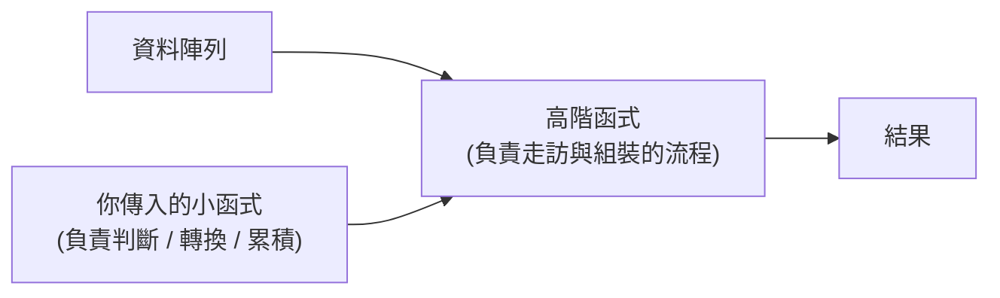
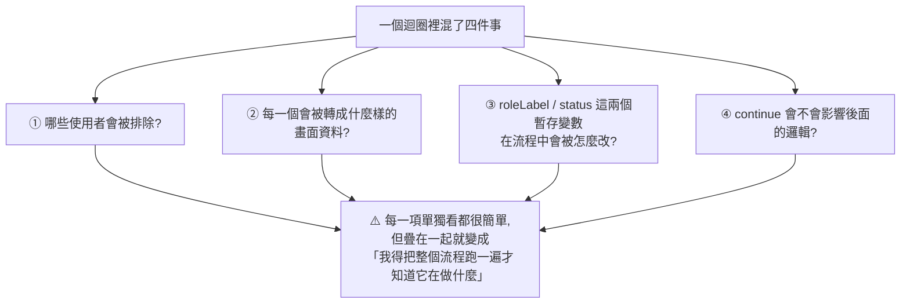
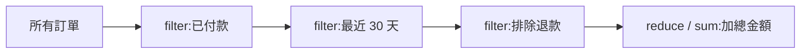

# 用高階函式降低程式碼閱讀負擔:重點不是變短,是讀者的注意力放在哪

> 整理自 YouTube 頻道 **ExplainThis 軟體工程白話聊**〈寫出好維護的程式碼－如何透過高階函式降低程式碼閱讀負擔?〉(2026-08-20,約 12.3 分鐘)。
> ⚠️ **該片無字幕,逐字稿以 CPU 版 faster-whisper 轉錄取得、非官方字幕**,可能有少量聽寫誤差。
> 依 CLAUDE.md 慣例,另補上**影片未提但實務上很常踩的三個反例**。

> 相關筆記:[[dominating-programming-concepts]]、[[reading-code-ai-era-6-techniques]]

---

## 一句話總結

**高階函式的價值不在「程式碼變少」,而在「讓讀者的注意力可以放到真正值得討論的地方」。** 迴圈版本描述的是**怎麼檢查**,高階函式版本宣告的是**在檢查什麼** —— 而後者才貼近人思考的順序。

⭐ **但影片結尾給了一個同樣重要的反向警告:抽象化過頭反而會增加閱讀成本。**

---

## 一、開場那個例子為什麼有說服力

影片先丟兩段程式讓你自己讀:

- 第一段:檢查**每一個請求**是不是都有效 —— 先設 `everyRequestValid = true`,跑迴圈,遇到無效的就改成 `false` 然後 `break`
- 第二段:檢查**每一個使用者**是不是都符合資格 —— 先設 `everyUserEligible = true`,跑迴圈,遇到不符合的就改成 `false` 然後 `break`

⭐ **關鍵的觀察方式:單獨看每一段都覺得沒什麼問題,但把兩段放在一起,就會發現「它們真正不同的地方其實很少」。**

```
兩者抽象化之後是同一個骨架:
  ① 先假設全部通過
  ② 跑迴圈
  ③ 遇到不通過的條件就改成 false,然後 break
```

**換句話說,兩段的核心都是在問同一個問題:「這一整批資料是不是每一個都符合某個特定條件?」**

⭐ **而多數程式語言都內建了回答這個問題的函式:`every`。** 你只要把「怎麼判斷」這件事丟進去就好。

> ⭐ **這個「並排比較」的教學法本身就值得學** —— 找出重複的**骨架**而不是重複的**字面**,是判斷該不該抽象化最可靠的方法。

---

## 二、什麼是高階函式

**定義:可以接收函式作為參數,或回傳函式的函式。**

聽起來抽象,但日常開發早就在用了:

| 高階函式 | 你交給它的小函式負責回答 |
|---|---|
| **`every`** | 每一筆都符合嗎? |
| **`some`** | 至少有一筆符合嗎? |
| **`map`** | 每一筆要**轉換**成什麼? |
| **`filter`** | 哪些要**留下**? |
| **`reduce`** | 怎麼**累積**? |

⭐ **共同結構:高階函式負責「走訪與組裝」,你傳入的小函式負責「判斷、轉換、累積」。**



### `every` 大概長什麼樣

影片示範自己實作一個簡化版來幫助理解 —— 它接兩個東西:**陣列**與**判斷函式**。判斷函式會拿到陣列裡的每一筆資料,回傳 `true` 或 `false`;**任何一筆是 `false` 就直接回傳 `false`,全部通過才回傳 `true`。**

⭐ **注意這代表 `every` / `some` 本身就有「短路」行為** —— 遇到答案就停,不會白跑完整個陣列。**這跟手寫迴圈裡的 `break` 是同一件事,不是效能上的退讓。**

---

## 三、三個實務案例

### 案例一:權限檢查 —— 閱讀順序 vs 思考順序

**情境**:使用者要擁有**所有**必要權限才能進入管理頁面。

**原本的寫法讀起來吃力,原因不在難,在於「你必須看完整個流程才知道它在做什麼」:**

```
① 先看到 hasAllPermissions,知道它一開始是 true
② 進到迴圈
③ 看到某個權限不存在時會被改成 false
④ ⇒ 到這裡才終於明白:喔,原來是在確認「是不是擁有所有必要權限」
```

**改用 `every` 之後,閱讀順序就接近思考的順序** —— 一開始就是在問:「必要權限裡的每一項,使用者都有嗎?」

⭐⭐ **影片這裡的措辭非常準確,值得完整記住:**

> **這不是說用 `every` 就比 for 迴圈「高級」,而是在這個狀況下,`every` 讓這段程式碼的「問題意識」更加直接。**
> **舊寫法是在描述「如何做檢查」,新寫法則是直觀地宣告「我們在檢查什麼」。**

**⭐ 從 code review 的角度看差別最明顯:**

| 版本 | reviewer 要花心力確認的事 |
|---|---|
| **迴圈版** | ⚠️ 這個布林變數有沒有在別的地方被改到?`break` 的條件對不對?預設值合不合理? |
| **`every` 版** | ✅ 直接把注意力放在真正重要的:**判斷是否有所有權限、沒有的話拋出錯誤** |

⭐⭐ **所以關鍵不在於行數變少,而在於讓讀程式碼的人,注意力可以放到更值得討論、更值得關注的地方。**

### 案例二:前端資料轉換 —— 把「篩選」和「轉換」切開

**情境**(全端工程師很常遇到):後端回來的資料不會剛好是畫面要顯示的樣子。要**只留下沒被停用的使用者**,而且要把**角色與登入狀態轉成看得懂的文字**。

**寫成單一迴圈的問題:讀的人得在腦中同時追蹤四件事**



⭐⭐ **這是全片對「閱讀負擔」最好的定義:即使程式碼非常單純、沒有複雜判斷,只要讀者必須在腦中同時追蹤多件事,負擔就已經很大了。**

**改寫後:`filter` 只留下沒被停用的 → `map` 把每一個轉成畫面的 row,而「怎麼轉」的邏輯抽到 `toUserRow` 裡面。**

⭐ **這個寫法把兩件不同的事情切開了:**

| | 負責回答 |
|---|---|
| **`filter`** | **哪些資料要留下來?** |
| **`map`** | **留下來的資料要長什麼樣子?** |

**⭐ 而真正的好處在「需求變更時」:**

> 產品經理說「停用的使用者不要顯示」;過幾天又說「沒登入過的也先不要顯示」。
>
> ⚠️ **如果所有邏輯混在同一個迴圈裡**,每加一個條件就要在流程裡塞更多 `if` / `else` / `continue` —— **久了讀的人會越來越難判斷:這段到底是在「篩選資料」還是在「轉換資料」?**
>
> ✅ **用高階函式重構後,新需求很自然地會被加在「篩選」那一段**,讀者沿著順序看就知道:先排除停用的 → 再留下曾登入過的 → 最後做畫面資料轉換。

### 案例三:訂單金額 —— 業務規則與流程混在一起

**情境**:算最近 30 天、已付款、沒有退款的訂單總金額。

**原本的寫法有兩個問題:**
1. ⚠️ **巢狀縮排很多,得一路往裡面鑽才讀得懂**
2. ⭐⭐ **兩種東西混在一起:「業務規則」與「邏輯流程」** —— 讀的人要同時理解「哪些訂單符合條件」以及「總金額怎麼算」

**重構成鏈式:**



⭐ **更進一步:把那幾個判斷抽成 `isRevenueOrder`。** 理由講得很好 ——

> 雖然 `status === 'paid'`、`createdAt >= 30 天前`、`不是退款狀態` 這些判斷邏輯都不困難,**但它們屬於「商業業務端」的邏輯,不需要在這個核心的 filter 裡面展示出來。**

### ⚠️⚠️ 但不能抽象化過頭(全片最重要的平衡)

影片結尾特別警告:

> **重構的時候不能太過度。** 假設把很多判斷都拆成很小的函式,**在名義上沒有提供更高層次的理解,只是把「一行的層次」換成「另一個名字」** —— 讀者反而需要跳來跳去看。
> **這看起來好像多了一層抽象化,但其實是增加了閱讀成本。**

⭐ **我把這條整理成一個可操作的判準:**

```
一個抽出來的函式,值不值得存在,看它的「名字」能不能讓讀者「不用讀它的內容」。

✅ isRevenueOrder(order)
   —— 讀者看到名字就懂了:這是一筆算得上營收的訂單
   —— 三個條件被壓縮成一個「商業概念」⇒ 提供了更高層次的理解

❌ isPaid(order)  { return order.status === 'paid' }
   —— 名字提供的資訊 = 內容提供的資訊
   —— 只是把一行換成另一個名字 ⇒ 純粹多一次跳轉
```

⭐ **判準一句話:抽象化要「壓縮」語意層級,不能只是「改名」。**

---

## 四、⭐ 三個影片未提、但實務上很常踩的反例

高階函式不是萬用。以下三種情況要特別小心:

### ⚠️ 反例一:`forEach` 配 async —— 最常見的真實 bug

```js
// ❌ 不會等待,迴圈瞬間跑完,後面的程式碼在資料還沒回來時就執行了
items.forEach(async (item) => {
  await save(item);
});
console.log('全部存好了');   // ⚠️ 騙人的,一筆都還沒存完

// ✅ 要平行:map + Promise.all
await Promise.all(items.map(item => save(item)));

// ✅ 要依序(避免打爆下游):老老實實用 for...of
for (const item of items) {
  await save(item);
}
```

⭐ **`filter` 配 async 更陰險** —— 非同步函式回傳的是 Promise,**而 Promise 永遠是 truthy,所以什麼都篩不掉**,結果全部留下,而且完全不會報錯。

> ⚠️ **這類 bug 的共同點是「安靜地錯」** —— 不會拋例外,只會給你錯的結果。

### ⚠️ 反例二:需要提早跳出時,`map` / `filter` 是在跟你作對

- **`every` / `some` 有短路**,沒問題
- ⚠️ **但 `map` / `filter` / `forEach` 沒辦法 `break`** —— 硬要提早結束只能丟例外或用旗標,那比原本的迴圈更難讀

⭐ **判準:如果邏輯本質上是「找到就停」,用 `find` / `some`;如果是「處理到某個條件為止」,那 `for` 迴圈才是對的工具。**

### ⚠️ 反例三:熱路徑上的多次走訪與中間陣列

`filter().filter().map()` 讀起來很漂亮,但**每一步都會走訪一次並配置一個新陣列**。

| 資料量 | 該怎麼想 |
|---|---|
| 幾百、幾千筆(絕大多數情況) | ✅ **可讀性完勝,不要為此犧牲** |
| 極大陣列 + 每秒跑很多次的熱路徑 | ⚠️ 這時才值得考慮合併成單次走訪,**而且要先量測再改** |

⭐ **順序很重要:先寫得清楚,量到問題再優化。** 反過來做,你會用可讀性換到一個根本不存在的效能問題。

---

## 應用案例

### 案例 1|⭐ 把「注意力預算」當成 code review 的標準

影片最核心的洞見 —— **關鍵不是行數,是讀者注意力放在哪** —— 可以直接變成 review 時的一句問話:

```
「我要理解這段,得在腦中同時記住幾件事?」

1–2 件 ⇒ ✅ 沒問題
3 件以上 ⇒ ⚠️ 通常代表「篩選 / 轉換 / 累積 / 流程控制」被混在一起了
```

⭐ **這個問法的好處是它避開了「風格之爭」** —— 不必爭論 for 迴圈跟 `filter` 誰比較優雅,只問「讀的人要同時追蹤幾件事」。這是**可以被觀察的事實**,不是偏好。

### 案例 2|⚠️ 用「並排比較」找出該抽象化的東西

影片開場的手法值得變成日常習慣:

```
① 把兩段你覺得「好像有點像」的程式碼並排放
② 問:它們「真正不同」的地方有多少?
③ 如果不同的只是「判斷條件」或「轉換方式」
   ⇒ ⭐ 骨架相同 ⇒ 這就是該用高階函式抽掉的部分
```

⚠️ **反過來也要成立**:如果兩段的**流程本身**就不同(一個要提早跳出、一個要累積狀態),那它們只是**長得像**,硬抽會做出一個帶著一堆旗標參數的四不像函式。

### 案例 3|需求增生時的自我檢查

案例二那個「PM 一直加篩選條件」的情境幾乎每個專案都會遇到。可以定期問:

| 症狀 | 代表什麼 |
|---|---|
| 一個迴圈裡的 `if` / `continue` 越加越多 | ⚠️ 篩選與轉換混在一起了 |
| 你得讀完整段才知道它「產出什麼」 | ⚠️ 缺一個 `map` 把「產出長什麼樣」獨立出來 |
| 業務條件散落在流程各處 | ⭐ 該抽一個像 `isRevenueOrder` 這樣的**商業概念函式** |

### 案例 4|⭐ 這件事在 AI 協作時代更重要,不是更不重要

⚠️ 有人會覺得「反正 AI 會讀程式碼,可讀性沒那麼重要了」。**恰恰相反:**

- **AI 讀你的程式碼要花 token** —— 巢狀迴圈 + 暫存變數 + `continue` 的版本,模型也得「把流程跑一遍」才知道它在做什麼,而那消耗的是 context
- ⭐ **宣告式的寫法對模型也更友善**:`filter(isRevenueOrder)` 這種寫法,**函式名字本身就把意圖講清楚了**,模型不需要推論
- ⚠️ **而 AI 生成的程式碼特別容易出現「案例二」那種毛病** —— 把所有需求塞進一個迴圈,因為它是照著你的敘述順序一路加上去的

> 📎 這一點跟 [[reading-code-ai-era-6-techniques]] 是同一個主題的兩面:**那篇談怎麼讀,這篇談怎麼寫得讓人(和模型)好讀。**

---

## 重點回顧(TL;DR)

1. **開場的教學法本身就值得學**:兩段程式單獨看都沒問題,**並排放在一起才發現「真正不同的地方其實很少」** —— 骨架都是「先假設全部通過 → 跑迴圈 → 遇到不通過就設 false 並 break」。
2. **那個骨架的名字叫 `every`** —— 它回答的是「這一整批資料是不是每一個都符合某個特定條件」。
3. **高階函式的定義:接收函式作為參數,或回傳函式的函式。** 日常的 `map` / `filter` / `some` / `reduce` 都是。
4. ⭐ **共同結構:高階函式負責「走訪與組裝」,你傳入的小函式負責「判斷 / 轉換 / 累積」。**
5. ⭐ **`every` / `some` 本身就會短路**(遇到答案就停),**跟手寫 `break` 是同一件事,不是效能上的退讓**。
6. **案例一(權限檢查)**:迴圈版讀起來吃力不是因為難,而是**你得看完整個流程才知道它在做什麼**(看到初值 true → 進迴圈 → 看到被改成 false → 才明白在檢查什麼)。
7. ⭐⭐ **最準確的一句話:這不是說 `every` 比 for 迴圈「高級」,而是在這個狀況下它讓「問題意識」更直接 —— 舊寫法描述「如何做檢查」,新寫法宣告「在檢查什麼」。**
8. ⭐ **從 code review 看差別最清楚**:迴圈版你得確認「布林變數有沒有在別處被改、break 條件對不對、預設值合不合理」;`every` 版直接看真正重要的部分。
9. ⭐⭐ **關鍵不在於行數變少,而在於讓讀的人把注意力放到更值得關注的地方。**
10. **案例二(前端資料轉換)**:單一迴圈要讀者**同時追蹤四件事** —— 誰被排除、每筆轉成什麼、暫存變數怎麼被改、`continue` 影響什麼。
11. ⭐⭐ **這是對「閱讀負擔」最好的定義:即使程式碼很單純、沒有複雜判斷,只要讀者得在腦中同時追蹤多件事,負擔就已經很大。**
12. ⭐ **`filter` 回答「哪些留下」、`map` 回答「留下的長什麼樣」** —— 把兩件事切開。
13. ⭐ **真正的好處在需求變更時**:混在一個迴圈裡,每加一個條件就多塞 `if` / `continue`,久了**讀的人分不出這段是在篩選還是在轉換**;用高階函式則新條件很自然加在篩選那一段。
14. **案例三(訂單金額)**:巢狀縮排要一路往裡鑽,而且 ⭐ **業務規則與邏輯流程混在一起**。重構成 filter 鏈 + 加總,並把業務判斷抽成 `isRevenueOrder` —— **因為那些屬於商業端的邏輯,不需要在核心 filter 裡展示。**
15. ⚠️⚠️ **反向警告(全片最重要的平衡):抽象化不能過頭。** 把判斷拆成一堆小函式,**若沒提供更高層次的理解、只是把一行換成另一個名字,讀者反而要跳來跳去,閱讀成本增加。**
16. ⭐ **我整理的可操作判準:一個抽出來的函式值不值得存在,看它的「名字」能不能讓讀者「不用讀它的內容」。** `isRevenueOrder` ✅(三個條件壓縮成一個商業概念);`isPaid` 包一行 ❌(名字提供的資訊 = 內容提供的資訊)。**抽象化要「壓縮語意層級」,不能只是「改名」。**
17. ⚠️ **補充反例一:`forEach` 配 async 不會等待** —— 迴圈瞬間跑完。要平行用 `map` + `Promise.all`,要依序用 `for...of`。⭐ **`filter` 配 async 更陰險:Promise 永遠 truthy,什麼都篩不掉而且不報錯。**
18. ⚠️ **補充反例二:`map` / `filter` / `forEach` 沒辦法 `break`** —— 本質上是「找到就停」的邏輯該用 `find` / `some`,「處理到某條件為止」該用 `for`。
19. ⚠️ **補充反例三:鏈式呼叫每一步都走訪一次並配置新陣列** —— 幾千筆以內可讀性完勝;只有極大陣列 + 熱路徑才值得合併,**而且要先量測再改**。
20. ⭐ **在 AI 協作時代這件事更重要不是更不重要**:模型讀巢狀迴圈同樣要「把流程跑一遍」而那消耗 context;宣告式寫法的函式名本身就講清了意圖。⚠️ **而 AI 生成的程式碼特別容易犯案例二的毛病** —— 照著敘述順序把所有需求疊進同一個迴圈。

---

## 來源

- [寫出好維護的程式碼－如何透過高階函式降低程式碼閱讀負擔? — ExplainThis 軟體工程白話聊](https://youtu.be/0ANjSvoFq0g)(2026-08-20,約 12.3 分鐘)
  - ⚠️ **該片無字幕,逐字稿以 CPU 版 faster-whisper 轉錄取得、非官方字幕**,可能有少量聽寫誤差(英文函式名如 `every` / `filter` / `some` 在轉錄中多有同音錯字,已依上下文還原)
  - 該片為 ExplainThis《寫出好維護的程式碼(下)》課程的免費單元
- 本倉庫相關筆記:[[dominating-programming-concepts]]、[[reading-code-ai-era-6-techniques]]

> ⚠️ 第四節的三個反例為整理者補充,非影片內容;程式碼範例以 JavaScript 語法示意,其他語言的對應行為請自行確認。
