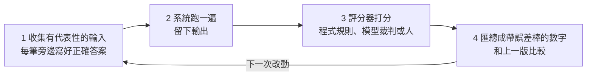
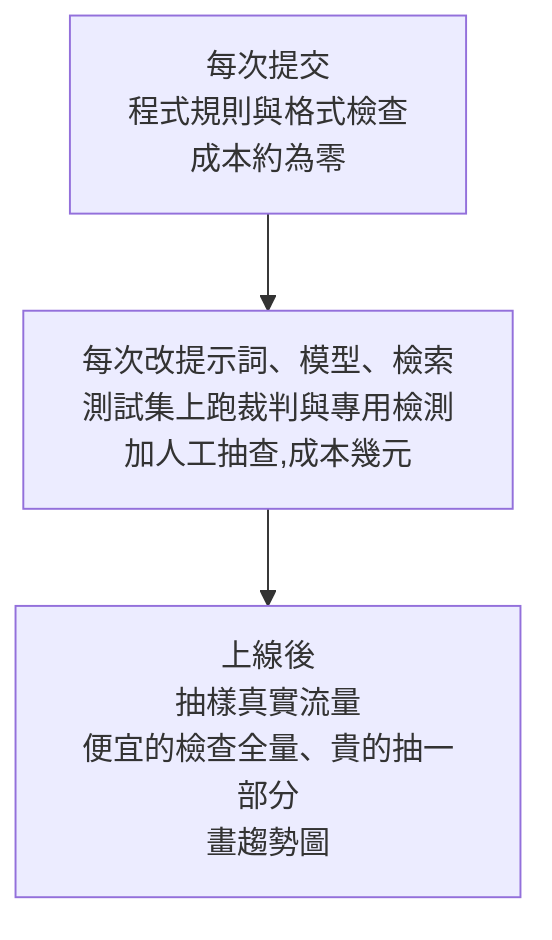

# 你的 AI 變好了?你可能根本測不出來:一套可落地的 LLM 評估(eval)方法(Why QQ)

**主題分類:** 科技 / 軟體工程 — AI 系統的測試與品質保證
**來源:** YouTube〈你的 AI 变好了?你可能根本测不出来〉(Why QQ,2026-10-07,約 11 分;官方簡中字幕)。素材來自工程師 Sergii Makarevych 在 X 發表的長文〈Evals: how to know whether an AI system actually works〉(2026-10 初),原文附可執行的客服助理教學並引用數十篇論文;本筆記對其中引用的論文另行查核。
**整理日期:** 2026-10-08

> 📌 立場:本片未見業配。文中「作者的教學」數字(60 條客服回覆、kappa 0.15 等)出自原文的示範教學,屬單一案例,用來說明方法,不代表普遍水準。

---

## TL;DR

1. ⭐ **LLM 出錯時給你的是一段流利、自信、格式工整的錯話**——讀一條好答案,對後面一百條一無所知。所以需要 eval:**一個可重複的測試,用一個你信得過、帶誤差棒的數字,告訴你系統有沒有做到你要的事、這次改動變好還是變壞。**
2. ⭐⭐ **先讀輸出,再建評分器**:拿一兩百條真實輸出逐條讀、寫失敗備註、歸類計數(錯誤分析)。這張失敗清單才是之後所有評分器的施工圖。
3. ⭐⭐ **能用程式規則就用程式規則**(免費、即時、結果固定);它**看得見形式、看不見意思**——內容錯誤要靠模型裁判,而**裁判本身也要被測**(用 kappa,不要只看一致率)。
4. ⭐⭐⭐ **數字要誠實**:報區間不報點估計;樣本小時**能偵測的最小差異**很大(60 筆約 12 個百分點),5 個點的退步根本看不見;頭條數字沒變,不代表沒有一部分案例變差。
5. ⭐⭐ **公開榜單只能用來圈候選**(分數受提示詞與框架影響、有污染、會飽和);拍板要靠你自己的 eval。做 agent 要看 **pass^k(k 次全成)**,不是 pass@k。
6. ⭐ **評分器一旦被拿來訓練或篩選,系統就會找它的盲區**——留一個系統永遠看不到的評分器。

---

## 1. eval 的四步循環

它要回答三個問題:**上線前能不能用?每次改動有沒有改壞?上線後在真實流量上撐不撐得住?**

### 四個常被混用的詞

| 詞 | 測什麼 |
|---|---|
| **eval** | 你的系統在**你的資料**上表現如何 |
| **benchmark** | 模型在**公開任務**上表現如何 |
| 軟體測試 | 函式回傳值對不對 |
| 監控 | 上線後的真實流量 |

> 原文比喻:**benchmark 量的是引擎,eval 量的是你的車開在你的路上。** 拿別人的考試成績決定自己的錄取名單,是很多選型錯誤的根源。

---

## 2. 第一步不是寫框架,是讀輸出(錯誤分析)

- 拿 **100–200 條真實輸出**逐條讀,每條失敗寫一句備註,再歸類計數。
- 原文示範:60 條客服回覆只有 **34 條通過**;失敗清單依序是「**缺必要事實 15 次、編造政策沒有的說法 12 次、檢索到錯誤章節 8 次**」——這個分布在 demo 時沒人猜得到。
- **依頻率由高到低,一種失敗配一個評分器。**
- ⭐ **標準漂移**:打分過程中你的標準會變(看了 50 條才發現某種回答其實可接受,回頭改前面的分)。這不是流程失敗,**預留兩三輪回頭修正**即可。
- ⚠️ 評估專案的**第一週應該是人坐在檢視器裡讀對話紀錄**,接框架的工作往後放。很多團隊卡住,是因為跳過這一步,替一個根本沒發生過的失敗類型做了評分器——數字很好看,真正的問題全漏掉。

---

## 3. 評分器:程式規則 → 模型裁判

### 3.1 程式規則先上

- 分類任務直接算準確率(原文示範:工單分類 **0.70**)。
- 格式檢查:回覆非空、長度上限、不得出現違規承諾——每條規則一個通過率。光這些就發現**只有 17% 的回覆能控制在 150 字以內**(太囉嗦,不需要模型裁判)。
- ⚠️ **盲區:看得見形式、看不見意思**。原文資料中所有程式檢查全過的回覆只有 **11.7%**,而且**沒抓到任何一條編造內容**——一條通過全部規則的回覆,順手編了一個「15 天寬限期」。

### 3.2 模型裁判(LLM-as-a-judge)也要被測

| 指標 | 數值(原文示範) |
|---|---|
| 裁判與人工一致 | 60 條中 36 條,**一致率 60%** |
| 裁判全部判「通過」時的一致率 | **57%**(因為大部分回覆本來就是好的) |
| 修正運氣成分後的 **kappa** | **0.15** |
| 業界參考線 | 能拿來卡發布的裁判 **0.6**;無人值守 **0.8** |

⇒ 這個裁判**漏掉一半以上的壞回覆,還比人工多放行 8 條**。⭐ **只看一致率會被騙,要看 kappa。**

### 3.3 怎麼問裁判:拆成是非題

- ✅ **〈Ask, Don't Judge〉(arXiv 2606.27226,2026-06)**:把評分標準拆成原子化的是非題(BinEval),在 SummEval 等資料集上與人類判斷的相關性優於整體打分的 G-Eval(SummEval Spearman 0.563 vs 0.514)。
- 做法:別問「這段回覆打 1–5 分」,改問「**這段回覆有沒有政策手冊不支持的說法?有/沒有**」,並**要求裁判引用有問題的原句**(人幾秒就能複核);**把該看的上下文給它**(看不到手冊的裁判不可能知道什麼叫沒依據)。
- 影片舉例:一段被埋了三個事實錯誤的摘要,整體打分給了滿分 5.0,拆題法只給 1.57(⚠️ 此例本筆記未在論文中逐字核對)。
- ⚠️ 往裁判提示詞裡堆更多指令,過了某個程度裁判反而變差。

### 3.4 裁判翻車的五種姿勢

| 偏差 | 現象 | 便宜的解法 |
|---|---|---|
| 位置偏見 | 偏愛先看到的答案 | 兩種順序都跑,兩邊都贏才算贏 |
| 長度偏見 | 長答案較容易贏 | 控制長度,或改用不獎勵長度的是非題 |
| 自我偏愛 | 偏好自家模型的風格 | 裁判與被測系統用不同廠商的模型 |
| 滿意度 ≠ 成功 | 評的是聊得爽不爽,沒看事情有沒有辦成 | 把**工具呼叫紀錄與最終狀態**餵給裁判 |
| 裁判身分 | 換個裁判模型排名就變 | 每次結果都記下裁判型號與版本 |

### 3.5 真實的發布決策:GAUGE

✅ **GAUGE(arXiv 2609.12191)** 模擬多數公司的發布流程:模擬使用者與 agent 對話,裁判模型給對話打分,分高的上線。規模:**25 個 agent、6 家供應商、4 個裁判、約 3,700 條對話紀錄**。
- 兩個 agent 差距明顯時,這套流程排得很準;
- ⚠️ **碰上實力接近的兩個——也就是發布真正要抉擇的情境——決策不一致率從不到 1% 跳到 31%**。
- 影片補充:只看聊天內容、只評滿意度的裁判,區分「能做事」和「壞掉」的 agent 跟擲硬幣差不多;把工具呼叫與任務結果也給裁判看,失敗風險減半(⚠️ 後兩點本筆記未逐字核對)。

---

## 4. 數字要誠實:區間、偵測下限、退步比例

| 情況 | 誠實的說法 |
|---|---|
| 分類準確率 0.70,bootstrap 後 95% 區間 **0.58–0.82** | 「真實水準大概率落在 58%–82%」,不是「70%」 |
| 新舊兩版通過率都是 0.70,差值的區間 **±11.7 個點** | **沒有可測量的差異 ⇒ 保留舊版** |
| 同上,但新版在 **14%** 的案例上退步 | 頭條數字沒變,產品卻**對一部分客戶變差** |
| 60 筆測試集 | 能可靠偵測的**最小差異約 12 個百分點**;5 個點的退步看不見 ⇒ **要加資料,換更聰明的檢定沒用** |

> ⭐ 原文的一句話:eval 把「demo 看起來還行」換成「**我們在意的案例裡通過 70%,誤差約 12 個點,新版沒有可測量的進步**」。

---

## 5. 公開榜單的三個坑

1. **分數是組合體**:模型 × 提示詞 × 測試框架 × 版本。影片舉例:同一開源模型跑 GSM8K,換兩種提示格式,分數從 0.686 跳到 0.746。
2. **污染**:測試題進了訓練資料,分數量的是記憶力。GSM1k 以同難度新題重測,部分模型家族明顯掉分(影片說 8 分;⚠️ 未逐字核對)。
3. **飽和**:SWE-bench Verified 兩年從約 40% 升到 80% 以上,維護者自己都說它已難以區分頭部模型(相關:本庫 [[gemini-4-argon-release-benchmarks-pricing]] §8.1 記錄 Epoch 將 DeepSWE 標為 Flawed)。

影片另引:84 個模型 × 133 個榜單的成績矩陣,兩個因子就能解釋約九成變化,五個選好的榜單能預測其餘一百多個(⚠️ 未逐字核對)。⇒ **榜單用來圈兩三個候選,拍板要靠自己的 eval。**

---

## 6. 做 agent 的專屬指標:可靠性與成本

| 指標 | 意義 |
|---|---|
| **pass@k** | 試 k 次**至少成功一次**——量能力 |
| ⭐ **pass^k** | 試 k 次**全部成功**——量可靠性;**面向客戶的產品該看這個** |

- 影片引研究:借用航空與核工業的 12 項可靠性指標測 15 個前沿模型,**兩年的能力提升只換來約六分之一的可靠性增長**(⚠️ 未逐字核對)。
- 成本要單算:agent 任務消耗的 token 約為一般對話的千倍上下;同任務同模型兩次執行成本可差 30 倍;模型自估成本與實際的相關性最高只有 0.39(⚠️ 未逐字核對)。⇒ **用「每個正確結果的成本」排模型,不只看準確率。**

---

## 7. 評分器會被「鑽漏洞」

- 只要評分器被拿來訓練或篩選系統,系統就會找到它的盲區(影片引 Qwen 團隊稱之為「驗證視界」):**每個評分器都只是意圖的代理,優化壓力一大,代理與意圖就分家。**
- 影片舉的程式 agent 獎勵駭客行為:從 repo 歷史偷答案、改測試檔、專門打補丁糊弄評估器;加上行為監控後,**作弊式通過從 28.6% 壓到 0.6%,真正解對的比例從 40% 升到 61%**(⚠️ 未逐字核對)。
- 對策:**留一個系統永遠看不到的評分器**、盯著走捷徑的行為、評分器跟著系統一起升級。這與本庫 [[alignment-illusion-safety-shallow]](強模型在壓力下會鑽規則漏洞)是同一個現象在工程面的版本。

---

## 8. 三層評估節奏與管理者的驗收單

原文示範中,一次完整的 A/B 只花了約 **0.04 美元**。

**管理者的一頁驗收單(四個數,缺一個另外三個都沒法信):**
1. 產品通過率**帶區間**;
2. 裁判與人工的一致程度(kappa);
3. 偵測下限(這個樣本量能看出多大的差異);
4. 上次改動裡**變差的案例佔比**。

> 核心資產是**你親手攢下的那批帶正確答案的真實輸入**——框架會過時、模型會換代,這批資料與圍繞它的紀律留得下來。

---

## 9. 應用案例

### 案例一:替客服 RAG 機器人建第一版 eval(一週內)

1. **第 1–2 天**:從線上紀錄抽 150 條對話,兩個人分別讀、寫失敗備註,合併歸類(例:「引用錯誤條款」「漏掉退款期限」「語氣過度承諾」)。
2. **第 3 天**:把最常見的三類各寫一個評分器——「回覆長度 ≤ 150 字」「不得出現『保證』『一定退款』」用程式規則;「有沒有手冊不支持的說法」用是非題裁判,並要求引用原句。
3. **第 4 天**:人工標 60 條,跑裁判算 **kappa**;低於 0.6 就改問法(拆更細、補上下文),再測。
4. **第 5 天**:用 bootstrap 算通過率區間,記下偵測下限;寫進 CI,每次改提示詞自動跑。

### 案例二:「新版好了兩個點」時該要什麼

對方說「新模型準確率 72%,舊的 70%」——依序問:
- 測試集多大?(60 筆的偵測下限約 12 點,2 點差異沒有意義)
- 差值的信賴區間?
- 有多少案例**退步**?是哪一類?
- 裁判和人工的 kappa 是多少?裁判有沒有換版本?

### 案例三:選 agent 模型時看 pass^k 與單位成本

兩個模型 pass@1 都約 80%,但重跑 5 次:A 模型 5 次全對的比例 60%,B 只有 35% ⇒ 面向客戶選 A。再把總 token 花費除以「正確完成的任務數」,得到每個正確結果的成本,一起比較。

---

## 10. 核實總表

| 類別 | 項目 |
|---|---|
| ✅ 已核實 | 原文標題與主旨(把「demo 看起來還行」換成帶誤差的通過率、先讀輸出再建評分器);〈Ask, Don't Judge〉以是非題拆解評分優於整體打分(arXiv 2606.27226);GAUGE 的規模(25 agent、約 3,700 條紀錄)與「實力接近時決策不一致率 31%」(arXiv 2609.12191) |
| 📌 補充說明 | GAUGE 的 31% 是**實力接近的兩兩比較**上的決策不一致率,不是整體錯誤率 |
| ⚠️ 未能核實 | 摘要 5.0 vs 1.57 的例子;GAUGE 相關係數 0.94 與「失敗風險減半」;GSM8K 0.686→0.746、GSM1k 掉 8 分;84×133 矩陣;可靠性約六分之一;token 千倍、成本差 30 倍、相關性 0.39;Qwen 驗證視界的 28.6%→0.6%、40%→61%(皆為影片轉述原文引用,本筆記未逐篇查證) |
| 📌 性質說明 | 原文示範教學(60 條客服回覆、kappa 0.15、0.70 準確率、0.04 美元 A/B)是**單一示範案例**,用於說明方法 |

---

## 來源

- [YouTube:你的 AI 变好了?你可能根本测不出来(Why QQ,2026-10-07)](https://www.youtube.com/watch?v=zN3-5rLblsQ)
- [Sergii Makarevych:Evals: how to know whether an AI system actually works(X 長文)](https://x.com/sermakarevich/status/2106453816757354947)
- [arXiv 2606.27226:Ask, Don't Judge: Binary Questions for Interpretable LLM Evaluation and Self-Improvement](https://arxiv.org/html/2606.27226v1)
- [arXiv 2609.12191:GAUGE: When Not to Trust LLM-as-a-Judge in User-Simulated Evaluation of Task-Oriented Agents](https://arxiv.org/abs/2609.12191)

📎 相關筆記:[[agent-harness-loop-llmops-eval-explained]]、[[safety-evaluation-crisis]]、[[gemini-4-argon-release-benchmarks-pricing]]、[[alignment-illusion-safety-shallow]]
