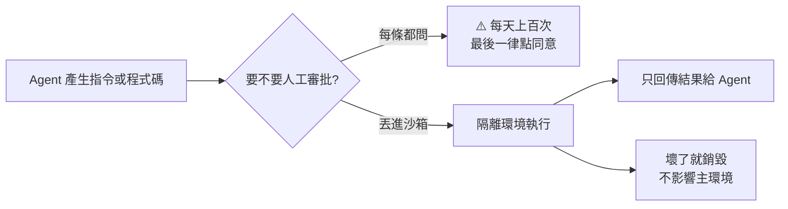
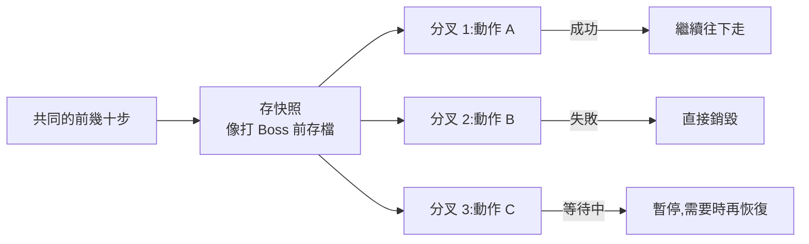

# 為什麼沙箱成了 AI 圈最捲的新基建:microVM、快照,與「快照要多快」這道題

**主題分類:** 科技 / 系統設計 — Agent 執行環境、虛擬化、RL 訓練基礎設施
**來源:** YouTube〈為什麼沙箱成了AI圈最卷的新基建〉(小白debug / Little white debug,2026-09-26,約 21.8 分;**該片無字幕,逐字稿以 CPU faster-whisper 轉錄取得、非官方字幕**)
**一手素材核實:** OSDI 2024 論文 [Sabre](https://www.usenix.org/conference/osdi24/presentation/lazarev)、Intel 官方觀點文、**已 `git clone --depth 1` Kimi K3 實際使用的 [kvcache-ai/AgentENV](https://github.com/kvcache-ai/AgentENV)(MIT,本文查詢時 3,558 star,最後 commit 2026-09-28)讀 README、設定檔與架構文件**
**整理日期:** 2026-09-28

> ⚠️ **影片性質說明:**
> 1. **這支影片其實是三段內容拼接**:① 沙箱 + Intel IAA(約前 8 分鐘,標題主題)② Agent Skills 概念速通 ③ 用「豆包」應用生成功能做背單字遊戲的實測。說明欄的時間軸也對應這三段。
> 2. ⚠️ **第①段結尾明顯在推 Intel Xeon**(「如果說 GPU 是 agent 時代的大腦,那至強就是能承載更多 agent 的那塊地基」),**第③段是豆包產品展示**;兩段都沒有標示是否為業配。本文**只記錄可觀察的內容**,並把推廣性的結論與可查證的技術事實分開。
> 3. 本文以第①段為主;第②段與本庫既有筆記重疊,只簡述(見 §7);第③段只記錄要點(見 §8)。

---

## TL;DR

1. ⭐ **為什麼要沙箱:** agent 幹活就是不斷寫程式、跑指令;靠人工逐條審批不現實(「每天上百個,我反正都點同意」),所以要一個**隔離的假環境**來跑高風險指令,只把結果回傳給 agent。
2. ⭐⭐ **為什麼是 microVM:** 虛擬機隔離好但啟動要幾十秒;容器快但共用宿主核心、一旦逃逸影響整台機器。**microVM = 精簡過的虛擬機 + 唯讀映像檔**,隔離仍是虛擬機等級,啟動壓到百毫秒級。
3. ⭐⭐⭐ **為什麼現在又捲起來:** **RL 訓練**。模型在訓練中瘋狂試錯,需要大量一致、可丟棄的環境;✅ **Kimi K3 訓練與評測共開了 5,121 萬個沙箱、用了 150 萬種映像**。
4. ⭐⭐ **下一個瓶頸是快照:** 試錯的前幾十步都一樣,每次從頭開機很浪費 → 把「那一刻的磁碟、記憶體、CPU 狀態」存成快照,從快照分叉出多個沙箱試不同動作(像打 Boss 前存檔)。但快照動輒數 GB,壓縮解壓又吃 CPU。
5. ⚠️ **影片的答案是 Intel IAA 硬體壓縮**(OSDI 2024 論文 ✅ 可查);**但本文讀 AgentENV 原始碼發現:Kimi K3 實際用的是軟體 LZ4 / zstd,靠「增量快照 + 按需載入 + 共享頁快取」照樣做到 50 ms 內啟動**——硬體加速是一條路,不是唯一的路(見 §5)。

---

## 1. 為什麼 agent 需要沙箱

> ⭐ 影片的開場很真實:「現在你的 AI agent 又又又彈出了一條夾帶刪除命令的執行請求,你是同意還是拒絕?這種審批我每天都會遇到上百個……反正我會點同意。」
> ⇒ **靠人兜底根本不現實**,所以要讓環境本身兜底。

| 名稱 | 跑在哪 |
|---|---|
| **本地沙箱** | 你自己的電腦 |
| **雲端沙箱** | 雲端服務,按需開、用完銷毀 |

---

## 2. ⭐⭐ 三種隔離技術的取捨

| 技術 | 隔離程度 | 啟動速度 | 問題 |
|---|---|---|---|
| **虛擬機(VM)** | ⭐⭐⭐ 完整作業系統 | ⚠️ 幾十秒 | 太慢、太重 |
| **容器(Container)** | ⚠️ 本質是行程,**共用宿主核心** | ⭐⭐⭐ 很快 | **核心逃逸會影響整台宿主機** |
| ⭐ **microVM** | ⭐⭐⭐ 仍是虛擬機等級 | ⭐⭐ 百毫秒級 | 需要映像檔與快照管理 |

**microVM 的做法:**
1. 在虛擬機基礎上**砍掉不必要的模組**,得到高度精簡的迷你虛擬機。
2. 把作業系統與依賴打包成**唯讀的母版檔案(映像檔)**。
3. 要用時從映像複製一份,快速建立新的 microVM,**每個環境保證一致**。

> 影片以 **Firecracker** 為代表(AWS 開源,Lambda 底層)。

### 📌 本文補充:幾家開源雲沙箱的實際選擇並不一樣

| 專案 | 隔離技術 | 公開數字 |
|---|---|---|
| **Kimi K3 的 AgentENV**(Moonshot + kvcache-ai,MIT) | ✅ **Firecracker microVM** | 快照啟動或恢復 **< 50 ms**、暫停 **< 100 ms** |
| **騰訊雲 CubeSandbox**(Apache-2.0,Rust) | **KVM + RustVMM**,每個沙箱有自己的核心 | 啟動 **< 60 ms**、每個沙箱額外開銷 **< 5 MB**;相容 E2B API |
| ⚠️ **阿里 OpenSandbox**(Apache-2.0) | ⚠️ **Docker / Kubernetes runtime** | 主打多語言 SDK 與統一 API,**不是 microVM 路線** |

> ⚠️ 影片說「現在大部分雲沙箱方案用的都是 microVM + 映像」——**阿里的 OpenSandbox 就是容器路線的反例**。選哪種隔離,取決於你對「逃逸風險」與「部署便利」的權衡。

---

## 3. ⭐⭐⭐ 為什麼 30 年前的老技術現在又捲起來:RL 訓練

> 影片:「最不穩定的,就是**訓練階段**的大模型。」

- 強化學習階段要讓 AI 大量執行任務,**做對給獎勵、做錯給懲罰**,AI 會瘋狂試錯。
- 這些高風險動作需要沙箱兜底;而且**所有沙箱來自同一份映像**,保證每次都在同一個環境下試錯。
- 業界共識:**要更強的 agent 能力,就要讓 AI 跑更多真實任務** ⇒ 沙箱越開越多。

✅ **Kimi K3 技術報告(AgentENV README 引用):**
| 指標 | 數字 |
|---|---|
| 訓練與評測共建立的沙箱 | **51,219,741 個** |
| 使用的不同映像 | **1,505,678 種** |
| 模型規模 | 2.8 兆參數 MoE |

> 影片說「5,000 多萬個沙箱」✅ 一致。

---

## 4. ⭐⭐ 瓶頸一:每次從頭開機太浪費 → 快照

- 問題:每次拉起沙箱都要從零啟動作業系統、初始化服務;**訓練裡大量試錯的前幾十步是一樣的,錯的只是最後幾步**,重複步驟也得再跑一遍,**GPU 在旁邊空等**。
- 解法:**快照(Snapshot)**——把某一刻的**磁碟、記憶體、CPU 正在執行的位置**一次存成檔案,下次直接恢復,**連跑到一半的行程都能接著跑**。

> ✅ AgentENV 的 README 正是這樣寫的:「**一個正在執行的環境可以分叉成多個獨立沙箱**,供平行的 agent 工作流使用。」

---

## 5. ⭐⭐⭐ 瓶頸二:快照太大、壓縮太吃 CPU——兩條不同的解法

**影片描述的問題:**
- 快照動輒**幾 GB**,磁碟壓力大;存與恢復都是在磁碟和記憶體之間搬幾 GB 資料,量一大就慢。
- 業界多用**軟體壓縮(ZSTD、LZ4)**:壓小再落盤、讀時解壓——但壓縮解壓是計算活,**全落在 CPU 上**,而 CPU 本來還要跑 agent 的程式碼。

### 解法 A(影片主張):把壓縮做成硬體——Intel IAA

| 項目 | 內容 |
|---|---|
| **是什麼** | **In-Memory Analytics Accelerator**,Intel 資料中心處理器內建的加速單元(影片說 Xeon 6;✅ 論文指出 **第 4 代 Xeon 起就有**) |
| **模組** | 壓縮、解壓、過濾,可自由組合;支援 **DEFLATE** |
| **其他用途** | RocksDB、ClickHouse 這類資料庫的查詢加速 |
| **怎麼加速** | CPU 只告訴 IAA 資料位置;IAA **一邊搬資料一邊算**,上一批還在傳輸時已在處理下一批 |

**數字核實:**

| 影片說法 | 核實 |
|---|---|
| OSDI 2024 研究:快照最小壓到原來的 **22%**、記憶體恢復最快 **提升 55%** | ✅ **屬實**:論文 **Sabre**(MIT CSAIL、Intel Labs、Cornell)——快照最多壓縮 **4.5 倍**(≈ 22%)、從快照恢復記憶體**最快加速 55%**,整合在 Firecracker 上評測 serverless 應用 |
| Intel 實測:單 CPU 並發 32–128 個沙箱時,快照恢復延遲**降 38%–42%** | ⚠️ **未能找到公開出處**;Intel 2026-08-20 的官方觀點文只寫「使用 IAA 做快照壓縮的已發表研究,讓快照完成速度約快 **1.2 倍**」 |
| 「目前只有 Intel 至強系列支援」這種硬體單元 | 📌 **這是廠商視角的說法**;本文未做跨廠商硬體比較,引用時請注意推廣語境 |

> ⚠️ 還要注意:**Sabre 的評測對象是 serverless 應用的 microVM 快照**,不是 RL 訓練沙箱;把數字直接套到「大規模模型訓練」是影片的推論。

### 解法 B(本文補充):Kimi K3 實際用的 AgentENV 怎麼做

✅ 讀 AgentENV 原始碼後,**它走的是影片說「會吃 CPU」的軟體壓縮路線**,但用架構把問題繞開:

| 手法 | 內容(✅ README / `config/default.toml` / `docs/src/internals/architecture.md`) |
|---|---|
| **軟體壓縮** | 發布快照預設 **LZ4**(可改 zstd);映像層用 **zstd level 3**,附隨機存取跳表與 CRC32C 校驗 |
| ⭐ **增量快照** | 只存記憶體與檔案系統的**變動部分**,即使磁碟大量修改也在 **100 ms 內**完成 |
| ⭐ **按需載入** | 用 **overlaybd** 按需載入 OCI 映像;本地磁碟只當**有上限的快取**,熱資料留下、冷資料淘汰 ⇒ 映像與快照的總量**可以比本地磁碟大好幾個數量級**,又不用在每台主機預熱 |
| **共享頁快取** | 透過 **ublk** 做高效能 I/O,儲存與記憶體快照資料**共用宿主的 page cache** |
| **記憶體氣球** | 把 guest 可回收的記憶體還給宿主,**生產環境達到 9.6 倍記憶體超賣** |
| **閒置便宜** | 閒置環境能快速釋放 CPU 與記憶體,有新工作時再回來 |

> ⭐⭐ **結論:** 影片把「快照讀寫速度」全押在壓縮硬體上;但**真正在 5,000 萬沙箱規模跑過的系統**,主要靠的是**少搬資料**(增量、按需、共享快取),而不是**搬得更快**。兩者不衝突——IAA 可以疊在解法 B 上再加速——但**先做架構、再談硬體**才是比較穩的順序。

---

## 6. 影片的收尾論點:思考靠 GPU,執行靠 CPU

> 影片:「**GPU 決定 AI 有多聰明,但 agent 思考完還是要幹活**——寫程式、開沙箱、跑腳本,這些全都需要 CPU。」

✅ **Intel 官方觀點文〈Count the Work Done. Not Just the Cores.〉(2026-08-20)** 提供了佐證數據(分析 739 段匿名 Claude Code 對話):
- 程式碼執行型 agent 中,**GPU 只有 50%–60% 的掛鐘時間在做有用的工作**;
- CPU 端處理與等待時間,從單一請求時的**不到 1%**,升到 32 個並發請求時的**最高 15%**。

⚠️ 這是 Intel 自己的分析,立場上自然強調 CPU 的重要性;但「**agent 越多,執行端越會變成瓶頸**」這個方向,與本庫 [[agent-harness-launches-august-2026]] 等筆記觀察到的趨勢一致。

---

## 7. 第二段:Agent Skills 是什麼(簡述)

影片把幾個概念串成一條演進線(與本庫 [[building-claude-skills]]、[[top-skills-for-agents]] 內容重疊,這裡只列骨架):

| 階段 | 概念 | 解決的問題 |
|---|---|---|
| ① | **Prompt / 結構化提示** | 規則越加越多 |
| ② | **Command** | 長提示每次手敲太累,固化成檔案、用短指令叫出 |
| ③ | **System Prompt**(如 `CLAUDE.md`) | 使用者提示太長時 AI 不聽話;系統提示優先權更高 |
| ④ | **Metadata** | 場景太多不能全塞;每個檔案開頭寫一小段描述,**只把 metadata 送給模型判斷要載入哪個** |
| ⑤ | **References / Scripts** | 繼續拆;**漸進式披露**,用不到的檔案不耗 token;腳本讓模型能做聊天之外的事 |
| ⑥ | **Skill** | 把入口改名 `SKILL.md`,和 references、scripts 一起打包成資料夾 |

**和其他概念的差別:**
- **Skill vs MCP:** MCP 像給大腦配的**手與工具**;Skill 是**操作經驗**——什麼場景、按什麼順序、組合哪些工具(工具可以是 MCP,也可以是本地腳本)。
- **Skill vs Workflow:** Workflow(如 n8n)**流程在設計時就固定**;Skill 的執行流程**由大模型驅動**,更靈活。「不那麼準確地說,Skill 可以理解為**大模型驅動的 workflow**。」(對照本庫 [[lowcode-automation-vs-agent-first]])

---

## 8. 第三段:豆包「應用生成」實測(產品展示)

> ⚠️ 這段是**豆包產品的完整展示**,語氣高度推廣(「用下來最順手」「指哪打哪」),未標示是否為業配。以下只記錄可觀察的功能宣稱,**本文未實測**。

| 項目 | 影片展示 |
|---|---|
| **成品** | 四六級背單字消消樂網頁遊戲:三種難度、依**艾賓浩斯遺忘曲線**出題、錯題本匯出、排行榜 |
| **技術** | 前後端分離,接 **PostgreSQL**;用 Node.js 腳本批次匯入單字 |
| **過程** | 需求 → 技術選型 → 建表失敗時**自行縮小範圍排錯** → 可平行的任務並行開發 → 多輪迭代 |
| **介面** | 可在預覽頁**直接框選加批註**要求修改、一鍵換風格模板 |
| **其他** | 手機遠端控制電腦上的任務;一鍵部署產生分享連結 |

---

## 9. 應用案例

### 案例一:幫自己的 coding agent 選沙箱

| 你的情況 | 建議 |
|---|---|
| 個人開發、只跑自己寫的專案 | 本地容器(Docker)就夠;重點是**不掛載家目錄與憑證** |
| 要跑**來源不明的程式碼**(例如使用者上傳、網路抓來的 repo) | **microVM 路線**(Firecracker 系,如 AgentENV、CubeSandbox),避免核心逃逸 |
| 已經用 E2B、想自架省錢 | AgentENV 與 CubeSandbox 都宣稱**相容 E2B API**,改環境變數即可試 |
| 團隊已有 Kubernetes | 容器路線(如 OpenSandbox)整合成本最低,但要評估逃逸風險 |

### 案例二:用「快照分叉」加速 agent 評測

評測一個 agent 在 100 個任務上的表現,每個任務都要先 `git clone` + 安裝依賴(5 分鐘):
1. 對每個任務做一次環境準備,**存快照**;
2. 每次評測從快照分叉,**幾十毫秒進入就緒狀態**;
3. 同一任務要跑 5 次取平均時,**只準備一次**。
⇒ 準備時間從 100 × 5 × 5 分鐘,降到 100 × 5 分鐘 + 分叉成本。

### 案例三:優化順序——先少搬,再搬快

快照恢復太慢時,依序檢查:
1. **是不是每次都存全量?** → 改增量快照。
2. **是不是一次把整個映像拉下來?** → 改按需載入(lazy loading)。
3. **同一台機器上多個沙箱是否各自快取同樣的資料?** → 共享頁快取。
4. **以上都做了,CPU 還是被壓縮吃滿?** → 這時才考慮硬體壓縮加速(IAA 等)。

---

## 來源

- YouTube:[為什麼沙箱成了AI圈最卷的新基建](https://www.youtube.com/watch?v=iD_2QFur7Q4)(小白debug / Little white debug,2026-09-26)——**該片無字幕,逐字稿以 CPU faster-whisper 轉錄、非官方字幕**
- OSDI 2024 論文:[Sabre: Hardware-Accelerated Snapshot Compression for Serverless MicroVMs](https://www.usenix.org/conference/osdi24/presentation/lazarev)([PDF](https://www.usenix.org/system/files/osdi24-lazarev_1.pdf)、[原始碼](https://github.com/barabanshek/sabre))
- Intel 官方觀點文:[Count the Work Done. Not Just the Cores.](https://www.intel.com/content/www/us/en/newsroom/opinion/count-the-work-not-just-the-cores.html)(2026-08-20)
- AgentENV:[github.com/kvcache-ai/AgentENV](https://github.com/kvcache-ai/AgentENV)、[文件站](https://kvcache-ai.github.io/AgentENV/latest/)
- Kimi K3 技術報告:[MoonshotAI/Kimi-K3 k3_tech_report.pdf](https://github.com/MoonshotAI/Kimi-K3/blob/main/k3_tech_report.pdf)
- 騰訊雲 CubeSandbox:[github.com/TencentCloud/CubeSandbox](https://github.com/TencentCloud/CubeSandbox)
- 阿里 OpenSandbox:[github.com/alibaba/OpenSandbox](https://github.com/alibaba/OpenSandbox)
- Firecracker:[firecracker-microvm.github.io](https://firecracker-microvm.github.io/)

**Whisper 專有名詞還原對照:** 杀箱/杀香/沙厢/云沙香/杀伤 → 沙箱/雲沙箱;经检/经棉 → 精簡;迷你虚弥机 → 迷你虛擬機;k3 → Kimi K3;agent ENV → AgentENV;某训 cube sandbox → 騰訊 CubeSandbox;某里 open sandbox → 阿里 OpenSandbox;AAA/iAA → IAA;志强/至强/智强 → Xeon(至強);RoxDB → RocksDB;兜包/逗包 → 豆包;Scale/Skil → Skill;Walkflow → Workflow;cloud code → Claude Code;科瑟的科瑞入 → Cursor 的 rules。
