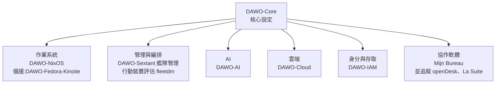
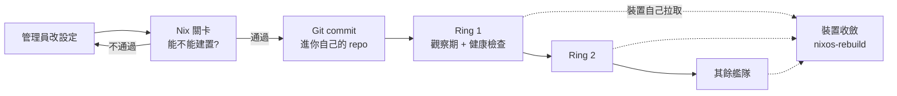

# 荷蘭政府為什麼選 NixOS:DAWO 把 GitOps 推到每張辦公桌(Laptop as Code)

**主題分類:** 科技 / 系統設計 — 端點管理、GitOps、數位主權
**來源:** YouTube〈荷兰政府替代Windows为什么选 NixOS?GitOps 杀到办公桌〉(Why QQ,2026-09-27,約 11 分;**依官方簡中字幕整理**)
**原始碼核實:** 已 `git clone --depth 1` 荷蘭政府自架 Forgejo([code.overheid.nl](https://code.overheid.nl))上的三個 repo 並讀文件與原始碼:
- [MinBZK/DAWO](https://code.overheid.nl/MinBZK/DAWO)(藍圖,最後 commit 2026-09-27)
- [MinBZK/DAWO-NixOS](https://code.overheid.nl/MinBZK/DAWO-NixOS)(作業系統核心,GPL,**已到 0.1.3**,最後 commit 2026-09-27)
- [MinBZK/DAWO-Sextant](https://code.overheid.nl/MinBZK/DAWO-Sextant)(艦隊管理,EUPL-1.2,Go,beta)
**整理日期:** 2026-09-28

> ⭐ 讀原始碼後的最大收穫:**影片把「強制安全基線」講多了**——USB 管控其實是**選配**、稽核(auditd)**被延後**,而且這是 repo 自己在文件裡寫明的更正(見 §7)。這種「文件比宣傳誠實」的態度,本身就是這個專案值得學的地方。

---

## TL;DR

1. ⚠️ **先校正說法:** 不是「荷蘭政府拋棄 Windows 全面換 NixOS」,而是**一個試點**:2026 年 4 月起幾個市政府小規模測試 Linux 工作站與 Mijn Bureau 協作環境,跑到 2026 年底,再決定哪些職位先遷移。
2. ⭐⭐ **為什麼偏偏選最難伺候的 NixOS?** 因為它最折磨人的地方——**整台機器的狀態來自一份宣告式設定**——正是管幾千台電腦時最需要的:要稽核就讀 Git、要重建就跑一次建置。
3. ⭐⭐ **三層結構:** 全國核心基線 → 各機關的設定 → 具體某一台筆電;下層用 Nix Flake 引用上層。
4. ⭐⭐⭐ **Sextant = 像管程式碼一樣管電腦艦隊:** 改設定 → Nix 建置關卡 → Git commit → 分批(ring)推進;**裝置自己拉設定,控制台永不推送指令**。
5. ⭐ **冷水:** 2026 年 8 月 nixpkgs 核心團隊宣布解散;DAWO 官方回應「依賴被 lock 檔釘死,技術上不用慌,但採用開源就要對社群治理負責」——**one is none,單點就等於沒有**。
6. ⭐⭐ **判斷任何「某組織替換某供應商」新聞的三個問題:** 依賴有沒有攤開寫清楚?每個元件能不能單獨換掉?退出方案存在嗎、寫下來了嗎、測過嗎?

---

## 1. 這件事的真實範圍

| 項目 | 內容 |
|---|---|
| **專案名** | **DAWO**(Digitaal Autonome Werkomgeving Overheid,政府數位自主工作環境) |
| **主導** | 荷蘭內政部(BZK);影片說由政府共享 IT 服務中心負責開發 |
| **試點** | 影片:**2026 年 4 月起,斯海爾托亨博斯、贊斯塔德、埃德、阿姆斯特丹四個市政府 + 荷蘭市政協會(VNG)**,跑到 2026 年底 |
| **目標** | 收集真實使用體驗與相容性問題,再看哪些職位適合先遷移 |
| **熱度** | Hacker News 首頁,影片截圖時 931 讚、543 則留言 |

> ⭐ 影片:「**這是一次試點,接著是驗證,然後才輪到決定誰先遷移。沒有哪位荷蘭公務員明天一早就要卸載 Windows。**」
>
> 📌 **本文補充:** 部分媒體報導試點經由 VNG 擴及**八個市政府**,與影片的「四個」不同,本文未能以官方來源確認;repo 裡可見的具體裝置設定是**贊斯塔德、埃德**。DAWO-NixOS 的 CHANGELOG 也註明**試點裝置目前還沒有真實資料**。

### 為什麼要做

官方理由很工程化:**供應商依賴、系統中斷風險、資料控制權、內部技術能力流失**。

⭐ 一個很能說明問題的細節:**荷蘭政府連 GitHub 都在重新考慮**——政府原始碼放在 GitHub,而 GitHub 是微軟旗下、位於歐盟以外的商業平台。2026 年 4 月他們上線了 **code.overheid.nl**,一個跑在政府自己伺服器上的 **Forgejo**。
> 影片:「依賴從來不止辦公軟體那一層——**程式碼放哪、CI 在哪跑、帳號體系誰控制,每一層都是依賴。**」

---

## 2. DAWO 不是產品,是一張可拆的藍圖

> 官方定位:DAWO **不是一個軟體產品,也不是新的辦公套件**,而是一套開放藍圖;**每一塊都可以獨立開發、獨立檢查、獨立替換**。
> ⭐ 這和 Microsoft 365 的設計思路相反:微軟賣的是打包好、拆不開也換不掉的全家桶。

✅ **本文讀 `MinBZK/DAWO` README 後的現況**(比影片說的「四塊積木」更細):



⭐ **備援路線寫在藍圖裡:** 作業系統除了 NixOS,還有一條 **Fedora Kinoite** 的開發軌道。

---

## 3. ⭐⭐⭐ 為什麼是 NixOS:從「考古現場」到「宣告式狀態」

| | 一般 Linux 辦公電腦 | NixOS |
|---|---|---|
| 怎麼長大的 | 裝 Ubuntu → apt 裝一堆 → 改設定檔 → 管理員手動 patch | **整台機器的狀態來自一份宣告式設定** |
| 半年後 | ⚠️ 「沒人說得清這台機器為什麼長成這樣」——**一連串歷史操作的考古現場** | 設定寫成程式碼,**依賴用 Flake 的 lock 檔釘死**;建置出什麼,機器就是什麼 |
| 想稽核 | 登入去翻 | **讀 Git 倉庫** |
| 想重建 | 重灌再手動重做 | **跑一遍建置** |

> ⭐⭐ 「**對個人玩家,這是折騰;對要管幾千台電腦的政府,這是救命。**」
> ⭐ 「傳統 IT:我**覺得**這一千台電腦應該配好了。DAWO:**Git 告訴我**這一千台電腦應該是什麼狀態,而且實際狀態還能被驗證。**這兩句話的差別,就是運氣和工程的差別。**」

### 三層結構(✅ `architecture.md` 的 ADR-0001 / ADR-0003)

| 層 | 內容 | repo 範例 |
|---|---|---|
| **① 上游核心** | 積木(block)+ 兩個層級;**不含品牌、使用者帳號、App 組合** | `DAWO-NixOS` |
| **② 各機關** | 以 Flake input 引用核心,加上自己的共用積木 | `DAWO-NixOS-BZK`、`DAWO-NixOS-VNG` |
| **③ 具體裝置** | 引用核心與機關 repo,把主機釘到自己的硬體與磁碟配置 | `DAWO-Gem-Zaanstad` |

⭐ 效果:**全國安全策略寫一次、所有機關複用**;地方政府保留客製空間,不用從零開始,也不必 fork 核心。

### 「強制」與「建議」用 Nix 的優先權表達(✅ ADR-0002)

(以下為本文依 ADR-0002 描述寫的**示意**,不是 repo 原始碼)

```nix
# 強制的安全設定:用 mkForce,下游無法「悄悄」調弱
services.openssh.settings.PasswordAuthentication = lib.mkForce false;

# 建議的預設值:用 mkDefault,下游可以覆寫
services.chrony.enable = lib.mkDefault true;

# 留空會讓裝置壞掉的選項(例如空的 NTP 清單):在建置時 assert,而不是安靜地失敗
```

---

## 4. ⭐⭐⭐ Sextant:像管程式碼一樣管電腦艦隊

✅ 官方 README 一句話:「**Manage a fleet of NixOS workstations the way you manage code.**」



| 設計 | 內容(✅ README) |
|---|---|
| ⭐⭐ **只拉不推** | 「裝置**拉取**設定,控制台**永不推送**,所以**沒有可被濫用的遠端指令通道——我們不行,攻進來的人也不行**。」 |
| **建置關卡** | 不能編譯的變更不能合併;可選四眼審核 |
| **分批推進** | ring 有觀察期、健康門檻、裝置上限;前一批健康才推下一批 |
| **設定繼承** | 組織 → 群組 → 裝置,可加鎖讓上層值不被下層調弱 |
| **政策** | 有名稱、有**稽核員看得懂的理由**、會重新檢查漂移 |
| **稽核證據** | 誰何時改了什麼的稽核日誌、證據匯出、每條政策標註對應的 **BIO / ISO 控制項** |
| **Demo** | `just demo` 起一個含 **60 台模擬裝置**的控制台,不需要叢集與帳號 |

> ⭐ 影片說 DAWO 的 workshop 紀錄直接拿 Sextant **對標微軟 Intune**;✅ 媒體報導也以「Intune 風格的裝置管理工具」描述它。
>
> 📌 **本文補充一個影片沒講的細節:** 「沒有遠端指令通道」不代表什麼都不能遠端做。Sextant 支援**遠端「意圖」(intents)而非遠端控制**:鎖定工作階段、收集診斷、**加密抹除遺失的機器**——抹除需要裝置事先「上膛」(armed),拒絕或沒完成都會回報。
> 📌 **治理:** README 註明它是 **DAWO 社群專案,由 BB Open 管理**,並同步在 Codeberg;目前狀態為 **beta**。

### Policy as Code:把行政命令變成一行設定

> 過去:「所有設備必須按某安全標準配置」——**落地全靠自覺和抽查**。
> 現在:寫成設定 → **Git 記錄誰改的、CI 驗證、建置系統保證執行、艦隊狀態回報結果**。稽核員想看合規證據,打開倉庫就有。

影片提到 workshop 紀錄裡兩條很有政府味道的原則:
- **80% 規則:** 核心設定只解決八成機關的共通需求,剩下留給各機關。
- **Comply or explain(遵守或解釋):** 安全基線預設必須執行;有正當理由的機關可以明確覆蓋某條規則,**條件是寫下理由**。「規則有了例外通道,例外又留下書面紀錄。」

(⚠️ 這兩條原則本文在 clone 的 repo 裡沒找到原文,出自影片引用的 workshop 紀錄。)

---

## 5. 日常辦公怎麼辦:Mijn Bureau

| 項目 | 內容 |
|---|---|
| **定位** | 協作軟體層,把一堆歐洲開源專案拼起來 |
| **來源** | 法國的 **La Suite**、德國的 **openDesk**、加上 **Nextcloud** |
| **元件** | Keycloak(身分)、Element(聊天)、Collabora(文件)、**Ollama 跑本地大模型** |
| **進度** | 2025 年初啟動;影片引內部報導,約 **200 名員工**已在這個環境辦公;任務清單包括做一個 Teams 的開源替代 |

### 放大視野:歐洲同一場運動的不同分隊

- 影片:2026 年 6 月歐盟發布新的開源戰略,掛在技術主權方案下;官方承認**歐盟八成以上的關鍵數位產品、服務與基礎設施依賴非歐盟供應商**(⚠️ 本文未核實原文)。
- 法國做 La Suite、德國做 openDesk、荷蘭做 Mijn Bureau + DAWO,**互相引用元件**。
- 📎 旁證:DHH 的 Omarchy 官方仍是 Arch + Hyprland,但社群的 `omarchy-nix` 把真實上游打包成 Nix derivation 跑在 NixOS 上(見本庫 [[omarchy-4-agent-as-os-citizen]])。**極客桌面與政府辦公系統看中的東西一模一樣:可重現、原子升級、能回滾。**

### 政治給理由,工程決定成敗

> 影片:美國制裁國際刑事法院、首席檢察官的信箱被微軟切斷——這類報導確實加速了歐洲的討論。
> ⭐⭐ 但「**政治給了預算和理由,工程才決定能不能成。換掉 Windows 容易喊出來,難的是換掉之後,幾千台電腦的設定、稽核、回滾靠什麼撐住。**」

---

## 6. ⚠️ 冷水:nixpkgs 核心團隊解散

| 項目 | 內容(✅ 已核實) |
|---|---|
| **時間** | **2026-08-07** |
| **理由** | 工作量撐不住、與 NixOS 指導委員會的治理摩擦;徵求接替者只有一位活躍申請人 |
| **任期成果** | 10 個月內引入 19 位新 committer、改革委派流程、擴充合併機器人、初步的自動化 / AI 政策 |
| **現況** | 原本歸它管的領域**目前沒有直接負責人**,由指導委員會兜底;repo 仍由龐大的貢獻者社群維護 |

**DAWO 官方的回應(影片轉述):**
- 技術上不用慌:**依賴被 lock 檔釘死,程式碼不會消失**。
- 但明確承認:**採用開源的同時,你要對維護者、社群和治理承擔責任**。
- ⭐ 工程諺語:**one is none(單點就是沒有)**。

> ⭐⭐ 「**微軟依賴換成開源依賴,依賴本身不會消失**——它變成 nixpkgs 社群、歐洲雲廠商、內部工程師、整條供應鏈。」
>
> 📌 **本文在 repo 找到的佐證:** `DAWO-NixOS/docs/sovereignty-zero-deps.md` 盤點了**所有外部依賴**(例如建置時唯一的外部抓取是某個指紋辨識驅動的 fork、還有幾個追蹤可變分支的輸入),並規劃在 code.overheid.nl 上**完整鏡像 nixpkgs**(多 GB)——這正是「依賴攤開寫清楚、準備好退路」的具體做法。

---

## 7. ⚠️ 補正:影片把強制基線講多了

影片說 DAWO 核心基線帶了 **SSH、sysctl、usbguard、時間同步、稽核、磁碟加密、安全開機**,並以 `security.usbguard.enable = true` 當 Policy as Code 的例子。

✅ **`DAWO-NixOS/architecture.md` 自己寫的現況:**

| 項目 | 實際狀態 |
|---|---|
| **強制層(`profiles-dawo-core`)真正交付的** | **ssh、sysctl、chrony(時間同步),加上登入政策(PAM)**;下游只能透過選項調整,不能拿掉 |
| ⚠️ **usbguard(USB 管控)** | **刻意改成選配**:「一台開箱就拒絕 USB 隨身碟的裝置,在使用者眼裡就是壞掉的」,所以放在 hardened 層級或逐條規則選用,**不強制** |
| ⚠️ **auditd(稽核)** | **延後**:在 nixpkgs 26.05 上因上游 auditctl 的 bug 是 no-op,「宣稱它只會假裝有覆蓋」,暫以 journald 當日誌基礎 |
| **hardened 層(選配)** | AppArmor、GNOME 鎖定 |
| 磁碟加密 / 安全開機 | 有獨立文件(`secureboot-tpm.md`)與磁碟配置;影片說安裝用 LUKS2、之後可用 TPM2 / FIDO2 / 口令解鎖 |

> ⭐⭐ 原文:「**這份清單過去宣稱了兩件沒交付的東西,在這裡更正,而不是留下一段比程式碼好看的註解。**」
> ⇒ 所以影片的例子**方向對、細節過時**:USB 管控不是強制基線,而且這個取捨本身就很有代表性——**安全與可用性的衝突,用「分級 + 逐條選用」來解**。

**其他版本資訊:**
- 影片說「2026 年 8 月 DAWO-NixOS 發了 0.1.2 穩定版」——當時正確;✅ **現已到 0.1.3**(9 月 3 日安全掃描後的第一輪修正:帳號鎖定五次十分鐘、密碼至少 12 字元兩類、五分鐘自動鎖屏、新增 `dawo-verify` 在裝置上逐條回報規則是否成立、為何停用)。
- ⚠️ 影片說 Sextant「796 次提交、八成 Go、EUPL」:**EUPL-1.2 與 Go ✅**;提交數本文用 `--depth 1` clone 無法驗證。

---

## 8. 應用案例

### 案例一:用「三個問題」評估任何「去某供應商」的新聞或採購

| 問題 | DAWO 的答卷 | 你公司可以怎麼問 |
|---|---|---|
| **① 依賴有沒有攤開寫清楚?** | 藍圖公開;`sovereignty-zero-deps.md` 盤點每個外部依賴 | 我們的 SaaS 清單、身分系統、CI、程式碼託管各依賴誰? |
| **② 每個元件能不能單獨換掉?** | 積木化;協作層追蹤 openDesk / La Suite 作為替代 | 換掉 Slack 時,SSO 和檔案權限要不要一起重做? |
| **③ 退出方案存在嗎、寫下來了嗎、測過嗎?** | 作業系統有 Fedora Kinoite 備援軌道;計畫鏡像 nixpkgs | 供應商明天漲價三倍,我們多久能搬走?演練過嗎? |

### 案例二:在自己團隊試 Laptop as Code(小規模)

1. 挑 5 台開發機,用 NixOS + Flake(或 macOS 上的 nix-darwin / Home Manager)把**開發工具、shell 設定、公司憑證**寫成一個 repo。
2. 分三層:團隊共用 → 角色(前端、後端)→ 個人機器。
3. 新人報到時只跑一次建置;**「我這台為什麼跟你的不一樣」從此有 diff 可看**。
4. 先學 Sextant 的原則:**只讓機器拉設定、不開遠端指令通道**;變更走 PR 與建置檢查。

### 案例三:把安全規範寫成可稽核的設定

合規要求「螢幕 5 分鐘自動鎖定、密碼至少 12 碼」:
- ❌ 傳統:發公文 + 年度抽查。
- ✅ Policy as Code:寫成設定 → PR 審核留下理由 → 建置驗證 → 裝置回報是否成立(像 `dawo-verify`)。
- ⭐ 學 DAWO 的「分級 + 例外留紀錄」:會影響使用體驗的控制(例如 USB 禁用)放選配層,需要的單位**寫下理由**再開。

---

## 來源

- YouTube:[荷兰政府替代Windows为什么选 NixOS?GitOps 杀到办公桌](https://www.youtube.com/watch?v=hmrXnBvaFaI)(Why QQ,2026-09-27;官方簡中字幕)
- DAWO 藍圖:[code.overheid.nl/MinBZK/DAWO](https://code.overheid.nl/MinBZK/DAWO)
- DAWO-NixOS(README、`architecture.md`、`CHANGELOG.md`、`docs/sovereignty-zero-deps.md`):[code.overheid.nl/MinBZK/DAWO-NixOS](https://code.overheid.nl/MinBZK/DAWO-NixOS)
- DAWO-Sextant(README):[code.overheid.nl/MinBZK/DAWO-Sextant](https://code.overheid.nl/MinBZK/DAWO-Sextant)、文件站 [docs.sextantfleet.com](https://docs.sextantfleet.com)
- nixpkgs 核心團隊解散:[NixOS Discourse 公告](https://discourse.nixos.org/t/the-nixpkgs-core-team-has-disbanded/79413)、[NixOS/org PR #277](https://github.com/NixOS/org/pull/277)、[Linuxiac 報導](https://linuxiac.com/nixpkgs-core-team-dissolves-leaving-governance-duties-without-a-direct-owner/)
- 媒體報導:[It's FOSS](https://itsfoss.com/news/netherlands-dawo-initiative/)、[Trending Topics](https://www.trendingtopics.eu/netherlands-dawo-linux-government/)
- 協作層參考:[openDesk](https://www.opendesk.eu/en)、[La Suite numérique](https://lasuite.numerique.gouv.fr/)
