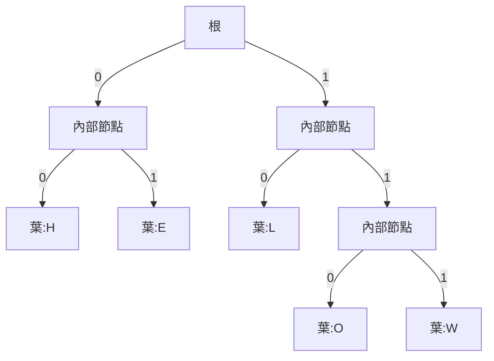
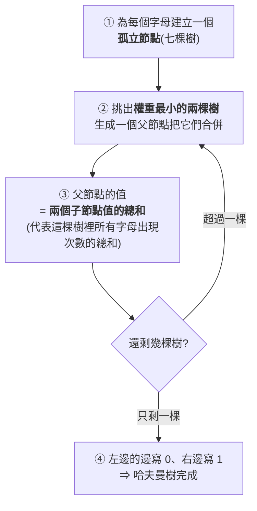
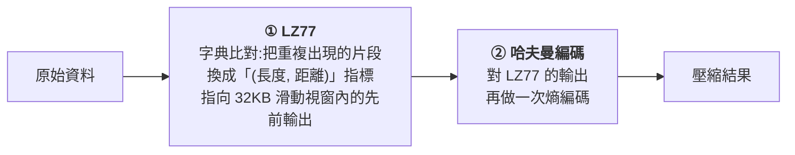

# 哈夫曼編碼:為什麼檔案能越壓越小,以及「前綴碼」這個關鍵限制

> 整理自 YouTube 頻道 **程序员老王**〈[哈夫曼编码是什么?10分钟看懂文件为什么能越压越小](https://www.youtube.com/watch?v=KY4dBSlTvwU)〉(2026-09-10,約 10.7 分鐘,無字幕、以 CPU faster-whisper 轉錄)。
> ⭐ **本文的所有數字都已用程式獨立驗算**,並補上影片未提、但實務上很重要的兩點(見 §8)。

---

## 一句話總結

> **壓縮的核心不是「把資料變小」,而是「讓常出現的東西用短編碼」。**
> **但一旦編碼長度不固定,就會產生「解壓時分不清邊界」的歧義 ——
> ⭐⭐⭐ 哈夫曼樹同時解決了這兩件事:用樹結構天然保證「沒有任何編碼是別人的前綴」,
> 並且在所有可能的前綴碼裡,挑出總長度最短的那一種。**

---

## 一、先看問題:Hello World 佔了多少空間

**ASCII 編碼下,一個字元用一個位元組(8 個 0/1):**

| 字母 | ASCII | 二進位 |
|---|---|---|
| `h` | 104 | `01101000` |
| `e` | 101 | `01100101` |
| `l` | 108 | `01101100` |

**`Hello World`(不含空格)共 10 個字元 ⇒ 80 個 0 和 1。**

⚠️ **但觀察一下:整串只用到 `H`、`E`、`L`、`O`、`W`、`R`、`D` 共 7 個字母。**

> **8 個 0/1 可以表示 256 種組合,只用來表示 7 個字母 —— 太浪費了。**

---

## 二、⭐ 第一次嘗試:隨便分配短編碼(會失敗)

**照二進位由小到大分配:**

| 字母 | 編碼 | 長度 |
|---|---|---|
| `h` | `0` | 1 |
| `e` | `1` | 1 |
| `l` | `10` | 2 |
| `o` | `11` | 2 |
| `w` | `100` | 3 |
| `r` | `101` | 3 |
| `d` | `110` | 3 |

**`Hello World` ⇒ 21 個 0/1,只佔原始空間的 26%。看起來大獲全勝。**

### ⚠️⚠️ 但解壓的時候會撞牆

**手上有編碼表和一串 0/1,開始還原:**

| 位置 | 判讀 |
|---|---|
| 第 1 位 `0` | ✅ 是 `h`,沒問題 |
| 接下來 `110…` | ⚠️⚠️ **是 `1`(e)?是 `11`(o)?還是 `110`(d)?** |

> ⭐⭐⭐ **歧義的根源:有些編碼是另一些編碼的「前綴」。**
> `11`(o)是 `110`(d)的前綴 ⇒ 遇到 `110` 時無法判斷。

📌 **所以壓縮編碼的第一條硬性要求:**

> ⭐⭐ **任何一個編碼,都不能是另一個編碼的前綴。**
> **(這類編碼有個正式名稱:**前綴碼 / prefix-free code**。)**

---

## 三、⭐⭐⭐ 用樹結構天然滿足「無前綴」



**規則很簡單:**

| 步驟 | 做法 |
|---|---|
| ① | **把要編碼的字母全部放在葉節點上** |
| ② | 每個非葉節點,**左邊的邊寫 `0`、右邊寫 `1`** |
| ③ | **一個字母的編碼 = 從根節點走到它的葉節點,沿路經過的所有 0/1** |

### ⭐⭐ 為什麼這樣就一定沒有前綴衝突

> **因為七個字母全都在**葉節點**上,而走到任何一個葉節點的路上,經過的都是**非葉節點**。**
>
> ⭐⭐⭐ **換句話說:一個字母編碼的每一段前綴,都「停在半路上」,絕對落不到別的字母頭上。**

📌 **這是全片最漂亮的一個轉換 —— 把一個「編碼設計的約束」變成了「資料結構的性質」。**

---

## 四、⭐ 但樹有很多種,哪一棵最好?

**同樣七個字母,樹可以長成很多形狀,每一棵都是合法的前綴碼 ——
但每棵樹編出來的 `Hello World` 總長度不一樣。**

> ⭐⭐ **判準:哪棵樹壓出來的資料最短,哪棵樹就最好。**

**`Hello World` 的字母出現次數:**

| 字母 | 次數 |
|---|---|
| **L** | ⭐ **3** |
| **O** | **2** |
| H / E / W / R / D | 各 **1** |

> ⭐⭐⭐ **核心直覺:把 `L` 安排在離根很近的地方(編碼短),編碼時就能省三次;
> 放到遠離根的地方,就虧三次。**

**⇒ 我們要找的,是讓總長度最短的那棵樹。它就叫哈夫曼樹。**

---

## 五、⭐⭐⭐ 怎麼建哈夫曼樹:每次挑最小的兩棵合併



### ⭐⭐ 為什麼「挑最小的兩棵」就能得到最優解

**影片點出一個關鍵觀察,值得停下來想一下:**

> **一個字母所在的樹,**被合併的次數越多**,這個字母的編碼就**越長** ——
> 因為每次合併,它就多出一個祖先節點。**

**反過來推:**

| 目標 | 對應的操作 |
|---|---|
| 出現次數**多**的字母 ⇒ 要**短**編碼 | ⭐ **越晚被合併越好** |
| 出現次數**少**的字母 ⇒ 可以**長**編碼 | ⭐ **越早被合併越好** |

> ⭐⭐⭐ **所以「每次挑當前權重最小的兩棵樹合併」,就是在執行上面這條原則。**

### 實際跑一遍(`Hello World`)

**起始七棵樹(權重就是出現次數):** `3(L), 2(O), 1(H), 1(E), 1(W), 1(R), 1(D)`

| 步驟 | 合併 | 剩下的權重 |
|---|---|---|
| 1 | 1 + 1 | `3, 2, 2, 1, 1, 1` |
| 2 | 1 + 1 | `3, 2, 2, 2, 1` |
| 3 | 1 + 2 | `3, 3, 2, 2` |
| 4 | 2 + 2 | `4, 3, 3` |
| 5 | 3 + 3 | `6, 4` |
| 6 | 6 + 4 | `10` ✅ 完成 |

📌 **⭐ 順帶一個很實用的心算技巧(影片沒明講,但從過程可以看出來):**

> **壓縮後的總位元數 = 所有「內部節點」權重的總和。**
> **本例:2 + 2 + 3 + 4 + 6 + 10 = 27 位元。**

---

## 六、⭐⭐ 結果與那個看似矛盾的地方

| 方案 | 位元數 | 佔 ASCII 的比例 | 能否正確解壓 |
|---|---|---|---|
| **ASCII** | **80** | 100% | ✅ |
| ⚠️ **隨便分配的短編碼** | **21** | 26% | ❌ **根本還原不回來** |
| ⭐ **哈夫曼編碼** | **27** | **33.75%** | ✅ |

> ⭐⭐⭐ **影片在這裡處理得很好,直接面對讀者會有的疑問:**
> **「剛才那個亂分配的編碼才 21 位,現在反倒多了 6 位?」**
> **「沒錯 —— 我們用 6 位資料的代價,換來的是『可以解壓』的保證。
> 21 位那一版,你根本還原不回 Hello World。」**

📌 **而 27 / 80 ≈ 34%,正好和開頭那本《西遊記》壓完的比例差不多 —— 首尾呼應得很漂亮。**

---

## 七、⭐ 那個「很專業的數學性質」:帶權路徑長度和最小

**哈夫曼樹的正式最優性描述是:**

> **葉節點的「帶權路徑長度之和」(WPL, Weighted Path Length)最小。**

| 名詞 | 白話 |
|---|---|
| **葉子的權** | 葉節點上寫的數字,**也就是這個字母出現的次數** |
| **一個葉子的帶權路徑長度** | **權 × 深度**(從根走到它要經過幾條邊) |
| ⭐⭐ **為什麼這等價於「壓縮後最小」** | **深度 = 該字母的編碼長度;權 = 出現次數 ⇒ 權 × 深度 = 這個字母在壓縮結果中佔的總位元數** |

> ⭐⭐⭐ **所以「帶權路徑長度之和最小」和「壓縮後資料最小」,其實是同一件事的兩種說法。**

### ⭐ 一個容易被忽略的性質:哈夫曼樹不唯一,但長度唯一

**建樹時有兩處可以任意選:**
- **若干棵同樣小的樹之間,挑哪兩棵合併** —— 沒有規定
- **合併時誰當左子樹、誰當右子樹** —— 也沒有規定

> ⭐⭐ **所以同一個字串可以建出好幾棵不同的哈夫曼樹。
> 但無論用哪一棵:① 都保證沒有歧義 ② 壓縮出來的總長度都一樣,而且都是最短的。**

📌 **這也是為什麼實務上必須把「編碼表」跟壓縮資料一起存 ——
因為解壓端無法從資料本身推出你用的是哪一棵樹。**

---

## 八、⭐⭐⭐ 影片沒提、但實務上很重要的兩點

### ⚠️⚠️ 8.1 真正的壓縮軟體不是「純哈夫曼」

**影片開頭用 PNG 舉例(32MB BMP → 20MB PNG),但整片只講哈夫曼。實際上:**



| 格式 | 用的演算法 |
|---|---|
| **PNG** | **DEFLATE**(= LZ77 + 哈夫曼) |
| **ZIP** | **DEFLATE** |
| **GZIP** | **DEFLATE** |

> ⭐⭐⭐ **關鍵補正:哈夫曼只處理「單個符號的出現頻率不均」,處理不了「重複的片段」。**
> **`ABCABCABCABC` 這種字串,四個字母頻率相同,哈夫曼幾乎無能為力;
> 但 LZ77 一眼就看出它是「ABC 重複四次」。**
>
> 📌 **所以 DEFLATE 的設計是分工:LZ77 先吃掉重複,哈夫曼再吃掉頻率不均。**

### ⭐ 8.2 哈夫曼的最優性是有前提的

| 前提 | 說明 |
|---|---|
| **符號獨立且機率已知** | 哈夫曼是在「已知每個符號出現機率」下的最優**前綴碼** |
| ⚠️ **每個符號至少 1 位元** | **這是哈夫曼的硬傷** —— 若某符號機率高達 0.99,理論上只需約 0.0145 位元,**但哈夫曼最少給它 1 位元** |
| ⭐ **算術編碼 / ANS 可以突破這個下限** | 現代格式(如 Zstandard、Brotli、JPEG XL)多用這類方法逼近夏農熵 |

> ⭐ **一句話:哈夫曼是「整數位元」世界裡的最優解,不是所有壓縮法裡的最優解。**

---

## 應用案例

### 案例 1|⭐⭐ 判斷「這份資料值不值得壓縮」

**開壓之前先問兩個問題:**

| 問題 | 適合的手段 |
|---|---|
| **符號頻率差很多嗎?**(如中文文本、log 檔的固定欄位) | ⭐ **哈夫曼有效** |
| **有大量重複片段嗎?**(如 JSON / XML 的重複 key、重複的 stack trace) | ⭐ **LZ77 類更有效** |
| ⚠️ **都不是?**(如已加密資料、已壓縮的 JPEG/MP4) | ⚠️ **別壓了 —— 幾乎沒有空間,還會白燒 CPU** |

📌 **實務經驗:對已經壓縮過的檔案再壓一次,體積有時反而變大**(多了容器與編碼表的開銷)。

### 案例 2|⭐ 自己實作一次(20 行 Python 就能驗證最優性)

**不需要真的建樹,就能算出哈夫曼壓縮後的位元數 —— 利用 §5 的那個技巧:**

```python
import heapq
from collections import Counter

def huffman_bits(s: str) -> int:
    """回傳字串 s 用哈夫曼編碼後的總位元數。

    原理:壓縮後的總長度 = 建樹過程中所有「內部節點」權重的總和。
    不需要真的建出樹,只要重複取出兩個最小值合併即可。

    Args:
        s: 要計算的字串。

    Returns:
        壓縮後的總位元數(不含編碼表本身的開銷)。
    """
    freq = list(Counter(s).values())
    if len(freq) <= 1:          # 只有一種符號時,哈夫曼碼長定義為 0
        return 0
    heapq.heapify(freq)
    total = 0
    while len(freq) > 1:
        a = heapq.heappop(freq)
        b = heapq.heappop(freq)
        total += a + b          # 每個內部節點的權重都要計入一次
        heapq.heappush(freq, a + b)
    return total

text = "HelloWorld"
print(huffman_bits(text))            # 27
print(len(text) * 8)                 # 80
print(huffman_bits(text) / (len(text) * 8))   # 0.3375
```

⭐ **拿你自己的 log 檔跑一次,就能估出「純哈夫曼」的理論上限,再跟 `gzip` 的實際結果比 ——
差距的那一部分,就是 LZ77 的貢獻。**

### 案例 3|⭐ 為什麼這個概念在 LLM 時代反而更常遇到

📎 **tokenizer 的 BPE(Byte Pair Encoding)跟哈夫曼是「同一個家族的不同分支」:**

| | 哈夫曼 | BPE |
|---|---|---|
| **目標** | 讓**常出現的符號**用短編碼 | 讓**常出現的字元組合**變成單一 token |
| **方向** | ⭐ **由下往上合併**(每次挑最小的兩個) | ⭐ **由下往上合併**(每次挑最常一起出現的兩個) |
| **差別** | 優化的是**位元數** | 優化的是 **token 數** |

📎 **對照本庫 [[token-vs-embedding-llm-and-rag]] 記錄的實測:
GPT-2 下「苹果」要 6 個 token,GPT-4o 只要 1 個 —— 同一段話成本差 2.8 倍。
⭐⭐ 那正是「更好的合併策略 = 更短的編碼」這個哈夫曼式直覺,在 tokenizer 上的體現。**

---

## 重點回顧(TL;DR)

1. **壓縮的核心:讓常出現的符號用短編碼。**
2. ⚠️ **但長度不定的編碼會產生歧義** —— 根源是**某些編碼是另一些編碼的前綴**。
3. ⭐⭐⭐ **樹結構天然解決前綴問題**:字母全放葉節點,則任何編碼的前綴都「停在半路」,落不到別的字母頭上。
4. **合法的樹有很多棵,最優的那棵叫哈夫曼樹。**
5. ⭐⭐ **建樹規則:每次挑權重最小的兩棵合併** —— 因為「被合併越多次,編碼越長」,所以出現次數少的要越早被合併。
6. ⭐ **心算技巧:壓縮後總位元數 = 所有內部節點權重的總和。**
7. **`Hello World` 實測:ASCII 80 位 → 哈夫曼 27 位(33.75%)。**
8. ⭐⭐⭐ **那個「亂分配只要 21 位」的方案不是更好,是根本還原不回來** —— 多花的 6 位換來的是「可以解壓」。
9. **正式性質:葉節點帶權路徑長度之和(WPL)最小 —— 這和「壓縮後最小」是同一件事。**
10. ⭐ **哈夫曼樹不唯一,但壓縮長度唯一且最短**;所以編碼表必須跟資料一起存。
11. ⚠️⚠️ **實務補正:PNG / ZIP / GZIP 用的是 DEFLATE = LZ77 + 哈夫曼** —— 哈夫曼處理不了「重複片段」,那是 LZ77 的工作。
12. ⚠️ **哈夫曼的硬傷:每個符號至少佔 1 位元**,所以機率極高的符號會浪費;算術編碼 / ANS 才能逼近夏農熵。

---

## 核實狀態

### ✅ 已核實(本文獨立驗算)

| 影片說法 | 驗算結果 |
|---|---|
| **`Hello World` 的 ASCII 編碼 = 80 位元** | ✅ **屬實**(10 字元 × 8) |
| ⭐ **隨意分配的短編碼 = 21 位元** | ✅ **屬實**(h1+e1+l2+l2+o2+w3+o2+r3+l2+d3 = 21) |
| ⭐⭐ **哈夫曼編碼 = 27 位元** | ✅ **屬實**(內部節點權重和:2+2+3+4+6+10 = 27) |
| **27 / 80 ≈ 34%** | ✅ **屬實**(精確為 **33.75%**) |
| **字母頻率 L=3、O=2、其餘各 1** | ✅ **屬實** |
| **葉節點帶權路徑長度之和最小(WPL)是哈夫曼樹的正式性質** | ✅ **屬實**,為標準教科書定義 |
| **哈夫曼樹不唯一但壓縮長度唯一** | ✅ **屬實** |

### ✅ 已核實(比對公開資料)

| 項目 | 核實結果 |
|---|---|
| **PNG / ZIP / GZIP 使用 DEFLATE** | ✅ **屬實**;DEFLATE = **LZ77 + 哈夫曼**,LZ77 使用 **32KB 滑動視窗**的 (長度, 距離) 指標(RFC 1951) |

### ⚠️ 數字合理但未能精確核對(以影片轉述看待)

| 影片說法 | 說明 |
|---|---|
| **《西遊記》82 萬字 → 2.4MB 純文字** | ⭐ **量級吻合**:82 萬漢字 × 3 位元組(UTF-8)≈ **2.35MB** |
| ⚠️ **壓縮後「580KB」但又說「佔 35%」** | ⚠️⚠️ **兩個數字互相矛盾**:2.4MB 的 35% 約為 **860KB**,而 580KB 約為 **24%**。⭐ **轉錄中此處另有「850K」出現過,研判 580KB 為 Whisper 聽寫誤差,實際應為 840–860KB 一帶。** |
| **4K 照片未壓縮 BMP 約 32MB → PNG 約 20MB(約 60%)** | ⭐ **量級吻合**:3840×2160×4 位元組(含 alpha)≈ **31.6MB**;20/32 = **62.5%**。⚠️ **實際 PNG 壓縮率高度依賴圖片內容,此為單一樣本。** |

### ⚠️ 本文補充、非影片內容

- **§8.1 的 DEFLATE 分工說明**與 **§8.2 的哈夫曼最優性前提**(每符號至少 1 位元、算術編碼/ANS)——
  **皆為本文補充,影片未提及。**
- **§案例 3 的 BPE 對照** —— 本文的延伸類比,非影片論點。

---

## 來源

- [哈夫曼编码是什么?10分钟看懂文件为什么能越压越小 — 程序员老王](https://www.youtube.com/watch?v=KY4dBSlTvwU)(2026-09-10,約 10.7 分鐘)
- 核實用資料:
  - [RFC 1951 — DEFLATE Compressed Data Format Specification v1.3](https://www.w3.org/Graphics/PNG/RFC-1951)(PNG / ZIP / GZIP 所用的壓縮格式規格)
  - [How the Deflate Algorithm Works Inside PNG Files](https://www.compressanimage.com/blog/how-deflate-algorithm-works)
  - [The Internet's Shrink Ray: Data Compression with Huffman, LZ77, and Deflate](https://medium.com/@rutgersusacs/the-internets-shrink-ray-data-compression-with-huffman-lz77-and-deflate-04ab37f01819)
- 延伸:本庫 [[token-vs-embedding-llm-and-rag]](tokenizer 的 BPE 與哈夫曼的同源直覺)、[[dominating-programming-concepts]]、[[kv-cache]](另一種「用結構省空間」的思路)。

> 該片無字幕,逐字稿以 CPU 版 faster-whisper(small / int8 / zh)轉錄取得,**非官方字幕**,可能有少量聽寫誤差。
> 文中專有名詞已依上下文校正:轉錄中的「Half-man 變滿 / 哈夫漫 / 哈罗沃尔」為 **哈夫曼 / Huffman / Hello World**、
> 「ask 編碼 / 阿斯科編碼 / Azker 編馬」為 **ASCII 編碼**、「二心之位 / 雴和 1 / 零和一」為 **二進位位元**、
> 「前坠 / 迁坠 / 缱質」為 **前綴**、「奇異 / 奇弊」為 **歧義**、「二差數 / 數形結構」為 **二元樹 / 樹狀結構**、
> 「帶拳路徑 / 帶權路征」為 **帶權路徑**、「稀有記」為 **《西遊記》**、「卫圖」為 **BMP 點陣圖**。
