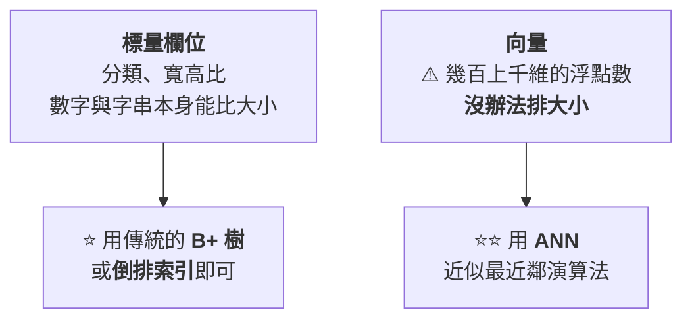
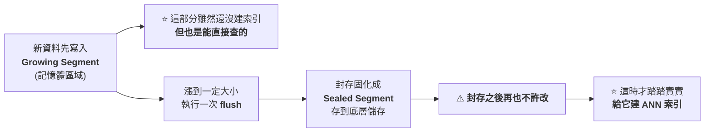
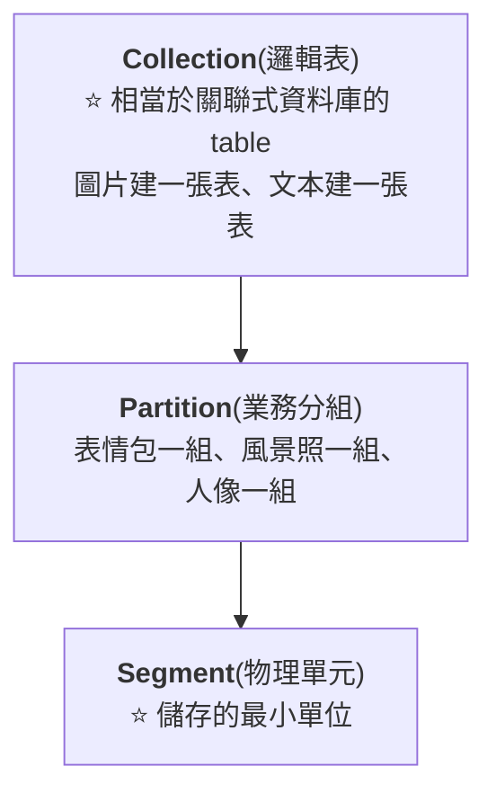
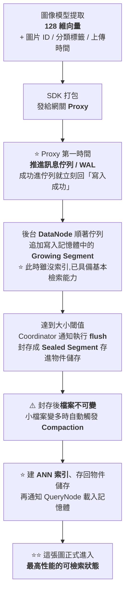
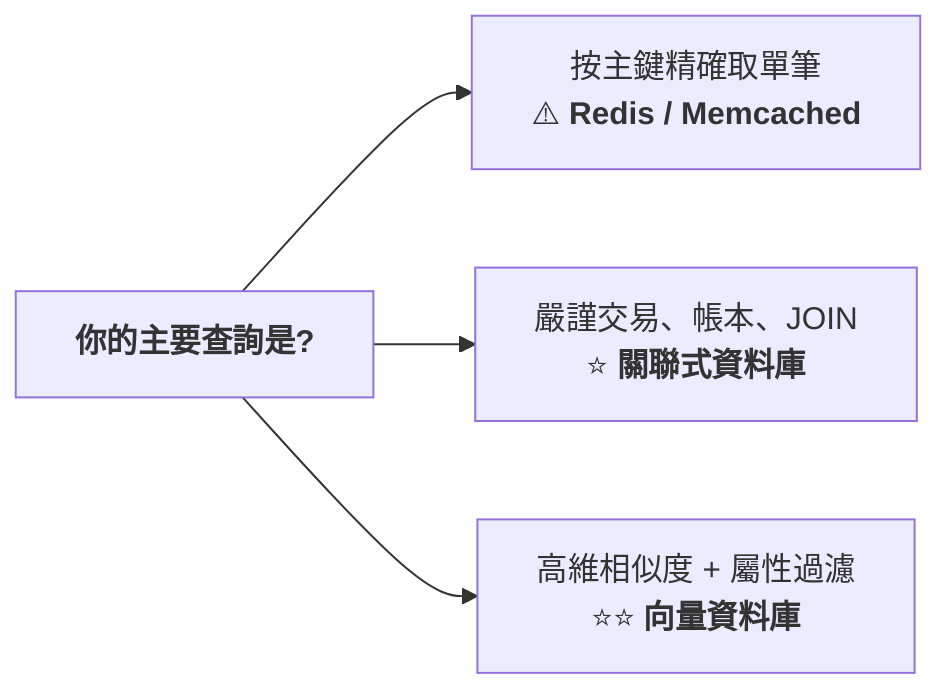

# Milvus 架構拆解:從「Segment 不可變」到存算分離,以及 2.6 版已經改掉的三件事

> 整理自 YouTube 頻道 **白白说大模型**〈[Milvus架构解析:从单机到分布式讲透](https://www.youtube.com/watch?v=-hKHbHA0KKI)〉(2026-09-20,約 16.8 分鐘)。
> **該片無字幕也無自動字幕,逐字稿以 CPU faster-whisper 轉錄取得、非官方字幕**,可能有少量聽寫誤差(專有名詞對照見文末)。
>
> ⚠️⚠️⚠️ **本文比對 [Milvus 官方 2.6 發布說明](https://milvus.io/blog/introduce-milvus-2-6-built-for-scale-designed-to-reduce-costs.md) 後發現:
> **影片描述的是 Milvus 2.5 及更早的架構,其中三個關鍵元件在 2.6 已經改掉了**(見 §八)。**
>
> ⭐ **好消息是:影片講的**設計思想**(不可變 Segment、讀寫分離、存算分離、三層資料組織)**全部仍然成立** ——
> **變的是元件怎麼拆,不是為什麼這樣拆。**

---

## 一句話總結

> ⭐⭐⭐ **「向量資料庫真正扮演的角色,是 AI 系統的**外掛長期記憶庫與動態檢索中樞** ——
> 把適合模糊匹配、算相似距離的高維特徵交給它,**把嚴格精確查詢的結構化資料留在傳統庫裡**。」**
>
> ⭐⭐ **「技術從來都不是非此即彼的。」**

---

## 一、⭐⭐ 為什麼「折疊螢幕手機」能搜到 iPhone Duo

**字面上這兩個詞一個字都沒對上。人能反應過來,是因為知道最近蘋果的折疊螢幕很紅。**


> ⚠️ **「但如果要面對幾千萬甚至幾億條高維向量 —— 既要存得下,又要在幾十毫秒裡把距離最近的幾條翻出來,
> **普通的儲存肯定靠不住**。」**

---

## 二、⭐⭐⭐ 關鍵定位:它不是只會比對向量

> ⚠️ **「如果一個資料庫只能比對向量,在實際業務裡其實是很難用的。」**

**一張圖片除了視覺特徵向量,還有一堆附加資訊:**

| 附加資訊 | 在向量資料庫裡叫 |
|---|---|
| **ID、上傳者** | ⭐ **標量(scalar)** |
| **標籤(風景 / 人像)** | **標量** |
| **寬高比(16:9 / 4:3)** | **標量** |

> ⭐⭐⭐ **Milvus 做的很關鍵的一點:**把向量比對和傳統的標量過濾結合在一起**。**

**⭐ 翻成人話的查詢意圖:**

> **「先把**符合風景標籤、寬高比 16:9** 的圖片篩出來,
> 在剩下的圖片裡按**跟我的目標向量的接近程度**排序,取最像的前 10 張。」**

> ⭐⭐ **「它是一個既懂高維向量空間計算、又懂傳統結構化條件過濾的企業級資料庫。」**

---

## 三、⭐⭐ 兩套索引配合:為什麼幾十毫秒能查完



### ⭐ 兩個最常用的 ANN 思路

| 演算法 | 做法 |
|---|---|
| ⭐⭐ **HNSW** | **在高維空間裡連成一張立體導航網**:先在高層的稀疏網路裡快速定位大方向,越接近目標再切到低層密集網路找最近的點。⭐ **速度快、召回率也高** |
| ⭐ **IVF_PQ** | **先用聚類把空間切成一堆桶** → 先找目標大概落在哪個桶 → 再配合**乘積量化把浮點數壓縮**,⭐ **大幅降低記憶體開銷** |

### ⭐⭐⭐ 真正的查詢過程是兩邊同時跑

> **「一邊用倒排索引過濾屬性,一邊用 ANN 索引跑向量距離 ——
> **兩邊結果一碰取交集,搜尋範圍一下就小了。**」**

---

## 四、⭐⭐⭐ 儲存的核心:Segment,以及那條「生成後絕不再改」的規矩

### 4.1 Segment 是什麼

> **在底層,**向量特徵單獨占一列、其他標量欄位各成一列**,打包在一起作為一個邏輯單元 —— 這就是 Segment,**資料儲存的最小單元**。**

⭐ **一個關鍵設計:索引檔案與原始資料是分開放的。**

> ⭐⭐ **好處很明顯:「以後不管是重新建索引、還是改索引參數,**原始資料檔案完全不受影響**。」**

### 4.2 ⭐⭐⭐ 那條最重要的規矩:資料檔案一旦生成就絕對不能再被修改

> ⚠️⚠️ **「如果新資料一邊往裡寫、舊索引一邊改,**讀寫肯定會互相卡死**。」**



> ⭐⭐⭐ **「**舊資料只讀、新資料只寫,讀寫就徹底解開了。**」**

### 4.3 ⭐ Compaction:控制碎片

> **「小的 Sealed 檔案會越積越多,系統後台會定期跑 **Compaction**,
> 把多個零碎小段合併成一個緊湊的大段 —— **把檔案數量和索引碎片穩穩控制住**。」**

---

## 五、⭐⭐ 三層資料組織:Collection → Partition → Segment



### 5.1 ⭐⭐⭐ Partition 解決的問題:分區裁剪

> ⚠️ **「如果每次檢索都把所有 Segment 從頭到尾掃一遍,那還是在白白浪費算力。」**
>
> ⭐⭐ **「這次很明確:使用者只想搜**表情包** —— 那風景照、人像圖那些 Segment,
> **我們其實完全沒必要翻開看。**」**
>
> ⭐ **搜尋請求指定分區後,底層自動跳過另外兩個分區,**掃描的資料量砍掉一大半** —— 這就叫**分區裁剪**。**

### 5.2 ⭐ 為什麼還需要 Collection 這一層

> **「圖片用視覺模型、文本用語言模型,**向量維度和演算法模型完全不一樣** ——
> 硬把它們塞到同一個分區甚至一張表裡,**根本沒法統一檢索**。」**

---

## 六、⭐⭐⭐ 從單機走向分布式的兩步

> ⚠️ **「一台機器的 CPU、記憶體和磁碟終究有上限。資料量一旦從幾百萬長到上億、併發一高,單機遲早頂不住。」**

### 6.1 第一步:資料分片

> **一個 Collection 裡的海量資料,**透過主鍵雜湊直接打散**,均勻分到不同節點。**
>
> ⭐⭐ **「既解決了容量問題,又能避免某台機器被突發流量打滿變成**熱點**。」**

### 6.2 ⭐⭐⭐ 第二步:存算分離

> ⚠️ **「傳統架構裡,儲存和計算往往是死死綁在一起的。**
> **但向量檢索通常是**讀多寫少**,讀操作特別吃 CPU 和記憶體,而磁碟通常還很空閒 ——
> ⚠️⚠️ **如果綁在一起,為了擴充算力就得連帶著買高配磁碟,這很不划算。**」**


---

## 七、⭐⭐ 讀寫分離:把職責徹底拆開

> ⚠️ **「寫資料吃的是網路頻寬和磁碟 IO,查詢吃的是記憶體和 CPU,
> 而後台建索引又是特別消耗算力的事 ——
> ⚠️⚠️ **一旦系統在後台瘋狂建索引,前台使用者的查詢請求可能會被嚴重卡頓。**」**

| 元件 | 職責 |
|---|---|
| **DataNode** | **消費資料、往裡寫** |
| **QueryNode** | **把資料與索引載入記憶體,給使用者跑查詢比對** |
| ⚠️ **IndexNode** | **在後台默默構建 ANN 索引**(⚠️⚠️ **2.6 已移除,見 §8.1**) |
| **Proxy** | ⭐ **統一網關**:所有讀寫請求由它對接、分發,再把各節點結果彙總還給應用 |
| **Coordinator** | **總指揮**:該讀哪個段、該寫哪個,由它統籌 |
| **etcd** | ⭐ **保存節點狀態、分片資訊這些元資料**(一致性極高) |

> ⭐⭐ **「誰遇到性能瓶頸,就單獨給誰擴容 —— 資源分配就非常精細了。」**

### 7.1 ⭐⭐⭐ 高可用:三條兜底

| 面向 | 做法 |
|---|---|
| ⭐⭐ **寫入側** | **Proxy 與寫節點之間插入一層**分布式訊息佇列**:Proxy 收到資料只要成功推進佇列,就立刻回「寫入成功」;DataNode 再慢慢拉取消費。⭐ **就算 DataNode 掛了,重啟後從上次的 offset 繼續讀就行** —— **本質上這就是預寫日誌(WAL)** |
| **查詢側** | **多副本**:同一份資料段可讓兩到三台 QueryNode 各存一份;⭐ **一台掛了 Proxy 自動把流量切到健康節點,業務端幾乎感受不到波動** |
| **協調側** | ⭐ **所有元資料都即時存在 etcd 裡,Coordinator 掛了隨時拉一個新的接管** |

---

## 八、⚠️⚠️⚠️ 本文核實後發現:影片講的是 2.5 及更早的架構

**⭐ 設計思想全部仍成立,但**元件怎麼拆**在 Milvus 2.6 有三處重大改動。**

### 8.1 ⚠️⚠️⚠️ IndexNode 已經被移除

> **影片把 IndexNode 當成三大工作節點之一(DataNode / QueryNode / IndexNode)。**
>
> ⚠️⚠️ **官方 2.6:**IndexNode 已被移除並整併****。

### 8.2 ⚠️⚠️⚠️ 不再依賴外部訊息佇列:Woodpecker 零磁碟 WAL

> **影片說「Proxy 與寫節點之間插入一層分布式訊息佇列」——
> 在 2.5 及更早,那指的是 **Pulsar 或 Kafka** 這類外部相依。**
>
> ⭐⭐⭐ **官方 2.6 原文:**
> **「Milvus 2.6 introduces **Woodpecker**, a purpose-built, cloud-native WAL system that
> **eliminates these external dependencies** through a revolutionary **zero-disk design**」** ——
> **所有日誌資料直接持久化到物件儲存(S3 / GCS / MinIO),不再依賴本機磁碟或外部 MQ。**

📌 **⭐ 影片說「本質上這就是預寫日誌」是完全對的 —— ⭐⭐ 2.6 只是把這個 WAL 從「借用外部 MQ」變成「自己做一個雲原生的」。**

### 8.3 ⚠️⚠️ 新增 StreamingNode,QueryNode 的職責縮小了

| | **影片描述(2.5 及更早)** | ⭐ **官方 2.6** |
|---|---|---|
| **即時資料** | **QueryNode 同時處理 Growing Segment 的即時查詢與歷史段的批次查詢** | ⭐⭐⭐ **新增 StreamingNode,專責:消費訊息佇列、寫增量段、服務增量查詢、管理 WAL 恢復** |
| ⚠️ **QueryNode** | **兩者都管** | ⚠️⚠️ **「QueryNode now handles **only batch queries on historical segments**」** |

> ⭐⭐⭐ **官方的說法是:2.6 在**串流負載與批次負載之間劃了一條清楚的線**,
> 消除了 2.5 裡的跨元件糾纏。**

### ⭐ 不變的部分(官方明列)

> **Proxy、Coordinator、DataNode、etcd(元資料)、物件儲存 —— **這幾個在架構中維持不變**。**

### 8.4 ⭐⭐ 順手補上影片沒提的 2.6 成本特性

| 特性 | 官方數字 |
|---|---|
| ⭐⭐⭐ **RaBitQ 量化** | **1-bit 量化搭配可選的 SQ8 精修:記憶體降 **72%**、查詢快 **4×**,⭐ **仍維持 95% 召回**,只用原始記憶體佔用的 1/4** |
| ⭐ **分層儲存** | **自動區分冷熱資料,冷段自動移到便宜的物件儲存 —— **儲存成本最多降 50%**** |
| **BM25 全文檢索** | **在相同召回下,吞吐是 Elasticsearch 的 3–4 倍** |
| **JSON Path 索引** | ⭐ **過濾快 100 倍**(延遲從 140ms 降到 1.5ms) |
| **多租戶** | **單一叢集支援最多 10 萬個 Collection** |

> ⭐⭐ **§三提到 IVF_PQ「用乘積量化把浮點數壓縮、降低記憶體開銷」的思路,
> **在 2.6 有了更激進的版本(RaBitQ 的 1-bit 量化)** —— 這條線是一脈相承的。**

---

## 九、⭐⭐⭐ 把整條鏈路串一遍:以圖搜圖

### 9.1 寫入鏈路



> ⭐⭐ **對外部業務來說,寫入的回應速度非常快 —— 因為只要進了佇列就回成功。**
> ⚠️ **§8.1/§8.3 註記:在 2.6,「建索引」那一步不再由獨立的 IndexNode 負責。**

### 9.2 ⭐⭐ 查詢鏈路(向量 + 標量混合檢索)

| 步驟 | 發生什麼 |
|---|---|
| **①** | **模型把上傳的圖片即時轉成查詢向量** |
| **②** | **請求打到 Proxy;Proxy 去 Coordinator 查路由,看哪些 QueryNode 負責這批資料** |
| **③** | ⭐ **請求併發分發出去** |
| ⭐⭐ **④** | **每個 QueryNode 在自己記憶體裡**同時跑兩件事**:一邊用 HNSW 比對空間距離,一邊用標量索引過濾「16:9」的條件 —— **兩邊結果一碰取交集** |
| **⑤** | **各節點拿出局部候選結果,彙總回 Proxy** |
| ⭐ **⑥** | **Proxy 做一次**全局重新排序**,把相似度最高的前幾張還給使用者** |

> ⭐ **「整個過程基本上在幾十毫秒內就可以搞定。」**

### 9.3 ⚠️⚠️ 一個很誠實的取捨:純主鍵查詢別用它

> **「如果業務端已經拿到圖片 ID 是 100,只想按 ID 把屬性查出來 ——
> ⚠️ **QueryNode 其實也能查,但它必須把這個分區下所有 Segment 的主鍵索引併發排查一遍**才能定位到。」**
>
> ⭐⭐⭐ **「雖然功能支援,但這種查法**把算力放大得比較明顯**。
> Milvus 的強項是**高維空間的近似相似度計算**;
> **像這種按主鍵 ID 的精確點查,老老實實交給 Redis 或 Memcached 會合適得多。**」**

---

## 十、⭐⭐ 收尾:向量資料庫不是要顛覆傳統資料庫

| 誰 | 管什麼 |
|---|---|
| **關聯式資料庫** | ⭐ **嚴謹的交易資料與業務帳本** |
| ⭐⭐ **向量資料庫** | **AI 系統的**外掛長期記憶庫與動態檢索中樞**;適合模糊匹配、算相似距離的高維特徵** |

> ⭐⭐⭐ **「在成熟的系統架構裡,技術從來都不是非此即彼的。
> **讓專業的元件幹專業的事**,兩者配合起來才能搭出高併發、高可用、能在工業界穩穩落地的 AI 應用架構。」**

📎 **這與本庫 [[token-vs-embedding-llm-and-rag]] 的「LLM embedding 在入口打散 token、RAG embedding 在出口概括整段」接得上:
⭐ **那篇講 embedding 怎麼來的,這篇講 embedding 存進去之後怎麼查。****

---

## 應用案例

### 案例 1|⭐⭐⭐ 選型判準:你的查詢到底長什麼樣



> ⚠️⚠️ **本篇最實際的一條:**別因為「我們在做 AI」就把所有查詢塞進向量庫**。
> **純主鍵點查在 Milvus 裡要掃遍該分區所有 Segment 的主鍵索引。**

### 案例 2|⭐⭐⭐ 設計分區時,先想「哪些資料永遠不會一起查」

> ⭐ **分區裁剪能砍掉的掃描量,完全取決於你的分區維度選得對不對。**

| 判準 | 說明 |
|---|---|
| ⭐⭐⭐ **① 查詢時幾乎一定會被指定的欄位** | **例:圖片類型(表情包 / 風景 / 人像)** |
| ⚠️ **② 基數不要太高** | **分區太多會讓中繼資料與調度成本上升** |
| ⭐ **③ 分布要相對均勻** | **避免一個分區佔九成資料,裁剪就失去意義** |

📌 ⚠️ **而「向量維度或模型不同」的資料,**不是分區問題,是該分成不同 Collection**(見 §5.2)。**

### 案例 3|⭐⭐ 把「不可變 Segment」這招用在你自己的系統裡

> ⭐⭐⭐ **這個設計不是 Milvus 獨有的,它是一個通用手法:**
> **「讓寫入落在一個可變的小緩衝區,達到閾值就**封存成不可變檔案**,
> 之後所有重活(建索引、壓縮、搬到冷儲存)都只在不可變檔案上做。」**

```python
def should_seal(segment_bytes: int, max_bytes: int, idle_seconds: float,
                max_idle: float) -> bool:
    """判斷一個 growing segment 是否該封存成 sealed segment。

    封存後檔案不可變,才能安全地在背景建索引與壓縮。

    Args:
        segment_bytes: 目前累積的位元組數。
        max_bytes: 觸發封存的大小閾值。
        idle_seconds: 距離上次寫入的秒數。
        max_idle: 即使未達大小,閒置超過此秒數也封存(避免資料遲遲不可查)。

    Returns:
        bool: 是否應該封存。
    """
    return segment_bytes >= max_bytes or idle_seconds >= max_idle
```

> ⭐ **同樣的模式你會在 LSM-Tree、Kafka 的 log segment、Parquet 資料湖裡反覆看到 ——
> **「可變的小窗口 + 不可變的大檔案」是處理「高頻寫入 vs 昂貴重整」衝突的標準答案。**

### 案例 4|⚠️⚠️ 如果你現在要導入,先確認版本

> ⚠️⚠️⚠️ **照著影片(或任何 2.5 時代的文章)去規劃部署,你會:**

| ⚠️ 可能的誤判 |
|---|
| **以為必須先架一套 Pulsar 或 Kafka** —— ⭐ **2.6 的 Woodpecker 已經不需要** |
| **在容量規劃裡替 IndexNode 留資源** —— ⚠️ **該元件已移除** |
| **以為 QueryNode 會服務即時寫入的查詢** —— ⚠️ **2.6 那是 StreamingNode 的事** |

> ⭐⭐⭐ **所以第一步永遠是:**去官方文件確認你要裝的那個版本的元件清單**,而不是照抄教學文章。**

---

## 重點回顧(TL;DR)

1. ⭐⭐ **向量資料庫的定位不是取代關聯式資料庫,是當 AI 系統的**外掛長期記憶庫與動態檢索中樞**。**
2. ⭐⭐⭐ **Milvus 的關鍵不是「能比對向量」,而是**把向量比對與傳統標量過濾結合在一起****。
3. ⭐ **兩套索引配合**:標量用 B+ 樹 / 倒排索引;向量用 ANN(HNSW 的分層導航網、IVF_PQ 的聚類分桶 + 乘積量化)。**兩邊結果一碰取交集。**
4. ⭐⭐⭐ **Segment 是儲存最小單元,而且**索引檔案與原始資料分開放**** —— 所以改索引參數不影響原始資料。
5. ⭐⭐⭐ **最重要的一條規矩:資料檔案一旦生成就不可變。** Growing Segment(記憶體、可查、無索引)→ flush → Sealed Segment(封存、建索引)→ **舊資料只讀、新資料只寫,讀寫徹底解開**。
6. ⭐ **Compaction** 把零碎小段合併成大段,控制檔案數量與索引碎片。
7. ⭐⭐ **三層組織 Collection → Partition → Segment**;**Partition 的價值是分區裁剪**(指定表情包就跳過風景與人像);**向量維度/模型不同的資料要分成不同 Collection**。
8. ⭐⭐⭐ **存算分離**:原始資料與索引全放物件儲存(S3 / MinIO),計算節點無狀態、按需載入 —— **因為向量檢索讀多寫少,綁在一起等於為了算力被迫買高配磁碟**。
9. ⭐⭐ **讀寫分離**:DataNode 寫、QueryNode 查、(2.5 時代的)IndexNode 建索引;Proxy 當統一網關,Coordinator + etcd 做調度與元資料。
10. ⭐ **高可用三條兜底**:寫入側用訊息佇列當 WAL(掛了從 offset 續讀)、查詢側多副本、協調側靠 etcd 隨時換新 Coordinator。
11. ⚠️⚠️⚠️ **本文三處補正(影片講的是 2.5 及更早)**:①**IndexNode 已在 2.6 移除**;②**Woodpecker 零磁碟 WAL 取代了 Pulsar/Kafka 這類外部相依,日誌直接寫物件儲存**;③**新增 StreamingNode 專責即時資料,QueryNode 只剩歷史段的批次查詢**。⭐ **Proxy / Coordinator / DataNode / etcd / 物件儲存維持不變。**
12. ⭐ **本文補上的 2.6 成本特性**:RaBitQ 1-bit 量化(記憶體降 72%、查詢快 4×、召回 95%)、分層儲存(儲存成本降 50%)、BM25 吞吐為 ES 的 3–4 倍、JSON Path 索引快 100 倍、單叢集支援 10 萬 Collection。
13. ⚠️⚠️ **很誠實的取捨:純主鍵精確點查別用 Milvus** —— 它得掃遍該分區所有 Segment 的主鍵索引,**交給 Redis 或 Memcached 合適得多**。
14. ⭐⭐⭐ **可帶走的通用手法:「可變的小窗口 + 不可變的大檔案」** —— LSM-Tree、Kafka log segment、Parquet 資料湖用的都是同一招。

---

## 核實狀態

### ✅ 已核實(Milvus 官方 2.6 發布說明)

| 項目 | 結果 |
|---|---|
| ⭐⭐ **IndexNode 已移除** | ✅ **屬實**(⚠️ 與影片描述不符) |
| ⭐⭐⭐ **Woodpecker 零磁碟 WAL 取代 Kafka / Pulsar 外部相依** | ✅ **屬實**(⚠️ 與影片描述不符) |
| ⭐⭐ **新增 StreamingNode;QueryNode 只負責歷史段的批次查詢** | ✅ **屬實**(⚠️ 與影片描述不符) |
| **Proxy / Coordinator / DataNode / etcd / 物件儲存維持不變** | ✅ **屬實** |
| **RaBitQ:記憶體降 72%、查詢快 4×、召回 95%** | ✅ **屬實** |
| **分層儲存:儲存成本最多降 50%** | ✅ **屬實** |
| **BM25 吞吐為 ES 的 3–4 倍、JSON Path 快 100 倍、10 萬 Collection** | ✅ **屬實** |

### ⚠️ 未能核實

- ⚠️ **Segment / Growing / Sealed / flush / Compaction 的具體閾值與觸發條件** —— **本文未逐條對照官方文件的參數頁。**(⭐ 概念層面與官方架構描述一致)
- ⚠️ **HNSW 與 IVF_PQ 的內部機制描述** —— **屬通用知識,本文未對照論文原文。**
- ⚠️ **「幾十毫秒查完」「掃描量砍掉一大半」等效能敘述** —— **無基準測試依據,屬定性描述。**
- ⚠️ **多副本的預設副本數、QueryNode 故障切換的實際行為** —— **未核實。**
- ⚠️ **本文未實際部署或執行 Milvus**,所有架構描述皆出自影片與官方文件閱讀。

> ⚠️⚠️ **若要據此做技術選型或部署規劃,請務必以 [Milvus 官方文件](https://milvus.io/docs) 對應版本為準 ——
> **本篇最重要的教訓就是:架構文章的「版本時效性」比內容正確性更容易出問題。****

### 專有名詞還原對照(Whisper 誤轉)

| 轉錄結果 | 正確 |
|---|---|
| **迷我随利 / Millers / Muverse / MIROS / MioWiz / Mealos / Messus / Visus / 迷雾 / 毫米奥基** | **Milvus** |
| **像量 / 相量 / 項量 / 下游數據庫 / 下辆数据库** | **向量 / 向量資料庫** |
| **伏点数 / 辅典数 / 辅典书** | **浮點數** |
| **AAN / AN / NNN / AAU / 近似最近连** | **ANN(近似最近鄰)** |
| **H&SW** | **HNSW** |
| **道牌索引 / 刀牌索引** | **倒排索引** |
| **B 加数** | **B+ 樹** |
| **巨类** | **聚類** |
| **下辆编码** | **乘積量化(PQ)** |
| **预写日质** | **預寫日誌(WAL)** |
| **麦希苦** | **Memcached** |
| **马西火查询** | **SQL 查詢** |
| **塞本 / Segmons / Seguments** | **Segment** |
| **分匱 / 分匹 / 分医 / Partation / Connexion** | **Partition / Collection** |
| **裁检** | **裁剪** |
| **存出 / 存处 / 存傲 / 存储系组** | **儲存 / 儲存系統** |
| **融灾** | **容災** |
| **股价 / 股架** | **骨架** |
| **主锏** | **主鍵** |
| **NATONO / DATONOT / Metanode** | **DataNode** |
| **QueeryNode** | **QueryNode** |
| **coreordinate / coordinate** | **Coordinator** |
| **ETC 地 / etc 地** | **etcd** |
| **密 AO** | **MinIO** |
| **独多写少** | **讀多寫少** |
| **並伐 / 高并伐** | **併發** |

---

## 來源

- [Milvus架构解析:从单机到分布式讲透 — 白白说大模型](https://www.youtube.com/watch?v=-hKHbHA0KKI)(2026-09-20,約 16.8 分鐘;**該片無字幕也無自動字幕,逐字稿以 CPU faster-whisper 轉錄取得、非官方字幕**)
- ⭐⭐⭐ **核實依據**:[Introducing Milvus 2.6: Affordable Vector Search at Billion Scale — Milvus 官方部落格](https://milvus.io/blog/introduce-milvus-2-6-built-for-scale-designed-to-reduce-costs.md)(**§八三處補正與 2.6 成本特性的依據**)
- [Milvus 官方文件](https://milvus.io/docs)
- [milvus-io/milvus — GitHub](https://github.com/milvus-io/milvus)
- 延伸:本庫 [[token-vs-embedding-llm-and-rag]](embedding 怎麼來的)、[[kv-cache]]、[[multi-agent-data-consistency-reliability]]。
