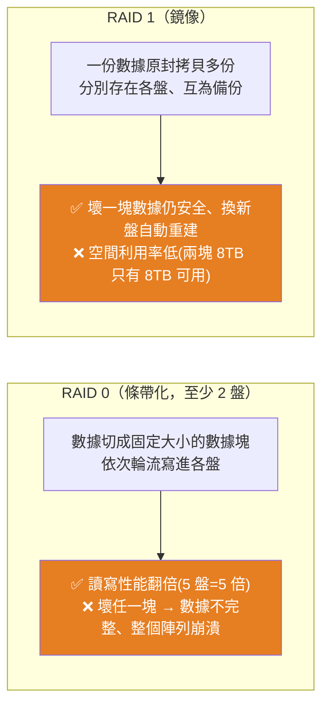
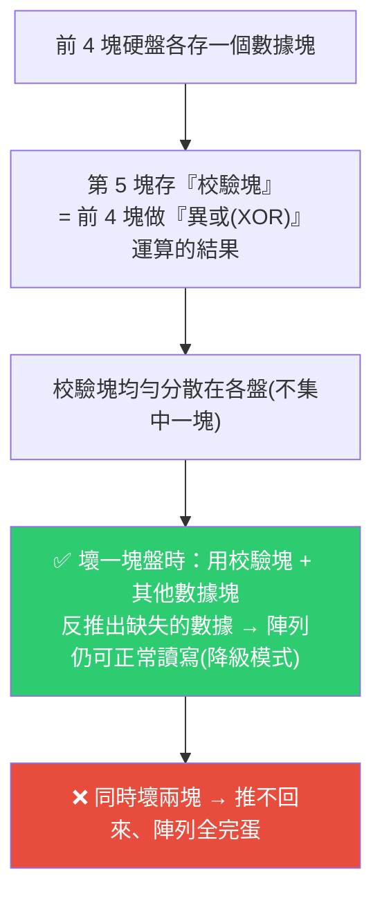
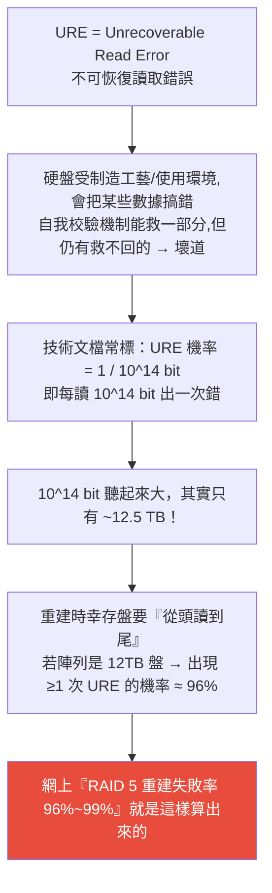
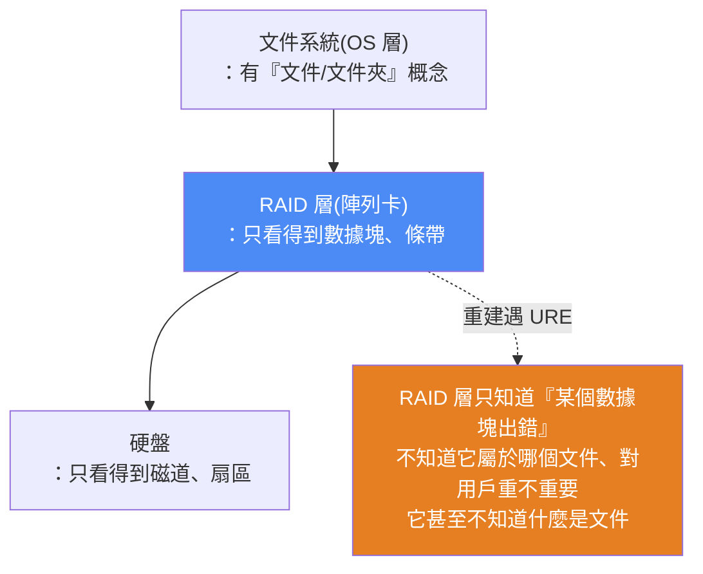

# 硬碟陣列 RAID 一次看懂:RAID 0/1/5/6 原理,以及 RAID 5 為什麼「不安全」的真相

> Redknot(喬紅)。硬核講解硬碟陣列(RAID):各種模式的原理與取捨,並深入拆解一個爭議——**「RAID 5 重建失敗率高達 99%」是真的嗎?** 答案牽涉 URE(不可恢復讀取錯誤)與「RAID 層看不見文件系統」這兩個關鍵。歸儲存架構,與 [[scaling-web-architecture-bubble-tea]] 同屬 system-design。

---

## 一、RAID 0 與 RAID 1:速度 vs 安全的兩個極端

- **RAID 0**:把數據切成固定大小的塊,依次輪流寫進各盤 → 讀寫可同時對多盤進行,**性能倍增**;但**任一盤壞掉整個陣列就崩潰**,安全性極差。
- **RAID 1**:一份數據拷貝多份存進各盤,互為備份 → 壞一塊仍安全、換新盤能重建;盤越多越安全,但**空間利用率低**(兩塊 8TB 實際只有 8TB 可用)。

---

## 二、RAID 5:用「校驗塊」換一塊盤的容錯(最流行、也最爭議)

RAID 5 存數據時也像 RAID 0 把數據切塊、分存各盤,但**每一條「條帶(stripe)」會多算一個校驗塊**:

- **校驗怎麼算——異或(XOR)**:可理解成「**閹割版的加法 / 半加**」——把數字相加但**不進位**(進位的那一位直接捨棄)。所以 XOR 又叫「半加操作」。(嚴謹說 XOR 只針對二進制,但此場景當「半個加法」理解即可。)
- **橫跨全部陣列硬盤的一排數據 = 一個條帶(stripe)**;校驗數字均勻分散到各盤。
- **特點**:只犧牲**一塊盤**的容量存校驗,就能容忍**任意一塊**盤損壞、且能換新盤重建 → 相當均衡。**但只能壞一塊**。

---

## 三、核心爭議:RAID 5 重建失敗率真的高達 99% 嗎?

當 RAID 5 壞一塊盤後進入**降級模式**;你加一塊新盤重建時,**陣列要讀取其他所有幸存盤的全部數據**才能恢復損壞盤的數據。**如果重建過程中幸存盤出問題 → 重建失敗、陣列崩潰。**

### 拆解一:幸存盤在重建期間「整盤壞掉」的機率其實很低

Google 一篇論文統計:五年內硬盤最高年平均故障率約 **8.6%**。假設重建需 24 小時,則幸存盤在這 24 小時內壞掉的機率 ≈ 8.6% ÷ 365 ≈ **0.24%** —— **很低**。所以「99% 失敗」不是這樣來的。

### 拆解二:真正的元兇是 URE(不可恢復讀取錯誤)

**一旦出現一次 URE,傳統 RAID 5 就因無法恢復數據而崩潰** → 這就是那個「高到離譜」的失敗率來源(甚至有網站算出成功率只剩 2%)。但這**和大家的實際體驗不符**,所以爭議這麼大。

### 那 RAID 5 到底安不安全?作者的兩點分析

1. **URE 機率被高估**:廠商技術文檔的 URE 是**最大值(保守估計)**,實際使用時沒這麼高。
2. **(更關鍵)為什麼「一次 URE 就整個陣列失效」?憑什麼?** —— 這才是核心。若某個數據塊出錯,受損的**應該只有那一個條帶**,別的數據都正常,**憑什麼整個陣列全完?**

> 🔑 **答案:因為「RAID 層」看不見「文件系統」。**

- **陣列卡(RAID 層)** 把多塊硬盤組成 RAID 5、對外變成「一塊虛擬硬盤」;它眼裡只有數據塊/條帶,**上層文件系統它看不見、也感知不到文件細節**。
- 重建遇到 URE 時,RAID 層**只知道「某數據塊出錯」,不知道它屬於哪個文件、用戶在不在乎,甚至不知道什麼是文件** → 所以**企業級陣列卡的最優解是:停止重建、告訴用戶出問題了**,等用戶用別的手段修復 URE 數據後再繼續。
- **所以嚴格說 URE 並不會導致整個陣列崩潰,只是大部分陣列卡遇 URE 會停止重建等待處理**。(也有陣列卡允許「帶錯繼續重建」,但重建出的陣列存在數據錯誤,可能無關緊要也可能後果嚴重,一般很少用。)

---

## 四、ZFS / RAID-Z1:讓 RAID 看得見文件

**ZFS**(Sun 公司發起的文件系統,類似 NTFS/EXT4,但設計理念先進)**把 RAID 直接整合進文件系統**。它的 **RAID-Z1** 類似 RAID 5(也劃一塊盤存校驗),但關鍵差別:

> **ZFS 的 RAID 能直接感知文件層 → RAID-Z1 重建遇 URE 時,可以直接告訴用戶「是哪個文件出問題」,用戶能做「文件級別」的取捨**(而不是整個陣列判死刑)。

**代價**:ZFS 在文件系統裡集成 RAID,**只能用軟件運算**,所以陣列性能不如硬件陣列卡。

---

## 五、更保險的 RAID 6,以及被淘汰的 RAID 2/3/4

| 模式 | 原理 | 現況 |
|---|---|---|
| **RAID 6** | 在 RAID 5 基礎上**再加一組校驗**;一條條帶有兩組校驗(第一組同 RAID 5 用 XOR,**第二組用 Reed-Solomon 里德-所羅門編碼**,二維碼也用它)→ **允許同時壞兩塊盤**,對 URE 忍耐力大幅上升 | 最保險的常用選擇 |
| RAID 4 | 同 RAID 5 產生一組校驗,但**校驗集中存一塊盤**(非分散)→ 該盤被頻繁訪問、壽命更短、易成性能瓶頸 | 幾乎被 RAID 5 淘汰 |
| RAID 3 | 類似 RAID 4,但按**字節**存放(數據塊大小是一個字節;RAID 4 一般 64K) | 已淘汰 |
| RAID 2 | 用**漢明碼**產生糾錯碼存入各盤(注意是「糾錯碼」,核心目的是防數據被篡改而非容災) | 現代內存有 ECC、硬盤扇區也有 ECC → 幾乎沒人用 |

> ⚠️ 網上「RAID 重建成功率」網站可測 RAID 6,但作者指出**其 RAID 6 成功率算法應該是錯的、沒有參考價值**。

---

## 六、應用案例

1. **選 RAID 前先想清楚「要速度還是要安全」:** 純快取/暫存、壞了無所謂 → RAID 0;要冗餘 → RAID 1(簡單)/ RAID 5(省容量)/ RAID 6(能壞兩塊)。**大容量盤(≥8–12TB)組 RAID 5 要特別警惕重建期 URE 風險,優先考慮 RAID 6 或 ZFS。**
2. **別被「RAID 5 重建失敗率 99%」嚇到、也別掉以輕心:** 這數字來自「一次 URE 就判死刑」的傳統陣列卡行為 + 廠商保守的 URE 上限;真相是「多數陣列卡會停止重建等你修 URE」——所以**問題不是必然崩潰,而是重建被打斷、需人工介入**。
3. **想要「文件級容錯」就用 ZFS RAID-Z:** 若在意「重建遇錯能知道是哪個文件壞」,用 ZFS(犧牲一點性能換文件層感知);要極致性能就用硬件陣列卡。
4. **理解「分層抽象的代價」這個通用道理:** RAID 層看不見文件系統 → 遇局部錯誤只能保守停機——這正是分層架構「各層互不感知細節」的雙面性,可對照 [[scaling-web-architecture-bubble-tea]] 講的架構分層取捨。
5. **RAID 不等於備份:** RAID(尤其 5)是「容忍硬件故障」的可用性機制,不能取代異地備份——重建期崩潰、URE、人為誤刪都不是 RAID 能救的。

---

## 七、重點回顧(TL;DR)

- **RAID 0**:切塊輪寫、性能倍增、壞一塊全崩(要速度)。**RAID 1**:鏡像備份、安全但空間利用率低。
- **RAID 5**:每條帶多一個 **XOR(半加/不進位)校驗塊**、分散各盤 → 犧牲一塊容量容忍**任一盤**損壞,但**只能壞一塊**。
- **「RAID 5 重建失敗率 99%」的真相**:幸存盤「整盤壞」機率其實很低(~0.24%/24h);真正元兇是 **URE(1/10^14 bit ≈ 每 12.5TB 一次錯)**,重建要整盤讀 → 12TB 盤出 URE 機率 ~96%。
- **但一次 URE 不必然摧毀陣列**:因為 **RAID 層看不見文件系統**,只知「某塊出錯」不知屬於哪個文件 → 企業級陣列卡的最優解是**停止重建、等用戶修**。
- **ZFS RAID-Z1**:RAID 整合進文件系統、能感知文件層 → 重建遇 URE 能告訴你「哪個文件壞」,做文件級取捨(代價:軟件運算、性能較低)。
- **RAID 6**:兩組校驗(XOR + Reed-Solomon)、**能壞兩塊**,最保險;RAID 2/3/4 基本淘汰。

---

## 來源

- 影片:[什么是硬盘阵列？Raid 5 为什么不安全？(Redknot-乔红,2025-12-05)](https://youtu.be/FvWfAgNyEWc)
  - ⚠️ 該片無字幕,逐字稿以 **CPU 版 faster-whisper(small)** 轉錄取得、**非官方字幕**,可能有少量聽寫誤差(如 URE、XOR、Reed-Solomon、ZFS、Hamming code 等專有名詞)。
- 延伸(本庫):[為什麼 AI 寫的網站一上線就掛?用手搖飲店看懂架構擴展](./scaling-web-architecture-bubble-tea.md)、[現在正在主導的 5 個程式設計概念](./dominating-programming-concepts.md)
