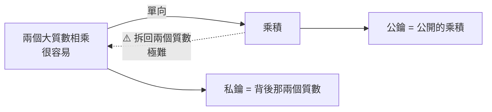
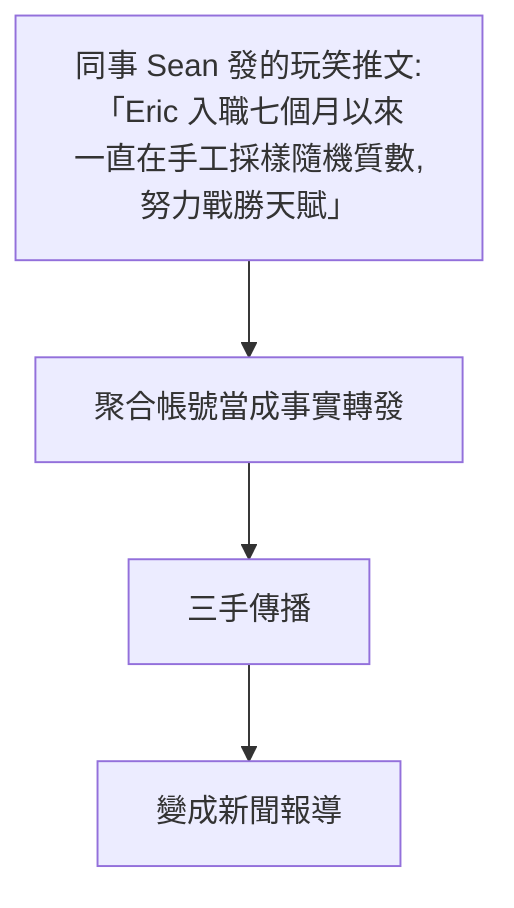

# RSA-260 被分解:一條推文、一次除法,全世界同時確認 —— 以及「可驗證性是一種設計」

**主題分類:** 系統設計 —— 密碼學、單向函數與可驗證性設計
**來源影片:** YouTube〈只发了一串数字,马斯克跑来围观 | RSA-260被破〉(Why QQ / 為什麼叫 QQ,2026-09-05,約 11.3 分鐘,**官方 zh-Hans 字幕**)
**整理日期:** 2026-09-06

> 📎 相關筆記:[[quantum-computing-explained]](§6 提到的 Shor 演算法背景)、
> [[raid-explained-why-raid5-unsafe]](同樣是「直覺與數學算出來不一樣」的案例)、
> [[vibe-coding-security-threat-modeling]]

---

## 0. 一句話總結

> **2026-09-03 下午,Cognition 的工程師 Eric Lu 在 X 上發了一串 130 位數字,
> 後面跟著三個字:`divides RSA-260`。掛了 35 年的紀錄就此刷新。**

而這件事對工程師最有價值的一課,不是密碼學本身:

> ⭐⭐⭐ **證明檔案短到能塞進一條推文,驗證程式碼短到三行 ——
> 「可驗證性」是可以被設計出來的,而且它比「可信任」高級。**

---

## 1. 事件本身

| 項目 | 內容 |
|---|---|
| **時間** | **2026-09-03** |
| **人** | **Eric Lu**,AI 公司 **Cognition**(做 Devin 那家)的工程師 |
| **推文內容** | 一串 **130 位數字** + `divides RSA-260`。**沒有論文、沒有新聞稿、沒有任何解釋** |
| **反應** | 24 小時內瀏覽破 **1,500 萬**,幾萬人按讚;**馬斯克回覆**:「幸好我們之前把字數限制提高了」 |
| **紀錄** | RSA-260 = **260 位十進位 / 862 bit**,自 **1991** 年發布起**懸了 35 年** |
| **前一個紀錄** | **RSA-250(829 bit),2020-02** |

⭐ 一個很有畫面的細節:推文發出兩小時內,**1999 年分解 RSA-155 那個團隊的研究者跑來留言道賀** ——
而那時候 Eric Lu 還沒出生。

---

## 2. ⭐⭐⭐ 為什麼「任何人都能立刻驗證」

這是本篇的核心。

```python
# 從維基百科把 RSA-260 抄下來,把推文裡那串 130 位數抄下來
N = ...      # RSA-260,260 位
p = ...      # 推文裡那串,130 位
print(N % p) # → 0
print(N // p)  # 商也是 130 位;兩數乘回去,一位不差
```

> ⭐ **這種證明不需要你相信任何人,不需要同行評審,不需要權威機構蓋章。**
> 密碼學講了很多年的 **trust but verify** —— **到這裡連 trust 都省了。**

**全世界的程式設計師在同一時間打開終端,敲下同一個除號。**

### 2.1 成本的不對稱才是重點

| | 找答案 | 檢查答案 |
|---|---|---|
| **RSA-260** | 估計要燒掉**幾千核心年**的算力 | ⭐ **一次除法,毫秒級** |



> ⭐⭐ 這就是**單向函數**,而它是**整個數位信任的發動機**:
> 你簽的每一筆支付、每一次登入、每一個 HTTPS 握手,背後都是這種不對稱在值班。
>
> **它便宜到你感覺不到它存在,又貴到沒人能隨手偽造。**

⭐ 程式設計師有個現成類比:**雜湊** —— 算雜湊很快,從雜湊反推原文很難。
**大數分解是同款不對稱,只是更古老。**

---

## 3. ⚠️ 三個被傳錯的說法(這節最值得警惕)

### ① 「量子電腦幹的」—— 不沾邊

硬體錢包公司 **Ledger 的 CTO** 當天表態:**這件事和量子電腦沒有任何關係。**

> Shor 演算法理論上確實能分解這種數,**但它需要一台足夠大的容錯量子電腦 —— 這種機器現在還不存在。**

### ② 「AI 幹的」—— 沒有實據

⭐ 最好笑的插曲:有人去問 **Cognition 自家的 AI 智能體 Devin**,
**Devin 給出了互相矛盾的回答** —— 自家的 AI 都搞不清楚自家工程師幹了什麼。

### ③ ⚠️⚠️ 「他花七個月手工一個個試質數」—— 這是一則玩笑被當成新聞

**這個最值得記,因為連 Scientific American 的報導都把它寫了進去。**



**算一筆帳就知道多荒誕:**

> **130 位的質數大約有 3×10¹²⁷ 個。**
> 可觀測宇宙的原子總數才 10⁸⁰ 上下 ——
> ⭐ **就算把全宇宙每個原子都變成一台每秒試一兆次的機器,也排不進日程表。**

> ⚠️ 影片的評語很到位:**「一個玩笑變成『報導』,這就是資訊時代的預設配置,值得每個技術人警惕。」**

---

## 4. 那他大概率怎麼做到的

對兩個 431 bit 質數相乘的數,**經典演算法裡能打的只有通用數域篩法(GNFS)**。

它的思路和試除完全兩路:

```text
① 選多項式 → ② 篩關係(幾十億條起跳)→ ③ 過濾重複
→ ④ 解一個巨大的模 2 線性方程組(湊出平方同餘)
→ ⑤ 開方 + 一步最大公因數,把因數釣出來
```

⚠️ **為什麼可以斷定不是笨辦法?** 密碼學工具箱裡還有橢圓曲線法、Pollard's rho ——
**但它們只擅長抓小因數,碰上兩個差不多大的 431 bit 質數直接失效。**

> ⭐ 影片的收束很精準:**「數學在這件事上扮演的角色很清楚 —— 先把不可能的路劃掉,再去可能的路裡找最優解。」**

📌 **Eric Lu 不是突然冒出來的運氣選手:** 2019 年他找到過一個**超過 2,500 萬位**的梅森數的因數,
成績至今掛在梅森質數專案的排行榜上;Hacker News 上有人說他常年占據這類專案的 GPU 時長榜首。

⚠️ **他對方法、硬體、耗時一概不提**,只留了一句半開玩笑的「用的就是老式的紙和筆」——
**而那句玩笑正是上面 §3③ 那場烏龍的間接來源。**

---

## 5. ⭐⭐ 那我的金鑰要不要換?不用 —— 但有一個該焦慮的對象

| 金鑰長度 | 相對 RSA-260 的分解難度 | 狀態 |
|---|---|---|
| **RSA-260(862 bit)** | 基準 | ⚠️ **已被分解** |
| **1024 bit** | 幾十倍 | ⚠️⚠️ **NIST 早已判緩刑**:安全強度不足 80 bit,**禁止用於新的加密場景** |
| **2048 bit**(現在通行的起步) | ⭐ **約 900 億倍** | ✅ 安全 |

> ⭐⭐⭐ **關鍵在於這個難度增長是超指數的。900 億倍,這個數字值得多聽幾遍。**
>
> ⚠️ **該焦慮的不是 2048,是那些還在跑 1024 的老系統。**

### ⚠️ 很多報導的框架本身就偏了

> 把這件事講成「密碼被攻破、安全告急」是錯的。
> **三十五年來,這份榜單真正的用途是當標尺:測量人類分解能力的邊界推到哪裡,再反推你該用多長的金鑰。**

**RSA 挑戰賽上的這些數,是給全世界開鎖匠準備的練功樁。**
**樁倒了,沒有誰的大門真被撬開 —— 但每一根倒下的樁,都在丈量攻防之間的距離。**

📌 補充:這個挑戰賽 **2007 年就停辦了,獎金也早就停發**,但數學圈與算力圈一直惦記著剩下的數。

---

## 6. ⭐⭐⭐ 給工程師最值錢的一組數:算法比晶片值錢

這一節可以脫離密碼學獨立使用。

| 年份 | 目標 | 位元 | 花費 |
|---|---|---|---|
| **2009** | RSA-768 | 768 bit | **接近 2,000 核心年** |
| **2019-12** | RSA-240 | **795 bit(更大)** | ⭐ **約 1,000 核心年(帳單砍半)** |
| **2020-02** | RSA-250 | 829 bit | **約 2,700 核心年**(篩法 2,450 + 矩陣 250) |

> ⭐⭐⭐ **數更大了,帳單反而砍半。當時的論文把功勞算得很清楚:**
>
> | 來源 | 貢獻倍數 |
> |---|---|
> | **演算法與參數改進** | **3–4 倍** |
> | 硬體進步 | 1.25–1.67 倍 |
>
> **十年裡最值錢的是數學,不是晶片。**

⭐ **這個規律放到 AI 時代照樣成立:**
模型越來越大,但真正拉開差距的往往是**訓練方法與資料結構**。
**算力是入場券,演算法是槓桿。**

📌 **核心年(core-year)** 這個單位:一個 CPU 核心滿載跑一整年。
RSA-250 的帳單以 2.1GHz 的 Xeon 核心折算,算力來自法國與美國的四個計算中心。

---

## 7. ⭐⭐⭐ 應用案例:把「可驗證性」當成設計目標

這是本篇最能帶走的東西。

> **你的系統裡凡是需要別人信任你的地方,都可以問一句:
> 能不能把證明做成一次除法?**

**業界已經在用同一個思路的三個例子:**

| 機制 | 它把「請相信我」換成了什麼 |
|---|---|
| **區塊鏈的 Merkle tree** | 給你一條路徑,**你自己算幾次雜湊就能驗證某筆交易在不在裡面** |
| **Certificate Transparency 日誌** | 憑證簽發被公開追加記錄,**任何人都能獨立稽核** |
| **可重現建置(reproducible builds)** | **你自己編譯一次,雜湊值對得上,就證明二進位檔沒被動手腳** |

> ⭐⭐ **「讓人驗得起,遠比讓人信得過高級。」**
> 下次設計介面和協定的時候,這條值得拿出來用。

### 落到日常的三個提問

1. **我這個 API 回傳的結果,對方要怎麼獨立確認它沒被竄改?**
   —— 能不能附一個簽章或雜湊,而不是叫對方相信 HTTPS 就好?
2. **我的建置產物,別人能不能自己重跑一次得到同樣的結果?**
   —— 如果不能,那「我們的 CI 沒問題」就只是一句宣稱。
3. **我的資料處理流程,稽核時是要看我的說明文件,還是能重跑?**
   —— **前者是信任,後者是驗證。**

### ⚠️ 順帶檢查一次你的老系統

> 影片結尾的提問很實際:**「你現在負責的系統裡,還有沒有 1024 bit 的 RSA 在跑?」**

具體可以掃的地方:老的內部 CA、SSH 金鑰、舊的 JWT 簽章金鑰、
與外部合作夥伴的簽章協定、以及**寫死在文件裡但沒人動過的憑證設定**。

---

## 8. 往後看

| 項目 | 狀態 |
|---|---|
| **榜單上的下一個** | **RSA-270(895 bit)** —— 按現在的節奏估計還要等幾年 |
| **真正的終局變量** | **量子計算**。Shor 演算法 **1994 年就躺在論文裡**,能把分解從超指數壓到多項式 —— **前提是有一台足夠大的容錯量子電腦,而現在的機器離那條線還差著數量級** |
| **業界的動作** | **NIST 已經定了好幾套後量子演算法標準**,大廠的遷移也早開始了 |

⭐ 而這套機制最聰明的設計是:

> **驗證側的成本永遠為零,任何人都能當場複核 ⇒ 攻擊進展對防守方完全透明。**
> **分解能力每進一步,所有人提前好幾年就看見。**

---

## 9. 與公開資料的核實

### ✅ 影片說法準確(這支的查證率很高)

| 影片說法 | 核實結果 |
|---|---|
| 2026-09-03,Cognition 工程師 **Eric Lu** 發推 130 位數字 + `divides RSA-260` | **屬實** |
| 掛了 35 年、1991 年發布、260 位 / 862 bit | **屬實** |
| 前一紀錄為 **RSA-250(829 bit,2020-02)** | **屬實** |
| 馬斯克留言、瀏覽破千萬 | **屬實** |
| **截至事發次日,他未公開演算法、軟體、硬體與耗時** | **屬實** |
| RSA-250:**約 2,700 核心年**,篩法 **2,450** + 矩陣 **250**,用開源 **CADO-NFS**,以 2.1GHz Xeon 折算 | **全部屬實** |
| RSA-768(2009)接近 2,000 核心年 | **屬實** |
| ⭐ **RSA-240 更大卻更便宜;演算法貢獻 3–4 倍、硬體 1.25–1.67 倍** | **屬實**,為原公告的原始數字 |
| NIST 認定 1024 bit 安全強度不足 80 bit、禁用於新場景 | **屬實** |
| Shor 演算法 1994 年提出,需要容錯量子電腦 | **屬實** |

### ⭐ 微調

- 影片說 **RSA-240 約 900 核心年**;官方公告的數字是**約 1,000 核心年**(另有 953 的說法)。
  **量級與結論(比 RSA-768 更大卻不到一半成本)完全不受影響。**

### ⚠️ 未能獨立查證

- 「Eric Lu 大概率用 GNFS」為**合理推論**,**他本人尚未公布方法**。
- RSA-260 需「接近 7,000 核心年」為**外界依複雜度公式的推算**,影片自己也標明了。
- Ledger CTO 的表態、Devin 給出矛盾回答、Hacker News 上關於 GPU 時長榜首的說法 —— **均為影片轉述**。
- **RSA-2048 約為 RSA-260 的 900 億倍**:方向與超指數增長一致,**但這個確切倍數未獨立核算**。

---

## 來源

- [只发了一串数字,马斯克跑来围观 | RSA-260被破 — Why QQ](https://www.youtube.com/watch?v=pS_P2P0bO48)(2026-09-05,約 11.3 分鐘,官方 zh-Hans 字幕)
- 核實用來源:
  - [What's the tech behind the record-breaking RSA-260 crack? — Scientific American](https://www.scientificamerican.com/article/whats-the-tech-behind-the-record-breaking-rsa-260-crack/)
  - [What is known about how Eric Lu factored the 862-bit RSA-260 — lilting.ch](https://lilting.ch/en/articles/rsa-260-factored-how-computed)
  - [New RSA number factored — John D. Cook](https://www.johndcook.com/blog/2026/09/03/new-rsa-number-factored/)
  - [Factorization of RSA-250(官方公告)— caramba.loria.fr](https://caramba.loria.fr/rsa250.txt)
  - [795-bit factoring and discrete logarithms(RSA-240 官方公告)— caramba.loria.fr](https://caramba.loria.fr/dlp240-rsa240.txt)
  - [Integer Factoring Records — Paul Zimmermann](https://members.loria.fr/PZimmermann/records/factor.html)
  - [Factorization of a 768-bit RSA modulus — IACR ePrint 2010/006](https://eprint.iacr.org/2010/006.pdf)
  - [Integer factorization records — Wikipedia](https://en.wikipedia.org/wiki/Factoring_records)

> ⚠️ 本文為對一支公開影片的整理與查證。§9 已逐項標示核實狀態。
> **密碼學建議請以 NIST 現行標準與你所在組織的合規要求為準,本文不構成安全設計建議。**
