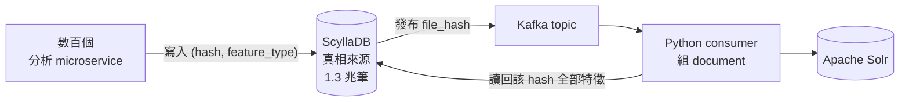
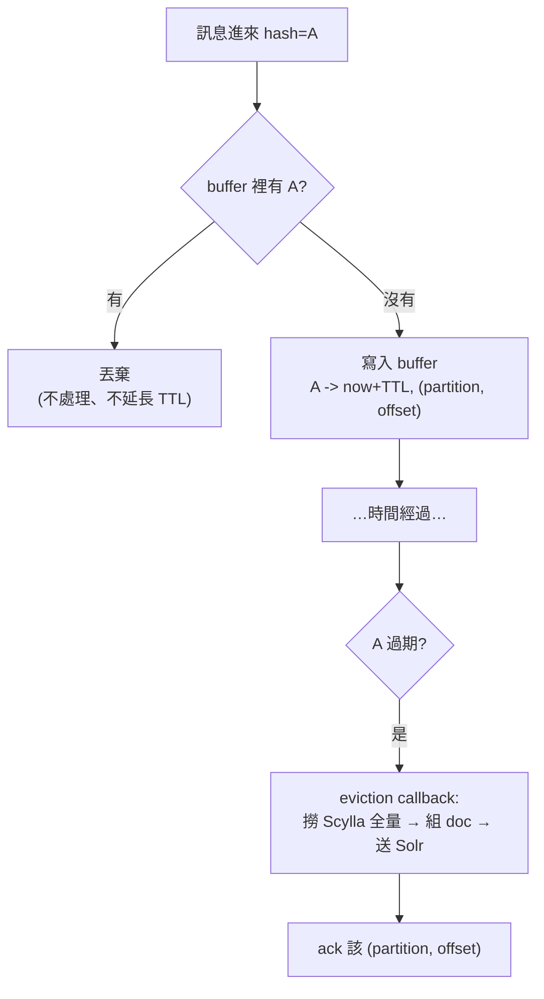
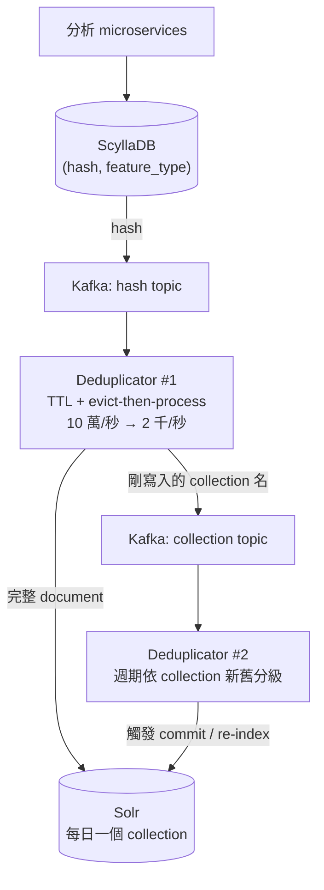

# 一兆筆紀錄的即時搜尋:從 36 小時延遲砍到 5 分鐘的去重管線

> 來源:PyData / PyCon DE 2026 演講《How to Search Through 800 Billion Records in Real Time》,講者 Filip Bacic、Mirano Tuk(ReversingLabs)。
> 標題寫 800 billion 是去年投稿時的數字,講者開場自嘲「現在已經是 1 兆了」。

---

## 一、問題長什麼樣

ReversingLabs 是資安公司,對各種檔案做威脅分析。規模:

| 指標 | 數字 |
|---|---|
| 威脅資料庫涵蓋檔案數 | > 600 億 |
| 每天新增分析結果的檔案數 | > 1.5 億 |
| 每個檔案可萃取的特徵種類 | > 500 種 |
| 明細紀錄總數 | 約 1.3 兆筆 |
| 純文字資料量 | 數百 TB |

**「給一個 hash,回傳這個檔案的所有資料」很簡單**——那是 key-value 查詢。
**「讓使用者用任意條件跨檔案搜尋」是完全不同的遊戲**——那需要倒排索引。

他們選 **Apache Solr** 當搜尋引擎:把一個檔案的全部資訊組成一份 document 丟進去索引。聽起來單純,但有三個結構性障礙:

1. **量太大**:數百 TB 純文字。
2. **partial update 洪水**:分析系統由「數百個 microservice」組成,每個各自非同步產出自己那塊資料。於是同一個檔案會收到幾十次零碎更新,而 **Solr 在這種規模下非常不喜歡 partial update**。
3. **快取失效**:同一個檔案會在短時間內被反覆分析,而且是在**不同 context** 下——先單獨分析一次,之後又被當成某個大型分析(例如一包壓縮檔、一次事件調查)的一部分再分析一次,產出的資料不一樣。所以「算過就不用再算」這件事不成立。

結論很明確:**必須在寫進 Solr 之前先做聚合**。

---

## 二、第一版:ClickHouse 每日聚合(失敗於延遲)

第一版走的是最直覺的路:資料本來就有一份在 **ClickHouse**(內部分析用),而 ClickHouse 是為大資料集設計的極快分析型資料庫。

作法:一個**每日排程 job**,把前一天所有資料 join 起來,每個檔案產出一筆合併紀錄,再送下游給 Solr。

為什麼是每日?因為 **ClickHouse 也不擅長頻繁更新**——他們沒有辦法即時 upsert,只能批次重算。

這撐了一段時間。但很快發現一個致命的產品事實:

> **使用者最想搜的資料,恰好就是最新的資料。**

而這條管線從資料產生到變得可搜尋,**最長有 36 小時的延遲**。對「昨天剛出現的新惡意程式」這種需求,36 小時等於沒有。

於是下一步很明顯:「那就改成即時吧。」(講者在這裡停頓等笑聲——「這句話你們應該聽過吧?」)

---

## 三、第二版骨架:ScyllaDB 當真相來源 + Kafka 當觸發器

公司其他 API 服務本來就在用 **ScyllaDB** 和 **Kafka**。ScyllaDB 是極快的 key-value store,輕鬆撐每秒數千萬次請求。

**核心資料表設計**——primary key 是複合鍵:

```
PRIMARY KEY (file_hash, feature_type)
```

- `file_hash`:檔案的唯一識別。
- `feature_type`:這筆紀錄來自分析流程的哪一段。

同一個 `(hash, feature_type)` 再來一次就是覆蓋,所以這張表天然是「每個檔案每種特徵的最新狀態」。這張表就是那 1.3 兆筆紀錄所在之處。

**管線**:



流程:表被更新時,順手把 `file_hash` 發到 Kafka topic;下游 consumer 收到 hash,回頭去 Scylla 撈這個檔案的**全部**資料,組成完整 document 推給 Solr。

講者說到這裡開玩笑:「簡報可以結束了。」——當然不行,因為**文件量太高**。同一個 hash 短時間內可能出現 100 次,但我們只想送 1 份 document 給 Solr。

**整場演講真正的主題,就是這個「1 變 100」怎麼收斂回「100 變 1」。**

---

## 四、去重器的四次演化(這是全場精華)

### 第 0 版:naive batch consumer

從 Kafka 逐筆拉訊息太沒效率,所以定一個 batch size,湊滿一批再交給 `process_messages` callback,跑完整批後統一 **ack**(告訴 Kafka「這批我處理完了,重啟不用重送」)。

```python
# 概念示意
for msg in batch:
    hash = msg.value
    data = scylla.fetch_all_features(hash)
    solr_queue.publish(build_document(data))
consumer.ack(batch)
```

能動,但這就是「資料太多」的版本。

### 第 1 版:batch 內去重(一個 `set` 就搞定)

同一批裡本來就有大量重複 hash,所以最自然的第一刀:**每個 distinct hash 在這批裡只處理一次**。

```python
for hash in set(batch_hashes):
    ...
```

一行解決一半問題。但看久了會發現:**重複的 hash 會跨批出現**——第一段分析的紀錄落在這批,幾秒後第二段分析的紀錄進來,但中間插進來太多其他檔案的訊息,已經被擠到後面好幾批去了。`set` 對這種跨批重複完全無效。

### 第 2 版:dict 當 FIFO buffer + TTL(踩到 stale data)

要跨批追蹤,就需要一個有生命週期的 buffer。他們寫了一個 `Deduplicator` class,**用普通的 Python `dict` 當 buffer**,理由很漂亮:

> 從 **Python 3.7** 起,`dict` 保證保留插入順序。所以走訪 dict 就是插入順序 —— **dict 可以直接當 FIFO queue 用**,不用 `OrderedDict`,不用額外資料結構。

```python
class Deduplicator:
    def __init__(self, ttl):
        self.ttl = ttl
        self.buffer = {}          # hash -> expire_at,插入順序即 FIFO

    def add(self, hash, now):
        if hash in self.buffer:
            return                # 已在窗口內,直接丟棄
        self.buffer[hash] = now + self.ttl

    def housekeep(self, now):
        # 只需檢查第一個:它最舊。第一個沒過期,後面一定也沒過期
        while self.buffer:
            hash, expire_at = next(iter(self.buffer.items()))
            if expire_at > now:
                break
            del self.buffer[hash]
```

`housekeep` 那個「只檢查第一個」的優化來自 FIFO 性質:**最舊的沒過期,後面的必然沒過期**,所以清理是 O(過期數) 而非 O(buffer size)。

**但有個 bug**:這個版本是「加進 buffer 時就處理」——處理的是**第一則**訊息。如果在 TTL 窗口內又來了同一個 hash 的更新,那則更新被直接丟掉;而如果這個 hash 從此再也沒出現過,**那筆最後的更新就永遠不會被處理,Solr 裡是 stale data**。

### 第 3 版:把去重器倒過來——在「逐出」時才處理

理想上我們想處理的是**最後一則**訊息,但我們不可能知道哪則是最後一則。於是他們用近似解:

> **不要在「加入 buffer」時處理,改在「逐出 buffer」時才處理。**

逐出發生在 TTL 到期,也就是「這個 hash 已經安靜了 TTL 那麼久」——這時去 Scylla 撈到的必然是**包含期間所有更新後的最終狀態**。實作上就是給 buffer 一個 **eviction callback**,清理時對每個被刪掉的 key 呼叫它,而那個 callback 就是真正的處理邏輯。



一個關鍵細節:重複訊息進來時是**直接丟棄、不延長 TTL**。這讓 TTL 成為「我最多願意等多久讓更新變得可搜尋」的硬上限,而不是會被連續更新無限往後推的滑動窗口。

---

## 五、Kafka ack 的陷阱(第二個精華)

第 3 版一改,**ack 的位置就錯了**。

原本 ack 寫在 `process_messages` 結尾。但現在那個 callback 只做了「把 hash 排進 buffer」,**沒有真正處理**。這時 ack 等於告訴 Kafka「處理完了」,可是資料還躺在記憶體 buffer 裡——**服務一重啟,buffer 全丟,那些訊息 Kafka 也不會再送,資料就這樣消失了。**

所以 ack 必須搬到 **eviction callback、處理完之後**。但這帶出一個更麻煩的問題:那些被丟棄的重複訊息呢?要不要 ack?什麼時候 ack?

### Kafka offset 語意速成

- Kafka topic 切成多個 **partition**。多個**不同**服務訂同一個 topic,每個服務都收到全部訊息;但同一個服務的多個 **replica**,則是每個 replica 分到一部分 partition、彼此**不重疊**——這就是水平擴展的方式。
- 訊息寫進 partition 尾端,配一個遞增的 **offset**。
- **關鍵**:Kafka **不追蹤個別訊息的 ack**,它只記錄「每個 partition 最後一個被 ack 的 offset」。所以:
  - **不能亂序 ack**。
  - 也**不必逐則 ack**——ack offset 134 等於隱含 ack 了 129~134 全部。

### 這對去重器意味著什麼

假設某 partition 有 10 則訊息,hash A 出現在 offset 100、103、108。去重器只在 offset 100 時把 A 加進 buffer。當 A 被逐出、處理完,它確實已經涵蓋了 103、108 的更新——

**但這時候不能 ack 108**。因為 ack 108 會隱含 ack 掉 101~107 之間那些**還在 buffer 裡沒處理完**的其他 hash,那才是真正的資料遺失。

**此刻唯一安全的 ack 是 offset 100**——也就是**觸發這次處理的那一則訊息**。

至於被跳過的 103?當後面某個 hash D(offset 104)處理完並 ack 104 時,103 就被隱含 ack 掉了。這安全嗎?安全:

- 若此刻服務重啟,103 之後的訊息會被重送、重新處理一遍——只是重工,不是資料遺失。
- 若服務正常運作,下一則處理完後這些就自然被隱含 ack。

**結論:只 ack「觸發處理的那一則」。** 實作上,buffer 的 value 要一併存下該訊息的 `(partition, offset)`,eviction 時讀出來,處理完 ack 它。

```python
self.buffer[hash] = (now + self.ttl, msg.partition, msg.offset)
# eviction:
_, partition, offset = self.buffer.pop(hash)
process(hash)
consumer.ack(partition, offset)
```

---

## 六、上線 5 分鐘就炸:backlog 引發的 Kafka health check 死亡迴圈

「Ship it。」他們也真的 ship 了,**運作良好了 5 分鐘**,然後錯誤如洪水般湧出,Kafka 開始抱怨,整個系統停擺。

事故拆解:

1. 服務首次啟動時,Kafka topic 裡積了**數十億則 backlog**。
2. 「加進 buffer」這個動作極度輕量,所以服務**瞬間衝過整個 backlog**,把東西全塞進 buffer。因為速度太快,**相鄰訊息的過期時間戳只差幾微秒**。
3. 真正的處理(撈 Scylla、組 document、送 Solr)則遠比幾微秒慢。
4. 於是第一則訊息處理完的當下,**後面幾千則也全都過期了**;處理完那幾千則,又有更多過期在等。服務陷入「逐出—處理—更多過期」的無窮迴圈,**再也沒有回去 poll 新訊息**。
5. Kafka 會檢查 consumer 多久 poll 一次。**5 分鐘沒 poll**,Kafka 判定這個服務不健康,把它的 partition 全部收回,準備重新分配給「比較健康的 replica」——
6. **但沒有比較健康的 replica,因為每一個都在做同樣的事。** 整個服務進入 crash loop。

> 這是一個經典的 **liveness vs. throughput** 衝突:為了吞吐量而長時間不回主迴圈,結果被健康檢查判死。

**修法極簡單**:不要「一路逐出到 buffer 清空或碰到未過期的時間戳為止」,而是**每個迴圈只處理固定上限的訊息數**,處理完就回去 poll,讓 Kafka 知道自己還活著。

```python
processed = 0
while self.buffer and processed < MAX_PER_ITERATION:
    ...evict and process...
    processed += 1
```

而且這個上限帶來一個**意外的好處**:當有大量 backlog、處理已經落後時,訊息在 buffer 裡待的實際時間被自然拉長,**等效 TTL 變大 ⇒ 去重率反而更好**,幫助更快消化 backlog。等 backlog 清完進入即時模式,這個上限根本不會被碰到。

---

## 七、還沒完:Solr 的 commit 與 re-index 也要去重

文件送到 Solr 之後,還有一層問題。

- Solr 的資料存在 **collection**(概念上等同一般資料庫的 table)。
- **插入的資料不會立刻可搜尋**,必須 commit 到索引、collection 重建索引之後才行。
- **re-index 極度吃運算資源,而且成本隨整個資料集大小成長**——不可能每次插入都做。
- 但也**不能拖太久**:未 commit 的資料留在 heap 裡,一直延後 commit 的話,**heap 可能爆掉導致節點失敗,更糟的情況是整個 cluster 連鎖故障**。

他們的解法是**把同一招再用一次**:

**(1) collection 按天切分**
每天開一個新 collection;一個檔案寫進「**第一次看到它的那一天**」的 collection。這保證了 sharding 的一致性(同一個檔案永遠在同一個 collection),而且讓**絕大多數寫入集中在最近幾個 collection**。偶爾有批次重跑或客戶要求重掃舊檔案而寫到老 collection,也不成問題。

**(2) 再放一個同款去重器在 commit 層**
寫入 Solr 時,順手記下「剛剛寫到哪些 collection」。另一個服務用**同一個 deduplicator 模式**監聽這些 collection 名稱,再去觸發受影響 collection 的 commit / re-index。

因為去重週期可調,他們可以做**分級新鮮度**:

- **最新的 collection**:客戶剛上傳、最相關的資料 ⇒ 去重週期短、更新最頻繁。
- **較舊的 collection**:多半來自重新分析 ⇒ 也要更新讓它可搜尋,但沒那麼急 ⇒ 週期拉長。

還能依 cluster 負載動態調整去重週期與文件 TTL,做為壓力閥。



---

## 八、成果

| 指標 | 之前 | 之後 |
|---|---|---|
| 資料變得可搜尋的延遲 | 最長 **36 小時** | 穩定 **< 5 分鐘** |
| 送往下游的訊息量 | **每秒 10 萬則** | **每秒不到 2,000 則** |

**去重器把量壓掉了約 98%**,這才是「即時」得以成立的原因——不是換了更快的硬體,是**不去做重複的工**。

---

## 九、Q&A 裡的補充事實

- **為什麼 buffer 是本地記憶體的 dict,不用 Redis?會不會跨 consumer 重複?**
  不會。**同一個 file hash 永遠落在同一個 partition**(可依 hash 前綴分區),而每個 partition 只指派給一個 replica ⇒ **同一個檔案永遠只被單一 replica 看到**。所以本地 buffer 就夠,不需要分散式狀態。這是整個設計最省事的一環。
- **為什麼特徵存在 ScyllaDB 而不是留在 Kafka?**
  Scylla 是**持久化真相來源**,保有完整歷史(同 feature type 的新資料覆蓋舊的);Kafka 只是**通訊用的訊息佇列**,幾週前的資料會被 retention 機制自動清掉。
- **為什麼不用 ClickHouse 的 materialized view 處理去重與刪除?**
  當時 ClickHouse 版本較舊,materialized view 還很新。現在也不確定這個規模下撐不撐得住——不過「ClickHouse 也做到近即時」目前在 roadmap 上,卡點在資料規模與他們願意給的硬體。
- **試過 Kafka Streams 的 sliding window 去重嗎?**
  試過,但自己這套證明更有效率;Kafka Streams 沒有進生產環境。
- **為什麼 Solr 不是 Elasticsearch?**
  兩者都測過,**這個特定 use case Solr 較好**。公司內部其他場景(例如 audit log)確實用 Elasticsearch,但規模低得多。
- **檔案處理完之後又出現怎麼辦?** 直接重跑並覆蓋。他們不保證 exactly-once——**因為根本不知道哪則是最後一則**;TTL 定義的是「願意等多久讓更新變可搜尋」,超過就重新處理。
- **hash 碰撞?** 有專門的管線同時追蹤 MD5 與 SHA-1 的碰撞。索引用 SHA-1 / SHA-256,MD5 也保留索引,因為「還有很多客戶在用 MD5」。
- **預算有沒有變貴?** 沒有太大變化——Scylla、Kafka 與相關函式庫公司本來就有,只是「多買了幾顆硬碟、幾台伺服器」。而且那張大表現在正在被其他 API 遷移過來當唯一真相來源,反而減少了重複資料。
- **簡報工具是什麼?**(現場問最多的一題)不是任何工具,是**自己手寫的網頁**,純 JavaScript + `anime.js` 做動畫,而且是 LLM 出現之前寫的。

---

## 十、應用案例:這套模式能搬到哪裡

這場演講表面在講資安資料庫,實際上給的是一個**通用的「高頻部分更新 → 昂貴下游」轉接器**模式。凡是「上游更新又碎又頻繁、下游寫入很貴」的場景都適用。

### 案例 1:電商商品搜尋索引

價格服務、庫存服務、評價服務、物流服務各自非同步更新同一個 SKU。若每次更新都重建搜尋文件,搜尋叢集會被打爆。

**照搬**:PostgreSQL/DynamoDB 存 `(sku_id, attribute_group)` 當真相來源 → 更新時發 `sku_id` 到 Kafka → TTL 30 秒的 evict-then-process 去重器 → 逐出時撈全量組文件寫 Elasticsearch。效果:一次促銷活動中同一 SKU 的十幾次價格/庫存跳動,只會產生 1 次索引寫入,而且是最終狀態。
**注意**:TTL 就是你的「價格更新到使用者看得到」的 SLA 上限,要當成產品需求來定,不是技術參數。

### 案例 2:即時儀表板 / 監控聚合

數百台 agent 每秒回報 metric,前端儀表板不需要每秒重繪每個實體。

**照搬**:以 `entity_id` 為去重鍵,TTL 設 5 秒 ⇒ 儀表板更新頻率天然被限制在 5 秒一次,而且看到的一定是最新狀態,而不是「第一筆之後就沒更新」。**這裡的 evict-then-process 是關鍵**——第 2 版那個「處理第一則」的 bug,在儀表板上的症狀就是「數字卡住不動」。

### 案例 3:CDC(Change Data Capture)同步到資料倉儲

一筆訂單從建立到出貨可能被 update 二十次,每次都同步一列到 Snowflake/BigQuery 既慢又貴(按查詢/寫入計費)。

**照搬**:以 primary key 去重,TTL 內只送最終狀態。這裡的成本節省是**直接體現在帳單上**的——98% 的量差不多就是 98% 的寫入費用。

### 案例 4:webhook / 通知去抖動(debounce)

「文件被編輯了」這種通知,使用者連續打字時每秒都會觸發。

**照搬**:以 `document_id` 為鍵、TTL 60 秒的去重器,只在使用者停止編輯 60 秒後發一次通知。這其實就是前端熟悉的 **debounce**,只是搬到了分散式、有持久化保證的環境。

### 案例 5:反過來看——這套模式的三個踩雷點,是最有價值的部分

不管搬到哪個場景,以下三點幾乎必然重演:

1. **在「加入」時處理 ⇒ stale data。** 必須在「逐出」時才處理。這個 bug 在測試環境幾乎抓不到,因為測試資料通常不會「更新完就消失」。
2. **ack / commit 的位置一旦跟真正的處理脫鉤 ⇒ 資料遺失。** 通用原則:**確認訊息的時機,必須嚴格晚於副作用真正落地的時機**;而在只支援「最後 offset」語意的系統上,只能確認「觸發處理的那一則」。
3. **背壓 backlog 會讓所有時間假設同時失效。** 平常訊息間隔幾秒,backlog 時間隔幾微秒,於是「處理一批」變成「處理全部」,健康檢查把你判死。**任何無界迴圈都要加每輪上限**,把控制權還給主迴圈。

第 3 點值得再強調:這個 bug **只在首次上線與災後重啟時出現**,也就是壓力最大、最不想出事的時刻。設計時就該假設「有一天 buffer 裡會塞滿一整個 backlog」。

---

## 來源

- [How to Search Through 800 Billion Records in Real Time — PyCon DE & PyData 2026](https://www.youtube.com/watch?v=t0ZWNh-UXDs)(PyData 頻道,講者 Filip Bacic、Mirano Tuk / ReversingLabs)
- [議程頁面 — PyCon DE 2026](https://2026.pycon.de/talks/ZYUJH3/)
- [Apache Solr](https://solr.apache.org/) / [ScyllaDB](https://www.scylladb.com/) / [Apache Kafka](https://kafka.apache.org/) / [ClickHouse](https://clickhouse.com/)

> 該片無官方字幕,逐字稿以 YouTube 自動字幕取得,可能有少量聽寫誤差(講者姓名、專有名詞已對照議程頁面校正;字幕中的 "Solar" 實為 Solr、"Sealac" 實為 ScyllaDB)。
