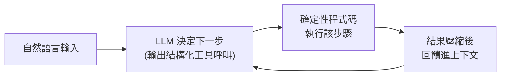

# 12-Factor Agents:打造可上線、可靠的 LLM 代理

**主題分類:** AI / Agentic Engineering(代理工程)
**研究對象:** [humanlayer/12-factor-agents](https://github.com/humanlayer/12-factor-agents)
**內容性質:** 已 `git clone` 讀完整原始碼(含 `create-12-factor-agent` 範本)後整理
**整理日期:** 2026-05-25

---

## 1. 核心理念

這份方法論(致敬經典的「12-Factor App」)要回答一個問題:

> **「我們能用哪些原則建構 LLM 驅動的軟體,使其可靠到足以交付給生產客戶?」**

關鍵觀點:**最好的生產級 agent 不是「一段 prompt + 一組工具 + 迴圈跑到完成」**,而是 **大量普通軟體工程 + 少量精心設計的 LLM 步驟**。許多框架能輕鬆做到 80% 品質,但要再往上,往往得反向工程整個框架——因此作者主張採用 **小型、模組化** 的代理設計,把這些概念嵌進既有產品,而非全盤押注一個框架。



---

## 2. 十二條原則

| # | Factor | 核心主張 |
|---|---|---|
| 1 | **自然語言轉工具呼叫** | 把 LLM 的自然語言輸出轉成結構化工具呼叫;這是代理迴圈的基礎。 |
| 2 | **掌握你的提示詞** | 擁有並控制自己的 prompt,不被框架預設值綁住。 |
| 3 | **掌握你的上下文窗口** | 主動決定哪些資訊相關、如何組織、何時修剪,以最佳化成本與品質。 |
| 4 | **工具只是結構化輸出** | 工具呼叫本質是「要 LLM 以特定格式輸出資料」,不是神奇的 RPC。 |
| 5 | **統一執行狀態與業務狀態** | 讓迴圈進度與真實業務資料同步,不要把狀態藏在框架裡。 |
| 6 | **用簡單 API 啟動/暫停/恢復** | 支援中斷與從精確點續跑,以應對人為介入、外部事件或故障。 |
| 7 | **用工具呼叫聯繫人類** | 把「要求批准/澄清」當成一種工具呼叫,代理可以「找人」而不是直接失敗。 |
| 8 | **掌握你的控制流** | 自己寫清楚的條件、迴圈、狀態機,不依賴框架隱性控制流,方便除錯。 |
| 9 | **把錯誤壓縮進上下文** | 出錯時萃取精煉、可操作的訊息回饋,而非整段 stack trace,讓模型能從中學習。 |
| 10 | **小型、聚焦的代理** | 單一職責的小代理,而非全能代理;提高可靠、可測、可維護性。 |
| 11 | **從任何地方觸發、回到使用者所在處** | 可由 webhook/cron/API/訊息佇列觸發,結果送回 Slack/email/App 內。 |
| 12 | **把代理設計成無狀態 reducer** | 相同初始狀態 + 相同事件 → 相同結果(純函數),簡化測試、重試與並列化。 |

---

## 2.5 官方範本如何把 12 factors 變成程式(clone 讀碼後整理)

repo 的 `packages/create-12-factor-agent/template/` 是一個 **可跑的計算機 + 客服 agent**,用 TypeScript + **BAML**(把 prompt/schema 當程式管理),幾乎逐條對應理念:

- **狀態統一(F5)+ 無狀態 reducer(F12):** 核心是一個 `Thread { events: Event[] }` 的 **事件日誌**;`agentLoop(thread) → thread` 就是對事件做 reduce 的純函數,執行進度與業務資料 **都在同一條 thread**。
- **工具=結構化輸出(F4)+ 自然語言轉工具呼叫(F1):** BAML 函式 `DetermineNextStep(thread) → HumanTools | CalculatorTools | CustomerSupportTools` 回傳 **union 型別**;每個工具是一個帶 `intent` 的 class(如 `AddTool`、`ProcessRefund`)。模型的「下一步」就是吐出這個結構。
- **掌握 prompt(F2)+ 掌握上下文(F3):** prompt 整段寫在 `agent.baml` 裡(完全自有);`thread.serializeForLLM()` 把事件渲染成 `<intent>…</intent>` 的 XML 標籤,**明確控制模型看到什麼**。
- **掌握控制流(F8):** `agentLoop` 是一個 **顯式 while + switch(nextStep.intent)**——沒有隱藏框架邏輯;一眼就能除錯。
- **用工具聯繫人類(F7):** `ClarificationRequest`、`DoneForNow`、`RequestApprovalFromManager` 本身就是「工具」;`divide` 與 `process_refund` 這類「危險動作」會 **直接 return 等人類核准** 才繼續。
- **啟動/暫停/恢復(F6)+ 從任何地方觸發(F11):** `FileSystemThreadStore` 把 thread 存成 `.threads/<uuid>.json`(可換 redis/sqlite/postgres),`server.ts` 用 Express 接 webhook、整合 **HumanLayer SDK**,從 email/Slack 收 `human_contact.completed`、`function_call.completed`(approved/rejected)事件再 **恢復同一條 thread** 跑下去。

真實程式碼(`agent.ts`,精簡):
```ts
export async function agentLoop(thread: Thread): Promise<Thread> {
  while (true) {
    const nextStep = await b.DetermineNextStep(thread.serializeForLLM()); // 自然語言→結構化
    thread.events.push({ type: "tool_call", data: nextStep });
    switch (nextStep.intent) {
      case "done_for_now":
      case "request_more_information":
      case "request_approval_from_manager":
        return thread;                       // 交回給人類
      case "divide":
        return thread;                       // 危險動作:等人類核准
      case "add": case "subtract": case "multiply":
        thread = await handleNextStep(nextStep, thread);  // 安全動作:直接執行、結果入事件
    }
  }
}
```

---

## 2.6 應用案例:一筆「需要人類核准」的客服退款

以範本的客服工具 `ProcessRefund`(其 `@description` 明寫「處理退款前一定要先請主管核准」)為例,一條 thread 會這樣演進:

1. `<user_input>幫訂單 A-123 退款 $40,商品破損</user_input>` 進來,`create()` 存成 `.threads/<uuid>.json`。
2. `DetermineNextStep` 判斷 → 先回 `RequestApprovalFromManager`(因為退款需核准)→ `agentLoop` **return**,程式 **暫停**。
3. server 透過 HumanLayer 把核准請求送到 **主管的 Slack**。
4. 主管在 Slack 按核准 → webhook `function_call.completed {approved:true}` 進來 → `get(uuid)` 還原 thread、把核准事件 push 進去 → 再次 `agentLoop` **恢復**。
5. 這次 `DetermineNextStep` 回 `ProcessRefund` → 執行退款 → 最後 `DoneForNow("已為 A-123 退款 $40")`。

> 同一段邏輯換成計算機就是 `multiply 3 4 → divide by 2 → add 12`(範本的 `LongMath` 測試),`divide` 那步同樣會停下等核准——**展示了 F5/F6/F7/F8/F12 如何在一條事件流上同時運作**。

---

## 3. 與其他筆記的關聯

- **Factor 2/3/9(掌握 prompt、上下文、壓縮錯誤)** 與 [[claude-md-12-rules]] 的「token 預算」「先讀懂周邊程式碼」同源。
- **Factor 1/4(工具呼叫=結構化輸出)** 正是 [[ai-harness-explained]] 中「harness = 模型權重以外的一切」的具體展開。
- **Factor 10(小型聚焦代理)** 是 [[nexus-time-series]] 多代理拆分設計的理論依據。

> 一句話總結作者的設計哲學:**從代理建構中擷取小型、模組化的概念,嵌入既有產品**——這能讓沒有 AI 背景的一般工程師也用得上,並避開「全盤採用框架後卡在最後 20%」的陷阱。

---

## 來源

- [humanlayer/12-factor-agents (GitHub)](https://github.com/humanlayer/12-factor-agents)
