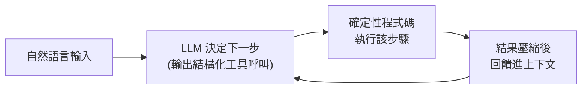

# 12-Factor Agents:打造可上線、可靠的 LLM 代理

**主題分類:** AI / Agentic Engineering(代理工程)
**研究對象:** [humanlayer/12-factor-agents](https://github.com/humanlayer/12-factor-agents)
**整理日期:** 2026-05-25

---

## 1. 核心理念

這份方法論(致敬經典的「12-Factor App」)要回答一個問題:

> **「我們能用哪些原則建構 LLM 驅動的軟體,使其可靠到足以交付給生產客戶?」**

關鍵觀點:**最好的生產級 agent 不是「一段 prompt + 一組工具 + 迴圈跑到完成」**,而是 **大量普通軟體工程 + 少量精心設計的 LLM 步驟**。許多框架能輕鬆做到 80% 品質,但要再往上,往往得反向工程整個框架——因此作者主張採用 **小型、模組化** 的代理設計,把這些概念嵌進既有產品,而非全盤押注一個框架。

---

## 2. 十二條原則

| # | Factor | 核心主張 |
|---|---|---|
| 1 | **自然語言轉工具呼叫** | 把 LLM 的自然語言輸出轉成結構化工具呼叫;這是代理迴圈的基礎。 |
| 2 | **掌握你的提示詞** | 擁有並控制自己的 prompt,不被框架預設值綁住。 |
| 3 | **掌握你的上下文窗口** | 主動決定哪些資訊相關、如何組織、何時修剪,以最佳化成本與品質。 |
| 4 | **工具只是結構化輸出** | 工具呼叫本質是「要 LLM 以特定格式輸出資料」,不是神奇的 RPC。 |
| 5 | **統一執行狀態與業務狀態** | 讓迴圈進度與真實業務資料同步,不要把狀態藏在框架裡。 |
| 6 | **用簡單 API 啟動/暫停/恢復** | 支援中斷與從精確點續跑,以應對人為介入、外部事件或故障。 |
| 7 | **用工具呼叫聯繫人類** | 把「要求批准/澄清」當成一種工具呼叫,代理可以「找人」而不是直接失敗。 |
| 8 | **掌握你的控制流** | 自己寫清楚的條件、迴圈、狀態機,不依賴框架隱性控制流,方便除錯。 |
| 9 | **把錯誤壓縮進上下文** | 出錯時萃取精煉、可操作的訊息回饋,而非整段 stack trace,讓模型能從中學習。 |
| 10 | **小型、聚焦的代理** | 單一職責的小代理,而非全能代理;提高可靠、可測、可維護性。 |
| 11 | **從任何地方觸發、回到使用者所在處** | 可由 webhook/cron/API/訊息佇列觸發,結果送回 Slack/email/App 內。 |
| 12 | **把代理設計成無狀態 reducer** | 相同初始狀態 + 相同事件 → 相同結果(純函數),簡化測試、重試與並列化。 |

---

## 3. 與其他筆記的關聯

- **Factor 2/3/9(掌握 prompt、上下文、壓縮錯誤)** 與 [[claude-md-12-rules]] 的「token 預算」「先讀懂周邊程式碼」同源。
- **Factor 1/4(工具呼叫=結構化輸出)** 正是 [[ai-harness-explained]] 中「harness = 模型權重以外的一切」的具體展開。
- **Factor 10(小型聚焦代理)** 是 [[nexus-time-series]] 多代理拆分設計的理論依據。

> 一句話總結作者的設計哲學:**從代理建構中擷取小型、模組化的概念,嵌入既有產品**——這能讓沒有 AI 背景的一般工程師也用得上,並避開「全盤採用框架後卡在最後 20%」的陷阱。

---

## 來源

- [humanlayer/12-factor-agents (GitHub)](https://github.com/humanlayer/12-factor-agents)
