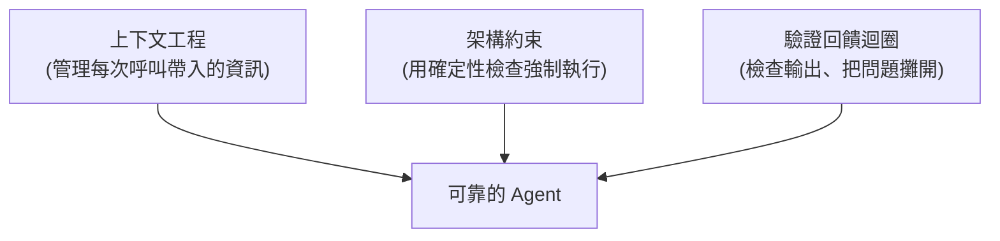

# 什麼是 AI Harness?兩種「harness」的差別

**主題分類:** AI / Agentic Engineering(代理工程)
**來源對象:**
- [TejasQ/basically-ai-harness](https://github.com/TejasQ/basically-ai-harness)(AI Engineer World's Fair 演講範例碼;**已 clone 讀完整原始碼**)
- YouTube:「AI Agent 工作原理是什麼,Harness 又是什麼,一個動畫徹底搞懂!」(僅取得標題,該影片無字幕)
**整理日期:** 2026-05-25

---

## 1. 一句話定義

> **「一個 AI harness 就是除了模型權重以外的一切。」**

也就是:工具介面、上下文管理、護欄(guardrails)、驗證步驟、恢復迴圈——這些把一個「會講話的模型」變成「能在真實世界做事的系統」的全部鷹架。

---

## 2. 兩種容易被混淆的 harness

`basically-ai-harness` 這個最小化 TypeScript 範例,核心目的就是釐清「harness」這個詞的兩種截然不同含義:

| 特性 | 評估型 harness(eval,約 2021) | 智能體型 harness(agent,約 2026) |
|---|---|---|
| 目標 | 用已知答案 **測量模型品質** | 在真實世界中 **賦予模型行動能力** |
| 工具 | 不需要 | 必需 |
| 狀態 | 無狀態 | 對話歷史跨輪次保留 |
| 輸出 | 通過/失敗分數 | 答案 + 工具呼叫日誌 |

---

## 3. Harness Engineering 的三大組件



1. **上下文工程** —— 決定每次呼叫帶入/排除哪些資訊:**隔離**(子任務分開)、**縮減**(丟掉過時資料避免 context rot)、**檢索**(在對的時機注入新文件/搜尋結果)。
2. **架構約束** —— 不只靠模型,而是用 **確定性的 linter、結構測試、護欄** 強制(模型繞不過)。
3. **驗證回饋迴圈** —— harness 檢查輸出、跑 eval,出錯就攤開讓 agent 或工程師修。

**關鍵設計決策:** harness 自己擁有並管理「環境的生命週期」,工具不直接管環境,以確保清楚的隔離與控制流。

**核心金句:** 「護欄(guardrails)抓的是結構性失敗,驗證(validation)抓的是錯誤答案——**兩者都不可少**。」

### 名詞由來與重量級背書(讀 README 後補)
- **「harness engineering」一詞** 在 **2026 年 2 月** 由 HashiCorp 共同創辦人、Terraform 作者 **Mitchell Hashimoto** 命名:**「每當 agent 犯錯,你就改造環境,讓它下次不會再犯。」**
- 數天後 **OpenAI** 用同一說法描述其內部 beta 產品:**約 100 萬行程式碼、全由 agent 寫、5 個月交付、無一行人工原始碼**。他們的洞見:出錯時的修法幾乎從來不是「再加把勁」,而是問 **「缺了什麼能力?怎麼讓它對 agent 既可讀又可強制?」**
- 一句話總結:**「The harness is the moat. The model is rented.」**(harness 才是護城河,模型是租來的。)

---

## 4. 原始碼結構(讀 clone 後整理)

```bash
cp .env.example .env      # 填入 OPENROUTER_API_KEY
npm install
npx playwright install chromium
npm run eval              # 跑評估型 harness
npm run agent             # 跑智能體型 harness
```

兩種 harness 各放一個資料夾,刻意以「編號檔名」呈現管線順序:

**`eval/`(`dataset → model → scorer → pass/fail → summary`)**
| 檔 | 作用 |
|---|---|
| `1-dataset.ts` | 固定測試集,**刻意設計來觸發常見幻覺**(「顯而易見」的答案通常是錯的)。 |
| `2-model.ts` | 呼叫任一 OpenRouter 模型,回傳字串。 |
| `3-scorers.ts` | `exactMatch`/`contains`/`keywords`,比較前先正規化(「Three」→「3」)。 |
| `4-runner.ts` | 逐題評分,追蹤模型有沒有掉進陷阱答案。 |
| `5-index.ts` | 多模型對同一資料集跑,印出並排比較。 |

**`agent/`(`task → [tools + context + guardrails + loop + verify] → result`)**
| 檔 | 作用 |
|---|---|
| `1-tools.ts` | `createTools(session)`——工具 **綁定到 harness 給的環境**,不是去抓全域。 |
| `2-model.ts` | 用 OpenAI SDK 接 OpenRouter,**換模型只改一個字串**。 |
| `3-context.ts` | `createContext(task)` 建初始 messages(system + user),並修剪舊訊息防 context rot。 |
| `4-guardrails.ts` | 可組合的安全檢查(最大迭代數、最大訊息數),每輪迴圈前先跑。 |
| `5-loop.ts` | agent 迴圈:呼叫模型 → 用工具 → 餵回結果 → 重複,直到模型給答案或護欄觸發。 |
| `6-harness.ts` | harness 本體:**開環境 → 建工具 → 跑迴圈 → 驗證答案 → 關環境**。 |
| `browser.ts` | 環境本身:一個 `BrowserSession`,每次 harness run 一個獨立瀏覽器頁。 |

> 註:repo 裡 `6-harness.ts`、`4-guardrails.ts` 是 **留白骨架**(演講現場填),其組裝邏輯可從 `7-index.ts` 看到。

### `5-loop.ts` 的迴圈核心(真實程式碼)
```ts
while (true) {
  const response = await client.chat.completions.create({ model, messages, tools: tools.definitions });
  const choice = response.choices[0];
  messages.push(choice.message);                 // 狀態:對話歷史持續累積
  if (choice.finish_reason === "stop") return { answer: ..., stoppedBy: "model" };
  if (choice.finish_reason === "tool_calls") {
    for (const call of choice.message.tool_calls ?? []) {
      const tool = tools.byName.get(call.function.name);
      const result = tool ? await tool.execute(JSON.parse(call.function.arguments)) : `Unknown tool`;
      messages.push({ role: "tool", tool_call_id: call.id, content: result });  // 結果餵回 context
    }
  }
}
```
每輪都記 `contextSize`(messages 數),所以能 **親眼看到 context 隨工具呼叫變大**。

### harness「擁有環境」才是關鍵(`7-index.ts`)
```ts
const session = new BrowserSession();
try {
  await session.open();                 // harness 開環境
  const tools = createTools(session);   // 工具綁定到這個 session
  const messages = createContext(TASK); // 這個任務的全新 context
  const result = await runLoop(MODEL, messages, tools);  // 迴圈在環境裡跑
} finally {
  await session.close();                // 無論成敗都關環境
}
```
**工具不管瀏覽器生命週期**,harness 開、harness 關——這正是「在背後管理 I/O」的真義,也是「真 harness」與「只是一個帶工具的迴圈」的分野。

---

## 4.5 應用案例:同一任務,兩個模型的對照

demo 任務需要 **即時網路資料**:「去 https://news.ycombinator.com,告訴我現在第 1 名的確切標題與目前分數。」對兩個模型各開一個瀏覽器 session 跑:

- **會用工具的模型(如 `gpt-4o-mini`):** iter1 呼叫 `browser_navigate` + `browser_get_text` 拿到真實頁面 → iter2 回答「"Some Title" with 847 points」→ **Verify ✓ PASS**。
- **跳過工具的模型(如某 free 模型):** iter1 直接 **幻覺** 出「"Some Made-Up Title" with 312 points」→ **Verify ✗ FAIL**。

這一個對照同時讓三件事可見:**工具**(一個開真瀏覽器、一個瞎掰)、**上下文**(訊息數隨工具呼叫成長)、**驗證**(兩者都沒觸發護欄、表面都「成功」,**只有 verify 步驟抓到語意錯誤**)。→ 再次印證:**護欄抓結構性失敗,verify 抓錯答案,兩者缺一不可。**

(repo 另一個 `agent/7-index.ts` 的任務更進階:要 agent **在 HN 上對「排名最高、尚未投票」的故事按 upvote**,用精確 selector `a[id="up_STORYID"]`——示範工具如何真正改變外部世界狀態。)

---

## 5. 為什麼重要

「能力的進化」可看成三層遞進,而 harness engineering 是當前最上層:

> prompt engineering → context engineering → **harness engineering**

理解 harness,才知道為什麼 [[12-factor-agents]] 強調「大量普通軟體 + 少量 LLM 步驟」,以及 [[claude-md-12-rules]] 為何把「驗證」「揭露失敗」「遵從慣例」寫成硬規則。

---

## 來源

- [TejasQ/basically-ai-harness (GitHub)](https://github.com/TejasQ/basically-ai-harness)
- [YouTube:AI Agent 工作原理是什麼,Harness 又是什麼](https://youtu.be/B91bZL8wcAI)(非逐字稿,僅標題)
