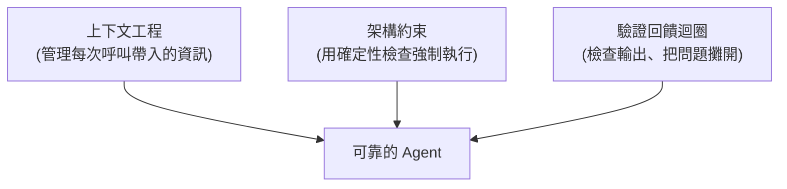

# 什麼是 AI Harness?兩種「harness」的差別

**主題分類:** AI / Agentic Engineering(代理工程)
**來源對象:**
- [TejasQ/basically-ai-harness](https://github.com/TejasQ/basically-ai-harness)(AI Engineer World's Fair 演講範例碼)
- YouTube:「AI Agent 工作原理是什麼,Harness 又是什麼,一個動畫徹底搞懂!」(僅取得標題,逐字稿在本環境無法抓取)
**整理日期:** 2026-05-25

---

## 1. 一句話定義

> **「一個 AI harness 就是除了模型權重以外的一切。」**

也就是:工具介面、上下文管理、護欄(guardrails)、驗證步驟、恢復迴圈——這些把一個「會講話的模型」變成「能在真實世界做事的系統」的全部鷹架。

---

## 2. 兩種容易被混淆的 harness

`basically-ai-harness` 這個最小化 TypeScript 範例,核心目的就是釐清「harness」這個詞的兩種截然不同含義:

| 特性 | 評估型 harness(eval,約 2021) | 智能體型 harness(agent,約 2026) |
|---|---|---|
| 目標 | 用已知答案 **測量模型品質** | 在真實世界中 **賦予模型行動能力** |
| 工具 | 不需要 | 必需 |
| 狀態 | 無狀態 | 對話歷史跨輪次保留 |
| 輸出 | 通過/失敗分數 | 答案 + 工具呼叫日誌 |

---

## 3. Harness Engineering 的三大組件



1. **上下文工程** —— 管理每次呼叫包含哪些資訊。
2. **架構約束** —— 透過確定性檢查強制執行規則。
3. **驗證回饋迴圈** —— 檢查輸出並把問題顯露出來。

**關鍵設計決策:** harness 自己擁有並管理「環境的生命週期」,工具不直接管環境,以確保清楚的隔離與控制流。

**核心金句:** 「護欄(guardrails)抓的是結構性失敗,驗證(validation)抓的是錯誤答案——**兩者都不可少**。」

---

## 4. 範例專案結構

```bash
cp .env.example .env      # 填入 OpenRouter API key
npm install
npx playwright install chromium
npm run eval              # 跑評估型 harness
npm run agent             # 跑智能體型 harness
```

- `eval/`:固定測試集評估,5 階段(資料集 → 模型 → 評分 → 通過/失敗 → 總結)。
- `agent/`:任務執行環境(工具、模型、上下文、護欄、迴圈、驗證)。

---

## 5. 為什麼重要

「能力的進化」可看成三層遞進,而 harness engineering 是當前最上層:

> prompt engineering → context engineering → **harness engineering**

理解 harness,才知道為什麼 [[12-factor-agents]] 強調「大量普通軟體 + 少量 LLM 步驟」,以及 [[claude-md-12-rules]] 為何把「驗證」「揭露失敗」「遵從慣例」寫成硬規則。

---

## 來源

- [TejasQ/basically-ai-harness (GitHub)](https://github.com/TejasQ/basically-ai-harness)
- [YouTube:AI Agent 工作原理是什麼,Harness 又是什麼](https://youtu.be/B91bZL8wcAI)(非逐字稿,僅標題)
