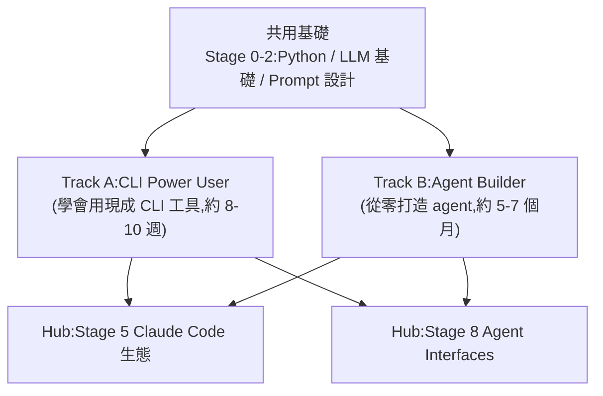

# awesome-agentic-ai-zh:從 LLM 新手到多代理系統設計者的中文學習路線

**主題分類:** AI / Agentic Engineering(代理工程)
**研究對象:** [WenyuChiou/awesome-agentic-ai-zh](https://github.com/WenyuChiou/awesome-agentic-ai-zh)
**整理日期:** 2026-05-25

---

## 1. 定位

一份 **三語(繁中/簡中/英文)的結構化學習路線圖**,目標是把初學者從「LLM 基礎概念」一路帶到「能設計多代理系統」。和一般 awesome list 不同,它強調 **從概念進階到實作**,每階段都搭配動手練習而非純理論。

---

## 2. 架構:8 階段 + 2 條學習路徑

- **共用基礎(Stage 0-2):** Python、LLM 基礎、Prompt 設計。
- **Track A(CLI Power User):** 3 個子階段,學會運用現成 CLI 工具,約 8-10 週。
- **Track B(Agent Builder):** 5 個主階段,從零打造 agent 系統,約 5-7 個月。
- **兩個共用 Hub:** Stage 5(Claude Code 生態)、Stage 8(Agent Interfaces)。

---

## 3. 資源規模

- **145+ 個精選項目**(含星等評分、適用對象、執行方式)。
- **62 個 MCP / Skill 目錄**。
- **23 個動手練習資料夾**。
- **5 條延伸路線**:研究員、開發者、教師、知識工作者、日常使用者。

**關鍵資源檔:** 環境設置指南(30-45 分鐘入門)、用語詞彙表(30+ 術語)、烹飪書式教程(怎麼寫 MCP server / Skill)、CLI 工具對照指南、Schema 設計規則表。

---

## 4. 核心觀念:能力的三層進化

> prompt engineering → context engineering → **harness engineering**

每一層都配實作練習。這條主線與本 repo 的 [[ai-harness-explained]]、[[12-factor-agents]] 完全一致,可當作系統性自學的索引。

---

## 來源

- [WenyuChiou/awesome-agentic-ai-zh (GitHub)](https://github.com/WenyuChiou/awesome-agentic-ai-zh)
