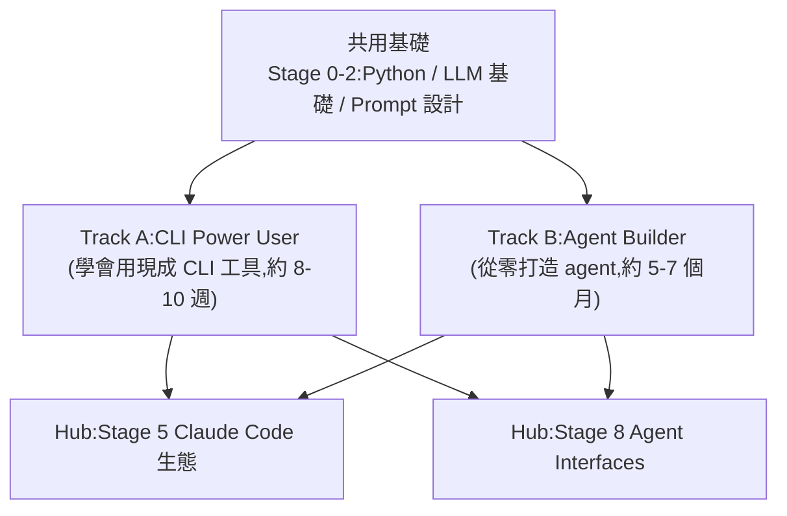

# awesome-agentic-ai-zh:從 LLM 新手到多代理系統設計者的中文學習路線

**主題分類:** AI / Agentic Engineering(代理工程)
**研究對象:** [WenyuChiou/awesome-agentic-ai-zh](https://github.com/WenyuChiou/awesome-agentic-ai-zh)
**內容性質:** 已 `git clone` 讀完實際 repo 結構(stages/ tracks/ examples/ 等)後整理、修正先前摘要的數字
**整理日期:** 2026-05-25

---

## 1. 定位

一份 **三語(繁中/簡中/英文)的結構化學習路線圖**,目標是把初學者從「LLM 基礎概念」一路帶到「能設計多代理系統」。和一般 awesome list 不同,它強調 **從概念進階到實作**,每階段都搭配動手練習而非純理論。

---

## 2. 架構:8 階段 + 2 條學習路徑

- **共用基礎(Stage 0-2):** `stages/00-foundations`(Python/CLI/git/API/JSON)、`01-llm-basics`(token/各家 LLM/本地 LLM)、`02-prompt-engineering`(system prompt/few-shot/CoT)。
- **Track A(CLI Power User,`tracks/cli/`):** A1 選並開始用 CLI agent → A2 建可重用工作流(CLAUDE.md / slash command)→ A3 接進生產(MCP 接 CLI / CI / 成本與可觀測)。約 **8-10 週**。
- **Track B(Agent Builder,`stages/03-07`):** Stage 3 tool use + ReAct 第一個 agent ⭐ → 4 框架(LangGraph/AutoGen/CrewAI/Smolagents)→ 6 記憶與 RAG → 7 多代理與生產 → **7.5** 進階概念(PAR loop、agent-as-judge,純閱讀不寫碼)。主幹最少 **16-22 週、現實 5-7 個月**(每週 5-8 hr)。
- **兩個共用 Hub:** **Stage 5 Claude Code 生態**(MCP/Skills/Plugins/Subagents)、**Stage 8 Agent Interfaces**(Computer Use/Browser Use/Code Sandbox);兩條 track 都會用到,但「用 vs build」視角不同。

> 修正:先前摘要把練習數寫成 23,實際 `examples/` 下約 **27 個練習資料夾**;每個練習是 70-150 行 starter + **dual-path(Ollama / Anthropic SDK 對照)** + mock-based test。

---

## 3. 資源規模(以實際 repo 為準)

- **145+ 個精選項目**(含星等、適合誰、教什麼、怎麼跑;含本地 LLM:Ollama、llama.cpp、LocalAI、MLX)。
- **62 個 MCP / Skill 目錄**(含中文 AI 生態 DeepSeek / Zhipu / Kimi)。
- **約 27 個動手練習資料夾**(`examples/stage-*/...`)。
- **5 條延伸路線**(`branches/`):研究員、開發者、教師、知識工作者、日常使用者。
- **三語完整維護**:繁中(canonical)/ 簡中 / English,每個檔都有 `.md` / `.zh-Hans.md` / `.en.md` 三版。

**關鍵資源檔:** `resources/setup-guide.md`(30-45 分鐘從零到第一個 hello-world)、`resources/glossary.md`(術語中英對照)、`walkthroughs/build-first-agent-in-7-steps.md`(跨 stage 完整範例)、`resources/cli-agents-guide.md`(CLI 工具對照)。

---

## 3.5 應用案例:兩個可直接照做的練習

- **Stage 1 / `04-cross-provider`(入門級):** `starter.py` 把同一個 prompt(「用 1-2 句話解釋 AGI 跟 narrow AI 的差別」)同時送 Claude / GPT / Gemini,印出 **provider、model、token 數、延遲** 的對照表,**缺哪家 key 就 skip 哪家不 crash**;`test.py` 用 mock 不打 API。→ 對應筆記 [[function-calling-mcp-a2a]] 的「選對模型做對任務」。
- **跨 Stage 走查 `build-first-agent-in-7-steps`(進階):** 同一個 **Paper Summary Bot**,從 Stage 1 一路寫到 Stage 7、約 **350 行真實程式碼**——展示「tool use → 框架 → 記憶/RAG → 多代理」如何在一個專案裡疊起來(Track B 適用)。

---

## 4. 核心觀念:能力的三層進化

> prompt engineering → context engineering → **harness engineering**

每一層都配實作練習。這條主線與本 repo 的 [[ai-harness-explained]]、[[12-factor-agents]] 完全一致,可當作系統性自學的索引。

---

## 來源

- [WenyuChiou/awesome-agentic-ai-zh (GitHub)](https://github.com/WenyuChiou/awesome-agentic-ai-zh)
