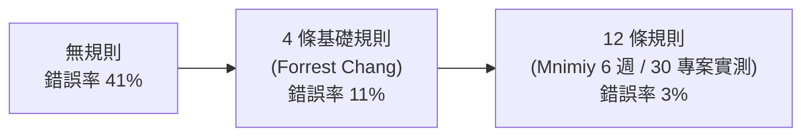

# 用 12 條 CLAUDE.md 規則把 AI 編碼錯誤率從 41% 壓到 3%

**主題分類:** AI / Agentic Engineering(代理工程)
**內容性質:** 文章重點整理
**來源:** 數位時代 bnext 報導
**整理日期:** 2026-05-25

---

## 1. 摘要

這篇報導講的是:用一份只有 **12 條行為規則** 的 `CLAUDE.md`(放在專案根目錄、會被 Claude Code 自動讀取的指令檔),把 AI 在編碼任務上的 **錯誤率從 41% 壓到 3%**,而代理對規則的 **遵循度只從 78% 微降到 76%**——用極小的代價換到巨幅的可靠度提升。

核心精神:好的 agent 指令檔不是「塞滿範本」,而是 **每一條規則都對應一個你實際踩過的坑**。

---

## 2. 問題起源:AI 編碼的三個老毛病

OpenAI 共同創辦人 Karpathy 在 2026 年初點出 AI 編碼最常見的三個缺失:

1. **不確定時自行假設**,而不是停下來發問。
2. **過度複雜化** 簡單問題。
3. 修改程式時 **「順手整理」無關的程式碼**,造成額外風險。

12 條規則正是針對這類行為設計的「護欄」。

---

## 3. 兩階段演進

- **第一階段:** 工程師 Forrest Chang 整理 4 條基礎規則,錯誤率 41% → 11%,在 GitHub 獲超過 12 萬星。
- **第二階段:** 開發者 Mnimiy 經 6 週、30 個專案實測,擴充到 12 條規則,再降到 3%。

---

## 4. 12 條規則全文重點

### 原有 4 條(基礎)

| # | 規則 | 核心主張 |
|---|---|---|
| 1 | **寫程式前先思考** | 釐清假設、拒絕猜測,遇到不清楚立即停下發問。 |
| 2 | **簡單至上** | 只用最少的程式碼解決當下問題,嚴格拒絕過度工程化。 |
| 3 | **手術式修改** | 只改必要部分,不「順手改善」周邊程式碼。 |
| 4 | **目標導向執行** | 把任務轉成可驗證的具體目標,建立檢查點計畫。 |

### 新增 8 條(擴充)

| # | 規則 | 核心主張 |
|---|---|---|
| 5 | **只讓 AI 做需要判斷力的事** | 用於分類、摘要、草擬;禁用於狀態碼判斷、API 重試、路由分配等該由確定性程式碼處理的事。 |
| 6 | **強制設定詞元預算** | 例:per-task 4,000 tokens、per-session 30,000 tokens,逼近預算時先摘要再重啟。 |
| 7 | **衝突要攤開講,禁止混合寫法** | 兩種相衝寫法並存時,選較新/測試完整的那個,並標記另一種待清理。 |
| 8 | **寫程式前先讀懂周邊程式碼** | 新增程式前先讀 exports、直接呼叫者、共用工具。 |
| 9 | **測試要驗證「為什麼」,不只「有沒有」** | 測試要編碼商業邏輯的 WHY;若邏輯改變時測試不會失敗,該測試無效。 |
| 10 | **多步驟任務每完成一步就回報** | 每步結束:總結已做、已驗證、剩餘;不可從無法描述的狀態繼續。 |
| 11 | **遵從現有慣例,不偷渡新風格** | 即使自認更好,也要完全配合既有命名/架構。 |
| 12 | **主動揭露錯誤,禁止隱性失敗** | 不確定是否成功就必須明講;若有步驟被跳過卻回報「完成」即為錯誤。 |

---

## 5. 實測三大發現

1. **錯誤率兩階段驟降:** 41% → 11% → 3%。
2. **遵循度幾乎無損:** 78% → 76%,微小代價換到 8 個百分點的錯誤率下降。
3. **注意力預算互不衝突:** 原 4 條與新 8 條觸發於不同情境,不會互相搶佔模型的注意力預算。

---

## 6. 常見提示詞的「毒藥」(反面教材)

- **範例放太多會吃掉預算:** 3 個範例的詞元量 ≈ 約 10 條抽象規則,還會讓 AI 過度擬合那幾個例子。
- **情緒喊話與角色扮演無效:** 「仔細思考」「像資深工程師一樣」這類無法驗證的指令,會讓遵循度暴跌到約 30%。
- **綁死特定工具的死指令:** 規定一定要用某工具,在該工具缺失時會默默失效。

---

## 7. 關鍵洞察(可直接套用)

- 「一份針對真實痛點的 6 條規則,勝過裝滿用不到的 12 條範本。」
- 12 條整體合規率約 76%:對 **結構明確的重構任務** 效果顯著,對 **創意探索型** 工作幫助有限。
- 每寫一條規則前先自問:**「這能防止我實際遇過的什麼錯誤?」**

> 對照本 repo:這套理念與 `technology/agentic-engineering/12-factor-agents.md`(掌握提示、掌握上下文、把錯誤壓縮進上下文)、以及 `technology/ai-token-saving/`(token 預算)高度呼應。

---

## 8. 應用案例:把規則用在一次真實重構

**情境:** 請 Claude Code 把一支 800 行的舊服務拆成小模組。

- 模型一開始想「順手」把日誌格式也統一 → **規則 3(手術式修改)** 擋下:只改被要求的部分。
- 遇到某個函式參數語意不明 → **規則 1**:停下來問,而不是猜一個預設值。
- 它發現程式裡同時有 `fetch` 與 `axios` 兩種寫法 → **規則 7**:選測試較完整的那個、標記另一種待清理,而不是混用。
- 每拆完一個模組就照 **規則 10** 回報「已做/已驗證/剩餘」,並照 **規則 11** 沿用既有命名,不偷渡新風格。
- 寫測試時照 **規則 9**:測「為什麼這樣拆後行為不變」,而非只測「有沒有跑過」。
- 全程設 **規則 6** 的 token 預算,逼近上限就先摘要再繼續。

> 落地心法(來自第 7 節):**先別套滿 12 條**,挑你團隊「實際踩過的坑」對應的幾條寫進 `CLAUDE.md`,效果好過抄一份用不到的範本。可與 [[12-factor-agents]] 的「掌握 prompt/上下文」一起用。

---

## 來源

- [數位時代:CLAUDE.md 12 條規則,把 AI 編碼錯誤率從 41% 降到 3%](https://www.bnext.com.tw/article/90965/claude.md-claude-code)
