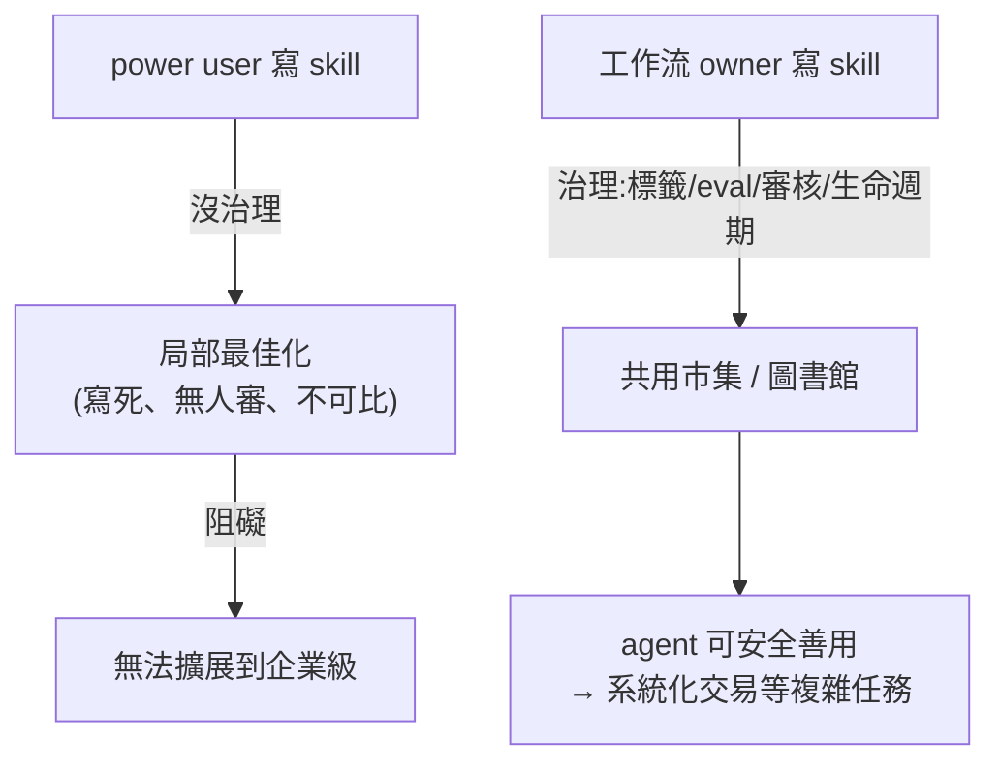

# 讓訊號自己交易:Man Group 用 Claude Skills 治理打通系統化交易

**主題分類:** AI / Agentic Engineering(代理工程)× 企業導入
**來源:** YouTube〈Building signals that trade themselves〉(Claude 官方頻道,講者 Tashara Fernando,Man Group 資料與 AI 主管;2026-05-21,約 20 分;依完整逐字稿整理)
**整理日期:** 2026-05-27

---

## 1. 背景與成果

Man Group 是管理 **超過 $2,000 億** 資產的另類投資管理公司,客戶是退休基金、主權基金等(「加拿大的老師、日本的金屬工人」的退休金)——**做錯會賠真錢,風險極高**。其核心業務之一是 **系統化交易**(橫跨數千檔證券、數百個市場的演算法交易)。

**重磅成果:已有由 AI 研究、回測、提案的交易訊號,在這家受監管的公司用真實資本在生產環境運行。** AI 負責:想出點子 → 取資料 → 跑回測 → 寫策略提案 → 產品化訊號;**人類審核每個輸出** 確保合理。(具體是什麼訊號?賺多少?「那是我們的 IP,不會說。」)

> 講者的重點不是那個訊號,而是 **讓這一切成為可能的基礎**——而基礎的關鍵字是 **Skills 治理**。

---

## 2. 什麼是交易訊號(夢幻足球比喻)

訊號就像挑夢幻足球隊:依某種策略把球員(股票)排序,先發(做多)、替補/不要(做空)。例:用「過去 3 個月報酬」把股票排序,再 **拿 15 年以上歷史回測** 看會不會賺。回測產出統計因子:**年化報酬、最大回撤(drawdown)、夏普比率(Sharpe,報酬 vs 波動)**。難點永遠是「**該用什麼因子排序、策略到底有沒有用**」——你無法預知未來,只能用歷史多種總經環境壓力測試。

---

## 3. 核心洞見:冰山與「共用工作流」

> **訊號只是冰山一角;水面下是讓它成真的所有工作流。**

想出訊號是快的部分;難的是底下全部:怎麼清資料、接價格序列、偵測離群值、跑在什麼基礎設施、怎麼跑回測。**若各團隊用不同版本的工作流 → 得到不同答案**:一隊回測超亮眼、另一隊普通,你根本分不清是 **點子比較好** 還是 **量測方式不同**。**共用工作流** 才能讓輸出可比較——這在「比較訊號」的系統化交易裡至關重要。

**Skills 是把「你的超能力(數十年機構知識 + 頂尖技術能力)接給 AI」的連接層。** Claude 開箱很強但 **不認識你的資料/系統/工作流**;教它的方式不是 fine-tune,而是 **給它存取資料、能力、工作流的權限**——靠 Skills。

---

## 4. 踩過的坑:採用很猛,但治理缺位

他們全力衝採用(workshops、hackathon、寫 blog、show-and-tell),採用率爆表。但出現裂縫:**寫 skill 的是「流程的 power user」,不是「流程的 owner」** → 每個 skill 都是 **某個人的局部最佳化,不是組織級解法**。

> **警世案例:** 一位常出差的員工寫了「報帳 skill」(丟收據照片給 Claude 自動產報帳單),分享給同事。幾天後 **業務部門的核准人** 跑來問:「為什麼技術部、HR 的報帳單全跑到我的成本中心要我核准?」——原來那個 skill 把 **成本中心代碼寫死(hardcoded)**,沒人審核過、作者也不需為此負責。「對他能動、對他團隊能動,就以為對所有人都能動」——但事實並非如此。

這在回測/系統化交易這種場景是 **致命問題**,會變成擴展到企業級的阻礙:**agent 無法善用沒有共通性的 skill。**

---

## 5. 解法:Skills 治理 + 共用市集

把 skill 當成 **圖書館** 來經營,捕捉數十年機構知識,分財務/人資/研究等部門:

- 每個 skill **可見、加標籤、用 eval 測試過**。
- **由「工作流 owner」擁有**(不是 power user)。
- **追蹤使用、經審核、有生命週期(含退役)**、所有人都能安裝。

平臺長相(「My Knowledge」= 情境庫):**skill 建議依各業務單位量身**、清楚標示 owner、分成 **managed / community** 兩類;**plugin = 一組 skills**(例:data plugin 給 Man Group 資料集存取),也可單獨安裝某個 skill(如「資料集 skill」搜尋另類資料)。

---

## 6. 應用案例:用 4 個 skill 做出一個信用卡消費訊號(demo)

1. 裝好基礎 skill(`data` plugin、`dataset` skill)。
2. 用 **另類資料集 skill** 問 Claude「有哪些信用卡資料?」→ 找到一份 **美國消費者交易** 資料集。
3. 把 **Amazon 每月信用卡消費** 對 **股價報酬** 畫圖 → 看到 **黑色星期五、聖誕** 的季節性尖峰。
4. **回測**:比對信用卡消費高峰與股票損益 → 訊號 **勝過 buy-and-hold**(2021 投入 $1,000,現值約 $2,500)。
5. 怕是 Amazon 個案僥倖 → 用 **分散式運算**(每家公司一個 worker)在更廣的零售類股上跑,再彙整結果。

> 真實研究遠更細緻(季節性、通膨、更廣證券),由 **agent + 人類** 共同探索。**關鍵:skills 治理確保大家用同一份資料、同一套工作流。**

---

## 7. 三條可帶走的教訓(講者給「過去的自己」)

1. **組織情境(context)就是你的 IP / 護城河——也是 AI 時代少數的安全地帶。** 前沿實驗室不會幫你解決 context:它不在網路上、他們不懂你的工作流;而你已有數十年積累。**工作是「暴露」它,不是重新發明它**;Skills 就是讓這些知識變成槓桿的方式。
2. **把 skill 當生產程式碼對待**(因為它終將變成生產程式碼)。**先規劃再上線**:誰擁有?誰審核?怎麼測?怎麼退役?——在 **第一個** skill 前就決定,而不是像他們等到第 100 個之後。
3. **採用是「人」的問題,不是「授權」的問題。** 平臺到位後要主動推動參與、**重新思考工作流而非只是擴增它**;這是訓練、互動、outreach 的問題。

**規模:** Man Group 約 1,700 人,其中 **750 人** 在用 Claude Code(開發者、quant、人資、財務全departments);**100+ 個受治理 skill + 至少同等數量的 community skill**。願景:**一群(swarm)agent 善用這些 skill 去尋找新投資機會。**

> 與本 repo 關聯:這是 [[markdown-agent-memory]]「組織情境/程序記憶」與 [[ai-harness-explained]]「harness=模型權重以外的一切」在 **企業級** 的真實落地;治理良好的 skill 庫,本質就是 [[12-factor-agents]] 強調的「掌握 prompt/上下文/控制流」的組織版。

---

## 來源

- [YouTube:Building signals that trade themselves(Claude 官方頻道 / Man Group, Tashara Fernando)](https://www.youtube.com/watch?v=EOg4gY0Yln0)
